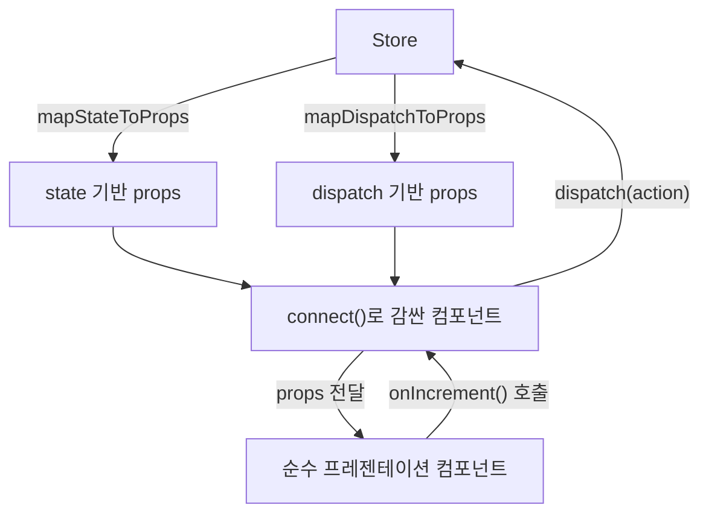

# 11. React-Redux 시작하기 - Provider와 connect

07–09편에서 Store를 직접 만들고 흐름을 추적해봤지만, 아직 React 화면과는 연결하지 않았습니다. Store만 있고 화면과 연결하지 않으면, Redux 상태가 바뀌어도 사용자는 아무것도 볼 수 없습니다. 이 편에서는 **React-Redux** 라이브러리로 Store를 실제 컴포넌트와 잇는 첫 단계를 다룹니다.

## 학습 목표

- `<Provider>`로 Store를 컴포넌트 트리 전체에 전달할 수 있다.
- `connect()`로 컴포넌트를 Store의 상태·dispatch와 연결할 수 있다.
- `mapStateToProps`와 `mapDispatchToProps`의 역할을 구분해 설명할 수 있다.

## Provider: Store를 트리 전체에 전달한다

`<Provider>`는 React의 Context API(10편에서 다룬 그 Context)를 내부적으로 사용해, Store를 컴포넌트 트리 어디서든 접근 가능하게 만듭니다.

```jsx
import { Provider } from "react-redux";
import { createStore } from "redux";
import rootReducer from "./reducers";

const store = createStore(rootReducer);

function App() {
  return (
    <Provider store={store}>
      <Counter />
      <TodoList />
    </Provider>
  );
}
```

`<Provider>`는 앱의 **최상위**에 한 번만 감싸면 됩니다. 이 안에 있는 모든 컴포넌트는 이제 `connect()`(이번 편) 또는 `useSelector`/`useDispatch`(12편)를 통해 Store에 접근할 수 있습니다. `store` prop을 빠뜨리면 하위 컴포넌트에서 "could not find store" 에러가 나는데, 이는 실무에서 가장 흔한 초기 설정 실수입니다.

## connect(): 컴포넌트를 Store에 연결하는 고차 함수

`connect()`는 일반 React 컴포넌트를 받아, Store의 상태와 dispatch에 연결된 **새 컴포넌트**를 반환하는 <strong>고차 컴포넌트(Higher-Order Component)</strong>입니다.

```jsx
import { connect } from "react-redux";

// 1. 순수한 프레젠테이션 컴포넌트: Redux를 전혀 모른다
function Counter({ count, onIncrement }) {
  return (
    <div>
      <span>{count}</span>
      <button onClick={onIncrement}>+1</button>
    </div>
  );
}

// 2. state의 어느 부분을 props로 줄지 정의
const mapStateToProps = (state) => ({
  count: state.counter.count,
});

// 3. dispatch를 어떤 props로 노출할지 정의
const mapDispatchToProps = (dispatch) => ({
  onIncrement: () => dispatch({ type: "counter/incremented" }),
});

// 4. connect로 감싸 최종 컴포넌트를 만든다
export default connect(mapStateToProps, mapDispatchToProps)(Counter);
```

이 패턴의 핵심 가치는 **관심사 분리**입니다. `Counter` 컴포넌트 자체는 `count`와 `onIncrement`라는 평범한 props만 알 뿐, Redux의 존재를 전혀 모릅니다. 이렇게 하면 `Counter`를 Redux 없는 다른 프로젝트에서도 재사용하거나, Storybook 같은 도구에서 독립적으로 테스트하기 쉽습니다.

## mapStateToProps: 상태에서 props를 뽑아낸다

`mapStateToProps(state)`는 전체 상태를 받아, 이 컴포넌트가 필요로 하는 부분만 골라 props 객체로 반환합니다.

```jsx
const mapStateToProps = (state) => ({
  count: state.counter.count,
  isEven: state.counter.count % 2 === 0, // 상태로부터 파생된 값도 여기서 계산 가능
});
```

`mapStateToProps`가 반환하는 객체의 값이 **이전 렌더링과 얕은 비교로 달라졌을 때만** 컴포넌트가 리렌더됩니다(08편의 참조 비교가 여기서도 그대로 적용됩니다). 이 함수는 상태가 바뀔 때마다 호출되므로, 여기서 무거운 계산을 하면 성능에 영향을 줄 수 있습니다. 이 문제의 해결책(메모이제이션된 selector)은 14편에서 다룹니다.

## mapDispatchToProps: dispatch를 props로 감싼다

`mapDispatchToProps`는 두 가지 형태로 쓸 수 있습니다.

```jsx
// 함수 형태: dispatch를 직접 받아 원하는 대로 감싼다
const mapDispatchToProps = (dispatch) => ({
  onIncrement: () => dispatch({ type: "counter/incremented" }),
  onIncrementBy: (amount) => dispatch({ type: "counter/incrementedBy", payload: amount }),
});

// 객체 축약형: 액션 생성자를 그대로 나열하면 connect가 자동으로 dispatch로 감싸준다
const incremented = () => ({ type: "counter/incremented" });
const mapDispatchToPropsShorthand = { onIncrement: incremented };
```

객체 축약형은 액션 생성자 함수를 그대로 나열하기만 하면 `connect`가 내부적으로 `dispatch(actionCreator(...))`로 감싸줍니다. 액션 생성자가 이미 있다면(07편) 이 형태가 더 간결합니다.

## connect의 데이터 흐름 전체



## connect는 여전히 유효하지만, 실무는 Hooks를 선호한다

`connect()`는 React-Redux의 원조 API이며 지금도 완전히 지원됩니다. 하지만 클래스형 컴포넌트가 흔하던 시절에 설계된 패턴이라, `mapStateToProps`/`mapDispatchToProps`를 따로 정의하고 `connect()`로 감싸는 절차가 함수형 컴포넌트에서는 다소 번거롭게 느껴집니다. React 16.8 이후 Hooks가 도입되면서, React-Redux도 `useSelector`/`useDispatch`라는 더 간결한 API를 제공하기 시작했고, 지금은 대부분의 신규 코드가 Hooks 방식을 씁니다. 이 흐름은 12편에서 다룹니다.

## 흔한 오개념

- **`connect()`는 폐기(deprecated)된 API라 새 코드에서 쓰면 안 된다**: 사실이 아닙니다. `connect()`는 지금도 React-Redux가 공식적으로 완전히 지원하는 API입니다. 다만 함수형 컴포넌트·Hooks가 주류가 되면서 실무 관행이 바뀐 것이지, `connect()` 자체가 낡거나 제거될 예정인 것은 아닙니다. 기존에 `connect()`로 작성된 코드베이스를 굳이 Hooks로 전면 재작성할 필요는 없습니다.
- **`mapStateToProps`는 결과를 자동으로 캐싱(메모이제이션)해준다**: 그렇지 않습니다. `mapStateToProps`는 상태가 바뀔 때마다(정확히는 관련 없는 상태가 바뀌어도) 매번 새로 호출되는 평범한 함수입니다. 함수 안에서 무거운 계산(정렬, 필터링)을 하면 매번 다시 계산되며, 이를 피하려면 14편에서 다룰 메모이제이션된 selector(`createSelector`)를 명시적으로 적용해야 합니다.

## 실무 체크리스트

- `<Provider>`가 앱의 최상위에서 한 번만 Store를 감싸고 있는가?
- `mapStateToProps`가 컴포넌트에 필요한 최소한의 값만 반환하는가?
- 프레젠테이션 컴포넌트가 Redux를 직접 import하지 않고, props만으로 동작하는가?

## 연습 과제

### 기초(★☆☆)
- `Counter` 컴포넌트에 `onDecrement` prop을 추가하고, `mapDispatchToProps`에 대응하는 dispatch 함수를 작성해보세요.

### 중급(★★☆)
- `TodoList` 컴포넌트를 `connect()`로 연결해, `todos` 배열을 props로 받고 `onToggle(id)` 함수로 항목을 토글할 수 있게 만들어보세요.

### 고급(★★★)
- 같은 `Counter`를 `connect()` 버전과 (12편에서 배울) Hooks 버전 두 가지로 각각 구현할 계획을 세우고, 코드 구조가 어떻게 달라질지 미리 스케치해보세요.

## 요약

- `<Provider>`는 React Context를 이용해 Store를 컴포넌트 트리 전체에 전달한다.
- `connect()`는 `mapStateToProps`/`mapDispatchToProps`로 상태·dispatch를 props로 변환해, 프레젠테이션 컴포넌트를 Redux로부터 독립적으로 유지한다.
- `connect()`는 여전히 유효하지만, 실무에서는 더 간결한 Hooks 방식(12편)을 주로 사용한다.

## 참고 문헌 및 출처(추천)

- React-Redux 공식 문서, "Provider" API 레퍼런스
- React-Redux 공식 문서, "connect()" API 레퍼런스
- React-Redux 공식 문서, "Connect: Extracting Data with mapStateToProps"

---

## 다음 글

- 다음: [12. React-Redux Hooks - useSelector와 useDispatch](../react-redux-hooks/)
