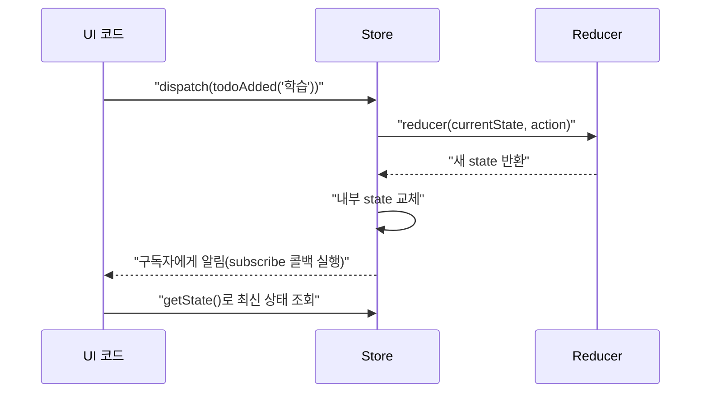

# 07. Redux의 핵심 - Action, Reducer, Store

06편에서 Redux의 철학을 봤다면, 이 편은 그 철학을 구현하는 세 가지 구성 요소를 직접 코드로 만들어봅니다. `createStore`로 순수 Redux 스토어를 처음부터 만들어보면, 이후 React-Redux나 Redux Toolkit이 내부에서 무엇을 하고 있는지 훨씬 명확하게 이해됩니다.

## 학습 목표

- Action, Reducer, Store 세 요소의 역할과 형태를 정확히 설명할 수 있다.
- `createStore`로 스토어를 만들고 `dispatch`/`subscribe`/`getState`를 사용할 수 있다.
- 액션 생성자(Action Creator)로 Action 객체 생성을 함수로 캡슐화할 수 있다.

## Action: 무슨 일이 일어났는지 설명하는 객체

**Action**은 상태를 어떻게 바꿀지가 아니라, <strong>"무슨 일이 일어났는지"</strong>를 설명하는 평범한 JavaScript 객체입니다. 반드시 `type` 필드를 가져야 하며, 관례상 `payload`에 추가 데이터를 담습니다.

```javascript
// 최소 형태
{ type: "counter/incremented" }

// payload를 포함한 형태
{ type: "todos/added", payload: { text: "Redux 배우기" } }
```

`type`은 문자열이면 무엇이든 되지만, 실무에서는 `도메인/이벤트` 형식(예: `"cart/itemAdded"`)을 관례로 씁니다. 이 명명 규칙은 Redux Toolkit의 `createSlice`(17편)가 자동으로 생성해주는 형식이기도 합니다.

<strong>액션 생성자(Action Creator)</strong>는 Action 객체를 만드는 함수입니다. 매번 객체 리터럴을 손으로 쓰는 대신, 오타를 줄이고 재사용성을 높입니다.

```javascript
function todoAdded(text) {
  return { type: "todos/added", payload: { text } };
}

console.log(todoAdded("복습")); // { type: "todos/added", payload: { text: "복습" } }
```

## Reducer: 다음 상태를 계산하는 순수 함수

**Reducer**는 `(state, action) => newState` 형태의 순수 함수입니다. 현재 상태와 Action을 받아 **다음 상태**를 반환합니다.

```javascript
const initialState = { count: 0 };

function counterReducer(state = initialState, action) {
  switch (action.type) {
    case "counter/incremented":
      return { count: state.count + 1 };
    case "counter/decremented":
      return { count: state.count - 1 };
    case "counter/reset":
      return { count: 0 };
    default:
      return state; // 모르는 action.type이면 기존 state를 그대로 반환
  }
}
```

**세 가지 규칙**을 반드시 지켜야 합니다.

1. **매개변수를 변경하지 않는다**: `state.count += 1` 대신 새 객체 `{ count: state.count + 1 }`을 반환한다(03·08편의 불변성 원칙).
2. **부수 효과를 일으키지 않는다**: API 호출, `Date.now()`, `Math.random()` 등을 리듀서 안에서 쓰지 않는다.
3. **알 수 없는 액션에는 기존 상태를 그대로 반환한다**: `default` 케이스가 없으면 `undefined`를 반환해 상태가 사라져 버린다.

<strong>초기값(`= initialState`)</strong>은 Store가 처음 만들어질 때 Redux가 내부적으로 보내는 초기화 액션에 대응하기 위해 필요합니다. `state`가 `undefined`로 호출되면(스토어 최초 생성 시), 매개변수 기본값 문법 덕분에 `initialState`가 사용됩니다.

## Store: 상태를 보관하고 변경을 조율한다

**Store**는 애플리케이션의 유일한 상태 보관소이며, Redux가 제공하는 `createStore`(또는 Redux Toolkit의 `configureStore`, 18편에서 다룸)로 만듭니다.

```javascript
import { createStore } from "redux";

const store = createStore(counterReducer);

console.log(store.getState()); // { count: 0 }

store.dispatch({ type: "counter/incremented" });
console.log(store.getState()); // { count: 1 }

store.dispatch({ type: "counter/incremented" });
console.log(store.getState()); // { count: 2 }
```

Store는 세 가지 메서드를 제공합니다.

- **`getState()`**: 현재 상태를 반환한다.
- **`dispatch(action)`**: Action을 리듀서에 전달해 상태를 갱신한다.
- **`subscribe(listener)`**: 상태가 바뀔 때마다 호출될 콜백을 등록한다.

```javascript
const unsubscribe = store.subscribe(() => {
  console.log("상태 변경됨:", store.getState());
});

store.dispatch({ type: "counter/incremented" }); // "상태 변경됨: { count: 3 }" 출력

unsubscribe(); // 더 이상 알림받지 않음
```

React-Redux(11편)의 `useSelector`는 내부적으로 이 `subscribe`를 사용해, 상태가 바뀔 때마다 컴포넌트를 리렌더링합니다.

## 세 요소가 함께 동작하는 흐름



리듀서가 **여러 개**라면 어떻게 하나의 Store로 합칠까요? Redux는 `combineReducers`를 제공해, 각 리듀서를 상태 트리의 한 "슬라이스(조각)"에 대응시킵니다.

```javascript
import { createStore, combineReducers } from "redux";

const rootReducer = combineReducers({
  counter: counterReducer,
  todos: todosReducer, // 별도로 정의된 리듀서라고 가정
});

const store = createStore(rootReducer);
console.log(store.getState()); // { counter: { count: 0 }, todos: [] }
```

`combineReducers`가 만드는 상태 구조가 바로 03편에서 다룬 `reduce()`의 "여러 값을 하나로 누적한다"는 발상과 정확히 같습니다. 각 슬라이스 리듀서는 자신이 담당하는 부분(`state.counter`, `state.todos`)만 알면 되고, 서로의 존재를 몰라도 됩니다.

## 실무 체크리스트

- 모든 Action이 `type` 필드를 가지고, 명명 규칙(`도메인/이벤트`)을 일관되게 따르는가?
- 리듀서의 `default` 케이스가 기존 상태를 그대로 반환하는가?
- 여러 리듀서를 `combineReducers`로 합칠 때, 각 리듀서가 자신의 슬라이스만 책임지고 있는가?

## 연습 과제

### 기초(★☆☆)
- `counterReducer`에 `counter/incrementedBy`(payload로 증가량을 받는) 액션 타입을 추가해보세요.

### 중급(★★☆)
- `todos` 배열을 다루는 `todosReducer`(추가·토글·삭제)를 직접 작성하고, `combineReducers`로 `counterReducer`와 합쳐보세요.

### 고급(★★★)
- `store.subscribe()`를 이용해, 상태가 바뀔 때마다 변경 이력을 배열에 기록하는 간단한 로거를 만들어보세요(21편 미들웨어의 원리를 미리 체험하는 실습입니다).

## 요약

- Action은 "무슨 일이 일어났는가"를 설명하는 객체이고, 액션 생성자는 그 객체를 만드는 함수다.
- Reducer는 `(state, action) => newState` 형태의 순수 함수이며, 매개변수 변경·부수 효과·알 수 없는 액션에서의 상태 소실을 피해야 한다.
- Store는 `getState`/`dispatch`/`subscribe` 세 메서드로 상태를 보관하고 변경을 조율하며, `combineReducers`로 여러 리듀서를 하나의 상태 트리로 합친다.

## 참고 문헌 및 출처(추천)

- Redux 공식 문서, "Redux Fundamentals, Part 3: State, Actions, and Reducers"
- Redux 공식 문서, "createStore" API 레퍼런스
- Redux 공식 문서, "combineReducers" API 레퍼런스

---

## 다음 글

- 다음: [08. 불변성의 중요성 - Immutability in Redux](../immutability-in-redux/)
