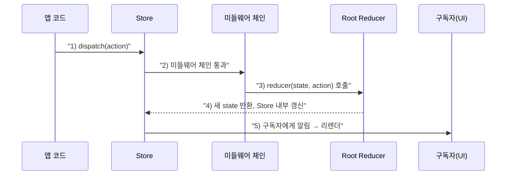
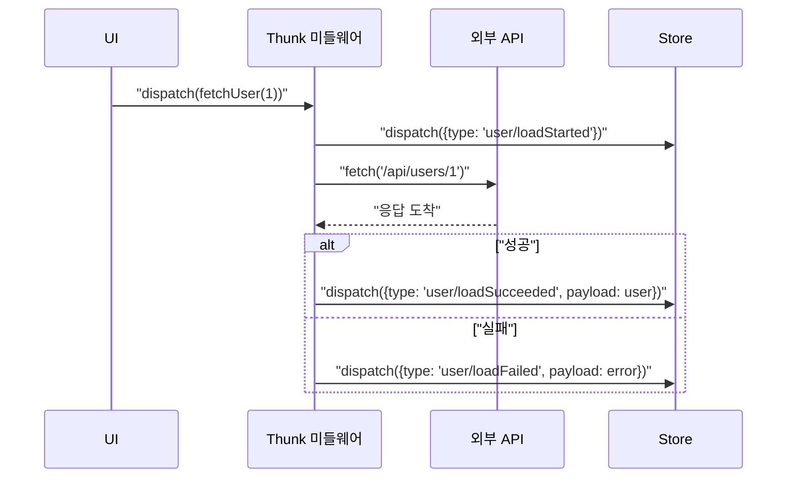

# 09. Redux 데이터 흐름 이해하기

07편에서 Action·Reducer·Store를 각각 만들어봤다면, 이 편은 `dispatch()` 호출 한 번이 실제로 **몇 단계를 거쳐** 화면 갱신까지 이어지는지 순서대로 추적합니다. 이 순서를 정확히 알아두면 11~12편(React-Redux 연동)에서 "왜 이 시점에 리렌더되는지"가 자연스럽게 이해됩니다.

## 학습 목표

- `dispatch()` 호출부터 화면 갱신까지의 전체 단계를 순서대로 설명할 수 있다.
- 미들웨어가 이 흐름의 어느 지점에 끼어드는지 설명할 수 있다.
- Redux DevTools로 실제 데이터 흐름을 관찰할 수 있다.

## 동기 데이터 흐름: 5단계

가장 단순한 동기 액션의 흐름은 다섯 단계로 나눌 수 있습니다.



1. **Action 생성**: 사용자 이벤트나 코드가 `dispatch({ type: "counter/incremented" })`를 호출한다.
2. **미들웨어 체인 통과**: Action은 등록된 미들웨어를 순서대로 거친다(로깅, Thunk 등). 21편에서 자세히 다룬다.
3. **루트 리듀서 호출**: 최종적으로 `rootReducer(state, action)`이 호출되어 다음 상태를 계산한다.
4. **Store 내부 상태 갱신**: 계산된 새 상태로 Store 내부 값이 교체된다.
5. **구독자 알림**: `subscribe()`로 등록된 콜백들이 실행되고, React-Redux를 쓰는 경우 해당 상태를 구독하는 컴포넌트가 리렌더된다.

```javascript
import { createStore } from "redux";

function rootReducer(state = { count: 0 }, action) {
  switch (action.type) {
    case "counter/incremented":
      return { count: state.count + 1 };
    default:
      return state;
  }
}

const store = createStore(rootReducer);

// 3~5단계를 직접 관찰하기
store.subscribe(() => {
  console.log("5) 구독자 알림, 새 상태:", store.getState());
});

console.log("1) dispatch 호출 전:", store.getState()); // { count: 0 }
store.dispatch({ type: "counter/incremented" }); // 2~4단계가 여기서 실행됨
```

## 미들웨어가 끼어드는 지점

미들웨어는 Action이 리듀서에 도달하기 **전**에 가로챌 수 있는 함수입니다. 로깅, 비동기 처리, 에러 리포팅 등이 이 지점에서 이뤄집니다.

```javascript
const loggerMiddleware = (store) => (next) => (action) => {
  console.log("dispatch 전 상태:", store.getState());
  console.log("액션:", action);
  const result = next(action); // 다음 미들웨어(또는 리듀서)로 전달
  console.log("dispatch 후 상태:", store.getState());
  return result;
};
```

`next(action)`을 호출하지 않으면 Action이 리듀서까지 도달하지 못합니다. 이 구조 덕분에 미들웨어는 Action을 **가로채서 변형하거나, 아예 막거나, 비동기 작업 후 다른 Action을 대신 dispatch**할 수 있습니다. 21편에서 미들웨어를 직접 만들어보고, 22~24편에서 Thunk·Saga·RTK Query가 이 지점을 어떻게 활용하는지 다룹니다.

**흔한 오개념 하나**: 미들웨어를 여러 개 등록하면 "순서는 상관없다"고 생각하기 쉽지만, 실제로는 **등록 순서가 실행 순서를 그대로 결정**합니다.

```javascript
// thunkMiddleware가 loggerMiddleware보다 먼저 등록되면
applyMiddleware(thunkMiddleware, loggerMiddleware)
// → thunk 함수가 먼저 실행되어 액션 객체로 풀린 뒤, logger는 그 결과(순수 액션 객체)를 로깅한다

// 반대로 등록하면
applyMiddleware(loggerMiddleware, thunkMiddleware)
// → logger가 먼저 실행되어, 아직 처리되지 않은 "함수 자체"를 그대로 로깅해버린다
```

`loggerMiddleware`가 `thunkMiddleware`보다 먼저 오면, 콘솔에는 `{ type: "...", payload: ... }` 같은 액션 객체 대신 **함수 자체**가 찍혀서 디버깅에 도움이 되지 않습니다. 미들웨어를 조합할 때는 "이 미들웨어가 처리하고 넘긴 결과를 다음 미들웨어가 받는다"는 순서를 항상 염두에 둬야 합니다.

## 비동기 흐름: 세 개의 액션으로 쪼개기

04편에서 리듀서는 비동기를 다룰 수 없다고 했습니다. 그래서 실무의 비동기 흐름은 **하나의 요청을 세 개의 동기 액션으로 쪼개** 표현합니다.



이 흐름에서 리듀서는 여전히 **순수하고 동기적인 세 액션**(`loadStarted`, `loadSucceeded`, `loadFailed`)만 처리합니다. 실제 네트워크 호출과 그 타이밍은 미들웨어가 전담하고, 리듀서는 "결과가 이미 나왔다"는 사실만 반영합니다. 이 패턴은 22편(Redux Thunk)에서 실제 코드로 구현합니다.

## Redux DevTools로 흐름 관찰하기

Redux DevTools 브라우저 확장은 dispatch된 모든 Action과 그로 인한 상태 변화를 시간 순서대로 기록합니다.

- **Action 목록**: 지금까지 dispatch된 모든 Action이 순서대로 나열된다.
- **Diff 탭**: 특정 Action이 상태의 어느 부분을 바꿨는지 보여준다.
- **시간여행(Time Travel)**: 과거의 특정 Action 시점으로 되감아, 그 당시 상태로 UI를 되돌려볼 수 있다.

08편에서 강조했듯, 이 시간여행 기능은 **리듀서가 순수하고 상태가 불변으로 관리될 때만** 정확히 동작합니다. 상태를 직접 변경하는 코드가 하나라도 섞이면, DevTools가 보여주는 과거 스냅샷이 실제로는 이미 오염된 객체를 가리키게 됩니다.

## 실무 체크리스트

- Action이 dispatch된 시점부터 화면이 갱신되는 시점까지 5단계를 순서대로 설명할 수 있는가?
- 여러 미들웨어를 등록할 때 순서가 의도한 실행 흐름(예: logger가 실제 액션 객체를 로깅하는지)과 일치하는가?
- 비동기 작업을 리듀서가 아니라 미들웨어에서 처리하고, 리듀서에는 결과를 알리는 동기 액션만 전달하는가?
- Redux DevTools에서 Action 목록과 Diff를 실제로 열어 상태 변화를 확인해본 적이 있는가?

## 연습 과제

### 기초(★☆☆)
- `store.subscribe()` 콜백 안에 `console.trace()`를 넣어, 어떤 호출 스택을 거쳐 알림이 오는지 관찰해보세요.

### 중급(★★☆)
- `loggerMiddleware`를 직접 만들어 `createStore(rootReducer, applyMiddleware(loggerMiddleware))`로 적용하고, 콘솔에 찍히는 순서를 확인해보세요.

### 고급(★★★)
- `user/loadStarted` → `user/loadSucceeded`/`user/loadFailed` 세 액션을 처리하는 리듀서를 작성하고, 각 상태 전이(`idle` → `loading` → `succeeded`/`failed`)를 상태 다이어그램으로 그려보세요.

## 요약

- `dispatch()` 한 번은 미들웨어 체인 → 리듀서 → Store 갱신 → 구독자 알림이라는 5단계를 순서대로 거친다.
- 미들웨어는 Action이 리듀서에 도달하기 전에 가로채 로깅·비동기 처리 등을 수행할 수 있는 지점이다.
- 비동기 요청은 시작·성공·실패라는 세 개의 순수 동기 액션으로 쪼개 리듀서의 순수성을 지킨다.

## 참고 문헌 및 출처(추천)

- Redux 공식 문서, "Redux Fundamentals, Part 6: Async Logic and Data Fetching"
- Redux DevTools Extension 공식 문서, "Features"
- Redux 공식 문서, "Middleware"

---

## 다음 글

- 다음: [10. Redux를 사용하는 이유와 적절한 사용 시기](../when-to-use-redux/)
