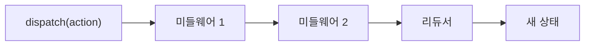
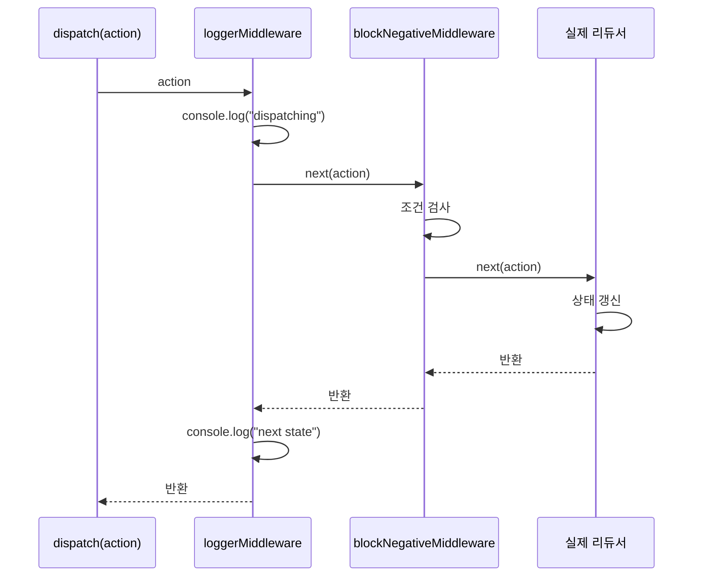

# 21. Redux 미들웨어의 이해

09편에서 미들웨어를 "액션이 리듀서에 도달하기 전 가로채는 지점"이라고 간단히 소개했습니다. Phase 5는 이 미들웨어를 직접 만들어보며 구조를 완전히 이해하고, 22~24편에서 다룰 Thunk·Saga·RTK Query가 모두 **같은 미들웨어 메커니즘 위에 세워진 도구**라는 것을 확인합니다.

## 학습 목표

- 미들웨어의 3중 함수 구조(`store => next => action => {}`)를 직접 작성할 수 있다.
- `next(action)`을 호출하지 않으면 액션이 리듀서에 도달하지 않는다는 것을 실습으로 확인할 수 있다.
- 여러 미들웨어가 체인으로 연결되어 순차 실행되는 원리를 설명할 수 있다.

## 왜 미들웨어가 필요한가

07편에서 배운 리듀서의 규칙(순수 함수, 부수 효과 없음)을 다시 떠올려봅시다. API 호출, 로깅, 지연 실행 같은 **부수 효과**는 리듀서 안에 넣을 수 없습니다. 그렇다고 컴포넌트마다 로깅 코드를 반복해서 넣는 것도 비효율적입니다. 미들웨어는 **"액션이 dispatch되고 리듀서에 도달하기 전"**이라는 공통 지점에서 이런 부수 효과를 한 곳에 모아 처리할 수 있게 해줍니다.



## 가장 단순한 미들웨어: 로깅

```javascript
// 가장 단순한 형태: 액션이 지나갈 때마다 콘솔에 기록만 하고 그대로 통과시킨다
const loggerMiddleware = (store) => (next) => (action) => {
  console.log("dispatching:", action);
  const result = next(action); // 다음 미들웨어(또는 리듀서)에게 액션을 넘긴다
  console.log("next state:", store.getState());
  return result;
};
```

이 함수는 **세 단계로 커링**되어 있습니다.

- `(store) => ...`: Store에 연결될 때 한 번 호출되며, `getState()`, `dispatch()`에 접근할 수 있는 `store`를 받는다.
- `(next) => ...`: 미들웨어 체인에서 "다음 단계"를 나타내는 함수를 받는다. 마지막 미들웨어라면 `next`는 실제로 리듀서를 호출하는 내부 함수다.
- `(action) => ...`: 실제로 dispatch될 때마다 호출되는 부분. 여기서 로깅, API 호출 등 원하는 로직을 실행한다.

## next(action)을 호출하지 않으면 무슨 일이 일어나는가

핵심 규칙은 **`next(action)`을 호출해야만 액션이 다음 단계로 전달된다**는 것입니다. 이를 직접 확인해봅시다.

```javascript
// 특정 조건의 액션을 리듀서에 도달하지 못하게 막는 미들웨어
const blockNegativeMiddleware = (store) => (next) => (action) => {
  if (action.type === "counter/incrementedBy" && action.payload < 0) {
    console.warn("음수 증가는 허용되지 않습니다:", action);
    return; // next(action)을 호출하지 않음 — 이 액션은 리듀서에 절대 도달하지 못한다
  }
  return next(action); // 조건을 통과한 액션만 다음 단계로
};
```

```javascript
store.dispatch({ type: "counter/incrementedBy", payload: -5 });
// 콘솔에 경고만 출력되고, counterReducer는 이 액션을 받지 못해 상태가 변하지 않는다
```

이 예시는 실무에서 흔히 쓰이는 패턴은 아니지만, **미들웨어가 액션의 흐름 자체를 제어할 수 있다**는 것을 명확히 보여줍니다. 08편에서 배운 "리듀서는 항상 액션을 받는다"는 전제는, 사실 "미들웨어가 `next`를 호출했을 때만" 성립하는 것입니다.

## 여러 미들웨어의 체인 실행

미들웨어를 여러 개 등록하면, 각 미들웨어의 `next`는 사실 **"다음 미들웨어의 action 처리 함수"**를 가리킵니다.

```javascript
import { createStore, applyMiddleware } from "redux";

const store = createStore(
  rootReducer,
  applyMiddleware(loggerMiddleware, blockNegativeMiddleware) // 등록 순서대로 체인이 구성된다
);
```



`loggerMiddleware`의 `next`가 호출하는 것은 `blockNegativeMiddleware`의 `(action) => {...}` 부분이고, `blockNegativeMiddleware`의 `next`가 호출하는 것은 실제 리듀서를 감싼 내부 dispatch 함수입니다. **등록 순서가 실행 순서를 결정**하며, 앞선 미들웨어가 `next(action)`을 호출해야만 뒤의 미들웨어가 실행됩니다.

## 타이밍 측정 미들웨어 예시

미들웨어의 실용적인 활용 예로, 액션 처리 시간을 측정하는 미들웨어를 만들어봅니다.

```javascript
const timingMiddleware = (store) => (next) => (action) => {
  const start = performance.now();
  const result = next(action);
  const durationMs = performance.now() - start;
  if (durationMs > 16) { // 16ms(한 프레임)를 넘으면 경고
    console.warn(`느린 액션 감지: ${action.type} (${durationMs.toFixed(1)}ms)`);
  }
  return result;
};
```

이런 미들웨어는 리듀서 로직이 예상보다 무거워졌을 때(예: 큰 배열을 매번 정렬하는 리듀서) 개발 중에 조기 경고를 주는 용도로 쓸 수 있습니다.

## Thunk·Saga·RTK Query는 모두 미들웨어다

18편에서 `configureStore`가 기본으로 `redux-thunk` 미들웨어를 포함한다고 했습니다. 22편의 Thunk, 23편의 Saga, 24편의 RTK Query는 모두 **이 편에서 배운 `store => next => action => {}` 구조를 구현한 미들웨어**입니다. 차이는 각자가 "무엇을 위해" 액션 흐름을 가로채는지에 있습니다.

- **Thunk**: `action`이 함수일 때 그 함수를 대신 실행해준다(22편).
- **Saga**: 제너레이터 함수로 기술된 사이드 이펙트 흐름을 실행 엔진이 관리한다(23편).
- **RTK Query**: 내부적으로 Thunk와 유사한 미들웨어를 통해 캐싱된 데이터 페칭을 관리한다(24편).

이 편에서 미들웨어의 기본 구조를 이해했다면, 이후 세 편은 "이 구조 위에 무엇을 얹었는가"로 훨씬 쉽게 읽힙니다.

## 실무 체크리스트

- 커스텀 미들웨어를 작성할 때 모든 경로에서 `next(action)`을 호출하는지(의도적으로 막는 경우가 아니라면) 확인했는가?
- 여러 미들웨어를 등록할 때 순서가 의도한 실행 흐름과 일치하는지 확인했는가?
- 리듀서 안에 넣고 싶은 유혹이 드는 부수 효과(API 호출, 로깅, 타이머)를 미들웨어로 분리하고 있는가?

## 연습 과제

### 기초(★☆☆)
- `loggerMiddleware`를 직접 작성하고 `applyMiddleware`로 등록해, 액션이 dispatch될 때마다 콘솔에 로그가 찍히는지 확인해보세요.

### 중급(★★☆)
- 특정 액션 타입(`"admin/dangerousAction"`)을 사용자가 관리자가 아닐 때 차단하는 미들웨어를 작성해보세요(`store.getState()`로 사용자 권한을 확인).

### 고급(★★★)
- 미들웨어 두 개를 등록 순서를 바꿔가며 실행해, 각 미들웨어의 `console.log` 출력 순서가 어떻게 달라지는지 관찰하고 그 이유를 설명해보세요.

## 요약

- 미들웨어는 `store => next => action => {}` 형태의 3중 커링 함수로, 액션이 리듀서에 도달하기 전 부수 효과를 처리하는 지점이다.
- `next(action)`을 호출해야만 액션이 다음 단계(다음 미들웨어 또는 리듀서)로 전달된다.
- Thunk·Saga·RTK Query는 모두 이 미들웨어 구조 위에 구현된 도구다.

## 참고 문헌 및 출처(추천)

- Redux 공식 문서, "Middleware"
- Redux 공식 문서, "Writing Custom Middleware"

---

## 다음 글

- 다음: [22. Redux Thunk - 가장 간단한 비동기 처리](../redux-thunk/)
