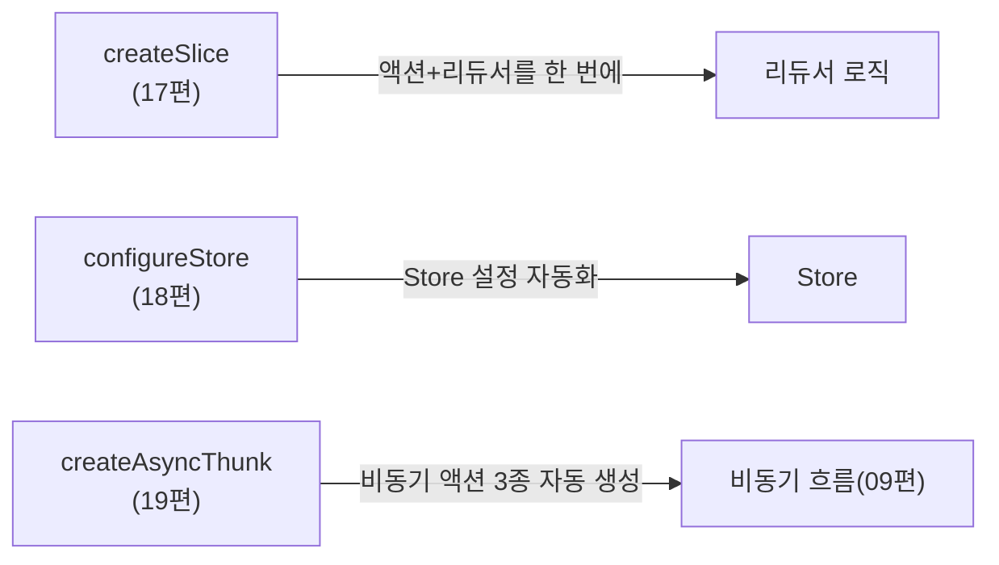

# 16. Redux Toolkit 소개 - 왜 RTK인가?

15편에서 완성한 순수 Redux 코드를 다시 보면, 액션 타입 문자열을 여러 곳에 중복해서 적고, 스프레드로 불변 업데이트를 손수 작성하는 부분이 많았습니다. Redux 팀은 이 반복을 줄이기 위해 **Redux Toolkit(RTK)**을 만들었고, 지금은 신규 프로젝트에 Redux를 도입할 때 **공식적으로 권장하는 표준 방식**입니다. Phase 4는 15편의 순수 Redux 코드를 RTK로 다시 쓰며 무엇이 달라지는지 확인합니다.

## 학습 목표

- 순수 Redux의 반복적인 보일러플레이트가 무엇인지 구체적으로 설명할 수 있다.
- Redux Toolkit이 제공하는 핵심 API(`configureStore`, `createSlice`, `createAsyncThunk`)의 역할을 개략적으로 설명할 수 있다.
- Redux Toolkit이 "선택 사항"이 아니라 "공식 권장 방식"이 된 이유를 설명할 수 있다.

## 순수 Redux의 반복 지점

15편의 `counterSlice.js`를 다시 보면, 다음과 같은 반복이 보입니다.

```javascript
// 순수 Redux: 액션 타입 문자열이 액션 생성자와 리듀서 양쪽에 중복된다
export const incremented = () => ({ type: "counter/incremented" }); // 문자열 1
export const decremented = () => ({ type: "counter/decremented" }); // 문자열 2

export function counterReducer(state = initialState, action) {
  switch (action.type) {
    case "counter/incremented": // 문자열 1과 정확히 일치해야 함(오타 위험)
      return { count: state.count + 1 };
    case "counter/decremented": // 문자열 2와 정확히 일치해야 함
      return { count: state.count - 1 };
    default:
      return state;
  }
}
```

`"counter/incremented"`라는 문자열이 두 곳에 나타나며, 하나를 고칠 때 다른 하나를 잊으면 조용히 버그가 됩니다. 또한 08편에서 배운 불변 업데이트(`{ ...state, count: state.count + 1 }`)를 매번 손으로 작성해야 하고, `combineReducers`·`applyMiddleware`·DevTools 연결 같은 초기 설정도 직접 조합해야 합니다.

## Redux Toolkit이 해결하는 것

RTK는 이 모든 반복을 세 가지 핵심 API로 압축합니다.



- **`createSlice`**: 액션 타입, 액션 생성자, 리듀서를 **한 번에** 정의한다. 문자열 중복이 사라진다(17편).
- **`configureStore`**: `combineReducers`, `applyMiddleware`, DevTools 연결을 **좋은 기본값으로 자동 설정**한다(18편).
- **`createAsyncThunk`**: 09편에서 손으로 만들었던 "시작·성공·실패" 세 액션을 API 호출 함수 하나로부터 **자동 생성**한다(19편).

## 미리보기: createSlice로 다시 쓴 counter

`createSlice`가 무엇을 대신해주는지 미리 감을 잡아봅시다(자세한 사용법은 17편에서 다룹니다).

```javascript
import { createSlice } from "@reduxjs/toolkit";

const counterSlice = createSlice({
  name: "counter",
  initialState: { count: 0 },
  reducers: {
    incremented: (state) => {
      state.count += 1; // Immer 덕분에 직접 대입처럼 써도 불변 업데이트가 된다(08편 참고)
    },
    decremented: (state) => {
      state.count -= 1;
    },
  },
});

export const { incremented, decremented } = counterSlice.actions; // 액션 생성자가 자동 생성됨
export const counterReducer = counterSlice.reducer;
```

15편의 순수 Redux 버전과 비교하면, 액션 타입 문자열을 한 번도 직접 쓰지 않았습니다. `name: "counter"`와 `reducers`의 키(`incremented`)를 조합해 `"counter/incremented"`라는 타입 문자열이 **자동으로** 만들어집니다. `state.count += 1`처럼 직접 대입하는 것처럼 보이지만, `createSlice`는 내부적으로 08편에서 다룬 **Immer**를 사용하므로 실제로는 불변 업데이트가 안전하게 이뤄집니다.

## Immer가 내장되어 있다는 것의 의미

08편에서 Immer를 "직접 바꾸는 것처럼 쓰고 불변 업데이트를 얻는 라이브러리"라고 소개했습니다. `createSlice`의 `reducers` 함수 안에서는 이 Immer가 자동으로 적용되므로, 스프레드 연산자로 중첩 객체를 단계마다 펼치는 코드(08편에서 본 함정)를 직접 쓸 필요가 없습니다.

```javascript
// 순수 Redux: 중첩 업데이트를 스프레드로 직접 처리 (08편)
function userReducer(state, action) {
  return {
    ...state,
    profile: { ...state.profile, nickname: action.payload },
  };
}

// RTK: Immer 덕분에 직접 대입처럼 쓴다
const userSlice = createSlice({
  name: "user",
  initialState: { profile: { nickname: "" } },
  reducers: {
    nicknameChanged: (state, action) => {
      state.profile.nickname = action.payload; // 실제로는 불변 업데이트로 변환됨
    },
  },
});
```

단, **리듀서 함수가 새 상태 객체를 `return`하는 경우에는 Immer가 개입하지 않고 그 반환값을 그대로 사용**합니다. `state.count += 1`처럼 직접 변경하거나, `return { count: state.count + 1 }`처럼 새 객체를 반환하거나 둘 중 하나를 선택하되, **섞어 쓰지 않는 것**이 중요합니다(직접 변경과 반환을 같은 함수에서 함께 하면 오류가 납니다).

## 공식 권장 방식이 된 이유

Redux 공식 문서는 현재 "새 프로젝트는 반드시 Redux Toolkit으로 시작하라"고 명시하고 있습니다. 이는 단순한 편의 기능 이상의 의미를 가집니다.

- **보일러플레이트 감소**: 이 편에서 본 것처럼 코드량이 크게 줄어든다.
- **모범 사례가 기본값으로 내장됨**: `configureStore`는 개발 환경에서 상태 변경 감지 미들웨어, 직렬화 불가능한 값 감지 미들웨어를 자동으로 켜준다(18편).
- **TypeScript 친화적**: 05편에서 배운 타입 시스템과 RTK의 API가 잘 맞물려, 액션과 상태 타입을 자동으로 추론해준다(28편).
- **RTK Query로 서버 상태까지 확장**: 10편에서 언급한 "서버 상태 전용 도구"의 필요성을 RTK 생태계 안에서 해결한다(24편).

## 순수 Redux를 배운 이유

"공식 권장이 RTK라면 왜 1~15편을 순수 Redux로 배웠을까?"라는 의문이 들 수 있습니다. `createSlice`, `configureStore`가 **내부적으로 무엇을 자동화하는지**(액션 타입 생성, Immer 적용, 미들웨어 조합)를 알고 쓰는 것과 모르고 쓰는 것은 큰 차이가 있습니다. 문제가 생겼을 때(예: 리듀서가 예상과 다르게 동작할 때) RTK가 감춘 내부 동작을 추측이 아니라 근거를 가지고 진단할 수 있는 것이 Phase 1~3을 거친 이유입니다.

## 실무 체크리스트

- 새 Redux 프로젝트를 순수 `createStore`/`combineReducers`로 시작하려 하고 있지는 않은가? (RTK가 공식 권장)
- `createSlice`의 리듀서 함수 안에서 직접 변경과 `return`을 섞어 쓰고 있지 않은가?
- RTK로 옮긴 뒤에도, 그 아래에서 실제로 무슨 일이 일어나는지(액션 타입 생성, Immer 적용) 설명할 수 있는가?

## 연습 과제

### 기초(★☆☆)
- 15편의 `counterReducer`와 이 편의 `createSlice` 버전을 나란히 놓고, 줄어든 코드 라인 수를 세어보세요.

### 중급(★★☆)
- 15편의 `todosReducer`를 `createSlice` 형태로 미리 스케치해보세요(정식 문법은 17편에서 확정합니다).

### 고급(★★★)
- `createSlice`의 리듀서 안에서 직접 변경과 `return`을 동시에 쓰면 어떤 에러가 나는지, 공식 문서나 실습으로 확인해보세요.

## 요약

- Redux Toolkit은 액션 타입 중복, 불변 업데이트 보일러플레이트, Store 설정 반복을 줄이기 위해 만들어진 공식 도구다.
- `createSlice`는 Immer를 내장해 "직접 바꾸는 것처럼" 써도 불변성이 지켜지게 한다.
- 순수 Redux를 먼저 배운 것은 RTK가 감춘 내부 동작을 근거 있게 이해하기 위함이다.

## 참고 문헌 및 출처(추천)

- Redux Toolkit 공식 문서, "Redux Toolkit Overview"
- Redux 공식 문서, "Why Redux Toolkit is How To Use Redux Today"
- Immer 공식 문서, "Redux Toolkit and Immer"

---

## 다음 글

- 다음: [17. createSlice - 간결한 리듀서 작성](../create-slice/)
