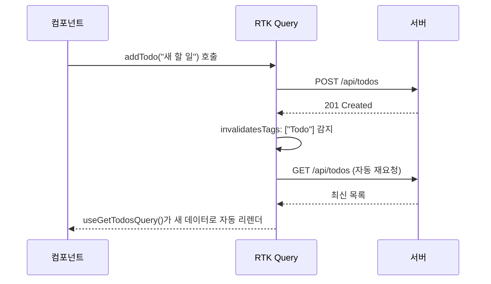

# 24. RTK Query - 데이터 페칭의 혁명

10편에서 "서버 상태는 클라이언트 상태와 성격이 다르다"고 하며 전용 도구의 필요성을 언급했습니다. **RTK Query**가 그 공식 해답입니다. 이 편은 19편의 `createAsyncThunk` 방식과 RTK Query를 나란히 비교하며, 캐싱·자동 재요청·뮤테이션이 어떻게 선언적으로 처리되는지 다룹니다.

## 학습 목표

- `createApi`로 API 엔드포인트를 정의하고, 자동 생성된 Hook으로 데이터를 조회할 수 있다.
- RTK Query가 캐싱과 로딩 상태를 자동으로 관리하는 원리를 설명할 수 있다.
- `tagTypes`를 이용한 캐시 무효화로, 뮤테이션 후 관련 데이터를 자동 재요청할 수 있다.

## 19편 복습: createAsyncThunk로 만든 수동 캐싱

19~20편에서 `fetchTodos`를 `createAsyncThunk`로 만들고, `status` 필드로 로딩 상태를 직접 관리했습니다.

```javascript
// 19~20편: 직접 관리해야 하는 것들
// - status: 'idle' | 'loading' | 'succeeded' | 'failed'
// - 이미 불러온 데이터를 다시 요청하지 않으려면 22편의 getState 가드가 필요
// - 데이터를 추가/수정한 뒤 목록을 다시 불러오려면 fetchTodos()를 수동으로 재dispatch해야 함
```

이 모든 것이 틀린 방식은 아니지만, "서버 데이터를 가져오고, 캐시하고, 필요할 때 갱신한다"는 패턴은 프로젝트마다 반복해서 나타납니다. RTK Query는 이 반복을 표준화합니다.

## createApi: 엔드포인트를 선언적으로 정의한다

```javascript
// features/api/todosApi.js
import { createApi, fetchBaseQuery } from "@reduxjs/toolkit/query/react";

export const todosApi = createApi({
  reducerPath: "todosApi",
  baseQuery: fetchBaseQuery({ baseUrl: "/api" }),
  tagTypes: ["Todo"], // 캐시 무효화에 쓸 태그 종류 선언
  endpoints: (builder) => ({
    getTodos: builder.query({
      query: () => "/todos", // GET /api/todos
      providesTags: ["Todo"], // 이 쿼리 결과가 'Todo' 태그에 해당한다고 선언
    }),
    addTodo: builder.mutation({
      query: (text) => ({
        url: "/todos",
        method: "POST",
        body: { text },
      }),
      invalidatesTags: ["Todo"], // 이 뮤테이션 성공 시 'Todo' 태그를 가진 쿼리를 자동 무효화
    }),
  }),
});

export const { useGetTodosQuery, useAddTodoMutation } = todosApi; // Hook이 자동 생성됨
```

`endpoints`에 정의한 `getTodos`, `addTodo`로부터 `useGetTodosQuery`, `useAddTodoMutation`이라는 React Hook이 **자동으로** 생성됩니다. 이 명명 규칙(`use` + 엔드포인트 이름 + `Query`/`Mutation`)은 RTK Query가 항상 동일하게 따릅니다.

## 컴포넌트에서 사용하기: 19~20편과의 비교

```jsx
// 24편: RTK Query 버전
import { useGetTodosQuery, useAddTodoMutation } from "./todosApi";

function TodoList() {
  const { data: todos, isLoading, error } = useGetTodosQuery(); // 요청·캐싱·로딩 상태 전부 자동
  const [addTodo] = useAddTodoMutation();

  if (isLoading) return <p>불러오는 중...</p>;
  if (error) return <p>에러가 발생했습니다</p>;

  return (
    <div>
      <button onClick={() => addTodo("새 할 일")}>추가</button>
      <ul>
        {todos.map((todo) => <li key={todo.id}>{todo.text}</li>)}
      </ul>
    </div>
  );
}
```

20편의 `TodoList.jsx`와 비교하면, `useEffect`로 마운트 시점에 `fetchTodos()`를 dispatch하는 코드, `status`를 직접 확인하는 조건문, 상태 구조(`items`/`status`/`error`)를 설계하는 과정이 모두 사라졌습니다. `useGetTodosQuery()` Hook 하나가 **요청 시점 결정, 캐싱, 로딩/에러 상태**를 전부 처리합니다.

## 캐싱이 자동으로 일어난다는 것의 의미

같은 쿼리를 여러 컴포넌트에서 호출해도, RTK Query는 **네트워크 요청을 한 번만** 보내고 결과를 공유합니다.

```jsx
function TodoCount() {
  const { data: todos } = useGetTodosQuery(); // TodoList와 같은 쿼리 → 캐시 재사용, 추가 네트워크 요청 없음
  return <span>{todos?.length ?? 0}개</span>;
}
```

`TodoList`와 `TodoCount`가 동시에 마운트되어도 `/api/todos` 요청은 한 번만 발생합니다. 22편에서 thunk로 이 최적화를 하려면 `getState`로 "이미 요청 중인지" 확인하는 가드를 직접 작성해야 했지만, RTK Query는 이를 기본 동작으로 제공합니다.

## invalidatesTags/providesTags: 뮤테이션 후 자동 재요청

`addTodo("새 할 일")`가 성공하면, `todosApi`는 `invalidatesTags: ["Todo"]` 설정에 따라 **`"Todo"` 태그를 가진 모든 쿼리(`getTodos`)를 자동으로 무효화하고 다시 요청**합니다.



20편에서는 Todo를 추가한 뒤 화면을 갱신하려면, `todoAdded` 리듀서가 로컬 상태를 직접 업데이트하거나 `fetchTodos()`를 수동으로 재dispatch해야 했습니다. RTK Query는 **"이 데이터를 바꾸는 작업이 끝나면, 그 데이터에 의존하는 화면은 자동으로 최신 상태가 된다"**는 규칙을 태그 시스템으로 선언적으로 표현합니다.

## 폴링과 자동 재요청

RTK Query는 캐싱 외에도 실무에서 자주 필요한 기능을 옵션으로 제공합니다.

```javascript
// 5초마다 자동으로 재요청 (실시간성이 필요한 대시보드 등에 사용)
const { data } = useGetTodosQuery(undefined, { pollingInterval: 5000 });

// 브라우저 탭이 다시 포커스될 때 자동 재요청
const todosApi = createApi({
  // ...
  refetchOnFocus: true,
});
```

## RTK Query vs Thunk/Saga: 언제 무엇을 쓰는가

| 상황 | 적합한 도구 |
|---|---|
| 서버 데이터를 조회·캐싱·자동 갱신해야 함(대부분의 CRUD) | RTK Query(24편) |
| 단순한 비동기 로직, 커스텀 흐름 제어가 필요함 | Thunk(22편) |
| 여러 비동기 작업의 복잡한 순서 제어·요청 취소가 핵심임 | Saga(23편) |

세 가지는 서로 배타적이지 않습니다. 실무 프로젝트에서는 **서버 데이터 페칭은 RTK Query, 그 외의 클라이언트 로직(폼 검증 흐름, 복잡한 UI 상태 전이)은 thunk나 일반 `createSlice`**로 나눠 쓰는 조합이 흔합니다. 21편에서 확인했듯 RTK Query도 내부적으로는 미들웨어 위에서 동작하므로, `configureStore`에 `todosApi.middleware`를 추가해야 합니다.

```javascript
export const store = configureStore({
  reducer: {
    [todosApi.reducerPath]: todosApi.reducer, // RTK Query 전용 리듀서 등록
  },
  middleware: (getDefaultMiddleware) =>
    getDefaultMiddleware().concat(todosApi.middleware), // 캐싱 로직을 처리하는 미들웨어
});
```

## 실무 체크리스트

- 서버 데이터를 다루는 코드에서 `createAsyncThunk` + 수동 `status` 관리를 반복하고 있다면, RTK Query로 전환할 여지가 있는지 검토했는가?
- 뮤테이션 후 관련 쿼리가 자동으로 최신화되도록 `tagTypes`/`providesTags`/`invalidatesTags`를 올바르게 연결했는가?
- 실시간성이 필요한 데이터에 폴링(`pollingInterval`)이나 포커스 재요청(`refetchOnFocus`)을 고려했는가?

## 연습 과제

### 기초(★☆☆)
- `getTodos`, `addTodo` 엔드포인트를 가진 `todosApi`를 만들고, `useGetTodosQuery`로 목록을 렌더링해보세요.

### 중급(★★☆)
- `deleteTodo` 뮤테이션을 추가하고 `invalidatesTags: ["Todo"]`를 설정해, 삭제 후 목록이 자동으로 갱신되는지 확인해보세요.

### 고급(★★★)
- `getTodoById(id)` 쿼리를 추가하고, 특정 Todo 하나만 무효화하는 세밀한 태그(`{ type: "Todo", id }`) 구조로 리팩터링해보세요.

## 요약

- RTK Query는 서버 상태의 조회·캐싱·로딩 상태 관리·자동 갱신을 `createApi` 선언 하나로 표준화한다.
- 같은 쿼리를 여러 컴포넌트가 호출해도 네트워크 요청은 한 번만 발생하고 결과가 공유된다.
- `tagTypes`/`providesTags`/`invalidatesTags`로 뮤테이션 후 관련 쿼리의 자동 재요청을 선언적으로 연결한다.

## 참고 문헌 및 출처(추천)

- Redux Toolkit 공식 문서, "RTK Query Overview"
- Redux Toolkit 공식 문서, "RTK Query, Automated Re-fetching"
- Redux 공식 문서, "Redux Essentials, Part 7: RTK Query Basics"

---

## 다음 글

- 다음: [25. 실습: RTK Query로 블로그 앱 만들기](../practice-blog-app/)
