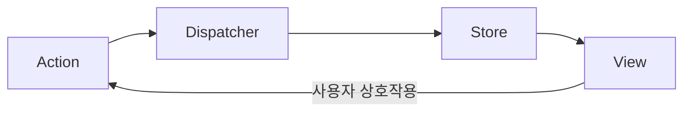
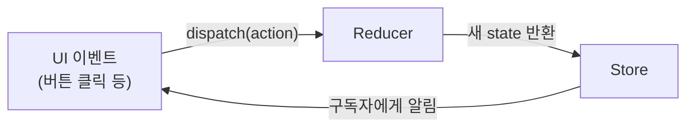

# 06. Redux란 무엇인가 - Flux 아키텍처와 상태 관리

Phase 1에서 언어 기초를 다졌으니, 이제 Redux 자체를 다룹니다. Redux를 "그냥 상태 저장소"로만 이해하면 왜 이렇게 규칙이 엄격한지 납득하기 어렵습니다. 이 편은 Redux가 어떤 문제의식에서 나왔는지부터 시작합니다.

## 학습 목표

- 양방향 바인딩이 대규모 앱에서 어떤 문제를 일으키는지 설명할 수 있다.
- Flux 아키텍처의 단방향 데이터 흐름이 그 문제를 어떻게 완화하는지 설명할 수 있다.
- Redux의 세 가지 원칙(단일 소스, 읽기 전용 상태, 순수 리듀서)을 말과 코드로 설명할 수 있다.

## 탄생 배경: 양방향 바인딩의 한계

Redux 이전, 많은 프레임워크는 **양방향 데이터 바인딩**(모델이 바뀌면 뷰가, 뷰가 바뀌면 모델이 자동으로 동기화되는 방식)을 채택했습니다. 작은 앱에서는 편리하지만, 컴포넌트 수가 늘고 여러 컴포넌트가 같은 데이터를 공유하면 문제가 생깁니다. **A 컴포넌트의 변경이 B를 바꾸고, B의 변경이 다시 C에 영향을 주는 식으로 데이터 흐름이 그물처럼 얽히면, "지금 이 값이 왜 이렇게 됐는지" 추적하기가 매우 어려워집니다.**

Facebook은 2014년 이 문제를 해결하기 위해 **Flux**라는 아키텍처 패턴을 제안했습니다. 핵심 아이디어는 데이터가 **한 방향으로만** 흐르게 강제하는 것입니다.



Dan Abramov와 Andrew Clark는 2015년 Flux의 아이디어를 더 단순화해 **Redux**를 만들었습니다. Flux는 여러 Store와 Dispatcher를 허용했지만, Redux는 **하나의 Store**로 단순화하고, 함수형 프로그래밍의 순수 함수 개념을 리듀서에 도입했습니다.

## Redux의 단방향 데이터 흐름

Redux에서 데이터는 항상 같은 순서로 흐릅니다.



1. 사용자가 버튼을 클릭하는 등 이벤트가 발생하면 **Action**(무슨 일이 일어났는지 설명하는 평범한 객체)을 **dispatch**한다.
2. Store는 현재 상태와 Action을 **Reducer**(순수 함수)에 전달한다.
3. Reducer는 새로운 상태를 계산해 반환한다.
4. Store는 새 상태로 갱신되고, 이 변화를 구독 중인 UI에 알린다.

이 흐름이 항상 같은 방향으로만 진행되기 때문에, "상태가 왜 이렇게 바뀌었는가"를 추적할 때 **dispatch된 Action들을 순서대로 읽는 것만으로 충분**합니다. 이것이 Redux DevTools의 시간여행 디버깅(상태를 액션 단위로 되감기/재생하는 기능)이 가능한 이유입니다.

## Redux의 세 가지 원칙

Redux는 세 가지 원칙으로 요약됩니다.

### 1. 단일 소스의 진실 (Single Source of Truth)

앱의 전체 상태는 **하나의 Store 안, 하나의 객체 트리**에 저장됩니다.

```javascript
// 앱 전체 상태가 하나의 객체 안에 있다
const state = {
  user: { id: 1, name: "Kim" },
  todos: [{ id: 1, text: "학습", done: false }],
  cart: { items: [], total: 0 },
};
```

여러 컴포넌트가 각자 로컬 상태를 갖는 대신, 공유해야 할 상태는 한곳에 모아둡니다. 디버깅 시 상태 전체를 직렬화해 저장하거나 복원하기도 쉬워집니다.

### 2. 상태는 읽기 전용 (State is Read-Only)

상태를 바꾸는 유일한 방법은 **무슨 일이 일어났는지 설명하는 Action을 dispatch하는 것**뿐입니다. 상태 객체를 직접 수정하는 것은 허용되지 않습니다.

```javascript
// 금지: 상태를 직접 변경
state.user.name = "Lee";

// 허용: Action을 dispatch해 리듀서가 새 상태를 만들게 함
store.dispatch({ type: "user/nameChanged", payload: "Lee" });
```

이 원칙 덕분에 UI나 네트워크 콜백이 상태를 예측 불가능한 시점에 임의로 바꾸는 것을 막고, 모든 변경이 Action이라는 기록으로 남습니다.

### 3. 순수 함수로 변경 작성 (Changes are Made with Pure Reducers)

상태가 Action에 따라 어떻게 바뀌는지 설명하는 **Reducer**는 **순수 함수**여야 합니다. 같은 입력(state, action)에 항상 같은 출력을 내고, 인자를 변경하거나 API 호출·난수 생성 같은 부수 효과를 일으키지 않습니다.

```javascript
function counterReducer(state = { count: 0 }, action) {
  switch (action.type) {
    case "counter/incremented":
      return { count: state.count + 1 }; // 새 객체를 반환, state는 그대로
    default:
      return state;
  }
}
```

이 원칙 덕분에 같은 Action 시퀀스를 재생하면 항상 같은 최종 상태가 나오고(재현 가능성), 테스트도 단순해집니다(입력과 출력만 비교하면 됨).

## Flux와 Redux의 차이

| 구분 | Flux | Redux |
|---|---|---|
| Store 개수 | 여러 개 허용 | 하나(단일 Store) |
| Dispatcher | 별도의 Dispatcher 객체가 Action을 여러 Store에 전달 | Store 자체가 dispatch를 처리(별도 Dispatcher 없음) |
| 상태 변경 로직 | Store 내부에 분산 | 순수 함수인 Reducer로 분리 |
| 상태 변경 방식 | Store가 직접 상태를 변경할 수 있음 | Reducer가 항상 새 상태 객체를 반환 |

Redux는 Flux의 "단방향 흐름"이라는 핵심 아이디어는 유지하면서, 구조를 단순화(단일 Store)하고 함수형 프로그래밍(순수 리듀서)을 결합한 결과물입니다.

## 실무 체크리스트

- 상태를 여러 컴포넌트의 로컬 상태로 흩어놓지 않고, 공유가 필요한 부분은 하나의 Store에 모으고 있는가?
- 상태를 직접 변경하는 코드(`state.x = y`)가 컴포넌트나 다른 곳에 남아 있지 않은가?
- 리듀서 안에 API 호출, `Date.now()`, `Math.random()` 같은 비순수 코드가 섞여 있지 않은가?

## 연습 과제

### 기초(★☆☆)
- Redux의 단방향 데이터 흐름 다이어그램을 직접 손으로 그려보고, 각 화살표가 무엇을 의미하는지 한 문장씩 적어보세요.

### 중급(★★☆)
- 상태를 직접 변경하는 코드 예제를 하나 작성하고, 이를 Action dispatch + Reducer 방식으로 바꿔보세요.

### 고급(★★★)
- Flux와 Redux의 구조 차이를 표로 정리하고, Redux가 Dispatcher를 없앨 수 있었던 이유를 설명해보세요.

## 요약

- Redux는 Facebook의 Flux 아키텍처를 단일 Store와 순수 리듀서로 단순화한 상태 관리 라이브러리다.
- 데이터는 항상 Action → Reducer → Store → View 순서로 단방향으로 흐른다.
- 단일 소스의 진실, 읽기 전용 상태, 순수 리듀서라는 세 원칙이 예측 가능성과 디버깅 용이성을 만든다.

## 참고 문헌 및 출처(추천)

- Redux 공식 문서, "Redux Overview" — Redux의 탄생 배경과 핵심 개념
- Facebook, "Flux: An Application Architecture for React"(2014) — Flux 아키텍처 원전
- Dan Abramov, "You Might Not Need Redux"(2016, medium.com) — Redux를 만든 저자 본인의 균형 잡힌 관점

---

## 다음 글

- 다음: [07. Redux의 핵심 - Action, Reducer, Store](../redux-core-concepts/)
