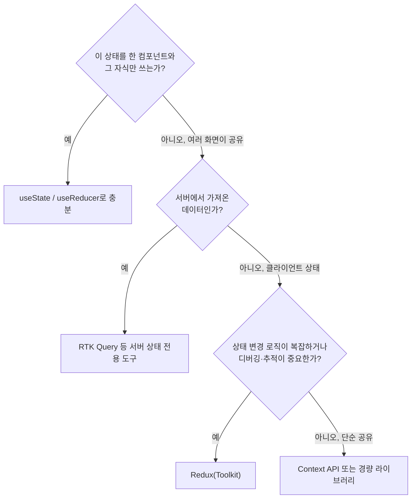

# 10. Redux를 사용하는 이유와 적절한 사용 시기

Phase 2를 마무리하는 이 편은 "Redux 자체를 아는 것"에서 "Redux를 쓸지 판단하는 것"으로 넘어갑니다. Redux를 만든 Dan Abramov가 2016년 직접 "You Might Not Need Redux"라는 글을 쓴 것은 역설적이지 않습니다. 오히려 이 시리즈가 지향하는 태도, 즉 **도구를 무조건 쓰는 것이 아니라 상황에 맞게 선택하는 것**을 가장 잘 보여주는 사례입니다.

## 학습 목표

- 상태를 "로컬 UI 상태", "전역 클라이언트 상태", "서버 상태"로 분류하고 각각에 맞는 도구를 판단할 수 있다.
- Redux, Context API, Zustand의 트레이드오프를 비교할 수 있다.
- 프로젝트 규모·팀 상황에 따라 Redux 도입 여부를 스스로 판단할 수 있다.

## 모든 상태가 Redux로 가야 하는 것은 아니다

Redux를 처음 배우면 "상태는 다 Redux에 넣어야 하는 것 아닌가?"라는 생각이 들기 쉽습니다. 실제로는 상태의 성격에 따라 적합한 도구가 다릅니다.

| 상태 종류 | 예시 | 적합한 도구 |
|---|---|---|
| 로컬 UI 상태 | 모달 열림/닫힘, 입력 필드 값, 호버 여부 | `useState` |
| 여러 컴포넌트가 공유하는 클라이언트 상태 | 로그인 사용자 정보, 장바구니, 테마 설정 | Redux, Context API, Zustand 등 |
| 서버 상태(원격 데이터의 로컬 캐시) | API로 가져온 상품 목록, 게시글 목록 | RTK Query, React Query 등 전용 도구 |

**서버 상태**는 특히 중요한 구분입니다. 서버 상태는 "우리가 소유한 데이터"가 아니라 "서버에 있는 데이터의 로컬 사본"이므로, 캐싱·재검증·로딩/에러 상태 관리가 필요합니다. 이런 요구사항은 일반 Redux 리듀서로 손수 구현하기보다, 이를 위해 설계된 전용 도구(24편의 RTK Query)를 쓰는 편이 효율적입니다.

## Redux vs Context API

React 내장 **Context API**도 여러 컴포넌트에 상태를 전달할 수 있어 Redux의 대안으로 자주 언급됩니다.

```javascript
// Context API로 간단한 테마 상태 공유하기
const ThemeContext = React.createContext("light");

function App() {
  const [theme, setTheme] = useState("light");
  return (
    <ThemeContext.Provider value={theme}>
      <Toolbar />
    </ThemeContext.Provider>
  );
}
```

Context API는 설정이 간단하지만, 다음과 같은 한계가 있습니다.

- **최적화가 수동적이다**: Context 값이 바뀌면 그 Context를 구독하는 **모든** 컴포넌트가 리렌더된다. Redux의 `useSelector`(12·14편)는 선택한 값이 실제로 바뀔 때만 리렌더되도록 자동 최적화한다.
- **미들웨어 생태계가 없다**: 로깅, 비동기 처리, 시간여행 디버깅 같은 기능을 직접 구현해야 한다.
- **여러 상태 조각을 나누려면 Context를 여러 개 만들어야 한다**: Redux는 하나의 Store 안에서 리듀서 조합만으로 이를 처리한다(07편의 `combineReducers`).

즉 Context API는 "자주 바뀌지 않는 값을 트리 깊숙이 전달"하는 데는 적합하지만, "자주 바뀌는 복잡한 상태를 최적화된 방식으로 공유"하는 데는 Redux가 더 적합합니다.

## Redux vs Zustand

**Zustand**는 보일러플레이트가 적은 경량 상태 관리 라이브러리로, 최근 Redux의 대안으로 자주 비교됩니다.

```javascript
// Zustand 예시 (참고용 — 이 시리즈에서 다루는 라이브러리는 아님)
import { create } from "zustand";

const useCounterStore = create((set) => ({
  count: 0,
  increment: () => set((state) => ({ count: state.count + 1 })),
}));
```

Zustand는 Action/Reducer 같은 엄격한 구조 없이 상태와 변경 함수를 한곳에 정의할 수 있어 학습 곡선이 낮습니다. 반면 Redux는 구조가 엄격한 만큼 **팀 전체가 같은 패턴을 강제로 따르게 되고**, Redux DevTools·미들웨어 생태계·Redux Toolkit 같은 성숙한 도구가 뒷받침합니다. 팀 규모가 크고 여러 사람이 상태 변경 로직을 다뤄야 한다면 Redux의 엄격함이 오히려 장점이 되고, 작은 프로젝트나 빠른 프로토타이핑에는 Zustand 같은 가벼운 도구가 유리할 수 있습니다.

## 판단 흐름도



## Redux 도입을 정당화하는 신호

실무에서 Redux 도입을 고려할 만한 구체적인 신호는 다음과 같습니다.

- 서로 멀리 떨어진 컴포넌트 여러 개가 같은 상태를 읽고 쓴다(Props Drilling이 3단계 이상 깊어짐).
- 상태 변경 로직이 여러 단계를 거치거나 조건에 따라 달라져, 어디서 어떻게 바뀌는지 추적이 필요하다.
- 여러 비동기 요청의 결과를 조합해야 하는 등, 미들웨어로 처리하면 깔끔해지는 로직이 있다.
- 팀 규모가 커서 "상태는 이렇게 다룬다"는 공통 규칙이 필요하다.

반대로 다음과 같다면 Redux 없이도 충분합니다.

- 상태가 한두 컴포넌트 안에서만 쓰이고 깊이 전달할 필요가 없다.
- 프로젝트가 작고, 팀이 작아 규칙보다 속도가 더 중요하다.
- 대부분의 상태가 서버 데이터이고, RTK Query 같은 전용 도구만으로 해결된다.

## 실무 체크리스트

- 지금 Redux에 넣으려는 상태가 로컬 UI 상태는 아닌지 다시 확인했는가?
- 서버에서 가져온 데이터를 일반 리듀서로 손수 캐싱하려 하고 있지 않은가?
- "그냥 다들 Redux를 쓰니까"가 아니라, 구체적인 신호(Props Drilling, 복잡한 변경 로직, 팀 규모)에 근거해 도입을 판단했는가?

## 연습 과제

### 기초(★☆☆)
- 여러분이 아는 프로젝트(또는 가상의 앱)에서 상태 5개를 나열하고, 각각을 로컬/클라이언트/서버 상태로 분류해보세요.

### 중급(★★☆)
- 위 판단 흐름도를 실제 상태 5개에 적용해, Redux로 가야 할 상태와 그렇지 않은 상태를 구분해보세요.

### 고급(★★★)
- Redux, Context API, Zustand 세 가지로 같은 카운터 앱을 각각 구현하고, 코드량·보일러플레이트·리렌더 최적화 관점에서 비교표를 작성해보세요.

## 요약

- 상태는 로컬 UI, 클라이언트, 서버 상태로 나뉘며, Redux는 그중 복잡한 클라이언트 상태에 가장 적합하다.
- Context API는 간단하지만 리렌더 최적화가 수동적이고, Zustand는 가볍지만 Redux만큼 엄격한 구조를 강제하지 않는다.
- Props Drilling, 복잡한 변경 로직, 팀 규모라는 구체적 신호로 Redux 도입 여부를 판단한다.

## 참고 문헌 및 출처(추천)

- Dan Abramov, "You Might Not Need Redux"(2016, medium.com)
- Redux 공식 문서, "FAQ: When should I use Redux?"
- React 공식 문서, "Passing Data Deeply with Context" — Context API의 설계 의도와 한계

---

## 다음 글

- 다음: [11. React-Redux 시작하기 - Provider와 connect](../react-redux-basics/)
