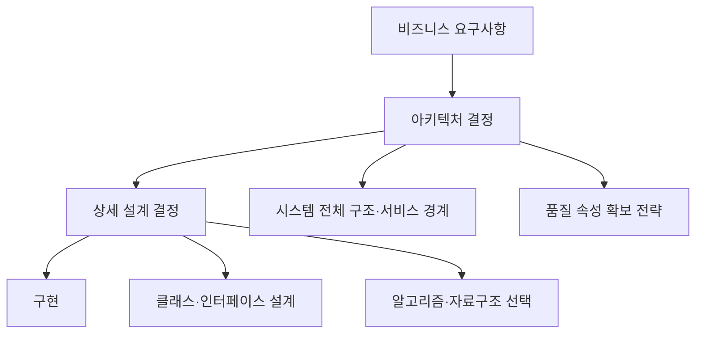

실무에서 "아키텍처"라는 단어는 사람마다 다른 것을 가리킨다. 어떤 사람은 클래스 다이어그램을 아키텍처라 부르고, 어떤 사람은 배포 인프라 구성도를 아키텍처라 부르며, 어떤 사람은 회의만 하고 코드는 안 짜는 사람을 "아키텍트"라고 부른다. 이 혼란은 우연이 아니다. 소프트웨어 공학계는 반세기 가까이 아키텍처를 표준화된 언어로 정의하려 시도해 왔고, 그 결과 나온 정의들도 서로 강조점이 다르다.

이 장은 그 표준 정의들을 원문과 대조하고, 아키텍처와 상세 설계를 가르는 실질적 기준이 무엇인지, 아키텍트라는 역할이 다른 역할과 어떻게 다른지, 그리고 지난 반세기 동안 아키텍처 패러다임이 어떤 계기로 바뀌어 왔는지를 다룬다. 이후 모든 장은 이 장에서 세운 정의와 어휘를 전제로 진행되므로, 여기서 다루는 개념은 가볍게 훑고 넘어갈 대상이 아니라 시리즈 전체의 공통 언어다.

## 이 장을 읽기 전에

**선행 챕터**: 이 장은 [00장: 소프트웨어 아키텍처 교육과정 소개](/post/software-architecture/getting-started-software-architecture-curriculum/)에서 제시한 학습 로드맵을 전제로 한다. 아직 읽지 않았다면 이 컬렉션 전체의 동기와 16개 챕터의 의존관계를 먼저 확인하는 것을 권장한다.

**이 장의 깊이**: 이 장은 **초급–중급** 수준이다. 프로그래밍 경험은 있지만 시스템 전체를 설계해 본 적이 없는 독자를 대상으로, "아키텍처가 정확히 무엇을 가리키는가"라는 가장 기초적인 질문에 표준 정의와 실제 사례로 답한다.

**다루지 않는 것**: SOLID를 비롯한 구체적 설계 원칙은 [02장: 아키텍처 설계 원칙](/post/software-architecture/architecture-design-principles/)에서, 계층화·마이크로서비스 등 구체적 아키텍처 패턴은 03–04장에서, 성능·가용성 같은 품질 속성의 정량적 다루기는 05장에서 각각 별도로 다룬다. 이 장은 그 모든 장에서 공통으로 쓰는 정의와 판단 기준을 세우는 데 집중한다.

## 당신의 수준에 맞는 경로

| 수준 | 읽을 부분 | 핵심 목표 |
|------|---------|---------|
| **완전 초보자** | "소프트웨어 아키텍처란 무엇인가" ~ "아키텍처와 설계는 어떻게 다른가" | 아키텍처와 설계를 구분하는 감각 익히기 |
| **주니어–미드레벨 개발자** | 전체(사례·오해 포함) | 표준 정의를 근거로 아키텍처 결정을 설명하는 능력 |
| **팀 리드/아키텍트 지망자** | "아키텍트의 역할과 갖춰야 할 역량", "언제 아키텍처에 공을 들이고, 언제 최소화할 것인가" | 조직 차원의 투자 판단 기준 수립 |

---

## 소프트웨어 아키텍처란 무엇인가

소프트웨어 아키텍처는 **시스템을 구성하는 요소들과 그 관계, 그리고 그 관계가 시간에 따라 변해가는 방식을 이끄는 원칙의 집합**을 가리킨다. 이 정의가 추상적으로 들리는 이유는, 표준화 기구들조차 지난 수십 년간 정의를 여러 차례 다듬어 왔기 때문이다. 그 변천 과정 자체가 아키텍처라는 개념이 무엇을 포착하려 하는지 보여준다.

가장 널리 인용되는 정의는 IEEE 1471-2000에서 출발한다. 이 표준은 아키텍처를 다음과 같이 정의했다.

> "the fundamental organization of a system, embodied in its components, their relationships to each other and to the environment, and the principles guiding its design and evolution" — IEEE 1471-2000, *Recommended Practice for Architectural Description of Software-Intensive Systems*

IEEE 1471-2000은 2011년 국제표준화기구로 이관되며 ISO/IEC/IEEE 42010:2011로 개정되었고, 정의도 함께 다듬어졌다.

> "fundamental concepts or properties of a system in its environment embodied in its elements, relationships, and in the principles of its design and evolution" — ISO/IEC/IEEE 42010:2011, *Systems and software engineering — Architecture description*

두 정의의 차이는 사소해 보이지만 의도가 있다. "근본 조직(fundamental organization)"이 "근본 개념 또는 속성(fundamental concepts or properties)"으로 바뀐 것은, 도면으로 그려지지 않은 암묵적 구조도 아키텍처로 인정한다는 취지를 더 분명히 하기 위해서다. 즉 아키텍처는 문서가 아니라 **시스템에 실제로 내재한 구조**이며, 문서는 그 구조를 나중에 기술한 결과물일 뿐이다. ISO/IEC/IEEE 42010:2011은 이후 2022년판으로 다시 개정되었지만, "요소·관계·진화 원칙"이라는 핵심 골격은 유지되었다.

한편 카네기멜론대학교 소프트웨어공학연구소(SEI)는 실무 구현 관점에서 다른 표현을 쓴다.

> "The software architecture of a program or computing system is the structure or structures of the system, which comprise software components, the externally visible properties of those components, and the relationships among them." — Len Bass, Paul Clements, Rick Kazman, 『Software Architecture in Practice』

SEI 정의가 강조하는 것은 "외부에서 관찰 가능한 속성(externally visible properties)"이다. 한 컴포넌트가 내부적으로 어떻게 구현되었는지는 아키텍처의 관심사가 아니고, 다른 컴포넌트가 그것에 대해 가정할 수 있는 것 — 제공하는 서비스, 성능 특성, 장애 처리 방식, 공유 자원 사용 여부 — 만이 아키텍처 수준의 결정이라는 뜻이다. 정리하면 ISO/IEEE 계열 정의는 "환경과의 관계 및 진화 원칙"에, SEI 정의는 "컴포넌트 간 계약(contract)"에 각각 무게를 둔다. 두 정의를 합쳐 읽으면, 아키텍처란 <strong>시스템의 각 부분이 서로에게 무엇을 보장하는지(계약)</strong>와 <strong>그 보장이 시간이 지나도 유지되게 하는 원칙(진화)</strong>의 조합이라고 이해할 수 있다.

## 아키텍처와 설계는 어떻게 다른가

아키텍처와 상세 설계를 "규모의 차이"로만 구분하는 것은 흔한 오해다. 이 관점대로라면 클래스 몇 개를 묶으면 설계이고, 클래스 수백 개를 묶으면 아키텍처가 되는 셈이다. 그러나 실제 기준은 크기가 아니라 **되돌리기 비용**이다. 객체지향 디자인 패턴의 공저자인 랄프 존슨은 이를 다음과 같이 정리했다.

> "Architecture is about the important stuff. Whatever that is." — Ralph Johnson, Martin Fowler의 "Software Architecture Guide"에서 인용(martinfowler.com)

여기서 "중요한 것(important stuff)"의 기준은 크기가 아니라 **나중에 바꾸는 데 드는 비용**이다. 서비스 경계를 어디에 그을지, 데이터베이스로 관계형을 쓸지 문서형을 쓸지, 팀 간 통신을 동기 호출로 할지 메시지 큐로 할지 같은 결정은 한번 자리 잡으면 여러 팀·여러 시스템에 걸쳐 되돌리기가 어렵다. 반면 정렬 알고리즘으로 무엇을 쓸지, 특정 클래스의 메서드를 어떻게 나눌지는 국소적으로 바꿀 수 있다. 전자가 아키텍처이고 후자가 상세 설계다 — 코드 줄 수나 파일 개수와는 무관하다.

이 기준을 시스템의 추상화 단계로 펼쳐 보면 다음과 같다.



| 구분 | 아키텍처 | 상세 설계 |
|------|----------|-----------|
| 판단 기준 | 되돌리는 비용이 큰가 | 국소적으로 되돌릴 수 있는가 |
| 관점 | 시스템 전체(무엇을, 어디까지) | 구현 방법(어떻게) |
| 전형적 예 | 서비스 경계, 데이터 저장소 선택, 팀 간 통신 방식 | 클래스 분리, 메서드 시그니처, 알고리즘 선택 |
| 영향 범위 | 여러 팀·여러 시스템 | 특정 모듈 내부 |

같은 온라인 쇼핑몰 시스템을 예로 들면, "주문·결제·재고를 별도 서비스로 분리하고 서비스 간에는 메시지 큐로만 통신한다"는 결정은 아키텍처다. 이 결정을 뒤집으려면 세 서비스의 배포 파이프라인과 팀 조직까지 함께 바꿔야 한다. 반면 아래처럼 하나의 주문 서비스 내부에서 재고 확인과 결제 처리 순서를 어떻게 조합할지는 상세 설계다.

```java
public interface PaymentProcessor {
    PaymentResult process(Payment payment);
}

public interface InventoryService {
    boolean checkStock(List<OrderItem> items);
}

public class OrderService {
    private final PaymentProcessor paymentProcessor;
    private final InventoryService inventoryService;

    public OrderService(PaymentProcessor paymentProcessor, InventoryService inventoryService) {
        this.paymentProcessor = paymentProcessor;
        this.inventoryService = inventoryService;
    }

    public OrderResult processOrder(Order order) {
        if (!inventoryService.checkStock(order.getItems())) {
            return OrderResult.OUT_OF_STOCK;
        }
        PaymentResult payment = paymentProcessor.process(order.getPayment());
        if (!payment.isSuccessful()) {
            return OrderResult.PAYMENT_FAILED;
        }
        return OrderResult.CONFIRMED;
    }
}
```

`OrderService`가 `PaymentProcessor`와 `InventoryService`라는 인터페이스에 의존한다는 것 자체는 의존성 역전이라는 설계 원칙(02장에서 다룬다)의 적용이지만, 이 메서드 내부의 순서를 바꾸는 것은 이 클래스 하나만 수정하면 끝난다. 반면 `PaymentProcessor`의 구현체를 REST 동기 호출에서 이벤트 기반 비동기 처리로 바꾸는 것은 호출하는 쪽 코드 전체와 장애 처리 전략까지 다시 설계해야 하는 아키텍처 결정이다.

## 아키텍처에 투자해야 하는 이유: 실제 사례 두 가지

아키텍처가 필요한 이유를 추상적으로 나열하면(복잡성 관리, 품질 속성 확보, 위험 완화) 설득력이 약하다. 실제로 아키텍처 부재가 비용으로 드러난 두 사례를 보면, 그 비용이 왜 "복잡성"이라는 말로 뭉뚱그려지지 않고 구체적인 조직적 결과로 나타나는지 알 수 있다.

첫 번째는 2000년대 초 아마존 내부에서 있었다고 알려진 이른바 "베조스 API 지시(Bezos API Mandate)"다. 이 일화는 모든 팀이 데이터와 기능을 서비스 인터페이스로만 공개하고, 직접적인 데이터베이스 접근이나 프로세스 간 공유 메모리 방식의 통신을 금지하라는 내부 지시였다고 전해진다. 다만 이 메모의 원문은 현재 남아 있지 않고, 2011년 소프트웨어 엔지니어 스티브 예기가 자신의 소셜미디어 글에서 회고한 것이 사실상 유일한 기록이어서 정확한 문구는 검증할 수 없다는 한계가 있다. 그럼에도 이 일화가 계속 회자되는 이유는 결과가 뚜렷하기 때문이다 — 이 방향 전환은 이후 아마존의 서비스 지향 아키텍처(SOA)로, 다시 AWS의 웹 서비스 사업으로 이어졌다고 업계에서 널리 받아들여진다.

두 번째는 검증 가능한 사례다. 넷플릭스는 2008년 대규모 데이터베이스 손상 사고로 며칠간 DVD 배송 서비스가 중단되는 일을 겪었다. 클라우드 아키텍트로 합류한 애드리언 콕크로프트는 기존 데이터센터 구조에 이중화를 더하는 것은 근본 원인(단일 장애점이 될 수 있는 중앙집중식 데이터베이스)을 해결하지 못한다고 판단했고, 이후 수년에 걸쳐 검색 자동완성 서비스처럼 작은 기능부터 클라우드로 옮기며 점진적으로 마이크로서비스로 전환했다고 밝혔다. 콕크로프트 본인이 인터뷰에서 강조한 전략은 "가장 작으면서 가장 많이 배울 수 있는 것부터 옮긴다"는 원칙이었다 — 처음부터 "2.0 버전"을 몇 년에 걸쳐 설계하는 방식은 작동하지 않는다는 것이다. 이 전환은 완료까지 약 7년이 걸렸다고 알려져 있다.

두 사례가 공통으로 보여주는 것은, 아키텍처 결정을 미루는 비용은 당장 드러나지 않다가 조직이나 트래픽 규모가 임계점을 넘는 순간 한꺼번에 청구된다는 점이다. 그 청구서가 사흘간의 서비스 중단이든, 여러 해에 걸친 재설계든 형태만 다를 뿐이다.

## 아키텍트의 역할과 갖춰야 할 역량

소프트웨어 아키텍트는 비즈니스 요구사항과 기술적 제약을 함께 고려해 시스템 전체 구조에 대한 결정을 내리고, 그 결정의 근거를 팀과 조직에 설명하는 역할을 맡는다. 여기서 핵심은 "결정을 내린다"는 것과 "그 근거를 설명한다"는 것이 분리될 수 없다는 점이다 — 아키텍처 결정은 대개 여러 품질 속성 사이의 트레이드오프이므로, 왜 이 선택이 다른 대안보다 나은지 설명하지 못하면 팀은 그 결정을 신뢰하고 따르기 어렵다.

이 역할은 프로젝트 매니저나 제품 매니저와 관심사의 축이 다르다. 프로젝트 매니저는 일정·자원·범위를 관리하고, 제품 매니저는 사용자 가치와 우선순위를 정의한다. 아키텍트는 그 요구사항들이 기술적으로 어떻게 충족되는지, 그리고 그 충족 방식이 시스템의 미래 변경 비용에 어떤 영향을 주는지를 책임진다. 개발자와의 차이는 관점의 범위다 — 개발자가 특정 모듈이나 컴포넌트 내부를 최적화한다면, 아키텍트는 모듈 간 경계와 그 경계를 넘나드는 계약을 설계한다.

| 역할 | 주요 관심사 | 책임 범위 |
|------|-------------|-----------|
| 아키텍트 | 시스템 전체 구조, 품질 속성 트레이드오프 | 아키텍처 결정, 기술 리더십 |
| 개발자 | 기능 구현, 코드 품질 | 상세 설계, 구현 |
| 프로젝트 매니저 | 일정, 자원, 범위 | 계획 수립, 진행 관리 |
| 제품 매니저 | 비즈니스 가치, 사용자 경험 | 요구사항 정의, 우선순위 |

아키텍트에게 요구되는 역량은 기술 지식과 커뮤니케이션 능력 두 축으로 나뉘지만, 둘 중 하나만으로는 충분하지 않다. 여러 기술 도메인에 걸친 지식과 SOLID 같은 설계 원칙(02장), 계층화·마이크로서비스 같은 아키텍처 패턴(03–04장)에 대한 이해가 뒷받침되지 않으면 트레이드오프를 판단할 근거 자체가 없다. 반대로 그 판단을 팀과 이해관계자에게 설득력 있게 전달하지 못하면, 아무리 옳은 결정이라도 조직 안에서 실행되지 않는다. 많은 조직에서 "아키텍트"라는 직함 없이도 시니어 개발자나 테크 리드가 이 역할을 실질적으로 수행하는 경우가 흔하며, 이는 다음 절에서 다룰 오해와도 연결된다.

## 아키텍처 패러다임의 역사적 진화

아키텍처 패턴은 유행이 아니라 당시의 하드웨어·네트워크 제약에 대한 응답으로 등장했다. 1960–70년대 메인프레임 시대에는 컴퓨팅 자원이 워낙 비쌌기 때문에 중앙집중식 처리와 배치 작업이 표준이었고, 이 시기에 자리 잡은 계층화 구조는 지금까지도 3계층 아키텍처의 원형으로 남아 있다. GUI 기반 아키텍처의 핵심 개념인 MVC(Model-View-Controller)도 이 시기 끝자락에서 나왔다 — 트리그베 리엔스코그가 1978–1979년 제록스 PARC의 학습연구그룹(Learning Research Group)에 방문 연구원으로 있으면서 스몰토크 환경을 위해 고안했고, 1979년 12월 노트에서 지금의 이름으로 정리했다고 알려져 있다.

1980–90년대 PC와 클라이언트-서버 시대에는 네트워크가 저렴해지면서 처리를 여러 기기로 나누는 2-tier·3-tier 구조가 자리 잡았고, 1990년대 후반 웹의 확산과 함께 HTTP라는 공통 프로토콜 위에서 동작하는 웹 기반 아키텍처와 SOA가 등장했다. 이 시기의 중요한 이론적 전환점은 로이 필딩이 2000년 박사학위 논문에서 REST(Representational State Transfer) 아키텍처 스타일을 정식화한 것이다 — 이후 REST는 HTTP API 설계의 사실상 표준 어휘가 되었다.

2000년대 후반부터는 서비스 경계를 명시적으로 다루는 패턴들이 정립되었다. 앨리스터 코오번은 2005년 발표한 글에서 애플리케이션 핵심 로직을 UI·데이터베이스 같은 외부 기술로부터 분리하는 헥사고날 아키텍처(포트와 어댑터)를 제안했다. 이 아이디어는 이후 로버트 C. 마틴이 정리한 클린 아키텍처로 이어지며 04장에서 자세히 다룬다. 마이크로서비스라는 용어 자체는 마틴 파울러와 제임스 루이스가 2014년 3월 공동으로 발표한 글에서 체계적으로 정의되었으며, 두 저자는 당시 이 스타일이 "미래의 표준"이라고 단정하기에는 장기적 데이터가 부족하다고 신중한 태도를 취했다는 점도 함께 기록해 둘 만하다.

| 시기 | 지배적 제약 | 대표 패러다임 |
|------|-----------|---------------|
| 1960–70년대 | 컴퓨팅 자원 비용 | 메인프레임, 계층화 구조 |
| 1980–90년대 | 네트워크 비용 | 클라이언트-서버, MVC |
| 1990년대 말–2000년대 초 | 상호운용성 | 웹 기반 아키텍처, REST, SOA |
| 2000년대 후반–2010년대 | 팀·배포 단위 분리 | 헥사고날/클린 아키텍처, 마이크로서비스 |
| 2010년대–현재 | 인프라 운영 비용 | 컨테이너 오케스트레이션, 서버리스 |

이 표가 보여주는 흐름은 "더 좋은 패턴이 발견되었다"가 아니라 "새로운 제약이 등장할 때마다 기존 원칙이 재해석되었다"는 것이다. 관심사의 분리(separation of concerns)와 느슨한 결합이라는 원칙은 계층화 구조에서도, 마이크로서비스에서도 동일하게 적용되지만 그 원칙을 실현하는 경계의 단위가 클래스에서 계층으로, 계층에서 서비스로 이동했을 뿐이다. 이 원칙들이 02장에서 SOLID라는 코드 레벨의 구체적 형태로, 03–04장에서 아키텍처 레벨의 구체적 패턴으로 각각 체계화된다.

## 흔히 갖는 오해 세 가지

**"아키텍처는 그냥 큰 설계다."** 앞서 다뤘듯 이 오해는 아키텍처와 설계를 구분하는 기준을 크기로 착각하는 데서 비롯된다. 실제 기준은 되돌리기 비용이며, 작은 모듈이라도 여러 팀이 공유하는 계약이면 아키텍처 결정이고, 큰 파일이라도 한 팀 내부에서만 영향을 미치면 상세 설계다.

**"아키텍처는 프로젝트 초반에 한 번 정하면 끝난다."** 이 오해는 IEEE 1471과 ISO/IEC/IEEE 42010의 정의에 이미 반박 근거가 들어 있다 — 두 정의 모두 "설계와 **진화**를 이끄는 원칙"이라고 명시해, 아키텍처를 고정된 산출물이 아니라 지속적 과정으로 규정한다. 닐 포드, 레베카 파슨스, 패트릭 쿠아는 『Building Evolutionary Architectures』(O'Reilly, 2017)에서 이를 "적합도 함수(fitness function)"라는 개념으로 구체화했다 — 아키텍처가 지켜야 할 특성(응답 시간, 결합도 등)을 자동화된 검사로 정의해, 시스템이 변경되어도 그 특성이 계속 유지되는지 지속적으로 검증하자는 것이다.

**"아키텍트는 코드를 짜지 않는 사람이다."** 이 오해는 대기업의 일부 조직에서 아키텍트가 문서 작성과 회의에만 참여하는 사례가 알려지면서 굳어진 인상에 가깝다. 실제로는 앞서 다룬 애드리언 콕크로프트의 사례처럼, 많은 조직에서 아키텍트는 작은 파일럿 구현을 직접 주도하며 그 결과로 아키텍처 방향을 검증한다. 코드를 짜지 않으면 자신이 내린 결정이 실제로 어떤 비용을 만드는지 체감할 수 없고, 그 결과 결정은 점점 현실과 멀어진다.

## 언제 아키텍처에 공을 들이고, 언제 최소화할 것인가

아키텍처에 시간을 투자할지 말지는 시스템의 예상 수명과 결정의 되돌리기 비용, 그리고 관련된 팀의 수로 판단한다. 프로토타입처럼 검증 후 버려질 가능성이 큰 코드에 서비스 경계까지 정교하게 설계하는 것은 시간 낭비이고, 반대로 여러 팀이 장기간 공유할 시스템의 데이터 저장소 선택을 "일단 되는 대로" 정하는 것은 나중에 훨씬 큰 비용으로 되돌아온다. 이 판단을 코드 줄 수나 프로젝트 "규모"가 아니라 아래 네 가지 질문으로 구조화하면 팀 안에서 합의하기 쉬워진다.

| 상황 | 판단 | 근거 |
|------|------|------|
| 프로토타입·PoC, 예상 수명 3개월 미만 | 최소화 | 검증 후 버려질 가능성이 크면 되돌리기 쉬운 결정에 시간을 쓰는 것 자체가 낭비다 |
| 단일 팀이 운영하는 내부 도구 | 최소화–보통 | 팀 내 커뮤니케이션 비용이 낮아 격식 있는 문서 없이도 조율이 가능하다 |
| 여러 팀이 동시에 개발, 장기 운영 예정 | 공들여야 함 | 팀 경계와 서비스 경계가 어긋나면 조율 비용이 조직 규모에 비례해 커진다 |
| 되돌리기 비용이 큰 결정(데이터 저장소, 서비스 경계, 외부 공개 API) | 공들여야 함 | 나중에 바꾸려면 여러 팀·여러 시스템에 걸친 마이그레이션이 필요하다 |

두 번째와 세 번째 행의 기준이 "팀 수"인 이유는 우연이 아니다. 멜빈 콘웨이는 1968년 논문에서 "시스템을 설계하는 조직은 그 조직의 소통 구조를 그대로 복제한 설계를 만들어낸다"고 정리했다.

> "organizations which design systems (in the broad sense used here) are constrained to produce designs which are copies of the communication structures of these organizations" — Melvin Conway, "How Do Committees Invent?" (*Datamation*, 1968)

이른바 콘웨이의 법칙이다. 팀이 하나뿐이면 팀원끼리 실시간으로 조율할 수 있으므로 아키텍처 경계가 다소 어긋나 있어도 비용이 크지 않다. 반면 여러 팀이 관여하는 순간, 팀 간 소통 구조와 어긋난 아키텍처 경계는 매번 팀 간 조율 회의라는 형태로 비용을 청구한다 — 이것이 바로 앞서 다룬 아마존과 넷플릭스 사례에서 서비스 경계를 다시 그은 이유이기도 하다.

## 학습 성과 평가 기준

이 장을 완주하면 다음을 할 수 있어야 한다.

- [ ] IEEE 1471-2000과 ISO/IEC/IEEE 42010, SEI의 아키텍처 정의를 각각 설명하고 두 계열이 강조하는 지점의 차이를 말할 수 있는가?
- [ ] 아키텍처와 상세 설계를 "크기"가 아니라 "되돌리기 비용"으로 구분하는 근거를 예를 들어 설명할 수 있는가?
- [ ] 아키텍트가 프로젝트 매니저·제품 매니저·개발자와 관심사의 축이 어떻게 다른지 설명할 수 있는가?
- [ ] MVC, REST, 헥사고날 아키텍처, 마이크로서비스가 각각 언제·왜 등장했는지 연도와 함께 말할 수 있는가?
- [ ] 이 장에서 다룬 세 가지 오해(크기 오해, 고정 오해, 비코딩 오해)를 각각 원 개념으로 교정해 설명할 수 있는가?
- [ ] 주어진 상황(프로토타입 vs 다중 팀 장기 시스템)에서 아키텍처에 얼마나 공을 들일지 콘웨이의 법칙을 근거로 판단할 수 있는가?

## 다음 장에서는

02장 <strong>「아키텍처 설계 원칙」</strong>에서는 이 장에서 다룬 "관심사의 분리"와 "느슨한 결합"이라는 원칙이 SOLID라는 구체적인 다섯 가지 규칙으로 어떻게 체계화되는지, 그리고 그 규칙이 클래스 레벨을 넘어 아키텍처 레벨로 확장될 때 어떤 형태를 띠는지 다룬다.

## 참고 및 출처

- IEEE, 『IEEE 1471-2000: Recommended Practice for Architectural Description of Software-Intensive Systems』; ISO/IEC/IEEE 42010:2011로 개정, [ISO/IEC/IEEE 42010 표준 정보(standards.ieee.org)](https://standards.ieee.org/ieee/42010/5334/)
- Len Bass, Paul Clements, Rick Kazman, 『Software Architecture in Practice』(SEI 시리즈) — [SEI, "What Is Your Definition of Software Architecture?"](https://www.sei.cmu.edu/documents/2544/2010_010_001_513810.pdf)
- Martin Fowler & James Lewis, ["Microservices"](https://martinfowler.com/articles/microservices.html)(martinfowler.com, 2014)
- Alistair Cockburn, ["Hexagonal Architecture"](https://alistair.cockburn.us/hexagonal-architecture)(2005)
- Melvin Conway, "How Do Committees Invent?"(*Datamation*, 1968) — [원문 요약(melconway.com)](https://www.melconway.com/Home/Conways_Law.html)
- Neal Ford, Rebecca Parsons, Patrick Kua, 『Building Evolutionary Architectures』(O'Reilly, 2017)
- 더 읽을거리: [Martin Fowler, "Software Architecture Guide"](https://martinfowler.com/architecture/)
