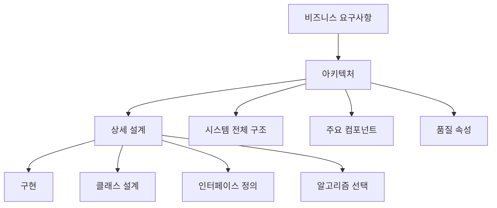
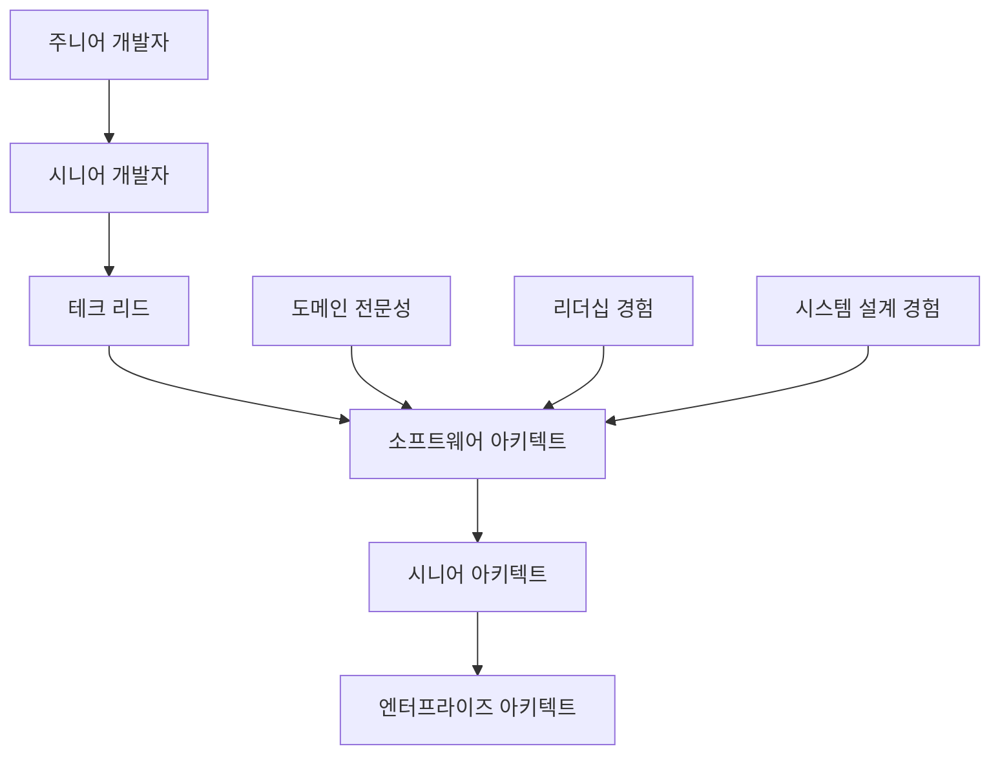

# 1장. 소프트웨어 아키텍처 기초

## 학습 목표
- 소프트웨어 아키텍처의 정확한 정의와 중요성 이해
- 아키텍처와 설계의 차이점을 명확히 구분
- 소프트웨어 아키텍트의 역할과 책임 파악
- 아키텍처 발전 과정을 통한 현재 트렌드 이해

---

## 1.1 소프트웨어 아키텍처의 정의와 중요성

### 소프트웨어 아키텍처란?

소프트웨어 아키텍처는 **시스템의 근본적인 구조**를 의미합니다. 건축의 아키텍처가 건물의 전체적인 구조와 설계 철학을 나타내듯이, 소프트웨어 아키텍처는 소프트웨어 시스템의 전체적인 구조와 설계 원칙을 정의합니다.

#### 표준 정의들

**IEEE 1471 표준:**
> "시스템의 근본 조직으로서, 환경과의 관계에서 구성요소들과 그들의 관계, 그리고 설계와 진화를 이끄는 원칙들로 구현된다."

**SEI(Software Engineering Institute) 정의:**
> "프로그램이나 컴퓨팅 시스템의 구조 또는 구조들로서, 소프트웨어 구성요소들, 그 구성요소들의 외부적으로 보이는 속성들, 그리고 그들 간의 관계들을 포함한다."

####️ 건축과 소프트웨어 아키텍처 비교

| 측면 | 건축 아키텍처 | 소프트웨어 아키텍처 |
|------|---------------|---------------------|
| **목적** | 공간의 기능적/미적 구성 | 시스템의 기능적/품질적 구성 |
| **구성요소** | 방, 벽, 기둥, 보 | 모듈, 컴포넌트, 서비스 |
| **청사진** | 건축 도면, 평면도 | 아키텍처 다이어그램, UML |
| **제약사항** | 물리적 법칙, 건축 법규 | 기술적 제약, 성능 요구사항 |
| **변경 비용** | 높음 (구조 변경 어려움) | 상대적 낮음 (리팩토링 가능) |

### 아키텍처의 중요성

#### 1. **복잡성 관리**
현대 소프트웨어는 수백만 줄의 코드와 수많은 모듈로 구성됩니다. 아키텍처는 이러한 복잡성을 체계적으로 관리할 수 있는 구조를 제공합니다.

```
전자상거래 시스템 예시:
├── 사용자 관리 모듈
├── 상품 카탈로그 모듈  
├── 주문 처리 모듈
├── 결제 처리 모듈
├── 배송 관리 모듈
└── 고객 서비스 모듈
```

#### 2. **이해관계자 간 소통**
아키텍처는 개발자, 관리자, 고객 등 다양한 이해관계자들이 시스템을 이해하고 소통할 수 있는 공통 언어 역할을 합니다.

#### 3. **품질 속성 달성**
- **성능**: 캐싱, 로드 밸런싱 등의 아키텍처 패턴
- **확장성**: 마이크로서비스, 수평적 확장 구조
- **보안**: 계층적 보안, 인증/인가 아키텍처
- **유지보수성**: 모듈화, 느슨한 결합

#### 4. **위험 완화**
초기 아키텍처 설계를 통해 기술적 위험을 조기에 식별하고 대응할 수 있습니다.

### 실패 사례: 아키텍처 부재의 결과

**사례 1: 대형 은행 시스템**
- 문제: 30년간 누적된 모놀리식 시스템
- 결과: 새로운 기능 추가에 6개월 이상 소요
- 해결: 마이크로서비스 아키텍처로 점진적 전환

**사례 2: 소셜미디어 플랫폼**
- 문제: 급격한 사용자 증가에 대비 부족
- 결과: 서비스 다운타임 빈발, 사용자 이탈
- 해결: 확장 가능한 클라우드 아키텍처 도입

---

## 1.2 아키텍처와 설계의 차이점

### 추상화 레벨의 차이



| 구분 | 아키텍처 | 상세 설계 |
|------|----------|-----------|
| **관점** | 시스템 전체 (What) | 구현 방법 (How) |
| **추상화** | 높음 | 낮음 |
| **범위** | 시스템 경계, 주요 컴포넌트 | 클래스, 메서드, 알고리즘 |
| **시기** | 초기 단계 | 구현 직전 |
| **변경 비용** | 매우 높음 | 상대적 낮음 |
| **영향도** | 전체 시스템 | 특정 모듈 |

### 시간축에서의 차이

**아키텍처 결정 시점:**
- 프로젝트 초기 (요구사항 분석 직후)
- 기술 스택 선택
- 전체 시스템 구조 정의

**상세 설계 시점:**
- 개발 단계 직전
- 스프린트 계획 수립 시
- 특정 기능 구현 전

### 실제 예시: 온라인 쇼핑몰

**아키텍처 레벨 결정:**
```
[웹 브라우저] ↔ [로드 밸런서] ↔ [웹 서버 클러스터]
                                      ↓
[캐시 서버] ← [애플리케이션 서버] → [데이터베이스]
                    ↓
              [메시지 큐] → [배송 시스템]
```

**상세 설계 레벨 결정:**
```java
public class OrderService {
    private PaymentProcessor paymentProcessor;
    private InventoryService inventoryService;
    
    public OrderResult processOrder(Order order) {
        // 1. 재고 확인
        if (!inventoryService.checkStock(order.getItems())) {
            return OrderResult.OUT_OF_STOCK;
        }
        
        // 2. 결제 처리
        PaymentResult payment = paymentProcessor.process(order.getPayment());
        if (!payment.isSuccessful()) {
            return OrderResult.PAYMENT_FAILED;
        }
        
        // 3. 주문 확정
        return confirmOrder(order);
    }
}
```

---

## 1.3 아키텍트의 역할과 책임

### 소프트웨어 아키텍트란?

소프트웨어 아키텍트는 **기술적 비전을 제시하고 시스템의 전체적인 구조를 설계하는 역할**을 담당합니다. 단순히 기술적 결정만 내리는 것이 아니라, 비즈니스 요구사항과 기술적 제약사항을 균형있게 고려하여 최적의 해결책을 제시합니다.

### 핵심 역할과 책임

#### 1. **기술적 리더십**
- 기술 비전과 방향성 제시
- 기술적 의사결정 주도
- 개발팀의 기술적 멘토링
- 아키텍처 원칙과 가이드라인 수립

#### 2. **시스템 설계**
- 전체 시스템 구조 설계
- 컴포넌트 간 인터페이스 정의
- 데이터 플로우 설계
- 기술 스택 선택과 평가

#### 3. **품질 관리**
- 비기능적 요구사항 분석
- 성능, 보안, 확장성 고려
- 아키텍처 리뷰 수행
- 기술 부채 관리

#### 4. **이해관계자 소통**
- 비기능적 요구사항을 기술적 해결책으로 변환
- 개발팀과 비즈니스팀 간 소통 다리 역할
- 아키텍처 의사결정 근거 설명
- 프로젝트 위험 요소 식별과 소통

### 아키텍트 vs 다른 역할

| 역할 | 주요 관심사 | 시각 | 책임 범위 |
|------|-------------|------|-----------|
| **아키텍트** | 전체 시스템 구조, 품질 속성 | 시스템 전체 | 아키텍처 결정, 기술 리더십 |
| **개발자** | 기능 구현, 코드 품질 | 모듈/컴포넌트 | 상세 설계, 구현 |
| **프로젝트 매니저** | 일정, 자원, 범위 | 프로젝트 관리 | 계획 수립, 진행 관리 |
| **제품 매니저** | 비즈니스 가치, 사용자 경험 | 제품/서비스 | 요구사항 정의, 우선순위 |

### 아키텍트가 갖춰야 할 역량

#### 기술적 역량
- **광범위한 기술 지식**: 여러 기술 도메인의 이해
- **설계 원칙**: SOLID, DRY, KISS 등 설계 원칙 숙지
- **아키텍처 패턴**: 다양한 아키텍처 패턴의 이해와 적용
- **신기술 평가**: 새로운 기술의 적합성 판단

#### 소프트 스킬
- **커뮤니케이션**: 기술적 내용을 명확히 전달
- **리더십**: 기술팀의 방향성 제시
- **의사결정**: 불확실한 상황에서의 판단력
- **학습 능력**: 지속적인 기술 트렌드 학습

### 아키텍트 성장 경로



---

## 1.4 아키텍처의 역사적 발전

### 시대별 아키텍처 진화

#### 1960s-1970s: 메인프레임 시대
**특징:**
- 중앙집중식 처리
- 터미널 기반 인터페이스
- 배치 처리 시스템

**대표 아키텍처:**
- 모놀리식 구조
- 계층화 아키텍처 (3-tier)

#### 1980s-1990s: PC와 클라이언트-서버 시대
**특징:**
- 개인용 컴퓨터 보급
- 네트워크 기반 분산 처리
- GUI 인터페이스 등장

**대표 아키텍처:**
- 클라이언트-서버 아키텍처
- 2-tier, 3-tier 구조

#### 1990s-2000s: 웹과 인터넷 시대
**특징:**
- 웹 브라우저 기반 애플리케이션
- HTTP 프로토콜 표준화
- 글로벌 접근성

**대표 아키텍처:**
- 웹 기반 3-tier 아키텍처
- MVC (Model-View-Controller) 패턴
- SOA (Service-Oriented Architecture)

#### 2000s-2010s: 모바일과 클라우드 시대
**특징:**
- 스마트폰 보급
- 클라우드 컴퓨팅 발전
- 빅데이터 처리 필요성

**대표 아키텍처:**
- RESTful API 아키텍처
- 마이크로서비스 아키텍처
- 이벤트 기반 아키텍처

#### 2010s-현재: AI와 클라우드 네이티브 시대
**특징:**
- 인공지능과 머신러닝 활용
- 컨테이너화와 오케스트레이션
- 서버리스 컴퓨팅

**대표 아키텍처:**
- 서버리스 아키텍처
- 헥사고날/클린 아키텍처
- 이벤트 소싱과 CQRS

### 기술 발전이 아키텍처에 미친 영향

| 기술 발전 | 아키텍처 변화 | 영향 |
|-----------|---------------|------|
| **인터넷 보급** | 클라이언트-서버 → 웹 기반 | 브라우저 중심 UI, HTTP 통신 |
| **클라우드 컴퓨팅** | 온프레미스 → 클라우드 네이티브 | 탄력적 확장, 관리형 서비스 |
| **모바일 혁명** | 데스크톱 → 모바일 우선 | API 중심, 반응형 설계 |
| **빅데이터** | 전통적 DB → 분산 처리 | NoSQL, 스트림 처리 |
| **컨테이너 기술** | VM → 컨테이너 | 마이크로서비스, DevOps |

### 미래 전망

#### 새로운 트렌드
- **AI/ML 통합 아키텍처**: 인공지능이 내장된 시스템 설계
- **엣지 컴퓨팅**: 분산된 엣지 노드에서의 처리
- **양자 컴퓨팅**: 양자 알고리즘을 활용한 새로운 아키텍처
- **블록체인 아키텍처**: 탈중앙화된 시스템 구조

#### 지속될 원칙
- 관심사의 분리 (Separation of Concerns)
- 느슨한 결합 (Loose Coupling)
- 높은 응집도 (High Cohesion)
- 단순성 (Simplicity)

---

## 핵심 요약

### 주요 개념 정리
1. **소프트웨어 아키텍처**: 시스템의 근본적 구조와 설계 원칙
2. **아키텍처 vs 설계**: 추상화 레벨과 영향 범위의 차이
3. **아키텍트 역할**: 기술적 리더십과 이해관계자 소통
4. **역사적 발전**: 기술 변화에 따른 아키텍처 패러다임 진화

### 다음 장 연결고리
다음 장에서는 좋은 아키텍처를 설계하기 위한 **핵심 설계 원칙들**을 학습하겠습니다. SOLID 원칙부터 시작하여 실무에서 적용할 수 있는 구체적인 가이드라인을 다룰 예정입니다.

---

## 생각해보기

1. **본인이 사용하는 애플리케이션**(예: 카카오톡, 넷플릭스, 배달앱)의 아키텍처를 상상해보세요. 어떤 주요 컴포넌트들이 있을까요?

2. **아키텍트가 없는 개발팀**은 어떤 문제점들을 겪을 수 있을까요?

3. **10년 후 소프트웨어 아키텍처**는 어떻게 변화할 것 같나요?

---

## 추가 학습 자료

### 필수 도서
- "Software Architecture in Practice" - SEI 시리즈
- "Clean Architecture" - Robert C. Martin
- "Building Evolutionary Architectures" - Neal Ford

### 온라인 자료
- [AWS Architecture Center](https://aws.amazon.com/architecture/)
- [Microsoft Azure Architecture Center](https://docs.microsoft.com/en-us/azure/architecture/)
- [Google Cloud Architecture Framework](https://cloud.google.com/architecture/framework)

### 컨퍼런스 및 커뮤니티
- O'Reilly Software Architecture Conference
- QCon (Software Architecture & Design)
- 한국 소프트웨어 아키텍처 연구회 