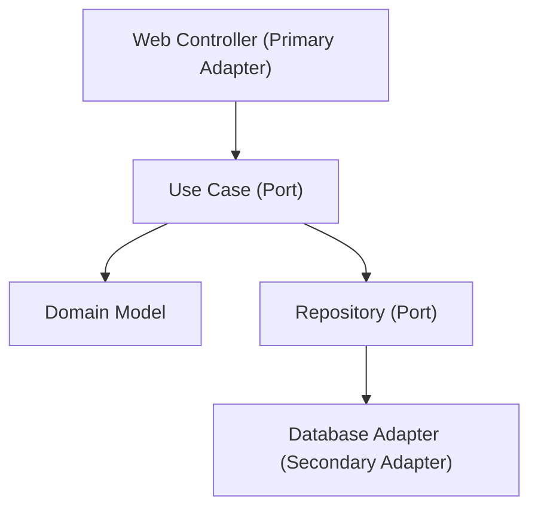

1장에서 소프트웨어 아키텍처를 "시스템의 근본 구조를 규정하는 요소들과 그 관계, 그리고 진화를 이끄는 원칙"으로 정의했다면, 이 장은 그 정의 속 "원칙"에 해당하는 부분을 다룬다. 좋은 아키텍처는 우연히 만들어지지 않는다. 시스템이 커지면서 모듈 간 의존성이 뒤엉키고 작은 요구사항 변경이 예상치 못한 곳까지 파급되기 시작할 때, 그 파급을 얼마나 억제할 수 있는가는 대개 설계 원칙을 얼마나 일관되게 적용했는가에 달려 있다.

설계 원칙은 코드 스타일 가이드가 아니라 **의존성의 방향을 결정하는 규칙**이다. 이 장에서 다루는 SOLID, DRY, KISS, YAGNI, 관심사의 분리는 모두 결국 하나의 질문으로 수렴한다 — "변경이 발생했을 때 그 파급 범위를 어디까지로 제한할 것인가?" 이 질문에 답하는 방식이 클래스 수준에서는 코드 품질이 되고, 시스템 수준에서는 아키텍처가 된다.

이 장에서는 각 원칙의 원저와 역사적 배경을 함께 짚어 "왜 이런 형태로 정식화되었는가"를 이해하고 넘어간다. 원칙을 규칙으로 암기하는 것과, 그 원칙이 애초에 해결하려던 실제 문제를 이해하는 것은 전혀 다른 수준의 지식이며, 후자만이 원칙을 언제 깨도 되는지 판단할 수 있게 해준다.

## 이 장을 읽기 전에

이 장은 [1장. 소프트웨어 아키텍처 기초](/post/software-architecture/software-architecture-fundamentals/)에서 다룬 아키텍처와 상세 설계의 구분, 그리고 품질 속성이라는 개념을 전제로 한다. 특히 "아키텍처 결정은 변경 비용이 크다"는 1장의 논지를 이해하고 있으면, 이 장에서 다루는 원칙들이 왜 단순한 "클래스 설계 조언"을 넘어 "아키텍처 결정"으로 취급되는지 쉽게 납득할 수 있다. 이 장의 난이도는 **초급–중급**이다. SOLID 각 원칙의 정의와 위반·개선 예제는 초급자도 따라갈 수 있게 구성했고, 헥사고날 아키텍처와의 연결이나 원칙 간 트레이드오프 판단은 중급자를 대상으로 한다. **다루지 않는 것**: 계층형·마이크로서비스·이벤트 기반 등 구체적인 아키텍처 패턴의 상세 구조는 3장에서, 품질 속성을 정량적으로 비교하는 트레이드오프 분석은 이후 장에서, 도메인 모델링 자체는 별도 장에서 다룬다. 이 장은 그 모든 논의의 공통 어휘가 되는 설계 원칙에 집중한다.

## 당신의 수준에 맞는 경로

| 수준 | 읽을 부분 | 핵심 목표 |
|------|---------|---------|
| 초보자 | "SOLID 원칙" ~ "관심사의 분리" | SOLID 다섯 원칙과 DRY·KISS·YAGNI를 각각 정의하고, 코드에서 위반 사례를 식별할 수 있다 |
| 중급자 | "의존성 역전에서 헥사고날 아키텍처로" | 의존성 역전이 실제 아키텍처 구조(포트와 어댑터)로 어떻게 확장되는지 설명할 수 있다 |
| 전문가 | "언제 원칙을 지키고 언제 타협할 것인가" | 팀 경계·요구사항 불확실성·배포 주기에 따라 원칙을 의도적으로 완화하거나 조합하는 판단을 내릴 수 있다 |

---

## SOLID 원칙: 다섯 가지 언어로 응집도와 결합도를 다루기

SOLID라는 이름은 한 사람이 한 번에 만든 이론이 아니다. Robert C. Martin은 2000년 발표한 논문 "Design Principles and Design Patterns"에서 다섯 원칙을 한데 모았고, 이후 Michael Feathers가 2000년대 중반 이 다섯 원칙의 앞 글자를 따 SOLID라는 두문자어를 붙였다고 알려져 있다. 원칙 각각은 1970–1990년대에 걸쳐 서로 다른 사람이 서로 다른 문제(서브타입 이론, 건축·구조 설계, 임베디드 프린터 소프트웨어)를 풀다가 독립적으로 도달한 결론이라는 점이 흥미롭다 — SOLID는 "이론에서 실무로" 내려온 것이 아니라 "여러 실무 문제에서 하나의 이론으로" 수렴한 드문 사례에 가깝다.

다섯 원칙을 관통하는 하나의 메커니즘은 **결합도(coupling)와 응집도(cohesion)의 재배치**다. 모듈 A와 B가 강하게 결합되어 있다면 A의 변경이 B의 재컴파일·재배포를 강제한다 — 이것이 "변경의 파급"이다. SOLID의 각 원칙은 이 파급을 줄이기 위해 "무엇을 하나로 묶을 것인가"(응집도, SRP)와 "무엇에 의존할 것인가"(결합도, OCP·LSP·ISP·DIP)를 서로 다른 각도에서 규정한다. 이 구도를 먼저 이해하면 다섯 원칙이 별개의 규칙이 아니라, 하나의 축을 다섯 방향에서 바라본 것임이 드러난다.

### S — 단일 책임 원칙 (Single Responsibility Principle)

Robert C. Martin은 2014년 블로그 글에서 이 원칙을 다음과 같이 정식화했다.

> "The Single Responsibility Principle (SRP) states that each software module should have one and only one reason to change."
> — Robert C. Martin, ["The Single Responsibility Principle"](https://blog.cleancoder.com/uncle-bob/2014/05/08/SingleReponsibilityPrinciple.html), *The Clean Code Blog* (2014.05.08)

이 정의에서 가장 자주 오해되는 단어는 "하나의 책임"이다. 많은 초급 개발자가 이를 "메서드 하나만 가진 클래스"로 읽지만, Martin이 말한 "이유(reason to change)"는 메서드 개수가 아니라 <strong>변경을 요구하는 주체(액터)</strong>를 가리킨다. 급여 계산 로직과 근무시간 검증 로직이 메서드 하나에 있더라도, 두 로직을 요구하는 조직(회계팀과 인사팀)이 다르다면 그 클래스는 이미 두 개의 책임을 지고 있는 것이다. 반대로 메서드가 여러 개라도 모두 같은 액터의 요구로만 바뀐다면 그 자체로는 SRP를 위반한 것이 아니다.

아키텍처 레벨에서 SRP는 "한 모듈은 하나의 변경 이유만 가져야 한다"로 확장된다. 넷플릭스·아마존 등이 채택한 마이크로서비스 아키텍처가 사용자·주문·결제·알림을 별도 서비스로 분리하는 근거가 바로 이 확장된 SRP다 — 각 서비스는 서로 다른 팀, 서로 다른 배포 주기, 서로 다른 장애 도메인을 가진다.

```java
// 위반: 사용자 생성, 이메일 발송, 로깅이라는 서로 다른 액터(도메인 팀)의 요구가 한 클래스에 뒤섞여 있다
public class UserManager {
    public void createUser(String name, String email) { /* 사용자 저장소에 기록 */ }
    public void sendWelcomeEmail(String email) { /* SMTP 클라이언트 호출 */ }
    public void logActivity(String message) { /* 감사 로그에 기록 */ }
}

// 개선: 액터별로 클래스를 분리하면 각 클래스는 독립적으로 변경·배포될 수 있다
public class UserService {
    public void createUser(String name, String email) { /* 사용자 저장소에 기록 */ }
}

public class EmailService {
    public void sendWelcomeEmail(String email) { /* SMTP 클라이언트 호출 */ }
}
```

이 개선은 클래스 수를 늘리는 대신 각 클래스가 독립적으로 테스트되고 배포될 수 있게 한다는 점에서 응집도를 높인다. 다만 지나치게 잘게 쪼개면 클래스 간 협업을 위한 조립(wiring) 비용이 커진다는 점은 이 장 뒷부분의 "언제 원칙을 지키고 언제 타협할 것인가"에서 다룬다.

### O — 개방-폐쇄 원칙 (Open-Closed Principle)

개방-폐쇄 원칙은 SOLID 중 가장 먼저 정식화된 원칙이다. Bertrand Meyer는 1988년 저서 『Object-Oriented Software Construction』에서 모듈이 확장에는 열려 있고 수정에는 닫혀 있어야 한다는 개념을 제시했다. Meyer가 제안한 원래 해법은 구현 상속이었지만, 이후 Martin을 비롯한 여러 저자가 "상속이 아니라 다형성(polymorphism)으로 확장을 구현하라"는 방향으로 재해석했다 — 오늘날 OCP를 이야기할 때 흔히 떠올리는 전략 패턴·플러그인 구조는 이 재해석의 결과다.

메커니즘을 정확히 짚으면 OCP는 "코드를 절대 수정하지 말라"는 뜻이 아니다. 버그 수정이나 기존 동작의 명세를 바꾸는 변경은 당연히 기존 코드를 고쳐야 한다. OCP가 금지하는 것은 "새로운 종류(variant)가 추가될 때마다 기존 분기문(if/switch)에 케이스를 계속 추가하는 패턴"이다. 새 결제 수단이 추가될 때마다 `PaymentService`의 switch 문에 case를 더하는 대신, `PaymentProcessor` 인터페이스를 구현하는 새 클래스를 추가하는 것만으로 확장이 끝나야 한다.

```java
public interface PaymentProcessor {
    PaymentResult process(Payment payment);
}

public class CreditCardProcessor implements PaymentProcessor {
    public PaymentResult process(Payment payment) { return new PaymentResult(true, "card ok"); }
}

// 새 결제 수단을 추가해도 PaymentService의 기존 코드는 한 줄도 바뀌지 않는다
public class CryptoProcessor implements PaymentProcessor {
    public PaymentResult process(Payment payment) { return new PaymentResult(true, "crypto ok"); }
}

public class PaymentService {
    private final PaymentProcessor processor;
    public PaymentService(PaymentProcessor processor) { this.processor = processor; }
    public PaymentResult charge(Payment payment) { return processor.process(payment); }
}
```

이 구조가 플러그인 아키텍처의 최소 형태다 — 코어 시스템은 인터페이스만 알고, 구체적인 확장은 별도로 로드된다. 전략 패턴을 포함해 이런 확장 구조의 더 넓은 카탈로그는 [Refactoring.Guru의 디자인 패턴 목록](https://refactoring.guru/design-patterns)에서 확인할 수 있다.

### L — 리스코프 치환 원칙 (Liskov Substitution Principle)

Barbara Liskov는 1987년 OOPSLA 기조연설 "Data Abstraction and Hierarchy"에서 서브타입 관계가 만족해야 할 대체 가능성(substitution property)을 처음 제시했고, 이후 Jeannette Wing과 함께 이를 "행동적 서브타이핑(behavioral subtyping)"이라는 형식 이론으로 다듬었다. 핵심은 "S가 T의 서브타입이라면, T의 인스턴스를 사용하는 프로그램에서 T 대신 S를 넣어도 프로그램의 정확성이 깨지지 않아야 한다"는 것이다.

이 원칙이 자주 오해되는 지점은 "상속 문법을 지켰으니 LSP도 지켰다"는 생각이다. 언어의 타입 체커는 메서드 시그니처의 일치만 검사할 뿐 사전조건·사후조건·불변식까지는 검사하지 않는다. 정사각형(Square)이 직사각형(Rectangle)을 상속하면서 `setWidth`가 높이까지 함께 바꾸도록 구현하면 컴파일은 통과하지만, "너비만 바뀐다"는 Rectangle의 암묵적 계약을 깨뜨린다 — 이것이 유명한 Square-Rectangle 문제다.

```java
public class Rectangle {
    protected int width, height;
    public void setWidth(int w) { this.width = w; }
    public void setHeight(int h) { this.height = h; }
    public int area() { return width * height; }
}

// LSP 위반: Rectangle의 "너비만 바뀐다"는 계약을 Square가 깨뜨린다
public class Square extends Rectangle {
    @Override public void setWidth(int w) { width = w; height = w; }
    @Override public void setHeight(int h) { width = h; height = h; }
}
```

실무에서 이 문제와 정확히 같은 구조의 함정이 자바 표준 라이브러리에도 남아 있다고 알려져 있다. `java.util.Stack`은 `Vector`를 상속하는데, 그 결과 스택이어야 할 자료구조에 `Vector`의 `insertElementAt`, `remove(int)` 같은 임의 위치 접근 메서드가 그대로 노출된다. Joshua Bloch는 『Effective Java』에서 이 사례를 "상속보다 컴포지션(composition)을 우선하라"는 조언의 근거로 든다 — 상속은 부모의 모든 계약을 자식이 물려받는다는 점에서 LSP를 만족시키기 가장 어려운 재사용 메커니즘이다.

### I — 인터페이스 분리 원칙 (Interface Segregation Principle)

인터페이스 분리 원칙은 Robert Martin이 1990년대 Xerox의 프린터 제어 소프트웨어를 컨설팅하면서 정식화했다고 알려져 있다. 스테이플링·팩스 등 다양한 기능을 갖춘 신형 프린터의 소프트웨어는 거의 모든 작업이 하나의 거대한 `Job` 클래스를 거치도록 설계되어 있었고, 그 결과 아주 작은 기능 변경조차 전체 시스템의 재배포를 요구했다 — 재배포 주기가 한 시간에 달해 개발이 사실상 마비될 지경이었다고 전해진다. Martin이 제시한 해법은 `Job`을 감싸는 여러 개의 작은 인터페이스(`PrintJob`, `StapleJob` 등)를 두어 각 클라이언트가 자신이 실제로 쓰는 메서드만 바라보게 만드는 것이었다.

ISP는 "인터페이스는 그것을 사용하는 클라이언트의 관점에서 설계되어야 한다"는 원칙으로 요약할 수 있다. 하나의 범용 인터페이스에 모든 메서드를 몰아넣으면 그 인터페이스를 구현하는 모든 클래스가 자신과 무관한 메서드까지 구현(혹은 예외를 던지는 더미 구현)해야 한다. 이는 클라이언트가 알 필요 없는 세부사항을 노출하지 않는다는 캡슐화(encapsulation) 원칙이 메서드 시그니처 차원까지 확장된 것이며, 종종 LSP 위반으로도 이어진다 — 더미 구현이 클라이언트가 기대하는 계약을 지키지 못하기 때문이다.

```java
// 위반: Worker 인터페이스가 모든 직군의 메서드를 포함해, Developer가 무관한 메서드까지 구현해야 한다
public interface Worker {
    void code();
    void manage();
}

// 개선: 클라이언트(호출자)가 실제로 필요로 하는 단위로 인터페이스를 쪼갠다
public interface Codeable {
    void code();
}

public interface Manageable {
    void manage();
}

public class Developer implements Codeable {
    public void code() { /* 구현 */ }
}
```

### D — 의존성 역전 원칙 (Dependency Inversion Principle)

Martin은 1996년 *C++ Report* 6월호에 기고한 "The Dependency Inversion Principle"에서 이 원칙을 발표했다. 요지는 두 가지다 — 고수준 모듈은 저수준 모듈에 의존해서는 안 되며 둘 다 추상화에 의존해야 한다는 것, 그리고 추상화는 세부 구현에 의존해서는 안 되고 세부 구현이 추상화에 의존해야 한다는 것이다. "역전(inversion)"이라는 이름은 전통적인 절차형 설계에서의 의존성 방향 — 정책이 메커니즘을 호출하고 메커니즘이 다시 더 낮은 수준의 세부사항을 호출하는 방향 — 을 뒤집는다는 뜻에서 붙었다.

DIP를 SRP·OCP·LSP·ISP와 구분 짓는 지점은, DIP가 유일하게 "의존성 그래프의 방향"을 직접 규정한다는 것이다. 나머지 네 원칙이 "무엇을 어떻게 나눌 것인가"를 다룬다면 DIP는 "나뉜 것들이 서로를 어느 방향으로 바라볼 것인가"를 다룬다. 이 때문에 DIP는 아키텍처 다이어그램에서 화살표의 방향으로 직접 드러나는 유일한 SOLID 원칙이며, 뒤에서 다룰 헥사고날 아키텍처는 사실상 DIP를 시스템 전체 구조로 확장한 것이다.

```java
public interface OrderRepository {
    void save(Order order);
}

// 고수준 모듈(OrderService)은 구체 클래스가 아니라 추상화(OrderRepository)에 의존한다
public class OrderService {
    private final OrderRepository repository;
    public OrderService(OrderRepository repository) { this.repository = repository; }
    public void placeOrder(Order order) { repository.save(order); }
}

// 저수준 모듈이 추상화를 구현하며, 화살표는 저수준에서 추상화 쪽으로 향한다
public class JpaOrderRepository implements OrderRepository {
    public void save(Order order) { /* JPA로 영속화 */ }
}
```

다섯 원칙과 각각의 핵심 메커니즘, 그리고 실무에서 가장 자주 나타나는 오해를 한눈에 정리하면 다음과 같다.

| 원칙 | 핵심 메커니즘 | 흔한 오해 |
|------|-------------|---------|
| SRP | 변경을 요구하는 액터 단위로 모듈을 나눈다 | "메서드 하나만 가진 클래스"로 오해한다 |
| OCP | 분기문 대신 다형성으로 새 variant를 추가한다 | "코드를 절대 고치면 안 된다"로 오해한다 |
| LSP | 서브타입이 부모의 사전·사후조건을 유지한다 | "상속 문법만 지키면 충분하다"로 오해한다 |
| ISP | 클라이언트 관점에서 인터페이스를 쪼갠다 | 범용 인터페이스가 "재사용성이 높다"로 오해한다 |
| DIP | 고수준·저수준 모두 추상화에 의존한다 | 인터페이스를 쓰면 자동으로 DIP를 지킨 것으로 오해한다(인터페이스 소유권이 여전히 저수준 쪽이면 방향은 안 바뀐다) |

---

## DRY, KISS, YAGNI: 실용주의 3원칙과 그 긴장

DRY(Don't Repeat Yourself)는 Andy Hunt와 Dave Thomas가 1999년 저서 『The Pragmatic Programmer』에서 만든 용어다. 두 사람은 "시스템 내의 모든 지식은 단일하고 애매하지 않은 하나의 대표 표현을 가져야 한다"고 정의했는데, 여기서 방점은 "코드 중복"이 아니라 "지식 중복"에 있다. 같은 문자열이 두 파일에 등장하더라도 그것이 우연의 일치(서로 다른 지식을 표현)라면 DRY 위반이 아니고, 반대로 두 함수의 코드가 전혀 다르게 생겼어도 같은 비즈니스 규칙을 각자 인코딩하고 있다면 그것은 DRY 위반이다.

이 구분을 놓치면 "우연히 비슷해 보이는 코드"를 성급하게 하나로 합치는 실수를 저지르기 쉽다. 회원 가입 시의 이메일 형식 검증과 뉴스레터 구독 시의 이메일 형식 검증이 지금 같은 정규식을 쓰고 있다고 해서 반드시 같은 함수로 묶어야 하는 것은 아니다 — 두 요구사항이 서로 다른 이유로 바뀔 가능성이 있다면(SRP와 같은 논리다) 성급한 추상화는 오히려 두 기능을 부당하게 결합시켜 한쪽의 변경이 다른 쪽을 깨뜨리는 결과를 낳는다. 이 현상을 흔히 "DRY의 함정"이라 부른다.

KISS(Keep It Simple, Stupid)는 1960년대 미국 록히드사 Skunk Works의 엔지니어 켈리 존슨(Kelly Johnson)이, 야전 정비사가 기본 공구만으로 현장에서 항공기를 수리할 수 있어야 한다는 설계 지침으로 남겼다고 알려져 있다. 소프트웨어 맥락에서는 "미래의 유연성을 위해 오늘의 단순한 문제에 과도한 추상화 계층을 쌓지 말라"는 뜻으로 쓰인다. YAGNI(You Aren't Gonna Need It)는 익스트림 프로그래밍(XP) 첫 프로젝트에서 Kent Beck이 반복했다고 알려진 구호이며, Ron Jeffries·Ann Anderson·Chet Hendrickson이 2001년 저서 『Extreme Programming Installed』에서 정식 실천법으로 문서화했다. 두 원칙은 사실상 하나의 메시지를 시간축의 양쪽에서 말한다 — KISS는 "지금 필요한 것보다 복잡하게 만들지 말라", YAGNI는 "아직 필요하지 않은 것을 미리 만들지 말라"는 뜻이다.

문제는 DRY와 KISS·YAGNI가 종종 서로를 밀어낸다는 점이다. 중복을 제거하려는 시도(DRY)는 필연적으로 추상화 계층을 하나 이상 추가하고, 이는 KISS가 경계하는 복잡성 증가와 직접 충돌한다. 실무적으로는 "세 번째 중복이 나타날 때 비로소 추상화한다"는 경험칙(Rule of Three, Martin Fowler가 널리 알린 표현으로 알려져 있다)이 이 긴장을 다루는 균형점으로 흔히 쓰인다 — 두 번째 중복까지는 KISS·YAGNI 편에 서고, 세 번째부터는 DRY 편에 선다.

```java
// 두 메서드가 동일한 검증 로직(같은 지식)을 담고 있다면 그 지식을 하나로 모은다
public class UserController {
    private boolean isValidId(Long id) { return id != null && id > 0; }

    public Response getUser(Long id) {
        if (!isValidId(id)) { return Response.badRequest(); }
        return Response.ok(userRepository.findById(id));
    }
}
```

---

## 관심사의 분리: 계층, 기능, 횡단 관심사

관심사의 분리(Separation of Concerns, SoC)라는 용어는 Edsger Dijkstra가 1974년 논문 "On the Role of Scientific Thought"에서 처음 사용했다고 알려져 있다. Dijkstra는 인간의 인지 능력이 한 번에 다룰 수 있는 복잡도에는 한계가 있으므로, 하나의 문제를 여러 관점(concern)으로 나누어 한 번에 하나씩만 집중해서 다뤄야 한다고 주장했다. SRP가 "클래스가 몇 개의 이유로 바뀌는가"를 규정한다면, SoC는 그보다 한 단계 위에서 "시스템을 어떤 축으로 나눌 것인가"를 규정한다는 점에서 SRP의 이론적 토대에 가깝다.

관심사는 최소 세 가지 축으로 나뉜다. **수직적 분리**는 프레젠테이션·비즈니스 로직·데이터 접근처럼 추상화 수준에 따라 계층을 나누며, 상위 계층은 하위 계층에 의존하되 역방향 의존은 금지된다. **수평적 분리**는 사용자 관리·주문 처리·결제처럼 같은 추상화 수준에서 도메인 기능별로 나눈다. <strong>횡단 관심사(cross-cutting concerns)</strong>는 트랜잭션·로깅·인증·캐싱처럼 여러 계층·기능에 공통으로 걸쳐 있어 한 곳에 깔끔하게 위치시키기 어려운 관심사를 가리키며, 관점 지향 프로그래밍(AOP)이나 데코레이터·미들웨어 패턴으로 핵심 로직과 분리해 다룬다. 웹 애플리케이션에서 흔히 쓰는 MVC(Model-View-Controller) 패턴은 이 세 축 중 수직적 분리를 컨트롤러·서비스·리포지토리 3계층으로 구체화한 사례다.

| 분리 축 | 기준 | 예시 |
|--------|------|------|
| 수직적 분리 | 추상화 수준 | Presentation → Business → Data Access |
| 수평적 분리 | 도메인 기능 | 사용자 관리, 주문 처리, 결제 |
| 횡단 관심사 | 여러 계층에 공통 | 트랜잭션, 로깅, 인증, 캐싱 |

```java
// 트랜잭션·보안이라는 횡단 관심사를 어노테이션으로 분리하면, 메서드 본문은 핵심 로직만 남는다
@Transactional
@Secured("ROLE_USER")
public class OrderService {
    public Order createOrder(Order order) { return orderRepository.save(order); }
}
```

---

## 의존성 역전에서 헥사고날 아키텍처로

DIP가 클래스 두어 개 사이의 관계를 규정하는 데 그치지 않고 시스템 전체의 뼈대가 될 수 있다는 것을 처음 구조화한 사람은 Alistair Cockburn이다. Cockburn은 2005년 자신의 웹사이트에 발표한 글에서 "포트와 어댑터(Ports and Adapters)" — 흔히 헥사고날 아키텍처로 불리는 — 패턴을 제시했다고 알려져 있다. 핵심 아이디어는 애플리케이션 코어(도메인 로직)가 외부 세계(UI, 데이터베이스, 메시지 큐)에 대해 전혀 알지 못하게 만들고, 그 대신 코어가 정의한 "포트(인터페이스)"를 외부의 "어댑터"가 구현하도록 의존성 방향을 강제하는 것이다. 이는 DIP를 클래스 하나가 아니라 애플리케이션 전체 경계에 적용한 것과 같다. 이 구조는 이후 3장에서 다룰 클린 아키텍처(Clean Architecture)를 포함해, 여러 현대 아키텍처 패턴이 공유하는 공통 뼈대이기도 하다.



이 구조에서 "포트"는 애플리케이션 코어가 소유하고 "어댑터"는 코어 바깥에서 그 포트를 구현한다 — 이것이 앞선 SOLID 요약 표에서 짚은 DIP의 흔한 오해("인터페이스를 쓰면 자동으로 DIP를 지킨 것")를 실제로 교정하는 지점이다. 인터페이스를 데이터베이스 모듈이 정의하고 애플리케이션 코어가 그것을 가져다 쓴다면 화살표는 여전히 코어에서 데이터베이스 쪽으로 향한다. DIP를 만족시키려면 인터페이스의 소유권 자체가 고수준(코어) 쪽에 있어야 한다.

```java
// 포트: 애플리케이션 코어(도메인)가 소유하는 인터페이스
public interface OrderRepositoryPort {
    void save(Order order);
}

public class OrderUseCase {
    private final OrderRepositoryPort repository;
    public OrderUseCase(OrderRepositoryPort repository) { this.repository = repository; }
    public void placeOrder(Order order) { repository.save(order); }
}

// 어댑터: 코어 바깥에서 포트를 구현하며, 프레임워크(JPA 등)에 대한 지식은 여기에만 존재한다
public class JpaOrderRepositoryAdapter implements OrderRepositoryPort {
    public void save(Order order) { /* JPA EntityManager로 영속화 */ }
}
```

스프링·닷넷 같은 프레임워크의 의존성 주입(DI) 컨테이너는 이 조립(어댑터를 포트에 연결하는 과정)을 런타임에 자동화해 주는 도구일 뿐, DIP 자체를 대체하지는 않는다. 생성자 주입을 필드 주입보다 선호하는 이유도 여기에 있다 — 생성자 주입은 컨테이너 유무와 무관하게 필수 의존성을 타입 시스템 차원에서 강제하고, 테스트 코드에서 목(mock) 객체로 손쉽게 치환할 수 있게 한다.

---

## 언제 원칙을 지키고 언제 타협할 것인가

원칙은 목적이 아니라 도구다. 프로젝트 초기, 요구사항이 아직 불확실한 단계에서는 YAGNI와 KISS를 우선하는 편이 낫다 — 확장 지점을 미리 설계해 두어도 실제 두 번째 요구사항이 예측과 다른 방향으로 온다면 그 설계는 버려야 할 코드가 된다. 반대로 여러 팀이 동시에 같은 모듈을 건드리기 시작하거나 배포 주기를 팀별로 분리해야 하는 시점부터는 SRP와 DIP를 적극적으로 적용해 경계를 명확히 하는 쪽이 이득이 커진다.

판단 기준을 정리하면 다음과 같다. 지금 이 추상화를 요구하는 variant가 실제로 둘 이상 존재하는지, 아니면 아직 상상 속의 요구사항인지 먼저 확인한다. 이 결합을 끊는 인터페이스를 두었을 때 그 인터페이스를 구현할 두 번째 클래스가 가까운 미래에 나타날 근거가 있는지도 함께 점검한다. 팀 경계·배포 경계와 모듈 경계가 일치하는지 살피고, 어긋난다면 그것이 SRP 위반의 신호일 수 있다는 점을 의심한다. 마지막으로, 이 원칙을 지키기 위한 간접 계층(인터페이스, DI)이 코드를 읽는 사람의 인지 부하를 KISS가 허용하는 수준 이상으로 늘리지는 않는지 확인한다. 이 네 가지 질문에 "아니오"가 많다면, 원칙을 지금 적용하기보다 리팩토링으로 미루는 편이 YAGNI에 부합한다.

SOLID 각 원칙의 원문을 더 찾아보고 싶다면 Martin 본인이 정리한 원 논문 외에도, 예제와 함께 쉽게 풀어 쓴 [DigitalOcean의 SOLID 가이드](https://www.digitalocean.com/community/conceptual_articles/s-o-l-i-d-the-first-five-principles-of-object-oriented-design)를 참고할 수 있다.

## 평가 기준

이 장을 읽은 후에는 다음을 할 수 있어야 한다.

- SOLID 다섯 원칙 각각을 코드 예제 없이 한 문장으로 정의하고, 각 원칙이 규정하는 것이 "무엇을 하나로 묶을지"인지 "무엇에 의존할지"인지 구분할 수 있다.
- 주어진 클래스 설계에서 SRP·OCP·LSP·ISP·DIP 위반 여부를 각각 식별하고, 어떤 흔한 오개념 때문에 그 위반이 발생했는지 설명할 수 있다.
- DRY와 KISS·YAGNI가 충돌하는 실제 상황에서 Rule of Three 같은 경험칙을 근거로 어느 쪽을 우선할지 판단할 수 있다.
- 의존성 역전 원칙이 헥사고날 아키텍처의 포트-어댑터 구조로 어떻게 확장되는지, 그리고 인터페이스의 소유권이 왜 의존성 방향을 결정하는지 설명할 수 있다.
- 관심사의 분리를 수직적·수평적·횡단 관심사 세 축으로 구분하고, 각 축에 해당하는 실제 코드 사례를 들 수 있다.
- 프로젝트 상황(팀 경계, 요구사항 불확실성, 배포 주기)에 따라 원칙을 엄격히 적용할지 의도적으로 완화할지 판단할 수 있다.

다음 장에서는 이 장에서 다룬 원칙들이 실제로 어떤 구조적 패턴으로 구현되는지 살펴본다. [3장. 아키텍처 패턴과 스타일](/post/software-architecture/architecture-patterns-and-styles/)에서는 계층화 아키텍처부터 이벤트 기반 아키텍처까지, SOLID와 관심사의 분리가 시스템 레벨에서 어떤 모습으로 나타나는지 다룬다.
