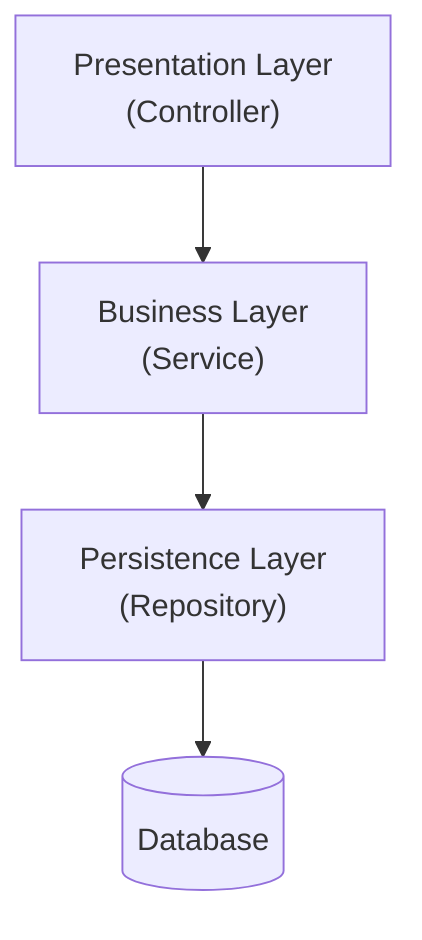
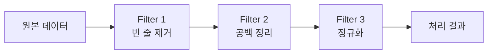
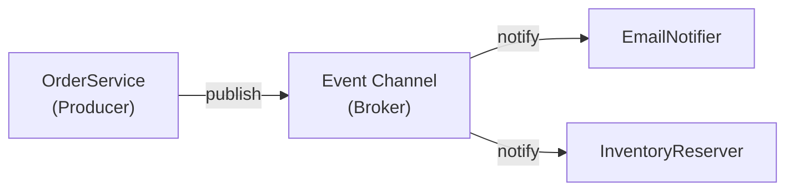

3장은 시스템을 구성하는 요소들을 어떤 형태로 배치하고 연결할지를 결정하는 **아키텍처 패턴**을 다룬다. 2장에서 SOLID·DRY·관심사의 분리 같은 원칙이 "좋은 설계가 지켜야 할 규칙"이었다면, 이 장의 계층화·클라이언트-서버·파이프-필터·이벤트 기반은 그 원칙들이 실제 시스템에서 반복적으로 검증되어 굳어진 **구조 그 자체**다. 네 패턴 모두 수십 년간 서로 다른 문제를 풀도록 다듬어져 왔기 때문에, 어느 하나가 다른 것보다 절대적으로 우월하다고 말할 수 없다 — 이 장의 목표는 각 패턴이 "왜 그런 형태를 갖게 되었는가"를 이해해서, 새로운 문제를 만났을 때 스스로 적합한 패턴을 고르거나 조합할 수 있게 되는 것이다.

## 이 장을 읽기 전에

**완전한 초보자?** 이 장은 [02장: 아키텍처 설계 원칙](/post/software-architecture/architecture-design-principles/)에서 다룬 SOLID 원칙, 특히 의존성 역전 원칙(DIP)과 관심사의 분리 개념을 전제로 한다. "고수준 모듈은 저수준 모듈이 아니라 추상화에 의존해야 한다"는 문장이 낯설다면 02장을 먼저 읽고 오는 편이 좋다. 계층·필터·이벤트 같은 용어를 한 번도 접해보지 못했어도 괜찮다 — 이 장이 처음부터 정의한다.

**이 장의 깊이**: 이 장은 **초급~전문가** 수준이다. 기본적으로는 계층화·클라이언트-서버·파이프-필터·이벤트 기반이라는 4대 고전 패턴의 구조와 동작 원리를 익히는 데 집중한다. 전문가 구간에서는 POSA1이 구분하는 폐쇄형(Closed)과 개방형(Open) 계층의 트레이드오프, 이벤트 기반 아키텍처의 브로커(Broker)와 미디에이터(Mediator) 토폴로지 차이, 그리고 겉으로 잘 드러나지 않는 이벤트 스키마 결합 문제까지 다룬다.

**다루지 않는 것**: 마이크로서비스, 서버리스, 헥사고날 아키텍처, CQRS/이벤트 소싱처럼 이 네 패턴을 조합·확장한 현대적 변형은 [4장: 모던 아키텍처 패러다임](/post/software-architecture/modern-architecture-paradigms/)에서 다룬다. 성능·가용성 같은 품질 속성을 정량적으로 어떻게 평가할지는 5장의 몫이며, MVC·Blackboard처럼 POSA1이 함께 다루는 인터랙티브/적응형 패턴 전체를 이 장에서 훑지는 않는다.

## 당신의 수준에 맞는 경로

| 수준 | 읽을 부분 | 핵심 목표 |
|------|---------|---------|
| **초보자** | "아키텍처 패턴과 스타일이란" ~ "클라이언트-서버와 N-Tier 변형" | 패턴과 스타일의 차이, 계층화·클라이언트-서버의 기본 구조 이해 |
| **중급자** | "파이프-필터 아키텍처" ~ "이벤트 기반 아키텍처" | 필터 체인 설계, 발행-구독 구조와 이벤트 소비자 결합 문제 이해 |
| **전문가** | "패턴 선택과 트레이드오프" ~ 끝 | 여러 패턴을 조합·비교해 실제 시스템에 맞는 선택 근거를 제시 |

---

## 아키텍처 패턴과 스타일이란

**아키텍처 패턴(Architectural Pattern)**과 **아키텍처 스타일(Architectural Style)**은 문헌마다 혼용되지만 출발점이 다르다. Garlan과 Shaw는 1994년 카네기멜론대학교 기술보고서(CMU/SEI-94-TR-021) "An Introduction to Software Architecture"에서, 서로 다른 시스템들이 공유하는 구조적 조직화의 패턴을 **스타일**이라는 개념으로 정리했다고 알려져 있다 — 구성요소의 유형, 그 구성요소를 잇는 연결자(connector)의 유형, 그리고 이들이 결합되는 제약을 규정하는 것이 스타일의 역할이다. 반면 Buschmann, Meunier, Rohnert, Sommerlad, Stal은 1996년 『Pattern-Oriented Software Architecture, Volume 1: A System of Patterns』(이하 POSA1)에서 이를 패턴 언어의 틀로 재정의했다.

> "An Architectural Pattern expresses a fundamental structural organization or schema for software systems. It provides a set of predefined subsystems, specifies their responsibilities, and includes rules and guidelines for organizing the relationships between them." — Buschmann, Meunier, Rohnert, Sommerlad, Stal, 『Pattern-Oriented Software Architecture, Volume 1』(1996)

실무에서는 두 용어를 굳이 구분하지 않고 섞어 쓰는 경우가 많으므로, 이 시리즈에서도 "패턴"과 "스타일"을 문맥에 따라 같은 의미로 사용한다. 중요한 것은 용어 자체가 아니라, 이 개념들이 **GoF 디자인 패턴보다 한 단계 위의 추상화**에서 동작한다는 점이다. Singleton이나 Observer 같은 디자인 패턴이 클래스 몇 개 사이의 협력 구조를 규정한다면, 계층화나 파이프-필터 같은 아키텍처 패턴은 시스템 전체를 구성하는 서브시스템의 개수와 책임, 그리고 서브시스템 간 통신 규칙을 규정한다. 그래서 하나의 시스템 안에서 아키텍처 패턴 하나(예: 계층화)와 디자인 패턴 여러 개(예: 각 계층 내부의 Strategy, Factory)가 동시에 쓰이는 것이 자연스럽다.

POSA1은 계층(Layers), 파이프-필터(Pipes and Filters), 블랙보드(Blackboard), 브로커(Broker) 등을 "혼돈에서 구조로(From Mud to Structure)"라는 장에서 함께 다루며, 이들을 시스템이 특정 방식으로 조직되지 않았을 때 겪는 문제(강한 결합, 낮은 재사용성, 변경 파급)에 대한 검증된 해법으로 제시한다. 이 장에서 다루는 네 패턴 중 계층화와 파이프-필터는 POSA1이 명명한 그대로이며, 클라이언트-서버와 이벤트 기반은 POSA1 이전부터 분산 컴퓨팅 실무에서 굳어진 스타일을 POSA1과 이후 문헌들이 다시 정리한 것이다.

## 계층화 아키텍처

계층화 아키텍처는 시스템을 수직으로 쌓인 계층(layer)들로 나누고, 각 계층이 바로 아래 계층에게만 서비스를 요청하도록 강제하는 패턴이다. 이 구조의 핵심 메커니즘은 **의존 방향의 단일화**에 있다 — 상위 계층은 하위 계층의 인터페이스를 알아야 하지만, 하위 계층은 상위 계층의 존재조차 몰라도 된다. 이 비대칭성 덕분에 하위 계층(예: 데이터 접근 로직)을 교체해도 상위 계층(예: 화면)의 코드를 건드릴 필요가 없고, 반대로 상위 계층을 여러 개 만들어(웹 UI, 모바일 API 등) 같은 하위 계층을 재사용할 수 있다. 다만 이 이점은 "계층을 건너뛰지 않는다"는 규율이 지켜질 때만 유효하다 — 프레젠테이션 계층이 편의상 데이터 접근 계층을 직접 호출하기 시작하면, 계층 구조는 이름만 남고 실질적으로는 뒤엉킨 의존성 그래프가 된다.

POSA1은 이 규율의 강도에 따라 계층을 두 종류로 구분한다. **폐쇄형 계층(Closed Layer)**은 상위 계층이 반드시 바로 아래 계층만 거쳐야 하며 계층을 건너뛸 수 없다. 이 방식은 계층 하나를 다른 구현으로 완전히 교체해도 나머지 계층이 영향받지 않는다는 강한 보장을 주지만, 모든 요청이 계층 수만큼 호출을 거쳐야 하므로 계층이 많아질수록 지연이 누적된다. **개방형 계층(Open Layer)**은 특정 상위 계층이 하위의 특정 계층을 직접 호출하는 것을 허용한다 — 예를 들어 공통 유틸리티나 로깅처럼 모든 계층에서 필요한 기능은 계층을 건너뛰어 접근하는 편이 실용적이다. 개방형은 호출 경로를 줄여 성능을 얻는 대신, 어떤 계층을 건너뛰어도 되는지에 대한 팀 차원의 합의가 없으면 시간이 지나며 "계층이라는 이름의 뒤엉킨 의존성"으로 퇴화하기 쉽다.

이 원칙을 보여주는 최소 구현을 보자. 아래 코드는 주문 생성 요청이 프레젠테이션 → 비즈니스 → 영속성 계층을 거치는 흐름을, 각 계층이 자신의 책임만 지도록 압축한 것이다.

```java
// 프레젠테이션 계층: 요청/응답 변환만 담당, 비즈니스 규칙을 모른다.
@RestController
@RequestMapping("/api/orders")
public class OrderController {
    private final OrderService orderService;

    public OrderController(OrderService orderService) {
        this.orderService = orderService;
    }

    @PostMapping
    public ResponseEntity<Long> createOrder(@RequestBody OrderRequest request) {
        Long orderId = orderService.createOrder(request.customerId(), request.amount());
        return ResponseEntity.ok(orderId);
    }
}

// 비즈니스 계층: 검증·규칙을 담당, HTTP나 SQL을 전혀 모른다.
@Service
public class OrderService {
    private final OrderRepository orderRepository; // 하위 계층 인터페이스에만 의존 (DIP)

    public OrderService(OrderRepository orderRepository) {
        this.orderRepository = orderRepository;
    }

    public Long createOrder(Long customerId, BigDecimal amount) {
        if (amount.compareTo(BigDecimal.ZERO) <= 0) {
            throw new IllegalArgumentException("주문 금액은 0보다 커야 합니다");
        }
        return orderRepository.save(customerId, amount);
    }
}

// 영속성 계층: 저장 방식(JDBC, JPA 등)을 캡슐화, 비즈니스 규칙을 모른다.
public interface OrderRepository {
    Long save(Long customerId, BigDecimal amount);
}
```

`OrderService`가 `OrderRepository`라는 **인터페이스**에 의존하고 구체적인 JDBC나 JPA 구현을 직접 참조하지 않는 부분이 02장의 의존성 역전 원칙(DIP)이 계층화 패턴 안에서 실제로 구현되는 지점이다. 이 인터페이스가 없다면 비즈니스 계층은 특정 데이터베이스 기술에 묶이고, 계층화가 약속하는 "하위 계층 교체 가능성"은 이름뿐인 약속으로 끝난다.



**흔한 오해 — "계층화는 곧 3-Tier다"**: 계층(layer)은 코드가 논리적으로 나뉘는 방식이고, 티어(tier)는 그 코드가 물리적으로 어느 프로세스·서버에 배포되는지를 가리키는 별개의 축이다. 3-Tier는 프레젠테이션·애플리케이션·데이터베이스라는 세 계층을 세 대의 물리적 서버(또는 프로세스)로 나눠 배포한 특정 사례일 뿐이며, 같은 세 계층을 하나의 프로세스 안에 모두 넣어 배포하면 1-Tier 배포에 3-Layer 아키텍처가 된다. 계층 수와 티어 수가 반드시 같아야 한다는 규칙은 없다.

계층화가 적합한 상황은 요구사항이 비교적 안정적이고 팀을 계층별로 나눠 병렬 개발할 수 있을 때다. 반대로 하나의 요청이 여러 계층을 오가며 처리되는 것 자체가 성능에 민감한 시스템(초저지연 트레이딩 시스템 등)이거나, 비즈니스 로직이 여러 계층에 걸쳐 반복적으로 흩어지는 조짐이 보인다면 계층화를 고집하지 말고 다음 절의 다른 패턴이나 4장의 대안을 검토해야 한다.

## 클라이언트-서버와 N-Tier 변형

클라이언트-서버는 서비스를 요청하는 **클라이언트**와 서비스를 제공하는 **서버**를 역할로 분리하는 가장 오래된 분산 시스템 패턴이다. 메커니즘은 단순하다 — 클라이언트가 요청을 보내고, 서버가 처리한 뒤 응답을 돌려준다. 이 단순함 뒤에 숨은 설계 결정은 **상태를 어디에 둘 것인가**다. HTTP처럼 서버가 각 요청을 이전 요청과 무관하게 독립적으로 처리하는 무상태(stateless) 방식은 서버를 수평으로 여러 대 늘려도 어떤 서버가 요청을 받든 결과가 같다는 장점을 준다. 반대로 서버가 클라이언트별 세션 상태를 기억하는 상태유지(stateful) 방식은 반복 요청마다 인증 정보를 다시 보낼 필요가 없다는 편의를 주지만, 그 세션을 가진 서버가 죽으면 해당 클라이언트의 상태도 함께 사라진다. 클라이언트-서버 패턴은 LAN과 개인 워크스테이션이 메인프레임 단말기를 대체하기 시작한 1980년대에 대중화되었다고 알려져 있으며, 이후 웹의 HTTP 프로토콜이 무상태 요청-응답 모델을 채택하면서 오늘날 가장 흔한 형태로 자리 잡았다.

클라이언트-서버는 클라이언트와 서버 사이에 계층을 몇 개 두느냐에 따라 다시 나뉜다. **2-Tier**는 클라이언트가 데이터베이스에 직접 접속해 SQL을 실행하는 구조로, 개발은 빠르지만 SQL 로직이 클라이언트 여러 종류(웹, 데스크톱, 배치)에 중복되고 데이터베이스 접속 정보가 클라이언트에 노출된다는 문제가 있다. **3-Tier**는 그 사이에 애플리케이션 서버를 두어 클라이언트가 데이터베이스를 직접 보지 못하게 막는다. **N-Tier**는 3-Tier에서 더 나아가 캐시 계층, 메시지 큐, API 게이트웨이처럼 필요에 따라 계층을 추가한 것을 통칭하는 이름일 뿐, 정해진 개수가 있는 고정된 패턴은 아니다.

```java
// 2-Tier: 클라이언트가 데이터베이스에 직접 접속 (SQL이 클라이언트 코드에 노출)
public class CustomerClientTwoTier {
    private final Connection dbConnection;

    public CustomerClientTwoTier(Connection dbConnection) {
        this.dbConnection = dbConnection;
    }

    public List<String> listCustomerNames() throws SQLException {
        List<String> names = new ArrayList<>();
        try (PreparedStatement stmt = dbConnection.prepareStatement("SELECT name FROM customers");
             ResultSet rs = stmt.executeQuery()) {
            while (rs.next()) {
                names.add(rs.getString("name"));
            }
        }
        return names;
    }
}

// 3-Tier: 클라이언트는 애플리케이션 서버의 API만 알고, DB 접속 정보는 서버 안에 갇힌다.
@RestController
public class CustomerController {
    private final CustomerService customerService;

    public CustomerController(CustomerService customerService) {
        this.customerService = customerService;
    }

    @GetMapping("/customers")
    public List<String> getCustomers() {
        return customerService.getAllCustomerNames();
    }
}
```

**흔한 오해 — "클라이언트-서버 = 씬 클라이언트(thin client)"**: 클라이언트-서버는 역할(요청자/제공자)을 나누는 패턴일 뿐, 클라이언트에 로직을 얼마나 둘지는 규정하지 않는다. 무거운 검증·렌더링 로직을 클라이언트에 두는 리치 클라이언트(rich client, 예: 오프라인 지원 SPA)도 여전히 클라이언트-서버 패턴이다. 반대로 서버가 모든 처리를 하고 클라이언트는 화면 표시만 하는 씬 클라이언트도 클라이언트-서버 패턴이다 — "얼마나 씬/리치한가"는 클라이언트-서버 여부와 무관한 별개의 설계 축이다.

## 파이프-필터 아키텍처

파이프-필터는 데이터를 일련의 독립적인 **필터**를 거치며 점진적으로 변환하고, **파이프**가 필터 사이에서 데이터를 전달하는 패턴이다. 이 구조의 핵심은 각 필터가 **자신의 입력과 출력 형식만 알 뿐, 앞뒤에 어떤 필터가 붙는지 모른다**는 데 있다. 필터 A가 필터 B의 존재를 몰라도 되기 때문에, 필터를 재배열하거나 중간에 새 필터를 끼워 넣어도 다른 필터의 코드를 건드릴 필요가 없다. 이 독립성은 필터가 순수 함수에 가까울수록(같은 입력에는 항상 같은 출력, 부수효과 없음) 강해지고, 필터가 공유 상태를 몰래 참조하기 시작하면 급격히 약해진다.

이 패턴의 기원은 소프트웨어 아키텍처라는 용어가 정립되기도 전인 1964년으로 거슬러 올라간다. Bell 연구소의 Doug McIlroy는 내부 메모에서 프로그램을 연결하는 방식을 다음과 같이 제안했다고 알려져 있다.

> "like garden hose — screw in another segment when it becomes necessary to massage data in another way." — Doug McIlroy, Bell 연구소 내부 메모(1964)

이 아이디어는 곧바로 구현되지 못하다가, 9년 뒤인 1973년 Ken Thompson이 Unix 셸에 파이프(`|`) 연산자를 추가하면서 실현되었다. `ls | grep .txt | wc -l`처럼 명령어를 파이프로 연결하는 셸 관용구가 바로 이 패턴의 가장 널리 알려진 구현이며, 이후 컴파일러의 어휘 분석-구문 분석-코드 생성 단계나 ETL(Extract-Transform-Load) 파이프라인 같은 데이터 처리 시스템에서도 같은 구조가 반복적으로 채택되었다.

```java
public class DataProcessingPipeline {
    public List<String> process(List<String> rawLines) {
        return rawLines.stream()
            .filter(line -> !line.isBlank())        // Filter 1: 빈 줄 제거
            .map(String::trim)                       // Filter 2: 공백 정리
            .map(String::toUpperCase)                // Filter 3: 정규화
            .filter(line -> line.length() > 3)        // Filter 4: 규칙 적용
            .collect(Collectors.toList());
    }
}
```



**흔한 오해 — "폐쇄형 계층처럼 파이프-필터도 엄격한 규칙이 있다"**: 계층화의 폐쇄형/개방형 구분과 달리, 파이프-필터는 필터 간 순서를 지키는 것 외에 강제하는 규칙이 거의 없다. Java Stream API처럼 필터를 메서드 체이닝으로 표현하면 "파이프"가 눈에 보이지 않아 파이프-필터 패턴이 아니라고 오해하기 쉽지만, 스트림의 각 중간 연산(`filter`, `map`)은 독립적인 필터이고 스트림 자체가 그 사이의 파이프 역할을 한다 — 문법이 다를 뿐 구조는 동일하다.

파이프-필터는 데이터가 명확한 단계로 나뉘고 각 단계가 독립적으로 재사용될 수 있을 때 강력하다. 다만 필터 사이에서 상태를 주고받아야 하거나(예: 이전 단계의 결과에 따라 다음 단계의 분기가 달라짐) 되돌아가는 반복 제어가 필요하면 파이프-필터의 선형적 흐름과 맞지 않으므로 다른 구조를 검토해야 한다.

## 이벤트 기반 아키텍처

이벤트 기반 아키텍처는 컴포넌트들이 서로를 직접 호출하는 대신 **이벤트를 발행(publish)하고 구독(subscribe)**함으로써 소통하는 패턴이다. 핵심 메커니즘은 생산자(producer)가 "무엇이 일어났는가"만 이벤트로 기록하고, 그 이벤트를 누가 언제 어떻게 처리할지는 전혀 알지 못한다는 점이다. 이 비지식(non-knowledge)이 바로 느슨한 결합의 원천이다 — 새로운 소비자를 추가해도 생산자 코드를 수정할 필요가 없다.

이벤트가 생산자에서 소비자로 전달되는 경로는 크게 두 토폴로지로 나뉜다. **브로커(Broker) 토폴로지**는 이벤트를 중앙 채널(메시지 브로커, 토픽)에 발행하면 등록된 모든 구독자에게 전달되고, 각 구독자는 다음에 무슨 일이 일어날지 스스로 결정한다 — 중앙에 흐름을 지시하는 주체가 없다. **미디에이터(Mediator) 토폴로지**는 중앙의 오케스트레이터가 이벤트를 받아 다음에 어떤 처리기를 호출할지 순서를 결정한다 — 흐름은 한곳에서 파악할 수 있지만, 그 오케스트레이터가 단일 장애점이자 병목이 될 수 있다. 대부분의 실무 시스템은 두 토폴로지를 필요에 따라 섞어 쓴다.

```java
// 이벤트 정의: "무엇이 일어났는가"만 기록, 다음 처리는 모른다.
public record OrderCreatedEvent(Long orderId, Long customerId, BigDecimal amount) {}

// 생산자: 이벤트를 발행할 뿐, 누가 구독하는지 모른다.
@Service
public class OrderService {
    private final ApplicationEventPublisher eventPublisher;
    private final OrderRepository orderRepository;

    public OrderService(ApplicationEventPublisher eventPublisher, OrderRepository orderRepository) {
        this.eventPublisher = eventPublisher;
        this.orderRepository = orderRepository;
    }

    public Long createOrder(Long customerId, BigDecimal amount) {
        Long orderId = orderRepository.save(customerId, amount);
        eventPublisher.publishEvent(new OrderCreatedEvent(orderId, customerId, amount));
        return orderId;
    }
}

// 소비자 1, 2: 서로의 존재를 모른 채 각자 독립적으로 반응한다.
@Component
public class EmailNotifier {
    @EventListener
    public void onOrderCreated(OrderCreatedEvent event) {
        // 주문 확인 이메일 발송
    }
}

@Component
public class InventoryReserver {
    @EventListener
    public void onOrderCreated(OrderCreatedEvent event) {
        // 재고 예약
    }
}
```



분산 환경에서 이 브로커 토폴로지를 대규모로 구현한 대표 사례가 Kafka다. LinkedIn의 Jay Kreps, Neha Narkhede, Jun Rao는 2011년 NetDB 워크숍 논문 "Kafka: a Distributed Messaging System for Log Processing"에서, 초당 수백만 건의 로그 이벤트를 낮은 지연으로 여러 소비자에게 전달해야 하는 문제를 풀기 위해 Kafka를 설계했다고 밝혔다. Kafka는 이벤트를 파일 시스템의 append-only 로그처럼 디스크에 순서대로 기록해 두고, 소비자가 각자 자신의 읽기 위치(offset)를 관리하게 함으로써, 하나의 이벤트를 여러 소비자가 서로 다른 속도로 읽어도 서로 간섭하지 않게 만든다.

**흔한 오해 — "이벤트 기반은 느슨한 결합이므로 항상 안전하다"**: 생산자와 소비자가 서로의 코드를 직접 참조하지 않는다는 점에서 결합도가 낮아 보이지만, 둘은 여전히 **이벤트의 스키마(필드 이름과 타입)**에 결합되어 있다. 생산자가 `amount` 필드의 타입을 바꾸거나 이름을 바꾸면, 그 이벤트를 구독하는 모든 소비자가 컴파일 타임의 어떤 경고도 없이 런타임에 조용히 깨질 수 있다. 이벤트 기반 아키텍처가 줄이는 것은 "직접 호출 결합"이지 "데이터 형식 결합"이 아니라는 점을 구분해야 한다. 또한 여러 이벤트가 관여하는 흐름은 결과적 일관성(eventual consistency)을 전제하므로, 이벤트 순서가 뒤바뀌거나 중복 전달될 가능성을 애플리케이션 수준에서 처리해야 한다 — 이 주제는 4장의 CQRS와 이벤트 소싱에서 더 깊이 다룬다.

## 패턴 선택과 트레이드오프

지금까지 살펴본 네 패턴은 서로 배타적이지 않다. 실제 시스템 대부분은 계층화를 기본 골격으로 삼고, 그 안의 특정 계층에서 파이프-필터로 데이터를 처리하며, 계층 사이의 비동기 알림에는 이벤트를 쓰는 식으로 여러 패턴을 겹쳐 사용한다. 패턴을 고르는 기준은 "어느 것이 더 좋은가"가 아니라 "이 시스템이 지금 겪고 있는 변화의 축이 무엇인가"다. 요구사항이 자주 바뀌는 축이 계층 사이의 책임 분담이라면 계층화가, 데이터가 거치는 처리 단계라면 파이프-필터가, 컴포넌트 사이의 통신 방식이라면 클라이언트-서버나 이벤트 기반이 그 변화를 가장 적은 비용으로 흡수한다.

| 패턴 | 결합 방식 | 적합한 상황 | 피해야 할 상황 |
|------|----------|------------|----------------|
| **계층화** | 계층 간 수직 의존(단방향) | 요구사항이 안정적이고 계층별 팀 분담이 가능할 때 | 요청 하나가 여러 계층을 오가는 지연 자체가 치명적일 때 |
| **클라이언트-서버** | 역할 기반 요청-응답 | 서비스를 여러 클라이언트가 공유해야 할 때 | 클라이언트-서버 자체가 목적이 아니라 이미 결정된 제약(임베디드 등)일 때 |
| **파이프-필터** | 순차적 데이터 변환 | 처리 단계가 명확히 나뉘고 각 단계가 재사용될 때 | 단계 사이에 상태 공유나 되돌아가는 분기가 필요할 때 |
| **이벤트 기반** | 발행-구독(비동기) | 소비자를 자주 추가/제거하고 즉시 일관성이 필요 없을 때 | 강한 일관성이나 엄격한 처리 순서가 요구될 때 |

이 표는 패턴 자체의 성격을 요약할 뿐, 실제 판단은 시스템이 처한 조직·트래픽·일관성 요구를 함께 봐야 한다. 예컨대 이벤트 기반이 확장성과 장애 격리에서 유리하다고 해서 팀 하나가 관리하는 소규모 시스템에 무리하게 도입하면, 결과적 일관성이 만드는 디버깅 난이도만 늘어나고 얻는 이득은 거의 없다.

## 평가 기준

- 아키텍처 패턴과 아키텍처 스타일의 관계, 그리고 이들이 GoF 디자인 패턴과 어떤 추상화 레벨 차이를 갖는지 설명할 수 있는가?
- 계층화 아키텍처에서 폐쇄형 계층과 개방형 계층의 트레이드오프를 예를 들어 설명할 수 있는가?
- 계층(layer)과 티어(tier)의 차이를 구분하고, "계층화 = 3-Tier"라는 오해가 왜 틀렸는지 설명할 수 있는가?
- 2-Tier, 3-Tier, N-Tier 클라이언트-서버 구조 각각의 장단점을 비교할 수 있는가?
- 파이프-필터 패턴에서 필터가 독립적이려면 어떤 조건(부수효과, 공유 상태)을 지켜야 하는지 설명할 수 있는가?
- 이벤트 기반 아키텍처의 브로커/미디에이터 토폴로지 차이와, "느슨한 결합"이 스키마 결합까지 없애지는 않는다는 한계를 설명할 수 있는가?
- 주어진 시스템의 요구사항(변경 축, 일관성 요구, 조직 구조)을 보고 적합한 패턴을 선택하거나 조합할 수 있는가?

## 다음 장에서는

[4장: 모던 아키텍처 패러다임](/post/software-architecture/modern-architecture-paradigms/)에서는 이 장의 네 패턴이 마이크로서비스, 서버리스, 헥사고날 아키텍처, CQRS와 이벤트 소싱 같은 현대적 형태로 어떻게 확장되는지 다룬다. 특히 헥사고날 아키텍처는 이 장의 계층화가 갖는 상하 의존 구조를, 도메인을 중심에 두고 바깥에서 안으로 향하는 의존 구조로 재구성한 것이며, CQRS/이벤트 소싱은 이 장의 이벤트 기반 아키텍처를 데이터 저장 방식 자체로 확장한 것이다.

## 참고 및 출처

- Buschmann, F., Meunier, R., Rohnert, H., Sommerlad, P., Stal, M., 『Pattern-Oriented Software Architecture, Volume 1: A System of Patterns』(1996) — 계층·파이프-필터·브로커 패턴의 원저
- Garlan, D. & Shaw, M., "An Introduction to Software Architecture", CMU/SEI-94-TR-021 (1994) — [SEI 라이브러리](https://www.sei.cmu.edu/library/an-introduction-to-software-architecture/)
- McIlroy, D., Bell 연구소 내부 메모(1964) — [메모 원문 정리](https://www.metaphorex.org/works/mcilroy-pipes-memo/)
- Kreps, J., Narkhede, N., Rao, J., "Kafka: a Distributed Messaging System for Log Processing", NetDB '11 (2011) — [Apache Kafka 공식 참고문헌 목록](https://kafka.apache.org/community/books_and_papers/)
- Hohpe, G. & Woolf, B., 『Enterprise Integration Patterns』(2003) — 메시징 기반 통합 패턴을 더 깊이 학습하고 싶다면
