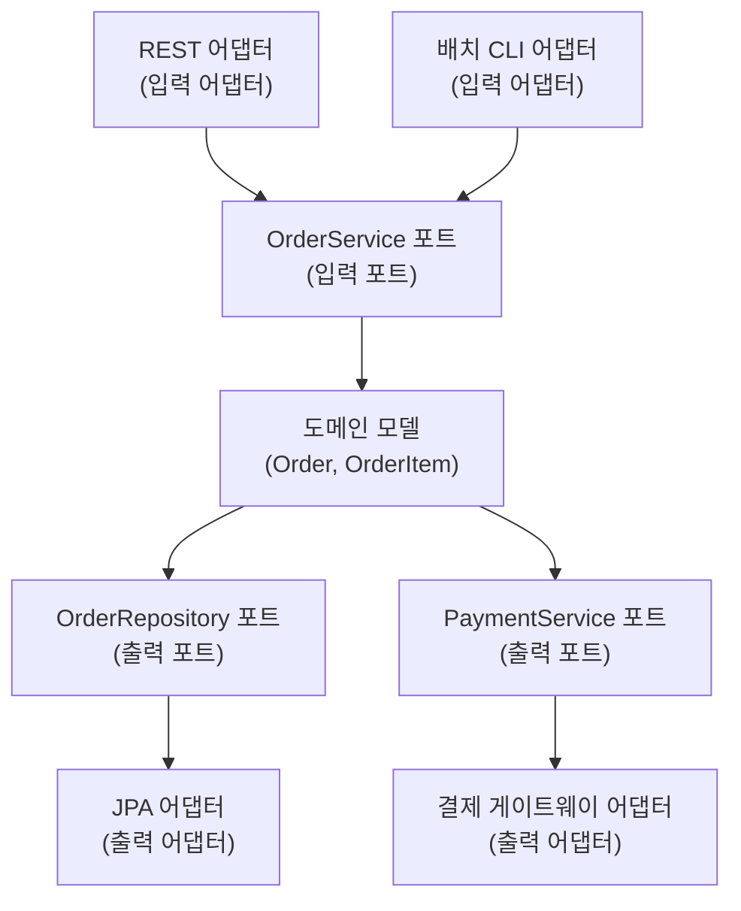
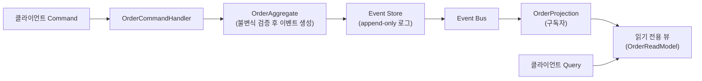

모놀리스 하나로 시작한 서비스가 사용자 수백만 명, 배포 팀 수십 개 규모로 자라면, 3장에서 다룬 계층화·이벤트 기반 같은 고전 패턴만으로는 "어느 팀이 무엇을 언제 배포할 것인가"라는 조직 차원의 문제를 풀 수 없게 된다. 이 장에서 다루는 마이크로서비스, 서버리스, 헥사고날 아키텍처, CQRS와 이벤트 소싱은 이런 배경에서 각기 다른 시점에 등장했지만, 공통적으로 "단일 실행 단위·단일 데이터 모델·단일 배포 주기"라는 전통적 가정 중 하나 이상을 깨는 선택이라는 점에서 함께 묶인다. 마이크로서비스는 배포 단위를, 서버리스는 실행·과금 단위를, 헥사고날은 의존성의 방향을, CQRS/이벤트 소싱은 데이터 모델의 단일성을 각각 깨뜨린다.

네 패러다임을 나열식으로 암기하면 "언제 어떤 것을 쓸지"를 실제로 판단하지 못한다. 이 장은 각 패러다임이 정확히 무엇을 트레이드오프하는지 — 무엇을 얻고 무엇을 대가로 치르는지 — 를 메커니즘 수준에서 설명하고, 널리 퍼진 오해 몇 가지를 교정한 뒤, 실제로 조합해 쓰는 방법과 피해야 할 상황을 판단 기준으로 정리한다. 이 네 가지는 서로 배타적인 선택지가 아니라 같은 시스템 안에서 함께 쓰이는 경우가 더 많다는 점을 먼저 밝혀 둔다 — 예를 들어 마이크로서비스로 나눈 각 서비스 내부를 헥사고날 구조로 설계하고, 그중 일부 서비스는 CQRS와 이벤트 소싱으로, 일부 이벤트 핸들러는 서버리스 함수로 구현하는 조합이 실무에서 흔하다.

## 이 장을 읽기 전에

이 장은 [3장. 아키텍처 패턴과 스타일](/post/software-architecture/architecture-patterns-and-styles/)에서 다룬 계층화·클라이언트-서버·파이프-필터·이벤트 기반 패턴을 이미 이해하고 있다고 가정한다. 특히 이벤트 기반 아키텍처의 발행-구독 개념은 이 장 후반부의 이벤트 소싱을 이해하는 전제가 되고, 계층화 아키텍처의 계층 분리 개념은 헥사고날 아키텍처와 비교할 기준점이 된다.

이 장은 초급부터 전문가 수준까지 다루며, 전문가 구간에서는 네 패러다임을 언제 조합하고 언제 피해야 하는지를 실제 성공·실패 사례를 근거로 판단하는 수준까지 다룬다. 다루지 않는 것은 다음과 같다. 마이크로서비스의 서비스 경계를 도메인 언어로 구체적으로 나누는 방법은 바운디드 컨텍스트를 다루는 9장(DDD 기초)에서, 서비스 간 데이터 일관성을 CAP 정리·Saga 패턴으로 엄밀하게 다루는 이론은 12장(분산 시스템 아키텍처)에서, 컨테이너·쿠버네티스 기반의 실제 배포 인프라는 13장(클라우드 네이티브 아키텍처)에서 각각 다룬다. 이 장은 그 전 단계로 "네 패러다임이 무엇이고 왜 그런 형태를 갖는가"에 집중한다.

## 당신의 수준에 맞는 경로

| 수준 | 읽을 부분 | 핵심 목표 |
|------|---------|---------|
| **초보자** (모놀리스 경험만 있음) | "왜 지금 파편화된 아키텍처인가" ~ "CQRS와 이벤트 소싱" | 네 패러다임이 각각 무엇을 트레이드오프하는지 구분해 설명한다 |
| **중급자** (단일 서비스 운영 경험) | "네 패러다임의 조합과 비교" ~ "실제 적용 사례" | 여러 패턴을 조합해 실제 시스템에 적용하는 감각을 얻는다 |
| **전문가** (아키텍처 결정 경험) | "흔한 오개념 교정" ~ "비판적 시각" | 조직 상황에 맞춰 패러다임 채택 여부를 근거로 방어하고 반박한다 |

---

## 왜 지금 파편화된 아키텍처인가

James Lewis와 Martin Fowler는 넷플릭스·아마존 등이 이미 실무에서 채택하고 있던 접근을 관찰한 뒤, 2014년 3월 공동 기고문에서 이 스타일에 "마이크로서비스"라는 이름을 붙였다.

> "the microservice architectural style is an approach to developing a single application as a suite of small services, each running in its own process and communicating with lightweight mechanisms, often an HTTP resource API." — James Lewis & Martin Fowler, ["Microservices"](https://martinfowler.com/articles/microservices.html) (martinfowler.com, 2014)

이 정의에서 핵심은 "각자 자신의 프로세스에서 실행된다(each running in its own process)"는 부분이다. 3장에서 다룬 계층화 아키텍처도 관심사를 분리하지만, 계층들은 여전히 하나의 프로세스 안에서 함수 호출로 통신한다. 마이크로서비스는 그 경계를 프로세스 경계, 나아가 배포 단위의 경계로까지 끌어올린다. 이 전환이 2010년대 중반부터 본격화된 데는 두 가지 배경이 겹친다. 하나는 넷플릭스가 2008년 대규모 데이터베이스 장애를 계기로 몇 년에 걸쳐 모놀리식 DVD 배송 시스템을 수백 개의 독립 서비스로 점진적으로 전환한 사례가 업계에 널리 알려지며 참조 모델이 되었다는 점이고, 다른 하나는 도커(2013년 공개)와 쿠버네티스(2014년 공개) 같은 컨테이너 기술이 "서비스 하나당 프로세스 하나"를 운영 가능한 비용으로 실현할 도구를 제공했다는 점이다. 컨테이너 없이도 마이크로서비스를 만들 수는 있지만, 수십–수백 개 서비스를 각기 독립적으로 패키징·배포·확장하는 실무는 컨테이너 오케스트레이션 없이는 감당하기 어렵다.

이 절 이후로 다루는 네 패러다임은 등장 시점도, 해결하는 문제도 다르다. 마이크로서비스와 서버리스는 "무엇을 어떤 단위로 배포·실행할 것인가"라는 런타임 질문에 답하고, 헥사고날은 "코드 내부에서 의존성이 어느 방향으로 흘러야 하는가"라는 설계 질문에, CQRS/이벤트 소싱은 "데이터를 어떤 모델로 저장하고 어떻게 읽을 것인가"라는 데이터 질문에 답한다. 이 네 질문은 서로 직교하기 때문에, 뒤에서 볼 것처럼 하나의 시스템 안에서 동시에 적용될 수 있다.

## 마이크로서비스 아키텍처: 서비스 자율성과 분산의 대가

**마이크로서비스**는 하나의 애플리케이션을 독립적으로 배포·확장 가능한 여러 개의 작은 서비스로 분해하는 아키텍처 스타일이다. 각 서비스는 자신의 프로세스에서 실행되고, 대개 자신만의 데이터 저장소를 소유하며, HTTP API나 메시지 큐 같은 가벼운 메커니즘으로 다른 서비스와 통신한다. 이 정의에서 실무에 가장 큰 영향을 미치는 부분은 "자신만의 데이터 저장소"다. 계층화 아키텍처에서는 여러 모듈이 하나의 데이터베이스와 트랜잭션을 공유해 일관성을 보장받지만, 마이크로서비스에서는 서비스 A의 데이터베이스와 서비스 B의 데이터베이스가 물리적으로 분리되어 있어, 두 서비스에 걸친 "주문 생성과 재고 차감을 동시에 성공시키거나 동시에 실패시킨다"는 단일 트랜잭션이 더 이상 불가능하다. 이 문제를 어떻게 다루는지는 12장에서 Saga 패턴으로 이어지는데, 이 장에서는 왜 그 문제가 애초에 생기는지 — 데이터 저장소 분리라는 선택 자체 — 를 이해하는 데 집중한다.

서비스 경계를 어떻게 나눌지는 기술적 결정이 아니라 조직적 결정에 가깝다. 1968년 멜빈 콘웨이가 처음 관찰했다고 알려진 "시스템 구조는 그것을 설계한 조직의 소통 구조를 닮는다"는 원칙(흔히 콘웨이의 법칙으로 불린다)은 마이크로서비스에서 특히 뚜렷하게 드러난다. 서비스 경계가 팀 경계와 어긋나면, 기능 하나를 배포하는 데 여러 팀의 조율이 필요해져 마이크로서비스가 약속하는 "독립 배포"라는 이점이 사라진다. 아래 표는 모놀리스와 마이크로서비스가 다섯 가지 측면에서 어떻게 갈리는지 정리한 것이다.

| 측면 | 모놀리스 | 마이크로서비스 |
|------|---------|---------------|
| 배포 단위 | 애플리케이션 전체 | 서비스별 독립 배포 |
| 데이터 저장소 | 공유 데이터베이스, 단일 트랜잭션 | 서비스별 독립 저장소, 분산 트랜잭션 필요 |
| 장애 전파 | 한 모듈 장애가 전체에 영향 | 서비스 경계에서 장애가 격리될 수 있음(격리 메커니즘 필요) |
| 팀 구조 | 기능별 교차 팀 | 서비스별 전담 팀(콘웨이의 법칙) |
| 관측 복잡도 | 단일 프로세스 로그·스택트레이스 | 분산 트레이싱 필요 |

서비스 간 통신에서 네트워크 호출은 함수 호출과 근본적으로 다른 실패 모드를 가진다. 함수 호출은 성공하거나 예외를 던지지만, 네트워크 호출은 성공·실패에 더해 "응답이 오지 않아 성공인지 실패인지 알 수 없는" 세 번째 상태가 존재한다. 이 상태를 방치하면 장애를 일으킨 서비스 하나가 호출자 스레드 풀을 고갈시켜 장애가 연쇄적으로 번지는데, 이를 막는 대표적 메커니즘이 <strong>회로 차단기(Circuit Breaker)</strong>다. 회로 차단기는 실패율이 임계값을 넘으면 일정 시간 동안 호출 자체를 차단하고 대체 응답(fallback)을 즉시 반환해, 장애가 전파되기 전에 회로를 끊는다.

```java
// PaymentClient.java — 회로 차단기로 감싼 결제 서비스 호출
@Component
public class PaymentClient {

    private final PaymentServiceApi paymentServiceApi;

    public PaymentClient(PaymentServiceApi paymentServiceApi) {
        this.paymentServiceApi = paymentServiceApi;
    }

    @CircuitBreaker(name = "payment-service", fallbackMethod = "fallback")
    public PaymentResult charge(String orderId, BigDecimal amount) {
        return paymentServiceApi.processPayment(
            new PaymentRequest(orderId, amount)
        );
    }

    // 회로가 열려 있거나 호출이 실패하면 즉시 이 대체 응답을 반환한다.
    private PaymentResult fallback(String orderId, BigDecimal amount, Exception ex) {
        return PaymentResult.failed("결제 서비스 일시 중단, 잠시 후 재시도하세요");
    }
}
```

이 코드에서 `fallback`은 "실패를 숨기는" 코드가 아니라 "실패를 빠르게, 예측 가능한 형태로 반환하는" 코드라는 점이 중요하다. 회로 차단기 없이 타임아웃만 걸어 두면, 장애 상황에서 모든 요청이 타임아웃 시간만큼 대기하다 실패해 호출자 자원을 오래 붙잡는다. 마이크로서비스의 장점 — 서비스별 독립 배포, 기술 다양성, 장애 격리 — 는 이런 방어 메커니즘을 실제로 구현했을 때만 성립하며, 구현하지 않으면 오히려 "네트워크로 연결된 모놀리스"라는 더 나쁜 상태가 될 수 있다는 점을 뒤의 비판적 시각에서 다시 다룬다.

## 서버리스 아키텍처: FaaS와 콜드 스타트의 트레이드오프

<strong>서버리스(Serverless)</strong>는 개발자가 서버 프로비저닝·용량 계획을 직접 하지 않고, 이벤트에 반응해 실행되는 함수 단위로 코드를 배포하는 클라우드 실행 모델이다. "서버가 없다"는 이름과 달리 서버는 여전히 존재하며, 다만 그 관리 책임이 클라우드 제공자에게 완전히 위임된다. 이 모델을 대중화한 계기는 AWS가 2014년 11월 re:Invent에서 발표한 Lambda였다.

> "in 2014 I was able to announce AWS Lambda – Run Code in the Cloud" — Jeff Barr, ["AWS Lambda turns ten"](https://aws.amazon.com/blogs/aws/aws-lambda-turns-ten-the-first-decade-of-serverless-innovation/) (AWS Blog, 2024)

FaaS(Function as a Service)의 실행 모델을 이해하려면 <strong>콜드 스타트(Cold Start)</strong>의 메커니즘을 알아야 한다. 함수가 호출되면 클라우드 제공자는 우선 그 함수를 실행할 격리된 실행 환경(컨테이너 또는 마이크로 VM)이 이미 준비되어 있는지 확인한다. 준비된 환경이 없으면 새 실행 환경을 초기화하고, 런타임(JVM, Node.js 등)을 부팅하고, 배포 패키지를 로드하고, 함수 초기화 코드(전역 변수 선언, DB 커넥션 풀 생성 등)를 실행한 뒤에야 실제 요청을 처리한다 — 이 전체 과정이 콜드 스타트이며, 언어·패키지 크기·VPC 설정에 따라 수백 밀리초에서 수 초까지 걸릴 수 있다. 반대로 최근에 호출되어 아직 살아 있는 실행 환경을 재사용하면(웜 스타트) 초기화 단계를 건너뛰므로 지연이 훨씬 짧다. 이 차이 때문에 서버리스는 트래픽이 간헐적이거나 급격히 변동하는 워크로드에는 유리하지만, 지연 시간에 민감하면서 지속적으로 트래픽이 유지되는 경로에는 상시 기동 중인 서버보다 불리할 수 있다.

```java
// OrderEventHandler.java — SQS 이벤트를 처리하는 Lambda 함수
public class OrderEventHandler implements RequestHandler<SQSEvent, Void> {

    // 콜드 스타트 시 1회만 초기화되고, 웜 스타트 시에는 재사용된다.
    private final OrderRepository orderRepository = new DynamoOrderRepository();

    @Override
    public Void handleRequest(SQSEvent event, Context context) {
        LambdaLogger logger = context.getLogger();

        for (SQSEvent.SQSMessage message : event.getRecords()) {
            OrderCreatedMessage payload = parse(message.getBody());
            try {
                orderRepository.markConfirmed(payload.getOrderId());
                logger.log("주문 확정 처리 완료: " + payload.getOrderId());
            } catch (Exception e) {
                // 실패 시 SQS 재시도 정책에 위임 (메시지를 큐로 되돌림)
                logger.log("주문 확정 처리 실패: " + e.getMessage());
                throw new RuntimeException(e);
            }
        }
        return null;
    }
}
```

이 예제에서 `orderRepository`를 클래스 필드로 두어 재사용하는 것은 우연이 아니다. 매 호출마다 DB 커넥션을 새로 여는 대신 웜 스타트 상태에서 커넥션을 재사용해야 서버리스의 성능 이점이 실제로 나타난다. 아래 표는 전통적인 상시 기동 서버와 서버리스의 차이를 정리한 것이다.

| 측면 | 전통적 서버 | 서버리스(FaaS) |
|------|-----------|----------------|
| 유휴 비용 | 트래픽이 없어도 서버 비용 발생 | 호출당 과금, 유휴 시 비용 없음 |
| 확장 방식 | 수동 또는 오토스케일링 정책 설정 필요 | 요청량에 따라 완전 자동 확장 |
| 지연 특성 | 일정한 지연(워밍업 불필요) | 콜드 스타트로 인한 지연 변동 가능 |
| 실행 시간 제한 | 없음 | 제공자별 상한 존재(예: AWS Lambda 15분) |
| 운영 책임 | 인프라·패치까지 직접 관리 | 코드와 설정에만 집중 |

## 헥사고날 아키텍처: 포트와 어댑터로 도메인을 지키기

<strong>헥사고날 아키텍처(포트와 어댑터 패턴)</strong>는 Alistair Cockburn이 2005년 발표한 기술 보고서에서 처음 제시한 패턴으로, 애플리케이션의 핵심 로직을 외부 기술로부터 완전히 격리하는 것을 목표로 한다.

> "Allow an application to equally be driven by users, programs, automated test or batch scripts, and to be developed and tested in isolation from its eventual run-time devices and databases." — Alistair Cockburn, ["Hexagonal Architecture"](https://alistair.cockburn.us/hexagonal-architecture/) (2005)

이 정의의 핵심 메커니즘은 **의존성 역전**이다. 계층화 아키텍처에서는 상위 계층(비즈니스 로직)이 하위 계층(데이터 접근)의 구체 클래스를 직접 알고 호출하지만, 헥사고날에서는 도메인이 <strong>포트(Port)</strong>라는 인터페이스를 자신의 영역 안에 정의하고, 데이터베이스·외부 API 같은 인프라 코드가 그 포트를 구현하는 <strong>어댑터(Adapter)</strong>로서 도메인에 의존한다. 의존성의 화살표가 뒤집히는 것이다. 포트는 두 종류로 나뉜다. 외부에서 애플리케이션을 호출하는 **입력 포트**(예: `OrderService` 인터페이스)와, 애플리케이션이 외부를 호출하는 **출력 포트**(예: `OrderRepository` 인터페이스)다. REST 컨트롤러는 입력 포트를 호출하는 입력 어댑터이고, JPA 구현체는 출력 포트를 구현하는 출력 어댑터다.



이 구조가 주는 실질적 이득은 테스트 용이성에서 가장 뚜렷하게 나타난다. 아래 예제처럼 도메인 서비스는 출력 포트(인터페이스)에만 의존하므로, 실제 데이터베이스 없이 인터페이스를 흉내 낸 테스트 대역만으로 핵심 로직을 검증할 수 있다.

```java
// OrderService.java — 입력 포트를 구현하는 애플리케이션 서비스
public class OrderService {

    private final OrderRepository orderRepository;   // 출력 포트
    private final PaymentService paymentService;      // 출력 포트

    public OrderService(OrderRepository orderRepository, PaymentService paymentService) {
        this.orderRepository = orderRepository;
        this.paymentService = paymentService;
    }

    public OrderId confirmOrder(OrderId orderId) {
        Order order = orderRepository.findById(orderId)
            .orElseThrow(() -> new OrderNotFoundException(orderId));

        PaymentResult result = paymentService.processPayment(orderId, order.getTotalAmount());
        if (!result.isSuccess()) {
            throw new PaymentFailedException(result.getErrorMessage());
        }

        order.confirm();               // 도메인 불변식 검증은 Order 내부에서 수행
        orderRepository.save(order);
        return order.getId();
    }
}
```

`OrderService`는 `OrderRepository`가 JPA로 구현됐는지, 인메모리 맵으로 구현됐는지 전혀 알지 못한다. 이 무지(無知)가 헥사고날의 핵심 가치다 — 데이터베이스를 PostgreSQL에서 DynamoDB로 바꾸는 결정이 도메인 코드에 단 한 줄도 영향을 주지 않는다. 다만 이 구조를 갖추는 데는 인터페이스 정의, DTO-도메인 매핑 코드 같은 초기 보일러플레이트 비용이 따르며, 이 비용이 언제 정당화되는지는 뒤의 판단 기준에서 다룬다. 참고로 Robert C. Martin이 2012년 제안한 클린 아키텍처는 이 포트-어댑터 개념을 동심원 형태로 재구성한 것으로, 의존성이 항상 안쪽(도메인)을 향해야 한다는 동일한 원칙을 공유한다.

## CQRS와 이벤트 소싱: 명령과 조회, 현재 상태와 이력의 분리

<strong>CQRS(Command Query Responsibility Segregation)</strong>는 데이터를 변경하는 명령(Command) 모델과 데이터를 읽는 조회(Query) 모델을 서로 다른 모델로 분리하는 패턴이다. Martin Fowler는 이 패턴을 다음과 같이 설명하며 출처를 Greg Young으로 명시한다.

> "It's a pattern that I first heard described by Greg Young ... CQRS stands for Command Query Responsibility Segregation. At its heart is the notion that you can use a different model to update information than the model you use to read information." — Martin Fowler, ["CQRS"](https://martinfowler.com/bliki/CQRS.html) (2011)

이 아이디어의 뿌리는 Bertrand Meyer가 1988년 저서 『Object-Oriented Software Construction』에서 제시한 <strong>명령-조회 분리 원칙(CQS)</strong>으로 거슬러 올라간다. CQS는 "메서드 하나는 상태를 변경하거나 값을 반환하거나 둘 중 하나만 해야 한다"는 메서드 수준의 규율이었다. CQRS는 이 규율을 아키텍처 수준으로 끌어올려, 메서드가 아니라 **모델 전체**를 명령용과 조회용으로 나눈다. 왜 이렇게까지 할까? 읽기와 쓰기는 부하 특성이 다른 경우가 많다 — 주문 시스템이라면 쓰기(주문 생성)는 초당 수십 건이지만 읽기(주문 목록 조회, 통계 집계)는 초당 수천 건일 수 있고, 읽기 쪽은 여러 테이블을 조인한 비정규화된 뷰가 유리한 반면 쓰기 쪽은 트랜잭션 무결성이 유지되는 정규화된 모델이 유리하다. 하나의 모델로 두 요구를 동시에 만족시키려 하면 어느 한쪽이 타협된다.

CQRS와 자주 함께 언급되지만 개념적으로 독립적인 것이 <strong>이벤트 소싱(Event Sourcing)</strong>이다. 이벤트 소싱은 애플리케이션의 현재 상태를 직접 저장하는 대신, 상태를 변화시킨 모든 사건을 추가 전용(append-only) 이벤트 스트림으로 저장하고, 현재 상태가 필요할 때마다 이벤트를 순서대로 재생(replay)해 계산하는 패턴이다. Greg Young이 CQRS와 함께 대중화한 것으로 알려져 있다. 이 방식의 메커니즘을 이해하려면 "쓰기 모델은 이벤트를 낳고, 읽기 모델은 이벤트를 소비한다"는 흐름을 따라가는 것이 가장 빠르다.

```java
// OrderAggregate.java — 이벤트를 적용해 상태를 재구성하는 쓰기 모델
public class OrderAggregate {
    private OrderStatus status;
    private final List<OrderEvent> uncommittedEvents = new ArrayList<>();

    // 과거 이벤트를 순서대로 재생해 현재 상태를 복원한다.
    public OrderAggregate(List<OrderEvent> history) {
        history.forEach(this::apply);
    }

    public void confirm(String paymentId) {
        if (status != OrderStatus.PENDING) {
            // 도메인 불변식: 대기 중인 주문만 확인할 수 있다.
            throw new IllegalStateException("대기 중인 주문만 확인할 수 있습니다");
        }
        applyAndRecord(new OrderConfirmedEvent(paymentId));
    }

    private void applyAndRecord(OrderEvent event) {
        apply(event);
        uncommittedEvents.add(event);
    }

    private void apply(OrderEvent event) {
        if (event instanceof OrderConfirmedEvent) {
            this.status = OrderStatus.CONFIRMED;
        }
        // 다른 이벤트 타입에 대한 분기는 생략
    }

    public List<OrderEvent> pullUncommittedEvents() {
        List<OrderEvent> events = new ArrayList<>(uncommittedEvents);
        uncommittedEvents.clear();
        return events;
    }
}
```

`OrderAggregate`의 생성자가 과거 이벤트를 재생해 상태를 복원하는 부분이 이벤트 소싱의 본질이다. 이 애그리게이트는 현재 상태를 필드에 직접 저장하지 않고, 이벤트 스트림이 곧 진실의 원천(source of truth)이 된다. 저장된 이벤트는 절대 수정·삭제되지 않으므로, 특정 시점의 상태를 그 시점까지의 이벤트만 재생해 복원하는 "시간 여행"과, 모든 변경 이력을 빠짐없이 보존하는 감사 추적이 자연스럽게 따라온다. 아래 다이어그램은 명령이 이벤트로, 이벤트가 다시 읽기 모델로 흐르는 전체 경로를 보여준다.



읽기 모델(`OrderReadModel`)은 이벤트 버스를 구독하는 **프로젝션**이 비동기로 갱신한다. 이 비동기성 때문에 CQRS/이벤트 소싱은 필연적으로 <strong>최종 일관성(Eventual Consistency)</strong>을 받아들여야 한다 — 명령이 성공한 직후 같은 데이터를 조회하면 아직 반영되지 않은 값을 볼 수 있다. 이 지연이 사용자 경험에 문제가 되는지는 도메인마다 다르며, 이 트레이드오프를 분산 시스템 이론(CAP 정리)의 언어로 정리하는 것은 12장의 몫이다.

## 네 패러다임의 조합과 비교

지금까지 다룬 네 패러다임은 서로 다른 축의 질문에 답하기 때문에 배타적이지 않다. 실무에서 흔한 조합은 마이크로서비스로 서비스 경계를 나누고, 각 서비스 내부는 헥사고날 구조로 설계해 도메인 로직을 인프라로부터 격리하며, 쓰기·읽기 부하 차이가 큰 특정 서비스(예: 주문·결제)에만 CQRS/이벤트 소싱을 적용하고, 이벤트에 반응하는 알림·통계 집계 같은 부가 처리는 서버리스 함수로 구현하는 형태다. 네 가지를 모두 적용해야 한다는 뜻은 아니다 — 오히려 각 패러다임이 해결하는 문제가 시스템에 실제로 존재하는지 먼저 확인하고, 존재하는 문제에만 해당 패러다임을 적용하는 것이 원칙이다.

| 패러다임 | 바꾸는 대상 | 얻는 것 | 대가로 치르는 것 |
|---------|-----------|--------|-----------------|
| 마이크로서비스 | 배포·프로세스 단위 | 독립 배포, 팀 자율성, 장애 격리(구현 시) | 분산 트랜잭션, 네트워크 실패 처리, 관측 복잡도 |
| 서버리스 | 실행·과금 단위 | 자동 확장, 유휴 비용 제거 | 콜드 스타트, 실행 시간 제한, 벤더 종속 |
| 헥사고날 | 의존성 방향 | 테스트 용이성, 인프라 교체 유연성 | 인터페이스·매핑 보일러플레이트 |
| CQRS/이벤트 소싱 | 데이터 모델 | 읽기·쓰기 독립 최적화, 완전한 이력 보존 | 최종 일관성, 이벤트 스키마 진화 관리 |

## 실제 적용 사례

넷플릭스는 2008년 데이터베이스 손상으로 사흘간 DVD 배송이 중단된 장애를 계기로, 이후 몇 년에 걸쳐 모놀리식 시스템을 수백 개의 독립 서비스로 점진적으로 전환한 것으로 널리 알려져 있다. 이 사례는 마이크로서비스가 "처음부터 옳은 설계"로 채택되기보다, 모놀리스의 한계를 실제로 겪은 뒤 점진적으로 전환된 경우가 많다는 것을 보여준다.

한편 2023년 5월 아마존 Prime Video 팀은 자사 오디오/비디오 품질 모니터링 서비스를 오히려 마이크로서비스에서 단일 프로세스(모놀리스에 가까운 구조)로 재구성해 인프라 비용을 90% 이상 절감했다고 발표해 업계에 화제가 되었다. 핵심 원인은 초당 여러 번의 상태 전이를 AWS Step Functions와 S3를 매개로 여러 서비스에 분산 처리하면서 서비스 간 오케스트레이션 비용 자체가 병목이 된 것이었고, 이를 하나의 프로세스 내 메모리 전달로 바꾸면서 비용이 급감했다. 이 사례는 뒤의 오개념 교정에서 다시 다룬다.

서버리스는 AWS Lambda가 2014년 출시된 이후 이벤트 기반 데이터 파이프라인 — 이미지 업로드 시 자동 리사이즈, 로그 스트림 실시간 집계, 예약된 배치 작업 — 영역에서 특히 널리 채택되었다. 이런 워크로드는 대부분 짧은 실행 시간과 간헐적인 트리거를 특징으로 해, 서버리스의 과금·확장 모델과 잘 맞는다. CQRS/이벤트 소싱은 모든 자금 이동 내역을 영구히 보존해야 하는 금융 원장(ledger) 시스템이나, 규제상 변경 이력 전체를 감사 가능해야 하는 도메인에서 특히 자주 채택되는데, 이벤트 스트림 자체가 감사 로그를 겸하기 때문이다.

## 흔한 오개념 교정

<strong>"마이크로서비스가 항상 모놀리스보다 낫다"</strong>는 대표적인 오개념이다. Martin Fowler는 2015년 글 ["MonolithFirst"](https://martinfowler.com/bliki/MonolithFirst.html)에서 "새 프로젝트를 마이크로서비스로 시작하지 말라(you shouldn't start a new project with microservices)"고 명시적으로 경고했는데, 이는 서비스 경계를 처음부터 올바르게 나누기가 매우 어렵고, 이 어려움이 초기 개발 속도라는 대가로 나타나기 때문이다. 앞서 본 Prime Video 사례처럼 잘 정립된 마이크로서비스 시스템을 오히려 되돌려 비용을 절감한 사례도 있다는 사실이, 마이크로서비스가 목적이 아니라 특정 조건(팀 자율성, 독립 확장 필요성)에서만 정당화되는 수단임을 보여준다.

<strong>"서버리스는 서버가 없다는 뜻이다"</strong>도 오개념이다. 서버는 여전히 존재하며, 다만 프로비저닝·패치·용량 계획이라는 관리 책임이 클라우드 제공자에게 넘어갈 뿐이다. 이 오해는 실무에서 종종 "서버리스니까 인프라를 신경 쓸 필요가 없다"는 잘못된 안심으로 이어지는데, 콜드 스타트·동시 실행 수 제한·실행 시간 제한 같은 인프라 제약은 여전히 설계에 반영해야 한다.

<strong>"CQRS는 반드시 이벤트 소싱과 함께 써야 한다"</strong>는 것도 흔한 오해다. Fowler의 글이 지적하듯 CQRS는 "다른 모델을 쓴다"는 것만을 요구할 뿐, 그 모델을 어떻게 영속화할지는 규정하지 않는다. 쓰기 모델을 일반 관계형 테이블로 두고 읽기 전용 복제본이나 별도 조회 테이블만 두는 CQRS 구현도 흔하며, 이 경우 이벤트 소싱의 복잡도(이벤트 스키마 버전 관리, 재생 성능) 없이도 읽기·쓰기 분리의 이점 일부를 얻을 수 있다.

## 인접 개념과의 연결

헥사고날 아키텍처의 의존성 역전은 2장에서 다룬 SOLID 원칙 중 의존성 역전 원칙(DIP)을 아키텍처 수준으로 확장한 것이고, 3장의 이벤트 기반 아키텍처에서 다룬 발행-구독 메커니즘은 이 장의 이벤트 소싱이 이벤트를 전파하는 방식과 그대로 이어진다. 마이크로서비스의 서비스 경계를 도메인 지식 없이 임의로 나누면 서비스 사이에 과도한 호출이 발생하는데, 이 경계를 도메인 언어로 원칙 있게 나누는 방법은 9장의 바운디드 컨텍스트에서 다룬다. CQRS/이벤트 소싱이 만드는 최종 일관성 문제, 그리고 마이크로서비스의 분산 트랜잭션 문제는 모두 12장에서 CAP 정리와 Saga 패턴이라는 공통 이론으로 다시 정리된다. 이 장에서 다룬 컨테이너 기반 배포(도커·쿠버네티스)와 서버리스 실행 환경의 실제 운영 방법은 13장의 클라우드 네이티브 아키텍처에서 이어진다.

## 판단 기준: 언제 쓰고 언제 피할지

| 패러다임 | 채택을 고려할 상황 | 피해야 할 상황 |
|---------|-----------------|---------------|
| 마이크로서비스 | 여러 독립 팀이 병렬로 배포해야 하고 도메인 경계가 이미 안정적임 | 팀이 하나뿐이거나 도메인 경계가 아직 자주 바뀜(Fowler의 MonolithFirst) |
| 서버리스 | 트래픽이 간헐적·폭발적이고 짧은 실행 시간의 이벤트 처리 위주 | 지속적으로 높은 트래픽이 유지되거나 지연에 매우 민감한 핫 경로 |
| 헥사고날 | 비즈니스 규칙이 복잡하거나 외부 기술(DB·API)이 자주 바뀌고 테스트 격리가 중요 | 단순 CRUD 위주로 도메인 로직이 거의 없는 경우(오버엔지니어링) |
| CQRS/이벤트 소싱 | 읽기·쓰기 부하 특성이 크게 다르거나 완전한 변경 이력(감사)이 필요 | 단순 CRUD로 충분하고 최종 일관성을 감당할 조직적 준비가 안 됨 |

## 비판적 시각: 한계와 트레이드오프

이 장에서 다룬 네 패러다임은 모두 "복잡성을 없애는" 것이 아니라 "복잡성을 옮기는" 선택이라는 공통점을 갖는다. 마이크로서비스는 코드 내부의 복잡성을 네트워크와 운영의 복잡성으로 옮기고, 회로 차단기·분산 트레이싱 같은 방어 메커니즘을 실제로 구현하지 않으면 장애 격리라는 이점 없이 결합도만 유지한 채 배포 단위만 나뉜 **분산 모놀리스(Distributed Monolith)** 상태에 빠지기 쉽다. 서버리스는 인프라 관리를 클라우드 제공자에게 옮기는 대신 특정 벤더의 실행 모델·이벤트 형식에 강하게 결속되어, 다른 제공자로 옮기는 비용이 전통적인 서버 기반 애플리케이션보다 클 수 있다. 헥사고날은 인프라 교체 유연성을 얻는 대신 인터페이스·매핑 코드라는 반복 작업을 늘리므로, 도메인 로직이 거의 없는 단순 CRUD 서비스에 적용하면 이득 없이 비용만 남는다. CQRS/이벤트 소싱은 감사·이력 보존이라는 이점을 얻는 대신, 이벤트 스키마가 바뀔 때 과거 이벤트를 어떻게 재생할지(업캐스팅)와 최종 일관성 창(window)을 사용자에게 어떻게 설명할지를 영구적인 운영 부담으로 떠안는다. 결국 이 장의 결론은 "새로운 것이 항상 낫다"가 아니라, 각 패러다임이 옮기는 복잡성이 자신의 조직·도메인이 이미 감당하고 있는 복잡성보다 실제로 작은지를 먼저 따져야 한다는 것이다.

## 평가 기준

- [ ] 마이크로서비스·서버리스·헥사고날·CQRS/이벤트 소싱이 각각 무엇을 트레이드오프하는지(배포 단위·실행 단위·의존성 방향·데이터 모델) 구분해 설명할 수 있다.
- [ ] 회로 차단기가 왜 필요한지, 그리고 헥사고날의 포트-어댑터 구조가 왜 의존성 역전을 실현하는지 메커니즘 수준으로 설명할 수 있다.
- [ ] 콜드 스타트가 왜 발생하는지, CQRS/이벤트 소싱이 왜 최종 일관성을 요구하는지 원리를 근거로 설명할 수 있다.
- [ ] "마이크로서비스가 항상 낫다", "서버리스는 서버가 없다", "CQRS는 이벤트 소싱과 항상 함께 쓴다"는 오개념을 실제 사례로 반박할 수 있다.
- [ ] 주어진 시스템 상황(팀 구조, 트래픽 패턴, 일관성 요구)에서 네 패러다임 중 무엇을 적용하고 무엇을 피할지 근거를 들어 판단할 수 있다.
- [ ] 각 패러다임이 복잡성을 없애는 것이 아니라 옮기는 것임을 이해하고, 그 복잡성을 조직이 실제로 감당할 수 있는지 비판적으로 평가할 수 있다.

**다음 장에서는** 이 장에서 다룬 네 패러다임 중 어떤 것을 선택할지 판단하는 기준을 더 엄밀하게 만드는 [5장. 품질 속성과 아키텍처](/post/software-architecture/quality-attributes-and-architecture/)를 다룬다. 이 장에서 "언제 쓰고 언제 피할지"를 사례 중심으로 판단했다면, 다음 장은 성능·확장성·가용성 같은 품질 속성을 명시적인 요구사항으로 정의하고 측정하는 방법을 다뤄, 그 판단을 재현 가능한 기준으로 바꾼다.
