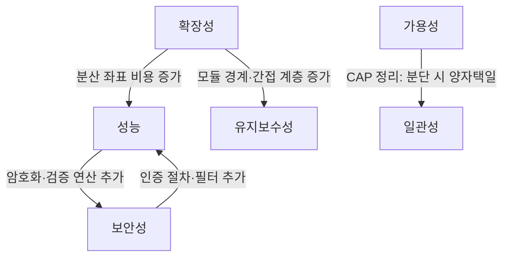

## 왜 품질 속성인가

기능은 똑같이 "주문을 생성한다"고 명세된 두 시스템이, 하나는 트래픽이 10배로 튀어도 버티고 다른 하나는 결제 서버 하나가 죽으면 전체가 멈춘다면, 그 차이를 만든 것은 기능 요구사항이 아니다. <strong>품질 속성(Quality Attribute)</strong>은 시스템이 "무엇을 하는가"가 아니라 "그것을 얼마나 빠르게, 얼마나 안정적으로, 얼마나 안전하게, 얼마나 쉽게 바꿀 수 있게" 하는가를 규정하는 요구사항이다. Bass, Clements, Kazman은 1998년 초판이 나온 『Software Architecture in Practice』에서 이 구분을 아키텍처 논의의 출발점으로 삼았다 — 기능 요구사항은 임의의 합리적인 아키텍처로도 대부분 충족되지만, 품질 속성은 그렇지 않다. 응답 시간 200ms, 초당 1만 건 처리, 99.95% 가용성 같은 요구는 나중에 리팩토링으로 끼워 넣을 수 있는 성질의 것이 아니라 계층 구조·데이터 분산 방식·장애 격리 경계 같은 아키텍처의 뼈대 자체를 결정한다.

이런 요구사항을 SEI(Software Engineering Institute)는 <strong>아키텍처 결정 요구사항(Architecturally Significant Requirement, ASR)</strong>이라 부른다. 기능 명세서에는 "회원가입이 가능해야 한다"만 적혀 있어도, 그 회원가입이 초당 몇 건까지 견뎌야 하는지, 개인정보를 어떤 강도로 암호화해야 하는지, 회원 데이터베이스가 죽었을 때 시스템 전체가 함께 죽어도 되는지는 기능 명세 밖에 있다. 이 장은 성능·확장성·가용성·보안성·유지보수성이라는 다섯 가지 대표 품질 속성을 각각의 내부 동작 메커니즘 수준에서 다루고, 이들이 서로 충돌할 때 그 트레이드오프를 정량적으로 다루는 도구(품질 속성 시나리오, ATAM 유틸리티 트리)를 소개한다.

### 이 장을 읽기 전에

이 장은 [04장: 모던 아키텍처 패러다임](/post/software-architecture/modern-architecture-paradigms/)에서 다룬 마이크로서비스·헥사고날·CQRS 같은 패턴이 "왜 그런 형태를 갖는가"에 대한 답을 제공한다. 04장의 패턴들을 이미 구조로는 알고 있지만 "왜 굳이 서비스를 쪼개는가", "왜 CQRS로 읽기/쓰기를 분리하는가"라는 질문에 품질 속성 용어로 답하지 못한다면 이 장에서 그 연결고리를 채우게 된다. 이 장의 난이도는 초급–중급이며, 심화 구간에서는 ATAM 유틸리티 트리와 PACELC 같은 CAP 정리의 확장 이론을 다룬다. 다만 ATAM 평가를 실제로 수행하는 4일짜리 워크숍 절차나 이해관계자 인터뷰 기법 같은 실행 방법론은 [07장: 아키텍처 평가와 분석](/post/software-architecture/architecture-evaluation-and-analysis/)의 범위이므로 이 장에서는 다루지 않는다. 마찬가지로 품질 속성 결정을 문서로 남기는 구체적 표기법(C4 모델, ADR 양식)은 [06장: 아키텍처 문서화](/post/software-architecture/architecture-documentation/)에서 다룬다.

### 당신의 수준에 맞는 경로

| 수준 | 읽을 부분 | 핵심 목표 |
|---|---|---|
| 초급 | 품질 속성이란 무엇인가 ~ 유지보수성 | 5대 품질 속성의 정의와 측정 지표를 구분해 말할 수 있다 |
| 중급 | + 품질 속성 간 트레이드오프, 흔한 오개념 | 두 속성이 충돌하는 상황에서 트레이드오프를 근거를 들어 설명할 수 있다 |
| 심화 | + 품질 속성 시나리오 표기법, 언제 무엇을 우선할지 | 조직의 우선순위를 정량적 시나리오로 표현하고 ATAM 유틸리티 트리로 정리할 수 있다 |

---

## 품질 속성이란 무엇인가

"성능이 좋아야 한다", "안정적이어야 한다" 같은 문장은 품질 속성이 아니라 품질 속성에 대한 막연한 바람이다. 검증 불가능한 요구는 아키텍처 결정에 쓸 수 없다 — "안정적이어야 한다"는 아키텍트에게 아무 지침도 주지 않지만 "결제 서비스가 5초 이상 응답하지 않으면 30초 내에 자동으로 재시도 큐로 전환해야 한다"는 구체적인 설계 결정을 이끌어낸다. SEI는 이 간극을 메우기 위해 <strong>품질 속성 시나리오(Quality Attribute Scenario)</strong>라는 6요소 표기법을 제안했다. 자극이 어디서 발생하고(자극원), 무엇이 발생하며(자극), 시스템의 어느 부분이 그 영향을 받고(대상), 그 시점에 시스템이 어떤 상태였으며(환경), 시스템이 어떻게 반응해야 하고(응답), 그 반응이 얼마나 잘 되었는지를 어떤 수치로 판정할지(응답 측정)까지 여섯 항목을 채우면, "빨라야 한다"는 말은 검증 가능한 요구사항으로 바뀐다.

이 표기법의 힘은 모호함을 제거하는 데 있다. 같은 "성능이 좋아야 한다"는 요청도 "정상 부하에서 P95 응답 시간 200ms"와 "블랙프라이데이 트래픽 급증 시 P95 응답 시간 2초 이하 유지"는 전혀 다른 아키텍처를 요구한다. 전자는 단일 인스턴스의 쿼리 최적화로 충분할 수 있지만, 후자는 자동 스케일링과 큐 기반 부하 분산까지 필요하다. 아래 표는 이 6요소를 실제 시나리오 하나에 채운 예시다.

| 요소 | 설명 | 예시 (성능 시나리오) |
|---|---|---|
| 자극원(Source) | 자극을 유발하는 주체 | 프로모션 페이지에 유입된 사용자 5,000명 |
| 자극(Stimulus) | 시스템에 도달하는 조건 | 동시에 상품 목록 조회 요청 발생 |
| 대상(Artifact) | 자극을 받는 시스템 구성요소 | 상품 조회 API와 그 뒤의 캐시 계층 |
| 환경(Environment) | 발생 시점의 시스템 상태 | 프로모션 시작 직후 피크 부하 상태 |
| 응답(Response) | 시스템이 취해야 할 동작 | 캐시에서 응답을 반환하고, 캐시 미스 시 DB 부하를 제한 |
| 응답 측정(Response Measure) | 정량적 성공 기준 | P95 응답 시간 300ms 이하, 오류율 0.1% 미만 |

품질 속성은 서로 독립적으로 존재하지 않는다. 한 속성을 개선하는 설계 결정은 거의 항상 다른 속성에 비용을 발생시키며, 이 장 후반의 트레이드오프 절에서 이를 정면으로 다룬다. 지금은 각 속성이 무엇을 측정하고 어떤 메커니즘으로 달성되는지부터 순서대로 살펴본다.

---

## 성능 (Performance)

성능은 시스템이 하나의 요청을 얼마나 빨리 처리하는가(응답 시간·지연 시간)와, 단위 시간에 얼마나 많은 요청을 처리하는가(처리량)라는 두 개의 서로 다른 축으로 구성된다. 이 둘을 하나로 뭉뚱그려 "빠르다"고 말하면 설계를 그르치기 쉽다. 응답 시간을 줄이는 전략(캐싱, 인덱싱)과 처리량을 늘리는 전략(병렬 처리, 큐잉)은 방향이 다르고, 때로는 서로를 방해한다 — 예를 들어 요청을 배치로 묶어 처리하면 처리량은 늘지만 개별 요청의 응답 시간은 늘어난다. 응답 시간은 평균값으로 보고하면 실제 사용자 경험을 왜곡하기 쉬운데, 소수의 느린 요청이 평균에 묻혀 사라지기 때문이다. 그래서 실무에서는 요청의 95%가 특정 시간 이내에 끝나는지를 보는 P95, 99%를 보는 P99 같은 백분위수 지표를 쓴다. P99가 나쁘면 전체 사용자의 1%가 매번 나쁜 경험을 겪는다는 뜻이고, 이 1%는 트래픽이 커질수록 절대 사용자 수로는 결코 작지 않다.

성능 개선의 대표 메커니즘은 캐싱이다. 캐싱은 자주 조회되지만 자주 바뀌지 않는 데이터를 원본 저장소보다 빠른 계층에 복제해 두는 기법으로, 그 효과는 <strong>캐시 적중률(hit ratio)</strong>과 **무효화(invalidation) 정확도**라는 두 변수로 결정된다. 적중률이 낮으면 캐시 계층 자체가 조회 경로에 지연을 하나 더 추가하는 역효과를 낳고, 무효화가 늦으면 사용자는 이미 바뀐 데이터를 오래된 값으로 보게 된다. 가장 널리 쓰이는 방식은 <strong>캐시-어사이드(cache-aside)</strong>로, 애플리케이션이 캐시를 먼저 조회하고 없으면 원본에서 읽어 캐시에 채운 뒤 반환하며, 데이터가 변경되면 캐시 항목을 명시적으로 무효화한다. 아래 예제는 이 흐름을 최소 형태로 보여준다.

```java
import java.util.Map;
import java.util.concurrent.ConcurrentHashMap;

// TTL 없이 무효화 시점만 명시적으로 관리하는 최소 캐시-어사이드 구현
public class ProductCache {
    private final Map<String, Product> cache = new ConcurrentHashMap<>();
    private final ProductRepository repository;

    public ProductCache(ProductRepository repository) {
        this.repository = repository;
    }

    // 조회: 캐시에 없으면 원본에서 읽고 캐시에 채운다
    public Product getProduct(String productId) {
        return cache.computeIfAbsent(productId, repository::findById);
    }

    // 변경: 원본을 갱신한 뒤 캐시 항목을 무효화한다 (갱신이 아니라 삭제)
    public void updateProduct(Product product) {
        repository.save(product);
        cache.remove(product.getId());
    }
}
```

이 코드에서 주의할 점은 `updateProduct`가 캐시를 새 값으로 덮어쓰지 않고 **삭제**한다는 것이다. 갱신 방식으로 캐시를 직접 덮어쓰면 동시에 두 요청이 서로 다른 순서로 캐시에 쓸 때 오래된 값이 최신 값을 덮어쓰는 경쟁 조건이 생길 수 있는 반면, 삭제 후 다음 조회 시점에 다시 채우는 방식은 최소한 "오래된 값이 영원히 남는" 최악의 상황은 피한다. 처리량 쪽에서는 요청을 동기적으로 순서대로 처리하는 대신 이메일 발송·재고 갱신처럼 사용자 응답과 무관한 후속 작업을 비동기 큐로 넘기는 방식이 표준적인 해법이며, 이 경우 처리량은 늘어나지만 "주문이 완료됐다"는 응답 시점과 "재고가 실제로 줄었다"는 시점 사이에 시간차가 생긴다는 대가를 치른다 — 이는 뒤에서 다룰 성능-일관성 트레이드오프의 축소판이다.

---

## 확장성 (Scalability)

확장성은 부하가 늘어날 때 시스템이 그 부하를 흡수하기 위해 자원을 늘릴 수 있는 능력이며, 성능과는 다른 축이다. 성능이 "지금 이 요청이 얼마나 빠른가"를 묻는다면 확장성은 "요청이 10배로 늘어도 응답 시간과 오류율을 지금 수준으로 유지할 수 있는가"를 묻는다. 하드웨어 사양을 올리는 <strong>수직 확장(scale up)</strong>은 단일 노드 안에서 상태를 그대로 유지할 수 있어 구현이 단순하지만 물리적 한계가 있고, 노드 수를 늘리는 <strong>수평 확장(scale out)</strong>은 이론상 한계가 훨씬 높지만 여러 노드에 걸친 상태 관리라는 새 문제를 만든다.

수평 확장이 실제로 작동하려면 **무상태(stateless) 설계**가 전제되어야 한다. 요청을 처리한 서버가 다음 요청도 처리해야 한다는 가정(세션 스티키니스)이 있으면 로드 밸런서는 트래픽을 자유롭게 분산시킬 수 없고, 특정 노드에 장애가 나면 그 노드가 붙잡고 있던 세션 정보도 함께 사라진다. JWT 같은 자체 포함형(self-contained) 토큰이 널리 쓰이는 이유가 여기 있다 — 서버가 세션을 저장하는 대신, 클라이언트가 들고 있는 토큰 자체에 서명이 포함되어 있어 어느 노드든 그 서명을 비밀키(또는 공개키)로 검증하기만 하면 별도의 세션 스토어 조회 없이 인증을 완료할 수 있다. 이 검증은 토큰의 헤더와 페이로드를 서버가 보관한 비밀키로 다시 서명해 본 뒤, 토큰에 실려온 서명과 바이트 단위로 일치하는지 비교하는 연산이며, 이 비교가 통과해야만 페이로드의 내용(사용자 ID, 권한 등)을 신뢰한다.

데이터베이스를 여러 대로 나누는 <strong>샤딩(sharding)</strong>에서 흔히 저지르는 실수는 `hash(key) % N`처럼 샤드 개수 N으로 단순 나머지 연산을 하는 것이다. 이 방식은 샤드를 하나 추가하거나 제거하는 순간 거의 모든 키의 나머지 값이 바뀌어, 사실상 전체 데이터를 재배치해야 한다. <strong>일관 해싱(consistent hashing)</strong>은 키와 노드를 같은 해시 공간(원형 링) 위에 배치하고 각 키를 링에서 시계 방향으로 가장 가까운 노드에 매핑함으로써, 노드가 하나 추가·제거되어도 그 노드 인접 구간의 키만 재배치되도록 만든다. Amazon의 분산 키-값 저장소 Dynamo가 2007년 논문에서 이 기법을 채택한 이후 Cassandra, DynamoDB 같은 분산 데이터스토어의 표준 샤딩 기법이 되었다.

| 방식 | 확장 한계 | 데이터 일관성 관리 | 대표 트레이드오프 |
|---|---|---|---|
| 수직 확장 | 단일 노드 하드웨어 사양 | 단일 노드이므로 단순 | 비용 증가율이 성능 향상률을 초과하는 지점 존재 |
| 수평 확장 (무상태) | 이론상 노드 수에 비례 | 세션은 외부화, 데이터는 별도 관리 | 조정(coordination) 비용, 네트워크 홉 증가로 개별 요청 지연 상승 가능 |
| 샤딩 (일관 해싱) | 샤드 수에 비례 | 샤드 간 조인·트랜잭션 불가 | 애플리케이션이 샤드 경계를 인지해야 함 |

---

## 가용성 (Availability)

가용성은 시스템이 요구되는 시점에 정상적으로 응답할 수 있는 시간의 비율이며, 관례적으로 "9의 개수"로 표현한다. 여기서 놓치기 쉬운 점은 9가 하나 늘어날 때마다 허용 다운타임이 산술적으로가 아니라 **10배씩** 줄어든다는 것이다. 99%는 연간 약 3.65일의 다운타임을 허용하지만, 99.9%는 8.76시간, 99.99%는 52.56분, 99.999%는 5.26분으로 줄어든다. 이 마지막 자릿수 하나를 올리기 위한 엔지니어링 비용은 앞자리를 올릴 때와 비교할 수 없이 크다 — 8.76시간의 여유가 있으면 사람이 알림을 보고 수동으로 대응할 시간이 있지만, 5.26분은 자동 복구가 아니면 물리적으로 불가능하다.

더 흔히 간과되는 함정은 **직렬로 연결된 컴포넌트의 가용성은 곱셈으로 줄어든다**는 사실이다. API 게이트웨이, 인증 서비스, 주문 서비스, 결제 서비스가 순서대로 호출되고 각각 99.9%의 가용성을 가진다면, 넷 중 하나라도 실패하면 전체 요청이 실패하므로 전체 가용성은 0.999⁴ ≈ 99.6%로 떨어진다. 개별 컴포넌트는 각자 "3-나인급"이라고 자랑해도 이들을 직렬로 엮은 시스템 전체는 그보다 낮은 등급으로 주저앉는다는 뜻이며, 이는 마이크로서비스처럼 요청 하나가 여러 서비스를 거치는 아키텍처에서 특히 중요하다.

이 문제에 대한 표준적인 대응이 <strong>회로 차단기(Circuit Breaker)</strong>와 **격벽(Bulkhead)** 패턴이며, 둘 다 Michael Nygard가 2007년 저서 『Release It!』에서 프로덕션 장애 대응 경험을 바탕으로 정리해 널리 알렸다.

> "In his excellent book *Release It*, Michael Nygard popularized the Circuit Breaker pattern to prevent this kind of catastrophic cascade." — Martin Fowler, [“CircuitBreaker”](https://martinfowler.com/bliki/CircuitBreaker.html) (2014)

회로 차단기의 메커니즘은 전기 회로 차단기의 비유 그대로다. 평상시에는 **닫힘(Closed)** 상태로 모든 요청을 하위 서비스에 그대로 전달하되 실패율을 계속 집계하고, 실패율이 임계값을 넘으면 **열림(Open)** 상태로 전환해 일정 시간 동안 하위 서비스를 아예 호출하지 않고 즉시 실패(또는 대체 응답)를 반환한다. 이 대기 시간이 지나면 **반열림(Half-Open)** 상태로 옮겨가 소수의 요청만 시험 삼아 통과시키고, 그 요청들이 성공하면 닫힘으로 복귀하고 다시 실패하면 열림으로 되돌아간다. 핵심은 하위 서비스가 이미 죽어 있는데도 계속 요청을 보내 스레드 풀과 커넥션을 소모시키는 것을 막는 데 있다 — 실패할 요청은 빠르게 실패시키는 편이 느리게 실패하는 것보다 시스템 전체에 낫다.

```text
// 회로 차단기 상태 전이 (의사코드)
state = CLOSED
on request:
    if state == OPEN and now < openUntil:
        return fallback()               // 하위 서비스 호출 없이 즉시 대체 응답
    if state == OPEN and now >= openUntil:
        state = HALF_OPEN
    result = call(downstream)           // CLOSED 또는 HALF_OPEN에서만 실제 호출
    if result.failed:
        failureCount++
        if state == HALF_OPEN or failureCount > threshold:
            state = OPEN
            openUntil = now + cooldown
    else:
        failureCount = 0
        state = CLOSED
    return result
```

격벽 패턴은 선박의 격벽 구조에서 이름을 따왔다 — 선체 일부에 구멍이 나도 격벽으로 나뉜 다른 구획은 침수되지 않는다. 소프트웨어에서는 서로 다른 하위 서비스 호출에 별도의 스레드 풀·커넥션 풀을 할당해, 결제 서비스 호출이 느려져 그 풀이 고갈되더라도 재고 조회용 스레드 풀은 영향받지 않도록 격리한다. 이 두 패턴을 실제 프로덕션 규모에서 검증하는 방법이 <strong>카오스 엔지니어링(Chaos Engineering)</strong>이다. Netflix는 2011년부터 프로덕션 환경에서 인스턴스를 무작위로 종료시키는 Chaos Monkey를 상시 운영해, 장애가 발생하지 않기를 바라는 대신 장애가 항상 발생한다는 전제 위에서 시스템이 실제로 격리되어 있는지를 지속적으로 검증했다([Chaos Engineering — Wikipedia](https://en.wikipedia.org/wiki/Chaos_engineering) 참고). 회로 차단기 설정만 코드에 넣어두고 실제로 하위 서비스를 죽여서 격리가 작동하는지 확인하지 않으면, 그 설정이 정말로 작동하는지는 실제 장애가 나기 전까지 아무도 모른다.

---

## 보안성 (Security)

보안은 기밀성(Confidentiality)·무결성(Integrity)·가용성(Availability)이라는 세 축으로 흔히 요약되며(합쳐서 CIA 트라이어드라 부른다), 아키텍처 관점에서 중요한 것은 이 세 축을 지키는 메커니즘이 단일 지점에 의존하지 않게 설계하는 <strong>심층 방어(defense in depth)</strong>다. 전송 중인 데이터는 TLS로, 저장된 데이터는 AES 같은 대칭키 암호로 각각 암호화하는데, 이 둘은 서로 다른 위협 모델을 막는다 — TLS는 네트워크 중간자가 패킷을 가로채 읽는 것을 막고, 저장 암호화는 디스크나 백업 파일이 통째로 유출됐을 때 내용을 무의미하게 만든다. 하나만 적용하고 나머지를 생략하면 방어선에 구멍이 남는다.

인증 토큰의 무상태성은 확장성 절에서 다룬 JWT의 장점이지만, 보안 관점에서는 대가가 따른다. 서버가 세션을 저장하지 않으므로 토큰이 발급된 후에는 서버가 그 토큰을 개별적으로 무효화할 방법이 없다 — 유출된 세션 ID는 서버 쪽에서 즉시 삭제하면 그만이지만, 유출된 JWT는 만료 시간이 될 때까지 여전히 유효하다. 그래서 실무에서는 만료 시간이 짧은 액세스 토큰과, 서버가 저장하고 언제든 폐기할 수 있는 별도의 리프레시 토큰을 함께 쓰는 절충안을 취한다. 입력 검증에서도 원리는 같다 — 사용자 입력을 SQL 문자열에 직접 이어붙이면 입력값 자체가 SQL 문법으로 해석될 여지가 생기므로, 값과 쿼리 구조를 애초에 분리하는 준비된 문(prepared statement)을 쓰면 입력값이 무엇이든 데이터로만 취급되어 SQL 인젝션이 구조적으로 불가능해진다. 필터로 위험 문자를 걸러내는 방식은 새로운 우회 패턴이 나올 때마다 필터를 갱신해야 하는 반면, 쿼리 구조 자체를 분리하는 방식은 그럴 필요가 없다는 점에서 근본적으로 더 견고하다.

---

## 유지보수성 (Maintainability)

유지보수성은 시스템을 이해하고, 고치고, 검증하는 데 드는 비용이며, 이 비용은 <strong>결합도(coupling)</strong>와 <strong>응집도(cohesion)</strong>라는 두 지표로 예측할 수 있다. 결합도는 한 모듈을 바꿀 때 다른 모듈까지 함께 바꿔야 하는 정도이고, 응집도는 한 모듈 안의 요소들이 서로 얼마나 밀접하게 하나의 책임에 기여하는가다. 결합도가 높으면 국소적인 변경이 시스템 전체로 파급되고, 응집도가 낮으면 한 모듈이 서로 무관한 여러 이유로 바뀌게 되어 어느 쪽이든 변경의 영향 범위를 예측하기 어려워진다.

의존성 역전 원칙(Dependency Inversion Principle)은 결합도를 낮추는 구체적인 메커니즘을 제공한다. 상위 모듈이 하위 모듈의 구체 클래스를 직접 참조하면 하위 모듈이 바뀔 때마다 상위 모듈도 컴파일이 깨지지만, 상위 모듈이 인터페이스에만 의존하고 하위 모듈이 그 인터페이스를 구현하도록 뒤집으면 하위 모듈의 내부 구현이 바뀌어도 상위 모듈은 전혀 영향받지 않는다. 아래 예제는 결제 처리 로직이 특정 결제 수단(신용카드)의 구현에 묶이지 않도록 인터페이스를 사이에 두는 최소 구조를 보여준다.

```java
// 상위 모듈(PaymentService)이 의존하는 것은 구체 구현이 아니라 인터페이스다
public interface PaymentProcessor {
    PaymentResult process(PaymentRequest request);
}

public class CreditCardProcessor implements PaymentProcessor {
    @Override
    public PaymentResult process(PaymentRequest request) {
        // 신용카드사 API 호출 로직
        return new PaymentResult(true, "카드 결제 완료");
    }
}

public class PaymentService {
    private final PaymentProcessor processor;

    // 생성자를 통해 구현체를 주입받으므로, 결제 수단이 늘어나도
    // PaymentService의 코드는 한 줄도 바뀌지 않는다
    public PaymentService(PaymentProcessor processor) {
        this.processor = processor;
    }

    public PaymentResult pay(PaymentRequest request) {
        return processor.process(request);
    }
}
```

이 구조의 이점은 새 결제 수단(가상계좌, 간편결제)을 추가할 때 `PaymentProcessor`를 구현하는 새 클래스만 추가하면 되고 `PaymentService`는 손댈 필요가 없다는 데 있다 — 이는 유지보수성 중에서도 특히 <strong>테스트 용이성(testability)</strong>에 직결된다. 실제 결제 API를 호출하지 않는 가짜 `PaymentProcessor` 구현을 테스트에 주입하면, 네트워크 없이 `PaymentService`의 로직만 검증할 수 있다. 결합도를 낮추는 설계가 공짜는 아니다 — 인터페이스 계층이 하나 늘어날 때마다 코드를 처음 읽는 사람은 구현을 찾아 한 단계 더 들어가야 하므로, 단순한 스크립트 수준의 프로젝트에서는 오히려 불필요한 간접 계층으로 느껴질 수 있다.

---

## 품질 속성 간 트레이드오프

지금까지 다룬 다섯 속성은 예산이 무한하다면 모두 동시에 극대화하고 싶은 목표들이지만, 실제로는 한 속성을 개선하는 결정이 다른 속성의 여지를 깎아 먹는다. 이 관계를 정확히 이해하려면 "트레이드오프가 있다"는 두루뭉술한 말보다, 왜 그 트레이드오프가 구조적으로 발생하는지를 봐야 한다. 가장 근본적인 사례가 분산 시스템에서 가용성과 일관성 사이에 있다.

Eric Brewer는 2000년 분산 컴퓨팅 원리 심포지엄(PODC)에서 **CAP 정리**를 추측(conjecture)의 형태로 처음 제시했고, 2002년 Seth Gilbert와 Nancy Lynch가 이를 형식적으로 증명해 정리(theorem)의 지위로 끌어올렸다. CAP은 일관성(Consistency)·가용성(Availability)·분단 내성(Partition tolerance) 세 속성을 동시에 완전히 만족하는 분산 시스템은 존재할 수 없다고 말한다. 네트워크 분단은 물리적으로 피할 수 없는 사건이므로(케이블은 끊어지고 라우터는 재시작된다) 사실상 P는 선택의 여지가 없고, 분단이 실제로 발생했을 때 시스템은 모든 노드가 같은 값을 볼 때까지 응답을 미루거나(일관성 우선) 오래된 값이라도 즉시 응답하거나(가용성 우선) 둘 중 하나를 골라야 한다.

이 정리에서 가장 흔히 저지르는 오해는 CAP이 "항상 가용성과 일관성 중 하나만 골라야 한다"고 말한다고 읽는 것이다. CAP이 강제하는 선택은 **네트워크 분단이 실제로 발생한 그 순간에만** 유효하다 — 분단이 없는 평상시에는 두 속성을 모두 만족시킬 수 있다. Daniel Abadi는 2012년 논문 "Consistency Tradeoffs in Modern Distributed Database System Design"에서 이 지점을 지적하며 **PACELC**라는 확장된 틀을 제시했다: 분단(Partition) 시에는 가용성(A)과 일관성(C) 중 선택해야 하고, 그렇지 않은(Else) 평상시에도 지연 시간(Latency)과 일관성(C) 사이의 선택이 여전히 남는다는 것이다. 여러 리전에 복제본을 두고 강한 일관성을 요구하면 모든 쓰기가 리전 간 왕복 통신을 기다려야 하므로 지연 시간이 늘어난다 — 평상시에도 트레이드오프는 사라지지 않고 형태만 바뀐다.

아래 다이어그램은 이 장에서 다룬 다섯 속성이 서로 어떤 방향으로 밀고 당기는지를 요약한다.



| 속성 A | 속성 B | 충돌 지점 | 완화 전략 |
|---|---|---|---|
| 성능 | 보안 | 암호화·서명 검증은 CPU 연산을 소모한다 | 하드웨어 가속(AES-NI), 세션 재사용으로 핸드셰이크 횟수 축소 |
| 가용성 | 일관성 | CAP 정리: 분단 시 양쪽을 동시에 만족 불가 | 최종적 일관성(eventual consistency) 채택, 충돌 해소 규칙 설계 |
| 확장성 | 유지보수성 | 서비스·샤드 경계가 늘수록 전체 구조 파악 비용 증가 | 서비스 경계를 도메인 단위로 명확히 하고 문서화(6장 참고) |
| 보안 | 사용성 | 인증 단계가 늘수록 사용자 마찰 증가 | SSO, 생체 인증으로 마찰 없는 강한 인증 구현 |

---

## 흔한 오개념

<strong>"품질 속성은 기능을 다 만든 뒤 테스트 단계에서 확인하면 된다"</strong>는 생각은 품질 속성 대부분을 사후에 고칠 수 없다는 사실을 놓친다. 응답 시간이 느리다는 것을 부하 테스트에서 처음 발견했는데 원인이 동기식 호출 체인 전체에 걸쳐 있다면, 이를 고치는 것은 버그 수정이 아니라 아키텍처 재설계다. 품질 속성은 ASR로서 애초에 아키텍처 결정 시점에 시나리오로 명세되어야 하며, 테스트는 그 시나리오가 실제로 충족됐는지 사후 확인하는 절차이지 품질을 만들어내는 절차가 아니다.

<strong>"CAP 정리 때문에 분산 시스템은 늘 가용성과 일관성 중 하나만 가질 수 있다"</strong>는 것도 정확하지 않다. 앞서 다뤘듯 이 선택은 네트워크 분단이 실제로 일어난 그 순간에 국한되며, 평상시에는 PACELC가 지적하듯 지연 시간과 일관성 사이의 다른 트레이드오프가 작동한다. "우리 시스템은 CAP 때문에 어차피 일관성을 포기했다"는 말은 분단이 거의 일어나지 않는 단일 리전 배포에는 해당하지 않을 수 있다.

<strong>"가용성 99.9%와 99.99%는 숫자 차이가 작으니 체감 차이도 작다"</strong>는 오해도 흔하다. 두 수치 사이의 소수점 하나는 허용 다운타임을 8.76시간에서 52.56분으로, 즉 10분의 1로 줄인다. 52분 안에 장애를 감지하고 복구까지 끝내려면 사람이 알림을 보고 수동 대응할 여유가 거의 없고, 자동 장애조치(failover)와 헬스체크 기반 자동 라우팅이 사실상 필수가 된다. 9 하나를 더 붙이는 데 드는 엔지니어링 비용이 지수적으로 늘어나는 이유가 여기 있다.

---

## 개념 간 연결

품질 속성은 이 시리즈의 앞뒤 장을 잇는 축이다. [01장: 소프트웨어 아키텍처 기초](/post/software-architecture/software-architecture-fundamentals/)에서 아키텍처를 "시스템을 구성하는 요소와 관계, 그리고 그 진화를 이끄는 원칙"으로 정의했다면, 이 장은 그 "관계"가 구체적으로 어떤 기준(성능·확장성·가용성·보안성·유지보수성)으로 평가되는지를 채운다. 04장에서 다룬 마이크로서비스·헥사고날·CQRS 같은 패턴은 모두 특정 품질 속성 트레이드오프에 대한 응답이다 — 마이크로서비스는 확장성과 장애 격리를 유지보수성 복잡도와 맞바꾸고, CQRS는 읽기 성능을 쓰기-읽기 간 일관성 지연과 맞바꾼다. 이 장에서 정리한 품질 속성 시나리오와 트레이드오프 표는 [06장: 아키텍처 문서화](/post/software-architecture/architecture-documentation/)에서 아키텍처 결정 기록(ADR)에 무엇을 남겨야 하는지의 재료가 되고, [07장: 아키텍처 평가와 분석](/post/software-architecture/architecture-evaluation-and-analysis/)에서는 이 시나리오들을 유틸리티 트리로 구조화해 이해관계자들이 우선순위에 합의하는 ATAM 절차로 이어진다.

---

## 평가 기준

이 장을 읽은 뒤에는 "빠르다", "안정적이다" 같은 모호한 요구를 품질 속성 시나리오의 6요소(자극원·자극·대상·환경·응답·응답 측정)로 구체화해 말할 수 있어야 하고, 응답 시간·처리량·가용성·결합도 같은 지표가 각각 무엇을 측정하며 왜 서로 다른지 구분할 수 있어야 한다. 회로 차단기가 왜 세 가지 상태(닫힘·열림·반열림)를 오가는지, 캐시-어사이드가 왜 갱신이 아니라 삭제로 무효화를 처리하는지처럼 이 장에서 다룬 메커니즘을 원리 수준에서 설명할 수 있어야 하며, CAP 정리가 실제로 강제하는 선택의 범위(분단 시에 한정)와 PACELC가 그 바깥에서 무엇을 추가로 말하는지도 구분할 수 있어야 한다.

- 임의의 요구사항("빨라야 한다")을 품질 속성 시나리오 6요소로 재작성할 수 있다.
- 성능과 확장성, 가용성과 일관성처럼 혼동하기 쉬운 속성 쌍의 차이를 예시를 들어 설명할 수 있다.
- 회로 차단기·격벽·일관 해싱 같은 메커니즘이 어떤 품질 속성 문제를 어떻게 해결하는지 설명할 수 있다.
- 직렬로 연결된 컴포넌트의 전체 가용성을 개별 컴포넌트 가용성의 곱으로 계산할 수 있다.
- CAP 정리가 강제하는 선택과 PACELC가 추가하는 선택을 구분해 설명할 수 있다.
- 주어진 시스템 상황에서 어떤 품질 속성을 우선할지 근거를 들어 판단할 수 있다.

---

## 언제 무엇을 우선할지

품질 속성 사이의 우선순위는 시스템의 특성이 아니라 **비즈니스 맥락**이 정한다. 같은 "느림"이라도 검색 결과가 1초 늦게 뜨는 것과 결제가 1초 늦게 처리되는 것은 사용자에게 전혀 다른 무게로 다가오며, 같은 "다운타임"이라도 사내 리포팅 시스템이 새벽에 5분 멈추는 것과 증권 거래 시스템이 장중에 5분 멈추는 것은 결과의 크기가 다르다. ATAM 같은 평가 방법론이 유틸리티 트리를 그릴 때 가장 먼저 하는 일이 바로 이 우선순위를 이해관계자들의 합의로 끌어내는 것이다. 아래 표는 대표적인 상황별로 어떤 품질 속성이 먼저 논의되어야 하는지를 정리한 것이며, 절대적 규칙이 아니라 논의의 출발점으로 삼아야 한다.

| 상황 | 우선 고려 속성 | 근거 |
|---|---|---|
| 결제·금융 트랜잭션 | 일관성, 가용성 | 이중 결제나 잔액 불일치는 성능 저하보다 훨씬 큰 손실을 낳는다 |
| 실시간 협업 도구, 채팅 | 지연 시간, 가용성 | 최종적 일관성으로도 충분하지만 응답이 느리면 도구 자체가 무용해진다 |
| 내부 배치·리포팅 시스템 | 유지보수성 | 실시간성이 없고 사용자가 소수이므로 변경 용이성이 더 큰 가치를 만든다 |
| 초기 스타트업 MVP | 유지보수성, 개발 속도 | 아직 검증되지 않은 제품에 과도한 확장성 투자는 낭비일 확률이 높다 |
| 대규모 이벤트성 트래픽(프로모션) | 확장성, 성능 | 짧은 시간에 몰리는 부하를 흡수하지 못하면 다른 속성은 의미가 없다 |

이 판단은 한 번 내리고 끝나는 것이 아니라 시스템의 성장 단계마다 다시 검토해야 한다. MVP 단계에서 유지보수성을 우선해 단일 데이터베이스로 시작한 결정은 타당했더라도, 트래픽이 임계점을 넘으면 그 결정이 확장성의 발목을 잡기 시작한다. 품질 속성을 시나리오로 명시해 두면 이런 재검토 시점을 "감으로" 판단하지 않고 응답 측정값이 목표치를 벗어나는 시점으로 객관화할 수 있다는 것이, 이 장에서 다룬 시나리오 표기법이 막연한 목표 선언보다 실무에서 더 유용한 이유다.

---

## 다음 장에서는

이 장에서 정리한 품질 속성 시나리오와 트레이드오프는 문서로 남기지 않으면 다음 결정을 내릴 때마다 처음부터 다시 논의해야 한다. [06장: 아키텍처 문서화](/post/software-architecture/architecture-documentation/)에서는 이 시나리오들을 4+1 뷰 모델과 C4 모델 같은 표준 표기법으로 정리해, 이해관계자마다 다른 관점에서도 같은 아키텍처 결정을 일관되게 이해할 수 있도록 만드는 방법을 다룬다.

**참고 문헌**: Kazman, R., Klein, M., Barbacci, M., Longstaff, T., Lipson, H., & Carriere, S., [*The Architecture Tradeoff Analysis Method*](https://www.sei.cmu.edu/library/the-architecture-tradeoff-analysis-method/) (CMU/SEI-98-TR-008, 1998) — 품질 속성 트레이드오프를 평가하는 SEI의 원저 기술 보고서다. 실제 조직에 이 방법론을 적용해 보려면 [AWS Well-Architected Framework](https://aws.amazon.com/architecture/well-architected/)의 6개 축(운영 우수성·보안·안정성·성능 효율성·비용 최적화·지속가능성)이 품질 속성 시나리오 사고를 클라우드 워크로드 점검 체크리스트로 구체화한 실용적 다음 단계다.
