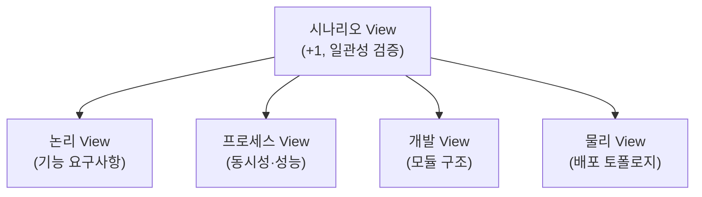
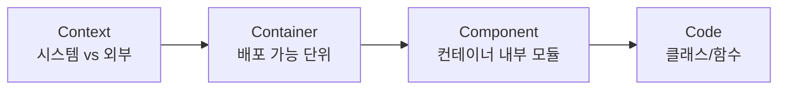
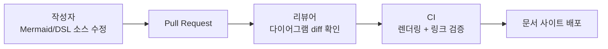

05장에서 성능·확장성·가용성 같은 품질 속성을 어떻게 식별하고 트레이드오프를 분석하는지 다뤘다면, 이 장은 그렇게 내린 아키텍처 결정을 어떻게 남겨서 다른 사람이 재현·검증·수정할 수 있게 만드는가를 다룬다. 좋은 아키텍처가 있어도 그것이 설계자의 머릿속에만 있다면 조직 전체에는 존재하지 않는 것과 같다 — 팀원이 바뀌고 시간이 지나면 "왜 이렇게 만들었는가"라는 질문에 답할 수 있는 사람이 사라지고, 후임자는 같은 트레이드오프를 다시 검토하거나(비용 낭비) 원래 이유를 모른 채 구조를 무너뜨린다(리스크). 아키텍처 문서화는 그림을 예쁘게 그리는 기술이 아니라, 의사결정과 그 근거를 시간이 지나도 검증 가능한 형태로 보존하는 규율이다.

## 이 장을 읽기 전에

**완전한 초보자?** 이 장은 [05장: 품질 속성과 아키텍처](/post/software-architecture/quality-attributes-and-architecture/)에서 다룬 성능·확장성·가용성 같은 품질 속성 개념을 전제로 한다. 아키텍처 결정이 이런 품질 속성 사이의 트레이드오프에서 나온다는 것을 이미 안다면, "그 결정을 어떻게 기록하고 전달하는가"로 자연스럽게 넘어올 수 있다. UML 다이어그램을 그려본 경험이 없어도 무방하다 — 이 장에서 다루는 표기법 대부분은 UML보다 단순한 상자와 화살표다.

**이 장의 깊이**: 이 장은 **초급~중급**을 주로 다루되, "실전 적용"과 "언제 무엇을 쓸지" 절에서는 조직 차원의 문서화 파이프라인을 설계하는 **실무자 수준**까지 다룬다. **다루지 않는 것**: 작성된 아키텍처가 요구사항을 실제로 만족하는지 체계적으로 검증하는 절차(ATAM 같은 평가 방법론)는 다음 장인 [07장: 아키텍처 평가와 분석](/post/software-architecture/architecture-evaluation-and-analysis/)에서 다루고, 조직 전체의 문서화 거버넌스·표준 강제는 이 시리즈의 후반부(엔터프라이즈 아키텍처 관리)에서 다룬다.

## 당신의 수준에 맞는 경로

| 수준 | 읽을 부분 | 핵심 목표 |
|------|---------|---------|
| 초보자 | "왜 문서화하는가" ~ "C4 모델" | 문서화의 두 목적을 이해하고 C4로 시스템을 4단계로 그릴 수 있다 |
| 중급자 | "결정을 기록하기" ~ "표준과 템플릿" | ADR로 결정 근거를 남기고 표준·템플릿·방법론의 층위를 구분할 수 있다 |
| 전문가 | "실전 적용" ~ "언제 무엇을 쓸지" | Documentation as Code 파이프라인을 설계하고 상황별로 도구 조합을 선택할 수 있다 |

---

## 왜 문서화하는가: 목적과 청중

아키텍처 문서화의 목적은 두 가지로 나뉜다. 첫째는 **구조의 전달**이다 — 시스템이 어떤 요소들로 구성되고 그것들이 어떻게 관계 맺는지를, 그 시스템을 처음 보는 사람도 알 수 있게 만드는 것이다. 둘째는 **결정의 보존**이다 — 왜 그 구조를 선택했는지, 어떤 대안을 검토했고 왜 기각했는지를 기록하는 것이다. 이 둘은 서로 다른 실패 양상을 낳는다. 구조 문서가 없으면 신규 인력이 코드를 역공학해야 하고, 결정 기록이 없으면 이미 검토하고 기각한 대안을 몇 년 뒤 다시 제안하고 다시 기각하는 일을 반복하게 된다.

랄프 존슨(Ralph Johnson)은 이 "무엇을 문서화할 것인가"의 핵심을 다음과 같이 표현했다고 마틴 파울러가 인용한다.

> "Architecture is about the important stuff. Whatever that is." — Ralph Johnson, Martin Fowler, "On Architecture" (martinfowler.com/architecture)에서 인용

이 정의가 함의하는 바는 문서화할 "중요한 것"이 프로젝트마다 다르다는 것이다. 결제 시스템에서는 트랜잭션 일관성 전략이 중요한 것이고, 실시간 게임 서버에서는 지연시간 예산이 중요한 것이다. 좋은 아키텍처 문서는 모든 것을 그리지 않고, 그 프로젝트에서 되돌리기 비싼 결정만 선별해서 남긴다.

문서의 청중도 하나가 아니다. 신규 개발자는 전체 그림과 온보딩 경로가 필요하고, 운영팀은 배포 토폴로지와 장애 대응 정보가 필요하며, 비즈니스 이해관계자는 시스템이 무엇을 하는지와 제약이 무엇인지가 필요하다. 하나의 다이어그램으로 이 세 청중을 모두 만족시키려 하면 대개 아무도 만족시키지 못한다 — 세부 수준을 청중별로 나누어 제공해야 한다는 문제의식이, 다음 두 절에서 다룰 4+1 뷰 모델과 C4 모델이 공통으로 풀려는 문제다.

## 4+1 뷰 모델: 관점으로 복잡성 나누기

필립 크루흐텐(Philippe Kruchten)은 1995년 IEEE Software에 발표한 논문 "Architectural Blueprints — The '4+1' View Model of Software Architecture"에서, 하나의 다이어그램으로 아키텍처 전체를 표현하려는 시도가 왜 실패하는지를 지적했다. 논리적 구조, 실행 시 동시성, 코드 모듈 구성, 물리적 배포는 서로 다른 관심사이고 서로 다른 표기법을 요구하는데, 이를 한 장에 욱여넣으면 어느 관심사도 명확하게 드러나지 않는다는 것이다. 그가 제안한 해법은 각 관심사를 독립된 뷰로 분리하고, 시나리오라는 다섯 번째 요소로 그 뷰들이 서로 모순 없이 맞아떨어지는지 검증하는 것이었다. 당시 크루흐텐은 Rational Software(훗날 IBM에 인수)에 있었고, 이 모델은 이후 RUP(Rational Unified Process)의 표준 아키텍처 문서화 방식으로 채택되었다.

4+1 뷰 모델의 핵심 메커니즘은 "뷰(view)"가 독립적인 별개 문서가 아니라 **같은 시스템을 보는 서로 다른 투영(projection)**이라는 점이다. 논리 뷰가 "주문은 고객에 속한다"는 도메인 관계를 그린다면, 프로세스 뷰는 그 주문 처리가 몇 개의 스레드·프로세스에 걸쳐 동시에 실행되는지를 그린다 — 같은 Order 개념이지만 답하는 질문이 다르다. 개발 뷰는 그 Order 클래스가 어떤 모듈·패키지에 속하고 어떤 컴파일 단위로 빌드되는지를, 물리 뷰는 그 모듈이 배포될 때 어떤 서버·컨테이너에 올라가는지를 그린다. 마지막으로 시나리오(+1)는 "고객이 주문을 취소한다"처럼 구체적인 유스케이스를 골라, 그 시나리오를 실행했을 때 네 개 뷰에서 그린 요소들이 실제로 앞뒤가 맞는지 — 논리 뷰의 취소 로직이 프로세스 뷰의 트랜잭션 경계 안에 들어가는지, 물리 뷰의 서버가 그 트랜잭션을 감당할 수 있는지 — 를 확인하는 역할을 한다. 즉 시나리오 뷰는 별도의 다이어그램이 아니라 나머지 네 뷰에 대한 **일관성 테스트**에 가깝다.

| 뷰 | 다루는 관심사 | 주 대상 독자 | 대표 표기법 |
|---|---|---|---|
| 논리(Logical) | 기능 요구사항, 도메인 개념 간 관계 | 최종 사용자, 분석가 | 클래스 다이어그램, 상태 다이어그램 |
| 프로세스(Process) | 동시성, 성능, 가용성 | 시스템 통합자 | 시퀀스·액티비티 다이어그램 |
| 개발(Development) | 모듈·패키지·빌드 단위 구성 | 프로그래머, 관리자 | 컴포넌트·패키지 다이어그램 |
| 물리(Physical) | 하드웨어 매핑, 배포 토폴로지 | 시스템 엔지니어 | 배포 다이어그램 |
| 시나리오(+1) | 앞 네 뷰의 일관성 검증 | 전체 이해관계자 | 유스케이스, 시나리오 서술 |



이 다이어그램에서 화살표는 "시나리오가 각 뷰를 검증하는 방향"을 나타낸다 — 시나리오를 먼저 그리고 나머지 뷰를 유도하는 것이 아니라, 이미 그린 네 뷰를 시나리오로 훑으며 빠뜨린 부분이나 모순을 찾는 순서가 실무에 가깝다. 다만 실무에서 다섯 개 뷰를 모두, 매 프로젝트마다 격식 있는 문서로 만드는 경우는 드물다 — 이 오해는 뒤의 "자주 하는 오해" 절에서 다시 짚는다.

## C4 모델: 확대·축소로 세부 수준 관리하기

사이먼 브라운(Simon Brown)은 2000년대 후반 소프트웨어 아키텍처를 가르치면서 UML의 표현력과 팀의 실제 필요 사이의 간극을 좁히려는 시도에서 C4 모델의 뿌리를 만들었다. c4model.com 공식 FAQ에 따르면 그 뿌리는 2006~2009년경으로 거슬러 올라가고, Context·Container·Component·Class라는 네 다이어그램 유형이 2010년 초에 명명되었으며, "C4"라는 이름 자체는 2011년 초에 처음 쓰였다. 이후 2015~2016년 사이 "Class" 레벨의 이름이 소스 코드 구조 전반을 포괄하는 "Code"로 바뀌었다. 이 시기는 애자일 진영이 UML을 "무겁고 실제 코드와 동기화되지 않는 도구"로 여겨 등을 돌리던 때였고, C4는 UML을 완전히 대체하려 한 것이 아니라 UML과 4+1 뷰 모델의 개념을 단순화해 개발자가 직접 그리고 이해하기 쉽게 만드는 것을 목표로 했다.

C4 모델의 메커니즘은 4+1처럼 서로 다른 관심사를 병렬로 나열하는 대신, **하나의 관심사(시스템 구조)를 확대·축소(zoom) 배율만 바꿔가며 4단계로 본다**는 점에서 다르다. Context 다이어그램은 시스템을 하나의 상자로 뭉뚱그리고 사용자·외부 시스템과의 관계만 보여준다. Container 다이어그램은 그 상자를 열어 웹 애플리케이션, API, 데이터베이스, 메시지 큐처럼 독립적으로 배포 가능한 단위를 드러낸다. Component 다이어그램은 다시 컨테이너 하나를 열어 그 안의 주요 모듈(컨트롤러, 서비스, 리포지터리)을 보여주고, Code 다이어그램은 그 컴포넌트 하나를 클래스 다이어그램 수준까지 확대한다. 각 단계에서 표기법은 동일하다 — 상자(요소)와 화살표(관계)뿐이며, UML의 스테레오타입이나 다중성 표기 같은 복잡한 규칙을 요구하지 않는다.



| 기준 | 4+1 뷰 모델 | C4 모델 |
|---|---|---|
| 추상화 축 | 관심사(논리/프로세스/개발/물리) | 확대 배율(Context→Container→Component→Code) |
| 표기법 | UML 권장(클래스·시퀀스·배포 다이어그램) | 상자+화살표, UML 불필요 |
| 탄생 시기·맥락 | 1995년, RUP/Rational | 2006~2011년, 애자일 팀의 UML 회의론 |
| 도구 생태계 | Enterprise Architect 등 UML 툴 | Structurizr(DSL), PlantUML, Mermaid |
| 적합 규모 | 대규모, 다수 이해관계자, 격식 있는 프로젝트 | 마이크로서비스·애자일 팀, 개발자 중심 |

두 모델은 경쟁 관계가 아니라 서로 다른 축을 다룬다는 점에서 병행 사용도 가능하다. 예를 들어 C4의 Container 다이어그램을 4+1의 개발 뷰 대용으로 쓰고, 프로세스 뷰나 물리 뷰는 C4에 없는 관점이므로 필요할 때만 별도로 추가하는 식이다.

## 결정을 기록하기: Architecture Decision Record

4+1과 C4는 모두 시스템의 **구조**를 그리는 방법이지, **왜 그 구조를 선택했는가**를 남기는 방법이 아니다. 마이클 나이가드(Michael Nygard)는 2011년 블로그 글 "Documenting Architecture Decisions"에서 이 공백을 지적하며 Architecture Decision Record(ADR)를 제안했다. ADR은 "구조적으로 의미 있는(architecturally significant)" 결정 — 시스템의 구조, 비기능 특성, 의존성, 인터페이스, 구현 기법에 영향을 주는 결정 — 하나당 짧은 문서 하나를 남기는 방식이다. 형식은 크리스토퍼 알렉산더의 패턴 언어를 참고해, 결정에 작용한 힘(forces)과 그에 대한 응답인 결정을 짝짓는 구조를 취한다.

ADR의 메커니즘에서 중요한 것은 두 가지다. 첫째, 문서를 별도 위키가 아니라 **소스 코드와 같은 버전 관리 저장소**(`docs/adr/` 같은 경로)에 Markdown으로 둔다 — 코드 리뷰와 같은 절차(Pull Request)로 결정 자체를 리뷰하고, 커밋 이력으로 결정이 언제 왜 바뀌었는지 추적할 수 있게 하기 위해서다. 둘째, ADR은 한 번 쓰면 끝나는 문서가 아니라 **상태(status)를 갖는다** — proposed, accepted, deprecated, superseded 같은 상태를 명시해, 나중에 다른 ADR이 이전 결정을 뒤집었을 때 "이 문서가 최신인가"를 독자가 스스로 추측하지 않게 한다. 이는 앞서 본 4+1·C4 다이어그램에는 기본적으로 없는 시간 축 정보다.

```markdown
# ADR-0007: 주문 서비스와 결제 서비스 사이 통신에 동기 REST 대신 이벤트를 쓴다

## 상태
Accepted (2026-03-02, ADR-0012에 의해 결제 재시도 정책 일부 대체됨)

## 맥락
결제 게이트웨이의 P99 응답 시간이 2초를 넘는 경우가 월 평균 3%
발생한다. 동기 REST 호출로 주문 확정을 기다리면 그 지연이
주문 API 전체로 전파되어 05장에서 정한 응답 시간 목표(P95 500ms)를
위반한다.

## 검토한 대안
1. 동기 REST + 타임아웃 단축: 실패율만 늘어날 뿐 근본 해결 안 됨
2. 동기 REST + 회로 차단기: 지연은 줄지만 순간 처리량 손실
3. 비동기 이벤트(선택): 주문 확정과 결제 확인을 분리

## 결정
주문 서비스는 결제 요청 이벤트를 발행하고, 결제 서비스가 비동기로
처리 후 결과 이벤트를 발행한다. 주문은 "결제 대기" 상태로 즉시 응답한다.

## 결과
- (+) 주문 API 응답 시간이 결제 게이트웨이 지연과 분리된다
- (-) 최종 일관성 모델을 도입해야 하고, UI에 "결제 대기" 상태 표시 필요
- (-) 이벤트 유실 시 보상 트랜잭션(Saga) 설계가 추가로 필요하다
```

나이가드의 원안은 최소 형식만 규정했고, 이후 커뮤니티가 이를 확장한 **MADR**(Markdown Architectural Decision Records) 템플릿이 널리 쓰인다. 맥락·검토한 대안·결정·결과(consequences) 섹션을 표준화해, 여러 팀이 같은 틀로 결정을 비교할 수 있게 한다.

## 표준과 템플릿: ISO/IEC/IEEE 42010과 arc42

4+1과 C4가 다이어그램을 그리는 방법이라면, 이 절에서 다루는 두 가지는 "문서 전체가 무엇을 담아야 하는가"를 규정하는 상위 규범이다. 국제 표준 ISO/IEC/IEEE 42010은 2000년 IEEE 1471로 처음 제정된 뒤 2007년 ISO/IEC 42010으로, 2011년과 2022년 두 차례 개정을 거쳐 현재 형태에 이르렀다. 이 표준은 특정 표기법이나 다이어그램 유형을 강제하지 않는다. 대신 아키텍처 기술(Architecture Description)이 만족해야 할 최소 요건 — 이해관계자(stakeholder)와 그들의 관심사(concern)를 식별하고, 그 관심사에 대응하는 뷰포인트(viewpoint)와 뷰(view)를 정의하며, 뷰 간 일관성과 결정의 근거(rationale)를 남겨야 한다는 개념 모델을 규정한다. 즉 4+1과 C4는 이 표준이 요구하는 개념 모델을 실제로 구현하는 방법론 중 두 가지이고, 표준 자체는 "이해관계자의 관심사를 빠짐없이 다루라"는 상위 요구만 제시한다.

표준이 개념 모델을 규정한다면, arc42는 그 개념 모델을 실제로 채울 수 있는 **문서 목차 템플릿**이다. 게르노트 스타르케(Gernot Starke)와 페터 흐루슈카(Peter Hruschka)가 만들어 오픈소스 라이선스로 무료 배포하는 arc42는, 도입과 목표부터 제약사항·컨텍스트·솔루션 전략·빌딩 블록 뷰·런타임 뷰·배포 뷰·횡단 개념·아키텍처 결정·품질 요구사항·리스크와 기술 부채·용어집까지 절 단위로 문서 뼈대를 고정한다. 여기서 "빌딩 블록 뷰"와 "런타임 뷰"는 각각 C4의 Container·Component 다이어그램, 4+1의 프로세스 뷰로 채울 수 있다 — arc42는 목차를, C4·4+1은 그 목차 안의 그림을 제공하는 셈이다. arc42가 금융·의료·임베디드 같은 규제 산업 프로젝트에서 특히 자주 쓰이는 이유는, 산출물 목록이 미리 정해져 있어 "무엇을 문서화해야 하는가"를 매번 새로 논쟁하지 않아도 되기 때문이다.

| 절 | 무엇을 채우는가 |
|---|---|
| 1. 도입과 목표 | 요구사항 개요, 품질 목표, 이해관계자 |
| 2. 제약사항 | 기술적·조직적 제약 |
| 3. 컨텍스트와 범위 | 시스템 경계, 외부 인터페이스(C4 Context에 대응) |
| 4. 솔루션 전략 | 핵심 기술 결정의 요약 |
| 5. 빌딩 블록 뷰 | 모듈 분해(C4 Container/Component에 대응) |
| 6. 런타임 뷰 | 시나리오별 동작(4+1 프로세스 뷰에 대응) |
| 7. 배포 뷰 | 인프라 매핑(4+1 물리 뷰에 대응) |
| 8. 횡단 개념 | 로깅, 보안, 예외 처리 등 공통 정책 |
| 9. 아키텍처 결정 | ADR을 모아 두는 절 |
| 10. 품질 요구사항 | 05장에서 다룬 품질 속성 시나리오 |
| 11. 리스크와 기술 부채 | 알려진 위험, 부채 목록 |
| 12. 용어집 | 도메인 용어 정의 |

## 실전 적용: Documentation as Code

지금까지 다룬 방법론이 공유하는 실무 문제는 하나다 — 다이어그램과 문서는 만드는 순간부터 낡기 시작한다는 것이다. 별도 도구(오피스 문서, 위키, 이미지 파일)로 그린 다이어그램은 코드가 바뀌어도 자동으로 갱신되지 않고, 코드 리뷰 절차에도 편입되지 않는다. 시릴 마르트레르(Cyrille Martraire)는 저서 『Living Documentation: Continuous Knowledge Sharing by Design』(Addison-Wesley, 2019)에서 "문서가 진실의 원천(source of truth)에서 분리되는 순간 부패하기 시작한다"는 관점을 제시하고, 문서를 코드·데이터에서 자동으로 파생시키거나 코드와 같은 저장소·리뷰·빌드 파이프라인에 태워 함께 진화시키는 접근을 제안한다. 이 발상을 다이어그램에 적용한 것이 **Documentation as Code**(줄여서 Docs as Code)다: 다이어그램을 이미지가 아니라 Mermaid·PlantUML·Structurizr DSL 같은 **텍스트 소스**로 작성하고, 그 텍스트를 소스 코드와 같은 Git 저장소에 두어 Pull Request로 리뷰하고, CI가 빌드 시점에 렌더링해 최신 이미지를 문서 사이트에 배포한다.



이 파이프라인에서 리뷰어가 보는 것은 완성된 이미지가 아니라 **텍스트 diff**라는 점이 핵심이다. "Container 하나가 추가됐다"는 변경이 코드 리뷰처럼 몇 줄의 diff로 드러나므로, 이미지 두 장을 나란히 놓고 무엇이 바뀌었는지 눈으로 찾는 것보다 리뷰 비용이 훨씬 낮다. Structurizr는 이 접근을 C4 모델에 특화해 제공하는 도구로, 하나의 모델 정의에서 Context·Container 등 여러 다이어그램을 동시에 생성한다.

```text
workspace "전자상거래 시스템" "C4 모델을 코드로 표현한 예시" {

    model {
        customer = person "고객"
        ecommerceSystem = softwareSystem "전자상거래 시스템" {
            webApp = container "웹 애플리케이션" "주문 UI" "React"
            api = container "주문 API" "REST API" "Spring Boot"
            database = container "주문 데이터베이스" "PostgreSQL"

            webApp -> api "주문 요청"
            api -> database "읽기/쓰기"
        }
        paymentGateway = softwareSystem "결제 게이트웨이" "외부 시스템"

        customer -> webApp "주문, 조회"
        api -> paymentGateway "결제 처리"
    }

    views {
        systemContext ecommerceSystem {
            include *
            autoLayout
        }
        container ecommerceSystem {
            include *
            autoLayout
        }
    }
}
```

이 30줄 안 되는 텍스트 하나에서 Structurizr는 Context 다이어그램과 Container 다이어그램을 **모두** 자동 생성한다. 다이어그램을 손으로 두 번 그릴 필요가 없고, `webApp`과 `api` 사이의 관계를 텍스트에서 한 번만 선언하면 두 다이어그램 모두에 반영된다 — 이것이 architecture-as-code가 손으로 그린 4+1·C4 다이어그램보다 유지보수 가능한 핵심 이유다. 다만 이 방식의 한계도 명확하다: 모델을 코드로 표현하는 규율 자체가 팀에 새로운 학습 비용이고, DSL 문법 오류는 다이어그램이 아예 생성되지 않는 방식으로만 드러나므로 CI에서 렌더링 실패를 빌드 실패로 처리하는 게이트가 필요하다.

## 자주 하는 오해

**"다이어그램은 많을수록, 세밀할수록 좋다"** — 세부 수준을 높이면 정확성이 높아진다고 여기기 쉽지만, 청중이 필요로 하지 않는 세부는 갱신 부담만 늘리고 결국 가장 먼저 낡는다. Context 다이어그램 한 장이 정확하게 유지되는 편이, Code 다이어그램 수십 장이 절반쯤 낡아 있는 것보다 낫다. C4가 4단계로 나눈 이유도 "이 청중에게는 이 배율까지만 보여주면 충분하다"는 판단을 강제하기 위해서다.

**"C4는 UML을 완전히 대체한다"** — c4model.com FAQ가 직접 밝히듯, C4는 UML과 4+1의 개념을 단순화한 것이지 UML을 금지하는 것이 아니다. 실제로 Code 레벨에서는 클래스 다이어그램처럼 UML 표기를 그대로 쓰는 경우가 흔하다. C4가 바꾼 것은 "모든 레벨에 UML의 완전한 표기 규칙을 강제하는 관행"이지 UML이라는 표기법 자체가 아니다.

**"아키텍처 문서는 초기에 한 번 작성하면 끝난다"** — 4+1·C4 다이어그램은 구조가 바뀌면 함께 바뀌어야 하는 살아있는 산출물이고, ADR은 애초에 "이 결정은 나중에 상태가 바뀔 수 있다"는 전제로 설계됐다(status 필드). 문서화를 일회성 산출물로 취급하면, 시스템이 진화한 뒤 문서는 실제 구조를 오히려 오도하는 자료로 남는다 — 낡은 문서는 문서가 없는 것보다 나쁠 수 있다.

## 언제 무엇을 쓸지

| 상황 | 권장 도구 | 이유 |
|---|---|---|
| 여러 팀·수십 명 이해관계자가 있는 대형·규제 프로젝트 | 4+1 뷰 모델 + arc42 | 관심사별 뷰 분리와 표준 목차가 격식 있는 승인·감사 절차에 맞는다 |
| 마이크로서비스 여러 개, 애자일 팀 | C4 모델(+ Structurizr/Mermaid) | 개발자가 직접 그리고 갱신하기 쉬운 단순 표기 |
| 되돌리기 비싼 기술 선택(DB, 프레임워크, 프로토콜) | ADR | 결정과 대안·근거를 가볍지만 영구적으로 남긴다 |
| 팀 5명 이하, 단일 배포 단위인 초기 스타트업 | Context 다이어그램 1장 + README | 과도한 문서화 오버헤드가 개발 속도보다 비용이 큰 단계 |
| 계약·규제 요건으로 표준 산출물이 요구되는 경우 | ISO/IEC/IEEE 42010 준수 확인 + arc42 | 감사 시 표준 요건 충족을 객관적으로 증명해야 한다 |

이 표의 반대 방향도 성립한다. 팀이 3명이고 서비스가 하나뿐인 초기 스타트업이 arc42의 12개 절을 모두 채우려 하면, 문서화 자체가 새 기능 개발보다 큰 비용이 된다. 이런 경우에는 Context 다이어그램 한 장과 ADR 몇 개로 시작하고, 팀과 시스템이 커진 뒤에 arc42나 4+1로 확장하는 편이 낫다. 반대로 규제 산업에서 "일단 코드로 문서를 대신하자"는 접근은 감사 요건을 만족하지 못해 나중에 훨씬 큰 비용으로 되돌아온다.

## 학습 성과 평가 기준

- [ ] 아키텍처 문서화의 두 목적(구조 전달과 결정 보존)이 왜 서로 다른 실패 양상을 낳는지 설명할 수 있는가?
- [ ] 4+1 뷰 모델의 네 뷰와 시나리오(+1)가 각각 어떤 관심사를 다루고, 시나리오가 왜 "검증" 역할을 하는지 설명할 수 있는가?
- [ ] C4 모델의 4단계가 "관심사 분리"가 아니라 "확대·축소"라는 하나의 축임을 4+1과 대비해 설명할 수 있는가?
- [ ] ADR을 실제로 작성해 결정·대안·근거·상태를 기록할 수 있는가?
- [ ] ISO/IEC/IEEE 42010, arc42, 4+1·C4가 각각 "표준-템플릿-방법론" 중 어느 층위에 있는지 구분할 수 있는가?
- [ ] 프로젝트 규모·규제 요건·팀 성숙도에 따라 문서화 도구 조합을 선택하고, 언제 과잉 문서화를 피해야 하는지 판단할 수 있는가?

## 다음 장에서는

07장 **「아키텍처 평가와 분석」**에서는 이 장에서 만든 문서(4+1 뷰, C4 다이어그램, ADR)를 입력으로 삼아, 그 아키텍처가 실제로 품질 속성 요구사항을 만족하는지 ATAM 같은 방법론으로 체계적으로 검증하는 절차를 다룬다. 이 장이 "결정을 어떻게 남기는가"였다면, [다음 장](/post/software-architecture/architecture-evaluation-and-analysis/)은 "그 결정이 옳았는지 어떻게 확인하는가"를 다룬다.

## 참고 및 출처

- Philippe Kruchten, "Architectural Blueprints — The '4+1' View Model of Software Architecture," *IEEE Software* 12(6), 1995, pp. 42-50.
- Simon Brown, [C4 Model 공식 사이트 FAQ](https://c4model.com/faq) — C4 모델의 역사와 UML·4+1과의 관계
- Simon Brown, [Structurizr](https://structurizr.com/) — C4 모델의 참조 구현 도구
- Gernot Starke & Peter Hruschka, [arc42 템플릿](https://arc42.org/)
- Michael Nygard, ["Documenting Architecture Decisions"](https://cognitect.com/blog/2011/11/15/documenting-architecture-decisions) (2011)
- ADR 커뮤니티, [MADR (Markdown Architectural Decision Records)](https://adr.github.io/madr/)
- ["ISO/IEC 42010"](https://en.wikipedia.org/wiki/ISO/IEC_42010), Wikipedia — IEEE 1471에서 ISO/IEC/IEEE 42010으로의 표준화 과정 개요
- Cyrille Martraire, 『Living Documentation: Continuous Knowledge Sharing by Design』(Addison-Wesley, 2019)
