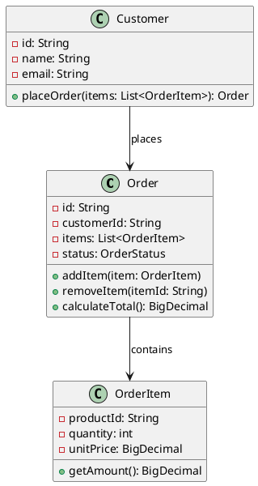
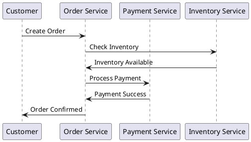
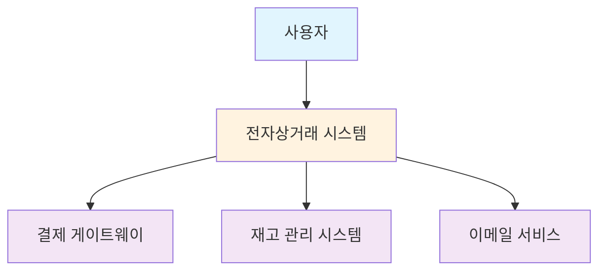
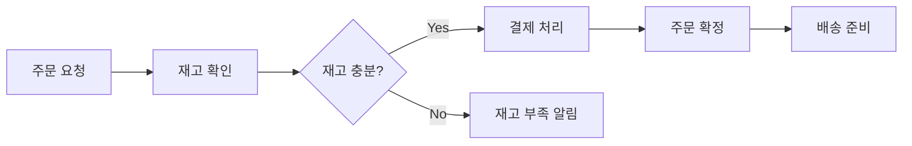
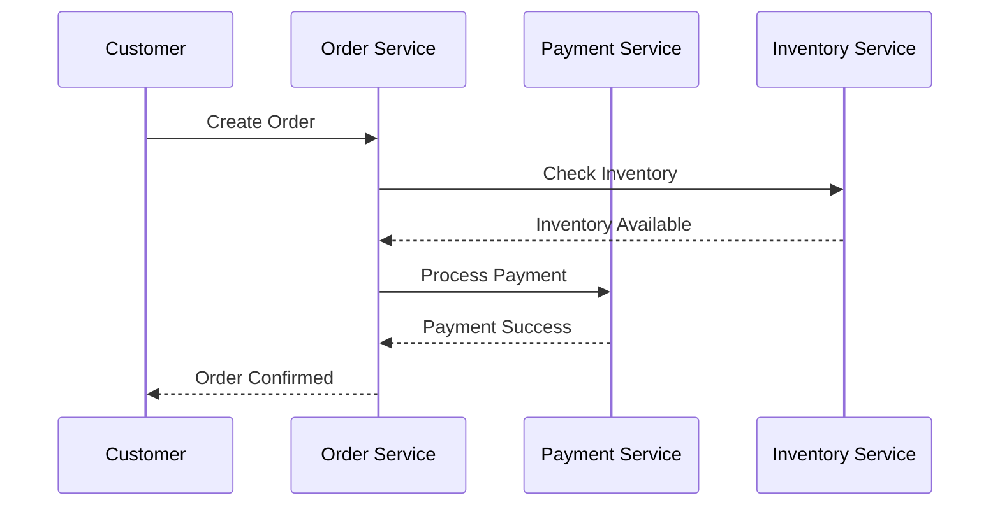

# 6장. 아키텍처 문서화

## 📋 학습 목표
- 아키텍처 문서화의 목적과 중요성을 이해한다
- 4+1 뷰 모델과 C4 모델의 활용법을 습득한다
- 효과적인 아키텍처 다이어그램 작성 기법을 학습한다
- 현대적 문서화 도구와 기법의 실무 적용 방법을 파악한다

---

## 6.1 아키텍처 문서화의 중요성

### 6.1.1 문서화가 필요한 이유

#### 이해관계자 간 소통
- **개발팀**: 구현 가이드라인과 설계 의도 공유
- **운영팀**: 배포 및 모니터링 정보 제공
- **비즈니스 팀**: 시스템 기능과 제약사항 이해
- **신규 구성원**: 시스템 이해를 위한 온보딩 자료

#### 의사결정 기록
- **설계 근거**: 왜 이런 선택을 했는지 기록
- **트레이드오프**: 고려된 대안과 선택 이유
- **제약사항**: 기술적, 비즈니스적 제약 조건
- **가정사항**: 설계 시 전제 조건들

### 6.1.2 좋은 아키텍처 문서의 특징

#### 명확성과 간결성
- **목적 지향적**: 문서의 목적과 대상 독자 명확
- **적절한 추상화**: 독자에게 맞는 상세 수준
- **시각적 표현**: 다이어그램과 텍스트의 조화
- **최신성 유지**: 시스템 변경에 따른 문서 업데이트

---

## 6.2 4+1 뷰 모델

### 6.2.1 4+1 뷰 모델 개요

Philippe Kruchten이 제안한 4+1 뷰 모델은 소프트웨어 아키텍처를 5개의 서로 다른 관점에서 문서화하는 방법입니다.

#### 5가지 뷰
1. **논리적 뷰 (Logical View)**: 기능적 요구사항
2. **개발 뷰 (Development View)**: 소프트웨어 구조
3. **프로세스 뷰 (Process View)**: 동적 측면
4. **물리적 뷰 (Physical View)**: 배포 구조
5. **시나리오 (+1)**: 일관성 검증

### 6.2.2 각 뷰별 상세 설명

#### 논리적 뷰 (Logical View)
- **목적**: 시스템의 기능적 요구사항 표현
- **대상**: 최종 사용자, 분석가
- **표현 방법**: 클래스 다이어그램, 상태 다이어그램



#### 개발 뷰 (Development View)
- **목적**: 개발자 관점에서의 시스템 구조
- **대상**: 프로그래머, 소프트웨어 관리자
- **표현 방법**: 컴포넌트 다이어그램, 패키지 다이어그램

```
┌─────────────────────────────────────┐
│           Web Layer                 │
│  ┌─────────────┐ ┌─────────────┐   │
│  │ Controllers │ │ REST APIs   │   │
│  └─────────────┘ └─────────────┘   │
└─────────────────────────────────────┘
┌─────────────────────────────────────┐
│         Service Layer               │
│  ┌─────────────┐ ┌─────────────┐   │
│  │ Business    │ │ Domain      │   │
│  │ Services    │ │ Services    │   │
│  └─────────────┘ └─────────────┘   │
└─────────────────────────────────────┘
┌─────────────────────────────────────┐
│        Repository Layer             │
│  ┌─────────────┐ ┌─────────────┐   │
│  │ JPA         │ │ External    │   │
│  │ Repositories│ │ API Clients │   │
│  └─────────────┘ └─────────────┘   │
└─────────────────────────────────────┘
```

#### 프로세스 뷰 (Process View)
- **목적**: 동적 측면의 시스템 동작
- **대상**: 시스템 통합자
- **표현 방법**: 시퀀스 다이어그램, 액티비티 다이어그램



#### 물리적 뷰 (Physical View)
- **목적**: 하드웨어 매핑과 배포 구조
- **대상**: 시스템 엔지니어
- **표현 방법**: 배포 다이어그램

```
┌─────────────────┐    ┌─────────────────┐
│   Load Balancer │    │   Web Server    │
│   (Nginx)       │◄───┤   (Tomcat)      │
└─────────────────┘    └─────────────────┘
                                │
                       ┌─────────────────┐
                       │  Database       │
                       │  (PostgreSQL)   │
                       └─────────────────┘
```

---

## 6.3 C4 모델

### 6.3.1 C4 모델 개요

Simon Brown이 제안한 C4 모델은 계층적 추상화를 통해 소프트웨어 아키텍처를 4개 레벨로 표현합니다.

#### 4가지 레벨
1. **Context**: 시스템 전체 맥락
2. **Container**: 고수준 기술 구성요소
3. **Component**: 컨테이너 내부 구조
4. **Code**: 구현 레벨 상세

### 6.3.2 각 레벨별 상세 설명

#### Level 1: Context Diagram
```
┌─────────────────────────────────────────────────────────┐
│                System Context                           │
│                                                         │
│    [Customer]                                          │
│        │                                               │
│        │ Places orders, views history                  │
│        ▼                                               │
│  ┌─────────────────┐                                   │
│  │   E-commerce    │ ──────► [Payment Gateway]         │
│  │     System      │                                   │
│  └─────────────────┘                                   │
│        │                                               │
│        │ Sends emails                                  │
│        ▼                                               │
│  [Email Service]                                       │
│                                                         │
└─────────────────────────────────────────────────────────┘
```

#### Level 2: Container Diagram
```java
// Container 레벨 구성 요소 정의
public class EcommerceSystemContainers {
    
    // Web Application Container
    @Component
    public class WebApplication {
        // Spring Boot 애플리케이션
        // 사용자 인터페이스 제공
        // REST API 엔드포인트
    }
    
    // Database Container
    @Component
    public class Database {
        // PostgreSQL 데이터베이스
        // 주문, 상품, 고객 데이터 저장
    }
    
    // Message Queue Container
    @Component
    public class MessageQueue {
        // RabbitMQ 메시지 큐
        // 비동기 이벤트 처리
    }
}
```

#### Level 3: Component Diagram
```java
// 주요 컴포넌트 구조
@RestController
public class OrderController {
    // 주문 관련 HTTP 요청 처리
}

@Service
public class OrderService {
    // 주문 비즈니스 로직
}

@Repository
public class OrderRepository {
    // 주문 데이터 접근
}

@Component
public class EmailNotificationService {
    // 이메일 알림 처리
}
```

---

## 6.4 효과적인 다이어그램 작성법

### 6.4.1 다이어그램 설계 원칙

#### 목적 명확성
- **What**: 무엇을 보여주려고 하는가?
- **Who**: 누가 이 다이어그램을 볼 것인가?
- **Why**: 왜 이 다이어그램이 필요한가?

#### 일관성 유지
- **표기법 통일**: 같은 요소는 같은 방식으로 표현
- **색상 체계**: 의미 있는 색상 사용
- **레이아웃**: 논리적 흐름에 따른 배치

### 6.4.2 다이어그램 유형별 가이드

#### 시스템 컨텍스트 다이어그램


#### 데이터 플로우 다이어그램


---

## 6.5 현대적 문서화 도구

### 6.5.1 코드 기반 다이어그램 도구

#### PlantUML
```plantuml
@startuml
!define AWSPUML https://raw.githubusercontent.com/awslabs/aws-icons-for-plantuml/v14.0/dist
!includeurl AWSPUML/AWSCommon.puml
!includeurl AWSPUML/ApplicationIntegration/APIGateway.puml
!includeurl AWSPUML/Compute/Lambda.puml
!includeurl AWSPUML/Database/DynamoDB.puml

APIGateway(api, "API Gateway", "RESTful API")
Lambda(lambda, "Lambda Function", "Order Processing")
DynamoDB(db, "DynamoDB", "Order Data")

api --> lambda
lambda --> db
@enduml
```

#### Mermaid


### 6.5.2 Architecture as Code

#### Structurizr (C4 Model)
```java
// Structurizr를 활용한 C4 모델 코드화
public class EcommerceSystemDocumentation {
    
    public static void main(String[] args) {
        Workspace workspace = new Workspace("E-commerce System", "Online shopping platform");
        Model model = workspace.getModel();
        
        // 사람과 시스템 정의
        Person customer = model.addPerson("Customer", "Online shopper");
        SoftwareSystem ecommerceSystem = model.addSoftwareSystem("E-commerce System", "Online shopping platform");
        SoftwareSystem paymentGateway = model.addSoftwareSystem("Payment Gateway", "Processes payments");
        
        // 관계 정의
        customer.uses(ecommerceSystem, "Places orders");
        ecommerceSystem.uses(paymentGateway, "Processes payments");
        
        // 뷰 생성
        ViewSet views = workspace.getViews();
        SystemContextView contextView = views.createSystemContextView(ecommerceSystem, "SystemContext", "System Context");
        contextView.addAllSoftwareSystems();
        contextView.addAllPeople();
        
        // 스타일 적용
        Styles styles = views.getConfiguration().getStyles();
        styles.addElementStyle(Tags.PERSON).color("#ffffff").background("#08427b");
        styles.addElementStyle(Tags.SOFTWARE_SYSTEM).color("#ffffff").background("#1168bd");
    }
}
```

### 6.5.3 협업 도구

#### GitBook을 활용한 문서화
```markdown
# 아키텍처 문서

## 개요
이 문서는 전자상거래 시스템의 아키텍처를 설명합니다.

## 시스템 컨텍스트


## API 문서


Create Order



새로운 주문을 생성합니다.






고객 ID



주문 항목 목록







주문 생성 성공


```json
{
  "orderId": "order-123",
  "status": "CREATED",
  "totalAmount": 29.99
}
```




```

---

## 6.6 문서 유지보수 전략

### 6.6.1 Living Documentation

#### 코드와 문서의 동기화
```java
// 테스트 코드를 활용한 문서화
@Test
@DisplayName("주문 생성 시 재고가 부족하면 예외가 발생한다")
void shouldThrowExceptionWhenInsufficientInventory() {
    // Given
    CreateOrderRequest request = new CreateOrderRequest("customer1", "product1", 100);
    when(inventoryService.getAvailableQuantity("product1")).thenReturn(10);
    
    // When & Then
    assertThatThrownBy(() -> orderService.createOrder(request))
        .isInstanceOf(InsufficientInventoryException.class)
        .hasMessage("재고가 부족합니다. 요청: 100, 가용: 10");
}
```

#### 자동화된 문서 생성
```yaml
# GitHub Actions를 활용한 자동 문서화
name: Generate Documentation

on:
  push:
    branches: [main]

jobs:
  generate-docs:
    runs-on: ubuntu-latest
    steps:
    - uses: actions/checkout@v2
    
    - name: Generate PlantUML diagrams
      uses: cloudbees/plantuml-github-action@master
      with:
        args: -v -tsvg docs/diagrams/*.puml
    
    - name: Build GitBook
      run: |
        npm install -g gitbook-cli
        gitbook build
    
    - name: Deploy to GitHub Pages
      uses: peaceiris/actions-gh-pages@v3
      with:
        github_token: ${{ secrets.GITHUB_TOKEN }}
        publish_dir: ./_book
```

### 6.6.2 문서 품질 관리

#### 문서 리뷰 체크리스트
- [ ] 목적과 대상 독자가 명확한가?
- [ ] 다이어그램이 최신 상태인가?
- [ ] 용어 정의가 일관되고 명확한가?
- [ ] 예제 코드가 실행 가능한가?
- [ ] 외부 링크가 유효한가?

#### 문서 메트릭 측정
```javascript
// 문서 품질 메트릭 수집
const documentationMetrics = {
  coverageRate: calculateCoverageRate(), // 문서화 커버리지
  freshnessScore: calculateFreshnessScore(), // 최신성 점수
  readabilityIndex: calculateReadabilityIndex(), // 가독성 지수
  linkValidityRate: checkExternalLinks() // 링크 유효성
};

function calculateCoverageRate() {
  const totalModules = getModuleCount();
  const documentedModules = getDocumentedModuleCount();
  return (documentedModules / totalModules) * 100;
}
```

---

## 🎯 핵심 요약

### 아키텍처 문서화 모델 비교

| **모델** | **강점** | **적용 시나리오** | **도구 지원** |
|---------|---------|-----------------|-------------|
| **4+1 뷰** | 포괄적 관점 제공 | 대규모 엔터프라이즈 시스템 | UML 도구 |
| **C4 모델** | 계층적 추상화 | 마이크로서비스, 클라우드 | Structurizr, PlantUML |
| **Arc42** | 템플릿 기반 | 독일/유럽 프로젝트 | AsciiDoc, Confluence |

### 도구 선택 가이드

1. **간단한 다이어그램**: Draw.io, Lucidchart
2. **코드 기반**: PlantUML, Mermaid
3. **협업 중심**: Miro, Figma
4. **엔터프라이즈**: Enterprise Architect, Sparx Systems

---

## 💭 생각해보기

1. 현재 프로젝트에서 가장 효과적인 문서화 방법은 무엇일까?
2. 코드와 문서의 동기화를 어떻게 자동화할 수 있을까?
3. 이해관계자별로 다른 문서가 필요한 이유는 무엇인가?

---

## 📚 추가 학습 자료

### 도서
- "Software Architecture in Practice" - SEI 시리즈
- "The C4 Model for Software Architecture" - Simon Brown
- "Living Documentation" - Cyrille Martraire

### 온라인 자료
- C4 Model 공식 웹사이트
- PlantUML 공식 문서
- arc42 템플릿
- Structurizr 튜토리얼 