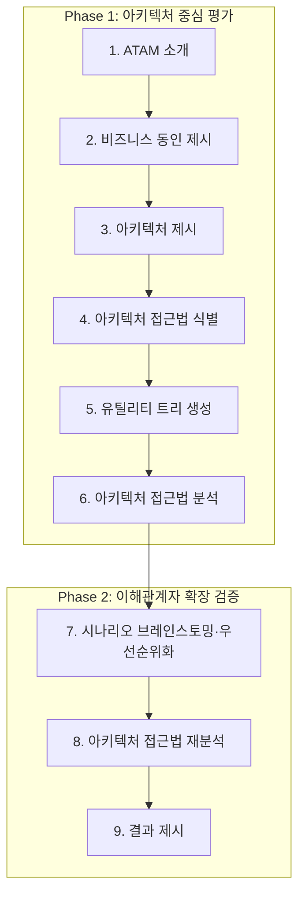
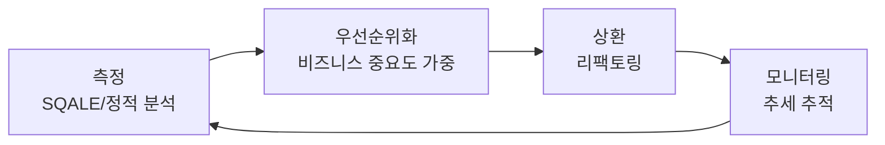

06장에서 4+1 뷰, C4 다이어그램, ADR로 아키텍처 결정을 문서로 남기는 방법을 다뤘다면, 이 장은 그렇게 남긴 결정이 실제로 옳았는지 체계적으로 검증하는 절차를 다룬다. 아키텍처 문서가 아무리 정교해도, 그 안의 결정이 05장에서 정의한 품질 속성 요구사항(예: P95 응답 시간 500ms, 가용성 99.9%)을 실제로 만족시키는지는 문서 자체와는 별개의 질문이다. 평가는 그 질문에 답하기 위해 전문가의 직관을 정해진 절차와 산출물로 구조화하는 규율이며, 코드를 많이 쓰기 전에 값비싼 실수를 걸러내는 것을 목표로 한다.

## 이 장을 읽기 전에

**완전한 초보자?** 이 장은 [05장: 품질 속성과 아키텍처](/post/software-architecture/quality-attributes-and-architecture/)에서 다룬 품질 속성 시나리오 개념과 [06장: 아키텍처 문서화](/post/software-architecture/architecture-documentation/)에서 다룬 ADR·4+1 뷰·C4 다이어그램을 전제로 한다. "왜 이 구조를 선택했는가"를 문서로 남기는 방법을 이미 안다면, "그 선택이 옳았는지 어떻게 검증하는가"로 자연스럽게 이어질 수 있다. 통계나 재무 지식은 필요 없다 — 이 장에서 다루는 비용-편익 계산은 사칙연산 수준이다.

**이 장의 깊이**: 이 장은 **중급~전문가**를 주로 다룬다. ATAM·CBAM 같은 형식적 평가 방법론은 어느 정도 아키텍처 설계 경험이 있어야 실감 나게 이해되기 때문이다. "기술 부채 관리 전략"과 "언제 무엇을 쓸지" 절에서는 조직 차원의 평가 거버넌스를 설계하는 **실무자 수준**까지 다룬다. **다루지 않는 것**: 이 장은 평가 프로세스 자체를 다루며, 평가를 통과한 아키텍처를 실제 대규모 시스템에서 어떻게 구현했는지의 구체적 사례는 다음 장인 [08장: 실무 사례 연구](/post/software-architecture/practical-case-studies/)에서 다룬다. 정적 분석 도구의 세부 룰 튜닝 같은 도구 사용법도 이 장의 범위 밖이다.

## 당신의 수준에 맞는 경로

| 수준 | 읽을 부분 | 핵심 목표 |
|------|---------|---------|
| 초보자 | "왜 평가하는가" ~ "ATAM의 메커니즘" | 평가가 왜 필요한지 이해하고 유틸리티 트리로 시나리오를 우선순위화할 수 있다 |
| 중급자 | "비용과 편익을 저울질하기" ~ "기술 부채 관리 전략" | CBAM으로 투자 우선순위를 정하고 기술 부채를 정량적으로 측정·관리할 수 있다 |
| 전문가 | "자주 하는 오해" ~ "언제 무엇을 쓸지" | 평가 방법론의 한계를 알고 조직 규모·리스크 수준에 맞게 평가 프로세스를 설계할 수 있다 |

---

## 왜 평가하는가: 위험과 비용의 경제학

아키텍처 평가는 설계된 아키텍처가 요구사항, 특히 05장에서 다룬 품질 속성 요구사항을 실제로 만족할 수 있는지 체계적으로 점검하는 활동이다. 여기서 "체계적"이라는 말이 중요하다 — 회의실에서 몇몇 시니어 엔지니어가 다이어그램을 보고 "괜찮아 보인다"고 합의하는 것은 평가가 아니라 의견 교환에 가깝다. 평가는 정해진 절차와 산출물 형식을 통해, 다른 평가자가 같은 아키텍처를 다시 보더라도 비슷한 결론에 도달할 수 있도록 재현 가능성을 확보하려는 시도다.

평가를 설계 단계, 즉 코드를 아직 많이 쓰지 않은 시점에 수행하는 이유는 결함을 고치는 비용이 발견 시점에 따라 달라지기 때문이다. 배리 보엠(Barry Boehm)은 저서 『Software Engineering Economics』(Prentice Hall, 1981)에서, 요구사항·설계 단계에서 발견한 결함을 고치는 비용이 이미 배포된 시스템에서 같은 결함을 고치는 비용보다 훨씬 작다는 것을 소프트웨어 공학 경제학의 핵심 논거 중 하나로 제시했다. 정확한 배율은 프로젝트 성격과 측정 방법에 따라 다르고 이후 연구에서 논쟁의 대상이 되어 왔지만, "늦게 발견할수록 고치는 비용이 커진다"는 정성적 방향 자체는 아키텍처 평가를 설계 단계에 배치해야 하는 이유로 폭넓게 받아들여진다. 뒤에서 다룰 ATAM이 코드 작성 전, 아키텍처 문서만으로 평가를 수행하도록 설계된 것도 이 때문이다.

평가는 시점과 성격이라는 두 축으로 나뉜다. 시점으로는 설계 단계의 사전 검증, 개발 중 설계 준수 여부 확인, 운영 단계의 실측 기반 평가로 나뉘며, 뒤로 갈수록 데이터는 정확해지지만 문제를 고치는 비용도 함께 커진다. 성격으로는 전문가 판단과 시나리오 토론에 의존하는 정성적 평가와, 메트릭·부하 테스트·정적 분석 도구의 수치에 의존하는 정량적 평가로 나뉜다. 이 장 앞부분에서 다루는 ATAM·CBAM은 정성적 평가에 가깝다 — 시나리오와 이해관계자의 토론이 핵심 입력이다. 반면 뒷부분에서 다루는 기술 부채 측정은 정량적 평가에 가깝다. 실무에서는 이 둘을 배타적으로 고르지 않고, ATAM으로 아키텍처 수준의 큰 위험을 먼저 걸러낸 뒤 정적 분석 도구로 코드 수준의 세부 문제를 지속적으로 추적하는 식으로 병행한다.

## SAAM에서 ATAM까지: 시나리오 기반 평가의 계보

체계적인 소프트웨어 아키텍처 평가 방법론의 출발점은 1994년으로 거슬러 올라간다. 릭 카즈만(Rick Kazman), 렌 배스(Len Bass), 그레고리 아보우드(Gregory Abowd), 마이크 웹(Mike Webb)은 ICSE 1994에서 발표한 논문 "SAAM: A Method for Analyzing the Properties of Software Architectures"에서, 문서화된 최초의 아키텍처 분석 방법론인 SAAM(Software Architecture Analysis Method)을 제안했다. SAAM의 메커니즘은 단순하다 — 평가하려는 품질 속성(주로 변경용이성)을 구체적인 과업(task) 시나리오로 표현하고, 그 시나리오를 아키텍처 위에서 하나씩 "걸어보며(walk through)" 얼마나 많은 컴포넌트를 건드려야 하는지 추적하는 것이다. 시나리오 하나를 수행하는 데 여러 모듈을 가로질러 수정해야 한다면, 그 아키텍처는 해당 변경 유형에 취약하다고 판단한다.

SAAM은 변경용이성이라는 단일 품질 속성에 초점을 맞췄고, 성능과 보안처럼 서로 충돌하는 여러 속성 사이의 상충 관계는 다루지 않았다. 이 공백을 메우기 위해 카즈만은 마크 클라인(Mark Klein), 마리오 바르바치(Mario Barbacci), 톰 롱스태프(Tom Longstaff), 하워드 립슨(Howard Lipson), 제로미 캐리어(Jeromy Carriere)와 함께 1998년 SEI(Software Engineering Institute, 카네기멜론대학교 산하 연구소) 기술 보고서 "The Architecture Tradeoff Analysis Method"(CMU/SEI-98-TR-008)에서 ATAM(Architecture Tradeoff Analysis Method)을 발표했다. ATAM은 SAAM의 시나리오 기반 접근을 계승하면서, 성능을 높이면 보안이 나빠지고 가용성을 높이면 비용이 늘어나는 것처럼 품질 속성 사이의 상충 관계를 명시적으로 드러내는 것을 목표로 삼았다 — 이름의 "Tradeoff"가 가리키는 지점이다.

## ATAM의 메커니즘: 유틸리티 트리와 9단계 프로세스

ATAM이 시나리오를 다루는 방식은 막연한 문장("시스템은 빨라야 한다")이 아니라, 렌 배스·폴 클레먼츠·릭 카즈만의 소프트웨어 아키텍처 실무 표준 교재가 정의한 6요소 구조를 따른다: 자극의 출처(stimulus source), 자극(stimulus), 환경(environment), 대상 아티팩트(artifact), 응답(response), 응답 측정치(response measure)다. 이 구조를 갖추면 "빨라야 한다" 대신 검증 가능한 문장이 된다.

```text
품질 속성: 성능
자극 출처: 최종 사용자
자극: 주문 제출 요청 발생
환경: 블랙프라이데이 피크 트래픽(초당 1,000건)
대상 아티팩트: 주문 API
응답: 요청을 큐에 적재하고 비동기로 처리
응답 측정치: P95 응답 시간 500ms 이내
```

이렇게 정의한 시나리오는 수십~수백 개까지 쏟아질 수 있으므로, ATAM은 이해관계자들이 시나리오를 품질 속성별로 묶고 비즈니스 중요도(H/M/L)와 구현 난이도(H/M/L)로 우선순위를 매기는 유틸리티 트리(utility tree)를 만든다. 중요도와 난이도가 모두 높은(H, H) 시나리오가 평가 시간을 가장 많이 투입해야 할 대상이다 — 중요하지만 쉬운 시나리오는 이미 검증된 패턴으로 처리되는 경우가 많고, 중요하지 않은 시나리오는 난이도와 무관하게 우선순위가 낮다.

| 품질 속성 | 세부 관심사 | 시나리오 | 중요도 | 난이도 |
|---|---|---|---|---|
| 성능 | 피크 시간 응답 지연 | 블랙프라이데이 초당 1,000건 주문, P95 500ms 이내 응답 | H | H |
| 가용성 | 결제 게이트웨이 장애 | 결제 API 30초 무응답 시 대체 결제 수단 제공 | H | M |
| 변경용이성 | 신규 결제 수단 추가 | 신규 PG 연동을 2주 내 배포 | M | L |
| 보안 | 개인정보 유출 방지 | 저장된 카드 정보는 항상 암호화 상태 유지 | H | L |

우선순위가 매겨진 시나리오를 손에 쥐면, ATAM은 정해진 9단계 프로세스로 진행된다. 1~6단계(Phase 1)는 평가팀이 아키텍처 결정을 소개받고 유틸리티 트리를 만들어 핵심 아키텍처 접근법을 분석하는 과정이고, 7~9단계(Phase 2)는 더 넓은 이해관계자 그룹을 초청해 시나리오를 추가로 브레인스토밍하고 분석을 재검증한 뒤 결과를 전달하는 과정이다. 두 단계로 나뉜 이유는 소수의 핵심 인원으로 먼저 뼈대를 만든 뒤, 그 뼈대를 더 많은 관점(운영팀, 보안팀, 비즈니스 이해관계자)으로 스트레스 테스트하기 위해서다.



9단계를 거쳐 ATAM이 최종적으로 산출하는 것은 합격·불합격 같은 점수가 아니라 네 가지 범주의 발견물이다. 위험(risk)은 특정 품질 속성에 미래에 문제를 일으킬 수 있는 아키텍처 결정이고, 비위험(non-risk)은 위험해 보이지만 분석 결과 현재 가정 아래서는 안전하다고 판단된 결정이다. 민감점(sensitivity point)은 하나의 품질 속성 응답에 결정적인 영향을 미치는 컴포넌트나 설정값이다 — 예를 들어 메시지 큐의 배치 크기를 늘리면 처리량은 좋아지지만 지연시간은 나빠진다면, 배치 크기는 처리량에 대한 민감점이다. 트레이드오프점(tradeoff point)은 같은 값이 둘 이상의 품질 속성에 서로 다른 방향으로 영향을 미치는 지점이다 — 위 예시에서 배치 크기는 처리량과 지연시간 모두의 민감점이므로 동시에 트레이드오프점이기도 하다. 이 네 산출물이 평가팀이 아키텍처 다이어그램 자체보다 실질적으로 넘겨주는 결과물이다.

## 비용과 편익을 저울질하기: CBAM

ATAM은 위험과 트레이드오프를 드러내지만, "이 위험을 완화하는 데 예산을 얼마나 써야 하는가"라는 질문에는 답하지 않는다. 카즈만은 자이 아순디(Jai Asundi), 마크 클라인과 함께 2001년 ICSE에서 발표한 논문 "Quantifying the Costs and Benefits of Architectural Decisions"에서, ATAM의 산출물을 경제적 의사결정으로 확장하는 CBAM(Cost Benefit Analysis Method)을 제안했다.

CBAM의 메커니즘은 ATAM 유틸리티 트리에서 이미 우선순위가 매겨진 시나리오를 출발점으로 삼는다. 각 아키텍처 개선 전략(예: 캐시 계층 추가, 비동기 큐 도입)에 대해, 그 전략을 적용했을 때 시나리오의 응답 수준이 얼마나 개선되는지를 이해관계자 투표로 효용(utility) 점수로 환산하고, 서로 다른 품질 속성 간 효용을 비교 가능하게 정규화한다. 여기에 시나리오의 비즈니스 중요도 가중치를 곱해 편익(benefit)을 산출하고, 그 전략을 구현하는 데 드는 공수를 비용(cost)으로 추정한다. 편익을 비용으로 나눈 비용-편익 비율이 높은 전략부터 예산이 소진될 때까지 순서대로 채택하는 것이 CBAM의 최종 산출물이다.

| 아키텍처 개선 전략 | 편익(효용 점수) | 비용(개발 공수, 인주) | 편익/비용 비율 |
|---|---|---|---|
| 결제 API 앞단 캐시 계층 도입 | 80 | 4 | 20.0 |
| 비동기 메시지 큐 도입 | 120 | 8 | 15.0 |
| 전체 데이터베이스 샤딩 | 60 | 12 | 5.0 |

위 수치는 CBAM의 산출 절차를 보여주기 위한 예시이며, 실제 효용 점수와 공수는 조직·시스템마다 다르게 산정된다. 이 표에서 캐시 계층 도입이 데이터베이스 샤딩보다 4배 높은 비율을 보이는 것은, 같은 예산이면 캐시 계층을 먼저 채택하는 편이 합리적이라는 것을 뜻하지, 샤딩이 필요 없다는 뜻은 아니다 — 예산이 남으면 다음 순위로 샤딩을 채택하면 된다.

## 평가 방법론 비교

SAAM·ATAM·CBAM 세 방법론은 서로 대체재가 아니라 계보를 이루는 보완재에 가깝다. SAAM이 단일 품질 속성을 빠르게 점검하는 경량 도구라면, ATAM은 여러 품질 속성의 상충 관계까지 다루도록 SAAM을 확장한 것이고, CBAM은 ATAM이 찾아낸 위험 중 무엇에 먼저 투자할지 정하는 경제적 계층을 그 위에 얹은 것이다.

| 방법론 | 창시자·연도 | 초점 | 적합 상황 |
|---|---|---|---|
| SAAM | Kazman, Bass, Abowd, Webb(1994) | 단일 품질 속성(주로 변경용이성) 검증 | 소규모 시스템, 빠른 예비 평가 |
| ATAM | Kazman, Klein 외(1998, SEI) | 여러 품질 속성 간 트레이드오프 식별 | 대규모·다수 이해관계자 시스템 |
| CBAM | Kazman, Asundi, Klein(2001) | 개선 전략의 비용-편익 비교 | 제한된 예산에서 투자 우선순위 결정 |

## 기술 부채: 은유의 탄생과 오늘의 측정

"기술 부채(technical debt)"라는 은유는 워드 커닝엄(Ward Cunningham)이 1992년 OOPSLA에서 발표한 경험 보고서 "The WyCash Portfolio Management System"에서 처음 등장했다고 알려져 있다. 당시 그는 금융 포트폴리오 관리 시스템을 Smalltalk로 개발하며, 아직 완전히 다듬어지지 않은 코드를 먼저 출시하고 이후 이해가 깊어지면 다시 작성하는 접근을 상사에게 설득해야 했다. 그는 이를 금전적 부채에 비유해 설명했다.

> "Shipping first time code is like going into debt. A little debt speeds development so long as it is paid back promptly with a rewrite.... The danger occurs when the debt is not repaid." — Ward Cunningham, "The WyCash Portfolio Management System," OOPSLA 1992 Experience Report

커닝엄이 이후 인터뷰에서 밝힌 바에 따르면, 그가 원래 의도한 "부채"는 지저분한 코드 자체가 아니라 "아직 완전하지 않은 도메인 이해"를 반영한 코드였다 — 나쁜 코드를 정당화하는 개념이 아니라, 이해가 진화하면 코드도 그에 맞춰 다시 써야 한다는 반복 개발의 논리였다. 이 원래 의미와 오늘날 널리 쓰이는 "아무렇게나 짠 코드"라는 의미 사이의 간극은 뒤의 "자주 하는 오해"에서 다시 짚는다.

부채가 비유를 넘어 관리 대상이 되려면 측정 가능해야 한다. 장루이 르투제(Jean-Louis Letouzey)가 제안한 SQALE(Software Quality Assessment based on Lifecycle Expectations) 모델은, 정적 분석 도구가 찾아낸 코드 이슈 각각에 "이 이슈를 고치는 데 걸리는 예상 시간(remediation cost)"을 매기고, 이를 전체 이슈에 대해 합산해 부채의 원금(principal)을 시간 단위로 산출한다. 이 원금을 전체 코드를 처음부터 새로 작성하는 데 드는 예상 개발 비용으로 나누면 기술 부채 비율(Technical Debt Ratio, TDR)이 나온다.

```text
TDR(%) = (전체 이슈 수정 예상 시간 / 전체 코드 개발 예상 시간) × 100
```

SonarQube는 SQALE 모델을 자사의 부채 계산 방식으로 채택해, TDR을 등급(A~E)으로 변환해 보여준다 — TDR이 5% 미만이면 A, 50%를 넘으면 E로 분류하는 식이다(정확한 임계값은 SonarQube의 버전·설정에 따라 달라질 수 있다). 이 등급은 "이 코드베이스를 새로 만드는 비용 대비 지금까지 쌓인 빚이 몇 퍼센트인가"라는 하나의 숫자로 요약해, 개발자가 아닌 관리자와도 같은 언어로 우선순위를 논의할 수 있게 한다는 것이 SQALE의 원래 동기다.

## 기술 부채 관리 전략

기술 부채 관리는 크게 네 가지 활동으로 나뉜다. 예방은 코딩 표준·코드 리뷰·지속적 통합처럼 애초에 부채가 쌓이는 속도를 늦추는 활동이고, 측정은 SQALE 같은 모델과 정적 분석 도구로 부채의 규모를 지속적으로 추적하는 활동이다. 우선순위화는 측정된 부채 항목 중 무엇을 먼저 갚을지 정하는 활동인데, 여기서 앞서 다룬 유틸리티 트리의 사고방식이 그대로 재사용된다 — TDR 숫자만으로는 어떤 코드가 비즈니스에 정말 위험한지 알 수 없으므로, "이 코드가 자주 변경되는 결제 로직인가, 아니면 거의 건드리지 않는 배치 스크립트인가"라는 비즈니스 중요도를 함께 고려해야 한다. 마지막으로 거버넌스는 이 세 활동이 일회성 이벤트로 끝나지 않도록 정기 모니터링과 팀 교육을 제도화하는 활동이다.



최근에는 이 거버넌스를 자동화하는 방향으로 적합도 함수(fitness function) 개념이 확산되고 있다. 닐 포드(Neal Ford)·레베카 파슨스(Rebecca Parsons)·팻 쿠아(Pat Kua)는 『Building Evolutionary Architectures』(O'Reilly, 2017)에서, 진화 컴퓨팅의 적합도 함수 개념을 빌려 계층 의존 방향이나 순환 참조 금지 같은 아키텍처 특성을 자동화된 테스트로 검증하고 CI 파이프라인에 편입시키는 접근을 제안했다. 이는 이 장에서 다룬 ATAM·SQALE의 "사람이 주기적으로 평가하는" 모델을 "기계가 커밋마다 검증하는" 모델로 확장한 것에 가깝다 — 다만 적합도 함수 자체의 설계와 도구는 이 시리즈의 다른 장에서 더 다룰 주제다.

## 자주 하는 오해

**"ATAM은 아키텍처에 합격·불합격 점수를 매기는 감사(audit)다"** — 실제로 ATAM의 산출물은 점수가 아니라 위험·비위험·민감점·트레이드오프점이라는 네 범주의 목록이다. ATAM 세션이 끝났다고 "이 아키텍처는 80점"이라는 숫자가 나오지 않는다. 평가팀의 역할은 판정이 아니라, 이해관계자들이 미처 발견하지 못한 위험을 드러내고 그 위험을 어떻게 다룰지 결정할 수 있게 돕는 것이다.

**"기술 부채는 항상 게으르거나 실력이 부족해서 생긴다"** — 마틴 파울러(Martin Fowler)는 2009년 블로그 글 "TechnicalDebtQuadrant"(martinfowler.com/bliki)에서 부채를 신중함(prudent/reckless)과 의도성(deliberate/inadvertent)이라는 두 축으로 나눴다. 마감을 맞추기 위해 알면서도 지름길을 택하는 "신중하고 의도적인" 부채는 정당한 전략적 선택일 수 있다. 커닝엄의 원래 의도도 실력 부족이 아니라 이해의 진화를 반영한 것이었다는 점은 앞서 짚은 대로다.

**"정적 분석 도구가 보여주는 부채 비율(%)이 곧 리팩토링 우선순위다"** — SQALE의 TDR은 코드를 다시 짜는 데 드는 시간만 계산할 뿐, 그 코드가 비즈니스에 미치는 영향은 반영하지 않는다. TDR이 높은 모듈이라도 거의 변경되지 않는 배치 스크립트라면 급하지 않고, TDR이 낮더라도 자주 변경되는 결제 로직의 작은 결함은 훨씬 위험할 수 있다. "기술 부채 관리 전략"에서 다룬 대로, 측정치는 비즈니스 중요도와 함께 봐야 의미가 있다.

## 언제 무엇을 쓸지

| 상황 | 권장 접근 | 이유 |
|---|---|---|
| 여러 이해관계자, 되돌리기 비싼 아키텍처 결정 | ATAM 풀 프로세스 | 품질 속성 간 트레이드오프를 공식적으로 드러내고 합의를 만든다 |
| 제한된 예산에서 여러 개선안 중 선택 | CBAM | 비용-편익 비율로 투자 순서를 객관화한다 |
| 팀 5명 이하, 빠른 예비 점검 | 경량 시나리오 워크스루(SAAM 방식) | 형식적 절차 없이 핵심 변경 시나리오만 걸어본다 |
| 코드베이스 건강도를 지속적으로 추적 | SQALE 기반 정적 분석(SonarQube 등) | 사람이 매번 회의를 소집하지 않아도 자동으로 측정된다 |
| 신생 스타트업, 아키텍처가 자주 바뀌는 초기 단계 | 공식 평가 생략, 코드 리뷰로 대체 | 형식적 평가의 준비 비용이 얻는 가치보다 클 수 있다 |

이 표의 반대 방향도 성립한다. 팀이 3명뿐인 초기 스타트업이 매 스프린트마다 ATAM 9단계를 전부 수행하면 평가 준비 자체가 개발 속도를 갉아먹는다. 반대로 금융·의료처럼 규제 대상 시스템에서 평가를 생략하고 감으로 결정하면, 나중에 감사에서 결정 근거를 제시하지 못해 훨씬 큰 비용을 치른다.

## 학습 성과 평가 기준

- [ ] 아키텍처 평가를 설계 단계에 배치해야 하는 경제적 근거를 설명할 수 있는가?
- [ ] 6요소 품질 속성 시나리오를 직접 작성하고, 유틸리티 트리로 시나리오의 우선순위를 매길 수 있는가?
- [ ] ATAM의 9단계 프로세스와 위험·비위험·민감점·트레이드오프점 네 산출물의 차이를 설명할 수 있는가?
- [ ] CBAM으로 여러 개선 전략의 비용-편익 비율을 계산하고 투자 순서를 정할 수 있는가?
- [ ] 기술 부채의 원래 은유와 SQALE 기반 정량 측정(TDR)의 관계, 그리고 측정치만으로는 우선순위를 정할 수 없는 이유를 설명할 수 있는가?
- [ ] 조직 규모·이해관계자 수·규제 요건에 따라 SAAM·ATAM·CBAM·경량 리뷰 중 무엇을 선택할지 판단할 수 있는가?

## 다음 장에서는

08장 <strong>「실무 사례 연구」</strong>에서는 이 장에서 다룬 평가 방법론과 기술 부채 관리 전략이 실제 대규모 시스템에서 어떻게 적용되는지, 그리고 평가를 소홀히 했을 때 어떤 실패로 이어지는지를 구체적 사례로 살펴본다. 이 장이 "아키텍처가 옳은지 어떻게 확인하는가"였다면, [다음 장](/post/software-architecture/practical-case-studies/)은 "실제로 그 확인을 거친(혹은 거치지 않은) 시스템은 어떻게 되었는가"를 다룬다.

## 참고 및 출처

- Rick Kazman, Len Bass, Gregory Abowd, Mike Webb, "SAAM: A Method for Analyzing the Properties of Software Architectures," *Proceedings of the 16th International Conference on Software Engineering* (ICSE), 1994, pp. 81-90.
- Rick Kazman, Mark Klein, Mario Barbacci, Tom Longstaff, Howard Lipson, Jeromy Carriere, ["The Architecture Tradeoff Analysis Method"](https://www.sei.cmu.edu/library/the-architecture-tradeoff-analysis-method/), CMU/SEI-98-TR-008, Software Engineering Institute, 1998.
- Rick Kazman, Jai Asundi, Mark Klein, "Quantifying the Costs and Benefits of Architectural Decisions," *Proceedings of the 23rd International Conference on Software Engineering* (ICSE), 2001.
- ["Architecture Tradeoff Analysis Method"](https://en.wikipedia.org/wiki/Architecture_tradeoff_analysis_method), Wikipedia — ATAM 9단계 프로세스 개요
- Barry Boehm, 『Software Engineering Economics』(Prentice Hall, 1981)
- Ward Cunningham, "The WyCash Portfolio Management System," OOPSLA 1992 Experience Report — 인용문 출처는 ["Technical debt"](https://en.wikipedia.org/wiki/Technical_debt), Wikipedia에서 대조
- Martin Fowler, ["TechnicalDebtQuadrant"](https://martinfowler.com/bliki/TechnicalDebtQuadrant.html) (2009)
- Freddy Mallet, ["SQALE, the ultimate Quality Model to assess Technical Debt"](https://www.sonarsource.com/blog/sqale-the-ultimate-quality-model-to-assess-technical-debt/), SonarSource Blog, 2010
- Neal Ford, Rebecca Parsons, Patrick Kua, 『Building Evolutionary Architectures』(O'Reilly, 2017)
