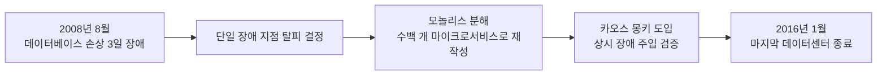
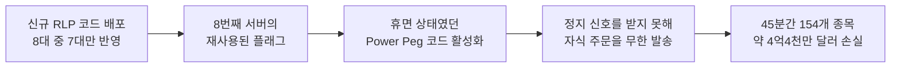

07장에서는 ATAM·CBAM으로 아키텍처 결정을 평가하는 절차와, SQALE로 기술 부채를 측정·관리하는 방법을 다뤘다. 이 장은 그 평가와 측정이 실제로 무엇을 예방하고 무엇을 놓치는지를 대규모 시스템의 실제 궤적을 통해 확인한다. 다만 사례 연구는 아키텍처 서적에서 가장 오용되기 쉬운 형식이기도 하다 — 성공한 회사의 기술 선택을 나열하면 독자는 "저 회사가 했으니 우리도 하면 된다"는 인과관계를 섣불리 추론하기 쉽고, 실패 사례는 사후 확신 편향(hindsight bias) 때문에 "당연히 그렇게 될 수밖에 없었다"는 식으로 단순화되기 쉽다. 이 장은 1차 자료로 검증된 세 가지 사례 — 넷플릭스의 7년에 걸친 클라우드 마이그레이션, 마틴 파울러(Martin Fowler)가 정식화한 스트랭글러 파사드 패턴의 레거시 현대화, 나이트 캐피털(Knight Capital)의 45분짜리 배포 참사 — 와 그 반대 방향의 결정을 보여주는 반례 하나를 함께 살펴보고, 그 사실에서 어떤 결론을 끌어내도 되고 어떤 결론은 과잉 일반화인지를 구분하는 데 초점을 맞춘다.

## 이 장을 읽기 전에

**완전한 초보자?** 이 장은 [07장: 아키텍처 평가와 분석](/post/software-architecture/architecture-evaluation-and-analysis/)에서 다룬 ATAM·CBAM 평가 절차와 SQALE 기반 기술 부채 측정을 전제로 한다. 그 장이 "아키텍처가 옳은지 어떻게 판단하는가"의 절차를 다뤘다면, 이 장은 그 판단이 실제 대규모 시스템의 궤적과 어떻게 맞아떨어지거나 어긋났는지를 구체적 사례로 확인한다. 04장에서 다룬 마이크로서비스·클라우드 네이티브의 기본 개념을 알고 있으면 더 매끄럽게 읽히지만 필수는 아니다 — 이 장에서 필요한 개념은 각 사례 안에서 다시 설명한다.

**이 장의 깊이**: 이 장은 **초급~전문가**를 폭넓게 다룬다. 사례를 비판적으로 읽는 방법(인과와 상관의 구분, 생존자 편향)은 배경지식 없이도 따라갈 수 있는 초급 내용이고, "언제 무엇을 쓸지"에서 조직 맥락별 판단 기준을 세우는 부분은 실무 경험이 있어야 체감되는 **전문가** 수준이다. **다루지 않는 것**: 이 장은 실제로 일어난 일과 그 인과 메커니즘에 집중하며, 레거시를 어떤 도메인 경계로 나눌지의 설계 방법론은 [09장: DDD 기초](/post/software-architecture/ddd-strategic-design-fundamentals/)에서, 분산 시스템의 데이터 일관성 이론은 12장(분산 시스템 아키텍처)에서, 클라우드 인프라의 구체적 구현(컨테이너·오케스트레이션)은 13장(클라우드 네이티브 아키텍처)에서 각각 다룬다.

## 당신의 수준에 맞는 경로

| 수준 | 읽을 부분 | 핵심 목표 |
|------|---------|---------|
| 초보자 | "사례 연구를 읽는 법" ~ "레거시 현대화: 스트랭글러 파사드 패턴" | 사례를 성급히 일반화하지 않는 법과 스트랭글러 패턴의 기본 라우팅 메커니즘을 이해한다 |
| 중급자 | "실패 사례: 나이트 캐피털의 45분" ~ "다시 모놀리스로: 프라임 비디오의 재통합" | 실패의 인과 사슬을 재구성하고, 아키텍처 결정을 뒤집는 반례를 판단 근거로 다룰 수 있다 |
| 전문가 | "자주 하는 오해" ~ "언제 무엇을 쓸지" | 조직 맥락(규모·트래픽·규제)에 맞는 마이그레이션·현대화 전략과 배포 거버넌스를 설계할 수 있다 |

---

## 사례 연구를 읽는 법: 인과와 상관을 가르기

"넷플릭스는 마이크로서비스로 전환해 성공했다"는 문장은 사실이지만, 이 문장만으로 "마이크로서비스로 전환하면 성공한다"는 결론을 끌어내는 것은 상관관계를 인과관계로 착각하는 전형적인 오류다. 넷플릭스가 마이크로서비스로 전환하던 시기에는 동시에 수백 명의 시니어 엔지니어를 채용했고, AWS라는 이미 검증된 클라우드 인프라를 썼으며, 무엇보다 스트리밍이라는 폭발적으로 성장하는 시장에 있었다. 이 중 어느 요인이 성공에 얼마나 기여했는지는 사례 하나만으로는 분리할 수 없다.

과학 실험과 달리 기업의 아키텍처 결정에는 대조군이 없다. 넷플릭스가 마이크로서비스로 가지 않았다면 어떻게 됐을지 확인할 수 있는 "평행 우주의 넷플릭스"는 존재하지 않는다. 그래서 사례 연구를 읽을 때는 결과(무엇이 좋아졌는가)보다 메커니즘 — 그 선택이 왜 그 결과로 이어질 수밖에 없었는가의 인과 사슬 — 에 집중해야 신뢰할 수 있는 교훈을 뽑을 수 있다. 이 장의 사례들도 "이 회사가 이렇게 했다"는 서술에서 멈추지 않고, 그 결정을 강제한 구체적 제약 조건과 그 결정이 작동한 기술적 메커니즘을 먼저 짚는 순서로 다룬다.

기술 콘퍼런스와 블로그에 소개되는 사례는 성공한 회사, 그중에서도 성공을 대외적으로 알리고 싶은 회사가 압도적으로 많다. 같은 시기에 같은 기술을 도입했다가 실패했거나 조용히 되돌린 회사는 발표 자체를 하지 않으므로 통계에 잡히지 않는다 — 이를 생존자 편향(survivorship bias)이라 부른다. 이 편향을 상쇄하기 위해 이 장은 성공 사례 두 건과 나란히, 마이크로서비스를 가장 적극적으로 전도해 온 아마존이 특정 서비스에서 판단을 되돌린 사례, 그리고 배포 과정의 사소한 실수가 45분 만에 회사를 거의 파산시킨 사례를 함께 다룬다.

## 대규모 마이그레이션: 넷플릭스의 7년 클라우드 전환

넷플릭스의 클라우드 이전은 흔히 회자되는 것과 달리 처음부터 계획된 원대한 전략이 아니라, 2008년 8월 발생한 데이터베이스 손상 장애에서 촉발됐다. 유리 이즈라일렙스키(Yury Izrailevsky), 스테반 블라오비치(Stevan Vlaovic), 루슬란 메셴베르크(Ruslan Meshenberg)가 2016년 2월 넷플릭스 공식 미디어 센터에 게시한 "Completing the Netflix Cloud Migration"에 따르면, 당시 단일 데이터베이스의 손상으로 사흘간 DVD 배송 시스템이 멈췄다 — 스트리밍 서비스 이전의 넷플릭스는 여전히 우편 DVD 대여가 핵심 사업이었다. 이 장애는 단일 장애 지점(single point of failure)에 의존하는 자체 데이터센터 아키텍처의 구조적 취약성을 드러냈고, 넷플릭스는 이를 계기로 수직 확장형 대형 데이터베이스 대신 수평 분산 인프라로 옮겨가기로 결정했다.

여기서 짚어야 할 중요한 선택은 넷플릭스가 기존 시스템을 그대로 AWS 가상 머신으로 옮기는 리호스트(rehost, 흔히 "리프트 앤 시프트")를 택하지 않았다는 점이다. 위 게시물은 "we chose the cloud-native approach, rebuilding virtually all of our technology and fundamentally changing the way we operate"라고 밝힌다. 그 이유는 온프레미스 데이터센터와 퍼블릭 클라우드의 장애 모델이 근본적으로 다르기 때문이다. 자체 데이터센터에서는 하드웨어가 상대적으로 안정적이어서 장애가 드물게 발생하는 대신 발생하면 광범위하게 영향을 미치는 반면, 클라우드의 개별 가상 인스턴스는 훨씬 자주, 하지만 훨씬 국소적으로 실패하도록 설계돼 있다. 모놀리식 애플리케이션을 그대로 클라우드에 옮기면 이 잦은 국소적 실패에 대응할 방법이 없으므로, 넷플릭스는 모놀리스를 수백 개의 마이크로서비스로 분해하고 NoSQL 데이터스토어로 전환하는 재작성을 병행했다.

이 재작성 과정에서 넷플릭스가 만든 도구 중 가장 널리 알려진 것이 카오스 몽키(Chaos Monkey)다. 프로덕션 환경에서 무작위로 인스턴스를 종료시켜, 실패가 예외적 사건이 아니라 상시 발생하는 조건이라는 전제 아래 시스템이 실제로 견디는지 지속적으로 검증하는 도구였다. 카오스 몽키의 존재는 "넷플릭스가 혁신적이어서"가 아니라 "클라우드 환경에서는 개별 인스턴스 실패가 예외가 아니라 일상이므로, 그 일상을 코드 배포 전에 강제로 재현해 검증할 도구가 구조적으로 필요했기 때문"이라는 인과로 설명된다 — 앞서 다룬 "메커니즘으로 사례를 읽는다"는 원칙을 그대로 보여주는 지점이다.

마이그레이션은 2008년부터 시작해 2016년 1월 마지막 데이터센터 구성요소를 종료할 때까지 7년이 걸렸다. 그 사이 넷플릭스의 스트리밍 회원 수는 8배로 늘었다고 위 게시물은 밝히는데, 이는 클라우드 전환이 "회원 수가 늘어도 버틸 수 있는 인프라"를 미리 확보했기에 가능했던 성장이라는 해석과, 반대로 이미 성장하고 있었기 때문에 클라우드 투자를 정당화하기 쉬웠다는 해석이 모두 가능하다 — 인과와 상관을 구분해야 한다는 원칙이 이 지점에서 다시 요구된다.

## 레거시 현대화: 스트랭글러 파사드 패턴

넷플릭스 사례처럼 처음부터 클라우드에서 마이크로서비스로 시작할 수 있는 조직은 드물다. 대다수 조직은 이미 운영 중인 레거시 시스템을 손상 없이 유지하면서 점진적으로 현대화해야 한다는, 훨씬 흔하고 훨씬 제약이 많은 문제에 직면한다. 이 문제에 이름을 붙이고 구조를 제시한 사람은 마틴 파울러다. 그는 2001년 호주 퀸즐랜드 열대우림에서 스트랭글러 무화과나무(strangler fig)를 본 경험을 계기로, 2004년 자신의 블로그(bliki)에 "Strangler Application"이라는 이름으로 이 패턴을 처음 기술했다고 알려져 있다. 스트랭글러 무화과나무는 다른 나무의 틈에서 씨앗을 틔워 숙주 나무를 타고 자라며 양분을 흡수하다가, 결국 땅에 뿌리를 내리고 스스로 서게 되면 원래의 숙주 나무는 말라 죽고 무화과나무만 그 자리에 남는다. 2020년 파울러는 이름을 "Strangler Fig Application"으로 수정했는데, "strangler(교살자)"라는 표현이 주는 불필요한 폭력적 연상을 줄이고 원래 의도한 식물학적 은유를 더 분명히 하기 위해서였다.

> "Like the fig, it begins with small additions, often new features, that are built on top of, yet separate to the legacy code base. As we do this we move bits of behavior from the legacy system into the new code base." — Martin Fowler, "Strangler Fig," martinfowler.com bliki

이 메커니즘의 핵심은 파사드(facade)에 있다. 클라이언트(사용자 또는 다른 서비스)는 레거시 시스템과 신규 시스템 중 어느 쪽이 실제로 요청을 처리하는지 알 필요가 없도록, 두 시스템 앞단에 라우팅 계층을 둔다. 이 라우팅 계층이 기능 단위로 트래픽을 신규 시스템으로 조금씩 옮기면, 옮겨진 기능은 레거시 코드에서 완전히 제거할 수 있고 옮겨지지 않은 기능은 계속 레거시가 처리한다. 이 과정을 기능 단위로 반복하면 마지막에는 레거시 시스템이 처리하는 기능이 하나도 남지 않게 되어 안전하게 폐기할 수 있다.

이 방식이 "빅뱅 재작성"(레거시를 통째로 새 시스템으로 교체)보다 선호되는 이유는 위험을 시간에 걸쳐 분산시키기 때문이다. 빅뱅 재작성은 신규 시스템이 완성될 때까지 검증할 방법이 없고, 완성 시점에 레거시와 신규 시스템의 기능이 정확히 일치하는지 한 번에 확인해야 하는 부담을 진다. 반면 스트랭글러 파사드는 기능 하나를 옮길 때마다 실제 트래픽으로 검증할 수 있어, 문제가 생겨도 그 기능 하나만 롤백하면 된다. 대가는 속도다 — 레거시와 신규 시스템을 동시에 유지보수해야 하는 기간이 길게는 몇 년씩 이어질 수 있고, 파사드 계층 자체가 새로운 복잡성과 잠재적 장애 지점이 된다.

| 방식 | 위험 분산 | 검증 시점 | 유지보수 부담 |
|---|---|---|---|
| 빅뱅 재작성 | 완성 시점에 위험이 집중 | 배포 직전 일괄 검증 | 전환 기간은 짧지만 실패 시 손실이 크다 |
| 스트랭글러 파사드 | 기능 단위로 위험이 분산 | 기능마다 실제 트래픽으로 점진 검증 | 레거시·신규 병행 유지 기간이 길다 |

## 실패 사례: 나이트 캐피털의 45분

2012년 8월 1일, 미국의 마켓메이커(market maker) 나이트 캐피털 그룹(Knight Capital Group)은 뉴욕증권거래소가 새로 도입한 소매유동성프로그램(Retail Liquidity Program, RLP)에 대응하는 신규 주문 라우팅 코드를 SMARS(자동 주문 라우팅 시스템)라는 시스템의 서버 8대에 배포했다. 미국 증권거래위원회(SEC)가 2013년 10월 16일 발표한 행정 처분 명령(Release No. 70694, Administrative Proceeding File No. 3-15570)에 따르면, 배포를 맡은 기술자가 이 신규 코드를 8대 중 7대에만 정상적으로 복사했고 나머지 1대에는 복사하지 못했다 — 그리고 이를 재확인하는 2차 검토 절차가 없었기 때문에 아무도 이 누락을 알아채지 못했다.

문제는 신규 RLP 코드가 "Power Peg"라는, 2003년경부터 쓰이지 않고 방치돼 있던 옛 주문 실행 기능을 트리거하던 플래그를 재사용했다는 데 있었다. Power Peg는 원래 주가를 목표가로 밀어붙이기 위한 테스트용 주문 실행 로직으로, 부모 주문이 체결되면 자식 주문 발송을 멈추도록 하는 누적 수량 카운터를 참조했다. 그런데 이 카운터를 참조하던 코드는 2005년 무렵 다른 기능으로 이관되면서, Power Peg 코드 안에서는 더 이상 정상 작동하지 않는 채로 남아 있었다 — 죽은 코드(dead code)였지만 실제로 삭제되지는 않았다. 신규 코드가 반영되지 않은 8번째 서버는 이 죽은 Power Peg 코드를 여전히 갖고 있었고, 신규 RLP 코드가 재사용한 플래그가 하필 이 서버에서 Power Peg를 다시 깨웠다. 카운터가 작동하지 않으니 Power Peg는 부모 주문이 체결됐다는 신호를 받지 못한 채 자식 주문을 무한히 계속 발송했고, 이 서버는 시장가보다 높은 가격에 매수하고 낮은 가격에 매도하는 주문을 45분 동안 쉬지 않고 시장에 쏟아냈다.

그 결과 나이트 캐피털은 154개 종목에서 397만 주 이상, 400만 건이 넘는 체결을 만들어냈고, 이 포지션을 정리하며 회사가 입은 손실은 약 4억 4,000만 달러로 보고됐다(체결 총액 기준으로 4억 6,000만 달러를 인용하는 분석도 있다). 이 손실은 나이트 캐피털의 자기자본을 크게 웃돌았고, 회사는 며칠 만에 4억 달러 규모의 긴급 투자를 유치해야 겨우 파산을 면했으며, 이듬해 경쟁사 게트코(Getco)에 인수되며 독립 회사로서는 사실상 소멸했다.

이 사고는 흔히 "소프트웨어 버그"로 요약되지만, SEC의 처분 명령이 실제로 적시한 위반은 코드 결함 자체가 아니라 시장 접근 규칙(Market Access Rule, SEC Rule 15c3-5)이 요구하는 위험 통제 절차의 부재였다. 신규 코드를 8대 서버 전체에 배포했는지 재확인하는 절차, 배치된 코드가 의도대로 동작하는지 프로덕션 이전에 검증하는 절차, 그리고 무엇보다 비정상적인 주문 흐름을 감지했을 때 즉시 시스템을 중단시키는 킬 스위치가 없었다. 45분이라는 시간 자체가 이 통제 부재를 보여준다 — 문제가 발생한 뒤에도 원인을 파악하고 시스템을 내리는 데 그만큼이 걸렸다는 뜻이다.

## 다시 모놀리스로: 프라임 비디오의 재통합

지금까지의 사례가 "레거시에서 클라우드·마이크로서비스로"라는 방향만 보여줬다면, 아마존 프라임 비디오(Amazon Prime Video)의 2023년 사례는 정반대 방향의 결정이 합리적일 수 있음을 보여준다. 프라임 비디오의 비디오 품질 분석(Video Quality Analysis) 팀은 스트리밍 중인 오디오·비디오의 결함을 실시간으로 탐지하는 모니터링 서비스를 AWS Step Functions 기반의 서버리스 마이크로서비스로 구축했는데, 이 아키텍처가 예상 부하의 약 5%밖에 처리하지 못한다는 사실을 팀이 직접 공개했다.

병목의 정확한 원인은 "마이크로서비스이기 때문"이 아니라 특정한 데이터 흐름 방식에 있었다. 각 처리 단계(오디오·비디오 프레임 분리, 결함 탐지 등)가 별도의 서버리스 함수로 분리돼 있었기 때문에, 단계 사이에서 데이터를 주고받으려면 매번 S3 버킷을 중간 저장소로 거쳐야 했다. 이 S3 왕복 자체가 초당 처리량을 제한하는 비용 요소였다. 팀은 이 단계들을 하나의 프로세스로 통합해, 데이터가 프로세스 메모리 안에서만 오가도록 재설계했다. 이 변경만으로 운영 비용을 90% 절감했다고 보고됐다.

이 사례를 "마이크로서비스는 나쁘고 모놀리스가 낫다"로 일반화하는 것은 앞서 경계한 바로 그 오류를 반복하는 것이다. 이 변경은 아마존 전체나 프라임 비디오 서비스 전체가 아니라, 초당 수백~수천 회 호출되는 초고빈도·저지연 내부 모니터링 파이프라인 하나에 한정된 결정이었다 — 사용자 대면 API처럼 호출 빈도가 낮고 독립 배포·장애 격리가 더 중요한 영역에서는 마이크로서비스 분해가 여전히 합리적일 수 있다. 이 사례가 실제로 보여주는 교훈은 "모놀리스가 옳다"가 아니라 "서비스 경계를 데이터 흐름 비용과 호출 빈도를 고려하지 않고 그었을 때 어떤 대가를 치르는가"다.

## 자주 하는 오해

**"성공한 회사가 채택한 기술을 따라 하면 비슷한 성과를 얻는다"** — 앞서 다룬 인과와 상관의 혼동이다. 넷플릭스의 클라우드 전환이 성공한 것은 마이크로서비스 자체가 아니라, 그 전환이 카오스 몽키 같은 검증 도구, 충분한 엔지니어링 인력, 폭발적으로 성장하는 시장이라는 조건과 함께 이뤄졌기 때문이다. 이 조건 없이 기술만 이식하면 프라임 비디오 팀이 겪은 것과 비슷한 과도한 분산의 비용만 떠안을 수 있다.

**"마이크로서비스와 모놀리스는 한 번 정하면 되돌릴 수 없는 선택이다"** — 프라임 비디오 사례가 보여주듯, 아마존처럼 마이크로서비스를 가장 적극적으로 전도한 조직조차 특정 서비스에서는 판단을 뒤집었다. 아키텍처 결정은 되돌리기 쉬운 결정과 되돌리기 어려운 결정으로 나뉘며, 서비스 경계처럼 상대적으로 국소적인 결정은 데이터가 쌓이면 다시 조정하는 것이 정상적인 엔지니어링 과정이지 실패의 증거가 아니다.

**"나이트 캐피털 같은 사고는 코드 리뷰를 철저히 하면 막을 수 있다"** — SEC의 처분 명령이 지적한 근본 문제는 코드 리뷰 부재가 아니라 배포 후 검증·모니터링·자동 중단(kill switch) 체계의 부재였다. 아무리 코드 리뷰를 철저히 해도 배포 자체가 8대 중 7대에만 반영되는 인적 실수는 발생할 수 있다. 이 사고의 교훈은 "실수를 없애라"가 아니라 "실수가 발생해도 45분이 아니라 몇 초 안에 감지하고 멈출 수 있는 체계를 만들라"는 것이며, 이는 07장에서 다룬 지속적 모니터링과 거버넌스의 필요성으로 직접 이어진다.

## 언제 무엇을 쓸지

| 상황 | 권장 접근 | 이유 |
|---|---|---|
| 단일 장애 지점에 반복적으로 발목 잡히는 온프레미스 시스템 | 넷플릭스형 클라우드 네이티브 재작성 | 리프트&시프트는 클라우드의 잦은 국소적 실패 모델에 대응하지 못한다 |
| 운영 중인 레거시를 중단 없이 현대화해야 하는 경우 | 스트랭글러 파사드 패턴 | 기능 단위로 실제 트래픽을 통해 검증하며 위험을 시간에 분산시킨다 |
| 서비스 간 호출 빈도가 매우 높고 지연에 민감한 내부 파이프라인 | 서비스 통합(모놀리스화) 검토 | 서비스 경계를 넘나드는 데이터 왕복 비용이 분리의 이점을 넘어설 수 있다 |
| 자동화된 금융·거래 시스템의 배포 | 단계적 카나리 배포와 자동 킬 스위치 필수화 | 사람이 45분 안에 수동으로 대응하는 것은 구조적으로 불가능하다 |
| 팀 규모가 작고 트래픽이 예측 가능한 초기 단계 서비스 | 공식적 마이그레이션·현대화 보류 | 위 사례들의 전제 조건(대규모 트래픽, 전담 인프라 팀)이 갖춰지지 않았다 |

이 표의 반대 방향도 성립한다. 트래픽이 예측 가능한 초기 단계 서비스가 넷플릭스의 7년짜리 재작성 로드맵을 그대로 따라 하면, 실제로 감당해야 할 복잡성보다 훨씬 큰 조직적 부담을 스스로 만드는 셈이다. 반대로 이미 규제 대상 금융 시스템을 운영하면서 자동 킬 스위치 없이 수동 배포를 반복하면, 나이트 캐피털이 겪은 것과 같은 사고가 언제든 재현될 수 있는 구조적 위험을 안고 가는 것이다.

## 학습 성과 평가 기준

- [ ] 사례 연구에서 상관관계와 인과관계를 구분하고, 생존자 편향이 사례 선택에 미치는 영향을 설명할 수 있는가?
- [ ] 넷플릭스가 리프트&시프트 대신 클라우드 네이티브 재작성을 택한 기술적 이유를 설명할 수 있는가?
- [ ] 스트랭글러 파사드 패턴의 라우팅 메커니즘을 직접 설계하고, 빅뱅 재작성 대비 트레이드오프를 설명할 수 있는가?
- [ ] 나이트 캐피털 사고의 인과 사슬(플래그 재사용 → 죽은 코드 활성화 → 무한 주문 발송)을 재구성하고, 근본 원인이 코드 결함이 아니라 배포·모니터링 거버넌스였음을 설명할 수 있는가?
- [ ] 마이크로서비스로의 분해가 항상 옳지는 않다는 것을 실제 반례(프라임 비디오)로 논증할 수 있는가?
- [ ] 조직의 규모·트래픽 패턴·규제 환경에 따라 이 장에서 다룬 접근법(재작성·스트랭글러·통합·보류) 중 무엇을 선택할지 판단할 수 있는가?

## 다음 장에서는

09장 「DDD 기초: 전략적 설계」에서는 이 장에서 다룬 스트랭글러 파사드 패턴이 실제로 레거시를 어떤 경계로 나눠야 하는지 — 즉 "어디를 잘라야 하는가"라는 질문에 바운디드 컨텍스트(Bounded Context)와 유비쿼터스 언어(Ubiquitous Language)로 답한다. 이 장이 "실제로 어떻게 됐는가"를 다뤘다면, [다음 장](/post/software-architecture/ddd-strategic-design-fundamentals/)은 "그 경계를 어떤 기준으로 그어야 하는가"를 다룬다.

## 참고 및 출처

- Yury Izrailevsky, Stevan Vlaovic, Ruslan Meshenberg, ["Completing the Netflix Cloud Migration"](https://about.netflix.com/en/news/completing-the-netflix-cloud-migration), Netflix Media Center, 2016.
- Martin Fowler, ["Strangler Fig"](https://martinfowler.com/bliki/StranglerFigApplication.html), martinfowler.com bliki, 2004년 최초 게시(2020년 개정).
- U.S. Securities and Exchange Commission, *In the Matter of Knight Capital Americas LLC*, Release No. 70694, Administrative Proceeding File No. 3-15570 (2013년 10월 16일).
- ["Knight Capital Group"](https://en.wikipedia.org/wiki/Knight_Capital_Group), Wikipedia — SEC 처분 명령 내용 대조.
- Doug Seven, ["Knightmare: A DevOps Cautionary Tale"](https://dougseven.com/2014/04/17/knightmare-a-devops-cautionary-tale/), 2014.
- Amazon Prime Video 팀, "Scaling up the Prime Video audio/video monitoring service and reducing costs by 90%," Prime Video Tech Blog, 2023 — 요약 대조: ["Prime Video Switched from Serverless to EC2 and ECS to Save Costs"](https://www.infoq.com/news/2023/05/prime-ec2-ecs-saves-costs/), InfoQ, 2023.
