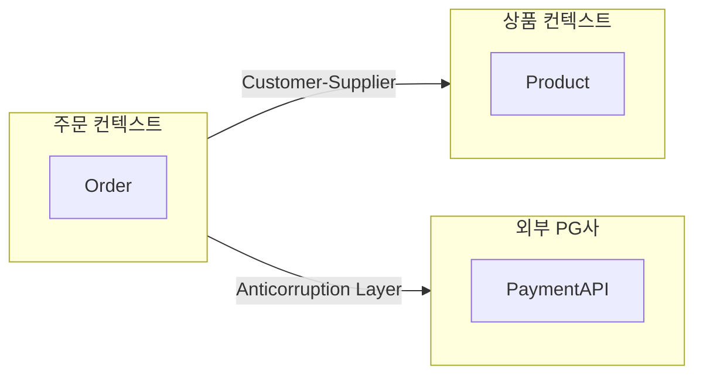
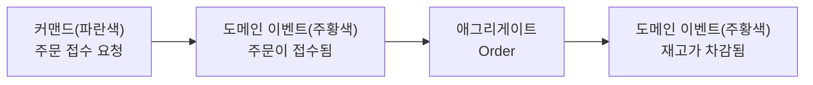

08장에서는 넷플릭스·아마존 같은 대규모 시스템의 실제 사례를 통해, 지금까지 다룬 아키텍처 원칙과 평가 방법론이 현실에서 어떻게 작동하는지 살펴봤다. 그 사례들에서 되풀이해 등장한 어려움은 대체로 기술 자체가 아니라 도메인의 복잡성에서 비롯됐다 — 주문·결제·배송·추천이 뒤섞인 이커머스 시스템을 하나의 거대한 모델로 표현하려 하면, 어느 순간 코드가 아니라 개념들 사이에서 충돌이 시작된다. "주문"이라는 단어 하나만 해도 물류팀에게는 배송할 물건의 목록이고, 회계팀에게는 매출로 잡히는 금액이며, 고객 서비스팀에게는 문의 대상 티켓이다. 이 장부터 두 챕터에 걸쳐 다루는 DDD(Domain-Driven Design, 도메인 주도 설계)는 이런 개념 충돌을 다루는 구체적인 방법론이다.

DDD는 에릭 에반스(Eric Evans)가 2003년 저서 『Domain-Driven Design: Tackling Complexity in the Heart of Software』(Addison-Wesley)에서 체계화한 접근으로, 크게 두 층위로 나뉜다. 전략적 설계(strategic design)는 시스템을 어떤 경계로 나누고 그 경계 사이의 관계를 어떻게 관리할지 결정하는, 조직과 팀 구조에 맞닿은 상위 설계이고, 전술적 설계(tactical design)는 그렇게 나눈 경계 안에서 엔티티·값 객체·애그리게이트 같은 구체적 패턴으로 도메인 모델을 구현하는 하위 설계다. 이번 장은 전략적 설계 — 유비쿼터스 언어, 서브도메인 분류, 바운디드 컨텍스트, 컨텍스트 맵, 이벤트 스토밍 — 를 다루고, 10장은 전술적 설계를 다룬다.

## 이 장을 읽기 전에

**완전한 초보자?** 이 장은 [08장: 실무 사례 연구](/post/software-architecture/practical-case-studies/)에서 다룬 대규모 시스템의 복잡성 문제를 배경으로 삼지만, 별도 사전 지식 없이도 따라올 수 있다. 다만 "도메인"이 특정 비즈니스 문제 영역(주문 처리, 재고 관리 등)을 가리킨다는 정도는 알고 있는 편이 좋다. 특정 언어의 심화 문법이나 프레임워크 지식은 필요 없다.

**이 장의 깊이**: 이 장은 **초급–중급**을 주로 다룬다. 유비쿼터스 언어와 바운디드 컨텍스트의 개념은 처음 접해도 이해할 수 있게 구성했다. 다만 컨텍스트 맵의 아홉 가지 통합 패턴과 이벤트 스토밍의 세 가지 변형을 실제 조직 구조에 적용하는 부분은 실무 경험이 있어야 체감되는 **중급–전문가** 내용이다. **다루지 않는 것**: 이 장은 시스템을 어떤 경계로 나눌지(전략적 설계)에 집중한다. 나눈 경계 안에서 엔티티·값 객체·애그리게이트·리포지토리를 어떻게 설계하는지는 [10장: DDD 전술적 설계](/post/software-architecture/ddd-tactical-design/)에서 다룬다.

## 당신의 수준에 맞는 경로

| 수준 | 읽을 부분 | 핵심 목표 |
|---|---|---|
| 초보자 | "DDD가 풀려는 문제" ~ "유비쿼터스 언어" | DDD가 다루는 문제와 유비쿼터스 언어의 역할을 설명할 수 있다 |
| 중급자 | "서브도메인 분류" ~ "바운디드 컨텍스트" | 서브도메인을 핵심·지원·일반으로 분류하고 바운디드 컨텍스트의 경계를 식별할 수 있다 |
| 전문가 | "컨텍스트 맵" ~ "언제 무엇을 쓸지" | 조직 구조에 맞는 컨텍스트 통합 패턴을 선택하고 이벤트 스토밍으로 도메인을 탐색할 수 있다 |

---

## DDD가 풀려는 문제

DDD 이전에도 소프트웨어는 늘 어떤 형태로든 도메인을 모델링해 왔다. 문제는 그 모델링 방식이 대체로 데이터베이스 테이블 설계에서 출발했다는 점이다 — 개체-관계 다이어그램(ERD)을 먼저 그리고, 그 테이블에 대응하는 필드만 가진 빈약한 객체(getter/setter 뭉치)를 만든 뒤, 실제 비즈니스 규칙은 서비스 계층의 절차형 코드에 흩어 놓는 방식이다. 마틴 파울러(Martin Fowler)는 2003년 블로그 글 "AnemicDomainModel"에서 이런 구조를 빈약한 도메인 모델(Anemic Domain Model) 안티패턴이라 명명하며, 이 모델이 "도메인 모델의 비용은 그대로 지불하면서 그 이점은 하나도 얻지 못한다"고 비판했다. 파울러는 이 글에서 에반스와의 대화와 에반스의 책을 직접 인용하는데, 두 사람이 공통으로 강조한 것은 서비스 계층은 얇게 유지하고 핵심 비즈니스 로직은 도메인 객체 안에 있어야 한다는 원칙이었다.

에반스가 제안한 대안은 데이터 구조가 아니라 도메인 전문가의 사고방식을 소프트웨어 구조의 출발점으로 삼는 것이다. 회원가입 로직을 예로 들면, 데이터 중심 설계는 "User 테이블에 INSERT하고 상태 컬럼을 갱신하는" 절차로 문제를 바라보지만, 도메인 중심 설계는 "회원이 가입을 신청하고, 이메일 인증을 거쳐 정회원이 된다"는 도메인 전문가의 언어를 그대로 코드 구조로 옮긴다. 이 차이는 사소해 보이지만, 도메인이 복잡해질수록 두 접근의 유지보수 비용은 크게 벌어진다 — 절차형 코드는 새로운 예외 규칙이 생길 때마다 서비스 메서드에 조건문이 하나씩 추가되지만, 도메인 모델 코드는 그 규칙을 표현하는 새로운 메서드나 정책 객체로 흡수된다.

```java
// 데이터 중심: 비즈니스 규칙이 서비스 계층에 절차형으로 흩어짐
@Service
public class OrderService {
    public void processOrder(OrderDto dto) {
        if (dto.getTotalAmount().compareTo(new BigDecimal("1000")) > 0) {
            dto.setDiscountAmount(dto.getTotalAmount().multiply(new BigDecimal("0.1")));
        }
        orderRepository.save(toEntity(dto)); // toEntity는 필드 복사만 수행
    }
}

// 도메인 중심: 규칙이 도메인 객체 안에서 스스로를 보호
public class Order {
    private final OrderId id;
    private final List<OrderItem> items;
    private OrderStatus status;
    private Money totalAmount;

    public void applyDiscount(DiscountPolicy policy) {
        this.totalAmount = this.totalAmount.subtract(policy.calculate(this));
    }

    public void confirm() {
        if (this.status != OrderStatus.PLACED) {
            throw new IllegalStateException("접수되지 않은 주문은 확정할 수 없다");
        }
        this.status = OrderStatus.CONFIRMED;
    }
}
```

두 번째 코드에서 `confirm()`이 상태 전이 규칙을 스스로 검사하는 것처럼, 도메인 객체가 "자기 자신을 지키는" 코드를 갖는다는 점이 핵심이다. 다만 이 구분만으로는 "어디까지가 하나의 도메인 모델인가"라는 질문에 답할 수 없다 — 주문·재고·배송을 전부 하나의 `Order` 클래스로 표현하려 들면 결국 그 클래스가 다시 거대해지기 때문이다. 이 경계 문제를 다루는 것이 뒤에서 볼 바운디드 컨텍스트이고, 그 경계 안에서 도메인 전문가와 공유할 언어를 먼저 정하는 것이 다음에 볼 유비쿼터스 언어다.

## 유비쿼터스 언어

유비쿼터스 언어(Ubiquitous Language)는 도메인 전문가와 개발자가 대화·문서·코드 전체에서 동일하게 사용하는, 도메인 모델에 기반한 공용 언어다. 이 개념의 핵심은 "번역이 없다"는 데 있다 — 도메인 전문가가 "주문이 확정되면 재고를 차감한다"고 말했을 때, 개발자가 이를 머릿속에서 `updateStatus(orderId, 2)` 같은 기술 용어로 번역해서 코드를 짜는 순간, 도메인 전문가는 그 코드를 검토해도 자신이 말한 규칙이 맞게 구현됐는지 판단할 수 없게 된다. 유비쿼터스 언어는 이 번역 단계 자체를 없애, 도메인 전문가의 말과 코드의 메서드 이름·클래스 이름이 일치하도록 강제한다.

마틴 파울러는 자신의 bliki "UbiquitousLanguage" 글에서 에반스의 원칙을 다음과 같이 정리했다.

> "Domain experts should object to terms or structures that are awkward or inadequate to convey domain understanding; developers should watch for ambiguity or inconsistency that will trip up design." — Eric Evans, 『Domain-Driven Design』(Addison-Wesley, 2003), Martin Fowler의 bliki "UbiquitousLanguage"에서 인용

이 원칙이 실무에서 의미하는 바는, 언어가 한 번 정해지고 끝나는 용어집이 아니라 대화를 거듭하며 계속 다듬어지는 살아있는 산출물이라는 점이다. 앞의 코드 예제에서 `OrderStatus.PLACED`, `OrderStatus.CONFIRMED`라는 상태 이름이 "접수됨", "확정됨"이라는 도메인 전문가의 표현과 정확히 대응하는 것도 유비쿼터스 언어를 코드에 반영한 결과다. 반대로 기술 편의를 위해 상태를 문자열 `"CREATED"`, `"PAID"`, `"SHIPPED"`처럼 임의로 붙이면, 그 이름은 코드를 작성한 개발자에게만 의미가 통하고 도메인 전문가와의 대화에서는 다시 번역이 필요해진다.

| 상황 | 기술 중심 표현 | 유비쿼터스 언어 표현 |
|---|---|---|
| 주문 상태 필드 | `state: "CREATED"` | `status: OrderStatus.PLACED`(접수됨) |
| 할인 계산 메서드 | `updateAmount(orderId, rate)` | `applyDiscount(discountPolicy)` |
| 배송 준비 완료 이벤트 | `flag = true` | `OrderReadyForShipment` 도메인 이벤트 |

## 서브도메인 분류

유비쿼터스 언어를 정교하게 다듬는 데는 시간과 비용이 든다. 문제는 큰 시스템의 모든 구석을 똑같은 정성으로 모델링할 여유가 없다는 것이다 — 회원 인증, 결제 게이트웨이 연동, 추천 알고리즘을 전부 똑같은 깊이로 설계하는 것은 자원 낭비다. 에반스는 이 우선순위 문제를 풀기 위해 서브도메인(subdomain)을 핵심(core)·지원(supporting)·일반(generic) 세 범주로 나눌 것을 제안했다.

핵심 서브도메인은 그 조직이 경쟁 우위를 갖는, 사업의 존재 이유에 가장 가까운 영역이다. 이커머스라면 상품 추천 알고리즘이나 동적 가격 책정 로직이 여기 해당할 수 있다 — 경쟁사가 쉽게 따라 할 수 없는 부분이라 가장 정교한 모델링과 최고의 인력을 투입할 가치가 있다. 지원 서브도메인은 사업 운영에 필요하지만 그 자체로 경쟁력의 원천은 아닌 영역이다. 재고 관리나 주문 이력 조회가 여기 해당하며, 어느 정도 도메인 특화가 필요하긴 하지만 핵심만큼 깊이 투자하지는 않는다. 일반 서브도메인은 어느 회사나 똑같이 필요하고 이미 잘 만들어진 상용·오픈소스 솔루션이 존재하는 영역이다 — 인증, 이메일 발송, 결제 게이트웨이 연동이 대표적이며, 직접 만드는 대신 기성 솔루션을 붙이는 편이 합리적이다.

| 서브도메인 | 이커머스 예시 | 투자 전략 |
|---|---|---|
| 핵심(Core) | 상품 추천, 동적 가격 책정 | 최고 인력, 정교한 모델링, 자체 구현 |
| 지원(Supporting) | 재고 관리, 주문 이력 | 적당한 특화, 자체 구현 또는 일부 커스터마이징 |
| 일반(Generic) | 인증, 이메일 발송, 결제 게이트웨이 연동 | 기성 솔루션(SaaS/라이브러리) 채택 |

이 분류가 이후에 다룰 바운디드 컨텍스트와 완전히 같은 개념은 아니라는 점에 주의해야 한다. 서브도메인은 문제 공간(problem space)의 분류 — "이 영역이 사업적으로 얼마나 중요한가" — 이고, 바운디드 컨텍스트는 해결 공간(solution space)의 분류 — "이 모델을 어디까지 하나의 경계로 묶을 것인가" — 다. 실무에서는 하나의 핵심 서브도메인이 여러 바운디드 컨텍스트로 나뉘기도 하고, 반대로 여러 지원 서브도메인이 하나의 바운디드 컨텍스트로 합쳐지기도 한다.

## 바운디드 컨텍스트

바운디드 컨텍스트(Bounded Context)는 특정 도메인 모델이 일관되게 유효한 명시적 경계다. 에반스가 이 개념을 제안한 이유는 간단하다 — 큰 시스템 전체를 하나의 통일된 모델로 표현하려는 시도는 실용적이지 않기 때문이다. 마틴 파울러는 bliki "BoundedContext"에서 에반스의 이 주장을 다음과 같이 인용한다.

> "The total unification of the domain model for a large system will not be feasible or cost-effective." — Eric Evans, 『Domain-Driven Design』(Addison-Wesley, 2003), Martin Fowler의 bliki "BoundedContext"에서 인용

파울러는 이 글에서 전력 회사의 "미터(meter)"라는 단어가 부서마다 최소 세 가지 다른 의미로 쓰이는 사례를 든다 — 계량 부서에게는 물리적 계량기 장치이고, 요금 청구 부서에게는 청구 대상 계정이며, 유지보수 부서에게는 점검 일정이 달린 자산이다. 이 세 의미를 하나의 `Meter` 클래스에 전부 담으려 하면, 어느 부서의 요구사항이 바뀔 때마다 다른 부서가 쓰지도 않는 필드까지 함께 흔들리는 클래스가 만들어진다. 바운디드 컨텍스트는 이런 다의어(polyseme)를 억지로 하나로 합치는 대신, 각 부서(컨텍스트)마다 그 컨텍스트에 필요한 속성만 가진 별도의 `Meter` 모델을 허용하고, 컨텍스트 사이의 관계는 명시적인 매핑(뒤에서 볼 컨텍스트 맵)으로 관리한다.

앞서 살펴본 "주문"이라는 단어도 같은 방식으로 나뉜다. 주문 처리 컨텍스트에서 `Order`는 결제·배송 상태를 가진 트랜잭션 객체이지만, 고객 서비스 컨텍스트에서 `Order`는 문의 이력과 환불 사유가 딸린 티켓에 가깝고, 마케팅 컨텍스트에서 `Order`는 구매 패턴 분석을 위한 집계 데이터에 가깝다. 세 컨텍스트가 같은 이름 `Order`를 쓰지만, 이는 우연한 이름 충돌이 아니라 애초에 서로 다른 모델이라는 신호로 읽어야 한다.

```java
// 주문 처리 컨텍스트: 트랜잭션 상태가 핵심
public class Order {
    private OrderId id;
    private OrderStatus status;
    private Money totalAmount;
    private ShippingAddress shippingAddress;
}

// 고객 서비스 컨텍스트: 문의·환불 이력이 핵심
public class Order {
    private OrderId id;
    private List<InquiryTicket> inquiries;
    private RefundEligibility refundEligibility;
}
```

바운디드 컨텍스트의 경계는 대체로 코드가 아니라 조직에서 먼저 드러난다. 부서·팀이 서로 다른 회의에서 같은 단어를 다른 뜻으로 쓰고 있다면, 그것이 이미 별도의 바운디드 컨텍스트가 필요하다는 신호다. 이 관찰은 콘웨이의 법칙(Conway's Law) — 시스템 구조가 그 시스템을 만든 조직의 커뮤니케이션 구조를 닮는다는 원칙 — 과도 맞닿아 있으며, 04장에서 다룬 마이크로서비스 경계를 설계할 때도 바운디드 컨텍스트가 흔히 출발점으로 쓰이는 이유이기도 하다.

## 컨텍스트 맵

바운디드 컨텍스트로 시스템을 나누고 나면, 그 경계들이 완전히 독립적으로 존재할 수는 없다는 문제가 남는다. 주문 컨텍스트는 상품 컨텍스트의 가격 정보가 필요하고, 결제 컨텍스트는 외부 PG사의 API와 통합해야 한다. 컨텍스트 맵(Context Map)은 이런 컨텍스트 사이의 관계를 명시적으로 그려, 어느 컨텍스트가 다른 컨텍스트에 영향을 주는 상류(upstream)이고 어느 쪽이 그 영향을 받는 하류(downstream)인지, 그리고 그 관계를 어떤 패턴으로 관리할지 드러낸다. 위키백과의 "Domain-driven design" 항목은 에반스가 원저에서 제시한 아홉 가지 통합 패턴을 정리하고 있는데, 그중 실무에서 가장 자주 쓰이는 세 가지를 먼저 자세히 살펴본다.

가장 흔히 쓰이는 패턴은 오손 방지 계층(Anticorruption Layer, ACL)이다. 하류 컨텍스트가 상류(주로 외부 시스템)의 모델을 그대로 들여오면, 상류의 설계 결함이나 변경이 하류 도메인 모델까지 오염시킨다. ACL은 이 둘 사이에 변환 계층을 두어, 하류 도메인은 외부 모델을 전혀 모른 채 자신의 언어로만 대화하게 만든다.

```java
// Anticorruption Layer: 외부 PG사 모델이 내부 도메인을 오염시키지 않도록 격리
@Component
public class PaymentGatewayAdapter {
    private final ExternalPaymentGateway externalGateway;

    public PaymentResult processPayment(PaymentRequest request) {
        ExternalPaymentRequest externalRequest = toExternalFormat(request);
        ExternalPaymentResponse externalResponse = externalGateway.charge(externalRequest);
        return toDomainResult(externalResponse); // 내부 도메인 언어로 변환
    }
}
```

Customer-Supplier(고객-공급자)와 Conformist(순응주의자)는 둘 다 업스트림-다운스트림 관계지만 협상력이 다르다. Customer-Supplier는 다운스트림 팀이 업스트림 팀에게 요구사항을 제시하고 업스트림이 이를 일정에 반영해 줄 만큼 두 팀의 힘이 대등할 때 성립하고, Conformist는 다운스트림이 업스트림의 모델을 그대로 받아들일 수밖에 없을 때(예: 외부 벤더의 API를 사실상 그대로 써야 하는 경우) 나타난다. Conformist를 선택하면 변환 계층을 만드는 비용은 줄어들지만, 업스트림 모델의 결함까지 그대로 떠안는다는 트레이드오프가 생긴다.

| 패턴 | 관계 | 핵심 아이디어 |
|---|---|---|
| Partnership | 상호 의존 | 두 팀의 성패가 함께 묶여, 공동 계획·통합 프로세스를 운영 |
| Shared Kernel | 상호 의존 | 두 컨텍스트가 명시적으로 합의한 모델 일부를 공유 |
| Customer-Supplier | 업스트림-다운스트림 | 다운스트림이 업스트림 일정에 요구사항을 반영시킬 힘이 있음 |
| Conformist | 업스트림-다운스트림 | 다운스트림이 업스트림 모델을 그대로 수용 |
| Anticorruption Layer | 업스트림-다운스트림 | 다운스트림이 변환 계층으로 업스트림 모델을 자신의 언어로 격리 |
| Open Host Service | 업스트림 제공 | 업스트림이 여러 다운스트림을 위한 표준화된 프로토콜을 공개 |
| Published Language | 업스트림 제공 | 잘 문서화된 공용 교환 포맷(JSON 스키마 등)으로 통합 |
| Separate Ways | 무관계 | 통합 비용이 이득보다 크면 아예 통합하지 않음 |
| Big Ball of Mud | 경계 없음 | 기존에 경계가 무너진 레거시 영역을 일단 하나로 묶어 격리 |



아홉 가지 패턴을 전부 외울 필요는 없다. 실무에서 중요한 것은 컨텍스트 맵을 그릴 때마다 "이 관계는 상류인가 하류인가, 그리고 하류가 상류의 변경으로부터 얼마나 보호되어야 하는가"라는 질문에 답하는 습관이다. 보호가 중요할수록 ACL 같은 비용이 드는 패턴을, 두 팀이 사실상 한 팀처럼 움직인다면 Partnership이나 Shared Kernel처럼 가벼운 패턴을 선택하게 된다.

## 이벤트 스토밍

바운디드 컨텍스트와 유비쿼터스 언어를 정의하려면 먼저 도메인 전문가로부터 도메인 지식을 끌어내야 하는데, 전통적인 요구사항 인터뷰나 UML 다이어그램 작성 회의는 이 과정에서 종종 비효율적이다 — 도메인 전문가가 다이어그램 표기법에 익숙하지 않아 대화가 끊기고, 회의실 화이트보드 한 장으로는 여러 부서가 동시에 그릴 수 없기 때문이다. 이벤트 스토밍(EventStorming)은 이탈리아의 소프트웨어 컨설턴트 알베르토 브란돌리니(Alberto Brandolini)가 2013년에 고안한 워크숍 기법으로, 이 문제를 색깔이 다른 포스트잇과 넓은 종이 롤만으로 해결한다.

브란돌리니는 자신의 2013년 블로그 글 "Introducing Event Storming"에서 이 기법의 탄생 과정을 직접 밝혔다. 시작은 2012년 Italian Agile Day에서 선보인 "Event-Based Modelling" 워크숍이었고, 이후 바노스 버논(Vaughn Vernon)의 IDDD 투어에 게스트 트레이너로 초청되어 벨기에·폴란드에서 실험을 거듭하며 형식이 다듬어졌다. 그는 회의실 크기와 배치에 제약받는 것을 싫어해 늘 종이 롤을 배낭에 넣고 다녔고, 그 롤에 주황색·파란색 등 색깔별 포스트잇을 붙이며 도메인을 함께 그려나가는 방식을 정착시켰다. "EventStorming"이라는 지금의 이름은 2013년 여름 무렵 이런 실험이 관심을 끌기 시작하면서 자리 잡았다고 알려져 있다.

이벤트 스토밍의 메커니즘은 참가자 전원이 넓은 벽이나 종이 롤 앞에 서서, 도메인에서 일어나는 일을 과거 시제의 도메인 이벤트로 표현한 주황색 포스트잇을 시간 순서대로 붙여나가는 것이다("주문이 접수됨", "결제가 승인됨", "재고가 차감됨"). 이후 그 이벤트를 일으키는 사용자 행동을 나타내는 파란색 커맨드 포스트잇, 외부 시스템을 나타내는 보라색 포스트잇을 추가해 나가고, 이벤트를 처리하는 도메인 객체 묶음인 애그리게이트를 별도 색으로 묶어 표시한다. 주황색(이벤트)·파란색(커맨드)은 브란돌리니의 원 설명과 이후 문헌에서 일관되게 나타나지만, 애그리게이트·액터·정책·읽기 모델을 나타내는 색상은 빅 픽처 단계냐 소프트웨어 설계 단계냐, 그리고 팀·도구에 따라 조금씩 다르게 쓰인다 — 색상 자체보다 "사건-행동-처리 단위"라는 세 요소의 관계가 핵심이다.



브란돌리니는 이벤트 스토밍을 다루는 범위에 따라 세 단계로 구분한다. 빅 픽처(Big Picture) 이벤트 스토밍은 조직 전체의 비즈니스 프로세스를 큰 흐름으로 파악하는 데 쓰이며 참가자 범위도 가장 넓다. 프로세스 모델링(Process Modeling) 단계는 특정 비즈니스 프로세스 하나를 더 정교하게 파고들어 정책과 예외 흐름까지 드러낸다. 소프트웨어 설계(Design Level) 단계는 도메인 이벤트와 애그리게이트를 실제 바운디드 컨텍스트와 코드 구조로 좁혀가는 단계로, 이 장의 컨텍스트 맵과 다음 장의 애그리게이트 설계가 맞닿는 지점이다. 이 순서를 거치면, 워크숍이 끝날 무렵에는 벽에 붙은 포스트잇 뭉치들이 자연스럽게 바운디드 컨텍스트 후보로 갈라져 보이기 시작한다 — 이벤트가 몰려 있으면서 서로 강하게 얽힌 구간이 하나의 컨텍스트가 되고, 이벤트 흐름이 뜸해지는 지점이 컨텍스트 사이의 경계가 되는 식이다.

## 자주 하는 오해

**"바운디드 컨텍스트는 곧 마이크로서비스다"** — 바운디드 컨텍스트는 모델의 언어적·개념적 경계이고, 마이크로서비스는 배포 단위라는 기술적 경계다. 하나의 바운디드 컨텍스트를 여러 마이크로서비스로 나눌 수도 있고, 초기 단계에서는 여러 바운디드 컨텍스트를 모듈러 모놀리스 안에서 하나의 배포 단위로 유지할 수도 있다. 04장에서 다룬 마이크로서비스 경계 설계에 바운디드 컨텍스트가 좋은 출발점이 되는 것은 맞지만, 둘을 동일시하면 아직 조직이 준비되지 않은 상태에서 성급하게 서비스를 쪼개는 함정에 빠지기 쉽다.

**"유비쿼터스 언어는 한 번 만들면 끝나는 용어집이다"** — 유비쿼터스 언어는 도메인 전문가와의 대화가 계속되는 한 함께 진화하는 살아있는 산출물이다. 파울러가 인용한 에반스의 원칙대로, 도메인 전문가가 어색하다고 느끼는 용어는 그 즉시 수정 대상이며, 이는 프로젝트 초기의 한 차례 워크숍으로 완성되지 않는다.

**"모든 서브도메인을 똑같이 정교하게 모델링해야 DDD를 제대로 적용하는 것이다"** — 실제로는 정반대다. 앞서 본 서브도메인 분류의 목적 자체가 "어디에 정교한 모델링을 투자하고 어디는 기성 솔루션으로 대체할지" 판단하는 것이다. 일반 서브도메인까지 자체 도메인 모델을 정성껏 설계하는 것은 DDD를 충실히 따르는 것이 아니라, 한정된 모델링 역량을 사업 경쟁력과 무관한 곳에 낭비하는 것이다.

## 언제 무엇을 쓸지

| 상황 | 권장 접근 | 이유 |
|---|---|---|
| 도메인 규칙이 복잡하고 자주 변경됨(핵심 서브도메인) | 전략적 설계 전면 적용 | 유비쿼터스 언어·바운디드 컨텍스트 투자가 장기적으로 변경 비용을 줄인다 |
| 도메인 지식이 여러 부서에 흩어져 있고 합의가 안 됨 | 이벤트 스토밍 워크숍 | 다이어그램보다 낮은 진입 장벽으로 도메인 전문가를 직접 참여시킨다 |
| 외부 벤더 API·레거시 시스템과 통합 | Anticorruption Layer | 외부 모델의 결함이나 변경이 내부 도메인까지 전파되지 않게 막는다 |
| 단순 CRUD 위주의 관리자 도구, 일반 서브도메인 | DDD 전면 적용 대신 트랜잭션 스크립트 또는 기성 솔루션 | 도메인 복잡도가 낮으면 모델링 투자 대비 이득이 작다 |
| 소규모 팀, 도메인이 아직 안정되지 않은 초기 스타트업 | 모듈러 모놀리스 안에서 느슨한 바운디드 컨텍스트만 유지 | 컨텍스트 맵의 아홉 가지 패턴을 전부 적용할 조직적 여력이 없다 |

이 표의 반대 방향도 성립한다. 일반 서브도메인에 핵심 서브도메인 수준의 모델링 공수를 쏟으면 정작 경쟁력을 좌우하는 영역에 투입할 자원이 부족해진다. 반대로 핵심 서브도메인을 데이터 중심 CRUD로 설계하면, 앞서 "DDD가 풀려는 문제"에서 본 빈약한 도메인 모델의 유지보수 비용을 그대로 떠안게 된다.

## 학습 성과 평가 기준

- [ ] 전략적 설계와 전술적 설계의 차이, 그리고 이 장과 10장이 각각 무엇을 다루는지 설명할 수 있는가?
- [ ] 빈약한 도메인 모델과 도메인 중심 모델의 차이를 코드 수준에서 구분하고, 그 차이가 유지보수 비용에 미치는 영향을 설명할 수 있는가?
- [ ] 유비쿼터스 언어가 "번역 없는 공용 언어"인 이유와, 이를 코드의 메서드·클래스 이름에 반영하는 방법을 설명할 수 있는가?
- [ ] 서브도메인을 핵심·지원·일반으로 분류하고, 각 분류에 맞는 투자 전략을 판단할 수 있는가?
- [ ] 바운디드 컨텍스트의 경계를 실제 조직·용어 충돌에서 식별하고, 컨텍스트 맵의 통합 패턴(특히 ACL·Customer-Supplier·Conformist) 중 상황에 맞는 것을 선택할 수 있는가?
- [ ] 이벤트 스토밍의 색상 규칙과 세 가지 단계(빅 픽처·프로세스 모델링·소프트웨어 설계)를 설명하고, 워크숍 결과에서 바운디드 컨텍스트 후보를 도출할 수 있는가?

## 다음 장에서는

10장 <strong>「DDD 전술적 설계」</strong>에서는 이 장에서 식별한 바운디드 컨텍스트 안으로 들어가, 그 경계 안의 도메인 모델을 실제 코드로 구현하는 구체적 패턴 — 엔티티, 값 객체, 애그리게이트, 리포지토리, 도메인 이벤트 — 을 다룬다. 이 장이 "시스템을 어떤 경계로 나눌 것인가"였다면, [다음 장](/post/software-architecture/ddd-tactical-design/)은 "그 경계 안에서 도메인 모델을 어떻게 코드로 표현할 것인가"를 다룬다.

## 참고 및 출처

- Eric Evans, 『Domain-Driven Design: Tackling Complexity in the Heart of Software』(Addison-Wesley, 2003)
- ["Domain-driven design"](https://en.wikipedia.org/wiki/Domain-driven_design), Wikipedia — DDD 역사, 전략적/전술적 설계 구분, 아홉 가지 컨텍스트 맵 패턴 목록
- Martin Fowler, ["BoundedContext"](https://martinfowler.com/bliki/BoundedContext.html), martinfowler.com bliki
- Martin Fowler, ["UbiquitousLanguage"](https://martinfowler.com/bliki/UbiquitousLanguage.html), martinfowler.com bliki
- Martin Fowler, ["AnemicDomainModel"](https://martinfowler.com/bliki/AnemicDomainModel.html), martinfowler.com bliki, 2003
- Alberto Brandolini, ["Introducing Event Storming"](https://ziobrando.blogspot.com/2013/11/introducing-event-storming.html), Ziobrando's Lair, 2013
- Alberto Brandolini, 『Introducing EventStorming: An Act of Deliberate Collective Learning』(Leanpub), [eventstorming.com](https://www.eventstorming.com/)
- ["Event storming"](https://en.wikipedia.org/wiki/Event_storming), Wikipedia — 이벤트 스토밍 색상 규칙 개요
- Vaughn Vernon, 『Implementing Domain-Driven Design』(Addison-Wesley, 2013)
- Vlad Khononov, 『Learning Domain-Driven Design』(O'Reilly, 2021)
