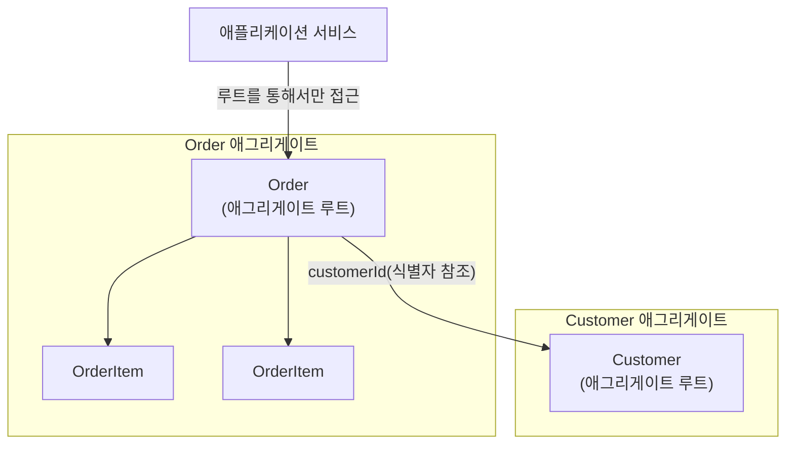
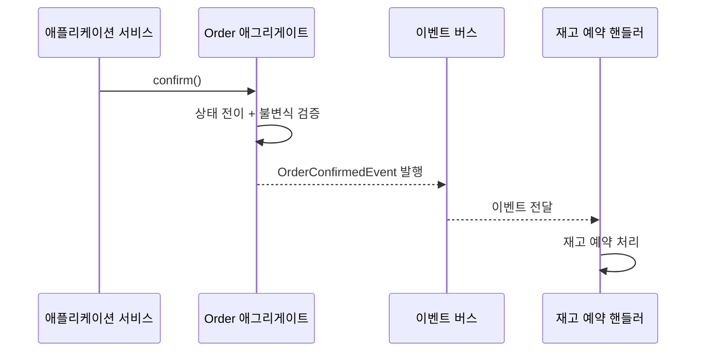

09장에서 바운디드 컨텍스트로 도메인을 여러 자율적인 모델 경계로 나누고, 그 안에서 팀과 코드가 공유할 유비쿼터스 언어를 구축하는 전략적 설계를 다뤘다면, 이 장은 그렇게 나눈 컨텍스트 하나 **안에서** 실제로 코드를 어떻게 짤 것인가를 다룬다. 전략적 설계가 "어디까지가 하나의 모델인가"라는 경계의 문제라면, 전술적 설계는 "그 경계 안의 모델을 코드로 어떻게 정확하게 표현할 것인가"라는 구현의 문제다. 에릭 에반스(Eric Evans)는 2003년 저서 『Domain-Driven Design: Tackling Complexity in the Heart of Software』(Addison-Wesley) 5–6장에서 이 구현 문제에 답하기 위해 Entity, Value Object, Aggregate, Factory, Repository, Domain Service라는 여섯 가지 빌딩 블록을 제시했고, 이후 커뮤니티가 여기에 Domain Event를 추가하며 오늘날 널리 쓰이는 전술적 설계 패턴 집합이 완성되었다.

이 여섯(또는 일곱) 가지 패턴은 서로 무관한 도구 상자가 아니라, "도메인 로직을 어디에 둘 것인가"라는 하나의 질문에 대한 일관된 답이다. Entity와 Value Object는 로직을 담을 그릇의 형태를 정하고, Aggregate는 그 그릇들을 하나의 트랜잭션 경계로 묶으며, Factory는 그 경계를 지키며 객체를 만드는 방법을, Repository는 그 경계를 지키며 객체를 저장·복원하는 방법을 정의한다. Domain Service는 이 그릇 중 어디에도 자연스럽게 속하지 않는 로직을, Domain Event는 한 경계에서 일어난 사실을 다른 경계에 알리는 방법을 다룬다. 이 장을 읽고 나면, 왜 어떤 로직은 Entity의 메서드가 되어야 하고 어떤 로직은 Domain Service로 빠져야 하는지, 왜 Aggregate는 작을수록 좋다고 하는지, Repository가 왜 단순한 DAO(Data Access Object)와 다른지를 설계 판단으로 설명할 수 있어야 한다.

## 이 장을 읽기 전에

**완전한 초보자?** 이 장은 [09장: DDD 기초: 전략적 설계](/post/software-architecture/ddd-strategic-design-fundamentals/)에서 다룬 바운디드 컨텍스트와 유비쿼터스 언어를 전제로 한다. 전술적 설계 패턴은 항상 특정 바운디드 컨텍스트 **안에서만** 유효하다 — 예를 들어 "주문" 바운디드 컨텍스트의 `Customer` Entity와 "고객 관리" 바운디드 컨텍스트의 `Customer` Entity는 이름은 같아도 서로 다른 모델이다. 이 전제를 모른 채 이 장을 읽으면 Aggregate 경계를 "왜 이렇게 좁게 잡는지" 이해하기 어렵다. Java 문법과 기본적인 객체지향(캡슐화, 상속) 개념은 안다고 가정한다.

**이 장의 깊이**: 이 장은 **초급–전문가**까지 폭넓게 다룬다. Entity·Value Object의 정의와 구현은 초급자도 바로 적용할 수 있는 수준으로 설명하고, Aggregate 경계 설계와 Domain Event를 통한 애그리게이트 간 일관성 처리는 **중급–전문가** 수준의 트레이드오프 판단을 요구한다. **다루지 않는 것**: 이 장은 하나의 애그리게이트를 어떻게 설계하고 구현하는지에 집중하며, 애그리게이트 간 데이터를 어떻게 저장·조회 최적화할지(폴리글랏 퍼시스턴스, CQRS, 이벤트 소싱)는 다음 장인 [11장: 데이터 아키텍처 전략](/post/software-architecture/data-architecture-strategy/)에서 다룬다. 여러 바운디드 컨텍스트를 어떻게 식별하고 경계를 나눌지는 이미 09장에서 다뤘으므로 이 장에서 반복하지 않는다.

## 당신의 수준에 맞는 경로

| 수준 | 읽을 부분 | 핵심 목표 |
|------|---------|---------|
| 초보자 | "Entity: 식별자로 존속하는 객체" ~ "Entity와 Value Object 비교" | Entity와 Value Object를 구분해 도메인 클래스를 올바르게 설계할 수 있다 |
| 중급자 | "Aggregate: 일관성의 경계" ~ "Repository: 컬렉션처럼 보이는 저장소" | 애그리게이트 경계를 정하고 Repository·Factory로 그 경계를 지키는 코드를 작성할 수 있다 |
| 전문가 | "Domain Service와 빈혈 모델" ~ "언제 무엇을 쓸지" | Domain Event로 애그리게이트 간 결과적 일관성을 설계하고, 전술적 패턴의 과잉 적용을 피할 수 있다 |

---

## Entity: 식별자로 존속하는 객체

<strong>Entity(엔티티)</strong>는 고유한 식별자를 가지며, 속성 값이 아무리 바뀌어도 그 식별자가 유지되는 한 "같은 객체"로 취급되는 도메인 객체다. 이 정의의 핵심은 동등성 판단 기준이 값이 아니라 식별자라는 점이다 — 고객의 이름과 이메일이 모두 바뀌어도, 그 고객을 가리키는 `CustomerId`가 그대로면 시스템은 여전히 "같은 고객"으로 인식해야 한다. 반대로 두 고객이 우연히 이름과 이메일이 완전히 같더라도 식별자가 다르면 서로 다른 고객이다. 이 성질을 소프트웨어로 정확히 구현하려면 `equals()`와 `hashCode()`를 식별자 필드만으로 오버라이드해야 한다 — 다른 필드까지 비교에 포함시키면, 속성이 바뀌는 순간 컬렉션(`Set`, `Map`의 키)에서 "다른 객체"로 취급되어 조회가 실패하는 미묘한 버그가 생긴다.

에반스가 Entity 개념을 제시한 배경에는 데이터베이스 모델링과의 의도적인 구분이 있다. 개체-관계 모델(Entity-Relationship Model)은 피터 첸(Peter Chen)이 1976년 논문 "The Entity-Relationship Model—Toward a Unified View of Data"에서 제안한 이래 데이터베이스 설계의 표준 어휘가 되었지만, 그 "엔티티"는 테이블의 한 행, 즉 데이터의 정적인 구조를 가리킨다. 에반스가 DDD에서 말하는 Entity는 여기에 <strong>행동(behavior)</strong>과 <strong>생명주기(lifecycle)</strong>라는 차원을 더한다 — DDD의 Entity는 단순히 식별 가능한 데이터 묶음이 아니라, 자신의 상태 전이 규칙을 스스로 캡슐화하고 강제하는 객체다. 아래 예제의 `suspend()` 메서드가 "이미 정지된 고객은 다시 정지할 수 없다"는 규칙을 세터(setter)가 아니라 의도가 드러나는 메서드로 표현하는 것이 이 차이를 보여준다.

```java
public class Customer {
    private final CustomerId id;
    private String name;
    private Email email;
    private CustomerStatus status;

    public Customer(CustomerId id, String name, Email email) {
        this.id = Objects.requireNonNull(id);
        this.name = validateName(name);
        this.email = Objects.requireNonNull(email);
        this.status = CustomerStatus.ACTIVE;
    }

    public void changeEmail(Email newEmail) {
        if (this.status == CustomerStatus.SUSPENDED) {
            throw new IllegalStateException("정지된 고객은 이메일을 변경할 수 없습니다");
        }
        this.email = Objects.requireNonNull(newEmail);
    }

    public void suspend(String reason) {
        if (this.status == CustomerStatus.SUSPENDED) {
            throw new IllegalStateException("이미 정지된 고객입니다");
        }
        this.status = CustomerStatus.SUSPENDED;
    }

    // 동등성은 식별자만으로 판단한다 — 이름·이메일이 바뀌어도 "같은 고객"이다.
    @Override
    public boolean equals(Object obj) {
        if (this == obj) return true;
        if (!(obj instanceof Customer other)) return false;
        return Objects.equals(id, other.id);
    }

    @Override
    public int hashCode() {
        return Objects.hash(id);
    }

    private String validateName(String name) {
        if (name == null || name.isBlank()) {
            throw new IllegalArgumentException("이름은 필수입니다");
        }
        return name;
    }
}
```

이 코드에서 주의할 점은 `id` 필드를 `final`로 선언해 생성 이후 절대 바뀌지 않게 강제한 부분이다. 식별자가 생명주기 중간에 바뀔 수 있다면 Entity 개념 자체가 무너진다 — "식별자로 존속한다"는 정의를 코드 수준에서 지키려면 식별자의 불변성을 언어 기능(`final`)으로 보장하는 것이 가장 확실하다. 실무에서 Entity는 `Order`, `BankAccount`, `Customer`처럼 시간에 따라 상태가 변하고 그 변화 이력 자체가 의미를 갖는 객체에 적용된다 — 예를 들어 은행 계좌는 잔액이 계속 바뀌지만, 특정 계좌 번호(식별자)를 가진 "그 계좌"라는 정체성은 계좌가 존재하는 한 유지된다.

## Value Object: 값 자체가 의미인 불변 객체

<strong>Value Object(값 객체)</strong>는 식별자가 없고, 모든 속성 값이 같으면 동일한 것으로 취급되는 불변 객체다. Entity와의 근본적인 차이는 "이것이 어떤 것인가(identity)"가 아니라 "이것이 무엇인가(what it is)"만으로 의미가 완성된다는 점이다 — `Money(10000, KRW)`라는 값 객체 두 개는 서로 다른 메모리 주소에 있어도 개념적으로 완전히 같은 만원이며, 구분할 필요도 이유도 없다. 이 성질에서 불변성(immutability)이 자연스럽게 따라 나온다 — 만약 값 객체가 가변이라면, 어딘가에서 공유된 참조를 통해 값을 바꿨을 때 그 값을 참조하던 다른 모든 곳에서 예기치 않게 값이 바뀌는 부작용이 생긴다. 그래서 값 객체의 "변경"은 항상 필드를 덮어쓰는 것이 아니라 새 인스턴스를 반환하는 방식으로 구현된다.

마틴 파울러는 자신의 블로그 글 "Value Object"에서 값 객체라는 용어가 2000년대 초에 널리 퍼졌다고 언급하며, 이 시기의 대표적 문헌으로 자신의 『Patterns of Enterprise Application Architecture』(2002)와 에반스의 『Domain-Driven Design』(2003)을 꼽는다. 이 개념의 뿌리는 워드 커닝엄(Ward Cunningham)이 Smalltalk 커뮤니티에서 논의한 "Whole Value" 패턴에서 비롯되었다고 알려져 있다 — 정수·문자열 같은 원시 타입을 그대로 쓰는 대신, 도메인 의미를 가진 완결된 값 타입(예: 원시 `int` 대신 `Money`)으로 감싸야 한다는 아이디어다. 값 객체는 생성 시점에 스스로를 검증해 잘못된 상태를 아예 표현 불가능하게 만드는 자기 검증(self-validation) 책임도 함께 진다 — 아래 `Email`처럼 형식이 틀린 문자열은 애초에 `Email` 인스턴스가 될 수 없다.

```java
public final class Email {
    private final String value;

    public Email(String rawValue) {
        this.value = validate(rawValue).toLowerCase();
    }

    private String validate(String email) {
        if (email == null || email.isBlank()) {
            throw new IllegalArgumentException("이메일은 필수입니다");
        }
        if (!email.matches("^[A-Za-z0-9+_.-]+@[A-Za-z0-9.-]+\\.[A-Za-z]{2,}$")) {
            throw new IllegalArgumentException("올바른 이메일 형식이 아닙니다");
        }
        return email;
    }

    public String domain() {
        return value.substring(value.indexOf('@') + 1);
    }

    @Override
    public boolean equals(Object obj) {
        return obj instanceof Email other && Objects.equals(value, other.value);
    }

    @Override
    public int hashCode() {
        return Objects.hash(value);
    }
}
```

`Money` 같은 값 객체는 여기서 한 걸음 더 나아가, 자기 자신에 대한 연산까지 캡슐화한다. `add()`나 `multiply()` 같은 메서드가 새 `Money` 인스턴스를 반환하도록 구현하면, "통화가 다른 금액은 더할 수 없다"는 규칙을 메서드 안에서 강제할 수 있어 도메인 로직이 서비스 계층으로 새어 나가지 않는다. 이런 값 객체는 통화 코드, 좌표, 날짜 범위처럼 여러 필드가 하나의 개념적 단위를 이룰 때 특히 유용하다 — `int amount`와 `String currency`를 따로 넘기는 대신 `Money` 하나로 다루면, "금액과 통화가 항상 함께 다녀야 한다"는 불변식이 타입 시스템 수준에서 보장된다.

### Entity와 Value Object 비교

| 기준 | Entity | Value Object |
|---|---|---|
| 동등성 판단 | 식별자(ID) | 모든 속성 값 |
| 가변성 | 가변(상태가 시간에 따라 변함) | 불변(변경 시 새 인스턴스 생성) |
| 생명주기 | 추적 필요(생성부터 소멸까지) | 추적 불필요(교체 가능) |
| 대표 예 | Customer, Order, BankAccount | Money, Email, DateRange, Coordinate |

두 패턴을 가르는 질문은 결국 하나다 — "이 개념이 바뀌었을 때, 바뀌기 전과 같은 것으로 추적해야 하는가?" 답이 "그렇다"면 Entity, "아니다, 그냥 다른 값으로 교체하면 된다"면 Value Object다. 주소(Address)가 대표적으로 헷갈리는 사례인데, 배송 목적으로만 쓰인다면 값 객체(주소 문자열이 같으면 같은 주소)로 충분하지만, "이 주소에 몇 번 배송을 실패했는가"를 추적해야 하는 도메인이라면 식별자를 부여한 Entity로 승격해야 한다 — 정답은 도메인 규칙이 결정하지, 클래스의 외형만으로는 결정되지 않는다.

## Aggregate: 일관성의 경계

<strong>Aggregate(애그리게이트)</strong>는 하나의 트랜잭션에서 함께 일관성을 유지해야 하는 Entity와 Value Object의 묶음이며, 이 묶음의 대표 역할을 하는 단 하나의 Entity를 <strong>애그리게이트 루트(Aggregate Root)</strong>라 부른다. 메커니즘의 핵심은 접근 통제다 — 외부의 어떤 코드도 애그리게이트 내부의 객체를 직접 참조하거나 수정할 수 없고, 오직 루트를 통해서만 접근해야 한다. 아래 예제에서 `OrderItem`의 생성자가 패키지 전용(package-private)으로 선언된 것은 우연이 아니다 — `Order`(루트)를 거치지 않고 외부에서 `OrderItem`을 직접 만들 수 없게 막아, "주문 항목은 반드시 주문에 속한 상태로만 존재한다"는 불변식을 컴파일 타임에 강제한다.

```java
public class Order {
    private final OrderId id;
    private final CustomerId customerId;
    private final List<OrderItem> items = new ArrayList<>();
    private OrderStatus status;
    private Money totalAmount;

    public static Order create(CustomerId customerId, List<OrderItem> items) {
        if (items.isEmpty()) {
            throw new IllegalArgumentException("주문 항목이 없습니다");
        }
        Order order = new Order(OrderId.generate(), customerId);
        order.items.addAll(items);
        order.recalculateTotal();
        return order;
    }

    private Order(OrderId id, CustomerId customerId) {
        this.id = id;
        this.customerId = customerId;
        this.status = OrderStatus.PENDING;
    }

    public void addItem(ProductId productId, int quantity, Money unitPrice) {
        if (status != OrderStatus.PENDING) {
            throw new IllegalStateException("대기 중인 주문만 항목을 추가할 수 있습니다");
        }
        items.add(new OrderItem(productId, quantity, unitPrice));
        recalculateTotal();
    }

    public void confirm() {
        if (status != OrderStatus.PENDING) {
            throw new IllegalStateException("대기 중인 주문만 확정할 수 있습니다");
        }
        this.status = OrderStatus.CONFIRMED;
    }

    private void recalculateTotal() {
        this.totalAmount = items.stream()
            .map(OrderItem::amount)
            .reduce(Money.ZERO, Money::add);
    }

    public List<OrderItem> items() {
        return Collections.unmodifiableList(items);
    }
}

class OrderItem {
    private final ProductId productId;
    private final int quantity;
    private final Money unitPrice;

    OrderItem(ProductId productId, int quantity, Money unitPrice) {
        if (quantity <= 0) {
            throw new IllegalArgumentException("수량은 0보다 커야 합니다");
        }
        this.productId = productId;
        this.quantity = quantity;
        this.unitPrice = unitPrice;
    }

    Money amount() {
        return unitPrice.multiply(quantity);
    }
}
```

`Order` 애그리게이트가 `Customer`를 직접 객체로 들고 있지 않고 `CustomerId`만 참조하는 것도 같은 원칙의 연장이다. 버넌(Vaughn Vernon)은 2011년 DDD 커뮤니티에 발표한 3부작 논문 "Effective Aggregate Design"에서, 실무에서 관찰한 애그리게이트 설계 실패 사례를 바탕으로 몇 가지 경험칙을 제시했다고 알려져 있다 — 진짜 트랜잭션 불변식만을 경계 안에 두고 그 외에는 별도 애그리게이트로 분리할 것, 애그리게이트는 가능한 한 작게 설계할 것, 다른 애그리게이트는 객체 참조가 아니라 식별자로만 참조할 것, 애그리게이트 경계를 넘는 일관성은 즉시 일관성이 아니라 결과적 일관성(eventual consistency)으로 처리할 것이다. 이 경험칙들이 나온 배경에는 큰 애그리게이트의 실질적 비용이 있다 — 애그리게이트가 클수록 하나의 트랜잭션에서 잠그는(lock) 데이터 범위가 넓어져 동시에 여러 사용자가 같은 애그리게이트를 수정하려 할 때 충돌이 잦아지고, 메모리에 올려야 하는 객체 그래프도 커져 성능이 떨어진다.



## Factory: 불변식을 지키며 객체를 생성하기

에반스가 6장에서 제시한 여섯 빌딩 블록 중 상대적으로 덜 언급되는 것이 <strong>Factory(팩토리)</strong>다. Factory의 역할은 생성 시점부터 애그리게이트의 불변식이 깨지지 않은 완결된 상태로 객체를 만들어 내는 것이다. 위 `Order` 예제의 정적 메서드 `create()`가 바로 이 역할을 한다 — 생성자를 `private`으로 감춰 외부에서 빈 상태의 `Order`를 만들 수 없게 하고, `create()`를 거치도록 강제해 "주문 항목이 하나 이상 있는 상태로만 주문이 존재할 수 있다"는 불변식을 생성 시점부터 보장한다. 생성 로직이 여러 애그리게이트에 걸쳐 복잡해지거나(예: 주문과 동시에 결제 예약 정보도 함께 만들어야 하는 경우), 생성자 하나로 표현하기엔 파라미터 조합이 너무 많아질 때는 정적 팩토리 메서드를 넘어 별도의 Factory 클래스로 분리하는 것이 낫다. 다만 대부분의 실무에서는 아래 Repository·Domain Service만큼 자주 별도 클래스로 등장하지는 않고, 애그리게이트 루트의 정적 팩토리 메서드로 충분한 경우가 많다.

## Repository: 컬렉션처럼 보이는 저장소

<strong>Repository(리포지토리)</strong>는 애그리게이트를 저장하고 꺼내오는 작업을, 마치 메모리 안의 컬렉션을 다루듯 도메인 계층에 노출하는 패턴이다. 이 개념은 DDD보다 앞서 등장했다 — 마틴 파울러의 『Patterns of Enterprise Application Architecture』(2002)에는 에드워드 히트(Edward Hieatt)와 롭 미(Rob Mee)가 기고한 Repository 패턴이 이미 실려 있고, martinfowler.com의 해당 항목도 이 둘을 저자로 명시한다. 에반스는 2003년 저서에서 이 패턴을 가져와 DDD 맥락에 맞게 재정의했다 — 임의의 SQL 쿼리를 노출하는 범용 데이터 접근 계층이 아니라, "애그리게이트 루트 단위로만 저장·조회하고, 도메인 언어로 의도가 드러나는 메서드만 제공한다"는 제약을 추가한 것이다. 메커니즘 측면에서 중요한 것은 인터페이스와 구현의 분리다 — Repository 인터페이스는 도메인 계층에 두어 도메인 모델이 영속성 기술을 몰라도 되게 하고, 실제 구현(JPA, JDBC, NoSQL 드라이버 등)은 인프라 계층에 둔다.

```java
// 도메인 계층: 영속성 기술을 전혀 모른다
public interface OrderRepository {
    void save(Order order);
    Optional<Order> findById(OrderId id);
    List<Order> findByCustomerId(CustomerId customerId);
}

// 인프라 계층: JPA에 의존하는 구체적인 구현
@Repository
public class JpaOrderRepository implements OrderRepository {

    private final EntityManager entityManager;

    public JpaOrderRepository(EntityManager entityManager) {
        this.entityManager = entityManager;
    }

    @Override
    public void save(Order order) {
        entityManager.merge(OrderMapper.toJpaEntity(order));
    }

    @Override
    public Optional<Order> findById(OrderId id) {
        OrderJpaEntity entity = entityManager.find(OrderJpaEntity.class, id.value());
        return Optional.ofNullable(entity).map(OrderMapper::toDomainModel);
    }

    @Override
    public List<Order> findByCustomerId(CustomerId customerId) {
        return entityManager.createQuery(
                "SELECT o FROM OrderJpaEntity o WHERE o.customerId = :customerId",
                OrderJpaEntity.class)
            .setParameter("customerId", customerId.value())
            .getResultList()
            .stream()
            .map(OrderMapper::toDomainModel)
            .toList();
    }
}
```

이 코드에서 `findByCustomerId`가 `Order` 도메인 객체를 반환하고 JPA 엔티티(`OrderJpaEntity`)를 밖으로 노출하지 않는 것에 주목할 필요가 있다 — `OrderMapper`가 두 표현 사이를 변환하는 경계 역할을 맡는다. 이 분리 덕분에 애그리게이트의 비즈니스 로직을 테스트할 때 실제 데이터베이스 대신 메모리 기반 `OrderRepository` 구현으로 손쉽게 대체할 수 있다.

## Domain Service와 빈혈 모델

로직 중에는 어느 한 Entity나 Value Object에 자연스럽게 속하지 않는 것들이 있다 — "이 주문에 이 할인 정책을 적용하면 얼마를 깎아줘야 하는가"는 `Order` 하나의 책임도, `DiscountPolicy` 하나의 책임도 아니라 둘 사이의 관계에서 나온다. 이럴 때 억지로 `Order`에 메서드를 욱여넣기보다, 상태를 갖지 않는 <strong>Domain Service(도메인 서비스)</strong>로 분리하는 것이 에반스가 제시한 세 번째 선택지다. Domain Service는 여러 애그리게이트를 입력받아 도메인 로직을 수행하지만, 그 자체로는 상태를 저장하지 않는다는 점에서 Entity·Value Object와 구분된다.

```java
public class DiscountPolicyService {

    public Money calculateDiscount(Order order, Customer customer) {
        Money discount = Money.ZERO;
        if (customer.isVip()) {
            discount = discount.add(order.totalAmount().multiply(0.1));
        }
        if (order.totalAmount().isGreaterThan(Money.of(100_000, "KRW"))) {
            discount = discount.add(order.totalAmount().multiply(0.05));
        }
        return discount;
    }
}
```

Domain Service를 애플리케이션 서비스(Application Service)와 혼동하는 경우가 많은데, 둘의 역할은 명확히 다르다. 애플리케이션 서비스는 트랜잭션 시작, Repository 호출, 이벤트 발행 같은 오케스트레이션(조율)을 담당하는 진입점이고, 그 자체는 도메인 규칙을 담지 않는다. 반면 Domain Service는 `calculateDiscount()`처럼 도메인 규칙 자체를 담고 있다. 이 구분이 무너지면 흔히 "빈혈 도메인 모델(Anemic Domain Model)"로 귀결된다. 마틴 파울러는 2003년 블로그 글 "AnemicDomainModel"에서, 겉보기엔 객체지향처럼 보이지만 실제로는 getter/setter만 있는 껍데기 클래스와 모든 로직이 몰린 서비스 계층으로 이루어진 설계를 비판하며 "데이터베이스 매핑에 드는 모든 비용을 치르면서도 그 어떤 이점도 얻지 못한다"고 지적했다. Domain Service는 정당한 도구지만, "일단 로직이 애매하면 서비스로 보낸다"는 습관이 굳어지면 Entity와 Value Object가 껍데기만 남고 모든 판단이 절차적 서비스 계층에 쌓이는 빈혈 모델로 미끄러지기 쉽다.

## Domain Event: 경계를 넘어 사실을 알리기

<strong>Domain Event(도메인 이벤트)</strong>는 도메인에서 일어난, 이미 벌어진 사실을 나타내는 불변 객체다. 흥미롭게도 이 패턴은 에반스의 2003년 원저 6장에는 명시적으로 포함되지 않았다 — 유디 다한(Udi Dahan)이 2009년 블로그 글 "Domain Events – Salvation"에서, 애그리게이트 메서드 처리 도중 발생한 의미 있는 사건을 정적 `DomainEvents` 클래스를 통해 즉시 발행하는 접근을 제시하며 이 패턴이 커뮤니티에 널리 퍼졌고, 이후 버넌이 2013년 저서 『Implementing Domain-Driven Design』(Addison-Wesley)에서 이를 정식 전술적 패턴으로 체계화했다. 메커니즘은 단순하다 — 애그리게이트 메서드가 상태를 바꾸고 나면, "무엇이 일어났는가"를 표현하는 이벤트 객체를 만들어 이벤트 버스에 발행한다. 이 이벤트는 같은 바운디드 컨텍스트의 다른 애그리게이트가 결과적 일관성을 맞추는 데 쓰이거나(예: 주문 확정 → 재고 예약), 09장에서 다룬 바운디드 컨텍스트 경계를 넘어 다른 컨텍스트에 통합 이벤트로 전파되기도 한다.



여기서 놓치기 쉬운 설계 포인트는, `confirm()`을 호출한 애그리게이트 자신은 재고 예약 핸들러가 존재하는지조차 몰라야 한다는 것이다. `Order`는 그저 "확정되었다"는 사실만 이벤트로 알릴 뿐, 그 사실을 듣고 무엇을 할지는 전적으로 구독자(핸들러) 쪽의 책임이다. 이 비동기·결과적 일관성 모델 덕분에 하나의 애그리게이트 트랜잭션이 다른 애그리게이트까지 잠그지 않아도 된다 — 이것이 앞서 Aggregate 절에서 다룬 "애그리게이트는 작게, 경계를 넘는 일관성은 결과적으로"라는 원칙이 실제로 구현되는 지점이다. Domain Event를 데이터베이스에 순서대로 영속화하고 그 로그 자체를 상태의 원천으로 삼는 접근(이벤트 소싱)은 이 장의 범위를 넘어서며, 다음 장에서 CQRS와 함께 다룬다.

## 자주 하는 오해

**"Entity는 JPA `@Entity`와 같은 것이다"** — `@Entity` 애너테이션이 붙은 클래스는 관계형 데이터베이스 테이블에 매핑되는 영속성 관심사를 나타낼 뿐, DDD의 Entity가 요구하는 "행동을 캡슐화하고 불변식을 스스로 지키는" 성질과는 무관하다. getter/setter만 있고 검증 로직이 전혀 없는 JPA 엔티티는 기술적으로는 영속화되지만 DDD 관점에서는 앞서 다룬 빈혈 모델에 가깝다. 두 개념이 같은 클래스로 구현될 수는 있지만, 하나는 저장 기술의 요구사항이고 다른 하나는 도메인 모델링의 요구사항이라는 점이 다르다.

**"Repository는 DAO를 DDD식으로 부르는 이름일 뿐이다"** — DAO(Data Access Object)는 대개 `insert`, `update`, `deleteById`, `findByColumnX` 같은 테이블 중심 CRUD 메서드를 그대로 노출한다. Repository는 애그리게이트 루트 단위로만 저장·조회하며, 메서드 이름도 `findByCustomerId`처럼 도메인 질의 의도를 드러낸다. 실무에서 이 구분이 흐려지는 가장 흔한 신호는 Repository 인터페이스에 애그리게이트 내부 자식 객체(`OrderItem`)를 독립적으로 조회하는 메서드가 생기는 경우다 — 이는 Aggregate 절에서 다룬 "루트를 통해서만 접근한다"는 원칙이 깨졌다는 뜻이다.

**"애그리게이트는 관련된 걸 다 넣을수록 안전하다"** — 오히려 반대다. 애그리게이트가 커질수록 동시성 충돌 범위와 메모리에 올려야 하는 객체 그래프가 함께 커진다. 버넌의 경험칙이 강조하듯, 애그리게이트 경계는 "실제로 하나의 트랜잭션 안에서 원자적으로 지켜져야만 하는 불변식"으로만 좁혀야 하고, 그 외의 관계는 식별자 참조와 Domain Event를 통한 결과적 일관성으로 풀어야 한다.

## 언제 무엇을 쓸지

| 상황 | 권장 접근 | 이유 |
|---|---|---|
| 여러 필드가 하나의 개념 단위를 이루고 교체 가능 | Value Object | 불변성으로 부작용을 없애고 자기 검증으로 잘못된 상태를 원천 차단한다 |
| 시간에 따라 상태가 바뀌고 그 이력을 추적해야 함 | Entity | 식별자 기반 동등성으로 변경 전후를 같은 것으로 추적한다 |
| 여러 객체를 하나의 트랜잭션에서 원자적으로 바꿔야 함 | Aggregate로 묶고 루트만 외부에 노출 | 불변식이 깨진 중간 상태가 저장되는 것을 막는다 |
| 로직이 두 애그리게이트 사이의 관계에서 나옴 | Domain Service | 어느 한쪽에 억지로 넣으면 응집도가 깨진다 |
| 한 애그리게이트의 변경이 다른 애그리게이트에 영향 | Domain Event + 결과적 일관성 | 즉시 일관성을 강요하면 애그리게이트가 비대해지고 잠금 범위가 넓어진다 |
| CRUD 위주의 단순 게시판·설정 화면 | 전술 패턴 최소 적용(단순 서비스+테이블 매핑) | 복잡한 도메인 로직이 없는 곳에 애그리게이트·이벤트를 강제하면 오히려 간접 비용만 늘어난다 |

이 표의 마지막 행이 특히 중요하다 — 전술적 설계는 도메인 로직이 복잡하고 자주 변하는 핵심 하위 도메인(09장에서 다룬 core domain)에 집중 투입할 때 가치가 크다. 부가 기능이나 관리자 화면처럼 로직이 단순한 영역까지 Entity·Aggregate·Repository·Domain Event를 전부 갖추면, 그 자체가 목적이 되어버린 과잉 설계로 이어져 오히려 변경을 느리게 만든다.

## 학습 성과 평가 기준

- [ ] Entity와 Value Object를 동등성 판단 기준과 가변성 두 축으로 구분하고, 주어진 도메인 개념이 어느 쪽에 속하는지 판단할 수 있는가?
- [ ] 애그리게이트 루트를 통해서만 내부 객체에 접근하도록 강제하는 코드를 작성하고, 그 이유를 불변식 관점에서 설명할 수 있는가?
- [ ] 버넌의 애그리게이트 설계 경험칙(작게 설계, 식별자 참조, 결과적 일관성)을 실제 설계에 적용할 수 있는가?
- [ ] Repository가 DAO와 어떻게 다른지, 도메인 계층과 인프라 계층을 어떻게 분리하는지 설명할 수 있는가?
- [ ] Domain Service와 애플리케이션 서비스의 책임 차이를 설명하고, 빈혈 도메인 모델로 미끄러지는 신호를 알아챌 수 있는가?
- [ ] Domain Event로 애그리게이트 간 결과적 일관성을 설계하고, 이 패턴을 언제 도입하고 언제 생략할지 판단할 수 있는가?

## 다음 장에서는

11장 <strong>「데이터 아키텍처 전략」</strong>에서는 이 장에서 애그리게이트 단위로 정의한 트랜잭션 경계가, 실제 데이터 저장소 선택(폴리글랏 퍼시스턴스)과 조회 최적화(CQRS), 그리고 Domain Event를 상태의 원천으로 삼는 이벤트 소싱으로 어떻게 확장되는지를 다룬다. 이 장이 "하나의 애그리게이트를 어떻게 정확하게 구현하는가"였다면, [다음 장](/post/software-architecture/data-architecture-strategy/)은 "그 애그리게이트들을 어떤 저장소 전략으로 뒷받침하는가"를 다룬다.

## 참고 및 출처

- Eric Evans, 『Domain-Driven Design: Tackling Complexity in the Heart of Software』(Addison-Wesley, 2003) — [dddcommunity.org 소개 페이지](https://www.dddcommunity.org/book/evans_2003/)
- Vaughn Vernon, ["Effective Aggregate Design"](https://www.dddcommunity.org/library/vernon_2011/), 3부작, DDD Community, 2011
- Vaughn Vernon, 『Implementing Domain-Driven Design』(Addison-Wesley, 2013)
- Martin Fowler, 『Patterns of Enterprise Application Architecture』(Addison-Wesley, 2002) — Repository 패턴: [Edward Hieatt, Rob Mee, "Repository"](https://martinfowler.com/eaaCatalog/repository.html)
- Martin Fowler, ["Value Object"](https://martinfowler.com/bliki/ValueObject.html), bliki, 2015 (갱신 이력 포함)
- Martin Fowler, ["AnemicDomainModel"](https://martinfowler.com/bliki/AnemicDomainModel.html), bliki, 2003
- Udi Dahan, ["Domain Events – Salvation"](https://udidahan.com/2009/06/14/domain-events-salvation/), 2009
- Peter Chen, "The Entity-Relationship Model—Toward a Unified View of Data," *ACM Transactions on Database Systems*, 1976
