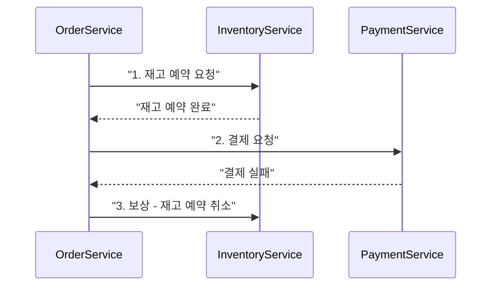

9~10장에서는 바운디드 컨텍스트로 도메인을 나누고, 애그리게이트으로 트랜잭션 경계를 설계했다. 그런데 그 경계 안의 데이터를 실제로 어디에, 어떤 형태로 저장할 것인가는 또 다른 질문이다. 주문 애그리게이트 하나만 봐도 결제는 강한 일관성이 필요한 반면, 상품 검색은 전문 검색엔진이 낫고, 로그인 세션은 밀리초 단위 응답이 필요한 키-값 저장소가 낫다. 한 종류의 데이터베이스로 이 모든 요구를 동시에 만족시키려 하면 어느 하나는 항상 손해를 본다. 이 장은 바운디드 컨텍스트 안에서 데이터를 어떤 저장소 전략과 일관성 패턴으로 다룰 것인지 — 폴리글랏 퍼시스턴스, CQRS, 이벤트 소싱, 그리고 분산 환경의 Saga·Outbox 패턴 — 을 다룬다.

## 이 장을 읽기 전에

**선행 지식**: 이 장은 [10장: DDD 전술적 설계](/post/software-architecture/ddd-tactical-design/)에서 다룬 애그리게이트(트랜잭션 일관성 경계)과 도메인 이벤트 개념을 전제로 한다. "애그리게이트 하나 = 하나의 트랜잭션 경계"라는 규칙을 이미 알고 있다면 충분하다.

**이 장의 깊이**: **중급~전문가**를 포괄한다. 폴리글랏 퍼시스턴스와 CQRS의 기본 개념은 중급 개발자도 바로 적용할 수 있고, 이벤트 소싱의 스냅샷 전략과 Saga·Outbox의 장애 처리 세부사항은 전문가 구간에서 다룬다.

**다루지 않는 것**: 특정 벤더의 성능 벤치마크 수치, 데이터 웨어하우스·OLAP 스키마 설계(스타 스키마, 슬로우리 체인징 디멘션 등), 물리적 정규화 세부 기법은 범위 밖이다. 분산 합의 알고리즘과 CAP/PACELC 정리의 이론적 배경은 [12장: 분산 시스템 아키텍처](/post/software-architecture/distributed-systems-architecture/)에서 본격적으로 다룬다.

## 당신의 수준에 맞는 경로

| 수준 | 읽을 부분 | 핵심 목표 |
|------|---------|---------|
| **중급자** | "폴리글랏 퍼시스턴스" ~ "CQRS" | 데이터 특성별 저장소 선택 기준과 읽기·쓰기 분리 |
| **전문가** | "이벤트 소싱" ~ "Saga와 Outbox 패턴" | 이벤트 재구성·스냅샷 전략, 분산 트랜잭션 대체 설계 |

---

## 폴리글랏 퍼시스턴스: 데이터 특성에 맞는 저장소 선택

**폴리글랏 퍼시스턴스(Polyglot Persistence)**는 애플리케이션이 다루는 데이터의 접근 패턴·일관성 요구·변경 빈도가 서로 다르다는 전제에서, 각 데이터에 가장 적합한 저장 기술을 개별적으로 선택해 조합하는 전략이다. 이 용어는 Scott Leberknight가 처음 사용했고, Martin Fowler가 2011년 블로그 글에서 "규모가 있는 기업이라면 데이터 종류에 따라 다양한 저장 기술을 함께 쓰게 될 것"이라는 문장으로 정리하며 널리 알려졌다. 배경은 단순하다. 관계형 데이터베이스는 트랜잭션 무결성과 관계 조회에 강하지만, ID로만 조회하고 트랜잭션이 필요 없는 요청에는 과도한 오버헤드를 유발하고, 반대로 스키마가 자주 바뀌는 데이터에는 매번 마이그레이션이 필요해 유연성이 떨어진다.

폴리글랏 퍼시스턴스의 핵심은 "저장소를 늘리는 것"이 아니라 **데이터 특성과 접근 패턴을 먼저 분석하고, 그 결과로 저장소가 갈리는 것**이다. 판단 기준은 크게 네 가지다. 첫째, 이 데이터가 트랜잭션 무결성(ACID)을 요구하는가, 아니면 최종 일관성으로 충분한가. 둘째, 스키마가 자주 바뀌는가, 아니면 안정적인가. 셋째, 조회 패턴이 키 기반 단순 조회인가, 관계 탐색인가, 전문 검색인가. 넷째, 응답 지연 요구가 밀리초 단위인가, 초 단위로 충분한가. 아래 표는 이 네 기준을 대표 데이터 유형에 적용한 예시다.

| 데이터 특성 | 대표 요구사항 | 적합한 저장소 유형 | 대표 기술 |
|---|---|---|---|
| 트랜잭션 무결성이 중요한 정형 데이터(주문, 결제) | ACID, 관계 무결성 | 관계형 DB | PostgreSQL |
| 스키마가 자주 바뀌는 반정형 데이터(상품 카탈로그) | 유연한 스키마, 수평 확장 | 문서 DB | MongoDB |
| 밀리초 단위 응답이 필요한 휘발성 데이터(세션, 캐시) | 초저지연, TTL(Time To Live) | 키-값/인메모리 저장소 | Redis |
| 자유 텍스트 검색이 필요한 데이터(상품 검색) | 역색인, 형태소 분석 | 검색 엔진 | Elasticsearch |

다음 예제는 전자상거래 시스템에서 이 네 가지 저장소를 함께 쓰는 최소 골격이다. 각 클래스는 자신이 속한 저장소의 관용구(관계형 엔티티, 문서, TTL 딸린 키-값, 역색인 문서)를 그대로 반영한다.

```java
import java.math.BigDecimal;
import java.util.List;
import java.util.Map;

// 1. 관계형 DB - 주문(트랜잭션 무결성이 중요)
class OrderRecord {
    String id;
    String customerId;
    BigDecimal totalAmount;
    String status; // CREATED, PAID, SHIPPED
}

// 2. 문서 DB - 상품 카탈로그(스키마가 카테고리마다 달라짐)
class ProductDocument {
    String id;
    String name;
    BigDecimal price;
    Map<String, Object> specifications; // 카테고리별로 필드가 다름
}

// 3. 키-값 저장소 - 세션(초저지연, TTL 필요)
class UserSession {
    String sessionId;
    String userId;
    long ttlSeconds = 3600L;
}

// 4. 검색 엔진 - 상품 검색(전문 검색, 형태소 분석)
class ProductSearchDocument {
    String id;
    String name;        // 한국어 분석기(analyzer)로 색인
    List<String> tags;
}
```

저장소를 나누는 순간 반드시 따라오는 질문이 있다 — 상품이 수정되면 관계형 DB의 원본, 검색엔진의 색인, 캐시의 사본을 어떻게 같은 값으로 맞출 것인가다. 흔한 접근은 **CDC(Change Data Capture)**로 원본 DB의 변경 로그를 읽어 이벤트로 발행하고, 각 저장소가 그 이벤트를 구독해 자신의 사본을 갱신하는 방식이다(Debezium이 PostgreSQL·MySQL의 WAL/binlog를 읽어 Kafka로 스트리밍하는 조합이 실무에서 흔히 쓰인다). 이 방식은 원본 DB에 대한 쓰기 코드를 건드리지 않고 동기화 로직을 추가할 수 있다는 장점이 있지만, 색인이 원본보다 늦게 갱신되는 **복제 지연(replication lag)** 구간이 항상 존재한다는 사실은 감수해야 한다.

**흔한 오해**: "마이크로서비스면 폴리글랏 퍼시스턴스가 필수"라는 생각은 원인과 결과를 뒤바꾼 것이다. 서비스 하나가 관계형 DB 하나만 써도 무방하다 — 폴리글랏 퍼시스턴스는 서비스 개수가 아니라 **그 서비스가 다루는 데이터의 접근 패턴이 이질적인가**로 결정한다. 반대로 "저장소를 여러 개 쓰면 무조건 폴리글랏 퍼시스턴스"라는 생각도 오해다. 근거 없이 유행을 따라 저장소를 늘리면 운영 복잡성(백업·모니터링·장애 대응 절차가 저장소 종류만큼 늘어남)만 커지고 이득은 없다. 저장소를 추가하기 전에 "이 데이터가 기존 저장소로 감당 안 되는 구체적인 이유"를 먼저 답할 수 있어야 한다.

## CQRS: 명령과 조회의 책임 분리

**CQRS(Command Query Responsibility Segregation)**는 상태를 변경하는 명령(Command) 모델과 상태를 조회하는 쿼리(Query) 모델을 별도의 모델·경로로 분리하는 아키텍처 패턴이다. 이 아이디어의 뿌리는 Bertrand Meyer가 1988년 저서 『Object-Oriented Software Construction』에서 제시한 **CQS(Command-Query Separation)** 원칙이다. CQS는 메서드 단위 규칙으로, "메서드는 상태를 바꾸는 명령이거나 값을 반환하는 조회 중 하나여야지 둘을 겸해서는 안 된다"고 말한다. Greg Young은 이 원칙을 메서드 수준에서 **아키텍처 수준**으로 확장해, 하나의 시스템 안에서 쓰기 모델과 읽기 모델 자체를 분리하자고 제안했다. Fowler는 2011년 블로그 글에서 이를 "정보를 갱신할 때 쓰는 모델과 읽을 때 쓰는 모델을 다르게 가져갈 수 있다는 발상"이라고 정리하며, 이 패턴을 Greg Young에게서 처음 들었다고 밝혔다.

CQRS가 실제로 동작하는 방식은 다음과 같다. 쓰기 경로는 도메인 로직이 담긴 정규화된 애그리게이트을 거쳐 트랜잭션으로 저장되고, 저장이 끝나면 도메인 이벤트를 발행한다. 읽기 경로는 그 이벤트를 구독해 화면·API가 그대로 쓰기 좋은 형태로 **비정규화**된 읽기 전용 뷰(Read Model)를 갱신해 둔다. 조회 요청은 애그리게이트을 전혀 거치지 않고 이 읽기 전용 뷰만 바라본다. 이렇게 나누는 이유는 쓰기와 읽기의 최적화 방향이 근본적으로 다르기 때문이다 — 쓰기는 불변식을 지키기 위해 정규화와 트랜잭션이 필요하고, 읽기는 조인 없이 한 번에 응답하기 위해 비정규화와 캐싱이 유리하다. 하나의 모델로 둘 다 만족시키려 하면 결국 어느 한쪽이 타협한다.

```java
// 쓰기 모델: 도메인 로직을 실행하고 이벤트를 발행한다
class CreateOrderCommand {
    String customerId;
    List<String> productIds;
}

class OrderCommandHandler {
    private final OrderRepository orderRepository;
    private final EventPublisher eventPublisher;

    OrderCommandHandler(OrderRepository orderRepository, EventPublisher eventPublisher) {
        this.orderRepository = orderRepository;
        this.eventPublisher = eventPublisher;
    }

    String handle(CreateOrderCommand command) {
        Order order = Order.create(command.customerId, command.productIds); // 불변식 검증
        orderRepository.save(order);
        eventPublisher.publish(new OrderCreatedEvent(order.getId(), order.getCustomerId()));
        return order.getId();
    }
}

// 읽기 모델: 이벤트를 구독해 비정규화된 뷰를 갱신한다
class OrderSummaryView {
    String orderId;
    String customerName;
    BigDecimal totalAmount;
    String status;
}

class OrderReadModelUpdater {
    private final OrderReadModelRepository readModelRepository;

    OrderReadModelUpdater(OrderReadModelRepository readModelRepository) {
        this.readModelRepository = readModelRepository;
    }

    void onOrderCreated(OrderCreatedEvent event) {
        OrderSummaryView view = new OrderSummaryView();
        view.orderId = event.getOrderId();
        view.status = "CREATED";
        readModelRepository.save(view); // 조인 없이 바로 응답 가능한 형태로 저장
    }
}
```

**흔한 오해**: "CQRS를 쓰려면 반드시 이벤트 소싱도 함께 써야 한다"는 오해가 가장 흔하다. 둘은 독립적인 패턴이다 — 쓰기 모델이 현재 상태만 저장하는 평범한 관계형 테이블이어도, 읽기 전용 뷰 테이블을 따로 두고 배치나 트리거로 동기화하면 그것만으로도 CQRS다. 이벤트 소싱은 쓰기 모델을 "이벤트의 시퀀스"로 저장하는 별도의 선택이며, CQRS와 자주 함께 쓰이긴 하지만 필수 조합은 아니다. 또 다른 오해는 "CQRS는 단순히 DAO를 Reader/Writer로 나누는 것"이라는 축소 해석이다 — 진짜 CQRS는 모델 자체(스키마, 저장소, 심지어 일관성 수준)가 갈라지는 것이지, 같은 테이블을 읽는 메서드 이름만 나누는 것이 아니다. Fowler 역시 단순 CRUD 화면에는 이 정도의 복잡성이 정당화되지 않는다고 경고한다 — 읽기·쓰기 패턴이 비슷한 단순 게시판류 서비스에 CQRS를 도입하면, 두 모델 사이의 동기화 지연(최종 일관성)이라는 새로운 버그 클래스만 얻고 실질적 이득은 없다.

## 이벤트 소싱: 상태를 이벤트의 로그로 저장하기

**이벤트 소싱(Event Sourcing)**은 객체의 현재 상태를 직접 저장하는 대신, 상태에 이르기까지 발생한 모든 변경을 이벤트의 순서 있는 로그로 저장하고, 현재 상태는 그 로그를 처음부터 재생(replay)해 계산하는 패턴이다. Martin Fowler는 2005년 글에서 이를 "애플리케이션 상태에 대한 모든 변경을 이벤트의 시퀀스로 캡처한다"고 정의했다. 이 접근의 뿌리는 회계 원장(ledger)에 있다 — 은행 계좌의 "현재 잔액"은 별도 필드가 아니라 입출금 내역을 모두 더한 결과이며, 과거 임의 시점의 잔액도 그 시점까지의 내역만 재생하면 복원된다. 이벤트 소싱은 이 사고방식을 애플리케이션 상태 전반에 적용한 것이다.

메커니즘을 정확히 이해하려면 세 가지 구성 요소를 구분해야 한다. **이벤트 스토어**는 애그리게이트 ID별로 이벤트를 순서대로 append-only로 저장하는 저장소다(관계형 테이블이든 전용 이벤트 스토어든 무방하다). **재구성(rehydration)**은 저장된 이벤트를 순서대로 읽어 애그리게이트의 `apply` 메서드에 하나씩 적용해 현재 상태를 복원하는 과정이다. **낙관적 동시성 제어**는 이벤트를 저장할 때 "내가 읽은 버전과 지금 저장소의 버전이 같은가"를 확인해, 두 명령이 동시에 같은 애그리게이트을 수정하려 할 때 충돌을 감지한다(락 없이도 정합성을 지키는 방법이다). 이벤트 개수가 많아지면 매번 처음부터 재생하는 비용이 커지므로, 실무에서는 주기적으로 현재 상태를 **스냅샷**으로 저장해 두고 "스냅샷 이후의 이벤트만" 재생하는 방식으로 비용을 줄인다.

```java
import java.time.LocalDateTime;
import java.util.ArrayList;
import java.util.List;
import java.util.UUID;

abstract class DomainEvent {
    final String eventId = UUID.randomUUID().toString();
    final LocalDateTime occurredOn = LocalDateTime.now();
}

class AccountOpenedEvent extends DomainEvent {
    final String accountId;
    final long initialBalanceCents;
    AccountOpenedEvent(String accountId, long initialBalanceCents) {
        this.accountId = accountId;
        this.initialBalanceCents = initialBalanceCents;
    }
}

class MoneyDepositedEvent extends DomainEvent {
    final String accountId;
    final long amountCents;
    MoneyDepositedEvent(String accountId, long amountCents) {
        this.accountId = accountId;
        this.amountCents = amountCents;
    }
}

// 이벤트 소싱 기반 애그리게이트: 상태는 이벤트를 재생한 결과일 뿐이다
class Account {
    private String id;
    private long balanceCents;
    private final List<DomainEvent> uncommitted = new ArrayList<>();

    static Account open(String id, long initialBalanceCents) {
        Account account = new Account();
        account.apply(new AccountOpenedEvent(id, initialBalanceCents));
        return account;
    }

    void deposit(long amountCents) {
        if (amountCents <= 0) throw new IllegalArgumentException("입금액은 0보다 커야 한다");
        apply(new MoneyDepositedEvent(this.id, amountCents));
    }

    // 새 이벤트 발생 시: 상태를 바꾸고 미확정 목록에 쌓는다
    private void apply(DomainEvent event) {
        when(event);
        uncommitted.add(event);
    }

    // 재구성 시: 저장된 이벤트를 순서대로 재생만 한다(부수효과 없이)
    static Account rehydrate(List<DomainEvent> history) {
        Account account = new Account();
        for (DomainEvent e : history) account.when(e);
        return account;
    }

    private void when(DomainEvent event) {
        if (event instanceof AccountOpenedEvent e) {
            this.id = e.accountId;
            this.balanceCents = e.initialBalanceCents;
        } else if (event instanceof MoneyDepositedEvent e) {
            this.balanceCents += e.amountCents;
        }
    }
}
```

**실전 사례**: 이벤트 소싱을 대규모 저지연 시스템에 적용한 대표 사례가 외환·주식 거래 플랫폼 LMAX다. Martin Fowler는 2011년 아티클에서 LMAX의 Business Logic Processor를 "입력 이벤트를 처리해 현재 상태를 완전히 도출할 수 있다"는 의미의 이벤트 소싱으로 설명하며, 이 처리기가 "메모리 안에서만 동작하고 별도의 데이터베이스나 영속 저장소를 두지 않는다"고 밝혔다. 디스크 I/O 없이 메모리 안에서 이벤트를 순차 처리하고, 장애 복구 시에는 이벤트 로그를 재생해 상태를 되살리는 방식으로 단일 스레드에서도 초당 수백만 건의 주문을 처리했다. 이 사례는 이벤트 소싱이 단순히 "감사 로그를 남기는 방법"이 아니라 **성능과 상태 복구를 동시에 얻는 구조적 선택**이 될 수 있음을 보여준다.

**흔한 오해**: "이벤트 소싱은 곧 메시지 큐를 쓰는 것"이라는 오해가 잦다. 이벤트 소싱의 본질은 이벤트를 **저장(persist)**해 상태의 원천으로 삼는 것이고, 메시지 큐는 그 이벤트를 다른 서비스에 **전달**하는 별개의 관심사다(이벤트 스토어에만 쓰고 아무 데도 발행하지 않아도 이벤트 소싱은 성립한다). 또 다른 흔한 함정은 이벤트 스키마를 처음 설계대로 영원히 고정할 수 있다고 가정하는 것이다 — 이벤트는 append-only이므로 과거 이벤트를 수정할 수 없고, 요구사항이 바뀌면 새 이벤트 버전을 추가하고 upcaster(구버전 이벤트를 신버전으로 변환하는 계층)로 흡수해야 한다. 이 버전 관리 비용을 처음부터 감안하지 않으면, 이벤트 소싱은 "삭제도 수정도 안 되는 로그"가 오히려 발목을 잡는 선택이 된다.

## 분산 데이터 일관성: Saga와 Outbox 패턴

애그리게이트 하나 안에서는 트랜잭션으로 일관성을 보장하면 되지만, 주문 처리처럼 재고·결제·배송이라는 서로 다른 애그리게이트(때로는 서로 다른 서비스)에 걸친 작업은 하나의 데이터베이스 트랜잭션으로 묶을 수 없다. 전통적인 해법인 2단계 커밋(2PC)은 모든 참여자를 잠근 채 커밋 여부를 조율하므로, 참여자 하나가 응답하지 않으면 전체가 블로킹되어 가용성을 해친다 — 분산 시스템에서 강한 일관성과 고가용성을 동시에 얻기 어렵다는 문제의 한 단면이다(이 트레이드오프는 12장의 CAP 정리에서 더 다룬다). **Saga 패턴**은 이 문제를 하나의 원자적 트랜잭션이 아니라, **지역 트랜잭션의 연쇄와 실패 시 보상(compensating) 트랜잭션**으로 우회한다. 이 개념은 Hector Garcia-Molina와 Kenneth Salem이 1987년 ACM SIGMOD 학회에서 발표한 논문「Sagas」에서 처음 제시했으며, 원 논문은 장기 실행 트랜잭션(Long-Lived Transaction)을 "인터리빙이 가능한 지역 트랜잭션들의 시퀀스로 표현하고, 전부 성공하거나 보상 트랜잭션으로 부분 실행을 되돌리는" 방식으로 정의했다.

Saga를 조율하는 방법은 두 가지로 나뉜다. **코레오그래피(choreography)** 방식은 각 서비스가 이전 단계의 이벤트를 구독해 스스로 다음 지역 트랜잭션을 실행하고, 중앙 조율자가 없다 — 서비스 간 결합도는 낮지만, 전체 흐름을 한눈에 파악하기 어렵고 순환 의존이 생기기 쉽다. **오케스트레이션(orchestration)** 방식은 중앙의 Saga 오케스트레이터가 각 단계를 순서대로 호출하고 실패 시 보상 절차를 지시한다 — 흐름이 한 곳에 명시되어 추적하기는 쉽지만, 오케스트레이터가 도메인 로직 일부를 떠안는 결합점이 된다. Chris Richardson은 microservices.io에서 Saga를 "각 지역 트랜잭션이 데이터베이스를 갱신하고 메시지·이벤트를 발행해 다음 지역 트랜잭션을 촉발하는 지역 트랜잭션의 시퀀스"라고 정의하며, 두 조율 방식 모두 이 정의를 만족한다.



Saga가 지역 트랜잭션을 어떻게 다음 단계로 연결하느냐는 또 다른 문제로 이어진다. "DB에 주문을 저장한 뒤 메시지 브로커에 이벤트를 발행한다"는 코드는 언뜻 자연스러워 보이지만 깨진 코드다.

```java
// 깨진 코드: DB 커밋과 메시지 발행이 원자적이지 않다
class OrderService {
    private final OrderRepository orderRepository; // 트랜잭션 참여
    private final MessageBroker messageBroker;      // 트랜잭션 미참여

    void placeOrder(Order order) {
        orderRepository.save(order);                     // (1) DB 커밋
        messageBroker.publish(new OrderCreatedEvent(order.getId())); // (2) 별개 시스템 호출
        // (1)은 성공하고 (2) 직전에 프로세스가 죽으면? 주문은 저장됐지만 아무도 이벤트를 못 받는다.
    }
}
```

원인은 데이터베이스 트랜잭션과 메시지 브로커 발행이 서로 다른 자원이라는 데 있다 — 둘을 하나의 트랜잭션으로 묶는 2PC는 브로커 대부분이 지원하지 않고, 지원하더라도 가용성을 해친다. 이를 **이중 쓰기 문제(dual-write problem)**라 부른다. **Outbox 패턴**은 "메시지 발행"을 별도 자원 호출이 아니라 **같은 DB 트랜잭션 안의 INSERT**로 바꿔서 이 문제를 없앤다. 주문을 저장하는 트랜잭션 안에 outbox 테이블 행도 함께 저장하고(같은 트랜잭션이므로 DB의 ACID가 그대로 적용된다), 별도의 relay 프로세스가 그 outbox 테이블을 폴링하거나 CDC로 읽어 실제 메시지 브로커에 발행한다. Chris Richardson은 이 패턴을 "메시지를 보내는 서비스가 비즈니스 엔티티를 갱신하는 트랜잭션의 일부로 먼저 메시지를 DB에 저장하고, 별도 프로세스가 그 메시지를 메시지 브로커로 보내는" 해법이라고 설명하며, 이렇게 하면 "데이터베이스 트랜잭션이 커밋될 때만, 그리고 반드시 커밋되면 메시지가 전송된다"고 강조한다.

```java
// 올바른 구현: outbox 행을 같은 트랜잭션에 함께 저장한다
class OutboxOrderService {
    private final OrderRepository orderRepository;
    private final OutboxRepository outboxRepository;

    @Transactional // 두 저장 모두 하나의 DB 트랜잭션으로 묶인다
    void placeOrder(Order order) {
        orderRepository.save(order);
        outboxRepository.save(new OutboxEvent(order.getId(), "OrderCreated", order.toJson()));
        // 커밋이 실패하면 order도 outbox 행도 둘 다 저장되지 않는다 - 반쪽 상태가 없다
    }
}

// 별도 프로세스: outbox 테이블을 읽어 실제 브로커로 릴레이한다
class OutboxRelay {
    void publishPending() {
        for (OutboxEvent event : outboxRepository.findUnpublished()) {
            messageBroker.publish(event);       // at-least-once 전달
            outboxRepository.markPublished(event.getId());
        }
    }
}
```

이 수정이 실제로 이중 쓰기 문제를 없앴는지는 정상 동작 테스트만으로는 확인되지 않는다 — 검증하려면 **커밋과 발행 사이에 프로세스가 죽는 상황을 의도적으로 재현**해야 한다. 통합 테스트 환경(Testcontainers 등으로 띄운 실제 PostgreSQL + 메시지 브로커)에서 "DB 커밋 직후, relay가 아직 폴링하기 전"에 프로세스를 강제 종료한 뒤 재시작해, 재시작한 relay가 outbox에 남은 미발행 행을 찾아 정확히 발행하는지 확인하는 장애 주입 테스트가 필요하다. 이 테스트가 통과해도 "메시지가 반드시 도착한다"는 보장이지 "정확히 한 번만 도착한다"는 보장은 아니라는 점은 짚어야 한다 — relay가 발행 후 `markPublished` 직전에 죽으면 같은 메시지가 재발행될 수 있으므로, Outbox 패턴은 본질적으로 **at-least-once** 전달이다.

**흔한 오해**: "Saga는 실패하면 롤백된다"는 표현은 오해를 부른다. Saga는 하나의 트랜잭션이 아니므로 데이터베이스가 자동으로 되돌려주는 롤백이 존재하지 않는다 — 이미 커밋된 지역 트랜잭션은 그대로 남고, 그 효과를 지우는 **새로운 보상 트랜잭션**을 개발자가 명시적으로 작성해야 한다("재고를 예약했다"를 "예약을 취소했다"로 되돌리는 것이지, 예약이 없었던 상태로 시간을 되돌리는 것이 아니다). 또 다른 오해는 "Outbox 패턴을 쓰면 멱등성은 신경 쓰지 않아도 된다"는 것이다. 방금 확인했듯 Outbox는 at-least-once 전달만 보장하므로, 같은 이벤트를 두 번 받아도 결과가 같도록 구독자 쪽에서 멱등키(idempotency key)나 이벤트 ID 중복 검사를 반드시 구현해야 한다.

## 실무 적용: 패턴을 언제 조합할 것인가

지금까지 다룬 네 패턴은 독립적으로 쓸 수도, 조합할 수도 있다. 조합 여부를 결정하는 기준은 유행이 아니라 **도메인이 요구하는 일관성 수준과 조회 복잡도**다. 데이터 접근 패턴이 균질하고 단순 CRUD로 충분한 서비스라면 폴리글랏 퍼시스턴스도 CQRS도 필요 없다 — 관계형 DB 하나로 시작하고, 실제 병목이 측정된 뒤에 저장소를 나누는 편이 안전하다. 조회 패턴이 쓰기 패턴과 크게 다르고(예: 쓰기는 초당 수십 건, 읽기는 초당 수만 건) 조인 비용이 응답 시간을 갉아먹기 시작하면 CQRS로 읽기 전용 뷰를 분리할 시점이다. 감사 추적이나 시점 조회(특정 시각의 상태 재현)가 법적·비즈니스 요구사항이라면 이벤트 소싱이 유력한 후보가 된다 — 다만 이벤트 스키마 버전 관리 비용을 감당할 팀 역량이 있는지가 전제다. 마지막으로 트랜잭션이 서비스 경계를 넘나드는 순간, 2PC로 갈 것인지 Saga로 갈 것인지를 정해야 하며, 대부분의 마이크로서비스 환경에서는 가용성을 지키기 위해 Saga와 Outbox를 함께 쓴다.

| 패턴 | 쓸 때 | 피할 때 |
|---|---|---|
| 폴리글랏 퍼시스턴스 | 데이터별 접근 패턴이 뚜렷이 다르고 측정된 병목이 있을 때 | 단일 저장소로 충분한 초기 단계, 팀의 운영 역량이 부족할 때 |
| CQRS | 읽기·쓰기 비율이 비대칭적이고 조회 모델이 복잡할 때 | 단순 CRUD, 읽기·쓰기 패턴이 비슷한 서비스 |
| 이벤트 소싱 | 감사 추적·시점 조회가 요구사항일 때 | 이벤트 스키마 변경 관리 역량이 없거나 단순 상태 저장으로 충분할 때 |
| Saga + Outbox | 트랜잭션이 서비스 경계를 넘고 2PC의 가용성 손실을 감당할 수 없을 때 | 모든 참여자가 한 데이터베이스 트랜잭션 안에 있을 때(그냥 트랜잭션을 쓰면 된다) |

## 학습 성과 평가 기준

- [ ] 폴리글랏 퍼시스턴스를 "저장소를 늘리는 것"이 아니라 "데이터 접근 패턴에 따라 저장소를 고르는 것"으로 설명할 수 있는가?
- [ ] CQRS의 쓰기 모델과 읽기 모델이 왜 서로 다른 정규화 수준을 갖는지 설명할 수 있는가?
- [ ] 이벤트 소싱에서 재구성(rehydration)과 스냅샷이 왜 필요한지, 그리고 이벤트 스키마 변경이 왜 까다로운지 설명할 수 있는가?
- [ ] 이중 쓰기 문제가 무엇인지, Outbox 패턴이 이를 어떻게 제거하는지 설명할 수 있는가?
- [ ] Saga의 보상 트랜잭션이 데이터베이스 롤백과 다른 이유를 설명할 수 있는가?
- [ ] 주어진 서비스 상황에서 위 네 패턴 중 무엇을 도입하고 무엇을 피할지 근거를 들어 판단할 수 있는가?

## 다음 장에서는

이 장에서는 애그리게이트 경계 안의 데이터를 어떤 저장소와 일관성 패턴으로 다룰지를 정리했다. 하지만 Saga와 Outbox가 전제하는 "네트워크 분할이 일어날 수 있다", "메시지는 순서가 뒤바뀌거나 중복될 수 있다"는 가정 자체는 아직 이론적으로 다루지 않았다. [12장: 분산 시스템 아키텍처](/post/software-architecture/distributed-systems-architecture/)에서는 CAP·PACELC 정리로 이 가정의 근거를 설명하고, 분산 합의 알고리즘과 샤딩·파티셔닝 전략까지 다룬다.

## 참고 및 출처

- Bertrand Meyer, 『Object-Oriented Software Construction』(1988) — CQS(Command-Query Separation) 원칙의 원저
- Hector Garcia-Molina, Kenneth Salem, "Sagas", *Proceedings of the 1987 ACM SIGMOD International Conference on Management of Data* (1987) — Saga 패턴 원 논문
- Martin Fowler, ["PolyglotPersistence"](https://martinfowler.com/bliki/PolyglotPersistence.html) (2011)
- Martin Fowler, ["CQRS"](https://martinfowler.com/bliki/CQRS.html) (2011)
- Martin Fowler, ["Event Sourcing"](https://martinfowler.com/eaaDev/EventSourcing.html) (2005)
- Martin Fowler, ["The LMAX Architecture"](https://martinfowler.com/articles/lmax.html) (2011)
- Chris Richardson, ["Saga"](https://microservices.io/patterns/data/saga.html), ["Transactional Outbox"](https://microservices.io/patterns/data/transactional-outbox.html), ["Database per Service"](https://microservices.io/patterns/data/database-per-service.html), microservices.io
