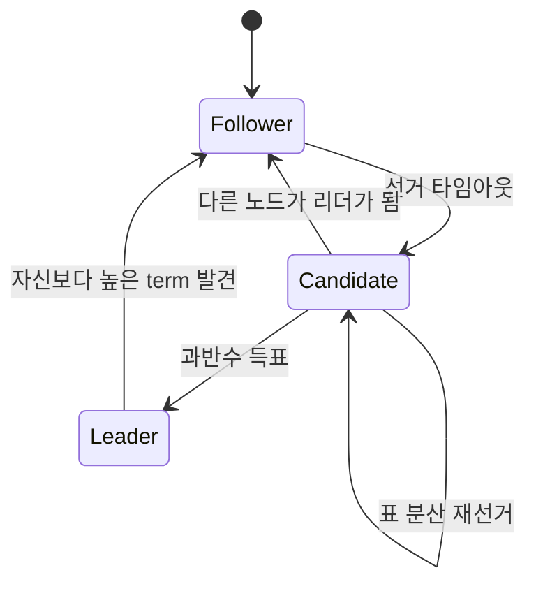
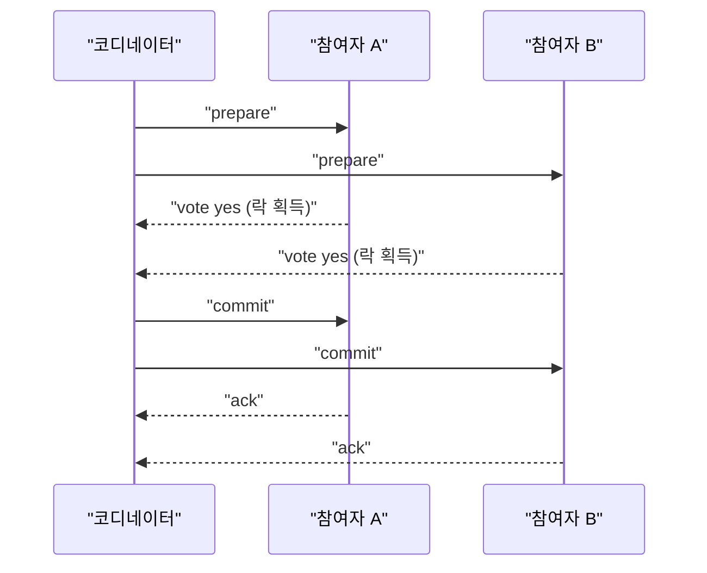
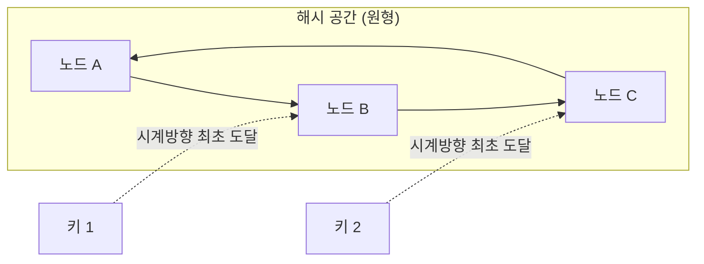

11장에서 폴리글랏 퍼시스턴스와 CQRS·이벤트 소싱으로 "데이터를 어떻게 저장하고 조회할 것인가"를 다뤘다면, 이 장은 그 데이터가 한 대의 서버가 아니라 네트워크로 연결된 여러 노드에 흩어져 있을 때 무엇이 근본적으로 달라지는지를 다룬다. 단일 프로세스 안에서는 함수 호출이 실패하지 않는다고 가정해도 대체로 무방하지만, 네트워크 너머의 호출은 응답이 오지 않을 때 상대가 실패한 것인지, 요청이 유실된 것인지, 아니면 처리는 끝났지만 응답만 늦는 것인지 구분할 수 없다. 이 근본적인 불확실성이 CAP 정리·합의 알고리즘·분산 트랜잭션·샤딩이라는, 언뜻 보면 서로 다른 네 주제를 하나로 묶는 공통의 뿌리다.

## 이 장을 읽기 전에

**완전한 초보자?** 이 장은 [11장: 데이터 아키텍처 전략](/post/software-architecture/data-architecture-strategy/)에서 다룬 폴리글랏 퍼시스턴스와 CQRS·이벤트 소싱을 전제로 한다. 특히 이벤트 소싱에서 "이벤트를 발행하고 나중에 여러 곳에서 소비한다"는 비동기 모델에 익숙하다면, 이 장에서 다루는 최종 일관성(eventual consistency)과 Saga 패턴이 낯설지 않을 것이다. 네트워크나 분산 컴퓨팅에 대한 사전 지식은 필요 없다 — 이 장 앞부분에서 "왜 분산 시스템이 어려운가"부터 시작한다.

**이 장의 깊이**: 이 장은 **초급~전문가**까지 폭넓게 다룬다. CAP·PACELC 정리는 개념을 이해하는 데 특별한 배경지식이 필요 없지만, Raft의 안전성 증명이나 2PC의 장애 시나리오 분석으로 갈수록 분산 시스템 실무 경험이 있어야 체감이 온다. **다루지 않는 것**: 이 장은 분산 시스템의 이론적 기반(합의·일관성·트랜잭션·파티셔닝)에 집중하며, 이 이론이 실제 클라우드 인프라(쿠버네티스, 서비스 메시)에서 어떻게 자동화되어 운영되는지는 다음 장인 [13장: 클라우드 네이티브 아키텍처](/post/software-architecture/cloud-native-architecture/)에서 다룬다. 벡터 시계·CRDT 같은 세부 일관성 알고리즘의 구현 디테일도 이 장의 범위 밖이다.

## 당신의 수준에 맞는 경로

| 수준 | 읽을 부분 | 핵심 목표 |
|------|---------|---------|
| 초보자 | "분산 시스템이 다른 이유" ~ "PACELC" | 네트워크 분할이 왜 문제인지 이해하고 CAP·PACELC로 시스템의 트레이드오프를 분류할 수 있다 |
| 중급자 | "분산 합의" ~ "샤딩과 파티셔닝" | Raft가 리더를 선출하고 로그를 복제하는 원리, 2PC와 Saga의 차이, 샤딩 전략별 장단점을 설명할 수 있다 |
| 전문가 | "자주 하는 오해" ~ "언제 무엇을 쓸지" | 각 기법의 숨은 비용(가용성 손실, 리밸런싱 비용)을 알고 조직·시스템 특성에 맞게 조합해 설계할 수 있다 |

---

## 분산 시스템이 다른 이유: 부분 실패와 여덟 가지 오해

단일 프로세스 안에서 두 함수를 순서대로 호출하면, 앞의 함수가 끝났다는 것은 곧 그 결과가 존재한다는 뜻이다. 실패하더라도 예외가 그 자리에서 던져지므로 호출자는 성공과 실패를 명확히 구분할 수 있다. 분산 시스템에서는 이 전제가 무너진다. 네트워크로 보낸 요청에 응답이 오지 않을 때, 그 원인은 요청이 상대에게 도달하지 못한 것일 수도 있고, 상대는 처리를 마쳤지만 응답이 돌아오는 길에 유실된 것일 수도 있고, 단순히 네트워크가 느려서 아직 오는 중일 수도 있다. 호출자 입장에서 이 세 경우는 "응답이 없다"는 동일한 관측으로 나타나며, 재시도가 안전한지(멱등성이 보장되는지)조차 이 구분 없이는 판단할 수 없다. 이런 상태를 부분 실패(partial failure)라 부르고, 단일 프로세스에는 없는 분산 시스템 고유의 난제다.

레슬리 램포트(Leslie Lamport)는 분산 시스템을 "자신이 알지도 못하는 컴퓨터의 고장으로 인해 자신의 컴퓨터를 쓸 수 없게 되는 시스템"이라고 정의했다고 널리 알려져 있다 — 정확한 원문과 발표 시점은 문헌마다 다르게 인용되지만, 이 정의가 짚는 핵심은 분산 시스템의 어려움이 "네트워크로 컴퓨터를 연결했다"는 사실 자체가 아니라 "실패의 범위를 예측할 수 없다"는 데 있다는 점이다. L. 피터 도이치(L. Peter Deutsch)는 1994년, 선 마이크로시스템즈의 동료들과 함께 분산 시스템을 설계하는 엔지니어가 흔히 암묵적으로 전제하지만 실제로는 거짓인 가정 일곱 가지를 정리했고, 자바의 창시자인 제임스 고슬링(James Gosling)이 1997년경 여덟 번째 가정을 추가하면서 오늘날 "분산 컴퓨팅의 여덟 가지 오류(Fallacies of Distributed Computing)"로 알려진 목록이 완성되었다.

| # | 잘못된 가정 | 실제로는 |
|---|---|---|
| 1 | 네트워크는 신뢰할 수 있다 | 패킷은 유실·중복·순서 변경될 수 있다 |
| 2 | 지연시간은 0이다 | 물리적 거리와 라우팅 홉마다 지연이 누적된다 |
| 3 | 대역폭은 무한하다 | 트래픽이 몰리면 대역폭이 병목이 된다 |
| 4 | 네트워크는 안전하다 | 중간자 공격·도청 위험이 상존한다 |
| 5 | 토폴로지는 변하지 않는다 | 오토스케일링·장애 복구로 노드가 수시로 바뀐다 |
| 6 | 관리자는 한 명이다 | 여러 팀·조직이 인프라 일부를 각자 관리한다 |
| 7 | 전송 비용은 0이다 | 직렬화·역직렬화·네트워크 사용에는 실제 비용이 든다 |
| 8 | 네트워크는 균질하다 | 하드웨어·프로토콜·성능 특성이 노드마다 다르다 |

여덟 가지 오류를 하나씩 암기하는 것보다 중요한 것은, 이 목록이 뒤에서 다룰 모든 이론의 출발점이라는 사실이다. CAP 정리의 "P"(분할 허용성)는 1번 오류가 현실이라는 것을 인정하는 데서 시작하고, 합의 알고리즘이 과반수 투표를 요구하는 이유는 3~5번 오류 때문에 소수 노드의 응답만으로는 전체 상태를 신뢰할 수 없기 때문이다. 뒤의 절들을 읽을 때 "이 메커니즘이 여덟 가지 오류 중 무엇을 다루려는 것인가"를 스스로 물어보면 각 이론이 왜 그런 형태로 설계되었는지가 훨씬 선명해진다.

## CAP 정리: 브루어의 추측에서 형식적 증명까지

CAP 정리는 네트워크 분할이 발생했을 때 분산 데이터 저장소가 일관성(Consistency)과 가용성(Availability)을 동시에 완전히 보장할 수 없다는 정리다. 여기서 일관성은 모든 노드가 항상 가장 최근에 쓰인 값을 읽는다는 뜻이고(선형성에 가까운 강한 정의다), 가용성은 장애가 없는 모든 노드가 모든 요청에 대해 (에러가 아닌) 응답을 반환한다는 뜻이며, 분할 허용성은 노드 간 메시지가 임의로 유실되어도 시스템이 계속 동작한다는 뜻이다. 에릭 브루어(Eric Brewer)는 2000년 ACM PODC(Principles of Distributed Computing) 심포지엄 기조연설에서 이 세 속성 중 최대 두 가지만 동시에 만족할 수 있다는 추측을 제시했다고 알려져 있으며, 이보다 앞서 1999년 아민 폭스(Armando Fox)와 함께 발표한 논문 "Harvest, Yield and Scalable Tolerant Systems"에서 관련 개념의 초기 형태를 다뤘다.

브루어의 주장은 2002년까지는 증명되지 않은 추측이었다. MIT의 세스 길버트(Seth Gilbert)와 낸시 린치(Nancy Lynch)는 논문 "Brewer's Conjecture and the Feasibility of Consistent, Available, Partition-Tolerant Web Services"(ACM SIGACT News, 2002)에서 이를 형식적으로 증명했다. 증명의 핵심 메커니즘은 단순하다 — 두 노드 A, B가 네트워크 분할로 서로 통신할 수 없는 상태에서, 클라이언트가 A에 쓰기 요청을 보내고 곧이어 B에 읽기 요청을 보낸다고 가정하자. B가 A의 쓰기를 반영한 최신 값을 반환하려면(일관성) A와 통신해 값을 확인해야 하는데, 분할 상태이므로 통신이 불가능하다. 이때 B에게 남은 선택은 둘 중 하나뿐이다. 오래된 값이거나 확인되지 않은 값을 반환해 일관성을 포기하거나, 응답 자체를 거부해 가용성을 포기하는 것이다. 분할이 실제로 존재하는 한 이 딜레마를 피할 방법이 없다는 것이 증명의 골자이며, 따라서 분할이 발생한 "그 순간"에는 C와 A 중 하나를 선택해야 한다.

```java
// CP 시스템: 복제본 동기화가 실패하면 응답 자체를 거부한다 (가용성 포기)
class ConsistentKeyValueStore {
    private final Map<String, String> primary;
    private final ReplicaClient replica;

    String write(String key, String value) {
        primary.put(key, value);
        try {
            replica.syncWrite(key, value); // 동기 복제 확인까지 대기
        } catch (NetworkPartitionException e) {
            primary.remove(key); // 롤백하고 실패를 알린다
            throw new ServiceUnavailableException("분할 상태: 일관성 보장을 위해 쓰기를 거부합니다");
        }
        return "OK";
    }
}

// AP 시스템: 복제본 동기화가 실패해도 로컬에는 우선 반영한다 (일관성 포기)
class AvailableKeyValueStore {
    private final Map<String, String> local;
    private final ReplicaClient replica;
    private final Queue<String> pendingSync = new ConcurrentLinkedQueue<>();

    String write(String key, String value) {
        local.put(key, value); // 로컬 반영은 항상 성공
        try {
            replica.asyncWrite(key, value); // 실패해도 무시하고 나중에 재동기화
        } catch (NetworkPartitionException e) {
            pendingSync.add(key); // 분할 복구 후 재동기화할 키만 기록
        }
        return "OK";
    }
}
```

두 코드는 같은 문제(복제본과 통신이 끊긴 상태에서의 쓰기)에 정반대로 반응한다. `ConsistentKeyValueStore`는 복제 확인이 안 되면 쓰기 자체를 취소해 "틀린 값을 절대 보여주지 않는다"는 약속을 지키는 대신 서비스가 멈출 수 있고, `AvailableKeyValueStore`는 로컬 반영을 즉시 성공시켜 응답성은 유지하되 복제본 간에 값이 잠시 어긋나는 상태(최종 일관성)를 감수한다. 실무에서 CP/AP는 시스템 전체가 아니라 오퍼레이션 단위로 섞어 쓰는 경우가 많다 — 같은 시스템이라도 결제 승인은 CP로, 상품 조회수 카운터는 AP로 설계하는 식이다.

## PACELC: 정상 상태에서도 트레이드오프는 있다

CAP 정리는 강력하지만 하나의 빈틈이 있다 — 분할이 없는 정상 상태에서는 무엇을 트레이드오프해야 하는지 말해주지 않는다. 예일대학교의 대니얼 아바디(Daniel Abadi)는 2010년 블로그 글 "Problems with CAP, and Yahoo's little known NoSQL system"에서 이 빈틈을 지적하며, 복제된 시스템은 분할 여부와 무관하게 항상 지연시간과 일관성 사이의 트레이드오프에 노출되어 있다고 주장했다. 그는 이 통찰을 2012년 논문 "Consistency Tradeoffs in Modern Distributed Database System Design"에서 PACELC라는 이름으로 정식화했다 — 분할(Partition)이 발생하면 가용성(Availability)과 일관성(Consistency) 중 선택해야 하고, 그렇지 않으면(Else) 지연시간(Latency)과 일관성(Consistency) 중 선택해야 한다는 뜻이다. 이 모델은 2018년 워치에흐 골라브(Wojciech Golab)의 논문 "Proving PACELC"(ACM SIGACT News, Vol. 49, No. 1)에서 수학적으로 형식화되었다. 아바디는 원래 블로그 글에서 PACELC의 정의를 다음과 같이 직접 제시했다.

> "if there is a partition (P) how does the system tradeoff between availability and consistency (A and C); else (E) when the system is running as normal in the absence of partitions, how does the system tradeoff between latency (L) and consistency (C)?" — Daniel Abadi, "Problems with CAP, and Yahoo's little known NoSQL system," *DBMS Musings*, 2010.

PACELC가 드러내는 정상 상태의 트레이드오프는 CAP만으로는 설명되지 않는 설계 결정을 이해하게 해준다. 여러 리전에 복제본을 둔 시스템이 모든 쓰기를 커밋하기 전에 전 리전의 확인을 기다리면 일관성은 강해지지만 대륙 간 왕복 지연시간만큼 응답이 느려진다. 반대로 로컬 리전에만 쓰고 즉시 응답한 뒤 백그라운드로 다른 리전에 전파하면 지연시간은 짧아지지만 그 사이 다른 리전에서 읽으면 오래된 값을 보게 된다. 분할이 전혀 없어도 이 선택은 매 요청마다 발생하며, 시스템은 이 축을 어느 한쪽으로 고정해서 설계된다.

| 유형 | 분할 시(PA/PC) | 정상 시(EL/EC) | 대표 시스템 |
|---|---|---|---|
| PA/EL | 가용성 우선 | 지연시간 우선 | Cassandra, DynamoDB |
| PC/EC | 일관성 우선 | 일관성 우선 | 전통적 관계형 DB(동기 복제 구성) |
| PC/EL | 일관성 우선 | 지연시간 우선 | Yahoo! PNUTS |

세 조합 중 PA/EC(분할 시 가용성, 정상 시 일관성)는 실무에서 거의 쓰이지 않는다 — 평소에는 강한 일관성을 위해 지연시간을 감수해 놓고, 정작 분할이라는 더 심각한 상황에서는 일관성을 포기하는 설계는 일관된 철학을 갖기 어렵기 때문이다. PNUTS가 PC/EL을 택한 것은 흥미로운 사례다. 레코드마다 지정된 "마스터" 리전에서만 쓰기를 허용해 분할 시에도 일관성을 지키면서(PC), 정상 상태에서는 비동기 복제로 읽기 지연시간을 낮췄다(EL) — CAP만 봤다면 "이 시스템이 CP인지 AP인지" 애매했을 설계가, PACELC로 보면 두 축의 선택이 서로 독립적이라는 것이 분명해진다.

## 분산 합의: Paxos에서 Raft까지

CAP과 PACELC가 트레이드오프의 지형을 그려준다면, 합의(consensus) 알고리즘은 그 지형에서 "여러 노드가 하나의 값에 대해 동의한다"는 구체적인 목표를 어떻게 달성할지 다룬다. 값이 하나라는 것이 사소해 보이지만, 이 값을 리더가 누구인지, 로그의 다음 항목이 무엇인지로 확장하면 분산 데이터베이스의 복제·리더 선출·장애 복구가 전부 합의 문제로 환원된다. 레슬리 램포트는 논문 "The Part-Time Parliament"(ACM Transactions on Computer Systems, 1998년 5월, 초고는 1989년)에서 그리스의 가상 섬 팍소스(Paxos)의 파트타임 의회를 비유로 들어 최초의 실용적 합의 알고리즘을 제시했다. Paxos는 정확성이 엄밀히 증명된 알고리즘이지만, 논문 특유의 비유적 서술과 여러 역할(proposer, acceptor, learner)이 뒤섞인 프로토콜 설명 때문에 "이해하기 어려운 알고리즘"이라는 평판을 얻었다.

디에고 온가로(Diego Ongaro)와 존 아우스터하우트(John Ousterhout)는 스탠퍼드대학교에서 수행한 연구를 논문 "In Search of an Understandable Consensus Algorithm"(2014 USENIX Annual Technical Conference)으로 발표하며 Raft를 제시했다. 논문 제목이 명시하듯 Raft의 설계 목표는 Paxos와 동등한 정확성을 유지하면서 이해하기 쉬운 구조로 재설계하는 것이었고, 이를 위해 문제를 리더 선출(leader election), 로그 복제(log replication), 안전성(safety) 세 부분으로 명확히 분리했다. 이 논문은 2014 USENIX ATC에서 최우수 논문상을 받았다.

Raft의 메커니즘은 시간을 term이라는 단위로 나누는 데서 시작한다. 각 term은 정확히 하나의 리더 선출로 시작하며, 모든 노드는 팔로워(follower)로 출발해 리더로부터 일정 시간(선거 타임아웃) 동안 하트비트를 받지 못하면 후보자(candidate)로 전환해 자신에게 투표하고 다른 노드에 투표를 요청한다. 과반수(전체 노드 수의 절반을 초과하는 수)의 표를 얻은 후보자가 해당 term의 리더가 되며, 리더는 이후 모든 쓰기 요청을 자신의 로그에 순서대로 추가하고 팔로워들에게 복제를 요청한다. 팔로워 과반수가 로그 항목 복제를 확인하면 그 항목은 "커밋"된 것으로 간주되어 상태 머신에 적용된다. 여기서 핵심은 과반수라는 기준이 CAP의 딜레마를 알고리즘 차원에서 구현한다는 점이다 — 노드 절반 이상과 통신할 수 없는 소수 파티션은 새 리더를 뽑지 못해 쓰기를 거부하므로(CP 쪽 선택), 분할이 나면 다수 쪽만 살아남고 소수 쪽은 가용성을 잃는다.



Raft가 로그 일관성을 지키는 방법도 이해하기 쉽게 설계되어 있다. 리더는 팔로워에게 로그 항목을 보낼 때 바로 앞 항목의 인덱스와 term을 함께 보내고, 팔로워는 자신의 로그에 그 항목이 동일한 term으로 존재하는지 확인한 뒤에만 새 항목을 받아들인다. 일치하지 않으면 팔로워는 요청을 거부하고, 리더는 일치하는 지점을 찾을 때까지 이전 항목들을 다시 보낸다. 이 절차 덕분에 "커밋된 로그 항목은 이후 선출되는 모든 리더의 로그에도 반드시 존재한다"는 안전성 속성이 성립하며, 이는 Ongaro와 Ousterhout이 논문에서 별도의 정리로 증명한 부분이다.

## 분산 트랜잭션: 2단계 커밋과 Saga 패턴

합의 알고리즘이 "하나의 값"에 대한 동의를 다룬다면, 분산 트랜잭션은 "여러 서비스에 걸친 일련의 쓰기가 전부 성공하거나 전부 실패해야 한다"는 원자성(atomicity) 요구를 다룬다. 짐 그레이(Jim Gray)는 IBM 연구 보고서 "Notes on Data Base Operating Systems"(1978)에서 2단계 커밋(Two-Phase Commit, 2PC) 프로토콜을 처음 제시했다고 알려져 있다. 메커니즘은 이름 그대로 두 단계로 나뉜다. 준비(prepare) 단계에서 코디네이터는 모든 참여자에게 트랜잭션을 커밋할 준비가 되었는지 묻고, 각 참여자는 자신의 변경 사항을 로그에 기록한 뒤 "예"로 응답하며 이 시점부터 해당 리소스에 락을 건다. 모든 참여자가 "예"로 응답하면 코디네이터는 커밋(commit) 단계로 넘어가 전원에게 최종 확정을 지시하고, 단 하나라도 "아니오"거나 응답이 없으면 전원에게 중단(abort)을 지시한다.



2PC의 근본적인 약점은 준비 단계 이후 코디네이터가 응답 없이 죽는 경우다. 참여자들은 이미 락을 건 채로 커밋도 중단도 지시받지 못한 "불확정(in-doubt)" 상태에 갇혀, 코디네이터가 복구될 때까지 해당 리소스를 계속 점유한다. 이 문제는 참여자가 늘어날수록, 그리고 네트워크가 불안정할수록 심각해지며, 앞서 CAP의 관점에서 보면 2PC는 강한 일관성을 위해 준비~커밋 사이 구간의 가용성을 명시적으로 포기하는 CP 성향의 프로토콜이다.

핵터 가르시아몰리나(Hector Garcia-Molina)와 케네스 세일럼(Kenneth Salem)은 논문 "Sagas"(ACM SIGMOD, 1987)에서 2PC의 대안을 제시했다. 이들의 문제의식은 오래 실행되는 트랜잭션(long-lived transaction)이 락을 오래 쥐고 있으면 짧은 트랜잭션들이 줄줄이 대기하게 된다는 것이었고, 해결책으로 하나의 긴 트랜잭션을 여러 개의 짧은 로컬 트랜잭션으로 쪼개는 사가(saga)를 제안했다. 사가의 각 단계는 자신의 리소스에 대해 즉시 커밋하며 락을 오래 쥐지 않는 대신, 뒤의 단계가 실패하면 이미 커밋된 앞 단계들을 되돌리기 위한 보상 트랜잭션(compensating transaction)을 역순으로 실행한다. 마이크로서비스 아키텍처가 확산된 2010년대 이후 이 패턴은 서비스 간 분산 트랜잭션을 다루는 사실상의 표준으로 재조명되었으며, 오케스트레이션(중앙 조정자가 각 단계를 순서대로 호출) 방식과 코레오그래피(각 서비스가 이벤트를 발행·구독해 다음 단계를 스스로 트리거) 방식 두 갈래로 구현된다. 코레오그래피 방식은 대개 메시지 큐나 이벤트 브로커를 매개로 삼아 서비스 간 직접 결합을 피한다.

```java
// 오케스트레이션 방식 Saga: 중앙 관리자가 순서와 보상을 조정한다
class OrderSaga {
    private final Deque<Runnable> compensations = new ArrayDeque<>();

    void execute(Order order) {
        try {
            reserveInventory(order);
            compensations.push(() -> releaseInventory(order));

            chargePayment(order);
            compensations.push(() -> refundPayment(order));

            scheduleShipment(order);
        } catch (SagaStepException e) {
            while (!compensations.isEmpty()) {
                compensations.pop().run(); // 역순으로 보상 실행
            }
            throw new OrderFailedException("주문 처리 실패, 보상 완료", e);
        }
    }
}
```

이 코드에서 주목할 점은 각 단계가 성공할 때마다 해당 보상 동작을 스택에 쌓아 둔다는 것이다. 마지막 단계(배송 예약)에서 실패하면 이미 성공한 결제·재고 예약을 역순으로 되돌리므로, 재고 해제가 결제 환불보다 먼저 실행되는 순서 오류를 방지한다. 다만 보상 트랜잭션 자체가 실패할 가능성(예: 환불 API가 일시적으로 응답하지 않는 경우)은 이 단순한 구현에 빠져 있으며, 실무에서는 보상 단계에 재시도와 데드레터 큐를 추가로 둔다. 2PC와 Saga의 근본적 차이는 "언제 되돌릴 수 있는가"에 있다 — 2PC는 커밋 전이라면 언제든 완전히 취소할 수 있지만 그 대가로 준비~커밋 구간의 락을 감수하고, Saga는 락 없이 빠르게 각 단계를 커밋하는 대신 이미 커밋된 것을 지우는 대신 "상쇄"하는 보상 로직을 별도로 설계해야 한다.

## 샤딩과 파티셔닝: 수평 확장의 메커니즘

지금까지의 절이 "같은 데이터의 여러 복제본을 어떻게 일관되게 유지할까"를 다뤘다면, 샤딩(sharding)은 반대 방향의 문제다 — 하나의 데이터셋이 한 노드에 담기에 너무 크거나 트래픽이 너무 많을 때, 데이터를 쪼개 여러 노드에 나눠 담는 것이다. 가장 단순한 전략은 해시 기반 샤딩으로, 키를 해시 함수에 넣어 나온 값을 샤드 개수로 나눈 나머지로 담당 샤드를 정한다. 이 방식은 키가 샤드 전체에 고르게 분산된다는 장점이 있지만, 샤드 개수 자체를 바꾸는 순간 거의 모든 키의 나머지 값이 달라져 데이터 대부분을 재배치해야 하는 문제가 있다. 범위 기반 샤딩은 키의 사전순 또는 값 범위로 담당 샤드를 나눠 범위 조회(range query)에 유리하지만, 특정 범위에 쓰기가 몰리면(예: 타임스탬프를 키로 쓰는 로그 데이터) 그 샤드만 과부하되는 핫스팟(hot spot) 문제가 생긴다.

해시 기반 샤딩의 재배치 문제는 데이비드 카거(David Karger) 등이 MIT에서 발표한 논문 "Consistent Hashing and Random Trees: Distributed Caching Protocols for Relieving Hot Spots on the World Wide Web"(ACM STOC, 1997)에서 컨시스턴트 해싱(consistent hashing)으로 해결되었다. 메커니즘은 키와 노드를 모두 하나의 원형 해시 공간(보통 0부터 2^32-1까지) 위에 배치하고, 각 키는 해시 공간을 시계 방향으로 순회했을 때 처음 만나는 노드가 담당하도록 하는 것이다. 노드가 하나 추가되거나 제거되면 그 노드의 바로 앞뒤 구간에 해당하는 키만 영향을 받고, 나머지 노드가 담당하는 키는 전혀 움직이지 않는다 — 일반 해시의 나머지 연산 방식이 노드 하나만 바뀌어도 거의 모든 키를 재배치해야 하는 것과 대조적이다. 컨시스턴트 해싱은 각 노드가 원 위에 여러 개의 가상 노드(virtual node)를 갖도록 확장하면 물리 노드 간 부하를 더 고르게 분산시킬 수 있다.



컨시스턴트 해싱을 실무에 적용한 대표 사례가 아마존이 SOSP 2007에서 발표한 논문 "Dynamo: Amazon's Highly Available Key-Value Store"(Giuseppe DeCandia 외, 2007)다. Dynamo는 컨시스턴트 해싱으로 데이터를 파티셔닝하고 각 파티션을 여러 노드에 복제한 뒤, 쓰기와 읽기마다 몇 개 노드의 응답을 확인할지(W, R 값)를 조정 가능하게 해 일관성과 가용성 사이의 지점을 애플리케이션이 직접 고를 수 있게 했다 — 이는 CAP을 시스템 전체가 아니라 오퍼레이션 단위 정책으로 다룬 초기 실무 사례로 꼽히며, 이 논문의 설계는 이후 카산드라(Cassandra) 등 여러 NoSQL 데이터베이스의 청사진이 되었다고 평가받는다. 어떤 샤딩 전략을 쓰든 여러 샤드에 걸친 조인이나 집계 쿼리는 애플리케이션이 각 샤드에 병렬로 질의한 뒤 결과를 합치는 크로스-샤드 조회로 처리해야 하며, 이는 단일 데이터베이스에서는 필요 없던 복잡성이다.

## 자주 하는 오해

**"CAP 정리는 시스템이 항상 C와 A 중 하나만 골라야 한다는 뜻이다"** — 길버트와 린치의 증명이 성립하는 조건은 네트워크 분할이 실제로 발생한 그 순간뿐이다. 분할이 없는 정상 상태에서는 이론상 C와 A를 동시에 만족할 수 있으며, 이 정상 상태의 트레이드오프(지연시간 대 일관성)를 별도로 다루기 위해 PACELC가 나왔다는 것을 앞서 짚었다. "우리 시스템은 AP다"라는 말은 "분할이 났을 때 가용성을 택한다"는 뜻이지 "평소에도 일관성을 신경 쓰지 않는다"는 뜻이 아니다.

**"Raft나 Paxos 같은 합의 알고리즘을 쓰면 고가용성이 자동으로 보장된다"** — 합의 알고리즘은 정반대로 가용성을 일부 희생해 일관성을 얻는 도구다. Raft 클러스터는 노드 과반수가 서로 통신 가능해야만 새 리더를 뽑고 쓰기를 처리할 수 있으므로, 5노드 클러스터에서 3개 노드가 동시에 죽거나 분리되면 나머지 2개 노드는 과반수를 채우지 못해 쓰기를 거부한다. "합의 알고리즘을 도입했다"는 것은 "가용성을 포기하더라도 데이터가 틀리지 않게 하겠다"는 명시적 선택이지, 장애를 완전히 무력화하는 마법이 아니다.

**"샤딩은 단순히 데이터를 여러 서버에 나눠 담는 것뿐이다"** — 샤딩의 실질적 비용은 나누는 순간이 아니라 그 이후에 나타난다. 크로스-샤드 조인·집계는 애플리케이션 코드가 직접 처리해야 하고, 샤드 간 부하가 불균형해지면(핫스팟) 리밸런싱이 필요한데 해시 기반 샤딩은 이 리밸런싱 비용이 특히 크다. 트랜잭션이 여러 샤드에 걸쳐야 하는 경우(예: 두 사용자 계좌 간 송금이 다른 샤드에 있을 때) 결국 앞서 다룬 2PC나 Saga 같은 분산 트랜잭션 기법이 다시 필요해진다 — 샤딩이 분산 트랜잭션 문제를 없애주는 것이 아니라 오히려 만들어내는 경우가 많다.

## 언제 무엇을 쓸지

| 상황 | 권장 접근 | 이유 |
|---|---|---|
| 금융 거래처럼 오차가 곧 손실인 도메인 | CP 설계 + 필요 시 2PC | 틀린 값을 보여주느니 서비스를 잠시 멈추는 편이 안전하다 |
| 조회수·좋아요처럼 정확도보다 응답성이 중요한 도메인 | AP 설계 + 최종 일관성 | 약간의 지연된 반영을 감수하고 항상 응답한다 |
| 마이크로서비스 간 여러 단계로 이어지는 주문·예약 흐름 | Saga(오케스트레이션 또는 코레오그래피) | 락을 오래 쥐지 않고 각 서비스가 자율적으로 커밋할 수 있다 |
| 클러스터의 리더·설정값처럼 단일 진실 공급원이 필요한 상태 | Raft 기반 합의(etcd, Consul 등) | 과반수 합의로 분할 상황에서도 데이터가 갈라지지 않는다 |
| 데이터가 한 노드 용량을 초과하거나 트래픽이 지역적으로 편중 | 컨시스턴트 해싱 기반 샤딩 | 노드 추가·제거 시 재배치 범위를 최소화한다 |
| 팀 규모가 작고 트래픽이 단일 서버로 충분히 처리되는 초기 단계 | 단일 노드 + 정기 백업 | 분산 시스템의 복잡성을 감수할 이유가 아직 없다 |

이 표의 반대 방향도 성립한다. 아직 사용자 수가 적어 단일 데이터베이스로 충분한 서비스가 미리 샤딩부터 도입하면, 크로스-샤드 쿼리의 복잡성만 떠안고 얻는 이득은 없다. 반대로 이미 단일 노드로는 감당할 수 없는 트래픽을 겪으면서도 샤딩을 미루면, 장애 발생 시 데이터 손실이나 긴 다운타임으로 훨씬 큰 비용을 치른다.

## 학습 성과 평가 기준

- [ ] 부분 실패가 단일 프로세스의 실패와 왜 근본적으로 다른지, 분산 컴퓨팅의 여덟 가지 오류 중 최소 세 가지를 예시와 함께 설명할 수 있는가?
- [ ] CAP 정리가 성립하는 조건(네트워크 분할 발생 시)을 정확히 이해하고, 자신의 시스템이 CP인지 AP인지 오퍼레이션 단위로 판단할 수 있는가?
- [ ] PACELC가 CAP에 무엇을 추가했는지, PA/EL·PC/EC·PC/EL 세 조합을 실제 시스템 예시와 함께 설명할 수 있는가?
- [ ] Raft의 리더 선출과 로그 복제 메커니즘, 그리고 과반수 요건이 가용성에 미치는 영향을 설명할 수 있는가?
- [ ] 2PC와 Saga의 원자성 보장 방식 차이(락 기반 취소 대 보상 트랜잭션)를 설명하고 상황에 맞게 선택할 수 있는가?
- [ ] 해시 기반·범위 기반·컨시스턴트 해싱 샤딩 전략의 재배치 비용 차이를 설명하고, 샤딩 도입 여부를 트레이드오프에 근거해 판단할 수 있는가?

## 다음 장에서는

13장 **「클라우드 네이티브 아키텍처」**에서는 이 장에서 다룬 분산 시스템의 근본 난제(부분 실패, 합의, 분산 트랜잭션)를 클라우드 인프라가 어떻게 자동화해 다루는지 살펴본다. 컨테이너 오케스트레이션이 노드 장애를 감지해 재스케줄링하는 것도, 서비스 메시가 재시도·회로 차단기로 부분 실패를 흡수하는 것도 결국 이 장에서 다룬 문제의 실무적 해법이다. 이 장이 "분산 시스템이 왜 어렵고 무엇을 트레이드오프해야 하는가"였다면, [다음 장](/post/software-architecture/cloud-native-architecture/)은 "그 어려움을 인프라 계층에서 어떻게 감춰주는가"를 다룬다.

## 참고 및 출처

- Seth Gilbert, Nancy Lynch, ["Brewer's Conjecture and the Feasibility of Consistent, Available, Partition-Tolerant Web Services"](https://users.ece.cmu.edu/~adrian/731-sp04/readings/GL-cap.pdf), *ACM SIGACT News*, Vol. 33, No. 2, 2002.
- ["CAP theorem"](https://en.wikipedia.org/wiki/CAP_theorem), Wikipedia — Eric Brewer의 2000년 PODC 발표 및 Fox·Brewer 1999년 논문 배경 정리.
- Daniel Abadi, ["Problems with CAP, and Yahoo's little known NoSQL system"](https://dbmsmusings.blogspot.com/2010/04/problems-with-cap-and-yahoos-little.html), *DBMS Musings*, 2010.
- Wojciech Golab, ["Proving PACELC"](https://uwaterloo.ca/distributed-algorithms-systems-lab/sites/default/files/uploads/files/proving_pacelc.pdf), *ACM SIGACT News*, Vol. 49, No. 1, 2018, pp. 73-81.
- Leslie Lamport, "The Part-Time Parliament," *ACM Transactions on Computer Systems*, Vol. 16, No. 2, 1998 (초고 1989).
- Diego Ongaro, John Ousterhout, ["In Search of an Understandable Consensus Algorithm (Extended Version)"](https://raft.github.io/raft.pdf), *2014 USENIX Annual Technical Conference*.
- Jim Gray, "Notes on Data Base Operating Systems," *Operating Systems: An Advanced Course*, Lecture Notes in Computer Science Vol. 60, Springer-Verlag, 1978.
- Hector Garcia-Molina, Kenneth Salem, ["Sagas"](https://sigmodrecord.org/1987/12/09/sagas/), *ACM SIGMOD Record*, Vol. 16, No. 3, 1987, pp. 249-259.
- David Karger et al., "Consistent Hashing and Random Trees: Distributed Caching Protocols for Relieving Hot Spots on the World Wide Web," *Proceedings of the 29th ACM Symposium on Theory of Computing (STOC)*, 1997.
- Giuseppe DeCandia et al., ["Dynamo: Amazon's Highly Available Key-Value Store"](https://www.allthingsdistributed.com/files/amazon-dynamo-sosp2007.pdf), *Proceedings of the 21st ACM Symposium on Operating Systems Principles (SOSP)*, 2007.
- ["Fallacies of distributed computing"](https://en.wikipedia.org/wiki/Fallacies_of_distributed_computing), Wikipedia — L. Peter Deutsch(1994)·James Gosling(1997경)의 여덟 가지 오류 정리.
