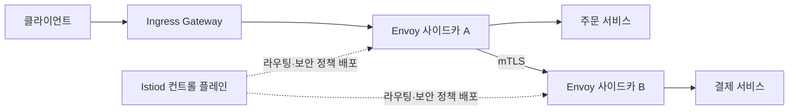
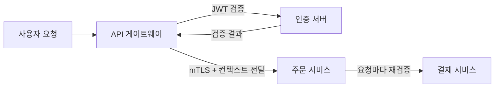

## 왜 클라우드 네이티브 아키텍처가 필요한가

[12장 분산 시스템 아키텍처](/post/software-architecture/distributed-systems-architecture/)에서 다룬 CAP 정리, 합의 알고리즘, Saga 패턴은 "여러 노드에 걸친 시스템을 어떻게 설계할 것인가"라는 이론이다. 클라우드 네이티브 아키텍처는 그 이론을 실제 인프라 위에서 구현하는 실천 방법론이다. 가상 머신 한 대에 애플리케이션을 고정 배치하던 시절에는 서버가 죽으면 사람이 개입해 복구했고, 트래픽이 몰리면 더 큰 서버로 교체(수직 확장)하는 것이 일반적이었다. 이 방식은 확장에 시간이 걸리고, 장애 복구가 수동적이며, 인프라 비용이 실제 사용량과 무관하게 고정된다는 한계를 가진다. Cloud Native Computing Foundation(CNCF)은 이런 한계를 극복하기 위한 실천을 다음과 같이 정의한다.

> "Cloud native practices empower organizations to develop, build, and deploy workloads in computing environments (public, private, hybrid cloud) to meet their organizational needs at scale in a programmatic and repeatable manner. It is characterized by loosely coupled systems that interoperate in a manner that is secure, resilient, manageable, sustainable, and observable."
> — CNCF Technical Oversight Committee, 『CNCF Cloud Native Definition』 v1.1 (2024-02-26), [github.com/cncf/toc](https://github.com/cncf/toc/blob/main/DEFINITION.md)

이 정의의 핵심은 "클라우드에서 실행되는가"가 아니라 "느슨하게 결합되고, 안전하며, 복원력 있고, 관찰 가능한 방식으로 상호운용하는가"에 있다. 같은 문서는 이런 특성을 구현하는 대표 기술로 컨테이너, 서비스 메시, 마이크로서비스, 불변 인프라, 선언적 API를 든다. 이 장은 그 기술 스택을 네 개의 층으로 나눠 다룬다. 애플리케이션이 클라우드 환경에서 살아남도록 설계하는 원칙(12 Factor App), 애플리케이션을 실행하는 단위(컨테이너와 사이드카 패턴), 서비스 간 통신을 관리하는 인프라 계층(서비스 메시), 그리고 이 모든 것을 관통하는 보안 모델(Zero Trust)이다. 이 네 층은 독립적이지 않다 — 12 Factor App의 무상태 프로세스 원칙이 없으면 컨테이너를 자유롭게 재시작할 수 없고, 컨테이너 경계가 없으면 서비스 메시가 트래픽을 가로챌 지점이 없으며, 서비스 메시의 상호 인증 없이는 Zero Trust를 자동화하기 어렵다.

## 이 장을 읽기 전에

이 장은 [12장 분산 시스템 아키텍처](/post/software-architecture/distributed-systems-architecture/)에서 다룬 CAP 정리·합의·데이터 일관성 전략을 이미 이해하고 있다고 전제한다. 또한 4장에서 소개한 마이크로서비스 아키텍처의 기본 개념(서비스 경계, 독립 배포)을 알고 있다면 컨테이너·서비스 메시가 왜 필요한지 더 빨리 이해할 수 있다. 이 장의 난이도는 초급(컨테이너를 처음 다뤄보는 개발자)부터 전문가(서비스 메시 도입 여부를 조직 차원에서 결정하는 아키텍트)까지 걸쳐 있으며, 전문가 구간에서는 Kubernetes 네이티브 사이드카의 내부 재시작 정책, Envoy 데이터 플레인의 역사, 서비스 메시 도입의 실제 비용 구조까지 다룬다. 다만 이 장은 특정 클라우드 벤더(AWS·Azure·GCP)의 개별 서비스 카탈로그 비교, Kubernetes 클러스터 자체의 운영(오토스케일러 튜닝, etcd 백업, 노드 프로비저닝)이나 Terraform 같은 IaC 도구의 사용법은 다루지 않는다. 이런 주제는 별도의 클라우드 인프라 운영 자료를 참고해야 한다.

### 당신의 수준에 맞는 경로

| 수준 | 읽을 부분 | 핵심 목표 |
|---|---|---|
| 초급 (컨테이너를 처음 접함) | "클라우드 네이티브란 무엇인가" ~ "컨테이너 아키텍처 패턴" | 12 Factor 원칙과 컨테이너·사이드카 개념을 이해하고 단순한 애플리케이션을 컨테이너로 패키징할 수 있다 |
| 중급 (마이크로서비스를 운영해 본 경험) | "서비스 메시 아키텍처" ~ "클라우드 보안 아키텍처: Zero Trust" | Istio 기반 트래픽 분할·Circuit Breaker를 설계하고 mTLS·NetworkPolicy로 Zero Trust 보안을 적용할 수 있다 |
| 전문가 (조직 규모의 아키텍처 결정) | "언제 도입하고 언제 피할 것인가" ~ "평가 기준" | 서비스 메시·Zero Trust 도입의 트레이드오프를 근거를 들어 평가하고, 조직 규모와 성숙도에 맞는 채택 여부를 결정할 수 있다 |

## 클라우드 네이티브란 무엇인가

"클라우드 네이티브"라는 표현은 흔히 "클라우드에서 실행되는 애플리케이션"으로 오해되지만, 위에서 인용한 CNCF의 정의가 강조하듯 실제로는 **설계 원칙과 운영 관행의 집합**을 가리킨다. 온프레미스 서버를 그대로 가상 머신 이미지로 옮겨 AWS EC2에 올려도 그 애플리케이션은 클라우드 네이티브가 아니다 — 여전히 특정 서버에 상태를 갖고, 수동으로 스케일하며, 장애 시 사람이 개입해야 한다면 CNCF가 말하는 "느슨하게 결합되고 복원력 있는" 시스템이 아니기 때문이다. 반대로 온프레미스 Kubernetes 클러스터 위에서 무상태로 동작하고 자동으로 재시작되며 선언적 설정으로 배포되는 애플리케이션은 클라우드 사업자 없이도 클라우드 네이티브 원칙을 따른다고 볼 수 있다.

이 개념적 구분이 실무에서 중요한 이유는, 조직이 "클라우드 마이그레이션"과 "클라우드 네이티브 전환"을 혼동하면 인프라만 옮기고 아키텍처는 그대로 둔 채 비용만 늘어나는 결과를 얻기 때문이다(이른바 "lift and shift"). 이어지는 절에서 다루는 12 Factor App, 컨테이너, 서비스 메시, Zero Trust는 모두 "인프라를 어디에 두는가"가 아니라 "애플리케이션과 그 통신을 어떻게 설계해야 동적인 환경에서 안전하게 확장·복구되는가"에 대한 구체적 답이다.

## 12 Factor App 원칙

### 탄생 배경과 메커니즘

12 Factor App은 Heroku의 엔지니어 Adam Wiggins가 정리해 2011년 무렵 공개하고 2017년까지 갱신한 방법론으로, PaaS(Platform as a Service)인 Heroku 위에서 수백 개의 SaaS 애플리케이션을 운영하며 반복적으로 관찰한 안티패턴을 원칙 형태로 정리한 것이다. 공식 문서는 스스로를 표준이나 사양이 아니라 "이 문서의 기여자들이 수백 개의 앱을 개발·배포하며 직접 관여한 경험"에서 나온 방법론이라고 소개한다(12factor.net, Adam Wiggins, 최종 갱신 2017년). 즉 이론에서 연역된 규칙이 아니라, "왜 이 앱은 스케일이 안 되는가"라는 실패 사례에서 귀납적으로 도출된 체크리스트라는 점이 이 원칙의 성격을 이해하는 데 중요하다.

12개 원칙의 메커니즘은 크게 세 가지 축으로 묶인다. 첫째는 **환경 독립성**이다. 코드베이스는 하나이되 배포 환경마다 다른 것은 설정(환경 변수)뿐이어야 하며, 이는 같은 빌드 산출물을 개발·스테이징·프로덕션에 그대로 승격시킬 수 있게 한다 — 환경마다 다시 빌드하면 "스테이징에서는 됐는데 프로덕션에서 안 된다"는 문제가 빌드 차이 때문인지 설정 차이 때문인지 구분할 수 없어진다. 둘째는 **무상태·수평 확장성**이다. 프로세스는 로컬 디스크나 메모리에 세션을 저장하지 않고 모든 상태를 데이터베이스나 캐시 같은 백엔드 서비스에 위임해야 하는데, 이렇게 해야 로드 밸런서가 어느 인스턴스로 요청을 보내도 결과가 같고, 인스턴스를 몇 개 추가하거나 제거해도(수평 확장) 애플리케이션 동작이 깨지지 않는다. 셋째는 <strong>폐기 가능성(disposability)</strong>이다. 프로세스는 시작 신호(SIGTERM 등)를 받으면 새 요청을 거부하고 진행 중인 요청만 마무리한 뒤 종료해야 하는데, 이 메커니즘이 있어야 오케스트레이터(Kubernetes 등)가 트래픽 손실 없이 인스턴스를 자유롭게 죽이고 새로 띄울 수 있다.

다음 예제는 설정 외부화와 무상태 프로세스, 폐기 가능성이라는 세 원칙이 실제 코드에서 어떻게 나타나는지 보여준다.

```java
// III. 설정(Config) - 환경 변수로 주입, 코드에 하드코딩하지 않음
@Configuration
public class DatabaseConfig {

    @Value("${DATABASE_URL}")
    private String databaseUrl;

    @Bean
    public DataSource dataSource() {
        HikariConfig config = new HikariConfig();
        config.setJdbcUrl(databaseUrl); // 환경마다 다른 값이지만 빌드는 동일
        return new HikariDataSource(config);
    }
}

// VI. 프로세스(Processes) - 무상태로 실행, 상태는 인스턴스 변수에 두지 않음
@RestController
public class OrderController {

    private final OrderService orderService;

    @PostMapping("/orders")
    public ResponseEntity<Order> createOrder(@RequestBody CreateOrderRequest request) {
        // 세션이나 필드에 상태를 저장하지 않고, 모든 상태는 DB로 위임
        Order order = orderService.createOrder(request);
        return ResponseEntity.ok(order);
    }
}

// IX. 폐기 가능(Disposability) - SIGTERM 수신 시 진행 중인 요청을 마치고 종료
@Component
public class GracefulShutdown implements ApplicationListener<ContextClosedEvent> {

    @Override
    public void onApplicationEvent(ContextClosedEvent event) {
        log.info("종료 신호 수신, 진행 중인 요청을 완료한 뒤 리소스를 정리합니다");
    }
}
```

이 코드에서 주의할 점은, 세 원칙 모두 애플리케이션 코드만으로는 완결되지 않는다는 것이다. `DATABASE_URL`을 환경 변수로 읽어도 오케스트레이터가 그 값을 안전하게 주입하지 않으면 무의미하고, `GracefulShutdown`이 있어도 오케스트레이터가 SIGTERM 뒤에 강제 종료(SIGKILL)까지 유예 시간을 충분히 주지 않으면 종료 로직이 끝까지 실행되지 못한다. 즉 12 Factor App은 애플리케이션 설계 원칙이지만, 그 효과는 다음 절에서 다루는 컨테이너 오케스트레이터의 동작과 짝을 이뤄야 완성된다.

### 12개 원칙 한눈에 보기

| # | 원칙 | 핵심 아이디어 |
|---|------|--------------|
| I | Codebase | 코드베이스 하나, 배포는 여러 개 |
| II | Dependencies | 의존성을 명시적으로 선언하고 격리 |
| III | Config | 설정은 환경 변수에, 코드와 분리 |
| IV | Backing Services | DB·큐·캐시를 교체 가능한 연결된 자원으로 취급 |
| V | Build, Release, Run | 빌드·릴리스·실행 단계를 엄격히 분리 |
| VI | Processes | 무상태 프로세스로 실행 |
| VII | Port Binding | 포트 바인딩으로 서비스를 자체 노출 |
| VIII | Concurrency | 프로세스 모델로 수평 확장 |
| IX | Disposability | 빠른 시작과 우아한 종료 |
| X | Dev/Prod Parity | 개발·스테이징·프로덕션 환경을 최대한 동일하게 |
| XI | Logs | 로그를 파일이 아닌 이벤트 스트림으로 취급 |
| XII | Admin Processes | 일회성 관리 작업을 일회성 프로세스로 실행 |

### 흔한 오개념: "12 Factor는 지금도 그대로 적용해야 하는 고정 규칙이다"

12 Factor App은 컨테이너 오케스트레이션과 서비스 메시가 보편화되기 전인 2011–2017년 Heroku PaaS 환경을 배경으로 작성됐다. Pivotal의 Kevin Hoffman은 저서 『Beyond the Twelve-Factor App』(Pivotal, 2016)에서 원래의 12개 원칙에 API 우선 설계, 원격 측정(telemetry), 인증과 인가를 별도 팩터로 추가해 15개로 확장했는데, 이는 Kubernetes와 서비스 메시가 보편화되면서 관찰 가능성과 보안이 더 이상 "있으면 좋은 것"이 아니라 배포 가능성 자체의 전제 조건이 됐기 때문이다. 따라서 12 Factor를 암기해야 할 불변의 규칙으로 대하기보다, "이 원칙이 지금 우리 인프라에서 여전히 유효한 이유는 무엇인가"를 스스로 확인하는 편이 낫다 — 예를 들어 서버리스 함수 환경에서는 VII(포트 바인딩)이 플랫폼에 의해 대체되고, XI(로그를 이벤트 스트림으로)는 오늘날 사실상 모든 컨테이너 오케스트레이터의 기본 동작이라 원칙이라기보다 전제에 가깝다.

## 컨테이너 아키텍처 패턴

### 컨테이너가 격리를 만드는 방식

컨테이너는 가상 머신과 달리 별도의 게스트 운영체제를 띄우지 않고, 리눅스 커널의 네임스페이스(namespace)로 프로세스·네트워크·파일시스템 뷰를 격리하고 cgroups로 CPU·메모리 사용량을 제한하는 방식으로 동작한다. 이 메커니즘 때문에 컨테이너는 가상 머신보다 시작이 빠르고(커널 부팅이 없음) 오버헤드가 작지만, 커널을 호스트와 공유하므로 커널 취약점에 대해서는 가상 머신보다 격리 수준이 낮다는 트레이드오프를 가진다. 이미지는 레이어로 구성되어 캐싱되므로, 자주 바뀌는 애플리케이션 코드 레이어를 마지막에 두면 빌드 캐시 재사용률이 높아진다.

Kubernetes는 컨테이너를 개별로 스케줄링하지 않고 **Pod**라는 단위로 묶는다. 공식 문서는 Pod를 "공유 스토리지와 네트워크 자원을 가지며, 컨테이너를 어떻게 실행할지에 대한 명세를 가진 하나 이상의 컨테이너 그룹"으로 정의하고, Pod 안의 컨테이너는 항상 같은 위치에 배치되고 같은 스케줄링 결정을 공유한다고 설명한다(Kubernetes 공식 문서, [kubernetes.io/docs/concepts/workloads/pods](https://kubernetes.io/docs/concepts/workloads/pods/)). 이 정의가 사이드카 패턴이 성립하는 근거다 — 메인 컨테이너와 보조 컨테이너가 네트워크 네임스페이스를 공유하므로, 사이드카가 `localhost`로 메인 컨테이너와 통신할 수 있다.

### 사이드카 패턴의 실제 동작

**사이드카(Sidecar) 패턴**은 메인 애플리케이션 컨테이너 옆에 로깅 수집, 프록시, 설정 동기화 같은 부가 기능을 별도 컨테이너로 배치해, 애플리케이션 코드를 건드리지 않고 횡단 관심사를 주입하는 패턴이다. 초기 Kubernetes에서는 사이드카가 공식 개념이 아니라 관례였다 — 같은 Pod에 컨테이너 두 개를 넣으면 됐지만, 이 방식은 시작·종료 순서를 보장하지 않았다. 메인 컨테이너가 네트워크 프록시 사이드카보다 먼저 시작되면 첫 요청들이 실패하고, Pod가 종료될 때 사이드카가 메인 컨테이너보다 먼저 죽으면 메인 컨테이너의 마지막 요청들이 프록시를 잃은 채 유실될 수 있었다.

이 문제를 해결하기 위해 Kubernetes는 `restartPolicy: Always`를 가진 `initContainers` 항목으로 사이드카를 명시적으로 표현하는 **네이티브 사이드카 컨테이너** 기능을 도입했다. 이 기능은 v1.29부터 기본 활성화됐고 v1.33에서 정식(stable) 기능이 됐다(Kubernetes 공식 문서, [kubernetes.io/docs/concepts/workloads/pods/sidecar-containers](https://kubernetes.io/docs/concepts/workloads/pods/sidecar-containers/)). 메커니즘은 다음과 같다. `initContainers`에 정의하되 `restartPolicy: Always`를 지정하면, 이 컨테이너는 일반 init 컨테이너처럼 다른 init 컨테이너보다 먼저 순서대로 시작되지만 완료되지 않고 계속 실행되며, kubelet은 메인 컨테이너가 완전히 멈출 때까지 사이드카 종료를 유예했다가 역순으로 종료한다.

```yaml
apiVersion: v1
kind: Pod
metadata:
  name: user-service
spec:
  containers:
    - name: user-service
      image: user-service:latest
      ports:
        - containerPort: 8080
  initContainers:
    - name: logging-sidecar
      image: fluentd:latest
      restartPolicy: Always   # 이 필드가 initContainer를 사이드카로 만든다
      volumeMounts:
        - name: log-volume
          mountPath: /var/log
  volumes:
    - name: log-volume
      emptyDir: {}
```

이 설정에서 `restartPolicy: Always`가 없으면 `logging-sidecar`는 일반 init 컨테이너로 취급되어 종료 후 다음 단계로 넘어가 버리고, 메인 컨테이너가 실행되는 동안 로그를 계속 수집하지 못한다. 사이드카 외에도 **앰배서더(Ambassador) 패턴**은 메인 컨테이너가 외부 자원에 접근할 때 거치는 프록시를 별도 컨테이너로 분리해 재시도·로드밸런싱 로직을 애플리케이션에서 떼어내고, **어댑터(Adapter) 패턴**은 레거시 시스템의 프로토콜·데이터 형식을 표준 인터페이스로 변환하는 컨테이너를 둔다. 세 패턴 모두 "애플리케이션 코드는 비즈니스 로직만 담당하고, 인프라 관심사는 옆 컨테이너로 위임한다"는 같은 원리를 공유하며, 다음 절의 서비스 메시는 이 사이드카 패턴을 서비스 간 통신 전체에 표준화해서 적용한 것이다.

### 멀티 스테이지 빌드

컨테이너 이미지를 만들 때 빌드 도구(컴파일러, 패키지 매니저)까지 최종 이미지에 포함시키면 이미지 크기가 커지고 공격 표면이 넓어진다. 멀티 스테이지 빌드는 빌드 단계와 런타임 단계를 별도 스테이지로 분리해, 최종 이미지에는 실행에 필요한 산출물만 복사하는 방식으로 이 문제를 해결한다.

```dockerfile
# 1단계: 빌드 도구가 포함된 이미지에서 컴파일
FROM maven:3.8-openjdk-11 AS builder
WORKDIR /app
COPY pom.xml .
COPY src ./src
RUN mvn clean package -DskipTests

# 2단계: 실행에 필요한 JRE만 포함된 슬림 이미지로 산출물만 복사
FROM openjdk:11-jre-slim
WORKDIR /app
COPY --from=builder /app/target/app.jar app.jar

# root가 아닌 사용자로 실행해 컨테이너 탈출 시 피해 범위를 제한
RUN addgroup --system appgroup && adduser --system appuser --ingroup appgroup
USER appuser

EXPOSE 8080
ENTRYPOINT ["java", "-jar", "app.jar"]
```

`USER appuser` 지정은 종종 생략되지만, 컨테이너 런타임 취약점이 발견됐을 때 root 권한으로 실행 중인 컨테이너는 호스트 권한 상승 공격의 발판이 될 수 있다는 점에서 프로덕션 이미지에는 필수에 가까운 방어선이다.

## 서비스 메시 아키텍처

### 정의와 역사

Istio 공식 문서는 서비스 메시를 다음과 같이 정의한다.

> "A service mesh is an infrastructure layer that gives applications capabilities like zero-trust security, observability, and advanced traffic management, without code changes."
> — Istio 공식 문서, [istio.io/latest/about/service-mesh](https://istio.io/latest/about/service-mesh/)

이 정의의 핵심은 "코드 변경 없이(without code changes)"에 있다. 마이크로서비스 수가 늘어나면 재시도, 타임아웃, 회로 차단기(Circuit Breaker), 상호 인증 같은 통신 로직을 서비스마다 각 언어로 중복 구현해야 하는데, 서비스 메시는 이 로직을 애플리케이션 프로세스 밖의 사이드카 프록시로 옮겨 언어·프레임워크에 무관하게 표준화한다.

서비스 메시의 데이터 플레인으로 가장 널리 쓰이는 **Envoy** 프록시의 역사가 이 아키텍처가 왜 이런 형태를 갖는지 보여준다. Envoy는 Lyft의 엔지니어 Matt Klein이 2015년 무렵부터 개발해 2016년 9월 14일 오픈소스로 공개한 L7 프록시로, Lyft가 빠르게 늘어나는 마이크로서비스 간 통신을 안정화하기 위해 만들었다. 2017년 9월 CNCF에 인큐베이팅 프로젝트로 편입됐고, 이후 Kubernetes와 Prometheus에 이어 세 번째로 졸업(Graduated) 상태에 도달했다(CNCF, 『Envoy Project Journey Report』, [cncf.io/reports/envoy-project-journey-report](https://www.cncf.io/reports/envoy-project-journey-report/)). 2017년 5월 24일에는 Google·IBM·Lyft가 공동으로 Istio 프로젝트를 발표했는데, Istio는 이 Envoy를 사이드카로 배치해 트래픽을 제어하는 데이터 플레인으로 삼고, 그 위에 설정을 배포하는 컨트롤 플레인(Istiod)을 올린 구조를 취한다.

### 컨트롤 플레인과 데이터 플레인의 분리

서비스 메시는 두 층으로 나뉜다. **데이터 플레인**은 각 서비스 Pod에 사이드카로 주입된 Envoy 프록시들의 집합으로, 실제 요청 트래픽이 지나가며 라우팅·재시도·mTLS 암호화를 수행한다. **컨트롤 플레인**은 라우팅 규칙과 보안 정책을 데이터 플레인 전체에 배포하고, 각 프록시가 보고하는 상태를 수집한다. 이 분리 덕분에 운영자는 정책을 한 곳(컨트롤 플레인)에서 선언하면 수백 개의 사이드카에 자동으로 전파되고, 반대로 개별 사이드카 장애가 다른 서비스로 전파되지 않는다.



다음 예제는 컨트롤 플레인이 데이터 플레인에 배포하는 라우팅 규칙과 장애 격리 규칙을 보여준다. `VirtualService`는 요청 헤더에 따라 트래픽을 다른 버전으로 분기하고, `DestinationRule`의 `outlierDetection`은 연속 5회 오류를 낸 인스턴스를 30초간 로드밸런싱 풀에서 제외한다.

```yaml
apiVersion: networking.istio.io/v1beta1
kind: VirtualService
metadata:
  name: payment-service
spec:
  hosts:
    - payment-service
  http:
    - match:
        - headers:
            version:
              exact: v2
      route:
        - destination:
            host: payment-service
            subset: v2
    - route:
        - destination:
            host: payment-service
            subset: v1
---
apiVersion: networking.istio.io/v1beta1
kind: DestinationRule
metadata:
  name: payment-service
spec:
  host: payment-service
  trafficPolicy:
    outlierDetection:
      consecutiveErrors: 5
      interval: 30s
      baseEjectionTime: 30s
      maxEjectionPercent: 50
  subsets:
    - name: v1
      labels:
        version: v1
    - name: v2
      labels:
        version: v2
```

이 설정의 이점은 애플리케이션 코드에서 회로 차단기 라이브러리를 별도로 도입하지 않아도 된다는 것이지만, 대가도 있다. 사이드카를 거치는 홉이 하나 늘어나므로 요청마다 프록시 처리 지연이 추가되고, 컨트롤 플레인 자체가 새로운 단일 실패 지점이자 운영 대상이 된다. 서비스 수가 10개 미만인 조직이라면 이 운영 복잡도가 얻는 이점(표준화된 관찰 가능성, 자동 mTLS)보다 클 수 있으므로, 서비스 메시 도입은 서비스 수·팀 수가 늘어나 언어별 중복 구현 비용이 운영 복잡도를 넘어서는 시점에 검토하는 것이 합리적이다.

### 흔한 오개념: "서비스 메시가 있으면 애플리케이션은 재시도·타임아웃을 신경 쓰지 않아도 된다"

서비스 메시는 네트워크 계층의 재시도·회로 차단을 표준화하지만, 이 재시도가 안전한지는 여전히 애플리케이션이 결정해야 한다. 예를 들어 결제 요청이 실제로는 처리됐지만 응답 패킷만 유실된 상황에서 메시가 자동으로 재시도하면, 애플리케이션에 멱등성(idempotency) 처리가 없는 한 결제가 중복 발생한다. 즉 서비스 메시는 "네트워크 수준의 실패를 어떻게 다룰지"를 표준화할 뿐, "비즈니스 로직이 그 재시도를 안전하게 견디는지"는 애플리케이션 설계자의 책임으로 남는다. 이 관계는 [12장](/post/software-architecture/distributed-systems-architecture/)에서 다룬 최종 일관성·Saga 패턴의 보상 트랜잭션 설계와 정확히 같은 문제의식이다.

## 클라우드 보안 아키텍처: Zero Trust

### 역사와 핵심 명제

**Zero Trust**라는 용어는 2010년 Forrester Research의 애널리스트 John Kindervag가 보고서 『No More Chewy Centers: Introducing the Zero Trust Model of Information Security』에서 처음 제안했다고 알려져 있다. 그는 당시 지배적이던 "경계 방어(castle-and-moat)" 모델 — 방화벽으로 외부와 내부를 가르고 내부 네트워크의 트래픽은 신뢰하는 방식 — 이 내부자 위협이나 경계 돌파 이후의 횡적 이동(lateral movement)을 막지 못한다고 지적했다. Zero Trust의 핵심 명제는 "네트워크 위치(내부망에 있는가)를 신뢰의 근거로 삼지 않고, 모든 요청을 매번 검증한다(never trust, always verify)"는 것이다.

클라우드 네이티브 환경에서 이 원칙은 세 가지 메커니즘으로 구현된다. 첫째는 <strong>서비스 간 상호 인증(mTLS)</strong>으로, 앞서 다룬 서비스 메시가 사이드카 수준에서 인증서를 자동 발급·순환시켜 애플리케이션 코드 변경 없이 모든 서비스 간 통신을 암호화하고 상호 검증한다. 둘째는 **요청 단위 컨텍스트 검증**으로, 사용자 신원은 JWT 같은 단기 토큰으로 표현하고, 각 서비스가 요청을 받을 때마다 토큰의 유효성과 권한을 다시 검사한다 — 한 번 인증했다고 해서 이후 요청을 무조건 신뢰하지 않는다. 셋째는 **네트워크 마이크로 세그멘테이션**으로, NetworkPolicy 같은 선언적 규칙으로 어떤 Pod가 어떤 Pod와 통신할 수 있는지를 최소 권한 원칙에 따라 명시적으로 제한한다.

```java
@RestController
public class SecureController {

    @PreAuthorize("hasRole('USER')")
    @GetMapping("/secure/data")
    public ResponseEntity<SecureData> getSecureData(
            @AuthenticationPrincipal JwtAuthenticationToken token) {

        String userId = token.getToken().getClaimAsString("sub");

        // 네트워크 위치가 아니라 매 요청마다 신원과 권한을 재검증
        if (!authorizationService.checkAccess(userId, "secure-data")) {
            return ResponseEntity.status(HttpStatus.FORBIDDEN).build();
        }

        return ResponseEntity.ok(secureDataService.getData(userId));
    }
}
```

```yaml
apiVersion: networking.k8s.io/v1
kind: NetworkPolicy
metadata:
  name: payment-service-policy
spec:
  podSelector:
    matchLabels:
      app: payment-service
  policyTypes:
    - Ingress
    - Egress
  ingress:
    - from:
        - podSelector:
            matchLabels:
              app: order-service   # order-service 외의 Pod는 접근 불가
      ports:
        - protocol: TCP
          port: 8080
  egress:
    - to:
        - podSelector:
            matchLabels:
              app: database
      ports:
        - protocol: TCP
          port: 5432
```

`NetworkPolicy`가 없으면 같은 클러스터 안의 모든 Pod는 기본적으로 서로 통신할 수 있으므로, 이 선언이 곧 "명시적으로 허용하지 않은 통신은 모두 거부한다"는 최소 권한 원칙의 실제 구현이다. Secrets는 데이터베이스 비밀번호 같은 민감 정보를 컨테이너 이미지나 환경 변수 값으로 하드코딩하지 않고 Kubernetes Secret 오브젝트로 분리해 런타임에 주입하는데, 이는 12 Factor App의 III번 원칙(설정을 코드와 분리)이 보안 맥락에서 확장된 형태다.



### 흔한 오개념: "Zero Trust는 VPN을 대체하는 특정 제품을 도입하면 완성된다"

Zero Trust는 제품이 아니라 아키텍처 원칙이다. 상용 "Zero Trust Network Access(ZTNA)" 제품을 도입해도, 서비스 간 통신이 여전히 평문이거나 한 번 발급된 토큰을 만료 없이 신뢰한다면 그 원칙을 충족하지 못한다. 실제로 Zero Trust를 구현하려면 신원 관리(누가 요청하는가), 세그멘테이션(무엇에 접근할 수 있는가), 정책 집행(매 요청마다 어떻게 검증하는가)이라는 세 요소를 아키텍처 전반에 걸쳐 설계해야 하며, 서비스 메시와 컨테이너 오케스트레이터의 NetworkPolicy는 그 설계를 자동화하는 도구이지 Zero Trust 자체가 아니다.

## 언제 도입하고 언제 피할 것인가

이 장에서 다룬 네 가지 기술 — 12 Factor 원칙, 컨테이너, 서비스 메시, Zero Trust — 은 채택 기준이 서로 다르다. 12 Factor App 원칙은 거의 예외 없이 따르는 것이 이득이다. 환경 변수 기반 설정이나 무상태 프로세스는 구현 비용이 낮고, 지키지 않을 때의 대가(환경별 재빌드, 세션 고정으로 인한 확장 실패)가 크기 때문이다. 컨테이너화도 대부분의 신규 서비스에 적합하지만, 극단적으로 낮은 지연이 필요한 워크로드(예: 커널 우회 네트워킹을 쓰는 고빈도 거래 시스템)에서는 컨테이너 네트워크 오버레이가 병목이 될 수 있어 예외적으로 베어메탈이나 전용 인스턴스를 검토한다.

서비스 메시는 가장 신중하게 판단해야 하는 항목이다. 서비스가 수십 개 이상이고 팀마다 다른 언어를 쓰며, 재시도·mTLS·트래픽 분할을 서비스마다 중복 구현하고 있다면 서비스 메시가 그 중복을 표준 인프라로 흡수해 이득이 크다. 반대로 서비스가 5–10개 이하이고 한 팀이 모두 소유하고 있다면, Envoy·Istiod 운영이라는 새로운 부담이 재시도 로직 몇 줄을 라이브러리로 공유하는 것보다 커질 수 있다. Zero Trust 원칙(신원 기반 검증, 최소 권한 세그멘테이션)은 규모와 무관하게 적용할 가치가 있지만, 모든 것을 서비스 메시로 구현할 필요는 없다 — 서비스가 적다면 애플리케이션 레벨 mTLS 라이브러리나 API 게이트웨이의 인증 기능만으로도 같은 원칙을 충분히 구현할 수 있다.

## 평가 기준

이 장을 읽은 후 다음을 할 수 있어야 한다. 12 Factor App의 각 원칙이 해결하는 구체적 실패 시나리오를 설명하고, 왜 이 원칙들이 컨테이너 오케스트레이터와 짝을 이뤄야 완성되는지 말할 수 있다. 컨테이너와 가상 머신의 격리 메커니즘 차이(네임스페이스·cgroups 대 하이퍼바이저)를 설명하고, Kubernetes 네이티브 사이드카가 `restartPolicy: Always`로 시작·종료 순서 문제를 해결하는 원리를 설명할 수 있다. 서비스 메시의 데이터 플레인과 컨트롤 플레인의 역할을 구분하고, `VirtualService`·`DestinationRule` 설정이 실제로 어떤 트래픽 제어를 수행하는지 읽을 수 있다. 서비스 메시 도입이 해결하는 문제와 그 대가(지연 추가, 운영 복잡도)를 근거를 들어 비교하고, 조직 규모에 맞는 채택 여부를 판단할 수 있다. Zero Trust 모델을 경계 방어 모델과 대비해 설명하고, mTLS·JWT·NetworkPolicy가 각각 어떤 신뢰 가정을 제거하는지 말할 수 있다. 마지막으로, "서비스 메시가 있으면 재시도를 신경 쓰지 않아도 된다"와 같은 흔한 오개념을 지적하고 올바른 이해로 교정할 수 있다.

다음 장에서는 이 장에서 다룬 서비스 메시가 내부 서비스 간 통신을 표준화하는 것과 짝을 이루는 문제, 즉 외부 클라이언트와 파트너 시스템에 API를 어떻게 노출하고 통합할 것인지를 [14장 API 관리와 통합 아키텍처](/post/software-architecture/api-management-and-integration-architecture/)에서 다룬다. API 게이트웨이, 버전 관리, 이벤트 기반 통합 패턴이 이번 장의 Ingress Gateway·서비스 메시 개념 위에 어떻게 쌓이는지 확인할 수 있다.
