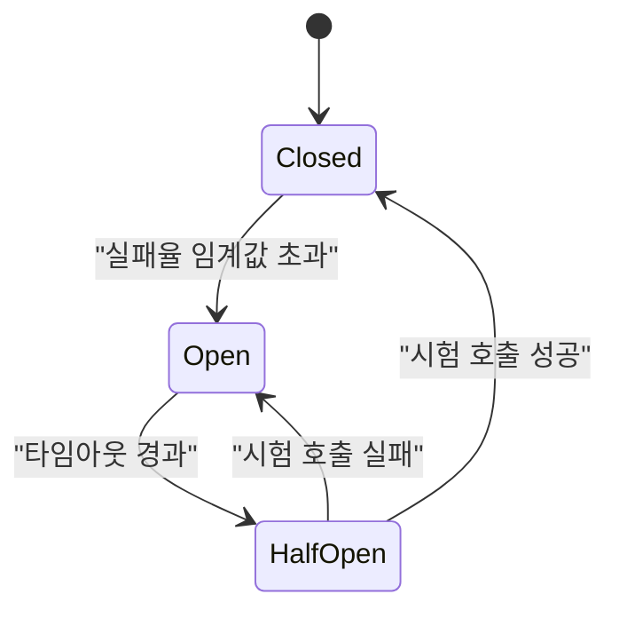
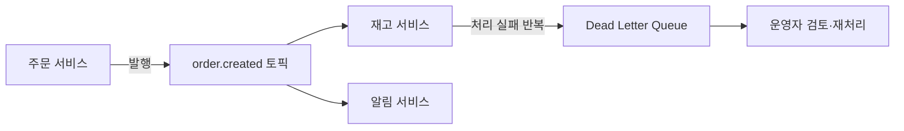

## 왜 API 관리와 통합 아키텍처가 필요한가

[13장 클라우드 네이티브 아키텍처](/post/software-architecture/cloud-native-architecture/)에서 다룬 서비스 메시는 클러스터 내부에서 서비스들이 서로를 호출하는 트래픽 — 흔히 동-서(East-West) 트래픽이라 부른다 — 을 사이드카로 표준화하는 기술이었다. 그런데 서비스 내부가 아무리 잘 정돈돼 있어도, 모바일 앱·파트너 시스템·서드파티 개발자 같은 외부 클라이언트가 그 서비스들을 어떤 규약으로 호출할지, 그리고 조직 안팎의 이질적인 시스템들이 서로 다른 프로토콜과 데이터 형식을 가진 채로 어떻게 정보를 교환할지는 전혀 다른 문제로 남는다. 이 남-북(North-South) 트래픽의 진입점을 관리하는 것이 API 게이트웨이이고, 서로 다른 시스템 간의 데이터·이벤트 교환을 다루는 것이 통합 아키텍처다. Roy Fielding은 2000년 박사 학위 논문에서 이런 아키텍처 스타일이 갖춰야 할 성질을 다음과 같이 정리했다.

> "A set of architectural constraints that, when applied as a whole, emphasizes scalability of component interactions, generality of interfaces, independent deployment of components, and intermediary components."
> — Roy Fielding, 『Architectural Styles and the Design of Network-based Software Architectures』, Chapter 5(2000), [ics.uci.edu/~fielding/pubs/dissertation](https://www.ics.uci.edu/~fielding/pubs/dissertation/rest_arch_style.htm)

이 문장에서 특히 "중개 컴포넌트(intermediary components)"라는 표현이 이 장의 핵심이다. API 게이트웨이는 클라이언트와 서비스 사이에 끼어드는 중개 컴포넌트이고, 메시지 브로커와 ESB는 시스템과 시스템 사이에 끼어드는 중개 컴포넌트다. 이 장은 이 중개 컴포넌트들을 세 갈래로 나눠 다룬다. 외부 클라이언트가 서비스에 접근하는 방식(API 게이트웨이, REST·GraphQL·gRPC 선택, 버전 관리), 시스템 간 비동기 데이터 교환 방식(메시징 패턴, 이벤트 기반 통합), 그리고 이 두 문제를 한 제품으로 풀려던 과거의 시도와 그 시도가 왜 마이크로서비스 시대에 형태를 바꿨는지(엔터프라이즈 서비스 버스)다.

## 이 장을 읽기 전에

이 장은 [13장 클라우드 네이티브 아키텍처](/post/software-architecture/cloud-native-architecture/)에서 다룬 서비스 메시·사이드카 개념과 [4장 모던 아키텍처 패러다임](/post/software-architecture/modern-architecture-paradigms/)에서 다룬 마이크로서비스 경계 개념을 이미 이해하고 있다고 전제한다. 또한 [12장 분산 시스템 아키텍처](/post/software-architecture/distributed-systems-architecture/)에서 다룬 최종 일관성과 Saga 패턴의 보상 트랜잭션 개념을 알고 있으면 이 장의 비동기 통합·멱등성 논의를 더 빨리 이해할 수 있다. 이 장의 난이도는 초급(REST API를 처음 설계하는 개발자)부터 전문가(ESB를 걷어내고 마이크로서비스로 전환하는 결정을 내리는 아키텍트)까지 걸쳐 있으며, 전문가 구간에서는 Kafka 컨슈머 그룹의 파티션 재할당 메커니즘, Circuit Breaker의 상태 전이 세부 규칙, ESB 쇠퇴의 조직적 원인까지 다룬다. 다만 이 장은 특정 API 게이트웨이 제품(Kong, Apigee, AWS API Gateway 등)의 기능 비교표, OAuth2·OpenID Connect 프로토콜의 흐름 자체(인가 코드 교환, 토큰 갱신 등), Kafka 클러스터의 운영(브로커 튜닝, ZooKeeper/KRaft 구성)은 다루지 않는다. 이런 주제는 각 제품·프로토콜의 공식 문서를 참고해야 한다.

### 당신의 수준에 맞는 경로

| 수준 | 읽을 부분 | 핵심 목표 |
|---|---|---|
| 초급 (API를 처음 설계함) | API 게이트웨이 패턴, API 스타일 선택(REST·GraphQL·gRPC) | 게이트웨이의 역할과 REST 자원 설계 기본을 이해하고 단순한 API를 설계할 수 있다 |
| 중급 (마이크로서비스 간 통신을 설계해 본 경험) | API 버전 관리와 문서화, 메시징 패턴과 이벤트 기반 통합 | Semantic Versioning으로 호환성을 관리하고, 멱등성 있는 이벤트 컨슈머를 설계할 수 있다 |
| 전문가 (조직 규모의 통합 전략 결정) | 엔터프라이즈 서비스 버스, 흔한 오개념, 언제 도입하고 언제 피할 것인가 | ESB·API 게이트웨이·서비스 메시의 책임 경계를 근거를 들어 구분하고, 조직 성숙도에 맞는 통합 전략을 선택할 수 있다 |

## API 게이트웨이 패턴

### 정의와 요청 처리 파이프라인

**API 게이트웨이**는 모든 외부 요청이 반드시 거치는 단일 진입점으로, 요청을 적절한 백엔드 서비스로 라우팅하면서 인증, 요율 제한, 로깅, 프로토콜 변환 같은 횡단 관심사를 그 서비스들 대신 처리한다. 이 정의에서 중요한 것은 "대신 처리한다"는 부분이다 — 게이트웨이가 없다면 인증 검증 로직과 요율 제한 로직을 서비스마다 각자의 언어로 중복 구현해야 하는데, 이는 13장에서 다룬 서비스 메시가 서비스 간 통신 로직을 사이드카로 옮긴 것과 정확히 같은 동기에서 출발한다. 차이는 위치다. 서비스 메시의 사이드카는 서비스와 서비스 사이(동-서)에 있고, API 게이트웨이는 외부 클라이언트와 서비스 군 전체 사이(남-북)에 있다.

게이트웨이의 내부 동작은 필터 체인(filter chain)으로 이해하는 것이 정확하다. 요청이 들어오면 라우팅 규칙에 따라 대상 경로가 결정되고, 그 경로에 등록된 필터들이 순서대로 요청을 가로채 검사·변형한다. 인증 필터는 `Authorization` 헤더의 토큰을 검증해 유효하지 않으면 즉시 401을 반환하고, 유효하면 서비스가 신뢰할 수 있는 사용자 식별 헤더(`X-User-Id` 등)를 새로 붙여 다음 필터로 넘긴다. 요율 제한 필터는 클라이언트별 요청 카운터를 확인해 한도를 넘으면 백엔드로 전달하지 않고 429를 반환한다. 이 필터 체인이 백엔드에 도달하기 전에 요청을 차단할 수 있다는 점이 핵심이다 — 인증되지 않은 요청이나 한도를 넘은 요청은 애초에 서비스 인스턴스의 CPU를 소비하지 않는다.

```java
// Spring Cloud Gateway: 라우팅 규칙과 회로 차단기·재시도를 선언적으로 정의
@Configuration
public class GatewayConfig {

    @Bean
    public RouteLocator customRouteLocator(RouteLocatorBuilder builder) {
        return builder.routes()
            .route("user-service", r -> r.path("/api/users/**")
                .filters(f -> f
                    .stripPrefix(2)
                    .circuitBreaker(config -> config
                        .setName("userServiceCB")
                        .setFallbackUri("forward:/fallback/users")))
                .uri("lb://user-service"))
            .route("order-service", r -> r.path("/api/orders/**")
                .filters(f -> f
                    .stripPrefix(2)
                    .retry(config -> config.setRetries(3)))
                .uri("lb://order-service"))
            .build();
    }
}

// 인증 필터: 토큰을 검증하고 하위 서비스가 신뢰할 헤더로 치환한다
@Component
public class AuthenticationFilter implements GatewayFilter {

    @Override
    public Mono<Void> filter(ServerWebExchange exchange, GatewayFilterChain chain) {
        String authHeader = exchange.getRequest().getHeaders().getFirst(HttpHeaders.AUTHORIZATION);
        if (authHeader == null || !authHeader.startsWith("Bearer ")) {
            exchange.getResponse().setStatusCode(HttpStatus.UNAUTHORIZED);
            return exchange.getResponse().setComplete();
        }
        try {
            Claims claims = jwtUtil.validateToken(authHeader.substring(7));
            ServerHttpRequest modified = exchange.getRequest().mutate()
                .header("X-User-Id", claims.getSubject())
                .build();
            return chain.filter(exchange.mutate().request(modified).build());
        } catch (JwtException e) {
            exchange.getResponse().setStatusCode(HttpStatus.UNAUTHORIZED);
            return exchange.getResponse().setComplete();
        }
    }
}
```

이 설정에서 주의할 점은, `stripPrefix(2)`처럼 게이트웨이가 경로를 재작성하는 로직과 `circuitBreaker`·`retry`처럼 장애를 흡수하는 로직이 같은 필터 체인 안에 섞여 있다는 것이다. 두 로직의 목적은 다르다 — 경로 재작성은 클라이언트가 보는 URL 구조와 내부 서비스 구조를 분리하는 것이고, 회로 차단기·재시도는 하위 절에서 다룰 장애 격리다. 이 둘을 분리해서 이해하지 않으면 게이트웨이 설정이 왜 이렇게 복잡한지 파악하기 어렵다.

### Rate Limiting: Token Bucket 알고리즘

요율 제한(rate limiting)은 단순히 "분당 N회"라는 숫자를 세는 문제가 아니라, 순간적인 트래픽 폭주(버스트)를 어느 정도까지 허용할지를 결정하는 문제다. 가장 널리 쓰이는 **토큰 버킷(Token Bucket)** 알고리즘은 클라이언트마다 정해진 용량의 버킷에 일정한 속도로 토큰을 채워 넣고, 요청이 들어올 때마다 토큰을 하나 소비한다. 토큰이 없으면 요청을 거부한다. 이 방식의 장점은 버킷에 토큰이 쌓여 있는 동안은 순간적으로 몰리는 요청(버스트)을 허용하면서도, 장기적인 평균 처리율은 토큰 채움 속도로 제한된다는 것이다. 고정 윈도(fixed window) 방식처럼 "매 분 0초에 카운터를 초기화"하는 방식은 구현이 단순하지만 윈도 경계에서 두 배의 트래픽이 몰릴 수 있는 약점이 있다.

```java
// 분산 환경의 토큰 버킷: Redis의 원자적 INCR/EXPIRE로 여러 게이트웨이 인스턴스가
// 같은 카운터를 공유하도록 구현한다
@Component
public class RateLimitingFilter implements GatewayFilter {

    private final RedisTemplate<String, String> redisTemplate;
    private static final int LIMIT_PER_MINUTE = 100;

    @Override
    public Mono<Void> filter(ServerWebExchange exchange, GatewayFilterChain chain) {
        String key = "rate_limit:" + getClientId(exchange.getRequest());
        return Mono.fromCallable(() -> {
            Long count = redisTemplate.opsForValue().increment(key);
            if (count != null && count == 1L) {
                redisTemplate.expire(key, Duration.ofMinutes(1));
            }
            return count != null && count <= LIMIT_PER_MINUTE;
        }).flatMap(allowed -> {
            if (allowed) {
                return chain.filter(exchange);
            }
            exchange.getResponse().setStatusCode(HttpStatus.TOO_MANY_REQUESTS);
            return exchange.getResponse().setComplete();
        });
    }
}
```

이 구현이 단일 인스턴스 카운터와 다른 이유는 게이트웨이가 보통 여러 인스턴스로 수평 확장되기 때문이다. 각 인스턴스가 자신의 메모리에만 카운터를 두면, 클라이언트 요청이 로드밸런서를 거쳐 인스턴스 A와 B에 번갈아 분산될 때 실제 한도의 N배까지 통과할 수 있다. Redis 같은 공유 저장소에 카운터를 두어야 인스턴스 수와 무관하게 한 클라이언트의 실제 요청 총량을 정확히 제한할 수 있다.

### Circuit Breaker와 장애 격리

**회로 차단기(Circuit Breaker)** 패턴은 Michael Nygard가 저서 『Release It!』(Pragmatic Bookshelf, 2007)에서 대중화한 패턴으로, 원격 호출이 실패하거나 응답이 느려질 때 그 실패가 호출자 전체로 전파되는 것을 막는다. Martin Fowler는 이 패턴을 다음과 같이 요약한다.

> "You wrap a protected function call in a circuit breaker object, which monitors for failures. Once the failures reach a certain threshold, the circuit breaker trips, and all further calls to the circuit breaker return with an error, without the protected call being made at all."
> — Martin Fowler, "CircuitBreaker", [martinfowler.com/bliki/CircuitBreaker.html](https://martinfowler.com/bliki/CircuitBreaker.html)

이 메커니즘은 세 가지 상태를 오가는 상태 기계로 구현된다. **닫힘(Closed)** 상태에서는 모든 호출이 정상적으로 하위 서비스에 전달되고, 실패율을 계속 집계한다. 실패율이 임계값을 넘으면 **열림(Open)** 상태로 전이하는데, 이 상태에서는 하위 서비스를 아예 호출하지 않고 즉시 오류(또는 폴백 응답)를 반환한다 — 이미 느려지거나 죽은 서비스를 계속 호출해 커넥션 풀과 스레드를 소모하며 장애를 증폭시키는 것을 막기 위해서다. 일정 시간이 지나면 **반열림(Half-Open)** 상태로 전이해 시험 삼아 소수의 요청만 통과시키고, 그 요청들이 성공하면 닫힘으로 돌아가고 다시 실패하면 열림으로 되돌아간다.



이 상태 기계가 앞서 `GatewayConfig`에서 본 `.circuitBreaker(config -> ...setFallbackUri("forward:/fallback/users"))` 설정과 연결된다. 열림 상태에서 게이트웨이는 실제 `user-service`를 호출하는 대신 `/fallback/users`로 요청을 돌려, 캐시된 데이터나 기본값을 반환하는 식으로 완전한 장애 대신 성능 저하로 대체한다. 여기서 주의할 점은 재시도(retry)와 회로 차단기를 함께 쓸 때의 조합이다 — 서킷이 열린 상태에서 재시도 로직까지 살아 있으면, 이미 죽은 서비스에 재시도 횟수만큼 요청을 더 보내는 역효과가 난다. 대부분의 구현(Resilience4j 등)은 서킷이 열리면 재시도 데코레이터보다 앞단에서 요청을 차단해 이 문제를 피한다.

### Backend For Frontend(BFF) 패턴

여러 종류의 클라이언트(모바일 앱, 웹, 파트너 API)가 같은 백엔드 서비스 군을 사용할 때, 하나의 범용 게이트웨이가 모든 클라이언트의 요구를 만족시키려 하면 응답 형식이 점점 복잡해진다. 모바일 앱은 배터리와 대역폭을 아끼기 위해 여러 서비스의 데이터를 한 응답에 모아 받고 싶어 하고, 파트너 API는 안정적이고 세분화된 필드를 원한다. **BFF(Backend For Frontend)** 패턴은 클라이언트 유형별로 전용 게이트웨이 계층을 두어 이 요구를 각자 최적화하는 방식으로, Netflix와 SoundCloud 같은 다중 클라이언트 서비스에서 채택이 보고된 패턴이다. BFF는 API 게이트웨이의 대체재가 아니라 그 앞단에 클라이언트별 조합 계층을 하나 더 두는 것에 가깝고, 뒷단의 실제 라우팅·인증·요율 제한은 여전히 공유 게이트웨이나 서비스 메시가 담당하는 경우가 많다.

## API 스타일 선택: REST, GraphQL, gRPC

### REST와 성숙도 모델

앞서 인용한 Fielding의 정의에서 REST는 특정 프로토콜이 아니라 아키텍처 제약의 집합이다. 자원(resource)을 URI로 식별하고, 그 자원의 표현(JSON 등)을 HTTP 메서드(GET/POST/PUT/DELETE)로 조작하며, 서버는 클라이언트의 상태를 세션으로 기억하지 않는다(무상태). 여기서 흔히 놓치는 부분이 있다.

**흔한 오개념: "JSON을 HTTP로 주고받으면 그것이 RESTful API다"**. 실무에서 "REST API"라고 불리는 것 대부분은 자원 URI와 HTTP 메서드까지만 지키고, Fielding이 유니폼 인터페이스의 네 번째 제약으로 요구한 HATEOAS(Hypermedia as the Engine of Application State) — 응답 안에 다음에 할 수 있는 행동의 링크를 포함하는 것 — 는 구현하지 않는다. Leonard Richardson은 이 실무 관행을 설명하기 위해 REST 성숙도 모델(Richardson Maturity Model)을 제안했는데, 레벨 0(단일 URI에 RPC 스타일 호출)부터 레벨 3(HATEOAS까지 구현)까지 단계를 나눈다. 대부분의 상용 API는 자원과 HTTP 동사를 쓰는 레벨 2에 머물러 있으며, 이는 틀린 것이 아니라 — 하이퍼미디어 링크를 따라가는 클라이언트를 만드는 비용이 얻는 이점보다 큰 경우가 많다는 실용적 타협이다. 다만 "우리 API는 REST를 완전히 따른다"는 주장은 대개 부정확하며, "자원 지향 HTTP API"라고 부르는 편이 더 정확하다.

### GraphQL: 클라이언트 주도 쿼리

**GraphQL**은 Facebook의 엔지니어 Lee Byron, Nick Schrock, Dan Schafer가 2012년 봄 차세대 iOS 뉴스피드 API를 만들며 개발했고, 2015년 여름 사양과 참조 구현을 공개했다(Meta Engineering, "GraphQL: A data query language", 2015-09-14, [engineering.fb.com](https://engineering.fb.com/2015/09/14/core-infra/graphql-a-data-query-language/)). REST가 "자원마다 고정된 형태의 응답"을 반환하는 것과 달리, GraphQL은 클라이언트가 쿼리 문서에 필요한 필드만 명시해 서버가 정확히 그 모양의 응답을 조립해 돌려준다. 이 방식은 REST에서 흔한 두 가지 비효율 — 필요 이상의 필드를 받는 과다 조회(over-fetching)와, 화면 하나를 그리기 위해 여러 엔드포인트를 순차 호출해야 하는 과소 조회(under-fetching) — 을 동시에 줄인다.

다만 이 유연성은 서버 구현의 복잡도를 대가로 요구한다. 클라이언트가 중첩된 관계 필드를 요청하면 리졸버(resolver)가 각 필드마다 별도 쿼리를 실행할 수 있는데, 순진하게 구현하면 목록의 각 항목마다 관련 데이터를 개별 조회하는 **N+1 쿼리 문제**가 발생한다. 실무에서는 이를 완화하기 위해 요청을 배치로 묶어 한 번에 조회하는 DataLoader 패턴을 함께 쓴다. 또한 REST의 HTTP 상태 코드·캐시 헤더 기반 캐싱 전략을 그대로 쓸 수 없어, GraphQL 서버는 보통 애플리케이션 레벨의 별도 캐싱 전략을 설계해야 한다.

### gRPC: 내부 서비스 간 고성능 통신

**gRPC**는 구글이 2001년 무렵부터 내부적으로 써 온 RPC 인프라 Stubby의 후속으로, 2015년 3월 오픈소스로 공개한 프레임워크다(Google Open Source Blog, "Introducing gRPC, a new open source HTTP/2 RPC Framework", 2015-02, [opensource.googleblog.com](https://opensource.googleblog.com/2015/02/introducing-grpc-new-open-source-http2.html)). gRPC 공식 문서는 이를 다음과 같이 설명한다.

> "In gRPC, a client application can directly call a method on a server application on a different machine as if it were a local object, making it easier for you to create distributed applications and services."
> — gRPC 공식 문서, [grpc.io/docs/what-is-grpc/introduction](https://grpc.io/docs/what-is-grpc/introduction/)

메커니즘 측면에서 gRPC는 두 가지를 REST/JSON과 다르게 가져간다. 첫째, 메시지 스키마를 Protocol Buffers(`.proto`)로 미리 정의하고 이를 이진(binary) 형식으로 직렬화하는데, 이는 텍스트 기반 JSON보다 페이로드가 작고 파싱이 빠르다. 둘째, 전송 계층으로 HTTP/2를 사용해 하나의 커넥션 위에서 여러 요청·응답 스트림을 다중화(multiplexing)하고, 클라이언트-스트리밍·서버-스트리밍·양방향 스트리밍 같은 통신 패턴을 프로토콜 수준에서 지원한다. 이런 성격 때문에 gRPC는 사람이 브라우저에서 직접 호출하거나 URL을 복사해 디버깅하기 어렵다는 대가를 치르는 대신, 서비스 간(East-West) 고빈도 호출에서 REST보다 지연과 대역폭을 아낄 수 있어 마이크로서비스 내부 통신에 흔히 채택된다.

### 비교와 선택 기준

세 스타일은 경쟁 관계라기보다 서로 다른 통신 경계에 맞춰져 있다. 다음 표는 각 스타일이 강점을 갖는 상황을 정리한 것이다.

| 스타일 | 데이터 형식 | 강점 | 약점 | 적합한 경계 |
|---|---|---|---|---|
| REST | JSON(텍스트) | 범용성, 브라우저·캐시 친화적, 디버깅 용이 | 과다/과소 조회, 버전 관리 부담 | 외부 공개 API, 파트너 연동 |
| GraphQL | JSON(클라이언트 지정 형태) | 클라이언트 주도 조회, 다중 화면 대응 유연 | N+1 문제, 캐싱·요율 제한 복잡 | 다양한 클라이언트를 가진 BFF 계층 |
| gRPC | Protocol Buffers(이진) | 낮은 지연, 스트리밍, 강타입 계약 | 브라우저 직접 호출 어려움, 가독성 낮음 | 내부 마이크로서비스 간 고빈도 호출 |

실무에서는 한 시스템 안에 세 스타일이 공존하는 경우가 흔하다 — 외부에는 REST 또는 GraphQL로 안정적인 계약을 제공하고, 게이트웨이 뒤편 내부 서비스 간에는 gRPC로 지연을 최소화하는 조합이 대표적이다. 이 조합에서 API 게이트웨이는 프로토콜 변환기 역할까지 겸하는데, 외부의 REST/JSON 요청을 받아 내부적으로 gRPC 호출로 변환해 서비스에 전달하는 식이다.

## API 버전 관리와 문서화

### Semantic Versioning과 호환성 전략

API는 한 번 공개되면 클라이언트 코드가 그 계약에 의존하기 시작하므로, 필드 하나를 지우거나 이름을 바꾸는 사소해 보이는 변경도 하위 호환성을 깨뜨릴 수 있다. **Semantic Versioning(SemVer)**은 Tom Preston-Werner(GitHub 공동 창업자)가 제안한 버전 표기 규칙으로, 다음과 같이 요약된다.

> "Increment the: MAJOR version when you make incompatible API changes; MINOR version when you add functionality in a backward compatible manner; PATCH version when you make backward compatible bug fixes."
> — Tom Preston-Werner, 『Semantic Versioning 2.0.0』, [semver.org](https://semver.org/)

이 규칙을 API에 적용하면, 필드 추가처럼 기존 클라이언트가 무시해도 되는 변경은 MINOR로, 필드 삭제·타입 변경·엔드포인트 제거처럼 기존 클라이언트를 깨뜨리는 변경은 MAJOR로 취급해야 한다는 뜻이 된다. 실무에서는 이를 URL 경로(`/api/v2/orders`)나 요청 헤더(`Accept: application/vnd.myapi.v2+json`)로 노출하는데, 경로 버전은 사람이 읽기 쉽고 캐시·라우팅 규칙에 그대로 활용할 수 있는 반면, 헤더 버전은 URL을 자원 식별자로만 유지하고 표현 형식 협상은 별도로 분리한다는 원칙에 더 가깝다. 어느 쪽을 택하든 중요한 것은, MAJOR 버전을 올리기 전 일정 기간 이전 버전을 병행 지원하며 클라이언트에 마이그레이션 기한을 명시적으로 공지하는 **폐기 예고(deprecation) 절차**를 갖추는 것이다 — 이 절차가 없으면 버전 번호를 아무리 정교하게 관리해도 기존 클라이언트는 예고 없이 깨진다.

### OpenAPI를 통한 문서화와 거버넌스

**OpenAPI Specification(OAS)**은 REST API의 엔드포인트·요청·응답 스키마를 기계가 읽을 수 있는 형식으로 기술하는 표준이다. 이 표준의 뿌리는 2010년 Tony Tam이 Wordnik에서 시작한 Swagger 사양이며, 2015년 3월 SmartBear가 이를 인수한 뒤 같은 해 11월 5일 Google·IBM·Microsoft·PayPal 등과 함께 리눅스 재단 산하 OpenAPI Initiative를 결성하면서 사양이 리눅스 재단에 기증되고 2016년 1월 "OpenAPI Specification"으로 이름이 바뀌었다(OpenAPI Initiative, [openapis.org](https://www.openapis.org/)). 공식 사이트는 이 표준을 "the world's most widely used API description standard"라고 설명한다.

```yaml
openapi: 3.0.3
info:
  title: Order Service API
  version: 2.1.0
paths:
  /orders/{orderId}:
    get:
      summary: 주문 단건 조회
      parameters:
        - name: orderId
          in: path
          required: true
          schema:
            type: string
      responses:
        "200":
          description: 조회 성공
          content:
            application/json:
              schema:
                $ref: "#/components/schemas/Order"
        "404":
          description: 주문 없음
components:
  schemas:
    Order:
      type: object
      properties:
        id:
          type: string
        totalAmount:
          type: number
        currency:
          type: string
```

이 명세 하나로 얻는 것은 단순한 문서화 이상이다. 명세로부터 클라이언트 SDK와 서버 스텁 코드를 자동 생성할 수 있고, 요청·응답을 명세와 대조하는 계약 테스트(contract test)를 CI에 넣을 수 있으며, API 게이트웨이가 명세를 읽어 라우팅 규칙과 입력 검증 규칙을 자동으로 구성할 수도 있다. 조직 차원의 API 거버넌스 — 여러 팀이 만드는 API가 명명 규칙·오류 응답 형식·페이지네이션 방식을 일관되게 지키도록 강제하는 것 — 는 사람이 문서를 읽고 검토하는 방식보다, OpenAPI 명세에 대해 린터(예: Spectral)를 CI에서 돌리는 방식이 훨씬 확장 가능하다.

## 메시징 패턴과 이벤트 기반 통합

### 발행-구독과 브로커의 내부 동작

동기 API 호출은 호출자가 응답을 받을 때까지 기다려야 하므로 호출자와 피호출자가 시간적으로 결합된다. **메시징(messaging)**은 이 결합을 끊는다. Gregor Hohpe와 Bobby Woolf는 2003년 저서 『Enterprise Integration Patterns』에서 65개의 통합 패턴을 정리하며 이 접근을 다음과 같이 설명한다.

> "A pattern language consisting of 65 integration patterns helps developers design and build distributed applications or integrate existing ones."
> — Gregor Hohpe, Bobby Woolf, 『Enterprise Integration Patterns』(Addison-Wesley, 2003), [enterpriseintegrationpatterns.com](https://www.enterpriseintegrationpatterns.com/)

이 책에서 정리한 **발행-구독(Publish-Subscribe)** 패턴은 발행자가 특정 수신자를 지정하지 않고 이벤트를 채널에 발행하면, 그 채널을 구독하는 여러 소비자가 각자 독립적으로 이벤트를 받아 처리하는 구조다. Apache Kafka는 이 패턴을 대규모로 구현한 대표적인 메시지 브로커로, 공식 문서는 스스로를 "an event streaming platform"으로 정의한다(Apache Kafka 공식 문서, [kafka.apache.org/intro](https://kafka.apache.org/intro)). Kafka는 LinkedIn에서 Jay Kreps, Neha Narkhede, Jun Rao가 2010년 무렵부터 개발해 2011년 초 오픈소스로 공개했고, 2012년 10월 Apache 인큐베이터를 졸업했다. Jay Kreps는 "쓰기에 최적화된 시스템"이라는 의미로 프란츠 카프카(Franz Kafka)의 이름을 땄다고 알려져 있다.

Kafka의 메커니즘을 이해하려면 토픽·파티션·컨슈머 그룹의 관계를 알아야 한다. 하나의 **토픽(topic)**은 여러 **파티션(partition)**으로 나뉘고, 각 파티션은 메시지가 도착한 순서대로만 추가되는 로그(append-only log)다. 파티션 안에서는 순서가 보장되지만 토픽 전체의 순서는 보장되지 않는데, 이는 파티션 단위로 병렬 처리를 하기 위한 의도적인 설계다. 여러 컨슈머가 하나의 **컨슈머 그룹(consumer group)**을 이루면 Kafka는 그룹 안의 컨슈머들에게 파티션을 하나씩 배타적으로 할당해, 같은 파티션의 메시지를 그룹 안에서 딱 하나의 컨슈머만 소비하도록 보장한다. 컨슈머가 죽거나 새로 추가되면 파티션 재할당(rebalance)이 일어난다.

### 신뢰성 있는 메시지 처리: 멱등성과 Dead Letter Queue

**흔한 오개념: "메시지 큐를 쓰면 메시지가 정확히 한 번(exactly-once)만 처리된다"**. 대부분의 메시지 브로커는 기본적으로 최소 한 번(at-least-once) 전달을 보장한다 — 컨슈머가 메시지를 처리했지만 브로커에 확인 응답(ack)을 보내기 전에 죽으면, 브로커는 그 메시지를 다시 전달한다. 즉 같은 메시지가 두 번 처리될 가능성이 항상 존재하며, 이를 막으려면 컨슈머 스스로 **멱등성(idempotency)**을 구현해야 한다.

```java
// 메시지 ID를 저장소에 기록해 같은 메시지가 재전달돼도 한 번만 부작용을 낸다
@Component
public class IdempotentOrderEventHandler {

    private final RedisTemplate<String, String> redisTemplate;
    private final InventoryService inventoryService;

    @RabbitHandler
    public void handleOrderCreated(OrderCreatedEvent event) {
        String key = "processed_message:" + event.getMessageId();
        Boolean firstTime = redisTemplate.opsForValue()
            .setIfAbsent(key, "true", Duration.ofHours(24));
        if (Boolean.FALSE.equals(firstTime)) {
            return; // 이미 처리한 메시지, 재전달은 무시
        }
        inventoryService.reserveItems(event.getOrderId(), event.getItems());
    }
}
```

`setIfAbsent`가 원자적으로 "키가 없을 때만 쓰기"를 수행하므로, 같은 메시지가 동시에 두 스레드에 재전달돼도 재고 예약은 한 번만 일어난다. 그럼에도 컨슈머가 재시도 끝에 계속 실패하는 메시지는 **Dead Letter Queue(DLQ)**로 옮겨 별도로 관찰·재처리한다. DLQ가 없으면 처리 불가능한 메시지 하나가 큐 앞단에 남아 뒤따르는 정상 메시지까지 막는(head-of-line blocking) 문제가 생길 수 있다.



### 이벤트 소싱과 CQRS의 연결

이벤트 기반 통합은 단순히 서비스 간 알림을 넘어, 상태 변경 자체를 이벤트로 기록하는 이벤트 소싱과 자연스럽게 맞물린다. 도메인 이벤트가 발생하면 이벤트 스토어에 append하고, 조회 전용 Read Model을 그 이벤트로 갱신한 뒤, 같은 이벤트를 메시지 브로커로도 발행해 다른 바운디드 컨텍스트에 전파하는 구조가 일반적이다. 이때 명령을 처리하는 모델과 조회를 처리하는 모델을 분리하는 **CQRS(Command Query Responsibility Segregation)**를 함께 적용하면, 조회 성능 최적화와 이벤트 전파가 같은 파이프라인 위에서 자연스럽게 이뤄진다. 이 주제의 도메인 모델링 측면은 [10장 DDD 전술적 설계](/post/software-architecture/ddd-tactical-design/)에서 더 깊이 다룬다.

## 엔터프라이즈 서비스 버스(ESB)와 그 이후

### 역사와 메커니즘

**엔터프라이즈 서비스 버스(ESB)**라는 용어는 2002년 무렵 Gartner의 애널리스트 Roy Schulte가 시장에 등장한 미들웨어 제품군을 묘사하며 정착시켰다고 알려져 있으며, Schulte 자신은 이 개념에 가장 가까운 조상으로 Candle의 Roma 제품(1998)을 꼽고, "ESB"라는 표현 자체를 처음 쓴 제품은 Sonic Software가 2002년 출시했다고 밝힌 바 있다. ESB는 서로 다른 프로토콜(SOAP, JMS, 파일, 레거시 메인프레임 인터페이스 등)과 데이터 형식을 쓰는 시스템들을 하나의 중앙 버스에 연결해, 메시지 라우팅과 형식 변환을 그 버스 안에서 처리하는 아키텍처다. 메커니즘은 메시지 라우터가 도착한 메시지의 유형을 보고 적절한 변환기(transformer)를 거쳐 목적지로 전달하는 방식으로 동작한다.

```java
// 메시지 라우터: 도착한 메시지 유형에 따라 변환기를 거쳐 적절한 핸들러로 전달
@Component
public class MessageRouter {

    private final Map<String, MessageHandler> handlers;
    private final MessageTransformer transformer;

    public void routeMessage(Message message) {
        Message transformed = transformer.transform(message);
        MessageHandler handler = handlers.get(transformed.getType());
        if (handler != null) {
            handler.handle(transformed);
        } else {
            errorQueueSender.send(message, "핸들러를 찾을 수 없음: " + transformed.getType());
        }
    }
}

// 메시지 변환기: 레거시 스키마를 현재 스키마로 맞춘다
@Component
public class MessageTransformer {

    public Message transform(Message source) {
        return switch (source.getType()) {
            case "ORDER_CREATED_V1" -> transformOrderV1ToV2(source.getPayload());
            default -> source;
        };
    }

    private Message transformOrderV1ToV2(Object payload) {
        OrderV1 v1 = (OrderV1) payload;
        OrderV2 v2 = OrderV2.builder()
            .orderId(v1.getId())
            .customerId(v1.getCustomerId())
            .currency("KRW") // V2에서 신설된 필드에 기본값 부여
            .build();
        return new Message("ORDER_CREATED_V2", v2);
    }
}
```

### 흔한 오개념: "ESB와 API 게이트웨이는 같은 역할을 한다"

두 아키텍처는 겉보기에 비슷해 보이지만 — 둘 다 중앙에서 라우팅과 변환을 수행한다 — 책임의 범위가 근본적으로 다르다. API 게이트웨이는 대체로 라우팅·인증·요율 제한 같은 **얇은(thin)** 횡단 관심사만 처리하고, 실제 비즈니스 로직상의 데이터 변환은 각 서비스가 스스로 책임진다. 반면 전통적인 ESB는 메시지 변환·오케스트레이션·비즈니스 규칙까지 버스 안에 구현하는 **두꺼운(thick)** 중앙집중형 로직을 지향했다. 이 차이가 실무에서 문제가 된 지점은, 여러 팀이 공유하는 하나의 ESB에 변환 로직이 쌓이면 그 ESB를 소유한 소수의 통합 전담팀이 모든 서비스 배포의 병목이 된다는 것이다 — 마이크로서비스가 강조하는 "팀별 독립 배포"와 정면으로 충돌한다.

### ESB에서 마이크로서비스 통합으로 무게중심이 옮겨간 이유

2010년대 마이크로서비스 아키텍처가 확산되면서 조직들은 ESB의 중앙집중형 변환 로직을 각 서비스 경계로 되돌리는 방향을 택했다. Sam Newman은 저서 『Building Microservices』(O'Reilly, 2015)에서 "똑똑한 엔드포인트, 멍청한 파이프(smart endpoints, dumb pipes)"라는 원칙으로 이 전환을 설명하는데, 통신 인프라(파이프)는 단순한 메시지 전달만 하고 비즈니스 로직(똑똑함)은 서비스 경계 안에 두어야 한다는 것이다. 오늘날 조직들이 쓰는 조합은 이 원칙을 반영한다 — 남-북 트래픽의 얇은 횡단 관심사는 API 게이트웨이가, 동-서 트래픽의 통신 신뢰성은 서비스 메시가, 비동기 이벤트 전달은 앞서 다룬 Kafka 같은 "멍청한" 메시지 브로커가 담당하고, ESB가 하던 두꺼운 변환·오케스트레이션 로직은 각 서비스 코드 안으로 돌아갔다. 다만 레거시 메인프레임이나 패키지 ERP처럼 서비스 코드를 직접 고칠 수 없는 시스템과의 연동에는, 여전히 ESB 계열 미들웨어나 그 후신인 iPaaS(integration Platform as a Service)가 실용적인 선택지로 남아 있다.

## 시스템 간 통합 전략: 동기, 비동기, 데이터 동기화

### 동기 vs 비동기 통합의 트레이드오프

동기 통합(REST/gRPC 호출)은 호출자가 결과를 즉시 알 수 있다는 장점이 있지만, 피호출자가 느려지거나 죽으면 호출자도 함께 지연되거나 실패하는 시간적 결합이 생긴다. 비동기 통합(메시지 발행)은 이 결합을 끊어 피호출자가 일시적으로 죽어 있어도 메시지가 큐에 남아 있다가 복구 후 처리되지만, 그 대가로 호출자는 "지금 성공했는지"를 즉시 알 수 없고, 실패 처리·순서 보장·중복 처리 같은 복잡한 문제를 떠안는다. 결제처럼 사용자가 결과를 즉시 확인해야 하는 흐름은 동기 호출에 회로 차단기를 결합하는 편이 자연스럽고, 재고 반영·알림 발송처럼 결과를 나중에 확인해도 되는 흐름은 비동기 메시징이 자연스럽다. [12장 분산 시스템 아키텍처](/post/software-architecture/distributed-systems-architecture/)에서 다룬 Saga 패턴은 여러 서비스에 걸친 트랜잭션을 이 비동기 메시징 위에서 보상 트랜잭션으로 구현하는 방법이었다.

### Change Data Capture와 배치 동기화

시스템 간 데이터를 맞추는 방법에는 애플리케이션이 명시적으로 이벤트를 발행하는 방식 외에, 데이터베이스의 변경 이력 자체를 이벤트로 변환하는 **Change Data Capture(CDC)**가 있다. 이 방식은 애플리케이션 코드가 이벤트 발행을 잊어버려도(예: 관리자가 DB를 직접 수정한 경우) 변경이 누락 없이 전파된다는 장점이 있고, 트랜잭션 커밋 이후 시점에 이벤트를 발행하므로 "DB에는 반영됐는데 이벤트는 유실됐다"는 이중 쓰기 문제를 피할 수 있다.

```java
// 트랜잭션 커밋 이후에만 이벤트를 발행해, DB 반영과 이벤트 발행이
// 서로 어긋나는 이중 쓰기 문제를 피한다
@Component
public class DatabaseChangeListener {

    @TransactionalEventListener(phase = TransactionPhase.AFTER_COMMIT)
    public void handleEntityChange(EntityChangeEvent event) {
        switch (event.getChangeType()) {
            case INSERT -> eventPublisher.publish(new EntityCreatedEvent(event.getEntity()));
            case UPDATE -> eventPublisher.publish(new EntityUpdatedEvent(event.getEntity()));
            case DELETE -> eventPublisher.publish(new EntityDeletedEvent(event.getEntityId()));
        }
    }
}
```

실시간 전파가 필요 없는 데이터는 여전히 배치 동기화가 합리적인 선택이다. 예를 들어 고객 마스터 데이터를 5분마다 변경분만 조회해 외부 시스템에 반영하는 방식은 구현이 단순하고, 일시적 장애가 나도 다음 배치 사이클에서 자연히 복구된다는 안정성이 있다. 다만 이 방식은 최대 배치 주기만큼의 지연된 일관성(eventual consistency with a bound)을 감수해야 하므로, "변경 즉시 반영돼야 하는가"라는 질문에 대한 답이 배치와 이벤트 기반 중 무엇을 쓸지를 가른다.

## 언제 도입하고 언제 피할 것인가

이 장에서 다룬 기술들은 채택 기준이 서로 다르다. API 게이트웨이는 외부에 API를 노출하는 거의 모든 시스템에 적합하다 — 인증·요율 제한 로직을 서비스마다 중복 구현하는 비용이 게이트웨이 운영 비용보다 훨씬 크기 때문이다. 다만 서비스가 하나뿐이고 외부 클라이언트도 하나뿐인 극히 단순한 시스템에서는 게이트웨이 없이 서비스가 직접 그 로직을 갖는 편이 오히려 단순할 수 있다. GraphQL은 클라이언트 종류가 다양하고 화면마다 필요한 데이터 모양이 크게 다른 시스템(다중 플랫폼 소비자 앱 등)에서 이점이 크지만, 내부 서비스 간 통신이나 캐싱이 중요한 공개 API에는 REST가 더 다루기 쉽다. gRPC는 지연에 민감한 내부 마이크로서비스 통신에 적합하지만, 브라우저에서 직접 호출해야 하는 공개 API에는 적합하지 않다.

메시지 브로커 기반 비동기 통합은 서비스 수가 늘고 서비스 간 시간적 결합을 끊어야 할 필요가 커질수록 이점이 분명해지지만, 멱등성 처리·순서 보장·DLQ 운영이라는 새로운 복잡도를 요구하므로 단순한 CRUD 서비스 몇 개로 구성된 시스템에는 과할 수 있다. 전통적인 ESB는 새로운 그린필드 마이크로서비스 시스템에는 거의 권장되지 않지만, 변경할 수 없는 레거시 시스템·패키지 소프트웨어를 다수 통합해야 하는 조직에서는 여전히 실용적인 선택지다 — 이때도 ESB가 비즈니스 로직까지 흡수하지 않도록, 변환 범위를 프로토콜·형식 어댑팅으로 좁게 유지하는 것이 마이크로서비스 시대의 교훈이다.

## 평가 기준

이 장을 읽은 후 다음을 할 수 있어야 한다. API 게이트웨이의 필터 체인이 인증·요율 제한을 백엔드 도달 전에 어떻게 차단하는지 설명하고, 토큰 버킷 알고리즘이 고정 윈도 방식보다 버스트 트래픽을 어떻게 다르게 다루는지 말할 수 있다. Circuit Breaker의 닫힘·열림·반열림 상태 전이를 설명하고, 재시도와 회로 차단기를 함께 쓸 때 왜 순서가 중요한지 설명할 수 있다. REST·GraphQL·gRPC 각각이 강점을 갖는 통신 경계를 구분하고, "REST API"라는 표현이 실무에서 왜 대개 부정확한지 Richardson 성숙도 모델을 근거로 설명할 수 있다. Semantic Versioning의 MAJOR/MINOR/PATCH 규칙을 API 변경에 적용하고, OpenAPI 명세가 문서화를 넘어 어떤 자동화(SDK 생성, 계약 테스트, 거버넌스)를 가능케 하는지 설명할 수 있다. 메시지 브로커가 기본적으로 최소 한 번 전달을 보장한다는 사실에서 출발해 멱등성 처리가 왜 필요한지 설명하고, Dead Letter Queue가 없을 때 생기는 head-of-line blocking 문제를 지적할 수 있다. 마지막으로, ESB와 API 게이트웨이의 책임 범위 차이를 "얇은 횡단 관심사"와 "두꺼운 중앙집중 로직"의 구분으로 설명하고, 조직의 상황(그린필드 마이크로서비스 vs 레거시 통합)에 맞는 통합 전략을 근거를 들어 선택할 수 있다.

다음 장에서는 이 장에서 다룬 API·통합 기술을 여러 팀과 여러 시스템에 걸쳐 일관되게 유지하는 조직적 장치, 즉 아키텍처 거버넌스와 기술 표준화를 [15장 엔터프라이즈 아키텍처 관리](/post/software-architecture/enterprise-architecture-management/)에서 다룬다. 이 장에서 다룬 API 버전 관리·OpenAPI 거버넌스가 조직 전체의 아키텍처 원칙·로드맵과 어떻게 맞물리는지 확인할 수 있다.
