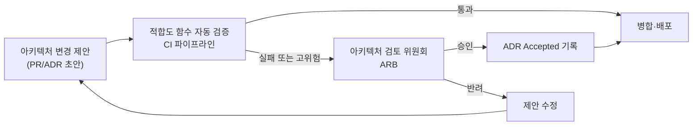
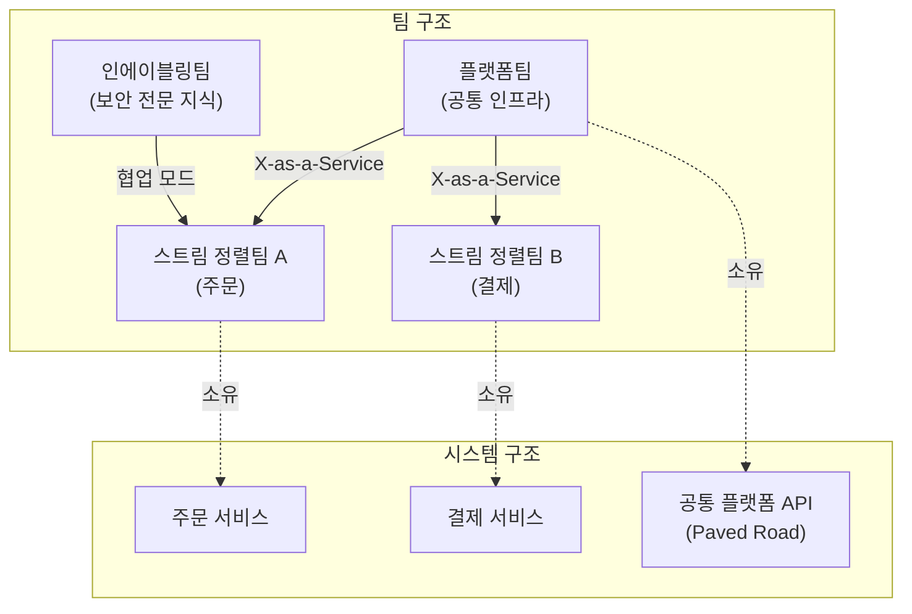

## 왜 엔터프라이즈 아키텍처 관리가 필요한가

지금까지 이 시리즈의 1장부터 14장까지는 하나의 시스템, 또는 하나의 서비스 경계 안에서 좋은 설계를 만드는 방법을 다뤘다 — 계층을 어떻게 나누고, 어떤 패턴과 품질 속성을 선택하고, 그 설계를 어떻게 평가·문서화하고, [14장](/post/software-architecture/api-management-and-integration-architecture/)에서는 그렇게 만든 서비스들을 API와 메시징으로 어떻게 통합할지까지가 범위였다. 하지만 조직이 시스템 하나가 아니라 수십에서 수백 개의 서비스와 그만큼의 팀을 운영하는 규모로 커지면 전혀 다른 종류의 질문이 등장한다. 팀 A가 내린 기술 선택을 팀 B도 따라야 하는가? 그 결정은 누가 승인하는가? 5년 뒤 폐기해야 할 기술과 지금 투자해야 할 기술을 무엇을 근거로 구분하는가? 그리고 조직도를 어떻게 그리느냐가 실제로 시스템의 모양에 영향을 미치는가? 이 질문들은 개별 시스템 설계 지식의 연장이 아니라, 여러 시스템에 걸친 결정을 시간에 걸쳐 일관되게 만드는 별도의 관리 체계를 요구한다. The Open Group은 이런 체계를 다루는 표준 TOGAF를 다음과 같이 소개한다.

> "A proven Enterprise Architecture methodology and framework used by the world's leading organizations to improve business efficiency."
> — The Open Group, TOGAF 소개, [opengroup.org/togaf](https://www.opengroup.org/togaf)

이 정의에서 핵심은 "방법론과 프레임워크(methodology and framework)"라는 표현이다. 엔터프라이즈 아키텍처 관리는 특정 시스템 하나의 설계도가 아니라, 여러 시스템·여러 팀에 걸쳐 아키텍처 결정을 내리고 전파하고 검증하는 절차 자체를 다룬다. 이 장은 이 절차를 네 갈래로 나눠 살펴본다. 누가 무엇을 결정할 권한을 갖는지(아키텍처 거버넌스), 조직이 장기적으로 어떤 기술에 투자하고 어떤 기술을 폐기할지(기술 전략과 로드맵), 여러 팀의 산출물이 최소한의 일관성을 갖도록 무엇을 표준화하고 어떻게 강제할지(아키텍처 표준화), 그리고 조직 구조 자체가 시스템 구조에 어떤 영향을 미치는지(조직 구조와 아키텍처)다.

## 이 장을 읽기 전에

이 장은 [14장 API 관리와 통합 아키텍처](/post/software-architecture/api-management-and-integration-architecture/)에서 다룬 API 버전 관리·OpenAPI 거버넌스가 조직 전체 수준으로 확장될 때 어떤 틀 안에서 작동하는지를 이어서 다룬다. 또한 [6장 아키텍처 문서화](/post/software-architecture/architecture-documentation/)에서 다룬 ADR(Architecture Decision Record)의 형식과 [7장 아키텍처 평가와 분석](/post/software-architecture/architecture-evaluation-and-analysis/)에서 다룬 적합도 함수(fitness function)·기술 부채 개념을 이미 안다고 전제한다. 이 장은 그 도구들의 사용법을 다시 설명하지 않고, 그 도구들이 조직 차원의 거버넌스·표준화 체계 안에서 어떤 역할을 맡는지에 초점을 맞춘다. 이 장의 난이도는 초급(아키텍처 검토가 왜 필요한지 처음 접하는 개발자)부터 전문가(수십 개 팀 규모 조직의 거버넌스 모델을 설계하는 아키텍트)까지 걸쳐 있다. 다만 이 장은 TOGAF 자격 인증 시험의 세부 범위, 특정 EA 도구 제품(Sparx Enterprise Architect, BiZZdesign 등)의 사용법, 프로젝트·포트폴리오 관리 방법론(PMI, PRINCE2 등) 자체는 다루지 않는다.

### 당신의 수준에 맞는 경로

| 수준 | 읽을 부분 | 핵심 목표 |
|---|---|---|
| 초급 (아키텍처 검토를 처음 접함) | 아키텍처 거버넌스, 아키텍처 표준화 | 거버넌스가 결정권 배분의 문제임을 이해하고, ARB·ADR·표준이 어떻게 맞물리는지 설명할 수 있다 |
| 중급 (여러 팀과 협업하며 표준을 적용해 본 경험) | 기술 전략과 로드맵, 적합도 함수로 표준 검증하기 | Technology Radar로 기술 채택 결정을 구조화하고, 적합도 함수로 표준을 자동 검증하는 파이프라인을 설계할 수 있다 |
| 전문가 (조직 구조·거버넌스 모델을 설계) | 조직 구조와 아키텍처(Conway의 법칙), 언제 도입하고 언제 피할 것인가 | 조직 구조와 시스템 구조의 상호작용을 근거를 들어 설명하고, 조직 규모·성숙도에 맞는 거버넌스 강도를 선택할 수 있다 |

## 아키텍처 거버넌스: 결정권을 배분하는 체계

### 거버넌스는 승인이 아니라 결정권 배분이다

**아키텍처 거버넌스**는 조직이 아키텍처와 관련한 결정을 누가, 어떤 절차로, 어떤 기준으로 내릴지를 정하는 체계다. 이 정의에서 자주 오해되는 부분은 "결정을 누가 내리는가"라는 질문을 "누가 승인 도장을 찍는가"로 축소하는 것이다. 실제로 성숙한 거버넌스 모델은 결정 자체를 중앙 위원회에 몰아주지 않고, 결정의 파급 범위에 따라 권한을 다른 층위로 흩어 놓는다. 한 팀 안에서만 영향을 미치는 결정(내부 클래스 구조, 로컬 캐싱 전략)은 그 팀이 스스로 내리고, 여러 팀에 영향을 미치는 결정(공통 인증 방식, 데이터 암호화 표준)은 더 넓은 검토를 거치며, 조직 전체의 위험·비용에 영향을 미치는 결정(클라우드 벤더 선택, 규제 대응 아키텍처)은 가장 넓은 이해관계자가 참여한다. 이 배분이 거버넌스의 실질적인 산출물이고, "검토 위원회가 매주 회의를 연다"는 사실은 그 배분을 실행하는 방식 중 하나일 뿐이다.

이 배분 방식은 크게 두 극단 사이에서 조직마다 다르게 선택된다. **중앙집중형(command-and-control) 거버넌스**는 아키텍처 검토 위원회(Architecture Review Board, ARB)가 거의 모든 설계 변경을 사전에 심사하고 승인하는 방식으로, 규제가 엄격한 금융·의료 산업이나 시스템 수가 적은 조직에서는 일관성을 지키는 데 효과적이지만, 서비스와 팀 수가 늘어날수록 ARB 자체가 모든 배포의 병목이 된다 — [14장](/post/software-architecture/api-management-and-integration-architecture/)에서 다룬 ESB가 통합 로직의 병목이 됐던 것과 같은 구조적 문제다. **원칙 기반(principle-based) 거버넌스**는 반대로 소수의 상위 원칙과 자동화된 검증 장치만 두고, 그 원칙을 지키는 한 개별 결정은 각 팀에 위임한다. 오늘날 마이크로서비스 규모의 조직 다수가 후자로 무게중심을 옮기는 이유는, 사람이 매 변경을 심사하는 비용이 팀 수에 비례해 커지는 반면 자동화된 검증은 팀 수와 무관하게 일정한 비용으로 확장되기 때문이다.

### TOGAF ADM과 Zachman 프레임워크: 절차와 분류는 다른 문제다

엔터프라이즈 아키텍처 분야에서 가장 널리 인용되는 두 산출물은 TOGAF와 Zachman 프레임워크인데, 둘을 같은 대상으로 오해하는 경우가 많다. **TOGAF**(The Open Group Architecture Framework)는 1995년 The Open Group이 미국 국방부의 TAFIM(Technical Architecture Framework for Information Management)을 기반으로 개발을 시작한 절차형 프레임워크로, 핵심은 **ADM(Architecture Development Method)**이라는 반복 주기다. ADM은 비즈니스 아키텍처, 데이터 아키텍처, 애플리케이션 아키텍처, 기술 아키텍처라는 네 영역을 순환하며 정의하고, 그 결과를 이행 계획과 거버넌스 단계로 이어가는 절차로 알려져 있다 — 즉 TOGAF는 "어떤 순서로 아키텍처를 만들 것인가"에 답한다.

이와 달리 **Zachman 프레임워크**는 John Zachman이 1987년 IBM Systems Journal에 발표한 논문 "A Framework for Information Systems Architecture"에서 제안한 산출물로, 절차가 아니라 **분류 체계(taxonomy)**다. 무엇을(What)·어떻게(How)·어디서(Where)·누가(Who)·언제(When)·왜(Why)라는 여섯 질문을, 전체 개요부터 실제 운영 중인 시스템까지 여섯 관점으로 교차시킨 6×6 매트릭스로, 각 칸은 "이 관점에서 이 질문에 답하는 산출물이 무엇인가"를 가리킨다. 이런 구조 때문에 이 프레임워크는 아키텍처를 어떻게 만들지 지시하는 절차가 아니라, 이미 존재하거나 존재해야 할 산출물을 분류해 빠진 부분을 찾아내는 분류 도구로 흔히 설명된다.

**흔한 오개념: "TOGAF와 Zachman은 경쟁하는 대안 EA 프레임워크다"**. 실제로 둘은 답하는 질문 자체가 다르다. TOGAF는 절차, Zachman은 분류이므로 원리적으로 상호 배타적이지 않다 — TOGAF ADM을 따라 아키텍처를 만들면서, 그 산출물이 Zachman 매트릭스의 어느 칸에 해당하는지 점검해 빠진 관점이 없는지 확인하는 조합이 가능하다. 다만 실무에서는 두 프레임워크를 모두 전면 도입하는 대신, TOGAF의 ADM 사고방식(반복적으로 도메인을 순회하며 이행 계획까지 연결한다)만 가져오고 Zachman 매트릭스는 산출물 점검 체크리스트 정도로 가볍게 참고하는 절충이 흔하다.

| 구분 | TOGAF | Zachman 프레임워크 |
|---|---|---|
| 성격 | 절차(방법론) — ADM 반복 주기 | 분류 체계(택소노미) — 6×6 매트릭스 |
| 답하는 질문 | 어떤 순서로 아키텍처를 만들 것인가 | 어떤 산출물이 있어야 하고 무엇이 빠졌는가 |
| 핵심 구조 | 비즈니스·데이터·애플리케이션·기술 아키텍처를 순환하는 ADM | What·How·Where·Who·When·Why × 6개 관점 |
| 관계 | 서로 경쟁하는 대안이 아니라 절차(TOGAF)와 분류(Zachman)로 보완 가능 | 위와 동일 |

### ARB와 ADR의 연결: 검토는 언제, 무엇을 대상으로 하는가

거버넌스 절차가 실제로 굴러가려면 "무엇을 검토 대상으로 삼을 것인가"가 명확해야 한다. Michael Nygard는 2011년 글에서 이 대상을 구조·비기능적 특성·의존성·인터페이스·구축 기법에 영향을 미치는 "아키텍처적으로 유의미한(architecturally significant)" 결정으로 규정했고, [6장](/post/software-architecture/architecture-documentation/)에서 다뤘듯 그런 결정을 ADR로 기록하는 관행이 오늘날 널리 쓰인다. ARB가 하는 일은 이 ADR을 무(無)에서 만들어 내는 것이 아니라, 이미 팀이 작성한 ADR 중 조직 전체에 영향을 미치는 것만 골라 검토하는 것에 가깝다. 즉 ADR은 결정을 기록하는 문서 형식이고, ARB는 그 문서 중 일부를 검토하는 절차이며, 둘은 같은 층위의 개념이 아니다.

이 검토를 어느 시점에 배치할지는 조직마다 다르다. 사전 승인형은 ADR이 "Proposed" 상태일 때 ARB가 먼저 심사해 "Accepted"로 전환하는 방식이고, [7장](/post/software-architecture/architecture-evaluation-and-analysis/)에서 다룬 적합도 함수를 활용하는 조직은 대부분의 변경을 CI 파이프라인의 자동 검증만으로 통과시키고, 그 검증을 통과하지 못하거나 애초에 자동화하기 어려운 고위험 변경(예: 새로운 클라우드 벤더 도입, 개인정보 저장 방식 변경)만 ARB로 올린다. 후자를 "예외 기반 거버넌스(governance by exception)"라 부르는데, [7장](/post/software-architecture/architecture-evaluation-and-analysis/)에서 예고한 대로 "사람이 주기적으로 평가하는" ATAM류 모델을 "기계가 커밋마다 검증하는" 모델로 확장한 것이 바로 이 자동화 계층이다.



이 그림에서 중요한 것은 화살표의 방향이다 — 모든 변경이 ARB를 거치는 것이 아니라, 자동 검증을 통과하지 못한 소수의 변경만 ARB로 올라간다. 이 구조가 무너지는 흔한 실패 양상은, ARB가 "만약을 대비해" 자동 검증을 통과한 변경까지 다시 심사하기 시작하는 경우다. 그 순간부터 ARB는 다시 모든 배포의 병목으로 되돌아간다.

**흔한 오개념: "거버넌스가 강하다는 것은 모든 변경에 사전 승인이 필요하다는 뜻이다"**. 위 그림이 보여주듯, 성숙한 거버넌스는 승인 횟수가 아니라 원칙과 자동 검증의 커버리지로 강도를 측정한다. 오히려 원칙과 적합도 함수가 촘촘히 정의된 조직일수록 사람이 개입하는 ARB 심사는 줄어든다 — 그만큼 판단 기준이 코드로 옮겨졌기 때문이다. 반대로 원칙이 모호한 조직은 모든 애매한 사례를 사람에게 떠넘기므로 ARB 심사가 늘어난다. 즉 ARB 회의가 잦다는 것은 거버넌스가 "강하다"는 신호가 아니라, 원칙이 충분히 구체화되지 않았다는 신호에 가깝다.

## 기술 전략과 로드맵: 포트폴리오를 방향짓기

### 단일 시스템 결정과 포트폴리오 결정은 다른 문제다

하나의 서비스를 설계할 때 "이 기능에 어떤 라이브러리를 쓸까"는 그 서비스 팀이 판단할 수 있는 국소적 결정이다. 반면 "회사 전체가 5년 안에 어떤 데이터베이스·언어·클라우드 벤더로 수렴할 것인가"는 개별 서비스의 최적해를 모아서는 답할 수 없는 포트폴리오 수준의 질문이다. 이 질문에 답하려면 현재 조직이 쓰고 있는 기술의 전체 목록(포트폴리오)을 놓고, 각 기술이 성숙 단계의 어디에 있는지, 계속 투자할지·시범적으로 늘릴지·관망할지·걷어낼지를 판단하는 별도의 절차가 필요하다. 이 판단이 개별 서비스 설계보다 어려운 이유는, 한 기술을 포기하는 비용(이미 그 기술로 만든 시스템의 마이그레이션 비용)과 계속 쓰는 비용(오래된 기술의 유지보수·채용 비용)을 같은 잣대로 비교해야 하기 때문이다.

### ThoughtWorks Technology Radar: 판단을 구조화하는 도구

이 판단을 구조화하는 대표적인 도구가 ThoughtWorks의 **Technology Radar**다. 2010년부터 반년마다 발행되는 이 레이더는 기법(Techniques)·플랫폼(Platforms)·도구(Tools)·언어와 프레임워크(Languages & Frameworks) 네 사분면에, 각 기술을 성숙도에 따라 네 개의 고리(ring)로 배치한다. 이 배치는 마케팅 자료가 아니라, 소속 기술 자문 위원회(Technology Advisory Board, TAB)가 실제 프로젝트에서 겪은 경험을 근거로 반년마다 토론해 정하는 절차를 거친다.

| 링 | 의미 | 조직의 태도 |
|---|---|---|
| Adopt | 검증되고 성숙해 기본으로 채택할 만하다 | 특별한 이유가 없으면 이 기술을 쓴다 |
| Trial | 실전에서 검증 중이며, 위험을 감수할 수 있는 프로젝트에 시도할 만하다 | 리스크를 감내할 수 있는 팀부터 시범 적용한다 |
| Assess | 흥미롭고 지켜볼 가치가 있지만 아직 이르다 | 핵심 시스템에는 쓰지 않되 학습은 계속한다 |
| Hold | 신중하게 접근해야 하며 신규 채택을 자제할 시점이다 | 이미 쓰고 있다면 확대하지 않는다 |

**흔한 오개념: "기술 레이더는 유행을 따라가는 트렌드 리포트다"**. 레이더의 각 항목은 유행이 아니라 TAB 구성원이 실제로 현장에서 써 본 경험을 근거로 배치된다는 점에서, 마케팅성 "올해의 기술" 목록과는 다르다. 조직이 이 도구를 자체적으로 도입할 때 흔히 저지르는 실수는, 바깥의 공개된 레이더를 그대로 자기 조직의 로드맵으로 베끼는 것이다. Technology Radar의 실제 가치는 완성된 결과물(어느 기술이 어느 링에 있는가)이 아니라, 그 결과물을 만들어 내는 절차 — 여러 팀의 실전 경험을 정기적으로 모아 토론하고 합의하는 절차 — 에 있다. 조직이 자체 레이더를 운영한다는 것은 이 절차를 자기 조직 규모로 복제한다는 뜻이지, ThoughtWorks의 판단을 그대로 수입한다는 뜻이 아니다.

이 절차가 포트폴리오 관리에 기여하는 지점은, 개별 팀의 기술 선택 논쟁을 "내 경험상 이게 낫다"는 일화적 주장에서 "우리 조직 전체의 경험을 모으면 이 기술은 Trial 단계다"라는 합의된 판단으로 옮긴다는 것이다. 여기서 폐기(retire) 결정을 위한 근거가 필요하면, [7장](/post/software-architecture/architecture-evaluation-and-analysis/)에서 다룬 CBAM(Cost Benefit Analysis Method)으로 마이그레이션 비용과 유지 비용을 비교해 투자 우선순위를 정할 수 있다 — 레이더가 "무엇을 검토 대상으로 삼을지"를 정하고, CBAM이 "그중 무엇을 먼저 할지"를 정하는 식으로 두 도구는 계층을 이룬다.

## 아키텍처 표준화: 자율성과 일관성의 균형

### Paved Road: 강제가 아니라 유도

표준화의 목적은 모든 팀이 똑같은 방식으로 일하게 만드는 것이 아니라, 각 팀이 매번 바닥부터 결정을 내리는 비용을 줄이는 것이다. 이 발상을 잘 보여주는 사례가 Netflix의 **Paved Road**(포장도로) 개념이다. Netflix Application Security 팀에서 시작된 것으로 알려진 이 개념은, 조직이 권장하는 도구·관행·표준의 집합을 제공하되 이를 강제하지 않고 기본값으로만 제시한다 — 팀이 원하면 포장도로를 벗어나 다른 선택을 할 수 있지만, 그 경우 표준 도구가 제공하는 통합 지원(모니터링, 배포 자동화, 보안 패치 등)은 스스로 책임져야 한다.

> "The Paved Road is not a mandate but rather a guiding principle that engineers are encouraged to follow by default."
> — Netflix의 Paved Road 개념 설명, [developer-enablement.com](https://developer-enablement.com/what-is-the-paved-road/)

이 방식이 강제형 표준화와 다른 지점은 유인 구조에 있다. 강제형 표준(예: "모든 서비스는 반드시 X 프레임워크를 쓴다")은 예외가 필요한 팀도 규정을 어기거나 예외 승인을 받아야 하지만, Paved Road는 표준을 따르는 쪽이 자연스럽게 더 편하도록 설계해, 대부분의 팀이 굳이 이탈할 이유가 없게 만든다. Spotify가 비슷한 개념을 **Golden Path**(황금 경로)라 부르며 대중화했고, 오늘날 플랫폼 엔지니어링(platform engineering)이라는 분야 전체가 이 발상 — 플랫폼팀이 셀프서비스 형태의 기본 경로를 제공해 다른 팀의 인지 부하를 낮춘다는 발상 — 위에서 성장했다.

### 적합도 함수로 표준을 자동 검증하기

Paved Road가 "따르고 싶게 만드는" 유인이라면, 이미 합의된 표준 중 반드시 지켜야 하는 규칙(예: 계층 간 의존 방향, 순환 참조 금지)은 [7장](/post/software-architecture/architecture-evaluation-and-analysis/)에서 예고한 적합도 함수로 CI 파이프라인에 편입해 사람이 매번 코드 리뷰에서 지적하지 않아도 되게 만들 수 있다. Java 생태계에서 가장 널리 쓰이는 도구는 **ArchUnit**으로, 바이트코드를 정적으로 분석해 패키지 간 의존 규칙을 단위 테스트 형태로 표현한다.

```java
// ArchUnit: 도메인 계층이 인프라 계층에 의존하지 않도록 검증하는 적합도 함수
// build.gradle(.kts) 또는 pom.xml에 com.tngtech.archunit:archunit-junit5 의존성 필요
import com.tngtech.archunit.core.domain.JavaClasses;
import com.tngtech.archunit.core.importer.ClassFileImporter;
import com.tngtech.archunit.lang.ArchRule;
import org.junit.jupiter.api.Test;

import static com.tngtech.archunit.lang.syntax.ArchRuleDefinition.noClasses;

public class ArchitectureFitnessFunctionTest {

    private static final JavaClasses classes =
        new ClassFileImporter().importPackages("com.company.orderservice");

    @Test
    void domainShouldNotDependOnInfrastructure() {
        ArchRule rule = noClasses()
            .that().resideInAPackage("..domain..")
            .should().dependOnClassesThat()
            .resideInAPackage("..infrastructure..");

        rule.check(classes);
    }
}
```

이 테스트는 일반 단위 테스트와 똑같이 CI에서 실행되고, 도메인 패키지의 클래스가 인프라 패키지를 import하는 순간 빌드를 실패시킨다. 이 검증이 코드 리뷰에서 사람이 매번 눈으로 확인하는 것과 다른 점은, 리뷰어가 그 규칙을 잊거나 놓칠 가능성이 구조적으로 사라진다는 것이다 — 규칙이 코드로 존재하는 한 검증은 매 커밋마다 똑같은 엄격도로 실행된다. Neal Ford, Rebecca Parsons, Patrick Kua는 이런 자동화된 검증을 다음과 같이 정의한다.

> "An architectural fitness function provides an objective integrity assessment of some architectural characteristics."
> — Neal Ford, Rebecca Parsons, Patrick Kua, 『Building Evolutionary Architectures』(O'Reilly, 2017), ThoughtWorks Technology Radar 재인용, [thoughtworks.com/radar](https://www.thoughtworks.com/en-us/radar/techniques/architectural-fitness-function)

다만 적합도 함수가 검증할 수 있는 범위는 코드로 표현 가능한 규칙에 한정된다. "이 클래스는 저 패키지를 의존하면 안 된다"는 기계가 검증할 수 있지만 "이 API 이름이 도메인 용어를 정확히 반영하는가"는 여전히 사람의 판단이 필요하다. 표준화 절차를 설계할 때는 이 경계를 먼저 그어, 기계로 검증 가능한 규칙은 적합도 함수로 옮기고 나머지만 사람의 검토(ARB 또는 동료 리뷰)에 남기는 것이 효율적이다.

### 표준화 스펙트럼: 무엇을 강제하고 무엇을 권장만 할지

모든 규칙을 같은 강도로 강제하면 자율성이 질식하고, 아무것도 강제하지 않으면 팀마다 다른 인증 방식·로깅 형식이 난립해 장애 대응이 매번 새로운 시스템을 배우는 일이 된다. 실무에서는 규칙의 파급 범위에 따라 세 단계로 강도를 구분하는 것이 합리적이다.

| 표준화 강도 | 예시 | 강제 방식 | 적합한 상황 |
|---|---|---|---|
| 강제(Mandatory) | 인증 방식, 개인정보 암호화, 감사 로그 형식 | 적합도 함수로 CI에서 자동 차단 | 예외 하나가 조직 전체의 보안·규제 리스크가 되는 영역 |
| 권장(Paved Road) | 기본 CI/CD 파이프라인, 로깅 라이브러리, 기본 언어·프레임워크 | 기본값으로 제공하고 이탈 시 별도 지원 없음 | 표준을 따르는 팀이 대다수 이득을 보지만, 예외적 요구를 가진 팀은 이탈 가능 |
| 자율(팀 재량) | 팀 내부 코드 스타일, 로컬 캐싱 전략 | 강제하지 않음 | 팀 경계를 벗어나지 않아 다른 팀에 영향이 없는 결정 |

이 표에서 놓치기 쉬운 것은, 어떤 규칙이 어느 행에 속하는지는 조직마다 다를 수 있다는 점이다. 규제 산업에서는 로깅 형식조차 감사 요건 때문에 "강제"로 올라갈 수 있고, 신뢰 수준이 높은 소규모 조직에서는 인증 방식조차 "권장" 수준으로 느슨하게 둘 수 있다. 표준화 강도를 정하는 기준은 규칙의 종류 자체가 아니라, 그 규칙을 어겼을 때 결과를 어긴 팀만 감당하는지, 아니면 조직 전체가 감당하는지다.

## 조직 구조와 아키텍처: Conway의 법칙

### 메커니즘: 왜 시스템은 조직을 닮는가

멜빈 콘웨이(Melvin Conway)는 1968년 4월 IT 전문지 Datamation에 게재된 논문 "How Do Committees Invent?"에서, 오늘날 그의 이름을 딴 법칙을 다음과 같이 정식화했다.

> "Any organization that designs a system (defined broadly) will produce a design whose structure is a copy of the organization's communication structure."
> — Melvin Conway, "How Do Committees Invent?", Datamation, Vol. 14, No. 4(1968년 4월), [melconway.com/Home/Conways_Law.html](https://www.melconway.com/Home/Conways_Law.html)

이 현상이 우연이 아니라 메커니즘을 갖는 이유는 소통 비용의 구조 때문이다. 두 모듈 사이의 인터페이스를 설계하려면 그 인터페이스를 만드는 사람들이 서로 소통해야 하는데, 같은 팀 안의 소통은 옆자리 대화나 짧은 미팅으로 끝나는 반면 다른 팀과의 소통은 회의를 잡고, 서로 다른 우선순위를 조율하고, 문서로 합의를 남겨야 하는 훨씬 큰 비용을 요구한다. 설계자는 이 비용 차이를 (의식하든 안 하든) 설계에 반영한다 — 소통 비용이 낮은 같은 팀 안의 경계는 느슨하게(강하게 결합돼도 괜찮게) 설계하고, 소통 비용이 높은 팀 간 경계는 인터페이스를 명확히 굳혀 소통 빈도를 최소화하려 한다. 그 결과 시스템의 모듈 경계는 설계자의 의도와 무관하게 조직의 소통 구조를 닮아 간다.

### 역 Conway 전략과 Team Topologies

이 관찰을 뒤집으면 실천적인 도구가 된다. Jonny LeRoy와 Matt Simons는 2010년 12월 Cutter IT Journal 기고문에서, 원하는 시스템 구조가 먼저 있다면 조직 구조를 그 구조에 맞춰 먼저 재편하라는 **역 Conway 전략(Inverse Conway Maneuver)**을 제안했고, 이 기법은 2014년 ThoughtWorks Technology Radar에 오르며 널리 알려졌다. ThoughtWorks는 이 기법을 목표로 삼은 아키텍처를 이끌어 내기 위해 조직과 팀의 위계 구조 자체를 재편하는 접근으로 설명한다. 예컨대 여러 서비스를 마이크로서비스로 분리하고 싶다면, 코드를 나누기 전에 팀부터 서비스 경계에 맞춰 나누는 편이 — 반대로 하나의 큰 팀이 그대로인 채 코드만 나누는 것보다 — 훨씬 잘 작동한다. 코드만 나눠 놓아도 팀이 하나로 뭉쳐 있으면 소통 구조가 여전히 하나이므로, Conway의 법칙에 따라 시스템은 시간이 지나며 다시 하나로 뭉치는 경향을 보인다.

이 전략을 실행하려면 "팀을 어떤 모양으로 나눌 것인가"라는 질문에 답해야 하는데, Matthew Skelton과 Manuel Pais는 2019년 저서 『Team Topologies』에서 이 질문에 네 가지 팀 유형으로 답한다. **스트림 정렬팀(stream-aligned team)**은 하나의 비즈니스 영역(주문, 결제 등)에 맞춰 기능을 처음부터 끝까지 책임지는 팀이고, **플랫폼팀(platform team)**은 스트림 정렬팀이 쓸 셀프서비스 내부 도구를 제공해 인지 부하를 낮추는 팀이며 — 이 팀이 바로 앞서 다룬 Paved Road를 실제로 만드는 팀이다 — **인에이블링팀(enabling team)**은 특정 기술 영역의 전문 지식을 스트림 정렬팀에 전파하는 팀이고, **복잡한 하위 시스템팀(complicated-subsystem team)**은 깊은 전문 지식이 필요한 일부 하위 시스템(예: 실시간 가격 결정 엔진)을 전담해 다른 팀의 부담을 덜어준다.



이 그림에서 플랫폼팀과 스트림 정렬팀의 관계가 "X-as-a-Service"로 표시된 것은 의도적이다 — Team Topologies는 팀 간 상호작용을 매번 회의로 조율하는 협업(collaboration) 모드와, 플랫폼팀이 셀프서비스 API·문서만 제공하고 소통을 최소화하는 X-as-a-Service 모드를 구분하는데, 후자일수록 두 팀 사이의 소통 비용이 낮아져 Conway의 법칙에 따라 시스템도 그만큼 느슨하게(독립적으로) 분리된다. 반대로 인에이블링팀처럼 지식 전파가 목적인 관계는 일정 기간 밀접한 협업 모드를 의도적으로 유지한 뒤, 지식이 충분히 전파되면 다시 X-as-a-Service로 전환하는 것이 권장된다.

**흔한 오개념: "Conway의 법칙은 피해야 할 안티패턴이다"**. Conway의 법칙 자체는 규범이 아니라 관찰이다 — 조직이 무엇을 하든 상관없이 나타나는 경향을 기술한 것이지, "이렇게 하면 안 된다"는 지침이 아니다. 이 법칙을 무시하고 조직 구조와 무관하게 "이상적인" 시스템 경계를 설계도에 그려 넣어도, 실제 코드는 결국 소통 구조를 따라 재편되는 경우가 흔하다. 역 Conway 전략이 보여주듯, 이 법칙을 다루는 올바른 태도는 회피가 아니라 활용이다 — 원하는 아키텍처가 있다면 조직 구조를 먼저 그 아키텍처에 맞게 정렬하는 것이 코드 구조만 억지로 유지하려는 시도보다 훨씬 지속 가능하다.

## 언제 도입하고 언제 피할 것인가

이 장에서 다룬 네 체계는 조직 규모와 성숙도에 따라 필요한 강도가 크게 달라진다. 중앙집중형 ARB와 TOGAF ADM 같은 격식 있는 절차는 팀 수십 개 이상, 규제 요건이 있는 대규모 조직에서는 일관성과 감사 대응력을 위해 필요하지만, 팀 5개 이하의 조직에 그대로 도입하면 절차 자체가 개발 속도보다 큰 비용이 된다 — 이런 조직에는 소수의 원칙과 가벼운 ADR 관행, 그리고 [7장](/post/software-architecture/architecture-evaluation-and-analysis/)에서 다룬 경량 리뷰 정도로 충분한 경우가 많다. Technology Radar 같은 포트폴리오 관리 도구는 여러 팀이 각자 다른 기술을 도입해 정보가 흩어지기 시작하는 시점(대략 팀 3~4개를 넘어서는 시점)부터 가치가 커지며, 팀이 하나뿐인 조직에는 과한 절차다.

적합도 함수와 Paved Road는 반대로 조직 규모와 무관하게 이른 시점부터 도입할수록 이득이 크다 — 규칙이 코드로 존재하면 팀이 늘어나도 검증 비용이 거의 늘지 않기 때문에, 나중에 팀이 늘어난 뒤 뒤늦게 도입하려면 이미 흩어진 관행을 되돌리는 비용이 훨씬 크다. 역 Conway 전략과 Team Topologies의 팀 재편은 가장 신중하게 접근해야 하는 영역이다 — 조직 구조를 바꾸는 결정은 사람의 역할·경력·소속에 직접 영향을 미치므로, 시스템 구조를 개선하겠다고 조직을 자주 재편하면 오히려 팀 간 신뢰와 도메인 지식의 축적이 끊겨 역효과를 낼 수 있다. 이런 재편은 목표 아키텍처가 명확히 합의된 뒤, 빈도를 낮춰 신중하게 실행하는 것이 원칙이다.

이 판단의 실제 사례로 자주 인용되는 것이 Amazon의 초기 서비스 지향 전환이다. Steve Yegge는 2011년 자신의 회고 글에서, 2002년 무렵 제프 베이조스가 모든 팀에게 데이터와 기능을 서비스 인터페이스로만 노출하고 팀 간 직접 데이터 접근을 금지하도록 지시했다고 전한다.

> "All teams will henceforth expose their data and functionality through service interfaces."
> — Steve Yegge가 회고한 Amazon 내부 지침(2002년 무렵으로 추정), [gist.github.com/kislayverma](https://gist.github.com/kislayverma/d48b84db1ac5d737715e8319bd4dd368)

이 일화는 당사자의 공식 발표가 아니라 제3자의 회고이므로 세부 사항까지 그대로 사실로 단정할 수는 없지만, 업계에서 폭넓게 인용되는 이유는 명확하다 — 이 지침은 사실상 "직접 링크·직접 데이터 접근 금지"라는 강제형 표준을 조직 전체에 선언한 사례이면서, 동시에 그 표준이 각 팀의 서비스 소유권(스트림 정렬팀 구조와 유사)과 결합해 이후 Amazon의 서비스 지향 아키텍처, 나아가 AWS로 이어지는 조직적 토대가 됐다고 알려져 있다. 이는 강제형 표준(모든 통신은 서비스 인터페이스로만)과 조직 구조 정렬(팀별 서비스 소유권)이 함께 갈 때 표준화가 실제로 정착한다는 것을 보여주는 사례로 읽을 수 있다.

## 평가 기준

이 장을 읽은 후 다음을 할 수 있어야 한다. 아키텍처 거버넌스가 "승인 여부"가 아니라 "결정권을 어디에 배분하는가"의 문제임을 설명하고, 중앙집중형 ARB와 원칙 기반 거버넌스가 팀 수 증가에 따라 왜 다르게 확장되는지 말할 수 있다. TOGAF ADM과 Zachman 프레임워크가 각각 절차와 분류라는 서로 다른 질문에 답한다는 것을 구분하고, 왜 두 프레임워크가 경쟁 관계가 아닌지 설명할 수 있다. ADR·ARB·적합도 함수가 거버넌스 절차 안에서 각각 어떤 역할(기록, 예외 심사, 자동 검증)을 맡는지 설명하고, "예외 기반 거버넌스" 구조를 그림으로 그릴 수 있다. Technology Radar의 네 링이 마케팅이 아니라 TAB의 실전 경험에 근거한 합의 절차의 산출물임을 설명하고, 조직이 자체 레이더를 운영할 때 무엇을 복제해야 하는지(결과가 아니라 절차) 말할 수 있다. Paved Road와 강제형 표준의 차이를 유인 구조의 관점에서 설명하고, 어떤 규칙을 강제·권장·자율 중 어디에 배치할지 규칙의 파급 범위를 근거로 판단할 수 있다. 마지막으로 Conway의 법칙의 메커니즘(소통 비용이 설계 경계에 반영된다)을 설명하고, 역 Conway 전략과 Team Topologies의 팀 유형을 이용해 원하는 시스템 구조에 맞는 조직 재편을 근거를 들어 제안할 수 있다.

다음 장에서는 이 장에서 다룬 거버넌스·표준화·조직 정렬이 실제로 자리 잡은 조직에서, 대규모 시스템을 어떻게 점진적으로 분해·이행하고 성능과 위험을 지속적으로 관리하는지를 [16장 고급 아키텍처 실무](/post/software-architecture/advanced-architecture-practice/)에서 다룬다. 이 장이 "누가, 무엇을, 어떻게 정할 것인가"라는 관리 체계였다면, 다음 장은 그 체계 위에서 실제 시스템을 진화시키는 실무 기법으로 이어진다.

## 참고 및 출처

- The Open Group, [TOGAF](https://www.opengroup.org/togaf) — TOGAF 표준 소개
- John Zachman, "A Framework for Information Systems Architecture", *IBM Systems Journal* Vol. 26, No. 3(1987) — Zachman 프레임워크 원 논문(개요: [Wikipedia, Zachman Framework](https://en.wikipedia.org/wiki/Zachman_Framework))
- Michael Nygard, ["Documenting Architecture Decisions"](https://cognitect.com/blog/2011/11/15/documenting-architecture-decisions)(2011) — ADR 원안([6장](/post/software-architecture/architecture-documentation/) 참고)
- Neal Ford, Rebecca Parsons, Patrick Kua, 『Building Evolutionary Architectures』(O'Reilly, 2017) — 적합도 함수 개념 원저([ThoughtWorks Radar 재인용](https://www.thoughtworks.com/en-us/radar/techniques/architectural-fitness-function))
- ArchUnit, [공식 사용자 가이드](https://www.archunit.org/userguide/html/000_Index.html) — Java 아키텍처 테스트 라이브러리
- ThoughtWorks, [Technology Radar FAQ](https://www.thoughtworks.com/radar/faq) — 링·사분면 정의와 발행 절차
- ThoughtWorks, [Inverse Conway Maneuver](https://www.thoughtworks.com/radar/techniques/inverse-conway-maneuver) — 역 Conway 전략 소개
- Melvin Conway, "How Do Committees Invent?", *Datamation*(1968) — Conway의 법칙 원문([melconway.com](https://www.melconway.com/Home/Conways_Law.html))
- Matthew Skelton, Manuel Pais, 『Team Topologies: Organizing Business and Technology Teams for Fast Flow』(IT Revolution, 2019) — [teamtopologies.com/book](https://teamtopologies.com/book)
- Netflix Paved Road 개념 설명, [developer-enablement.com](https://developer-enablement.com/what-is-the-paved-road/)
