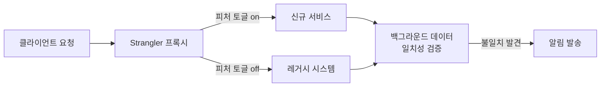
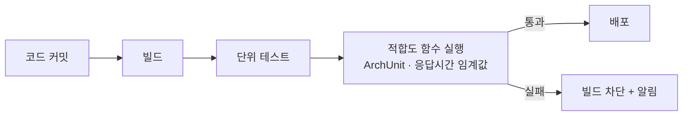

## 왜 고급 아키텍처 실무가 필요한가

지금까지의 15개 장은 대부분 "무엇을 어떻게 설계할 것인가"를 다뤘다. 원칙(2장)과 패턴(3–4장)으로 시스템의 형태를 결정하고, 품질 속성(5장)과 문서화(6장)로 그 형태를 표현하고, DDD(9–10장)와 분산 시스템 이론(12장)으로 경계와 일관성을 설계하고, 클라우드 네이티브 인프라(13장)와 API 통합(14장) 위에 실제로 구현하고, 거버넌스(15장)로 여러 팀에 걸쳐 그 설계를 일관되게 유지하는 방법을 배웠다. 그런데 실무에서 아키텍트가 매일 마주치는 질문은 조금 다르다. 이미 있는 낡은 시스템을 어떻게 죽이지 않고 바꿀 것인가, 잘 설계된 아키텍처가 시간이 지나도 계속 잘 설계된 상태로 남아 있게 하려면 무엇을 자동화해야 하는가, 평균 응답 시간은 멀쩡한데 왜 일부 사용자는 시스템이 느리다고 느끼는가, 그리고 완벽을 기다리다 아무것도 출시하지 못하는 대신 위험을 얼마나 감수할지 어떻게 숫자로 정할 것인가. 이 장은 이 네 가지 질문 — 레거시 현대화, 진화적 아키텍처, 성능 엔지니어링, 위험 관리 — 를 다루며, 앞선 15개 장에서 배운 이론을 실제로 운영 중인 시스템에 적용할 때 반복적으로 등장하는 실무 규율을 정리한다.

이 네 주제를 관통하는 공통 태도는 "빅뱅(big bang)보다 점진(incremental)"이다. Martin Fowler는 레거시를 한 번에 새 시스템으로 갈아엎는 대신 조금씩 기능을 옮겨가는 접근을 나무에 비유해 설명했다.

> "Like the fig, it begins with small additions, often new features, that are built on top of, yet separate to the legacy code base. As we do this we move bits of behavior from the legacy system into the new code base." — Martin Fowler, 『StranglerFigApplication』(2004년 최초 게시, 이후 개명), [martinfowler.com/bliki/StranglerFigApplication.html](https://martinfowler.com/bliki/StranglerFigApplication.html)

같은 태도가 적합도 함수(작은 단위로 아키텍처 특성을 지속 검증), 성능 엔지니어링(전체를 다시 튜닝하는 대신 병목 하나씩 제거), 위험 관리(모든 위험을 없애는 대신 감수할 위험의 크기를 명시)에도 그대로 반복된다. 이 장을 "고급 아키텍처 실무"라고 부르는 이유는 새로운 설계 이론이 아니라, 이미 배운 이론을 시간 축 위에서 — 즉 이미 돌아가고 있는 시스템 위에서 — 안전하게 적용하는 절차이기 때문이다.

## 이 장을 읽기 전에

이 장은 시리즈의 마지막 장으로, [15장 엔터프라이즈 아키텍처 관리](/post/software-architecture/enterprise-architecture-management/)에서 다룬 아키텍처 거버넌스·ADR·기술 로드맵을 이미 이해하고 있다고 전제한다. 또한 [12장 분산 시스템 아키텍처](/post/software-architecture/distributed-systems-architecture/)의 최종 일관성 개념과 [9–10장의 DDD](/post/software-architecture/ddd-strategic-design-fundamentals/) 바운디드 컨텍스트 개념을 알고 있으면 레거시 분해 논의를, [5장 품질 속성과 아키텍처](/post/software-architecture/quality-attributes-and-architecture/)의 신뢰성·성능 정의를 알고 있으면 위험 관리·성능 엔지니어링 논의를 더 빠르게 이해할 수 있다. 이 장의 난이도는 중급(레거시 시스템을 처음 현대화하는 개발자)부터 전문가(조직 전체의 아키텍처 진화 전략과 위험 감수 수준을 결정하는 아키텍트)까지 걸쳐 있으며, 전문가 구간에서는 적합도 함수의 4가지 분류 체계, 꼬리 지연시간이 팬아웃 구조에서 증폭되는 수학적 이유, 기술 부채 사분면의 실무 적용까지 다룬다. 다만 이 장은 특정 카오스 엔지니어링 도구(Chaos Monkey, Gremlin 등)의 설치·운영 방법, 특정 APM 제품(Datadog, New Relic 등)의 대시보드 설정, 구체적인 성능 튜닝 수치(JVM GC 옵션 등)는 다루지 않는다 — 이런 주제는 각 도구의 공식 문서와 플랫폼별 벤치마크를 참고해야 한다.

### 당신의 수준에 맞는 경로

| 수준 | 읽을 부분 | 핵심 목표 |
|---|---|---|
| 중급 (레거시 현대화를 처음 계획함) | Strangler Fig 패턴, 도메인 경계를 따라 자르기 | 프록시·피처 토글로 레거시와 신규 시스템을 병행 운영하는 절차를 설계할 수 있다 |
| 중급–고급 (지속적 배포 파이프라인 운영 경험) | 진화적 아키텍처와 적합도 함수, 성능 엔지니어링 | ArchUnit 같은 도구로 아키텍처 규칙을 자동 검증하고, 평균이 아닌 p95/p99 기준으로 병목을 진단할 수 있다 |
| 전문가 (조직의 위험 감수 수준을 결정) | 기술 부채·오류 예산·카오스 엔지니어링, 언제 쓰고 언제 피할지 | 기술 부채를 사분면으로 분류하고, 오류 예산으로 속도와 안정성의 트레이드오프를 숫자로 관리하며, 카오스 실험으로 복원력 가정을 검증할 수 있다 |

## 레거시 시스템의 점진적 현대화: Strangler Fig 패턴

### 정의와 동작 메커니즘

**Strangler Fig 패턴**은 레거시 시스템을 한 번에 교체하는 대신, 요청을 가로채는 프록시를 앞단에 두고 기능을 하나씩 신규 시스템으로 옮기면서 레거시 시스템의 책임 범위를 점진적으로 줄여가는 마이그레이션 전략이다. 이름은 실제 무화과나무(strangler fig)가 숙주 나무 위에서 씨앗을 틔워 자라다가 뿌리를 땅까지 내리고, 결국 숙주를 감싸며 대체하는 모습에서 따왔다 — Fowler는 2001년 퀸즐랜드 열대우림 여행에서 이 나무를 보고 착안했다고 알려져 있다. 메커니즘의 핵심은 **프록시가 라우팅 결정권을 가진다**는 점이다. 클라이언트는 신규 시스템과 레거시 시스템의 존재를 몰라도 되고, 오직 프록시의 엔드포인트만 알면 된다. 프록시는 요청마다(또는 사용자 ID·기능 플래그 기준으로) 이 요청을 레거시로 보낼지 신규 서비스로 보낼지 결정하고, 그 결정 규칙(피처 토글)을 배포와 분리해 런타임에 조정한다. 이 분리 덕분에 "10%의 트래픽만 신규 서비스로 보내본다" 같은 점진적 롤아웃이 코드 재배포 없이 가능해진다.

이 패턴이 빅뱅 재작성보다 나은 이유는 위험이 줄어드는 방식에 있다. 빅뱅 재작성은 재작성이 끝나는 시점까지 검증 가능한 산출물이 없고, 그 사이 레거시 시스템에 대한 요구사항 변경(비즈니스는 재작성을 기다려주지 않는다)이 누적되면서 목표가 계속 움직이는 이중 유지보수 문제에 빠지기 쉽다. Strangler Fig는 작은 조각 하나를 신규 시스템으로 옮길 때마다 그 조각만큼의 위험을 검증하고 되돌릴 수 있다는 점에서 다르다. Fowler는 이 접근의 이점을 다음과 같이 설명했다.

> "What this approach does do is make both investment and returns occur gradually and visibly, allowing the organization to evolve its software and business process to better support the current environment." — Martin Fowler, 『StranglerFigApplication』, [martinfowler.com/bliki/StranglerFigApplication.html](https://martinfowler.com/bliki/StranglerFigApplication.html)

아래 다이어그램은 신규 서비스로 트래픽 일부를 흘려보내면서 두 시스템의 응답을 비교 검증하는 전형적인 흐름을 보여준다.



프록시 구현에서 실무적으로 중요한 것은 "쓰기"와 "읽기"를 다르게 다뤄야 한다는 점이다. 아래 예제는 읽기는 피처 토글에 따라 한쪽에서만 가져오지만, 쓰기는 두 시스템 모두에 반영한 뒤 비동기로 일치성을 검증한다 — 신규 서비스가 아직 검증되지 않은 상태에서 레거시 데이터가 유실되는 사고를 막기 위한 방어적 설계다.

```java
// Strangler 프록시: 읽기는 토글 기준 단일 소스, 쓰기는 이중 반영 후 비동기 검증
@Component
public class StranglerFigProxy {

    private final LegacySystemClient legacyClient;
    private final NewServiceClient newServiceClient;
    private final FeatureToggleService featureToggle;

    public CustomerData getCustomer(String customerId) {
        if (featureToggle.isEnabled("new-customer-service", customerId)) {
            return newServiceClient.getCustomer(customerId);
        }
        return legacyClient.getCustomer(customerId);
    }

    public void updateCustomer(String customerId, CustomerUpdateRequest request) {
        legacyClient.updateCustomer(customerId, request);
        if (featureToggle.isEnabled("new-customer-service", customerId)) {
            newServiceClient.updateCustomer(customerId, request);
        }
        validateDataConsistencyAsync(customerId);
    }

    private void validateDataConsistencyAsync(String customerId) {
        CompletableFuture.runAsync(() -> {
            CustomerData legacyData = legacyClient.getCustomer(customerId);
            CustomerData newData = newServiceClient.getCustomer(customerId);
            if (!legacyData.equals(newData)) {
                alertService.sendAlert("데이터 불일치 발견: " + customerId);
            }
        });
    }
}
```

### 도메인 경계를 따라 자르기

프록시가 트래픽을 옮기는 메커니즘을 제공한다고 해서 "어디서부터 옮길 것인가"라는 질문이 저절로 풀리지는 않는다. 이 질문의 답은 이 장이 아니라 [9–10장에서 다룬 DDD](/post/software-architecture/ddd-strategic-design-fundamentals/)에 있다 — 레거시 시스템을 임의의 크기로 잘라 옮기면 잘린 조각들이 서로 강하게 결합돼 있어 결국 분산 모놀리스가 된다. 반면 바운디드 컨텍스트 경계를 먼저 식별하고, 응집도가 높고 외부 의존이 적은 컨텍스트(예: 카탈로그 조회처럼 다른 도메인 데이터를 거의 참조하지 않는 기능)부터 옮기면 각 조각이 독립적으로 검증 가능한 단위가 된다. 데이터 소유권 경계와 코드 경계가 어긋나 있는 레거시 시스템(하나의 거대한 테이블을 여러 화면이 공유하는 경우)에서는, 코드를 나누기 전에 데이터베이스 뷰나 CDC(Change Data Capture)로 데이터 접근을 먼저 분리하는 단계가 선행돼야 실제로 독립 배포가 가능한 조각이 나온다.

**흔한 오개념 하나**는 "Strangler Fig 패턴을 쓰면 마이그레이션이 항상 안전하다"는 생각이다. 실제로는 위 코드의 `validateDataConsistencyAsync`처럼 두 시스템 간 데이터 일치성을 지속적으로 검증하는 장치를 별도로 만들어야 하며, 이 검증 없이 트래픽만 전환하면 신규 시스템의 숨은 버그가 발견되지 않은 채 데이터가 갈라질 수 있다. **또 다른 오개념**은 "부분적으로만 옮기면 결국 더 오래 걸린다"는 생각인데, 이는 전체 마이그레이션 기간만 보고 그 기간 동안 얻는 지속적 검증 가치를 놓친 비교다 — 빅뱅 재작성은 실패했을 때 되돌릴 조각이 없지만, Strangler Fig는 실패한 조각만 롤백하면 된다.

## 진화적 아키텍처와 적합도 함수

### 적합도 함수란 무엇인가

시스템을 점진적으로 옮기는 방법을 정했다면, 그다음 질문은 "옮긴 뒤에도 아키텍처가 의도한 형태를 유지하고 있는지 어떻게 계속 확인할 것인가"다. Neal Ford, Rebecca Parsons, Patrick Kua는 2017년 저서 『Building Evolutionary Architectures』에서 이 확인 장치를 <strong>적합도 함수(fitness function)</strong>라 이름 붙였다.

> "Fitness functions describe how close an architecture is to achieving an architectural aim." — Neal Ford, Rebecca Parsons, Patrick Kua, 『Building Evolutionary Architectures』(2017, O'Reilly), [evolutionaryarchitecture.com](http://evolutionaryarchitecture.com/)

이 용어는 유전 알고리즘에서 개체의 적합도를 평가하는 함수를 아키텍처에 빌려온 것으로, 적합도 함수 기반 개발은 흔히 "아키텍처 버전의 테스트 주도 개발(TDD)"로 설명된다 — 코드가 요구사항을 만족하는지 단위 테스트로 검증하듯, 아키텍처가 순환 의존성 없음·계층 규칙 준수·응답 시간 임계값 같은 비기능 목표를 만족하는지 자동화된 검증으로 확인한다는 뜻이다. 적합도 함수는 성격에 따라 몇 가지 축으로 분류된다. 원자적(atomic) 함수는 순환 의존 금지처럼 단일 특성 하나만 검사하고, 전체론적(holistic) 함수는 여러 특성의 조합(성능은 유지하면서 보안 규칙도 통과하는지)을 함께 검사한다. 트리거 방식(triggered) 함수는 빌드 파이프라인에서 커밋마다 실행되고, 지속(continuous) 함수는 운영 환경에서 상시 모니터링으로 실행된다.

### 파이프라인에 통합하기

적합도 함수가 코드 리뷰의 사람 판단과 다른 지점은, 검증 규칙 자체가 코드로 표현되어 빌드 파이프라인에 편입된다는 점이다. Java 생태계에서 실제로 널리 쓰이는 도구가 ArchUnit이다 — 일반 단위 테스트 프레임워크(JUnit) 위에서 패키지 간 의존 방향, 계층 구조, 순환 의존 여부를 바이트코드 분석으로 검증하는 라이브러리다.

```java
// ArchUnit: 도메인 계층이 인프라 계층에 의존하지 않는지 빌드마다 검증
@AnalyzeClasses(packages = "com.example.order")
public class ArchitectureFitnessFunctionTest {

    @ArchTest
    static final ArchRule domainMustNotDependOnInfrastructure =
        noClasses().that().resideInAPackage("..domain..")
            .should().dependOnClassesThat().resideInAPackage("..infrastructure..");

    @ArchTest
    static final ArchRule noCyclicDependenciesBetweenModules =
        slices().matching("com.example.order.(*)..")
            .should().beFreeOfCycles();
}
```

이 규칙은 6장에서 문서화한 계층 구조 결정이 시간이 지나며 조용히 깨지는 것(architectural drift)을 막는다 — 문서는 다음 리뷰까지 코드와 어긋날 수 있지만, 빌드를 실패시키는 적합도 함수는 어긋나는 순간 즉시 알려준다. **흔한 오개념**은 적합도 함수를 일반 단위 테스트와 동일시하는 것이다. 단위 테스트는 "이 메서드가 올바른 값을 반환하는가"라는 기능 요구사항을 검증하지만, 적합도 함수는 "이 코드가 우리가 정한 아키텍처 특성(계층 규칙, 응답 시간, 결합도)을 유지하는가"라는 구조적 목표를 검증한다는 점에서 검증 대상이 다르다. **또 다른 오개념**은 "적합도 함수를 한 번 작성하면 끝"이라는 생각인데, 아키텍처 목표 자체가 진화하므로(예: 처음엔 허용했던 결합이 시스템 규모가 커지면서 병목이 되는 경우) 적합도 함수도 주기적으로 재검토해야 한다.



## 성능 엔지니어링: 평균이 아니라 꼬리를 본다

### USE·RED 방법론으로 병목을 분류한다

성능 엔지니어링에서 가장 흔히 저지르는 실수는 "느리다"는 증상을 임의의 순서로 조사하는 것이다. Netflix의 성능 엔지니어 Brendan Gregg가 제안한 **USE 방법론**은 모든 하드웨어 자원(CPU, 메모리, 디스크, 네트워크)을 사용률(Utilization)·포화도(Saturation)·오류(Errors) 세 지표로 순서대로 점검하도록 강제해 조사 순서를 표준화한다.

> "For every resource, check utilization, saturation, and errors." — Brendan Gregg, 『The USE Method』, [brendangregg.com/usemethod.html](http://www.brendangregg.com/usemethod.html)

이 방법론은 자원 관점에서 병목을 찾지만, 마이크로서비스처럼 자원보다 요청 흐름이 더 중요한 환경에서는 Weaveworks의 Tom Wilkie가 제안한 **RED 방법론**(요청률 Rate·오류율 Errors·처리 시간 Duration)이 더 자주 쓰인다. 두 방법론은 대립하지 않는다 — RED로 어떤 서비스가 느린지 먼저 좁히고, USE로 그 서비스가 어떤 자원에서 병목을 겪는지 좁히는 순서로 함께 쓰인다.

### 왜 p99가 중요한가

병목을 찾았다면 그다음 질문은 "무엇을 측정 지표로 삼을 것인가"다. 평균 응답 시간은 오해를 낳기 쉬운 지표다. 100개 요청 중 99개가 10ms, 1개가 5000ms 걸리면 평균은 60ms에 불과해 문제가 없어 보이지만, 실제로는 100명 중 1명이 5초를 기다린 것이다. Google의 Jeffrey Dean과 Luiz André Barroso는 2013년 Communications of the ACM에 게재한 논문에서, 이 꼬리 지연시간이 분산 시스템에서 특히 위험한 이유를 팬아웃 구조로 설명했다.

> "Large online services need to create a predictably responsive whole out of less predictable parts." — Jeffrey Dean, Luiz André Barroso, 『The Tail at Scale』, Communications of the ACM Vol. 56(2013), [research.google/pubs/the-tail-at-scale](https://research.google/pubs/the-tail-at-scale/)

이 논문의 핵심 통찰은, 하나의 사용자 요청이 내부적으로 100개의 하위 서비스를 병렬로 호출한다면 그중 단 하나만 느려도 전체 응답이 느려진다는 점이다. 각 하위 서비스가 개별적으로 p99(요청의 99%가 이 시간 안에 끝난다는 지표)를 10ms로 유지하더라도, 100개를 팬아웃하면 그중 최소 하나가 p99 밖에 걸릴 확률이 누적되어 전체 요청의 상당수가 "느린 하위 요청 하나 때문에" 느려진다. 그래서 마이크로서비스 아키텍처에서는 개별 서비스의 평균이 아니라 p95·p99 같은 백분위수를 SLO(Service Level Objective) 지표로 삼는 것이 표준 관행이다. 아래 예제는 이런 백분위수를 실제로 수집하는 계측 코드다.

```java
// Micrometer: 히스토그램 버킷을 활성화해 p95/p99 계산이 가능한 형태로 지연시간을 기록
@Component
public class RequestLatencyRecorder {

    private final MeterRegistry meterRegistry;

    @EventListener
    public void handleRequest(RequestEvent event) {
        Timer.builder("http.request.duration")
            .tag("uri", event.getUri())
            .publishPercentileHistogram()
            .register(meterRegistry)
            .record(event.getDurationNanos(), TimeUnit.NANOSECONDS);
    }
}
```

**흔한 오개념**은 "평균 응답 시간이 좋으면 사용자 경험도 좋다"는 것이다. 위에서 본 것처럼 평균은 소수의 극단값을 희석시키므로, 평균만 보고 안심하면 팬아웃 구조에서 실제로 다수 사용자가 겪는 지연을 놓치게 된다. 성능 엔지니어링 보고서·대시보드는 평균과 함께 반드시 p95·p99·최대값을 나란히 제시해야 이 왜곡을 피할 수 있다.

## 아키텍처 위험 관리: 기술 부채·오류 예산·카오스 엔지니어링

### 기술 부채는 항상 나쁜 것이 아니다

**기술 부채**라는 용어는 Ward Cunningham이 1992년 밴쿠버 OOPSLA에서 발표한 경험 보고서 「The WyCash Portfolio Management System」에서 처음 등장했다.

> "Shipping first time code is like going into debt. A little debt speeds development so long as it is paid back promptly with a rewrite." — Ward Cunningham, 『The WyCash Portfolio Management System』, OOPSLA(1992), [c2.com/doc/oopsla92.html](http://c2.com/doc/oopsla92.html)

Cunningham의 원래 취지는 "지저분한 코드를 정당화하는 핑계"가 아니라, 도메인에 대한 이해가 아직 불완전한 상태에서 코드를 출시하는 것 자체가 금융 부채와 비슷한 트레이드오프(빠른 출시라는 이익과, 나중에 갚아야 할 재작성 비용이라는 이자)를 가진다는 설명이었다. 이 구분을 실무에 적용하기 쉽게 정리한 것이 Martin Fowler의 기술 부채 사분면이다 — 부채를 의도적으로 졌는지 무심코 졌는지(의도성), 그 판단이 합리적이었는지 무분별했는지(신중성) 두 축으로 나눈다.

| | 의도적(Deliberate) | 무의도적(Inadvertent) |
|---|---|---|
| **신중한(Prudent)** | "지금은 이 지름길로 출시하고, 다음 스프린트에 갚는다" | 설계 당시엔 최선이었지만 요구사항이 바뀌며 드러난 부채 |
| **무분별한(Reckless)** | "설계할 시간 없으니 그냥 짠다" | 계층화·경계 개념 없이 짜서 생긴, 알아채지도 못한 부채 |

> "A team ignorant of design practices is taking on its reckless debt without even realizing how much hock it's getting into." — Martin Fowler, 『TechnicalDebtQuadrant』(2009), [martinfowler.com/bliki/TechnicalDebtQuadrant.html](https://martinfowler.com/bliki/TechnicalDebtQuadrant.html)

이 표에서 **신중하고 의도적인 부채**는 7장에서 다룬 SQALE 기반 기술 부채 측정·ATAM 위험 평가와 연결된다 — 위험을 없애는 것이 아니라 알고 감수한다는 점에서 성격이 같다. 반면 **무분별한 부채**는 방치하면 15장에서 다룬 아키텍처 원칙과 검토 프로세스가 없을 때 누적되는 유형으로, 거버넌스로 예방해야 할 대상이다.

### 오류 예산으로 속도와 안정성을 함께 관리한다

기술 부채가 "설계 결정의 위험"을 다룬다면, <strong>오류 예산(error budget)</strong>은 "운영 중 신뢰성의 위험"을 다루는 도구다. Google의 사이트 신뢰성 엔지니어링(SRE) 팀은 2016년 출간한 『Site Reliability Engineering』에서, 서비스의 신뢰성 목표(SLO)를 100%가 아니라 99.9% 같은 값으로 정하고, 그 차이(0.1%)를 "이번 분기에 써도 되는 장애 예산"으로 취급하는 방식을 제안했다.

> "The error budget provides a clear, objective metric that determines how unreliable the service is allowed to be within a single quarter." — Google SRE Team, 『Site Reliability Engineering』, Chapter 3(2016, O'Reilly), [sre.google/sre-book/embracing-risk](https://sre.google/sre-book/embracing-risk/)

메커니즘은 단순하다. SLO가 99.9%면 분기당 허용 다운타임(오류 예산)은 약 2시간 10분이다. 신규 기능 배포로 예산을 다 쓰면 그 분기 남은 기간은 신규 배포를 멈추고 안정화에 집중하고, 예산이 남아 있으면 제품팀은 배포 속도를 더 낼 수 있다. 이 숫자 하나가 "출시 속도를 우선할 것인가 안정성을 우선할 것인가"라는, 자칫 정치적 줄다리기가 되기 쉬운 논쟁을 데이터 기반 의사결정으로 바꾼다 — 이 장 도입부에서 언급한 "위험을 없애는 대신 감수할 크기를 명시한다"는 태도가 가장 구체적으로 드러나는 지점이다.

### 카오스 엔지니어링으로 가정을 검증한다

오류 예산이 "얼마나 실패해도 되는가"를 정하는 도구라면, **카오스 엔지니어링**은 "실제로 실패했을 때 시스템이 우리가 설계한 대로 견디는가"를 검증하는 도구다. Netflix는 2008년 대규모 데이터베이스 손상으로 3일간 서비스가 중단된 사고 이후 AWS 기반 분산 아키텍처로 전환하면서, 서버 하나가 예고 없이 사라지는 상황을 일부러 자주 만들어 시스템이 이를 견디는지 검증하는 도구를 만들었다고 알려져 있다 — 이 도구가 2010년경 만들어진 Chaos Monkey이며, Netflix는 2011년 이를 포함한 Simian Army를 공개했다. 이후 이 실험적 접근은 Netflix 엔지니어들이 정리한 선언문으로 하나의 규율이 되었다.

> "Chaos Engineering is the discipline of experimenting on a system in order to build confidence in the system's capability to withstand turbulent conditions in production." — Netflix Chaos Team(Ali Basiri 외), 『Principles of Chaos Engineering』(2015년경), [principlesofchaos.org](https://principlesofchaos.org/)

이 정의에서 중요한 단어는 "confidence(확신)"다. 카오스 엔지니어링은 장애를 예방하는 기법이 아니라, "서비스 하나가 죽어도 회로 차단기가 격리해줄 것"이라는 12장의 가정이나 "이 정도 부하는 오토스케일링이 흡수할 것"이라는 13장의 가정이 실제로 맞는지 프로덕션에서 확인하는 절차다. 정상 상태(steady state)를 먼저 측정 가능한 지표로 정의하고, 그 상태를 흔드는 변수(인스턴스 종료, 네트워크 지연 주입)를 실제 트래픽 위에서 작게 도입한 뒤, 정상 상태가 유지되는지 관찰하는 순서로 진행한다. **흔한 오개념**은 카오스 엔지니어링을 "무작위로 서버를 끄는 장난"으로 여기는 것이다. 실제로는 가설 수립 → 영향 범위 최소화 → 관찰 → 자동화라는 절차를 갖춘 실험이며, 무엇을 검증하려는지 정의되지 않은 상태에서 그냥 장애를 일으키는 것은 카오스 엔지니어링이 아니라 단순한 사고 유발이다.

## 언제 쓰고 언제 피할지

이 장에서 다룬 네 가지 기법은 도입 비용과 적합한 상황이 서로 다르다. Strangler Fig 패턴은 대체 대상 레거시가 여전히 운영 중이고 중단할 수 없을 때 거의 항상 옳은 선택이지만, 애초에 트래픽이 적고 중단 시간을 감수할 수 있는 내부 도구라면 프록시를 두는 비용 없이 그냥 새로 만들어 전환하는 편이 더 단순하다. 적합도 함수는 팀이 이미 CI 파이프라인을 갖추고 있고 아키텍처 규칙을 문서로만 남겨서는 지켜지지 않는다는 경험을 해봤을 때 투자 대비 효과가 크지만, 팀 규모가 작아 코드 리뷰만으로 규칙 위반을 다 잡아낼 수 있는 초기 단계 프로젝트에는 과할 수 있다. 성능 엔지니어링에서 p95·p99 계측은 사용자 대면 서비스, 특히 여러 하위 서비스를 팬아웃하는 구조에는 필수에 가깝지만, 배치 작업처럼 개별 요청의 지연시간보다 전체 처리량이 중요한 워크로드에는 다른 지표(처리량, 큐 적체량)가 더 적합하다.

위험 관리 세 도구(기술 부채 사분면, 오류 예산, 카오스 엔지니어링)는 조직의 성숙도에 따라 도입 순서를 정하는 것이 현실적이다. 기술 부채를 사분면으로 명시적으로 분류하고 ADR로 기록하는 습관은 팀 규모와 무관하게 지금 시작할 수 있다. 오류 예산은 SLO를 측정할 관측 인프라(11–13장에서 다룬 메트릭 수집)가 이미 있어야 의미가 있으므로, 관측 가능성이 갖춰지지 않은 조직이 오류 예산부터 도입하면 근거 없는 숫자 놀음이 된다. 카오스 엔지니어링은 셋 중 가장 늦게 도입해야 한다 — 회로 차단기·재시도·오토스케일링 같은 복원력 메커니즘(12–13장)이 먼저 갖춰져 있지 않은 시스템에 장애를 주입하면, 검증이 아니라 그냥 장애를 일으키는 결과로 끝난다.

## 평가 기준

이 장을 읽은 후 다음을 할 수 있어야 한다. Strangler Fig 패턴에서 프록시가 라우팅 결정을 담당하는 이유와, 쓰기를 이중 반영하면서 비동기로 데이터 일치성을 검증해야 하는 이유를 설명할 수 있다. 적합도 함수가 일반 단위 테스트와 어떻게 다른지(기능 요구사항 검증 대 아키텍처 특성 검증) 구분하고, ArchUnit 같은 도구로 계층 규칙을 빌드 파이프라인에 편입하는 절차를 설계할 수 있다. 평균 응답 시간이 왜 오해를 낳는 지표인지 팬아웃 구조를 근거로 설명하고, p95·p99를 SLO 지표로 삼아야 하는 이유를 말할 수 있다. Ward Cunningham의 기술 부채 비유와 Fowler의 기술 부채 사분면을 근거로, "부채는 항상 나쁘다"는 통념이 왜 부정확한지 설명하고 신중한 부채와 무분별한 부채를 구분할 수 있다. 오류 예산이 어떻게 제품 개발 속도와 안정성 사이의 논쟁을 데이터 기반 의사결정으로 바꾸는지 설명하고, SLO로부터 허용 다운타임을 계산할 수 있다. 마지막으로, 카오스 엔지니어링이 왜 복원력 메커니즘이 이미 갖춰진 시스템에서만 의미가 있는지 설명하고, 이 장에서 다룬 네 기법 각각을 조직의 성숙도와 상황에 맞게 도입 순서를 근거를 들어 정할 수 있다.

## 시리즈를 마치며

[00장](/post/software-architecture/getting-started-software-architecture-curriculum/)에서 밝힌 것처럼, 이 시리즈는 "이 기능들이 서로 어떻게 맞물려야 변경 비용이 시간에 비례해 폭발하지 않는가"라는 질문 하나에서 출발했다. 기본과정(1–8장)은 그 질문에 원칙과 패턴으로 답했고, 고급과정(9–16장)은 도메인·데이터·분산 시스템·클라우드 인프라·조직·시간이라는 서로 다른 축 위에서 같은 질문을 반복해 답했다. 이 마지막 장이 보여주려 한 것은, 아키텍처 설계가 청사진을 한 번 그리는 일이 아니라 Strangler Fig처럼 점진적으로 옮기고, 적합도 함수처럼 지속적으로 검증하고, 오류 예산처럼 감수할 위험의 크기를 계속 다시 정하는 반복적 실무라는 점이다. 16개 장에서 다룬 원칙과 도구는 정답을 자동으로 골라주지 않는다 — 그 대신 상황을 근거를 들어 판단할 수 있는 어휘를 제공한다. 그 어휘로 다음 설계 결정을 내리는 것은 이제 읽는 사람의 몫이다.
