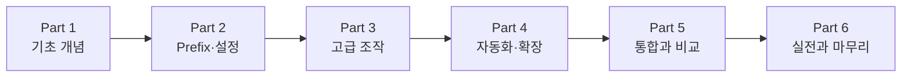

## 이 장을 읽기 전에

이 챕터는 "Tmux" 컬렉션의 첫 챕터이므로 선행 챕터가 없다.

난이도는 입문(터미널을 열어본 적은 있지만 tmux는 처음 접하는 수준)에서 중급(6개 Part가 왜 이 순서로 배치됐는지 판단할 수 있는 수준) 사이를 오간다. 특정 명령어의 옵션이나 키바인딩 목록은 다루지 않는다. 이 장은 지도(map)이지 명령어 레퍼런스가 아니다.

이 장이 다루지 않는 것은 다음과 같다. 세션·윈도우·패널을 실제로 조작하는 방법은 [01장](/post/tmux/what-is-tmux-terminal-multiplexer-architecture/) 이후 각 번호 챕터에서 다룬다. `tmux.conf` 문법과 키바인딩 재정의는 2부(05–08장)에서, 플러그인 설치와 자동화는 4부(13–16장)에서 각각 독립된 챕터로 다룬다. 이 장에서는 "왜 이런 순서로 배워야 하는가"와 "각 Part가 최종 역량에 어떻게 기여하는가"만 설명한다. 이 컬렉션은 tmux라는 터미널 멀티플렉서 자체에 범위를 한정한다 — 셸의 명령어·파이프라인·스크립팅 문법처럼 tmux 패널 안에서 실행하는 셸 자체의 사용법은 이 컬렉션의 범위 밖이며, `bashshell`·`cmd`·`powershell` 컬렉션에서 다루는 주제로 남겨둔다.

## 당신의 수준에 맞는 경로

| 수준 | 읽을 부분 | 핵심 목표 |
|---|---|---|
| 터미널 멀티플렉서를 처음 접하는 완전 초보자 | 전체를 순서대로 | tmux가 왜 필요한지, 세션·윈도우·패널 개념부터 차근차근 이해한다 |
| GNU screen이나 다른 멀티플렉서 경험자 | 도입, 핵심 개념, 비교/트레이드오프, 19장(대안 도구 비교) | 이미 아는 개념이 tmux의 어디에 대응하는지, 무엇이 다른지 파악한다 |
| SSH로 원격 서버를 자주 다루는 개발자 | 도입, 1부(01–04장), 17장(SSH 연동) | 접속이 끊겨도 세션을 잃지 않는 핵심 워크플로우부터 빠르게 익힌다 |
| 팀 온보딩·페어 프로그래밍 환경을 설계하는 사람 | 커리큘럼 전체 구성 표, 12장(세션 그룹), 21장(워크플로우 설계) | 여러 사람이 같은 세션을 공유하는 구조를 실제로 설계할 수 있는지 판단한다 |

## 도입

원격 서버에서 오래 걸리는 빌드를 돌리다가 노트북을 덮거나 와이파이가 끊기면, SSH 세션과 함께 그 안에서 실행 중이던 프로세스도 함께 죽는다. 다시 접속해도 방금까지 보던 로그와 셸 상태는 사라지고 처음부터 다시 시작해야 한다. <strong>Tmux(터미널 멀티플렉서, terminal multiplexer)</strong>는 이 문제를 정면으로 해결한다 — 터미널 세션을 클라이언트가 아니라 서버 쪽에 두어, 클라이언트 연결이 끊겨도 세션은 그대로 살아있고 나중에 다시 붙어서 이어갈 수 있게 한다.

tmux는 OpenBSD 개발자 Nicholas Marriott가 2007년 11월에 처음 공개한 것으로 알려져 있으며, 이후 OpenBSD 기본 시스템에 포함되는 표준 도구로 자리 잡았다. 터미널을 여러 개로 나누어 쓴다는 개념 자체는 그보다 오래된 GNU screen이 먼저 제공했지만, tmux는 서버-클라이언트 구조를 더 명확히 분리하고 키바인딩 체계를 다시 설계했다 — 그래서 screen과 기능은 겹쳐도 기본 단축키를 그대로 옮겨 쓸 수 있는 완전한 대체재는 아니다(호환 모드로 흉내낼 수는 있다). 이 역사적 맥락은 19장에서 대안 도구를 비교할 때 다시 다룬다.

이 컬렉션이 22개 챕터로 나뉘는 이유는, tmux를 "언젠가 쓸 일이 있으면 검색해서 찾아 쓰는 도구"가 아니라 "원격 개발·운영·페어 프로그래밍을 지탱하는 기반 기술"로 다루기 때문이다. 세션·윈도우·패널을 손으로 조작하는 법(1부)만 알아도 당장은 충분해 보이지만, 그 지식만으로는 매번 같은 레이아웃을 손으로 다시 만들어야 하고, 설정을 자신에게 맞게 바꿀 줄 모르면 기본 prefix 키(`Ctrl+b`)가 다른 프로그램의 단축키와 충돌하는 문제를 피할 수 없다. 이 커리큘럼은 수동 조작에서 시작해 설정·자동화·다른 도구와의 통합까지 단계적으로 넓혀가도록 설계했다.

## 핵심 개념

tmux는 <strong>서버-클라이언트 구조</strong>로 동작한다. 터미널을 처음 열고 `tmux`를 실행하면 백그라운드에서 tmux 서버 프로세스가 뜨고, 지금 보고 있는 터미널 창은 그 서버에 접속한 클라이언트일 뿐이다. 클라이언트를 종료해도(detach) 서버는 계속 살아 있으므로, 나중에 같은 서버에 다시 접속(attach)하면 마지막으로 보던 화면 그대로 이어받을 수 있다. 이 구조가 앞서 도입에서 설명한 "SSH가 끊겨도 작업이 살아남는" 동작의 근거다.

서버가 관리하는 작업 단위는 <strong>세션(Session)</strong> → <strong>윈도우(Window)</strong> → <strong>패널(Pane)</strong>의 3단계 계층으로 나뉜다. 세션은 하나의 독립된 작업 공간이고, 그 안에 브라우저 탭처럼 전환해 가며 쓰는 여러 윈도우가 있으며, 각 윈도우는 다시 화면을 가로·세로로 쪼갠 여러 패널로 나뉜다. 이 계층 구조를 언제, 어떻게 조작하는지는 3–4장에서 다루므로 이 장에서는 "왜 3단계로 나뉘어 있는가"만 짚는다 — 세션은 서로 다른 프로젝트를 격리하고, 윈도우는 한 프로젝트 안에서 서로 다른 역할(에디터, 로그, 실행)을 구분하고, 패널은 그 역할들을 한 화면에서 동시에 보기 위한 것이다.

이 정신 모델이 커리큘럼 순서를 결정한다. 세션·윈도우·패널을 손으로 다뤄보지 못하면(1부) 무엇을 자동화하고 싶은지조차 알 수 없고, prefix 키와 설정 파일의 동작 방식(2부)을 모르면 고급 조작(3부)에서 나오는 단축키를 자신에게 맞게 조정할 수 없다. 수동 조작과 설정에 익숙해진 뒤에야 그것을 스크립트·플러그인으로 자동화하는 4부가 의미를 가지며, 마지막으로 SSH·Vim 같은 주변 도구와 통합하는 5부, 실전 워크플로우를 설계하는 6부로 이어진다.

## 비교/트레이드오프

이 컬렉션을 활용하는 방식은 두 가지다. 아래 표는 그 두 방식의 장단점과 적합한 상황을 정리한 것이다.

| 구분 | 필요할 때 검색해서 익히기 | 커리큘럼을 순서대로 읽기 |
|---|---|---|
| 장점 | 당장 급한 문제(세션 끊김, 패널 분할)를 가장 빠르게 해결한다 | 빠진 개념 없이 체계적으로 습득하고, 다음에 부딪힐 문제를 미리 대비한다 |
| 위험 | 기본 조작에만 머물러 설정·자동화 같은 더 나은 대안을 놓치기 쉽다 | 초반 진입 비용이 검색보다 크다 |
| 적합한 상황 | 이미 기초가 있고 특정 명령어 옵션만 확인하려는 경우 | 처음 tmux를 배우거나, 체계적으로 빈 지식을 점검하려는 경우 |

이 컬렉션은 두 방식 모두를 지원하도록 설계됐다. 처음부터 순서대로 읽어 전체 흐름을 익힐 수도 있고, 특정 조작만 궁금하면 해당 장의 URL로 바로 이동해 사전처럼 찾아볼 수도 있다.

아래 다이어그램은 6개 Part가 어떤 순서로 서로를 전제하는지 요약한 것이다.

이 화살표는 물리적으로 강제되는 순서가 아니라 학습 효율을 위한 권장 순서다. 예를 들어 이미 GNU screen을 오래 써본 독자는 1부(기초 개념)의 조작 자체는 낯설지 않겠지만, 2부에서 다루는 tmux 고유의 설정 문법과 기본 prefix 키(`Ctrl+b`)는 screen의 `Ctrl+a`와 다르므로 건너뛰면 이후 장의 예제가 자신의 환경과 어긋날 수 있다.

## 흔한 오개념

<strong>"tmux는 SSH로 원격 서버에 붙어 있을 때만 쓸모 있다"</strong>는 생각은 흔한 오해다. 로컬 개발 환경에서도 한 창에서 에디터·테스트 실행·로그를 패널로 나눠 보는 용도로 자주 쓰이며, 12장에서 다루는 세션 공유 기능은 원격 접속 여부와 무관하게 페어 프로그래밍에 쓰인다.

<strong>"prefix 키 체계는 번거로우니 GUI 터미널의 탭·분할 기능으로 충분하다"</strong>는 생각도 흔하다. GUI 터미널의 탭은 그 터미널 애플리케이션을 닫으면 함께 사라지지만, tmux 세션은 서버에 남아 재현 가능하고, 14장에서 다루는 도구로 레이아웃 자체를 파일로 저장해 어떤 서버에서든 똑같이 재현할 수 있다는 점이 다르다.

<strong>"중첩 tmux(tmux 안에서 다시 tmux에 접속)는 특별히 신경 쓰지 않아도 된다"</strong>는 생각도 함정이다. 로컬 tmux 세션 안에서 SSH로 원격 서버에 접속한 뒤 그 서버에서 다시 tmux를 실행하면, 같은 prefix 키가 안쪽·바깥쪽 세션 중 어느 쪽에 전달될지 충돌한다. 이 문제와 해결책은 20장(트러블슈팅)에서 다룬다.

## 커리큘럼 전체 구성

이 과정은 6개 Part, 총 22개 챕터(00장 포함)로 구성된다. Part 구분은 "손으로 다룰 수 있다 → 내 환경에 맞게 설정할 수 있다 → 고급 조작으로 확장할 수 있다 → 자동화할 수 있다 → 주변 도구와 통합할 수 있다 → 실전 워크플로우를 설계할 수 있다"는 의존성 순서를 따른다.

| Part | 챕터 | 제목 | 슬러그 |
|---|---|---|---|
| 0. 개요 | 00 | 과정 개요와 커리큘럼 | 이 챕터 |
| 1. 기초 개념 | 01 | tmux란 무엇인가 - 터미널 멀티플렉서와 서버-클라이언트 구조 | what-is-tmux-terminal-multiplexer-architecture |
| 1. 기초 개념 | 02 | 설치와 첫 세션 - 기본 명령과 실행 흐름 | install-tmux-first-session-basic-commands |
| 1. 기초 개념 | 03 | 세션(Session) 다루기 - 생성·접속·분리·종료 | tmux-session-new-attach-detach-kill |
| 1. 기초 개념 | 04 | 윈도우와 패널 기초 - 분할·전환·닫기·zoom | tmux-window-pane-basics-split-zoom |
| 2. Prefix·설정 | 05 | Prefix 키와 커맨드 모드 | tmux-prefix-key-command-mode |
| 2. Prefix·설정 | 06 | tmux.conf 기초 - 설정 문법과 reload | tmux-conf-basics-set-options-reload |
| 2. Prefix·설정 | 07 | 키바인딩 커스터마이징 - bind-key와 vim 스타일 재배치 | tmux-keybinding-customization-vim-style |
| 2. Prefix·설정 | 08 | 상태바(Status Line) 커스터마이징 | tmux-status-bar-customization-status-line |
| 3. 고급 조작 | 09 | 레이아웃과 패널 동기화 - synchronize-panes | tmux-layout-synchronize-panes |
| 3. 고급 조작 | 10 | 카피 모드와 버퍼 - 클립보드 연동 | tmux-copy-mode-buffers-clipboard |
| 3. 고급 조작 | 11 | 윈도우/패널 재배치 - swap·move·break·join | tmux-swap-move-break-join-pane-window |
| 3. 고급 조작 | 12 | 세션 그룹과 다중 클라이언트 - 페어 프로그래밍 | tmux-session-groups-multiple-clients-pairing |
| 4. 자동화·확장 | 13 | tmux 커맨드라인과 스크립팅 - send-keys, run-shell | tmux-command-line-scripting-send-keys |
| 4. 자동화·확장 | 14 | tmuxinator와 tmuxifier - 프로젝트 레이아웃 관리 | tmuxinator-tmuxifier-project-layout-management |
| 4. 자동화·확장 | 15 | 플러그인 생태계와 TPM | tmux-plugin-manager-tpm-ecosystem |
| 4. 자동화·확장 | 16 | 필수 플러그인 실전 - resurrect·continuum·yank | tmux-resurrect-continuum-yank-essential-plugins |
| 5. 통합과 비교 | 17 | tmux와 SSH - 원격 세션 유지 | tmux-ssh-remote-session-persistence |
| 5. 통합과 비교 | 18 | tmux와 Vim/Neovim 통합 | tmux-vim-neovim-integration-navigator |
| 5. 통합과 비교 | 19 | 대안 도구 비교 - screen, Zellij, WezTerm | tmux-vs-screen-zellij-wezterm-comparison |
| 6. 실전과 마무리 | 20 | 트러블슈팅 - 클립보드·색상·중첩 세션 | tmux-troubleshooting-clipboard-colors-nested-sessions |
| 6. 실전과 마무리 | 21 | 실전 워크플로우 설계와 로드맵 | tmux-workflow-design-roadmap |

## Part별 설계 근거

Part 1(기초 개념, 01–04장)은 tmux가 무엇이고 어떻게 설치하며, 세션·윈도우·패널을 손으로 만들고 없애는 최소 동작을 다룬다. 이후 모든 Part의 예제는 세션을 만들고 패널을 나누는 조작을 전제로 하므로, 이 기초를 건너뛰면 뒤의 설정·자동화 예제를 재현할 수 없다.

Part 2(Prefix·설정, 05–08장)는 시선을 "조작"에서 "내 환경에 맞게 바꾸기"로 옮긴다. 기본 prefix 키가 왜 `Ctrl+b`인지, `tmux.conf`에서 무엇을 바꿀 수 있는지, 키바인딩과 상태바를 자신의 워크플로우에 맞게 재정의하는 법을 다룬다. 1부의 기본 조작을 모르는 상태로 설정부터 바꾸면 무엇이 기본값이고 무엇이 자신이 바꾼 값인지 구분할 수 없어 이 순서를 지켰다.

Part 3(고급 조작, 09–12장)은 2부에서 익힌 설정 위에서 레이아웃 동기화, 카피 모드와 클립보드, 패널·윈도우 재배치, 세션 그룹과 다중 클라이언트 공유처럼 여러 패널·여러 사람을 동시에 다루는 조작을 다룬다. 이 Part의 조작 대부분은 기본 키바인딩만으로는 불편해서 2부에서 배운 커스터마이징 능력을 실제로 활용하게 된다.

Part 4(자동화·확장, 13–16장)는 지금까지 손으로 반복하던 세션·레이아웃 구성을 스크립트와 플러그인으로 자동화한다. `send-keys`로 명령을 스크립트에서 주입하는 법, tmuxinator·tmuxifier로 프로젝트별 레이아웃을 재현하는 법, TPM으로 플러그인을 관리하고 tmux-resurrect·tmux-continuum으로 세션을 저장·복구하는 법을 다룬다. 수동 조작(1–3부)을 모르면 자동화 스크립트가 실제로 무엇을 재현하는지 이해할 수 없어 이 Part를 뒤에 배치했다.

Part 5(통합과 비교, 17–19장)는 tmux를 독립된 도구가 아니라 더 큰 개발 환경의 일부로 다룬다. SSH로 원격 세션을 유지하는 워크플로우, Vim/Neovim과 패널을 오가는 통합, GNU screen·Zellij·WezTerm 같은 대안과의 비교를 통해 tmux의 위치를 상대화한다.

Part 6(실전과 마무리, 20–21장)은 지금까지 배운 것을 실제 문제 해결과 워크플로우 설계로 수렴시킨다. 클립보드·색상·중첩 세션 같은 흔한 문제를 진단하는 법과, 개발·운영·페어 프로그래밍 시나리오별로 자신만의 레이아웃을 설계하는 법으로 컬렉션을 마무리한다.

이 순서에는 대안도 있다. 명령어를 기능 범주가 아니라 사용 빈도순으로 배치해 자주 쓰는 것부터 익히게 하는 구성도 가능하다. 그러나 사용 빈도순은 "왜 지금 이 기능을 배우는가"라는 맥락을 주지 못한다 — 키바인딩 재정의(2부)를 자동화(4부)보다 먼저 배우는 이유는, 자동화 스크립트 대부분이 결국 커스터마이징된 키·설정을 전제로 동작하기 때문이다. 이미 기초를 갖춘 독자는 "당신의 수준에 맞는 경로" 표를 따라 필요한 Part만 골라 읽는 쪽이 더 효율적일 수 있다.

## 선수 지식

이 과정을 시작하는 데 필요한 사전 지식은 많지 않다. 터미널(또는 콘솔) 창을 열고 텍스트로 명령을 입력하는 것에 거부감이 없으면 충분하며, 프로그래밍 경험은 필수가 아니다. 다만 기본적인 셸 명령(`cd`, `ls`, 파일 편집)에 익숙하면 예제를 훨씬 빠르게 따라갈 수 있다 — 셸 자체가 처음이라면 이 컬렉션과 짝을 이루는 `bashshell` 컬렉션을 먼저 훑어보는 것을 권한다. SSH로 원격 서버에 접속해 본 경험이 있으면 17장의 내용이 더 와닿지만, 없어도 이해에 지장은 없다. 리눅스나 macOS 환경에 접근할 수 있어야 하며(가상 머신, WSL, 클라우드 인스턴스 어느 것이든 무방하다), 실습을 직접 해보며 읽는 것을 권장한다.

## 완주 시 갖추는 역량

이 컬렉션을 끝까지 따라가면 "prefix 키 몇 개를 외웠다"는 수준을 넘어, 원격·로컬을 가리지 않고 안정적인 터미널 작업 환경을 스스로 설계하고 자동화하는 실무 역량을 갖추는 것을 목표로 한다. 아래 목록은 이 컬렉션의 각 Part가 구체적으로 어떤 실무 상황에 대응하는지 보여준다.

- SSH 접속이 끊기거나 노트북을 덮어도, 원격 서버에서 실행 중이던 작업을 잃지 않고 그대로 이어갈 수 있다.
- 세션·윈도우·패널을 목적에 맞게 구성해, 에디터·테스트·로그를 한 화면에서 동시에 관리할 수 있다.
- `tmux.conf`와 키바인딩을 자신의 워크플로우에 맞게 커스터마이징하고, 그 설정이 왜 그렇게 동작하는지 설명할 수 있다.
- TPM과 핵심 플러그인으로 세션 저장·자동 복구 같은 반복 작업을 자동화할 수 있다.
- Vim/Neovim과 tmux 패널을 매끄럽게 오가는 개발 환경을 구성할 수 있다.
- 팀 온보딩이나 페어 프로그래밍, 운영 대응 상황에서 세션을 공유하는 워크플로우를 설계할 수 있다.

## 다음 장에서는

[01장: tmux란 무엇인가 - 터미널 멀티플렉서와 서버-클라이언트 구조](/post/tmux/what-is-tmux-terminal-multiplexer-architecture/)에서는 tmux의 서버-클라이언트 구조와 세션·윈도우·패널 계층을 더 자세히 다룬다.

## 평가 기준

이 장을 읽은 후 다음을 할 수 있어야 한다.

- 체계적으로 순서대로 학습하는 방식과 필요할 때 검색하는 방식의 장단점을 설명하고, 자신의 상황에 맞게 선택할 수 있다.
- tmux의 서버-클라이언트 구조가 SSH 접속 끊김 문제를 어떻게 해결하는지 설명할 수 있다.
- 6개 Part(기초 개념-Prefix·설정-고급 조작-자동화·확장-통합과 비교-실전과 마무리)가 왜 이 순서인지, 하나를 건너뛰면 어떤 한계가 생기는지 설명할 수 있다.
- 자신의 배경(완전 초보/다른 멀티플렉서 경험/SSH 사용자/팀 설계자)에 따라 이 컬렉션의 어느 부분부터 읽어야 할지 판단할 수 있다.
- 00–21장 전체 목차에서 특정 주제(예: 클립보드 연동, 세션 공유, 플러그인)가 몇 장에서 다뤄지는지 찾을 수 있다.

## 참고 및 출처

1. [tmux/tmux](https://github.com/tmux/tmux) — tmux 공식 소스 저장소.
2. [tmux(1) - OpenBSD Manual](https://man.openbsd.org/tmux) — tmux 공식 매뉴얼(명령·옵션·키 바인딩).
