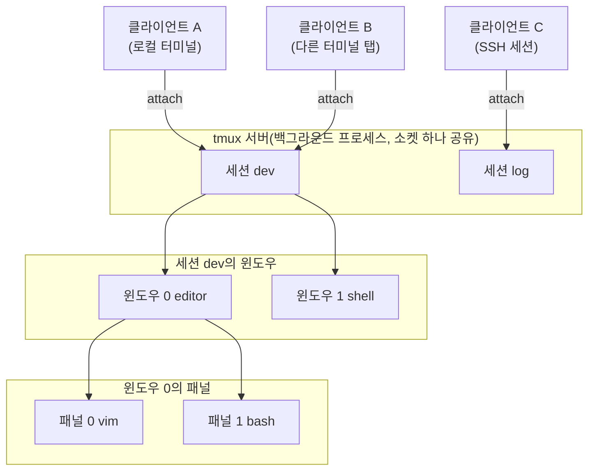

<strong>Tmux(터미널 멀티플렉서, terminal multiplexer)</strong>는 하나의 백그라운드 서버 프로세스가 여러 개의 논리적 터미널(세션·윈도우·패널)을 관리하고, 지금 보고 있는 터미널 창은 그 서버에 접속한 클라이언트일 뿐인 구조로 동작하는 도구다. 이 장은 tmux를 "명령어 모음"이 아니라 이 서버-클라이언트 구조와 세션·윈도우·패널 계층을 중심으로 이해하는 데 초점을 맞춘다.

## 이 장을 읽기 전에

**선행 챕터**: 이 장은 [00장: 과정 개요와 커리큘럼](/post/tmux/getting-started-tmux/) 바로 다음에 오는 <strong>Part 1(기초 개념)</strong>의 첫 챕터다. 터미널을 열고 명령을 입력할 수 있다는 것 외에 별도로 전제하는 지식은 없다.

**이 장의 깊이**: **입문**에서 **중급**(서버-클라이언트 구조와 소켓의 역할을 스스로 설명할 수 있는 수준) 사이를 오간다. **다루지 않는 것**: tmux를 실제로 설치하는 방법은 02장에서, 세션을 생성·전환·종료하는 구체적인 조작은 03장에서, 윈도우·패널을 나누고 옮기는 조작은 04장에서, `tmux.conf` 설정 문법은 2부(05–08장)에서 각각 독립된 챕터로 다룬다. 이 장에서는 "무엇이 어떻게 동작하는가"라는 구조만 다룬다.

## 당신의 수준에 맞는 경로

| 수준 | 읽을 부분 | 핵심 목표 |
|---|---|---|
| tmux를 처음 접하는 완전 초보자 | 개요 문단, 정신 모델, 세션·윈도우·패널 계층 | tmux가 왜 서버-클라이언트 구조인지, 계층이 왜 3단계인지 이해한다 |
| SSH로 원격 서버 작업을 자주 하는 개발자 | 서버-클라이언트 아키텍처, 명령으로 직접 확인하기, 비교/트레이드오프 | 접속이 끊겨도 작업이 살아남는 원리를 직접 명령으로 확인한다 |
| GNU screen 등 다른 멀티플렉서 경험자 | 서버-클라이언트 아키텍처, 주의사항·함정 | 이미 아는 개념(백그라운드 세션)이 tmux의 소켓·서버 모델과 어떻게 다른지 파악한다 |
| 여러 사람이 세션을 공유하는 환경을 설계하려는 사람 | 서버-클라이언트 아키텍처, 주의사항·함정(소켓 권한) | 소켓 경로와 권한이 다중 클라이언트 공유에 어떤 제약을 거는지 판단한다 |

## 정신 모델: 왜 서버와 클라이언트로 나뉘는가

터미널에서 `tmux`를 처음 실행하면, 눈에 보이는 화면 뒤에서 실제로는 두 가지 일이 일어난다. 첫째, 아직 tmux 서버 프로세스가 없다면 백그라운드에 하나를 새로 띄운다. 둘째, 지금 실행한 `tmux` 명령 자체는 그 서버에 접속하는 <strong>클라이언트</strong>가 되어, 서버가 관리하는 화면 내용을 받아 터미널에 그려주는 역할만 한다. 이 분리가 핵심이다 — 화면을 그리는 주체(클라이언트)와 실제로 셸·프로그램을 실행하고 그 상태를 들고 있는 주체(서버)가 다른 프로세스이기 때문에, 클라이언트가 사라져도(터미널 창을 닫거나 SSH가 끊겨도) 서버는 영향을 받지 않고 계속 실행된다.

이 구조는 일반적인 프로그램 실행 방식과 근본적으로 다르다. 보통 터미널에서 프로그램을 실행하면 그 프로그램은 터미널(정확히는 그 터미널이 소유한 pty, 의사 터미널)의 자식 프로세스로 묶인다. 터미널이 닫히면 커널이 그 pty에 연결된 프로세스들에 `SIGHUP`(hangup) 시그널을 보내고, 대부분의 프로그램은 이 시그널을 받으면 종료된다. tmux는 이 관계를 끊는다 — 셸과 그 안에서 실행되는 프로그램은 터미널 에뮬레이터가 아니라 tmux **서버**가 소유한 pty에 연결되고, 사용자가 보는 터미널 에뮬레이터는 그 서버에 접속한 클라이언트일 뿐이다. 그래서 클라이언트가 끊겨도 서버가 소유한 pty와 그 안의 프로세스는 영향을 받지 않는다.

## 서버-클라이언트 아키텍처

tmux 서버는 파일이 아니라 <strong>유닉스 도메인 소켓</strong>을 통해 클라이언트와 통신한다. 이 소켓은 기본적으로 `TMUX_TMPDIR` 환경변수가 가리키는 디렉터리(설정하지 않았다면 `/tmp`) 아래의 `tmux-<UID>` 디렉터리에 만들어지며, 여러 클라이언트가 같은 소켓에 접속하면 모두 같은 서버가 관리하는 세션 목록을 공유하게 된다. `-L` 옵션을 쓰면 이 디렉터리 안에서 소켓 이름만 다르게 지정할 수 있고, `-S` 옵션을 쓰면 아예 다른 경로에 소켓을 만들 수 있다 — 두 방법 모두 서로 완전히 독립된 tmux 서버를 여러 개 동시에 띄우는 용도로 쓰인다.

서버의 생명주기는 세션의 존재 여부에 매여 있다. 새 세션을 만들면(예: `tmux new -s work`) 그 순간 서버가 없으면 자동으로 시작되고, 반대로 마지막까지 남아 있던 세션이 종료되면 서버 프로세스도 함께 종료된다. 즉 세션에서 <strong>detach</strong>(분리)하는 것과 세션을 <strong>kill</strong>(종료)하는 것은 서버 입장에서 전혀 다른 사건이다 — detach는 클라이언트만 접속을 끊고 세션·서버는 그대로 남지만, 마지막 세션을 kill하면 서버까지 사라진다. 클라이언트가 다시 접속하는 <strong>attach</strong> 동작은 새 셸을 만드는 것이 아니라, 서버가 이미 들고 있는 세션의 pty에 다시 화면을 연결하는 것뿐이라 그 세션 안에서 실행 중이던 프로그램(예: 편집 중이던 vim)의 상태가 그대로 보존된다.

## 세션·윈도우·패널 계층

서버가 관리하는 작업 단위는 <strong>세션(Session)</strong> → <strong>윈도우(Window)</strong> → <strong>패널(Pane)</strong>의 3단계 계층으로 나뉜다. 세션은 서로 다른 프로젝트나 문맥을 격리하는 최상위 단위이고, 한 세션 안의 윈도우는 브라우저 탭처럼 한 번에 하나씩 전환해 가며 쓰는 여러 화면이며, 한 윈도우 안의 패널은 그 화면을 가로·세로로 쪼개 동시에 볼 수 있게 만든 영역이다. 이 계층을 실제로 만들고 옮기는 조작은 03–04장에서 다루므로, 여기서는 계층 자체의 의미만 짚는다 — 세션은 "무엇을 하는가"를 격리하고, 윈도우는 그 안에서 "어떤 역할인가"를 구분하고, 패널은 그 역할들을 "동시에 볼 필요가 있는가"에 따라 나눈다.

아래 다이어그램은 서버 하나에 여러 클라이언트가 접속하는 구조와, 세션 안의 윈도우·패널 계층을 함께 보여준다.



클라이언트 A와 B가 같은 세션 `dev`에 동시에 attach된 상태는 12장(세션 그룹과 다중 클라이언트)에서 다루는 페어 프로그래밍 워크플로우의 기반이 된다 — 두 클라이언트가 같은 서버, 같은 세션을 보고 있으므로 한쪽에서 입력한 내용이 다른 쪽 화면에도 즉시 반영된다.

## 명령으로 직접 확인하기

지금까지 설명한 구조는 실제로 몇 개의 명령만으로 눈으로 확인할 수 있다. 아래 예시는 서버가 세션과 독립적으로 살아있다는 것과, 소켓이 실제 파일로 존재한다는 것을 직접 보여준다.

```bash
# 설치된 tmux 버전 확인
tmux -V
# 예: tmux 3.4

# 이름을 붙인 새 세션을 만들고 즉시 그 안으로 들어간다
tmux new -s demo

# (세션 안에서) 현재 이 셸이 tmux 세션 안에서 실행 중인지 확인한다
echo $TMUX
# 비어 있지 않은 값이 출력되면 tmux 세션 안이라는 뜻이다
```

세션 안에서 prefix 키(`Ctrl+b`) 뒤 `d`를 눌러 detach하면 클라이언트만 접속이 끊기고 세션은 서버에 그대로 남는다. 다른 터미널에서 아래 명령으로 이를 확인할 수 있다.

```bash
# 서버가 관리 중인 세션 목록 확인 (detach 후에도 여전히 보인다)
tmux ls
# 예: demo: 1 windows (created ...)

# tmux 서버 프로세스 자체가 떠 있는지 확인
ps -eo pid,ppid,cmd | grep "tmux: server"

# 다시 같은 세션에 접속(attach) — 새 셸이 아니라 기존 상태 그대로 이어받는다
tmux attach -t demo
```

마지막으로 소켓이 실제 파일 시스템에 어떻게 남는지 확인한다.

```bash
# tmux가 쓰는 유닉스 도메인 소켓 디렉터리 확인 (리눅스/macOS)
ls -la /tmp/tmux-$(id -u)/
# 예: default   (기본 소켓 이름, 세션이 하나 이상 있을 때만 존재)

# -L로 소켓 이름을 다르게 지정하면 완전히 독립된 서버가 새로 뜬다
tmux -L work new -s project
tmux -L work ls
```

## 비교/트레이드오프

tmux 없이 터미널을 쓸 때와 비교하면 서버-클라이언트 구조가 실제로 무엇을 얻고 잃는지 더 분명해진다.

| 구분 | 일반 터미널 창(멀티플렉서 없음) | tmux 세션 |
|---|---|---|
| 실행 중인 프로세스의 생존 | 터미널 창을 닫거나 SSH가 끊기면 `SIGHUP`으로 대부분 함께 종료된다 | 서버가 소유한 pty에서 계속 실행되어 클라이언트 연결 여부와 무관하다 |
| 재접속 | 화면 상태를 재현할 표준 수단이 없다 | `tmux attach`로 마지막 화면 상태 그대로 복귀한다 |
| 여러 사용자가 같은 화면 보기 | 기본 지원 없음(별도 화면 공유 도구 필요) | 같은 세션에 여러 클라이언트가 동시에 attach해 화면을 공유할 수 있다(12장) |
| 자원 오버헤드 | 없음 | 서버 프로세스 하나가 세션이 존재하는 동안 상시 상주한다 |

두 방식 모두 완전한 정답은 아니다. 짧게 끝나는 로컬 작업이라면 tmux 서버를 띄우는 오버헤드가 불필요할 수 있지만, 오래 걸리는 원격 작업이나 여러 화면을 동시에 관리해야 하는 상황에서는 서버-클라이언트 구조가 주는 지속성이 결정적인 이점이 된다.

## 주의사항·함정

**소켓 경로와 권한**: 기본 소켓은 사용자 UID별 디렉터리(`/tmp/tmux-<UID>`)에 만들어지므로 다른 사용자와 자동으로 공유되지 않는다. 여러 사용자가 같은 세션을 함께 보려면 소켓 파일 자체의 권한을 조정하거나, `-S`로 서로 접근 가능한 별도 경로를 지정해야 한다. 구체적인 페어 프로그래밍 설정은 12장에서 다룬다.

**서버 자동 종료 조건**: detach는 서버를 살려두지만, 세션 자체를 `tmux kill-session`으로 종료하면 그것이 마지막 세션이었을 경우 서버 프로세스까지 함께 사라진다. "세션이 하나도 안 보인다"는 문제를 진단할 때는 클라이언트가 끊긴 것인지, 세션이 실제로 종료돼 서버까지 내려간 것인지부터 구분해야 한다.

**중첩 tmux에서 prefix 키 충돌**: 로컬에서 이미 tmux 세션에 들어간 상태로 SSH로 원격 서버에 접속한 뒤, 그 서버에서 다시 tmux를 실행하면 두 서버-클라이언트 관계가 겹친다. 이때 같은 prefix 키(`Ctrl+b`) 입력은 기본적으로 바깥쪽(로컬) 세션이 먼저 소비하므로, 안쪽(원격) 세션에 명령을 보내려면 prefix를 두 번 누르는 등 별도 처리가 필요하다. 이 문제의 실전 해결책은 20장(트러블슈팅)에서 다룬다.

## 흔한 오개념

<strong>"세션을 여러 개 만들면 tmux 서버도 세션 개수만큼 따로 뜬다"</strong>는 생각은 틀렸다. 기본적으로는 하나의 서버가 같은 소켓 아래 여러 세션을 동시에 관리하며, 서버가 여러 개 뜨는 경우는 `-L`이나 `-S`로 명시적으로 다른 소켓을 지정했을 때뿐이다.

<strong>"detach는 nohup처럼 프로세스를 그냥 백그라운드로 보내는 것과 같다"</strong>는 오해도 흔하다. `nohup`은 실행한 프로세스가 `SIGHUP`을 무시하도록 만들 뿐이고 그 프로세스는 여전히 원래 터미널의 자식으로 남지만, tmux는 애초에 pty를 서버 프로세스가 소유하고 클라이언트는 그 화면을 보여주는 뷰어 역할만 하므로 클라이언트의 생존과 세션의 생존이 프로세스 구조 수준에서부터 분리되어 있다.

<strong>"attach하면 세션 안의 프로그램이 새로 시작된다"</strong>는 오해도 있다. attach는 새 셸이나 새 프로세스를 만드는 동작이 아니라, 서버가 이미 들고 있는 세션의 화면에 다시 연결하는 것뿐이다. detach 직전에 편집 중이던 파일이나 실행 중이던 명령의 출력이 attach 후에도 그대로 남아 있는 이유가 여기에 있다.

## 다음 장에서는

[02장: 설치와 첫 세션 - 기본 명령과 실행 흐름](/post/tmux/install-tmux-first-session-basic-commands/)에서는 이 서버-클라이언트 구조를 실제로 손으로 만들어보기 위해, 운영체제별 설치 방법과 첫 세션을 만들고 없애는 기본 명령을 다룬다.

## 평가 기준

이 장을 읽은 후 다음을 할 수 있어야 한다.

- tmux의 서버-클라이언트 구조가 일반 터미널의 부모-자식 프로세스 관계와 어떻게 다른지, `SIGHUP` 시그널을 예로 들어 설명할 수 있다.
- 유닉스 도메인 소켓이 tmux 클라이언트-서버 통신에서 어떤 역할을 하는지, `-L`/`-S` 옵션의 차이를 설명할 수 있다.
- detach·attach·kill이 서버의 생명주기에 각각 어떤 영향을 주는지 구분할 수 있다.
- 세션·윈도우·패널 3단계 계층이 왜 그렇게 나뉘어 있는지 설명할 수 있다.
- `tmux ls`, `ps`, 소켓 디렉터리 확인 같은 명령으로 서버가 실제로 살아있음을 직접 검증할 수 있다.

## 참고 및 출처

1. [tmux(1) - OpenBSD Manual](https://man.openbsd.org/tmux) — 서버-클라이언트 구조, 소켓 경로(`TMUX_TMPDIR`/`tmux-UID`), `-S`/`-L` 옵션, 세션 지속성과 서버 종료 조건에 대한 공식 설명.
2. [tmux/tmux](https://github.com/tmux/tmux) — tmux 공식 소스 저장소.
