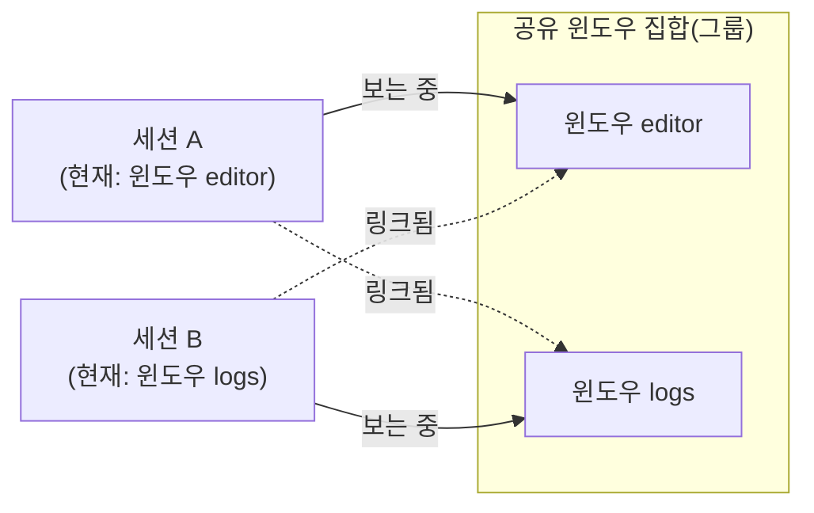

3부(고급 조작)의 마지막 장이다. 01장에서 "여러 클라이언트가 같은 세션에 붙어 화면을 공유할 수 있다"고 예고했던 내용을 여기서 실제로 다룬다. 한 세션을 여러 사람이 동시에 보는 방식과, 창 집합만 공유하고 각자 다른 화면을 보는 <strong>세션 그룹</strong> 방식은 서로 다른 개념이며, 이 장은 이 둘을 구분해 페어 프로그래밍·멘토링 같은 실전 시나리오에 적용하는 법을 다룬다.

## 이 장을 읽기 전에

**선행 챕터**: 이 장은 [11장: 윈도우/패널 재배치](/post/tmux/tmux-swap-move-break-join-pane-window/)로 3부를 마무리하며, 01장에서 예고했던 다중 클라이언트 공유와 소켓 권한 문제를 실제로 다룬다.

**이 장의 깊이**: **입문**에서 **중급**(같은 세션 공유와 세션 그룹의 차이, `read-only`·`ignore-size` 플래그를 상황에 맞게 조합할 수 있는 수준) 사이를 오간다. **다루지 않는 것**: SSH로 원격 서버에 접속해 세션을 유지하는 것 자체는 17장에서 다룬다. 이 장은 "이미 접속 가능한 서버에서 여러 사람이 어떻게 화면을 공유할지"에 집중한다.

## 당신의 수준에 맞는 경로

| 수준 | 읽을 부분 | 핵심 목표 |
|---|---|---|
| 세션을 늘 혼자 써 온 사람 | 정신 모델, 명령과 옵션, 예시 | 같은 세션에 다른 사람을 초대해 화면을 실시간으로 공유할 수 있다 |
| 멘토링·페어 프로그래밍을 하려는 사람 | 예시(read-only), 비교/트레이드오프 | 상대방이 보기만 하게 할지, 함께 조작하게 할지 상황에 맞게 고를 수 있다 |
| 팀원과 화면 크기가 서로 달라 곤란했던 사람 | 명령과 옵션(ignore-size), 주의사항·함정 | 여러 사람의 터미널 크기가 달라도 화면이 깨지지 않게 관리할 수 있다 |
| 같은 창 집합을 공유하되 각자 다른 창을 보고 싶은 사람 | 정신 모델(세션 그룹), 예시 | 세션 그룹으로 창은 공유하되 탐색은 독립적으로 유지할 수 있다 |

## 정신 모델: "같은 세션 공유"와 "세션 그룹 공유"는 다르다

여러 사람이 화면을 함께 보는 방법은 흔히 하나로 뭉뚱그려 이야기되지만, tmux에는 실제로 서로 다른 두 가지 메커니즘이 있다.

<strong>같은 세션에 여러 클라이언트가 attach</strong>하면, 모든 클라이언트가 정확히 같은 화면을 실시간으로 본다. 한쪽이 다른 윈도우로 전환하면 다른 쪽의 화면도 그 순간 함께 바뀐다 — 두 사람이 하나의 화면을 물리적으로 같이 들여다보는 것과 같다.

<strong>세션 그룹</strong>(`new-session -t 그룹`)은 이와 다르다. 같은 그룹에 속한 세션들은 <strong>같은 윈도우 집합을 공유</strong>한다 — 한쪽에서 새 윈도우를 만들면 그룹의 모든 세션에 그 윈도우가 함께 링크되고, 윈도우를 닫으면 모든 세션에서 함께 사라진다. 하지만 지금 어느 윈도우를 보고 있는지(현재·이전 윈도우)와 세션별 옵션은 <strong>세션마다 독립적으로 유지</strong>된다 — 한 사람은 에디터 창을, 다른 사람은 로그 창을 동시에 각자 보고 있을 수 있다는 뜻이다. 그룹 안의 한 세션을 종료해도 같은 윈도우를 쓰는 다른 세션에는 영향이 없다.

아래 다이어그램은 이 구조를 노드와 화살표로 정리한 것이다. 두 세션이 같은 윈도우 목록을 함께 가리키면서도, 각자 다른 윈도우를 "현재 보는 중"으로 표시할 수 있다는 점이 핵심이다.



## 명령과 옵션

이 장의 명령은 크게 세 갈래로 나뉜다. `attach-session`의 플래그들은 "이 클라이언트가 무엇을 할 수 있는가"를 정하고, `new-session -t`는 세션 그룹을 만들거나 합류하는 방법을, `list-clients`와 `window-size`는 지금 누가 접속해 있고 화면 크기를 어떻게 조율할지를 다룬다.

| 명령/옵션 | 주요 플래그 | 설명 |
|---|---|---|
| `attach-session` | `-d`(다른 클라이언트 분리), `-r`(읽기 전용), `-x` | `-r`은 `-f read-only,ignore-size`의 축약형이다. 읽기 전용 클라이언트는 `detach-client`/`switch-client`에 연결된 키를 제외한 모든 입력이 무시된다 |
| `attach-session -f` | `read-only`, `ignore-size`, `no-detach-on-destroy`, `no-output`, `pause-after=초`, `wait-exit` | 클라이언트별 세부 동작을 개별적으로 조합할 수 있는 플래그 목록. 앞에 `!`를 붙이면 이미 켜진 플래그를 끈다 |
| `new-session -t 그룹` | - | 새 세션을 지정한 세션 그룹에 합류시킨다. 그룹 이름이 기존 그룹이면 거기 추가되고, 기존 세션 이름이면 그 세션과 같은 그룹이 새로 만들어지며, 둘 다 아니면 새 세션만 담긴 새 그룹이 생긴다 |
| `list-clients`(`lsc`) | `-t 대상세션`, `-O 정렬` | 서버에 붙어 있는 모든 클라이언트를 나열한다. `-t`로 특정 세션에 붙은 클라이언트만 볼 수 있다 |
| `window-size` | `largest`/`smallest`/`manual`/`latest` | 여러 클라이언트의 터미널 크기가 다를 때 윈도우 크기를 어떤 기준으로 정할지 결정한다 |

## 예시

### 관찰자로 세션에 합류하기

멘토링 상황에서는 조작 권한 없이 화면만 보여줘야 할 때가 많다. 상대방이 실수로 명령을 입력하지 못하게 하려면 읽기 전용으로 접속시킨다.

```bash
# 읽기 전용 + 자신의 터미널 크기가 세션 크기에 영향을 주지 않도록 접속
tmux attach -t work -r
```

### 화면 크기가 서로 다른 사람과 공유하기

노트북처럼 작은 화면을 쓰는 사람이 참여하면, 그 화면 크기에 맞춰 전체 세션이 함께 줄어드는 경우가 흔하다. `-r` 없이도 `ignore-size` 플래그만 따로 켤 수 있다. 조작은 허용하되 자신의 작은 화면 때문에 상대방의 넓은 화면이 줄어들지 않게 하고 싶을 때 쓴다.

```bash
tmux attach -t work -f ignore-size
```

### 세션 그룹으로 창은 공유하되 각자 다른 창 보기

같은 프로젝트의 창들을 두 사람이 공유하되, 한 사람은 에디터 창을 다른 사람은 테스트 실행 창을 동시에 보고 싶을 때는 같은 세션이 아니라 세션 그룹을 쓴다.

```bash
# 첫 번째 사람: work 세션 생성
tmux new -s work

# 두 번째 사람: work와 같은 그룹으로 새 세션을 만들어 합류
tmux new -t work -s work-mirror

# 이제 두 세션은 같은 윈도우 집합을 공유하지만,
# 각자 select-window로 서로 다른 창을 독립적으로 볼 수 있다
```

### 지금 누가 접속해 있는지 확인하고 내보내기

공유 세션을 오래 열어두다 보면 누가 아직 붙어 있는지, 실수로 남겨둔 클라이언트는 없는지 확인해야 할 때가 있다.

```bash
# work 세션에 붙어 있는 클라이언트 목록
tmux list-clients -t work

# 특정 클라이언트만 지정해 분리
tmux detach-client -t /dev/pts/3
```

## 비교/트레이드오프

같은 세션을 공유할지 세션 그룹을 쓸지는 "화면을 완전히 똑같이 볼 것인가"에 달려 있다. 실시간으로 같은 화면을 함께 보여줘야 하는 발표나 1:1 멘토링이라면 전자가 맞고, 같은 프로젝트를 두고 각자 다른 부분을 동시에 들여다봐야 하는 협업이라면 후자가 더 자연스럽다. 어느 쪽을 고를지 헷갈릴 때는 "지금 상대방이 내가 보는 것과 완전히 같은 것을 봐야 하는가"라는 질문 하나로 좁혀서 판단할 수 있다.

| 구분 | 같은 세션에 다중 attach | 세션 그룹 |
|---|---|---|
| 화면 동기화 | 완전히 동일(실시간 미러링) | 창 집합은 같지만 탐색은 독립적 |
| 세션 옵션 | 하나의 세션이므로 공유 | 세션마다 독립(상태바 스타일 등을 각자 다르게 가능) |
| 적합한 상황 | 화면을 그대로 함께 보여줘야 하는 발표·1:1 멘토링 | 같은 프로젝트 창들을 두고 각자 다른 부분을 동시에 보고 싶은 협업 |
| 한쪽이 종료되면 | 남은 클라이언트는 세션에 그대로 남는다 | 한 세션이 죽어도 같은 창을 쓰는 다른 세션은 영향 없다 |

## 주의사항·함정

여러 사람이 한 서버·세션을 함께 쓰는 순간부터, 혼자 쓸 때는 신경 쓰지 않아도 됐던 문제들이 새로 생긴다. 시스템 계정이 다르면 애초에 접속 자체가 막힐 수 있고, 터미널 크기가 다르면 화면이 예상과 다르게 줄어들 수 있다.

**소켓 권한 문제**: 01장에서 다뤘듯 기본 소켓은 사용자 UID별 디렉터리(`/tmp/tmux-<UID>`)에 있어 다른 시스템 계정을 쓰는 사람과는 자동으로 공유되지 않는다. 이는 tmux만의 제약이 아니라, 그 소켓 파일 자체가 리눅스·macOS 같은 운영체제의 일반적인 파일 시스템 권한 규칙(소유자·그룹·기타 사용자별 읽기·쓰기 권한)을 그대로 따르기 때문이다. 서로 다른 계정을 가진 사람과 세션을 공유하려면, 소켓 파일의 그룹 권한을 조정하거나 같은 계정으로 함께 접속하는 방식(예: 공용 페어 프로그래밍 계정)을 미리 준비해야 한다.

**터미널 크기 충돌**: 여러 사람이 서로 다른 크기의 터미널로 접속하면 `window-size` 옵션에 따라 화면이 가장 작은 사람 크기로 줄어들 수 있다. 조작 권한이 필요 없는 참가자는 `ignore-size`(또는 `-r`)로 접속시켜 이 문제를 피한다.

**읽기 전용도 완전히 무력하지는 않다**: `read-only` 클라이언트라도 `detach-client`나 `switch-client`에 연결된 키는 여전히 동작한다. "읽기 전용이니 아무 키도 안 먹는다"고 가정하면 안 된다.

## 흔한 오개념

<strong>"세션 그룹은 같은 세션에 여러 명이 붙는 것과 같은 말이다"</strong>는 생각은 틀렸다. 같은 세션 공유는 화면 자체가 완전히 동일하지만, 세션 그룹은 창 집합만 공유할 뿐 각 세션이 지금 보고 있는 창과 세션 옵션은 서로 독립적이다.

<strong>"읽기 전용 클라이언트는 화면조차 볼 수 없다"</strong>는 오해도 있다. 실제로는 화면은 그대로 보이고, `detach-client`/`switch-client` 외의 입력만 막힌다.

<strong>"여러 사람이 접속하면 화면 크기 문제는 피할 수 없다"</strong>는 생각도 정확하지 않다. `ignore-size` 플래그와 `window-size` 옵션을 조합하면 특정 클라이언트의 터미널 크기가 다른 사람의 화면에 영향을 주지 않게 관리할 수 있다.

## 다음 장에서는

[13장: tmux 커맨드라인과 스크립팅 - send-keys, run-shell](/post/tmux/tmux-command-line-scripting-send-keys/)부터는 4부(자동화·확장)로 넘어가, 지금까지 손으로 입력해 온 명령을 스크립트로 자동화하는 법을 다룬다.

## 평가 기준

이 장을 읽은 후 다음을 할 수 있어야 한다.

- 같은 세션에 여러 클라이언트가 붙는 것과 세션 그룹의 차이를 설명할 수 있다.
- `attach-session -r`(read-only)이 실제로 무엇을 허용하고 무엇을 막는지 설명할 수 있다.
- `ignore-size`와 `window-size` 옵션으로 여러 터미널 크기 문제를 관리할 수 있다.
- 세션 그룹을 만들어 창 집합은 공유하면서 각자 다른 창을 탐색하게 구성할 수 있다.
- 다른 시스템 계정을 쓰는 사람과 세션을 공유할 때 소켓 권한이 왜 문제가 되는지 설명할 수 있다.

## 참고 및 출처

1. [tmux(1) - OpenBSD Manual](https://man.openbsd.org/tmux) — `attach-session`(`-r`/`-f` 플래그), `new-session -t`(세션 그룹), `list-clients`, `window-size` 공식 설명.
2. [tmux/tmux](https://github.com/tmux/tmux) — tmux 공식 소스 저장소.
