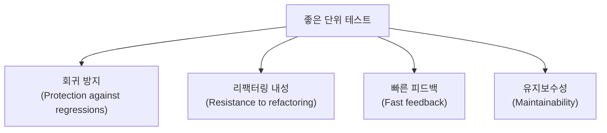

# 04. 좋은 단위 테스트를 가르는 4대 요소

지금까지는 "테스트가 있다/없다"를 기준으로 이야기했습니다. 이 편부터는 기준을 한 단계 더 세분화합니다. **같은 테스트라도 네 가지 요소를 얼마나 만족하느냐에 따라 값어치가 다릅니다.** 이 네 요소는 이후 05~11편에서 특정 기법(목, 스타일, 통합 테스트)을 평가할 때 반복해서 등장하는 공통 잣대입니다.

## 학습 목표

- 네 요소(회귀 방지, 리팩터링 내성, 빠른 피드백, 유지보수성)를 각각 설명할 수 있다.
- 거짓 양성과 거짓 음성의 차이를 구분하고, 어느 쪽이 더 해로운지 판단할 수 있다.
- 네 요소가 서로 트레이드오프 관계에 있음을 이해하고, 특정 테스트가 어떤 요소를 포기했는지 진단할 수 있다.

## 네 요소 한눈에 보기

이 네 요소는 Vladimir Khorikov가 『Unit Testing: Principles, Practices, and Patterns』(2020)에서 제시한 평가 기준입니다. 이 시리즈는 이 프레임워크를 기준으로 삼되, 예제와 설명은 독자적으로 구성합니다.



- **회귀 방지**: 코드에 버그가 생기면 테스트가 실제로 잡아내는가?
- **리팩터링 내성**: 동작은 그대로인데 내부 구현만 바꿨을 때, 테스트가 억울하게 깨지지 않는가?
- **빠른 피드백**: 테스트 하나가 얼마나 빨리 끝나는가?
- **유지보수성**: 테스트를 이해하고 유지하는 데 드는 비용이 얼마나 적은가?

## 회귀 방지: 버그를 실제로 잡아내는가

회귀 방지력은 다음 요소에 좌우됩니다.

- **테스트가 실행하는 코드량**: 실행되지 않는 코드는 버그가 있어도 테스트가 알아채지 못합니다.
- **코드의 복잡도**: 분기가 많은 로직일수록 놓치는 케이스가 생기기 쉽습니다.
- **도메인 유의성**: 단순 getter/setter보다 비즈니스 규칙을 담은 코드가 회귀에 더 취약합니다.

```python
class ShippingPolicy:
    def is_free_shipping(self, total: int, is_member: bool) -> bool:
        if is_member:
            return total >= 30000
        return total >= 50000


def test_free_shipping_boundary_for_member():
    policy = ShippingPolicy()
    assert policy.is_free_shipping(30000, is_member=True) is True
    assert policy.is_free_shipping(29999, is_member=True) is False
```

이 테스트는 경계값(30000/29999)을 정확히 검증하므로 회귀 방지력이 높습니다. 반대로 `is_free_shipping(100000, True) is True` 하나만 확인하는 테스트는 경계 로직의 버그(예: `>=`를 `>`로 잘못 고치는 실수)를 놓칠 수 있습니다.

## 리팩터링 내성: 거짓 양성을 최소화하는가

리팩터링 내성은 **"동작은 그대로 두고 구현만 바꿨을 때 테스트가 계속 통과하는가"**를 뜻합니다. 이 요소가 낮으면 **거짓 양성(false positive)**이 자주 발생합니다. 거짓 양성이란 코드가 실제로는 정상인데 테스트가 실패로 보고하는 경우입니다.

```python
class OrderService:
    def __init__(self, repository) -> None:
        self._repository = repository

    def place_order(self, order_id: str, total: int) -> None:
        self._repository.save(order_id, total)
```

```python
from unittest.mock import Mock

# 리팩터링 내성이 낮은 테스트: 구현 세부사항(호출 방식)에 결합됨
def test_place_order_calls_save_fragile():
    mock_repo = Mock()
    service = OrderService(mock_repo)

    service.place_order("order-1", 10000)

    mock_repo.save.assert_called_once_with("order-1", 10000)
```

이 테스트는 `save()`가 정확히 어떤 인자로 호출됐는지까지 검증합니다. 나중에 `OrderService`가 저장 전 로깅을 추가하거나, `save()`를 `persist()`로 이름만 바꾸는 리팩터링을 해도(최종 동작은 동일) 이 테스트는 깨집니다. **최종 결과가 아니라 구현 세부사항을 검증했기 때문**입니다.

```python
# 리팩터링 내성이 높은 테스트: 최종 상태만 확인
def test_place_order_persists_order_robust():
    fake_repo = FakeOrderRepository()
    service = OrderService(fake_repo)

    service.place_order("order-1", 10000)

    saved = fake_repo.find("order-1")
    assert saved.total == 10000
```

가짜 구현체(`FakeOrderRepository`, 메모리에 실제로 저장하는 테스트용 클래스)를 사용하면, 저장 방식이 어떻게 바뀌든 "결과적으로 주문이 저장됐는가"만 검증하므로 리팩터링에 훨씬 덜 취약합니다. 05편에서 이 차이를 목의 사용 기준으로 더 깊이 다룹니다.

## 빠른 피드백: 느린 테스트는 실행되지 않는다

테스트가 느리면 개발자는 테스트를 자주 돌리지 않게 되고, 결국 문제를 뒤늦게 발견합니다. 느려지는 대표적인 원인은 다음과 같습니다.

- 실제 데이터베이스·파일 시스템·네트워크에 접근한다.
- 불필요하게 큰 데이터셋을 준비한다.
- 스레드 대기나 `sleep()` 같은 시간 지연이 포함돼 있다.

```python
import time


# 느린 테스트: 불필요한 실제 대기가 포함됨
def test_retry_after_delay_slow():
    client = RetryingClient()
    time.sleep(3)  # 실제로 3초를 기다림
    assert client.attempt_count == 3
```

```python
# 빠른 테스트: 시간을 모의(mock)하거나 로직에서 대기 자체를 분리
def test_retry_after_delay_fast(monkeypatch):
    monkeypatch.setattr(time, "sleep", lambda _: None)
    client = RetryingClient()
    assert client.attempt_count == 3
```

단위 테스트 스위트 전체는 수천 개가 실행돼도 수 분 이내에 끝나는 것이 목표입니다. 실제 시간 대기, 실제 네트워크 호출이 필요한 검증은 08편에서 다룰 통합 테스트로 분리합니다.

## 유지보수성: 이해하고 고치기 쉬운가

유지보수성은 두 가지로 나눠 봅니다.

- **이해 비용**: 테스트를 처음 보는 사람이 무엇을 검증하는지 얼마나 빨리 파악하는가(03편의 AAA 패턴과 이름 짓기가 직접 영향을 줍니다).
- **실행 비용**: 프로덕션 코드가 바뀔 때 이 테스트도 함께 고쳐야 하는 빈도와 난이도.

```python
# 유지보수성이 낮은 예: 내부 필드에 직접 접근하고, 준비 코드가 장황함
def test_order_total_low_maintainability():
    order = Order()
    order._lines = []
    order._lines.append(OrderLine("apple", 2, 1000))
    order._lines.append(OrderLine("banana", 1, 500))
    order._status = "DRAFT"
    assert order.total() == 2500
```

```python
# 유지보수성이 높은 예: 공개 API만 사용하고, 헬퍼로 준비 코드를 압축
def test_order_total_high_maintainability():
    order = make_order(lines=[("apple", 2, 1000), ("banana", 1, 500)])
    assert order.total() == 2500
```

내부 필드(`_lines`, `_status`)에 직접 접근하는 테스트는 그 필드명이 바뀌기만 해도 깨지므로 유지보수성과 리팩터링 내성을 동시에 해칩니다.

## 네 요소는 서로 트레이드오프 관계다

이상적으로는 네 요소를 모두 만족하는 테스트를 쓰고 싶지만, 현실에서는 하나를 얻으려면 다른 하나를 일부 포기해야 하는 경우가 많습니다.

| 선택 | 얻는 것 | 잃을 수 있는 것 |
|---|---|---|
| 목을 많이 써서 협력자 호출을 세밀히 검증 | 실패 원인을 빠르게 좁힘(회귀 방지에 유리해 보임) | 리팩터링 내성 하락(거짓 양성 증가) |
| 실제 DB로 통합 테스트 작성 | 회귀 방지력 상승 | 빠른 피드백 하락(실행 속도 저하) |
| 준비 코드를 픽스처로 과도하게 추상화 | 코드 중복 감소 | 유지보수성 하락(테스트 의도 파악 어려움) |

**거짓 음성(false negative, 버그가 있는데 테스트가 통과하는 것)과 거짓 양성(false positive, 정상인데 테스트가 실패하는 것) 중 실무에서 팀의 신뢰를 더 빨리 갉아먹는 쪽은 거짓 양성입니다.** 거짓 양성이 반복되면 팀은 "또 저 테스트가 실패했네, 무시하자"는 습관이 들고, 결국 진짜 회귀도 놓치게 됩니다. 그래서 이 시리즈는 리팩터링 내성을 특히 중요하게 다룹니다.

## 실무 체크리스트

- 이 테스트가 실패했을 때, 실제로 버그가 있어서인지 구현만 바뀌어서인지 구분할 수 있는가?
- 테스트 스위트 전체 실행 시간이 몇 분을 넘는가? 넘는다면 어떤 테스트가 병목인지 파악했는가?
- 테스트가 내부 필드나 private 메서드에 직접 접근하고 있지 않은가?
- 최근 리팩터링에서 깨진 테스트가 실제로 버그를 잡았는가, 아니면 구현 세부사항 때문에 깨졌는가?

## 연습 과제

### 기초(★☆☆)
- `test_place_order_calls_save_fragile`을 `FakeOrderRepository` 방식으로 다시 작성하고, `save()`를 `persist()`로 이름만 바꿔도 테스트가 깨지지 않는지 확인해보세요.

### 중급(★★☆)
- 여러분의 테스트 스위트에서 실행 시간이 가장 긴 테스트 5개를 찾아, 무엇이 느려지는 원인인지 진단해보세요.

### 고급(★★★)
- 최근 1개월간 CI에서 실패한 테스트를 모아 거짓 양성과 실제 버그 발견 비율을 계산하고, 거짓 양성 비율이 높은 테스트 파일을 리팩터링 대상으로 선정해보세요.

## 요약

- 좋은 테스트는 회귀 방지, 리팩터링 내성, 빠른 피드백, 유지보수성 네 요소를 균형 있게 만족한다.
- 네 요소는 트레이드오프 관계이며, 특정 기법(목, 통합 테스트, 픽스처)을 쓸 때마다 어떤 요소를 얻고 잃는지 의식해야 한다.
- 거짓 양성이 반복되면 팀은 테스트 실패를 무시하는 습관이 들어, 결국 진짜 회귀도 놓친다.

## 참고 문헌 및 출처(추천)

- Vladimir Khorikov, 『Unit Testing: Principles, Practices, and Patterns』(Manning, 2020) — 회귀 방지·리팩터링 내성·빠른 피드백·유지보수성 4대 요소 프레임워크의 원 제안자
- Martin Fowler, "Mocks Aren't Stubs"(martinfowler.com, 2007) — 상호작용 검증과 상태 검증의 차이, 리팩터링 내성 논의
- Michael Feathers, 『Working Effectively with Legacy Code』(2004) — 회귀 방지 관점의 테스트 안전망

---

## 다음 글

- 다음: [05. 목과 테스트 취약성](../mocks-and-test-fragility/)
