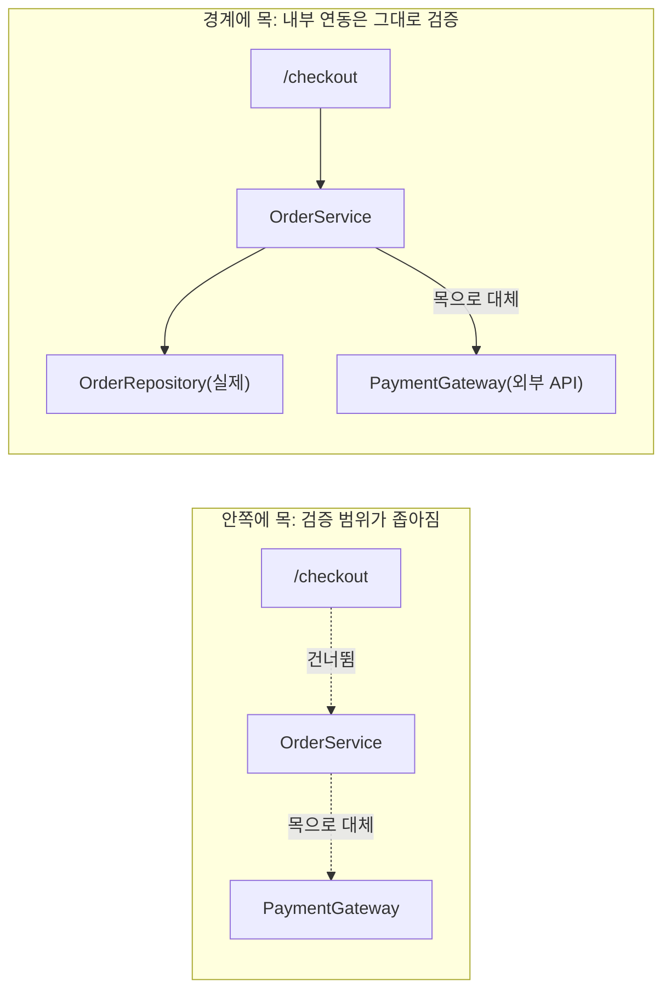

# 09. 목 사용의 모범 사례

05편에서 단위 테스트 맥락의 목 사용 기준(관리/비관리 의존성)을 다뤘습니다. 이 편은 08편에서 다룬 통합 테스트 맥락에서 **목을 어디에 배치해야 하는지**를 다룹니다. 같은 목이라도 배치 위치에 따라 테스트의 신뢰도가 크게 달라집니다.

## 학습 목표

- 목을 애플리케이션 경계에 가장 가까운 지점에 배치해야 하는 이유를 설명할 수 있다.
- 목을 시스템 내부 깊숙이 걸었을 때 생기는 문제를 진단할 수 있다.
- 외부 API 실패·타임아웃 시나리오를 목으로 안전하게 재현하는 방법을 적용할 수 있다.

## 목은 애플리케이션 경계에 가장 가까운 곳에 건다

통합 테스트의 목적은 "여러 컴포넌트가 실제로 맞물리는가"를 확인하는 것입니다. 그런데 목을 시스템 내부 깊숙이 걸면 정작 검증하려던 연동 구간이 빠져버립니다.

```python
class PaymentGateway:
    def authorize(self, amount: int) -> str:
        # 실제 외부 결제 API 호출
        response = requests.post("https://payment.example.com/authorize", json={"amount": amount})
        return response.json()["transaction_id"]


class OrderService:
    def __init__(self, repository, gateway: PaymentGateway) -> None:
        self._repository = repository
        self._gateway = gateway

    def place_order(self, order_id: str, amount: int) -> None:
        transaction_id = self._gateway.authorize(amount)
        self._repository.save(order_id, amount, transaction_id)
```

```python
# 나쁜 예: OrderService.place_order() 자체를 목으로 대체
def test_checkout_flow_bad(test_client):
    with patch.object(OrderService, "place_order") as mock_place_order:
        test_client.post("/checkout", json={"amount": 10000})
        mock_place_order.assert_called_once()
```

이 테스트는 `place_order()` 호출 여부만 확인할 뿐, `OrderService`와 `PaymentGateway`, `repository`가 실제로 올바르게 연동되는지는 전혀 검증하지 않습니다. 목을 너무 안쪽(테스트 대상 그 자체)에 걸어버려서, 통합 테스트를 작성한 의미가 사라졌습니다.

```python
# 개선: 시스템 경계에 있는 PaymentGateway만 목으로 대체
def test_checkout_flow_good(test_client, real_db_session):
    with patch.object(PaymentGateway, "authorize", return_value="txn-123"):
        response = test_client.post("/checkout", json={"amount": 10000})

    assert response.status_code == 201
    saved = SqlOrderRepository(real_db_session).find(response.json()["order_id"])
    assert saved.transaction_id == "txn-123"
```

여기서는 실제로 통제할 수 없는 **외부 결제 API**(`PaymentGateway.authorize`)만 목으로 대체하고, `OrderService`와 `repository`는 실제 구현체를 그대로 사용합니다. 이렇게 하면 애플리케이션 내부의 연동은 그대로 검증하면서, 우리가 제어할 수 없는 외부 시스템만 예측 가능한 값으로 고정할 수 있습니다.

## 목을 안쪽에 걸수록 생기는 문제



목을 안쪽에 걸수록 다음 문제가 생깁니다.

- **검증 범위 축소**: 목으로 대체한 컴포넌트 안쪽에서 일어나는 실제 버그(예: 리포지터리 쿼리 오류)를 통합 테스트가 놓친다.
- **거짓 양성 증가**: 04편에서 다룬 것처럼, 안쪽 구현이 바뀔 때마다(리팩터링만 해도) 목 설정이 어긋나 테스트가 깨진다.
- **테스트가 실제 배포 구성을 반영하지 못함**: 목으로 건너뛴 부분은 실제 운영 환경의 설정 오류를 사전에 잡지 못한다.

## 외부 API 실패 시나리오를 안전하게 재현하기

경계에 목을 배치하면 얻는 실질적인 이득이 하나 더 있습니다. **실제로 재현하기 어려운 실패 상황을 안전하게 시뮬레이션**할 수 있다는 것입니다.

```python
def test_checkout_handles_payment_timeout(test_client):
    with patch.object(PaymentGateway, "authorize", side_effect=TimeoutError):
        response = test_client.post("/checkout", json={"amount": 10000})

    assert response.status_code == 503
    assert response.json()["error"] == "PAYMENT_TIMEOUT"


def test_checkout_handles_payment_declined(test_client):
    with patch.object(PaymentGateway, "authorize", side_effect=PaymentDeclinedError):
        response = test_client.post("/checkout", json={"amount": 10000})

    assert response.status_code == 402
```

실제 결제 API에 타임아웃이나 거절 응답을 강제로 발생시키는 것은 현실적으로 불가능하거나 매우 번거롭습니다. 경계에 목을 두면 이런 예외 상황을 코드 몇 줄로 안전하게 재현할 수 있고, 08편에서 언급한 "실패를 먼저 모델링하라"는 원칙을 통합 테스트 수준에서도 실천할 수 있습니다.

## 목 배치 판단 기준

| 상황 | 목 배치 여부 |
|---|---|
| 우리가 소유하지 않은 외부 API/서비스 | 경계에서 목으로 대체 |
| 우리가 소유한 DB(테스트용 인메모리/컨테이너 DB 사용 가능) | 실제 구현체 사용(목 불필요) |
| 테스트 대상 서비스 자체 또는 그 바로 안쪽 컴포넌트 | 목으로 대체하지 않음 — 이건 검증 대상이다 |
| 실제로 재현하기 어려운 실패 상황(타임아웃, 5xx) | 경계의 목에 `side_effect`로 주입 |

## 실무 체크리스트

- 목이 애플리케이션 경계(우리가 통제할 수 없는 외부 시스템)에 있는가, 아니면 테스트 대상 안쪽에 있는가?
- 통합 테스트가 실제로 여러 컴포넌트의 연동을 검증하고 있는가, 아니면 목 때문에 사실상 단위 테스트가 되어버렸는가?
- 외부 의존성의 실패 시나리오(타임아웃, 거절, 5xx)를 목으로 검증하고 있는가?
- 목으로 대체한 대상이 정말 "우리가 소유하지 않은" 시스템인가?

## 연습 과제

### 기초(★☆☆)
- 여러분의 프로젝트에서 통합 테스트가 테스트 대상 서비스 자체를 목으로 대체하고 있는 사례를 찾아, 경계로 목을 옮겨보세요.

### 중급(★★☆)
- 외부 API 연동 코드에 대해 타임아웃과 거절 응답 시나리오를 목으로 재현하는 테스트를 각각 작성해보세요.

### 고급(★★★)
- 여러 외부 시스템(결제, 알림, 배송 추적)을 연동하는 진입점에 대해, 각 시스템의 실패 조합(예: 결제는 성공, 알림은 실패)을 조합해 보상 로직을 검증하는 테스트를 설계해보세요.

## 요약

- 목은 테스트 대상 안쪽이 아니라 애플리케이션 경계(우리가 통제할 수 없는 외부 시스템)에 배치한다.
- 목을 안쪽에 걸수록 검증 범위가 좁아지고 거짓 양성이 늘어난다.
- 경계에 목을 두면 실제로 재현하기 어려운 실패 시나리오(타임아웃, 거절)를 안전하게 검증할 수 있다.

## 참고 문헌 및 출처(추천)

- Vladimir Khorikov, 『Unit Testing: Principles, Practices, and Patterns』(Manning, 2020) — 목의 배치 위치와 시스템 경계 논의
- Michael Nygard, 『Release It!』(2007, 2판 2018) — 외부 시스템 실패(타임아웃, 서킷 브레이커) 대응 패턴
- Martin Fowler, "Mocks Aren't Stubs"(martinfowler.com, 2007)

---

## 다음 글

- 다음: [10. 데이터베이스 테스트하기](../testing-the-database/)
