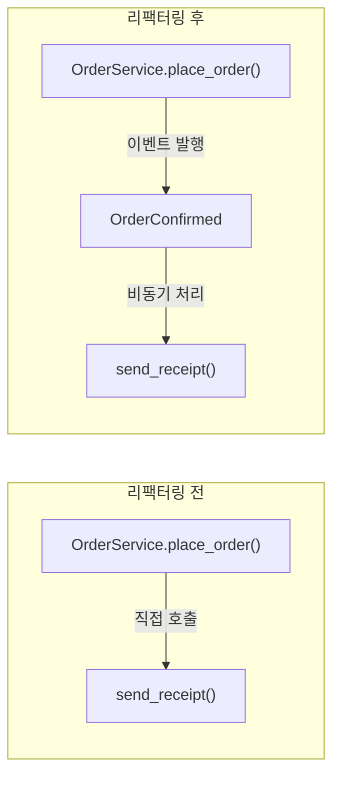
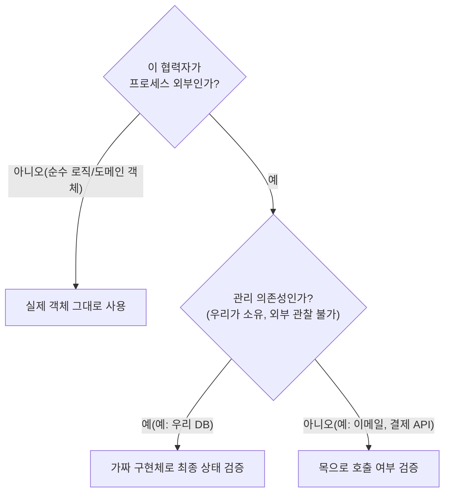

# 05. 목과 테스트 취약성

04편에서 리팩터링 내성이 가장 자주 무너지는 지점이 목이라고 짚었습니다. 이 편은 그 이유를 구조적으로 파헤칩니다. 목 자체가 나쁜 것이 아니라, **목을 어디에 쓰느냐**가 테스트 취약성을 좌우합니다.

## 학습 목표

- 목(mock)과 스텁(stub)을 명확히 구분하고, 각각 무엇을 검증하는 도구인지 설명할 수 있다.
- 프로세스 외부 의존성을 관리 의존성과 비관리 의존성으로 나누고, 목을 써야 할 경계를 판단할 수 있다.
- 목을 과용한 테스트를 최종 상태 검증 방식으로 리팩터링할 수 있다.

## 목과 스텁은 다른 도구다

<strong>테스트 더블(test double)</strong>은 실제 객체를 대신하는 모든 대역을 가리키는 총칭입니다. Gerard Meszaros는 저서에서 테스트 더블을 역할에 따라 여러 종류로 구분했는데, 실무에서 특히 자주 혼동되는 두 가지가 목과 스텁입니다.

- **스텁(stub)**: 테스트 대상에 **입력**을 제공하기 위한 대역. "이 호출이 오면 이 값을 돌려줘"만 담당하고, 호출 여부 자체는 검증하지 않는다.
- **목(mock)**: 테스트 대상이 협력자에게 보내는 <strong>출력(명령)</strong>을 검증하기 위한 대역. "이 메서드가 이 인자로 호출됐는가"를 assert 한다.

```python
from unittest.mock import Mock


class PaymentGateway:
    def authorize(self, amount: int) -> bool:
        raise NotImplementedError

    def send_receipt(self, order_id: str) -> None:
        raise NotImplementedError


def test_stub_example_provides_input():
    # 스텁: authorize()가 어떤 값을 반환할지만 정해준다. 호출 여부는 검증 안 함
    stub_gateway = Mock(spec=PaymentGateway)
    stub_gateway.authorize.return_value = True

    service = OrderService(stub_gateway)
    result = service.place_order("order-1", 10000)

    assert result == "CONFIRMED"


def test_mock_example_verifies_output():
    # 목: send_receipt()가 정확히 호출됐는지를 검증 대상으로 삼는다
    mock_gateway = Mock(spec=PaymentGateway)
    mock_gateway.authorize.return_value = True

    service = OrderService(mock_gateway)
    service.place_order("order-1", 10000)

    mock_gateway.send_receipt.assert_called_once_with("order-1")
```

같은 `Mock` 객체라도 **무엇을 검증하는지**에 따라 스텁 역할일 수도, 목 역할일 수도 있습니다. `authorize.return_value`를 설정만 하고 호출 여부를 검증하지 않으면 스텁이고, `assert_called_once_with`로 호출을 검증하면 목입니다.

## 목이 리팩터링 내성을 해치는 이유

04편에서 본 것처럼, 목으로 호출 방식을 검증하는 테스트는 **테스트 대상의 구현 세부사항**에 결합됩니다. `send_receipt()`를 호출하는 시점을 주문 확정 직후에서 비동기 이벤트 핸들러로 옮기는 리팩터링을 하면, 최종 사용자 입장에서 결과는 동일한데도(영수증은 여전히 발송됨) 이 테스트는 깨집니다.



목으로 `send_receipt()`의 직접 호출을 검증한 테스트는 `After` 구조로 바뀌는 순간 실패합니다. 하지만 사용자에게 보이는 동작(영수증 발송)은 그대로입니다. 이것이 **거짓 양성**의 전형적인 예입니다.

## 목을 써도 되는 경계: 프로세스 외부 의존성

그렇다고 목을 아예 쓰지 말아야 하는 것은 아닙니다. 목이 정당화되는 지점은 명확합니다. **테스트 대상이 시스템 경계 밖(프로세스 외부)에 부수 효과를 일으킬 때**입니다. 이때는 협력자의 호출 여부 자체가 검증해야 할 요구사항입니다.

프로세스 외부 의존성은 다시 두 가지로 나뉩니다.

- **관리 의존성(managed dependency)**: 애플리케이션이 완전히 제어하는 의존성으로, 외부에서 그 내부 상태를 직접 관찰할 수 없다(예: 우리가 소유한 데이터베이스). 이 경우 최종 상태를 확인하면 되므로 목이 필요 없다.
- **비관리 의존성(unmanaged dependency)**: 애플리케이션 경계 밖에서 관찰 가능한 부수 효과를 일으키는 의존성으로, 그 부수 효과 자체가 계약이다(예: 이메일 발송, 결제 API 호출, 메시지 큐 발행). 이 경우 "호출이 일어났는가"가 검증해야 할 결과이므로 목이 정당하다.

```python
# 관리 의존성: DB는 우리가 소유하므로 최종 상태만 확인하면 된다 (목 불필요)
def test_place_order_persists_to_db():
    fake_repo = FakeOrderRepository()
    service = OrderService(fake_repo, gateway=StubPaymentGateway())
    service.place_order("order-1", 10000)
    assert fake_repo.find("order-1").status == "CONFIRMED"


# 비관리 의존성: 이메일 발송 자체가 외부에서 관찰되는 계약이므로 목이 정당하다
def test_place_order_sends_confirmation_email():
    mock_mailer = Mock(spec=EmailSender)
    service = OrderService(repo=FakeOrderRepository(), mailer=mock_mailer)

    service.place_order("order-1", 10000)

    mock_mailer.send.assert_called_once()
```

이 구분이 05편의 핵심입니다. **DB 저장 여부를 목으로 검증하는 것은 과잉이지만, 이메일 발송 여부를 목으로 검증하는 것은 정당합니다.** 09편(목 사용의 모범 사례)에서 이 기준을 통합 테스트 맥락으로 더 확장합니다.

## 과용된 목을 리팩터링하기

목을 과용한 코드를 발견했을 때의 절차는 다음과 같습니다.

1. 목으로 검증 중인 협력자가 관리 의존성인지 비관리 의존성인지 분류한다.
2. 관리 의존성이라면, 목 대신 <strong>가짜 구현체(fake)</strong>를 만들어 최종 상태를 검증하도록 바꾼다.
3. 비관리 의존성이라면 목을 유지하되, **애플리케이션 경계에 가장 가까운 지점**(예: `EmailSender` 인터페이스)에서만 목을 걸고, 그 안쪽 로직은 관리 의존성처럼 다룬다.

```python
class FakeOrderRepository:
    def __init__(self) -> None:
        self._store: dict[str, "Order"] = {}

    def save(self, order_id: str, total: int) -> None:
        self._store[order_id] = Order(order_id, total, status="CONFIRMED")

    def find(self, order_id: str):
        return self._store.get(order_id)
```

가짜 구현체는 목보다 작성 비용이 조금 더 들지만, 한 번 만들어두면 **모든 테스트에서 재사용**할 수 있고 구현 세부사항이 아니라 최종 결과만 검증하므로 리팩터링 내성이 훨씬 높습니다.

## 목 사용 판단 흐름



## 실무 체크리스트

- 목으로 검증 중인 협력자가 실제로 프로세스 외부 의존성인가, 아니면 순수 로직인가?
- 관리 의존성(우리 DB 등)을 목으로 검증하고 있다면, 가짜 구현체로 바꿀 수 있는가?
- 하나의 테스트에 목이 3개 이상 등장한다면, 테스트 대상 클래스가 너무 많은 책임을 지고 있지 않은가?
- 리팩터링할 때마다 같은 목 검증 테스트들이 함께 깨지는가? (거짓 양성의 신호)

## 연습 과제

### 기초(★☆☆)
- 여러분의 프로젝트에서 목을 사용 중인 테스트를 5개 찾아, 각각 관리/비관리 의존성으로 분류해보세요.

### 중급(★★☆)
- 관리 의존성을 목으로 검증하고 있는 테스트 하나를 가짜 구현체 방식으로 리팩터링해보세요.

### 고급(★★★)
- 하나의 테스트에 목이 3개 이상 등장하는 경우를 찾아, 테스트 대상 클래스를 책임별로 분리해 목 개수를 줄여보세요.

## 요약

- 스텁은 입력을 제공하고, 목은 출력(호출)을 검증한다. 같은 도구라도 검증 방식에 따라 역할이 달라진다.
- 목은 프로세스 외부의 비관리 의존성(이메일, 결제 API 등)에만 쓰고, 관리 의존성(우리 DB)은 가짜 구현체로 최종 상태를 검증한다.
- 목을 과용하면 구현 세부사항에 결합되어 리팩터링 내성이 떨어지고 거짓 양성이 늘어난다.

## 참고 문헌 및 출처(추천)

- Gerard Meszaros, 『xUnit Test Patterns: Refactoring Test Code』(2007) — 목/스텁/페이크/스파이/더미 테스트 더블 분류의 원전
- Martin Fowler, "Mocks Aren't Stubs"(martinfowler.com, 2007) — 목과 스텁의 차이, 상태 검증과 상호작용 검증
- Vladimir Khorikov, 『Unit Testing: Principles, Practices, and Patterns』(Manning, 2020) — 관리/비관리 의존성 구분 프레임워크

---

## 다음 글

- 다음: [06. 단위 테스트의 세 가지 스타일](../styles-of-unit-testing/)
