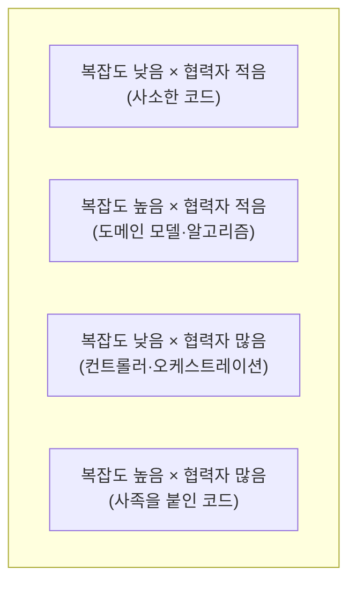

# 07. 가치 있는 테스트로 리팩터링하기

1~6편에서 다룬 원칙(목표, 정의, 구조, 4대 요소, 목, 스타일)을 배웠다고 해서 기존 테스트 스위트가 저절로 좋아지지는 않습니다. 이 편은 이미 짜여진 코드와 테스트를 **어디부터 손볼지** 판단하는 절차를 다룹니다.

## 학습 목표

- 복잡도와 협력자 수를 두 축으로 코드를 4분면에 배치하고, 각 분면에 맞는 테스트 전략을 선택할 수 있다.
- 과도하게 목에 의존하는 테스트를 06편의 출력/상태 기반 스타일로 리팩터링할 수 있다.
- 테스트 스위트 전체를 점진적으로 개선하는 우선순위를 정할 수 있다.

## 복잡도 × 협력자 수 4분면

모든 코드에 같은 강도로 단위 테스트를 투입하는 것은 비효율적입니다. **코드의 복잡도(분기·조건의 수)**와 **협력자 수(의존하는 다른 클래스·모듈의 수)**를 두 축으로 놓으면, 코드가 네 영역 중 하나에 속합니다.



| 영역 | 특징 | 테스트 전략 |
|---|---|---|
| 사소한 코드(복잡도 낮음, 협력자 적음) | getter/setter, 단순 위임 | 단위 테스트 불필요. 시간 낭비에 가깝다 |
| 도메인 모델·알고리즘(복잡도 높음, 협력자 적음) | 비즈니스 규칙, 계산 로직 | **가장 우선순위 높은 단위 테스트 대상**. 06편의 출력 기반 스타일이 잘 맞는다 |
| 컨트롤러·오케스트레이션(복잡도 낮음, 협력자 많음) | 여러 협력자를 순서대로 호출만 함 | 단위 테스트보다 08편의 통합 테스트로 검증하는 편이 효율적 |
| 사족을 붙인 코드(복잡도 높음, 협력자 많음) | 비즈니스 규칙과 오케스트레이션이 뒤섞임 | 테스트 대상이 아니라 **리팩터링 대상**. 먼저 분리한 뒤 각각 테스트한다 |

가장 중요한 결론은 **투자를 도메인 모델·알고리즘 영역에 집중**하고, 컨트롤러 영역은 단위 테스트로 촘촘히 덮으려 하지 않는 것입니다. 컨트롤러는 협력자가 많아 단위 테스트를 짜려면 목이 여러 개 필요해지고, 이는 05편에서 본 것처럼 리팩터링 내성을 해칩니다.

## 사족 달린 코드를 먼저 분리한다

가장 손대기 어려운 영역은 "사족을 붙인 코드"입니다. 비즈니스 규칙과 오케스트레이션이 한 메서드에 섞여 있으면, 테스트 하나를 짜려 해도 협력자 목을 여러 개 준비해야 합니다.

```python
# 사족 달린 코드: 계산 로직과 오케스트레이션이 뒤섞여 있음
class LoanService:
    def __init__(self, repository, notifier, rate_provider) -> None:
        self._repository = repository
        self._notifier = notifier
        self._rate_provider = rate_provider

    def calculate_and_notify(self, loan_id: str, principal: int, months: int) -> int:
        rate = self._rate_provider.get_rate()
        # 복잡한 이자 계산 로직이 여기 섞여 있다
        monthly_rate = rate / 12
        payment = principal * monthly_rate / (1 - (1 + monthly_rate) ** -months)
        loan = self._repository.find(loan_id)
        loan.monthly_payment = payment
        self._repository.save(loan)
        self._notifier.notify(loan_id, payment)
        return payment
```

이 메서드를 테스트하려면 `repository`, `notifier`, `rate_provider` 세 개를 모두 목으로 준비해야 하고, 이자 계산 공식이 조금만 바뀌어도 저장·알림 관련 목 설정까지 다시 손봐야 합니다. **계산 로직(도메인 모델·알고리즘)과 오케스트레이션(컨트롤러)을 분리**하면 이 문제가 풀립니다.

```python
# 분리 후: 계산 로직은 순수 함수로, 오케스트레이션은 얇은 조정자로
def calculate_monthly_payment(principal: int, annual_rate: float, months: int) -> float:
    monthly_rate = annual_rate / 12
    return principal * monthly_rate / (1 - (1 + monthly_rate) ** -months)


class LoanService:
    def __init__(self, repository, notifier, rate_provider) -> None:
        self._repository = repository
        self._notifier = notifier
        self._rate_provider = rate_provider

    def calculate_and_notify(self, loan_id: str, principal: int, months: int) -> float:
        rate = self._rate_provider.get_rate()
        payment = calculate_monthly_payment(principal, rate, months)  # 계산은 위임

        loan = self._repository.find(loan_id)
        loan.monthly_payment = payment
        self._repository.save(loan)
        self._notifier.notify(loan_id, payment)
        return payment
```

`calculate_monthly_payment()`는 이제 06편에서 다룬 출력 기반 테스트로 촘촘하게 검증할 수 있습니다.

```python
def test_calculate_monthly_payment():
    payment = calculate_monthly_payment(principal=12_000_000, annual_rate=0.06, months=12)
    assert round(payment) == 1_030_540
```

`LoanService.calculate_and_notify()`는 이제 복잡한 계산 없이 단순 오케스트레이션만 남았으므로, 08편에서 다룰 통합 테스트로 "협력자들이 올바른 순서로 호출되는가"만 가볍게 검증하면 충분합니다.

## 리팩터링 절차 요약

기존 테스트 스위트를 개선할 때는 다음 순서를 권장합니다.

1. **행동 고정**: 리팩터링 전에, 지금 코드가 실제로 어떻게 동작하는지 기록하는 특성화 테스트(characterization test)를 임시로 작성해 안전망을 만든다.
2. **4분면 분류**: 코드베이스에서 복잡도와 협력자 수가 모두 높은 "사족 달린" 영역을 찾는다.
3. **계산과 오케스트레이션 분리**: 순수 계산 로직을 별도 함수/클래스로 추출한다.
4. **출력 기반 테스트 우선 작성**: 분리된 계산 로직에 촘촘한 출력 기반 테스트를 작성한다.
5. **오케스트레이션은 가볍게**: 남은 조정 코드는 목을 최소화한 통합 테스트로 검증한다.
6. **임시 특성화 테스트 정리**: 안전망 역할이 끝난 특성화 테스트 중 가치가 낮은 것은 제거한다.

## 실무 체크리스트

- 코드베이스에서 복잡도와 협력자 수가 모두 높은 영역을 식별했는가?
- 계산 로직과 오케스트레이션이 분리 가능한 형태인가, 아니면 강하게 얽혀 있는가?
- 컨트롤러 영역에 과도하게 많은 단위 테스트가 있어 유지비만 키우고 있지 않은가?
- 도메인 모델·알고리즘 영역의 테스트 커버리지가 충분히 촘촘한가?

## 연습 과제

### 기초(★☆☆)
- 여러분의 코드베이스에서 메서드 10개를 골라 4분면에 분류해보세요.

### 중급(★★☆)
- "사족 달린" 영역으로 분류된 메서드 하나를 계산 로직과 오케스트레이션으로 분리하고, 계산 로직에 출력 기반 테스트를 작성해보세요.

### 고급(★★★)
- 컨트롤러 영역에 단위 테스트가 과도하게 몰려 있는 파일을 찾아, 일부를 08편에서 다룰 통합 테스트로 옮기는 계획을 세워보세요.

## 요약

- 복잡도와 협력자 수 4분면으로 코드를 분류하면 테스트 투자 우선순위가 명확해진다.
- 도메인 모델·알고리즘 영역에 단위 테스트를 집중하고, 컨트롤러 영역은 통합 테스트로 넘긴다.
- 사족 달린 코드는 테스트 대상이 아니라 리팩터링 대상이며, 계산과 오케스트레이션을 분리하는 것이 먼저다.

## 참고 문헌 및 출처(추천)

- Vladimir Khorikov, 『Unit Testing: Principles, Practices, and Patterns』(Manning, 2020) — 복잡도·협력자 수 4분면 프레임워크
- Michael Feathers, 『Working Effectively with Legacy Code』(2004) — 특성화 테스트로 행동을 고정하는 절차
- Gary Bernhardt, "Boundaries"(2012) — 계산과 부작용을 분리하는 설계 원칙

---

## 다음 글

- 다음: [08. 통합 테스트: 언제, 왜 필요한가](../why-integration-testing/)
