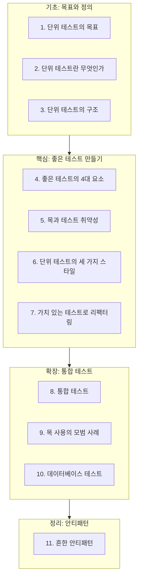

# 00. 단위 테스트, 왜 다시 배워야 하는가

"테스트를 작성하고 있는데도 프로젝트가 점점 느려집니다." 이 말은 테스트가 부족하다는 뜻이 아닙니다. 대부분은 테스트가 **많지만 잘못 만들어져 있다**는 뜻입니다. 이 시리즈는 "테스트를 쓸 것인가 말 것인가"가 아니라, **어떤 테스트가 프로젝트를 실제로 지속 가능하게 만드는가**를 다룹니다.

## 이 시리즈가 해결하려는 문제

단위 테스트를 도입한 팀에서 반복적으로 나타나는 패턴이 있습니다. 초기에는 테스트가 빠르게 늘어나고 자신감도 함께 커집니다. 그런데 몇 달이 지나면 리팩터링 한 번에 테스트 수십 개가 깨지고, 기능 하나를 바꿀 때마다 관련 없어 보이는 테스트까지 손봐야 하는 상황이 옵니다. 결국 팀은 "테스트 유지비가 너무 크다"며 테스트를 줄이거나, 반대로 "커버리지 90%"라는 숫자만 쫓다가 아무것도 검증하지 않는 테스트를 양산합니다.

두 결과 모두 같은 원인에서 나옵니다. **테스트를 코드와 동일한 설계 대상으로 다루지 않았기 때문**입니다. 좋은 프로덕션 코드에 원칙이 있듯, 좋은 테스트에도 원칙이 있습니다. 이 시리즈는 그 원칙을 12편에 걸쳐 체계적으로 정리합니다.

## 커리큘럼 구성

| 편 | 제목 | 이 편이 필요한 이유 |
|---|---|---|
| 1 | 단위 테스트의 목표 | "왜 테스트를 짜야 하는가"에 답이 없으면 이후 모든 판단 기준이 흔들린다 |
| 2 | 단위 테스트란 무엇인가 | 고전파/런던파 정의를 모르면 3–9편의 "목을 언제 쓸지" 논의를 따라갈 수 없다 |
| 3 | 단위 테스트의 구조 | AAA 패턴과 픽스처를 정리해야 이후 예제 코드를 읽는 부담이 줄어든다 |
| 4 | 좋은 테스트의 4대 요소 | 이후 모든 편이 "이 선택이 4대 요소 중 무엇을 얻고 무엇을 잃는가"로 판단한다 |
| 5 | 목과 테스트 취약성 | 4대 요소 중 리팩터링 내성이 가장 자주 깨지는 지점이 목이다 |
| 6 | 단위 테스트의 세 가지 스타일 | 스타일 선택이 5편의 목 사용 빈도를 직접 결정한다 |
| 7 | 가치 있는 테스트로 리팩터링 | 1–6편에서 다룬 원칙을 기존 테스트 스위트에 적용하는 절차 |
| 8 | 통합 테스트 | 단위 테스트만으로 검증할 수 없는 영역(경계, 설정, 인프라)이 있다 |
| 9 | 목 사용의 모범 사례 | 통합 테스트에서는 목을 쓰는 기준이 단위 테스트와 다르다 |
| 10 | 데이터베이스 테스트 | 가장 흔한 프로세스 외부 의존성인 DB를 구체적으로 다룬다 |
| 11 | 흔한 안티패턴 | 1–10편의 원칙을 거꾸로 적용해, 실무에서 반복되는 실수를 진단표로 정리 |

## 학습 결과

이 시리즈를 완주하면 다음을 할 수 있게 됩니다.

- 테스트 코드 리뷰에서 "이 테스트가 좋은 테스트인가"를 4대 요소(회귀 방지, 리팩터링 내성, 빠른 피드백, 유지보수성) 기준으로 판단할 수 있다.
- 목(mock)을 언제 쓰고 언제 피해야 하는지, 관리 의존성과 비관리 의존성을 구분해 설명할 수 있다.
- 커버리지 숫자에 의존하지 않고 테스트 스위트의 실질적 품질을 평가할 수 있다.
- 기존에 작성된 취약한 테스트를 가치 있는 테스트로 리팩터링하는 절차를 적용할 수 있다.
- 단위 테스트와 통합 테스트의 역할을 구분하고, 데이터베이스가 포함된 테스트를 설계할 수 있다.

## 참고 문헌 및 출처(추천)

이 시리즈는 특정 책의 장별 요약이 아니라, 아래 여러 출처의 개념을 재구성해 독자적으로 서술합니다. 특정 프레임워크(예: "좋은 테스트의 4대 요소")를 소개할 때는 원 제안자를 본문에서 그때그때 명시합니다.

- Vladimir Khorikov, 『Unit Testing: Principles, Practices, and Patterns』(Manning, 2020) — "좋은 테스트의 4대 요소", "관리/비관리 의존성" 프레임워크의 원 출처
- Gerard Meszaros, 『xUnit Test Patterns: Refactoring Test Code』(2007) — 목/스텁/페이크 등 테스트 더블 용어 분류의 원 출처
- Steve Freeman, Nat Pryce, 『Growing Object-Oriented Software, Guided by Tests』(2009) — "런던파(mockist)" 스타일의 원 출처
- Kent Beck, 『Test-Driven Development: By Example』(2002) — "고전파(classicist)" TDD의 원 출처
- Martin Fowler, "Mocks Aren't Stubs"(martinfowler.com, 2007) — 테스트 더블 종류 구분

---

## 다음 글

- 다음: [01. 단위 테스트의 목표: 지속 가능한 성장](../goal-of-unit-testing/)
