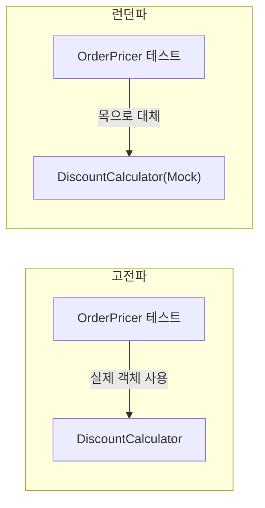

# 02. 단위 테스트란 무엇인가: 고전파와 런던파

"단위 테스트"라는 말은 모두가 안다고 생각하지만, 정의를 물으면 대답이 갈립니다. "클래스 하나를 나머지 세상과 격리해서 테스트하는 것"이라고 답하는 사람도 있고, "외부 프로세스만 없으면 여러 클래스를 함께 테스트해도 단위 테스트"라고 답하는 사람도 있습니다. 이 차이는 취향 문제가 아니라, 목(mock)을 얼마나 쓸지·테스트가 리팩터링에 얼마나 견딜지를 가르는 실질적인 갈림길입니다.

## 학습 목표

- 단위 테스트의 세 가지 공통 특성(빠른 속도, 격리된 실행, 단독 실행 가능)을 설명할 수 있다.
- 고전파(classicist)와 런던파(mockist)가 "격리"를 어떻게 다르게 정의하는지 구분할 수 있다.
- 두 학파의 차이가 실제 테스트 코드에서 어떻게 드러나는지 예제로 확인할 수 있다.

## 단위 테스트의 공통 정의

학파를 나누기 전에, 대부분의 정의가 동의하는 세 가지 특성이 있습니다.

- **작은 코드 단위를 검증한다**: 시스템 전체가 아니라 함수·메서드·클래스 수준의 동작을 확인한다.
- **빠르게 실행된다**: 밀리초 단위로 끝나야 하며, 수천 개를 실행해도 몇 분을 넘기지 않아야 한다.
- **다른 테스트와 독립적으로 실행 가능하다**: 실행 순서나 다른 테스트의 상태에 결과가 좌우되지 않는다.

이 세 가지에는 학파 간 이견이 거의 없습니다. 이견은 **"격리(isolation)"가 정확히 무엇을 뜻하는가**에서 시작됩니다.

## 고전파: 테스트 대상 객체만 격리하면 된다

**고전파(classicist)**는 Kent Beck이 정리한 전통적인 TDD 스타일에 뿌리를 둡니다. 고전파의 관점에서 "격리"란 **테스트 케이스끼리 서로 영향을 주지 않는 것**을 의미합니다. 테스트 대상 코드가 협력 객체(collaborator)를 실제로 호출하는 것은 문제가 아닙니다. 협력 객체가 데이터베이스나 외부 API 같은 **프로세스 외부 의존성**이 아니라면, 실제 객체를 그대로 사용해도 괜찮다고 봅니다.

```python
class DiscountCalculator:
    def calculate(self, price: int, coupon_rate: float) -> int:
        return price - int(price * coupon_rate)


class OrderPricer:
    def __init__(self, discount_calculator: DiscountCalculator) -> None:
        self._discount_calculator = discount_calculator

    def total_price(self, price: int, coupon_rate: float) -> int:
        return self._discount_calculator.calculate(price, coupon_rate)


def test_total_price_applies_discount():
    # 고전파: DiscountCalculator를 목으로 대체하지 않고 실제 객체를 그대로 쓴다
    pricer = OrderPricer(DiscountCalculator())
    assert pricer.total_price(10000, 0.1) == 9000
```

고전파는 `DiscountCalculator`가 순수 계산 로직(프로세스 외부 의존성 없음)이므로 목으로 대체할 이유가 없다고 봅니다. **여러 클래스가 협력하는 결과를 함께 검증**하는 셈이며, 이렇게 하면 "단위"는 실질적으로 하나의 클래스가 아니라 **하나의 동작(behavior)**에 더 가까워집니다.

## 런던파: 테스트 대상과 협력하는 모든 것을 격리한다

**런던파(mockist)**는 Steve Freeman과 Nat Pryce가 저서에서 정리한 스타일입니다. 런던파의 관점에서 "격리"란 **테스트 대상 클래스를 협력 객체로부터도 완전히 분리**하는 것을 의미합니다. 협력 객체는 프로세스 외부 의존성 여부와 관계없이 전부 목으로 대체합니다.

```python
from unittest.mock import Mock


def test_total_price_calls_discount_calculator():
    # 런던파: DiscountCalculator까지 목으로 대체해 OrderPricer만 격리한다
    mock_calculator = Mock(spec=DiscountCalculator)
    mock_calculator.calculate.return_value = 9000

    pricer = OrderPricer(mock_calculator)
    result = pricer.total_price(10000, 0.1)

    assert result == 9000
    mock_calculator.calculate.assert_called_once_with(10000, 0.1)
```

이 방식은 두 가지를 얻습니다. 첫째, `OrderPricer`가 실패하면 원인이 `OrderPricer` 안에만 있다고 확신할 수 있습니다(고전파 방식에서는 `DiscountCalculator`의 버그도 `OrderPricer` 테스트를 깨뜨릴 수 있습니다). 둘째, 협력 객체 간의 **상호작용(어떤 메서드를 어떤 인자로 호출했는지)**을 직접 검증할 수 있습니다.

## 두 학파의 실질적 차이



| 기준 | 고전파 | 런던파 |
|---|---|---|
| 격리 대상 | 테스트 케이스 간 격리 | 테스트 대상 클래스와 협력자 간 격리 |
| 협력 객체 처리 | 프로세스 외부 의존성이 아니면 실제 객체 사용 | 대부분 목으로 대체 |
| 실패 시 원인 추적 | 여러 클래스 중 어디가 문제인지 추가 조사 필요 | 실패한 클래스 하나로 원인이 좁혀짐 |
| 설계에 미치는 영향 | 상대적으로 약함 | 목을 주입하기 쉬운 구조(작은 인터페이스, DI)를 강제함 |
| 리팩터링 내성(05편) | 상대적으로 높음(구현 세부사항이 아니라 최종 결과를 검증) | 목 사용이 과하면 낮아질 위험(구현 세부사항에 결합) |

**리팩터링 내성**이 왜 학파에 따라 달라지는지는 05편에서 자세히 다루지만, 핵심만 미리 말하면 이렇습니다. 런던파처럼 협력 객체 호출 방식(어떤 메서드를 몇 번, 어떤 인자로 불렀는지)까지 검증하면, 최종 결과는 그대로인데 내부 구현만 바꿔도 테스트가 깨지기 쉽습니다.

## 어느 학파를 따라야 할까

이 시리즈는 **고전파를 기본 방침**으로 삼습니다. 이유는 04편에서 다룰 4대 요소(특히 리팩터링 내성)를 지키기가 더 쉽기 때문입니다. 다만 런던파가 유용한 상황도 분명히 있습니다.

- 협력 객체가 **프로세스 외부 의존성**(DB, 외부 API, 메시지 큐)일 때는 두 학파 모두 목/스텁을 씁니다. 이 경우는 애초에 이견이 없습니다.
- 협력 객체 간의 **호출 순서나 상호작용 자체가 검증해야 할 요구사항**일 때(예: "결제 실패 시 반드시 알림을 보내야 한다") 런던파의 상호작용 검증이 자연스럽습니다.
- 시스템이 매우 크고 복잡한 협력 그래프를 가질 때, 런던파는 테스트 대상을 한 클래스로 좁혀 실패 원인 추적을 쉽게 해줍니다.

즉 "항상 고전파" 또는 "항상 런던파"가 아니라, **협력 객체가 프로세스 외부 의존성인지, 상호작용 자체가 요구사항인지**를 기준으로 판단합니다. 이 판단 기준은 05편(목과 테스트 취약성), 09편(목 사용의 모범 사례)에서 구체적인 절차로 이어집니다.

## 실무 체크리스트

- 테스트에서 협력 객체를 목으로 대체할 때, 그 이유가 "프로세스 외부 의존성"인가 "습관적으로"인가?
- 목을 사용하는 테스트가 최종 결과가 아니라 호출 방식만 검증하고 있지 않은가?
- 팀 내에서 "단위 테스트"라는 말을 서로 다른 의미로 쓰고 있지 않은가? (고전파/런던파 용어로 명시적으로 합의했는가)

## 연습 과제

### 기초(★☆☆)
- `OrderPricer` 예제를 고전파 방식과 런던파 방식 두 가지로 각각 작성해보고, 코드량과 가독성을 비교해보세요.

### 중급(★★☆)
- 여러분의 프로젝트에서 목을 사용 중인 테스트 하나를 찾아, 그 협력 객체가 프로세스 외부 의존성인지 아닌지 판단해보세요. 아니라면 고전파 방식(실제 객체 사용)으로 바꿔보세요.

### 고급(★★★)
- `DiscountCalculator`에 새 할인 정책을 추가하는 리팩터링을 수행하고, 고전파 테스트와 런던파 테스트 중 어느 쪽이 이 리팩터링에도 깨지지 않는지 실제로 확인해보세요.

## 요약

- 단위 테스트는 작고, 빠르고, 독립적으로 실행 가능해야 한다는 점은 두 학파 모두 동의한다.
- 고전파는 테스트 케이스 간 격리를, 런던파는 테스트 대상과 협력자 간 격리를 기준으로 삼는다.
- 이 시리즈는 고전파를 기본으로 하되, 프로세스 외부 의존성과 상호작용 자체가 요구사항인 경우에 한해 목을 사용한다.

## 참고 문헌 및 출처(추천)

- Kent Beck, 『Test-Driven Development: By Example』(2002) — 고전파(classicist/Detroit school) TDD의 원전
- Steve Freeman, Nat Pryce, 『Growing Object-Oriented Software, Guided by Tests』(2009) — 런던파(mockist/London school)의 원전
- Martin Fowler, "UnitTest"(martinfowler.com bliki) — 단위 테스트 정의와 두 학파 논쟁 정리

---

## 다음 글

- 다음: [03. 단위 테스트의 구조: AAA 패턴과 픽스처](../anatomy-of-a-unit-test/)
