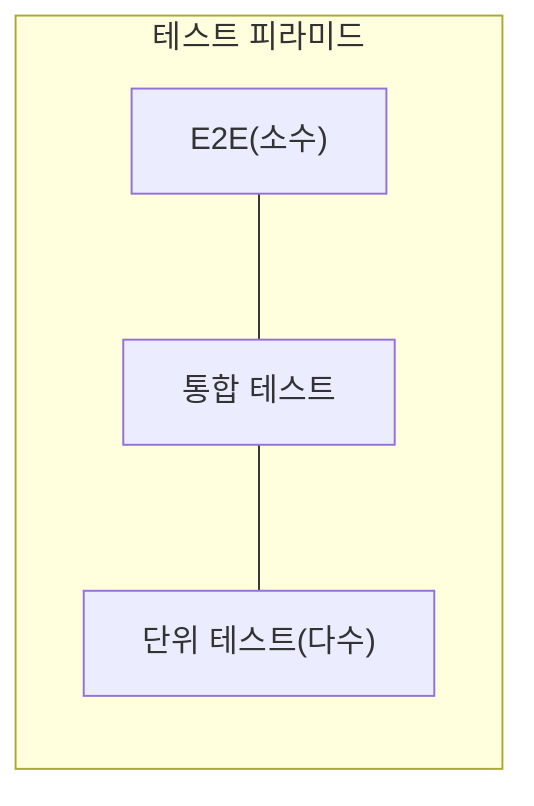

# 08. 통합 테스트: 언제, 왜 필요한가

07편에서 "컨트롤러·오케스트레이션 영역은 단위 테스트보다 통합 테스트가 낫다"고 했습니다. 이 편은 그 이유와, 통합 테스트를 어디까지·얼마나 만들지를 다룹니다.

## 학습 목표

- 통합 테스트가 단위 테스트로 검증할 수 없는 영역(프로세스 외부 의존성과의 실제 연동)을 설명할 수 있다.
- 테스트 피라미드와 테스트 트로피 모델의 차이를 이해하고, 프로젝트 특성에 맞는 비중을 판단할 수 있다.
- 진입점(entry point) 단위로 통합 테스트를 설계하는 방법을 적용할 수 있다.

## 단위 테스트가 놓치는 것

06~07편의 원칙을 완벽히 따라도, 단위 테스트만으로는 검증할 수 없는 부분이 남습니다.

- 실제 데이터베이스 스키마와 우리 코드의 쿼리가 실제로 맞물리는가
- 여러 컴포넌트(리포지터리, 서비스, 컨트롤러)가 실제로 조립됐을 때 올바르게 연동되는가
- 설정 파일, 의존성 주입 컨테이너 구성이 실제 배포 환경에서 오류 없이 로드되는가

이런 것들은 정의상 **여러 계층을 실제로 연결해봐야만** 검증할 수 있습니다. 이 역할을 하는 것이 **통합 테스트(integration test)**입니다.

```python
import pytest


@pytest.fixture
def real_db_session():
    # 실제(또는 인메모리) 데이터베이스 세션을 준비
    engine = create_test_engine()
    with engine.connect() as conn:
        yield conn
    engine.dispose()


def test_order_repository_saves_and_finds(real_db_session):
    repository = SqlOrderRepository(real_db_session)
    repository.save("order-1", 10000)

    found = repository.find("order-1")

    assert found.total == 10000
```

이 테스트는 05편의 `FakeOrderRepository`가 아니라 **실제 SQL 리포지터리 구현체**를 사용합니다. 쿼리 문법 오류, 컬럼명 불일치, 트랜잭션 처리 실수는 이런 테스트에서만 잡힙니다.

## 통합 테스트의 대가: 느림과 취약함

통합 테스트는 04편의 4대 요소 관점에서 단위 테스트와 다른 위치에 있습니다.

| 요소 | 단위 테스트 | 통합 테스트 |
|---|---|---|
| 회귀 방지 | 도메인 로직 회귀에 강함 | 연동·설정 오류에 강함(단위 테스트가 못 잡는 영역) |
| 리팩터링 내성 | 스타일에 따라 다름(06편 참고) | 대체로 높음(내부 구현보다 외부 계약을 검증) |
| 빠른 피드백 | 밀리초 단위 | 초 단위 이상(실제 DB 연결, 네트워크 지연 포함) |
| 유지보수성 | 상대적으로 쉬움 | 환경 설정(테스트용 DB, 컨테이너) 관리 부담 |

통합 테스트는 회귀 방지력이 높은 대신 느리고, 환경 구성이 필요합니다. 그래서 **모든 시나리오를 통합 테스트로 덮으려 하면 안 됩니다.** 07편의 4분면에서 다뤘듯, 복잡한 계산 로직은 여전히 단위 테스트가 담당하고, 통합 테스트는 "여러 부분이 실제로 맞물리는가"를 확인하는 역할에 집중합니다.

## 테스트 피라미드 vs 테스트 트로피

단위 테스트와 통합 테스트의 비중을 어떻게 배분할지에 대해 두 가지 널리 알려진 모델이 있습니다.



**테스트 피라미드**는 Mike Cohn이 저서에서 제시한 모델로, 단위 테스트를 가장 많이, 통합 테스트를 중간, E2E(종단 간) 테스트를 가장 적게 두라고 제안합니다. 단위 테스트가 빠르고 저렴하므로 최대한 아래층을 두껍게 하라는 것이 핵심입니다.

반면 프로젝트에 오케스트레이션(컨트롤러) 코드가 많고 도메인 로직이 상대적으로 단순하다면, 오히려 통합 테스트의 비중을 단위 테스트보다 높게 가져가는 **테스트 트로피(testing trophy)** 형태가 더 효율적이라는 관점도 있습니다(Kent C. Dodds가 프런트엔드/풀스택 맥락에서 정리). 07편의 4분면에서 "컨트롤러 영역이 넓을수록" 통합 테스트 비중이 늘어나야 한다는 논리와 같은 맥락입니다.

**정답은 프로젝트마다 다릅니다.** 도메인 로직이 복잡한 백엔드 서비스는 피라미드에 가깝고, 여러 컴포넌트를 조합하는 오케스트레이션 위주 서비스는 트로피에 가까울 수 있습니다. 중요한 것은 비율 자체가 아니라, **07편의 4분면 분석 결과에 맞춰 의도적으로 비중을 정하는 것**입니다.

## 진입점 단위로 통합 테스트 설계하기

통합 테스트를 무작정 많이 만들면 실행 시간이 급격히 늘어납니다. 효율적인 접근은 **애플리케이션의 진입점(entry point, 예: API 엔드포인트, 메시지 핸들러)마다 대표 시나리오 몇 개**로 좁히는 것입니다.

```python
def test_place_order_endpoint_happy_path(test_client, real_db_session):
    response = test_client.post(
        "/orders",
        json={"items": [{"product": "apple", "qty": 2, "price": 1000}]},
    )

    assert response.status_code == 201
    order_id = response.json()["order_id"]

    saved = SqlOrderRepository(real_db_session).find(order_id)
    assert saved.total == 2000


def test_place_order_endpoint_rejects_empty_cart(test_client):
    response = test_client.post("/orders", json={"items": []})
    assert response.status_code == 400
```

각 진입점마다 **정상 경로 1개 + 대표적인 실패 경로 1~2개** 정도로 시나리오를 제한하면, 세부적인 분기 검증은 이미 단위 테스트가 담당하고 있으므로 중복 없이 통합 테스트의 실행 시간을 관리할 수 있습니다.

## 실무 체크리스트

- 통합 테스트가 검증하려는 것이 "연동 자체"인가, 아니면 07편에서 단위 테스트로 이미 검증한 계산 로직의 반복인가?
- 진입점마다 정상 경로와 대표 실패 경로가 최소한으로 커버돼 있는가?
- 통합 테스트 스위트 전체 실행 시간이 CI 파이프라인을 과도하게 늦추고 있지 않은가?
- 우리 프로젝트가 도메인 로직 중심(피라미드)인지, 오케스트레이션 중심(트로피)인지 판단해봤는가?

## 연습 과제

### 기초(★☆☆)
- 여러분의 프로젝트에서 API 엔드포인트(또는 진입점) 하나를 골라, 정상 경로를 검증하는 통합 테스트를 작성해보세요.

### 중급(★★☆)
- 같은 계산 로직을 단위 테스트와 통합 테스트에서 중복 검증하고 있는 사례를 찾아, 통합 테스트 쪽을 정상/실패 경로 각 1개로 축소해보세요.

### 고급(★★★)
- 프로젝트의 단위/통합/E2E 테스트 개수와 각각의 평균 실행 시간을 측정하고, 현재 구조가 피라미드에 가까운지 트로피에 가까운지 진단해보세요.

## 요약

- 통합 테스트는 단위 테스트가 검증할 수 없는 실제 연동(DB, 설정, 여러 컴포넌트 조립)을 담당한다.
- 통합 테스트는 회귀 방지력이 높지만 느리고 환경 구성 부담이 있으므로, 진입점당 대표 시나리오로 범위를 제한한다.
- 단위/통합 테스트 비중은 프로젝트의 복잡도 분포(도메인 로직 중심인지 오케스트레이션 중심인지)에 따라 의도적으로 정한다.

## 참고 문헌 및 출처(추천)

- Mike Cohn, 『Succeeding with Agile』(2009) — 테스트 피라미드 모델의 원전
- Kent C. Dodds, "Write tests. Not too many. Mostly integration."(kentcdodds.com, 2018) — 테스트 트로피 모델
- Vladimir Khorikov, 『Unit Testing: Principles, Practices, and Patterns』(Manning, 2020) — 통합 테스트와 단위 테스트의 역할 구분

---

## 다음 글

- 다음: [09. 목 사용의 모범 사례](../mocking-best-practices/)
