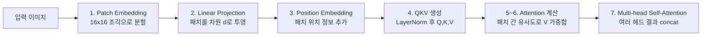

02장까지 다룬 CNN은 커널이라는 지역적 창을 통해 이미지를 봅니다. **Vision Transformer(ViT)**는 완전히 다른 접근을 취합니다 — 이미지를 작은 조각(패치)으로 잘라 언어모델의 토큰처럼 취급하고, LLM 시리즈에서 다룬 Self-Attention을 그대로 적용합니다. 이 장은 ViT가 등장한 배경과, 이미지가 패치에서 분류 결과까지 이어지는 전체 파이프라인을 다룹니다.

## ViT가 등장한 배경

2020년까지 CNN 계열 아키텍처는 조금씩 개선되며 성능이 점진적으로만 향상되는 정체기에 접어들고 있었습니다. 언어모델에서 이미 검증된 Transformer 구조를 이미지에 그대로 적용해보자는 시도가 ViT로 이어졌습니다.

> Alexey Dosovitskiy, Lucas Beyer, Alexander Kolesnikov 외, "An Image is Worth 16x16 Words: Transformers for Image Recognition at Scale", *arXiv:2010.11929* (2020)

논문 제목의 "16x16 Words"가 가리키는 것이 바로 이 대응 관계입니다 — 언어모델의 "토큰"에 대응하는 단위를 이미지에서는 16×16 크기로 자른 패치로 정의한 것이 이 논문의 핵심 아이디어입니다.

## ViT 파이프라인 — 패치에서 분류까지

이미지가 ViT를 통과하는 과정은 다음 순서로 진행됩니다.



첫 단계인 **Patch Embedding**은 이미지를 일정 크기로 잘라 그 조각 하나하나를 하나의 "토큰"처럼 취급합니다. **Linear Projection**은 각 패치를 원하는 차원 $d$로 투영하는 행렬 $E$를 학습합니다. **Position Embedding**은 패치가 이미지 내 어느 위치에 있었는지 정보를 담기 위한 $E_{pos}$를 학습해서 더합니다. 이후 LLM 시리즈 05장에서 다룬 것과 동일한 방식으로, 각 패치(행)에 정규화를 적용한 뒤 Q/K/V를 만들고, Q와 K의 내적으로 패치 사이의 유사도를 계산해 V를 가중합합니다.

```python
import torch
import torch.nn as nn

class PatchEmbedding(nn.Module):
    def __init__(self, img_size: int = 224, patch_size: int = 16, in_channels: int = 3, emb_dim: int = 768):
        super().__init__()
        self.num_patches = (img_size // patch_size) ** 2
        # Conv2d로 "패치 자르기 + Linear Projection"을 한 번에 처리
        self.proj = nn.Conv2d(in_channels, emb_dim, kernel_size=patch_size, stride=patch_size)
        self.cls_token = nn.Parameter(torch.zeros(1, 1, emb_dim))
        self.pos_embedding = nn.Parameter(torch.zeros(1, self.num_patches + 1, emb_dim))

    def forward(self, x: torch.Tensor) -> torch.Tensor:
        batch = x.shape[0]
        x = self.proj(x)                          # (batch, emb_dim, H/patch, W/patch)
        x = x.flatten(2).transpose(1, 2)           # (batch, num_patches, emb_dim)
        cls_tokens = self.cls_token.expand(batch, -1, -1)
        x = torch.cat([cls_tokens, x], dim=1)      # (batch, num_patches + 1, emb_dim)
        return x + self.pos_embedding
```

커널 크기와 stride를 패치 크기와 동일하게 맞춘 `Conv2d`는 "이미지를 겹치지 않는 패치로 자르기"와 "각 패치를 `emb_dim` 차원으로 투영하기"를 한 번의 연산으로 처리하는 흔한 구현 방식입니다. 트랜스포머는 입력과 출력의 shape이 같기 때문에, 이렇게 만들어진 패치 시퀀스에 Self-Attention 블록을 원하는 만큼 이어 쌓을 수 있습니다.

## CLS 토큰 — 분류를 위한 요약 벡터

`PatchEmbedding` 코드에서 실제 이미지 패치들과 별개로 **0번째 클래스(class) 토큰**을 하나 추가한 점에 주목할 필요가 있습니다. ViT는 여러 층의 Attention을 거치며 나머지 모든 패치의 정보가 이 CLS 토큰에 요약되도록 설계되어 있어서, 최종적으로 인코더 출력 중 CLS 토큰(0번째 벡터)만 분류에 사용하고 나머지 패치 벡터는 버립니다. 분류 시 CLS 토큰을 쓰는 방식(`pool="cls"`) 외에, 모든 패치 벡터의 평균을 쓰는 방식(`pool="mean"`)도 실무에서 선택지로 쓰입니다. CLS 토큰이 각 패치에 주는 Attention 가중치를 이미지 위에 겹쳐 그려보면, 모델이 어떤 패치를 근거로 예측했는지 확인할 수 있습니다 — 이는 02장에서 다룬 CNN의 Grad-CAM에 대응하는 해석 도구입니다.

## Pre-LN 구조 — 정규화의 위치

LLM 시리즈 06장에서 다룬 원조 Transformer("Attention Is All You Need")는 정규화가 Attention을 통과한 **뒤**에 위치하는 Post-LN 구조였습니다. ViT는 이를 Attention 계산 **앞**으로 가져온 **Pre-LN** 구조를 씁니다.

```python
class PreNormBlock(nn.Module):
    def __init__(self, emb_dim: int, attn: nn.Module):
        super().__init__()
        self.norm = nn.LayerNorm(emb_dim)
        self.attn = attn

    def forward(self, x):
        return x + self.attn(self.norm(x))   # 정규화가 Attention보다 먼저 적용됨
```

Pre-LN 구조는 Residual Connection 경로에 정규화가 끼어들지 않아 깊은 모델에서 학습이 더 안정적이라는 실무적 이점이 있으며, 이후 대부분의 대형 Transformer 계열 모델이 이 구조를 채택하고 있습니다.

## CNN vs. ViT

| | CNN | ViT |
|---|---|---|
| 초기 레이어가 보는 범위 | 커널 크기만큼의 지역적(local) 영역 | 처음부터 전체 패치(전역적) |
| 레이어가 깊어질 때 | Receptive Field가 점차 넓어짐 | 이미 전역적, 참조하는 패치의 거리가 점차 길어지는 경향 |
| 위치 정보 처리 | 커널의 이동(convolution) 자체에 내재 | 별도의 학습 가능한 Position Embedding 필요 |
| 데이터 요구량 | 상대적으로 적은 데이터에서도 동작 | 대량의 사전학습 데이터가 필요한 경향(04장에서 DeiT가 이 문제를 다룸) |

ViT는 포지션 정보를 학습 가능한 파라미터로 직접 학습시키는데, 실험적으로는 명시적인 위치 정보 없이도 어느 정도 자연스럽게 위치 관계가 학습된다는 결과가 있습니다. 또한 레이어가 깊어질수록 각 패치가 주로 참조하는 다른 패치와의 거리가 점점 길어지는 경향이 관찰되며, 이는 얕은 레이어는 가까운 패치 간 관계를, 깊은 레이어는 이미지 전반의 관계를 파악하는 쪽으로 역할이 분화된다는 것을 시사합니다.

## 흔한 오개념 — "ViT는 CNN보다 항상 더 좋은 모델이다"

ViT가 ImageNet 같은 대규모 벤치마크에서 CNN을 능가하는 결과를 보이면서 "Transformer가 CNN을 대체한다"는 인상을 주기 쉽지만, 원 논문에서도 ViT가 CNN에 필적하는 성능을 내려면 **대량의 사전학습 데이터**가 필요하다는 점을 분명히 밝히고 있습니다. Convolution 연산 자체가 "가까운 픽셀일수록 관련이 있다"는 이미지 데이터의 특성(귀납적 편향, inductive bias)을 구조적으로 내장하고 있는 반면, ViT는 이런 가정 없이 순수하게 데이터로부터 패치 간 관계를 학습해야 합니다. 데이터가 적을 때는 이 귀납적 편향이 없다는 것이 오히려 약점으로 작용할 수 있습니다. 다음 장에서 다룰 DeiT는 바로 이 데이터 효율성 문제를 지식 증류로 보완하려는 시도입니다.

다음 장에서는 ViT가 등장한 이후 데이터 효율성(DeiT), 연산 효율성(Swin), 레이블 없는 학습(CLIP, DINO) 각각의 방향으로 개선된 변형 모델들을 다룹니다.
