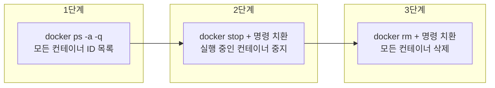

개발·테스트 과정에서 쌓인 Docker 컨테이너를 정리할 때, 하나씩 삭제하는 대신 **모든 컨테이너를 한 번에 중지하고 삭제**하는 방법을 정리했다. 사용하는 명령은 `docker ps`(목록 확인), `docker stop`(중지), `docker rm`(삭제)이며, 셸의 명령 치환 `$( ... )`과 `-q` 옵션을 조합하면 일괄 처리할 수 있다.

---

## 컨테이너 목록 확인

삭제하려면 먼저 **컨테이너 ID(또는 이름)**를 알아야 한다.

### 실행 중인 컨테이너만 보기

```bash
docker ps
```

### 모든 컨테이너 보기 (중지된 것 포함)

중지된 컨테이너까지 포함하려면 `-a` 또는 `--all`을 붙인다.

```bash
docker ps -a
docker ps --all
```

| 옵션 | 설명 |
|------|------|
| `-a`, `--all` | 모든 컨테이너 표시 (기본값은 실행 중인 것만) |
| `-q`, `--quiet` | 컨테이너 ID만 출력 (일괄 삭제 시 사용) |
| `-f`, `--filter` | 조건에 맞는 컨테이너만 필터 (예: `status=exited`) |

---

## 컨테이너 삭제: `docker rm`

### 사용법

```text
docker rm [OPTIONS] CONTAINER [CONTAINER...]
```

컨테이너 ID 또는 이름을 넘기면 해당 컨테이너가 삭제된다. 여러 개를 한 번에 넘길 수 있다.

### 주요 옵션

```bash
docker rm --help
```

| 옵션 | 설명 |
|------|------|
| `-f`, `--force` | 실행 중인 컨테이너를 강제 삭제 (SIGKILL 후 제거) |
| `-l`, `--link` | 지정한 링크만 제거 |
| `-v`, `--volumes` | 컨테이너에 연결된 익명 볼륨도 함께 삭제 |

- **실행 중인 컨테이너**는 기본적으로 삭제되지 않는다. 먼저 `docker stop`으로 중지하거나, `docker rm -f`로 강제 삭제해야 한다.
- 볼륨까지 정리하려면 `docker rm -v`를 사용한다. 이름이 있는 볼륨(named volume)은 삭제되지 않는다.

### 예시: 단일·다수 컨테이너 삭제

```bash
# 단일 컨테이너 삭제 (중지된 경우)
docker rm my_container

# 실행 중인 컨테이너 강제 삭제
docker rm -f redis

# 컨테이너와 익명 볼륨 함께 삭제
docker rm -v my_container

# 여러 개 한 번에 삭제
docker rm container1 container2 container3
```

---

## 모든 컨테이너 일괄 삭제

한 번에 하나씩 삭제하지 않고, **전체 컨테이너를 중지한 뒤 일괄 삭제**하려면 아래 순서를 따른다.

### 절차 요약

1. **모든 컨테이너 ID 나열**: `docker ps -a -q` (또는 `docker ps -a --quiet`)
2. **실행 중인 컨테이너 중지**: `docker stop $(docker ps -a -q)`
3. **모든 컨테이너 삭제**: `docker rm $(docker ps -a -q)`

`-q`는 컨테이너 ID만 출력하므로, `$( ... )`로 그 목록을 `docker stop`·`docker rm`의 인자로 넘기는 구조다.

### 흐름도



### 실행 예시

```bash
# 1) 모든 컨테이너 중지 (실행 중인 것만 SIGTERM/SIGKILL 전달)
docker stop $(docker ps -a -q)

# 2) 모든 컨테이너 삭제
docker rm $(docker ps -a -q)
```

- `docker ps -a -q`가 비어 있으면(컨테이너가 하나도 없으면) `docker stop`·`docker rm`에 인자가 넘어가지 않아, 일부 셸에서는 에러 메시지가 나올 수 있다. 이 경우는 무시해도 된다.
- Windows에서는 PowerShell 또는 Bash(WSL, Git Bash 등)에서 위와 같이 사용한다. CMD만 쓰는 환경에서는 `for` 루프 등으로 동일한 동작을 조합해야 한다.

### 대안: 중지된 컨테이너만 삭제

이미 중지된 컨테이너만 골라서 삭제하려면 `--filter status=exited`를 사용할 수 있다.

```bash
docker rm $(docker ps -a -q --filter status=exited)
```

또는 `xargs`를 쓰는 방식:

```bash
docker ps -a -q --filter status=exited | xargs docker rm
```

---

## `docker stop` 옵션 참고

일괄 중지 시 기본 동작만으로 충분하지만, 필요하면 아래 옵션을 사용할 수 있다.

```bash
docker stop --help
```

| 옵션 | 설명 |
|------|------|
| `-t`, `--time` | 중지 대기 시간(초). 이 시간이 지나면 SIGKILL로 강제 종료 (기본값: 10) |
| `-s`, `--signal` | 컨테이너에 보낼 시그널 지정 (예: SIGTERM, SIGKILL) |

예:

```bash
# 5초 대기 후 강제 종료
docker stop -t 5 my_container
```

---

## 실전 예제 모음

| 목적 | 명령 |
|------|------|
| 실행 중인 컨테이너만 보기 | `docker ps` |
| 중지된 것 포함 전체 목록 | `docker ps -a` |
| ID만 나열 (일괄 처리용) | `docker ps -a -q` |
| 특정 컨테이너 삭제 | `docker rm CONTAINER` |
| 실행 중인 컨테이너 강제 삭제 | `docker rm -f CONTAINER` |
| 컨테이너 + 익명 볼륨 삭제 | `docker rm -v CONTAINER` |
| 모든 컨테이너 중지 | `docker stop $(docker ps -a -q)` |
| 모든 컨테이너 삭제 | `docker rm $(docker ps -a -q)` |
| 중지된 컨테이너만 삭제 | `docker rm $(docker ps -a -q --filter status=exited)` |

---

## 참고 문헌

- [Docker Engine – docker rm](https://docs.docker.com/engine/reference/commandline/rm/) — 컨테이너 삭제 공식 문서
- [Docker Engine – docker ps](https://docs.docker.com/engine/reference/commandline/ps/) — 컨테이너 목록 및 필터 옵션
- [Docker Engine – docker stop](https://docs.docker.com/engine/reference/commandline/stop/) — 컨테이너 중지 및 타임아웃·시그널 옵션
