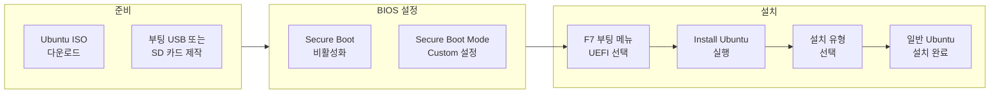

---
categories:
  - LattePanda
date: "2018-12-06T00:00:00Z"
lastmod: "2026-03-16"
description: "LattePanda Alpha 보드에 Ubuntu 16.04 LTS(Xenial)를 설치하는 전체 과정을 정리했습니다. ISO 다운로드, 부팅 USB·SD 제작, UEFI·Secure Boot 비활성화, F7 부팅 메뉴에서 Ubuntu 선택, 설치 유형(단독·듀얼부팅) 선택부터 완료까지 단계별로 안내하며, 실패 시 확인할 트러블슈팅과 참고 문헌을 포함합니다."
redirect_from:
  - /2018/12/06/
title: "[Hardware] LattePanda Alpha에 Ubuntu 16.04 LTS 설치 가이드"
tags:
  - Linux
  - 리눅스
  - Windows
  - 윈도우
  - Hardware
  - 하드웨어
  - Tutorial
  - 튜토리얼
  - Guide
  - 가이드
  - How-To
  - Tips
  - Security
  - 보안
  - Configuration
  - 설정
  - Troubleshooting
  - 트러블슈팅
  - Migration
  - 마이그레이션
  - Open-Source
  - 오픈소스
  - Documentation
  - 문서화
  - DevOps
  - Deployment
  - 배포
  - Automation
  - 자동화
  - OS
  - 운영체제
  - Embedded
  - 임베디드
  - Technology
  - 기술
  - Reference
  - 참고
  - Best-Practices
  - Beginner
  - Education
  - 교육
  - Workflow
  - 워크플로우
  - Blog
  - 블로그
  - Markdown
  - 마크다운
  - Web
  - 웹
  - Networking
  - 네트워킹
  - Productivity
  - 생산성
  - Innovation
  - 혁신
  - Comparison
  - 비교
  - Career
  - 커리어
  - Gadget
  - 가젯
  - Terminal
  - 터미널
  - Shell
  - 셸
  - File-System
  - Clean-Code
  - Implementation
  - 구현
  - Testing
  - 테스트
  - Performance
  - 성능
  - Case-Study
  - 실습
  - Deep-Dive
  - Git
  - GitHub
  - IDE
  - VSCode
  - Docker
  - Kubernetes
  - AWS
  - Cloud
  - 클라우드
  - Mobile
  - 모바일
  - CPU
  - Memory
  - 메모리
  - Process
  - HTTP
  - API
  - Database
  - 데이터베이스
  - Review
  - 리뷰
  - Algorithm
  - 알고리즘
  - Python
  - 파이썬
  - JavaScript
  - Go
  - C
  - Java
  - Rust
  - Ruby
  - Bash
  - PowerShell
  - Node.js
  - React
  - Vue
  - Django
  - Flask
  - Nginx
  - Apache
  - Redis
  - PostgreSQL
  - MySQL
  - MongoDB
  - Elasticsearch
  - Terraform
  - Ansible
  - CI-CD
  - Monitoring
  - 모니터링
  - Debugging
  - 디버깅
  - Error-Handling
  - 에러처리
  - Logging
  - 로깅
  - Code-Quality
  - 코드품질
  - Readability
  - Maintainability
  - Modularity
  - Design-Pattern
  - 디자인패턴
  - OOP
  - 객체지향
  - Software-Architecture
  - 소프트웨어아키텍처
  - Interface
  - 인터페이스
  - Abstraction
  - 추상화
  - Encapsulation
  - 캡슐화
  - Polymorphism
  - 다형성
  - Inheritance
  - 상속
  - Composition
  - 합성
  - Dependency-Injection
  - 의존성주입
  - Refactoring
  - 리팩토링
  - Code-Review
  - 코드리뷰
  - TDD
  - Agile
  - 애자일
  - Scrum
  - Microservices
  - 마이크로서비스
  - REST
  - GraphQL
  - WebSocket
  - Caching
  - 캐싱
  - Scalability
  - 확장성
  - Concurrency
  - 동시성
  - Async
  - 비동기
  - Latency
  - Throughput
  - Load-Balancing
  - Message-Queue
  - Authentication
  - 인증
  - SEO
  - Frontend
  - 프론트엔드
  - Backend
  - 백엔드
  - JSON
  - XML
  - YAML
  - TypeScript
  - Kotlin
  - Swift
  - SQL
  - R
  - Scala
  - Lua
  - Assembly
  - Compiler
  - 컴파일러
  - Thread
  - IO
  - Cache
  - History
  - 역사
  - Culture
  - 문화
  - Science
  - 과학
  - Internet
  - 인터넷
  - Privacy
  - 프라이버시
  - Self-Hosted
  - 셀프호스팅
  - Jekyll
  - Hugo
  - Domain
  - 도메인
  - ChatGPT
  - LLM
  - Prompt-Engineering
  - 프롬프트엔지니어링
  - Tmux
  - Unzip
  - Compression
  - Vim
  - Android
  - iOS
  - Samsung
  - Tablet
  - 태블릿
  - Keyboard
  - 키보드
  - Watch
  - 시계
  - Speaker
  - 스피커
  - Photography
  - 사진
  - Gaming
  - 게임
  - Cycling
  - 자전거
  - Brand
  - 브랜드
  - Conference
  - 컨퍼런스
  - Book-Review
  - 서평
  - Cheatsheet
  - 치트시트
  - Quick-Reference
  - Advanced
  - Pitfalls
  - 함정
  - Edge-Cases
  - 엣지케이스
  - Profiling
  - 프로파일링
  - Benchmark
  - Optimization
  - 최적화
  - Type-Safety
  - Clean-Architecture
  - 클린아키텍처
  - SOLID
  - Domain-Driven-Design
  - Event-Driven
  - CQRS
  - GoF
  - Factory
  - Singleton
  - Observer
  - Strategy
  - Adapter
  - Decorator
  - Proxy
  - Command
  - State
  - Builder
  - Iterator
  - UML
  - Coupling
  - 결합도
  - Cohesion
  - 응집도
  - Modularity
  - Functional-Programming
  - 함수형프로그래밍
  - Problem-Solving
  - 문제해결
  - Coding-Test
  - 코딩테스트
  - Competitive-Programming
  - 경쟁프로그래밍
  - Time-Complexity
  - 시간복잡도
  - Space-Complexity
  - 공간복잡도
  - Data-Structures
  - 자료구조
  - Array
  - 배열
  - Graph
  - 그래프
  - Tree
  - 트리
  - String
  - 문자열
  - Math
  - 수학
  - Simulation
  - 시뮬레이션
  - Greedy
  - 그리디
  - Dynamic-Programming
  - DP
  - 동적계획법
  - Binary-Search
  - 이분탐색
  - BFS
  - DFS
  - Sorting
  - 정렬
  - Recursion
  - 재귀
  - Backtracking
  - 백트래킹
  - Brute-Force
  - 완전탐색
  - Divide-and-Conquer
  - 분할정복
  - Graph-Theory
  - 그래프이론
  - Number-Theory
  - 정수론
  - Combinatorics
  - 조합론
  - Hashing
  - 해싱
  - Stack
  - 스택
  - Queue
  - 큐
  - Heap
  - 힙
  - Set
  - Map
  - Hash-Map
  - Trie
  - Prefix-Sum
  - Segment-Tree
  - 세그먼트트리
  - Binary-Indexed-Tree
  - Shortest-Path
  - 최단경로
  - Dijkstra
  - MST
  - 최소신장트리
  - Topological-Sort
  - 위상정렬
  - DSU
  - Disjoint-Set
  - Two-Pointers
  - Sliding-Window
  - Range-Query
  - Memoization
  - Lazy-Propagation
  - Modular-Arithmetic
  - 모듈러
  - Matrix
  - 행렬
  - Geometry
  - 기하학
  - Convex-Hull
  - Sweep-Line
  - Coordinate-Compression
  - 좌표압축
  - LCA
  - Euler-Tour
  - Game-Theory
  - Bipartite-Matching
  - Network-Flow
  - FFT
  - Convolution
  - Suffix-Array
  - Heavy-Light-Decomposition
  - Mo-Algorithm
  - Persistent-Structure
  - BOJ
  - 백준
  - Baekjoon
  - ICPC
  - USACO
  - Editorial
  - 에디토리얼
image: "wordcloud.png"
---

이 문서는 **LattePanda Alpha**에 **Ubuntu 16.04 LTS (Xenial Xerus)**를 설치하는 방법을 단계별로 정리한 가이드입니다. ISO 다운로드, 부팅 미디어 제작, UEFI·Secure Boot 설정, 설치 유형 선택부터 설치 완료까지 한 흐름으로 따라 할 수 있도록 구성했습니다.

**대상 독자**: LattePanda Alpha 보드를 사용 중이며, Windows 대신 또는 Windows와 함께 Ubuntu 16.04를 설치하려는 사용자.

**필요 사항**:
- LattePanda Alpha 보드
- Ubuntu 16.04 LTS Desktop ISO(AMD64 권장)
- USB 메모리 또는 microSD 카드(부팅 미디어용, 4GB 이상 권장)
- ISO 기록 도구(Etcher, Rufus 등)

---

## 설치 과정 요약

전체 과정은 아래 순서로 진행됩니다.

---

## 1. Ubuntu 16.04 LTS ISO 다운로드

1. [Ubuntu 16.04 LTS (Xenial Xerus) 공식 다운로드 페이지](https://releases.ubuntu.com/16.04/)에 접속합니다.
2. **64-bit PC (AMD64) desktop image**를 선택해 ISO를 받습니다.  
   - 직접 링크: [ubuntu-16.04.7-desktop-amd64.iso](https://releases.ubuntu.com/16.04/ubuntu-16.04.7-desktop-amd64.iso)  
3. 서버용만 필요하다면 **64-bit PC (AMD64) server install image**([ubuntu-16.04.7-server-amd64.iso](https://releases.ubuntu.com/16.04/ubuntu-16.04.7-server-amd64.iso))를 사용할 수 있습니다.

LattePanda Alpha는 x64 계열이므로 **AMD64** 이미지를 사용하는 것이 맞습니다.

---

## 2. 부팅 USB 또는 SD 카드 제작

1. 다운로드한 ISO 파일을 **USB 메모리** 또는 **microSD 카드**에 그대로 기록(굽기)합니다.
2. 사용할 수 있는 도구 예:
   - **Etcher** (권장): [balena.io/etcher](https://etcher.balena.io/)
   - **Rufus**: [rufus.ie](https://rufus.ie/)
   - Windows: [Windows USB/DVD Download Tool](https://www.microsoft.com/en-us/download/windows-usb-dvd-download-tool) 등
3. 기록이 끝나면 미디어를 안전하게 제거한 뒤 LattePanda에서 사용할 준비를 합니다.

**주의**: 기록 시 해당 USB/SD는 전체가 덮어쓰기되므로, 필요한 데이터는 미리 백업하세요.

---

## 3. BIOS에서 Secure Boot 비활성화

1. LattePanda 전원을 켠 뒤 **<kbd>DEL</kbd>** 키를 반복해서 눌러 BIOS 설정 화면으로 들어갑니다.
2. **Security** 메뉴로 이동합니다.
3. **Secure Boot** → **Secure Boot Enable** 을 **Disabled** 로 설정합니다.
4. **Secure Boot Mode** 를 **Custom** 으로 설정합니다.
5. 변경 사항을 저장하고 종료합니다(예: **Save Changes and Exit**).

이 단계를 건너뛰면 Ubuntu 설치 미디어가 UEFI로 인정되지 않아 부팅이 되지 않을 수 있습니다.

---

## 4. 부팅 메뉴에서 Ubuntu 미디어 선택

1. 부팅용 USB 또는 microSD를 LattePanda에 연결합니다.
2. 전원을 켠 뒤 **<kbd>F7</kbd>** 키를 눌러 **부팅 메뉴(Boot Menu)**를 엽니다.
3. 목록에서 **Ubuntu용 UEFI 항목**을 선택합니다.  
   - 보통 **"UEFI Generic ..."** 또는 **"UEFI: USB ..."** 같은 이름으로 표시됩니다.
4. 선택 후 Ubuntu 설치 환경(라이브 데스크톱 또는 설치 프로그램)이 부팅됩니다.

---

## 5. Ubuntu 설치 진행

1. 부팅이 끝나면 **"Install Ubuntu"** 를 선택해 설치를 시작합니다.
2. 언어·키보드·타임존·사용자 계정 등 필요한 옵션을 차례로 설정합니다.
3. **"Installation type"**(설치 유형) 단계에서 다음 중 하나를 선택합니다.
   - **Windows 제거 후 Ubuntu만 설치**: 디스크를 전부 Ubuntu용으로 사용.
   - **Windows와 함께 설치**: 기존 Windows 파티션을 유지한 채 Ubuntu를 나란히 설치(듀얼 부팅).
4. 이후 단계는 일반 Ubuntu 설치와 동일합니다. 화면 안내에 따라 파티션·설치를 진행한 뒤 재부팅하면 됩니다.

---

## 6. 설치 후 확인 사항

- **듀얼 부팅**을 선택한 경우: 전원을 켤 때 GRUB 메뉴에서 Ubuntu / Windows를 선택할 수 있습니다.
- **네트워크·오디오·그래픽** 등은 대부분 자동 인식되며, 문제가 있으면 커널·드라이버 업데이트 후 재시도하거나 제조사/커뮤니티 문서를 참고하면 됩니다.

---

## 트러블슈팅

| 증상 | 확인할 항목 |
|------|-------------|
| Ubuntu 미디어가 부팅되지 않음 | Secure Boot 비활성화 여부, Secure Boot Mode = Custom 여부 |
| 부팅 메뉴에 USB/SD가 안 보임 | 미디어 연결 상태, 다른 USB 포트·리더기 사용, ISO 기록 도구로 다시 굽기 |
| 설치 중 파티션 오류 | 기존 OS 백업 후 설치 유형 재선택, 필요 시 파티션 수동 분할 |
| 설치 후 부팅 시 Windows만 보임 | UEFI 부팅 순서에서 Ubuntu(GRUB)를 첫 번째로 설정 |

---

## 참고 문헌

1. **Ubuntu 16.04 LTS (Xenial) 다운로드** — [releases.ubuntu.com/16.04](https://releases.ubuntu.com/16.04/)
2. **Ubuntu Desktop 설치 가이드(공식)** — [ubuntu.com/download/desktop](https://ubuntu.com/download/desktop)
3. **Balena Etcher (부팅 미디어 제작)** — [balena.io/etcher](https://etcher.balena.io/)
