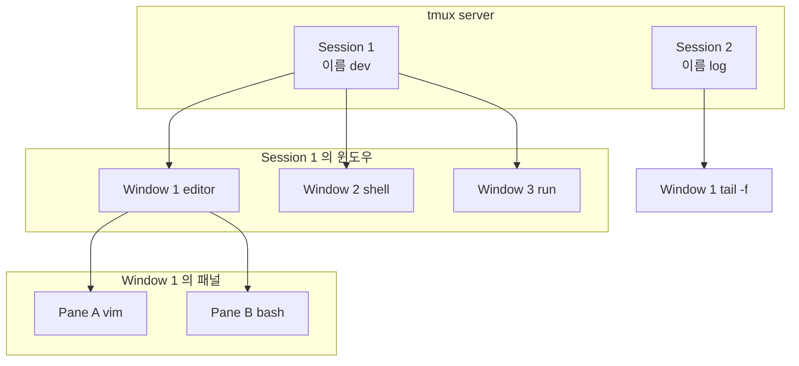

## 개요

**Tmux**(terminal multiplexer)는 한 터미널 화면 안에서 여러 가상 터미널(세션·윈도우·패널)을 만들고 전환·분할해 사용할 수 있게 하는 오픈소스 도구다. SSH 접속이 끊겨도 세션이 백그라운드에서 유지되므로, 다시 붙어서 이어서 작업할 수 있다. 개발·운영·원격 서버 작업을 하는 이들에게 유용하다.

**추천 대상**: 리눅스·macOS 터미널을 자주 쓰는 개발자, SSH로 서버를 다루는 사람, 한 화면에서 여러 셸·로그·에디터를 나누어 쓰고 싶은 사람.

---

## Tmux란 무엇인가

Tmux는 **터미널 멀티플렉서**로, 하나의 물리 터미널(또는 SSH 세션) 안에서 여러 개의 논리 터미널을 만들고 관리한다. 기본 동작은 다음과 같다.

- **서버–클라이언트 구조**: tmux 서버가 세션·윈도우·패널을 관리하고, 터미널에 붙은 클라이언트가 그 내용을 보여 준다.
- **Detach / Attach**: 클라이언트를 떼어 내면(detach) 세션은 서버에 그대로 남고, 나중에 다시 붙어서(attach) 같은 작업 환경을 이어 갈 수 있다.
- **설정**: `~/.tmux.conf`에서 키 바인딩·스타일·기본 동작을 바꿀 수 있다.

일반 터미널만 쓸 때는 SSH가 끊기면 그 안에서 돌던 프로세스도 함께 종료되지만, tmux 세션 안에서 작업하면 세션 자체는 유지되므로 재접속 후 `tmux attach`로 복귀할 수 있다.

---

## 핵심 개념: 세션·윈도우·패널

Tmux는 **세션(Session)** → **윈도우(Window)** → **패널(Pane)** 의 3단계 구조로 화면을 구성한다.

- **세션**: 하나의 작업 단위. 이름을 붙여 구분하며, 여러 클라이언트가 같은 세션에 붙을 수 있다.
- **윈도우**: 세션 안의 탭처럼 동작한다. 한 번에 하나의 윈도우만 보이고, 윈도우 간 전환이 가능하다.
- **패널**: 한 윈도우를 세로·가로로 쪼갠 각 영역. 패널마다 별도의 셸이 동작한다.

계층 구조는 아래 Mermaid 다이어그램과 같다.

- 한 **세션** 안에 여러 **윈도우**가 있고, 한 **윈도우** 안에 여러 **패널**이 있다.
- 노드 ID는 공백 없이 camelCase·의미 있는 이름을 사용했고, 라벨에는 특수문자·등호가 없어 따옴표 없이 작성했다. 줄바꿈은 ` `을 사용했다.

---

## 설치와 기본 명령

### 설치

- **Linux**(Debian/Ubuntu): `sudo apt install tmux`
- **macOS**: `brew install tmux`
- **공식 소스**: [tmux/tmux](https://github.com/tmux/tmux) 에서 빌드 가능

### 기본 명령

| 목적 | 명령 |
|------|------|
| 새 세션 시작 | `tmux` 또는 `tmux new -s 세션이름` |
| 세션 목록 | `tmux ls` |
| 세션에 붙기 | `tmux attach -t 세션이름` 또는 `tmux a -t 세션이름` |
| 세션에서 떼기 | prefix + `d` (기본 prefix는 `Ctrl+b`) |
| 세션 종료 | `tmux kill-session -t 세션이름` |

---

## Prefix와 주요 단축키

Tmux는 **prefix 키** 뒤에 한 키를 눌러 동작한다. 기본 prefix는 **`Ctrl+b`** 이다. `~/.tmux.conf`에서 `set -g prefix C-a` 처럼 바꿀 수 있다.

아래는 기본 prefix(`Ctrl+b`) 기준 자주 쓰는 키다.

### 세션

| 키 | 동작 |
|----|------|
| `d` | 현재 클라이언트 detach |
| `s` | 세션 목록에서 골라 전환 |
| `$` | 현재 세션 이름 바꾸기 |

### 윈도우

| 키 | 동작 |
|----|------|
| `c` | 새 윈도우 만들기 |
| `n` | 다음 윈도우 |
| `p` | 이전 윈도우 |
| `0`~`9` | 해당 번호 윈도우로 이동 |
| `,` | 현재 윈도우 이름 바꾸기 |
| `&` | 현재 윈도우 닫기(확인 후) |

### 패널

| 키 | 동작 |
|----|------|
| `"` | 가로로 패널 분할(위·아래) |
| `%` | 세로로 패널 분할(좌·우) |
| `방향키` | 포커스 이동 |
| `x` | 현재 패널 닫기 |
| `z` | 현재 패널 전체 화면 토글(zoom) |
| `Space` | 레이아웃 순서대로 전환 |

---

## Tmux 관련 유틸: tmuxifier

프로젝트별로 **세션 이름·윈도우 개수·각 윈도우에서 실행할 명령**을 미리 정의해 두고, 한 번에 세션을 띄우거나 불러오고 싶을 때 **tmuxifier**를 쓰면 편하다.

### tmuxifier가 하는 일

- **윈도우·세션 레이아웃을 설정 파일로 정의**: 예를 들어 "dev" 세션에 "editor", "shell", "run" 윈도우를 만들고, 각 윈도우에서 vim, bash, 로그 명령 등을 실행하도록 적어 둘 수 있다.
- **저장·불러오기**: 설정을 파일로 저장해 두고, `tmuxifier load dev` 처럼 불러와서 동일한 구조의 세션을 만들 수 있다.

### 설치와 기본 사용

- 저장소: [jimeh/tmuxifier](https://github.com/jimeh/tmuxifier)
- 설치 방법은 저장소의 README를 따른다. 보통 셸 설정(`.bashrc` 등)에 tmuxifier 경로를 넣고, `tmuxifier init` 등을 실행해 사용한다.
- 레이아웃 정의는 프로젝트 디렉터리나 홈에 `.tmuxifier.conf` 형태로 두고, `tmuxifier load <레이아웃이름>` 으로 불러온다.

이렇게 하면 매번 수동으로 윈도우·패널을 만들 필요 없이, 자주 쓰는 개발·운영 환경을 재현할 수 있다.

---

## 실전 워크플로우 예시

1. **원격 서버 접속**: `ssh user@server` 후 `tmux new -s work` 로 세션 생성.
2. **윈도우·패널 구성**: 코드용 윈도우, 로그용 윈도우, 필요 시 `"`·`%` 로 패널 분할.
3. **Detach**: 작업을 멈출 때 `Ctrl+b d` 로 세션만 남기고 터미널 종료.
4. **재접속**: 나중에 `ssh user@server` 후 `tmux attach -t work` 로 같은 세션 복귀.
5. **tmuxifier 사용 시**: `tmuxifier load work` 로 미리 정의한 레이아웃으로 세션 생성 후 위와 같이 detach/attach 반복.

---

## 종합 정리

- **장점**: SSH 끊김에 강하고, 한 터미널에서 여러 작업을 세션·윈도우·패널로 정리할 수 있으며, 설정 파일과 tmuxifier로 환경을 재현하기 쉽다.
- **단점**: prefix 기반 조작에 익숙해질 때까지 시간이 걸리고, 터미널/터미널 에뮬레이터에 따라 키 전달이 달라 설정을 조정해야 할 수 있다.
- **한 줄 요약**: Tmux는 터미널을 세션·윈도우·패널로 다중화해 끊김 없이 작업을 이어 가게 해 주는 도구이며, tmuxifier와 함께 쓰면 자주 쓰는 레이아웃을 저장·불러오기할 수 있다.

---

## 참고 문헌

1. [tmux/tmux](https://github.com/tmux/tmux) — tmux 공식 소스 저장소 및 문서 링크.
2. [jimeh/tmuxifier](https://github.com/jimeh/tmuxifier) — tmux 세션·윈도우 레이아웃 저장·불러오기 도구.
3. [tmux(1) - OpenBSD Manual](https://man.openbsd.org/tmux) — tmux 공식 매뉴얼(명령·옵션·키 바인딩).
