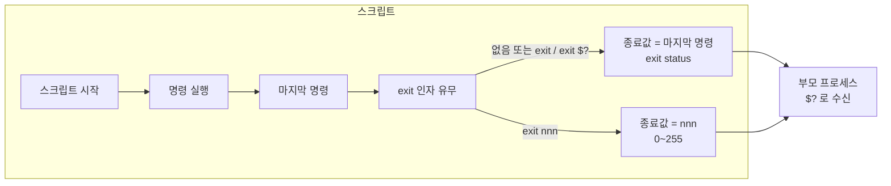

## 개요

**exit** 명령은 C 프로그램에서처럼 스크립트를 종료하며, 부모 프로세스에 전달할 **종료 값(exit status)**을 반환할 수 있다. Bash를 비롯한 유닉스 셸에서는 모든 명령이 실행 후 **종료 상태(exit status, return status, exit code)**를 남기며, 이 값은 조건문·리스트·스크립트 간 연동에 쓰인다. 본문에서는 exit의 동작, `$?`의 의미, `exit nnn` 사용법, 파이프·`!` 연산자와의 관계를 정리한다.

**활용 사례**: 스크립트/함수 성공·실패 판별, CI/CD·자동화에서 단계별 실패 감지, 조건부 실행(`if`, `&&`, `||`), 부모 셸에 에러 코드 전달.

---

## 기본 개념: 종료 상태란

- **정의**: 실행된 명령이 반환하는 값으로, `waitpid` 계열 시스템 콜로 얻을 수 있다.
- **범위**: 0~255(쉘·내장/복합 명령도 이 범위; 125 초과 값은 쉘이 특수 목적으로 사용할 수 있음).
- **관례**:
  - **0** → 성공(success)
  - **비영점** → 실패 또는 예외(에러 코드로 해석 가능)
- **특수 값**(Bash 참조):
  - 명령을 찾을 수 없음: **127**
  - 명령은 있으나 실행 불가: **126**
  - 치명적 시그널 N으로 종료: **128+N**
  - 확장·리디렉션 오류 등: 0보다 큰 값

스크립트와 함수도 **마지막으로 실행된 명령**의 종료 상태를 자신의 종료 상태로 사용한다. `exit nnn`으로 명시적으로 0~255 정수를 부모에 전달할 수 있다.

---

## exit 명령과 스크립트 종료 값

### exit 없이 끝나는 경우

스크립트가 `exit` 없이 끝나면, **마지막에 실행된 명령**의 종료 상태가 스크립트 전체의 종료 상태가 된다.

### exit 사용

- **`exit`** (인자 없음): 마지막 명령의 종료 상태를 그대로 부모에 전달. `exit $?` 또는 `exit` 생략과 동일.
- **`exit nnn`**: 정수 `nnn`(0~255)을 스크립트 종료 값으로 부모에 전달.

```bash
#!/bin/bash

COMMAND_1
# ...
COMMAND_LAST

exit   # 마지막 명령의 종료 상태로 종료
```

```bash
#!/bin/bash

COMMAND_1
# ...
COMMAND_LAST

exit $?   # 위와 동일
```

```bash
#!/bin/bash

COMMAND_1
# ...
COMMAND_LAST

# exit 없음: 스크립트 종료 값 = 마지막 명령의 종료 상태
```

---

## 특수 파라미터 `$?`

`$?`는 **직전에 실행된 명령**의 종료 상태를 담는다.

- 함수 반환 직후: 해당 함수 안에서 **마지막으로 실행된 명령**의 종료 상태.
- **파이프** 실행 직후: 파이프라인에서 **마지막으로 실행된 명령**의 종료 상태(앞쪽 명령 실패는 반영되지 않음).
- 스크립트 종료 후, 부모 셸에서 `echo $?`를 하면 해당 스크립트의 종료 값(마지막 명령 또는 `exit nnn`)을 확인할 수 있다.

즉, 함수에 `return`으로 명시적으로 종료하지 않아도, **마지막 명령의 종료 상태**가 함수의 반환 값 역할을 한다.[^1]

---

## 종료 상태 흐름도

아래 Mermaid 다이어그램은 스크립트 실행부터 부모 프로세스가 종료 값을 받기까지의 흐름을 요약한다.



---

## 예제: exit와 exit status 확인

```bash
#!/bin/bash

echo hello
echo $?    # 0 (성공)

lskdf      # 알 수 없는 명령
echo $?    # 비영점 (실패, 예: 127)

echo

exit 113   # 113을 부모 셸에 전달
# 스크립트 종료 후 셸에서 echo $? 하면 113
```

관례상 `exit 0`은 성공, 비영점은 에러·예외를 의미한다. 스크립트에서 사용자 정의 코드(예: 113)를 쓰려면 0, 1, 2, 126, 127, 128+N 등 **예약된 의미**와 겹치지 않도록 한다.

---

## 조건 반전: `!` 연산자

`!`는 명령 또는 테스트의 **결과를 논리적으로 부정**하며, 그에 따라 **종료 상태**가 바뀐다.

```bash
true
echo "exit status of \"true\" = $?"   # 0
```

```bash
! true
echo "exit status of \"! true\" = $?" # 1
```

- `!`와 명령 사이에 **공백**이 있어야 논리 부정으로 동작한다. `!true`처럼 붙이면 Bash **히스토리 확장**으로 해석되어, 이전 명령(`true`)을 다시 실행하게 된다.
- 파이프 앞에 `!`를 두면, **파이프의 종료 상태만 반전**된다. 파이프 안의 명령 실행 자체는 그대로다.

```bash
ls | bogus_command     # bogus_command: command not found
echo $?                # 127
```

```bash
! ls | bogus_command   # 여전히 bogus_command 실패
echo $?                # 0 (127이 반전됨)
```

---

## 예약된 종료 코드와 주의사항

다음과 같은 종료 코드는 Bash·유닉스에서 **특별한 의미**를 가지므로, 스크립트에서 임의로 사용하지 않는 것이 좋다.

| 값 | 의미 |
|----|------|
| 0 | 성공 |
| 1 | 일반적 오류 |
| 2 | 내장 명령 잘못된 사용(옵션·인자 등) |
| 126 | 명령은 있으나 실행 불가 |
| 127 | 명령을 찾을 수 없음 |
| 128+N | 시그널 N으로 종료(예: 130 = 128+2, SIGINT) |

---

## 참고 문헌

- [GNU Bash Manual — Exit Status](https://www.gnu.org/software/bash/manual/html_node/Exit-Status.html): 공식 정의, 범위, 특수 값, `$?` 설명.
- [Advanced Bash-Scripting Guide — Exit and Exit Status](https://tldp.org/LDP/abs/html/exit-status.html): exit 명령, `$?`, `!` 예제와 관례.

[^1]: 함수가 `return`으로 끝나지 않을 때, 함수의 종료 상태는 함수 내 마지막 명령의 종료 상태와 같다.
