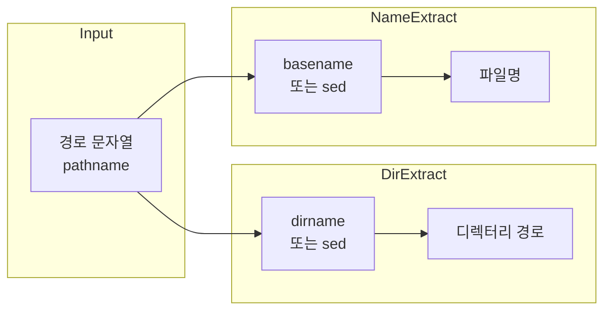

---
categories:
  - Shell
date: "2019-02-13T00:00:00Z"
lastmod: "2026-03-16"
description: "파일 경로 문자열에서 디렉터리 경로와 파일명을 분리하는 방법을 정리한다. sed·dirname·basename 사용법, 슬래시·루트·확장자 제거 등 엣지 케이스와 함께, 스크립트에서 언제 어떤 도구를 쓸지 판단하는 기준을 실습 예제와 함께 소개한다. POSIX·이식성·실무 적용 팁을 포함한다."
redirect_from:
  - /2019/02/13/
tags:
  - Shell
  - 셸
  - Bash
  - Linux
  - 리눅스
  - File-System
  - String
  - 문자열
  - Tutorial
  - 튜토리얼
  - Guide
  - 가이드
  - Terminal
  - 터미널
  - DevOps
  - Automation
  - 자동화
  - Implementation
  - 구현
  - Best-Practices
  - Edge-Cases
  - 엣지케이스
  - Pitfalls
  - 함정
  - Error-Handling
  - 에러처리
  - Documentation
  - 문서화
  - How-To
  - Tips
  - Reference
  - 참고
  - Beginner
  - Comparison
  - 비교
  - Productivity
  - 생산성
  - Education
  - 교육
  - Troubleshooting
  - 트러블슈팅
  - Configuration
  - 설정
  - OS
  - 운영체제
  - Process
  - IO
  - Technology
  - 기술
  - Cheatsheet
  - 치트시트
  - Quick-Reference
  - Open-Source
  - 오픈소스
  - Git
  - GitHub
  - Windows
  - 윈도우
  - macOS
  - IDE
  - Vim
  - Debugging
  - 디버깅
  - Testing
  - 테스트
  - Readability
  - Maintainability
  - Clean-Code
  - 클린코드
  - Refactoring
  - 리팩토링
  - Performance
  - 성능
  - Markdown
  - 마크다운
  - Blog
  - 블로그
  - Networking
  - 네트워킹
  - Workflow
  - 워크플로우
  - Case-Study
  - Deep-Dive
  - 실습
title: "[Shell] 파일 경로에서 디렉터리 경로와 파일명 추출하기"
---

## 도입: 왜 경로와 파일명을 분리하는가

스크립트에서 **파일 경로**(pathname) 문자열을 다룰 때, 전체 경로가 아니라 **디렉터리 부분**만 필요하거나 **파일명만** 필요할 때가 많다. 예를 들어 같은 디렉터리에 로그 파일을 만들거나, 파일명만 바꿔서 다른 경로에 저장하는 경우다. 이런 요구를 충족하려면 문자열을 슬래시(`/`) 기준으로 나누어 디렉터리 경로와 파일명을 각각 얻어야 한다. 이 글에서는 **디렉터리 경로 추출**과 **파일명 추출**을 하는 방법을 정리하고, `sed`·`dirname`·`basename`의 차이와 엣지 케이스, 언제 어떤 도구를 쓸지 판단 기준까지 다룬다.

---

## 정의와 원칙

- **파일 경로(pathname)**: 디렉터리 트리에서 한 파일을 가리키는 문자열. Unix 계열에서는 `/`로 구분한다.
- **디렉터리 경로**: 경로 문자열에서 **마지막 `/` 앞까지**의 부분. 예: `/home/user/docs` → `/home/user`.
- **파일명**: 경로에서 **마지막 `/` 뒤**의 부분. 예: `/home/user/docs/file.txt` → `file.txt`.

경로에 **trailing slash**(끝의 `/`)가 있으면 해석이 달라질 수 있으므로, 도구별 동작을 알고 있어야 한다.

---

## 전체 흐름 한눈에 보기

아래 다이어그램은 "전체 경로 문자열을 입력받아 디렉터리 경로와 파일명을 얻는" 처리 흐름을 요약한다. 스크립트에서는 `dirname`/`basename` 사용을 우선하고, 호환성 제약이 있을 때만 `sed`를 고려하면 된다.



---

## 디렉터리 경로 추출

### sed로 추출하기

**sed**(stream editor)는 텍스트 스트림을 정규식으로 변환하는 유틸리티다. "마지막 `/` 앞까지"를 남기려면, 마지막 `/`와 그 뒤 부분을 빈 문자열로 치환하면 된다. 정규식 `(.+)\/.+`는 "하나 이상 문자 + `/` + 하나 이상 문자"를 잡고, 치환식 `\1`로 첫 번째 그룹(마지막 `/` 앞까지)만 남긴다.

다음 함수는 인자로 받은 경로에서 디렉터리 부분만 출력한다. `-r`은 확장 정규식(ERE)을 쓰기 위한 옵션이다.

```bash
#!/bin/bash
function extract_directory_path() {
    echo "${1}" | sed -r "s/(.+)\/.+/\1/"
}

FILE_PATH=/test/test/test/asdf.txt
RES=$(extract_directory_path "${FILE_PATH}")
echo "${RES}"   # 출력: /test/test/test
```

주의할 점: 경로에 **슬래시가 하나뿐**인 경우(예: `"/foo"`)는 위 정규식이 기대대로 동작하지 않을 수 있다. `/.+`가 매칭되어 빈 문자열이 나오거나 예외가 될 수 있으므로, 이런 엣지 케이스가 있다면 `dirname` 사용이 안전하다.

### dirname으로 추출하기 (권장)

**dirname**은 Single UNIX Specification에 정의된 표준 명령으로, 경로에서 마지막 구성 요소를 제거한 디렉터리 부분을 반환한다. 슬래시만 있는 경로나 끝에 슬래시가 있는 경로도 규격에 맞게 처리하므로, 이식성과 예측 가능성이 높다.

```bash
#!/bin/bash
FILE_PATH=/test/test/test/asdf.txt
RES=$(dirname "${FILE_PATH}")
echo "${RES}"   # 출력: /test/test/test
```

| 입력 예시 | `dirname` 결과 |
|-----------|----------------|
| `/home/user/file.txt` | `/home/user` |
| `/home/user/` | `/home/user` |
| `/` | `/` |
| `file.txt` (상대 경로) | `.` |

스크립트에서 디렉터리 경로만 필요할 때는 **dirname을 우선 사용**하는 것이 좋다. sed는 호환성·엣지 케이스 때문에 유지보수 부담이 크다.

---

## 파일명 추출

### sed로 추출하기

"마지막 `/` 뒤"만 남기려면, "마지막 `/` 앞의 모든 문자"를 빈 문자열로 치환하면 된다. 정규식 `.*\/`는 "어떤 문자든 반복 + `/`"이므로, 마지막 `/`까지 전부 제거하고 그 뒤만 남긴다.

```bash
#!/bin/bash
function extract_file_name() {
    echo "${1}" | sed -r "s/.*\///"
}

FILE_PATH=/test/test/test/asdf.txt
RES=$(extract_file_name "${FILE_PATH}")
echo "${RES}"   # 출력: asdf.txt
```

상대 경로 `file.txt`처럼 슬래시가 없으면 `.*\/`가 매칭되지 않아 전체 문자열이 그대로 나온다. 따라서 "슬래시가 없는 경로"도 파일명 하나로 취급되는 동작은 자연스럽다.

### basename으로 추출하기 (권장)

**basename**은 경로에서 마지막 슬래시 뒤의 부분을 반환하는 표준 명령이다. 선택 인자로 **suffix**를 주면, 그 접미사를 제거한 이름까지 얻을 수 있다. 확장자를 빼고 싶을 때 유용하다.

사용 형식은 다음과 같다.

```text
basename string [suffix]
```

- **string**: 경로 문자열.
- **suffix**: 지정하면 basename은 반환값에서 이 접미사도 제거한다. 단, suffix는 "파일명 끝과 정확히 일치"하는 부분만 제거한다.

다음은 basename의 동작을 보여주는 예시다. trailing slash가 있으면 그 앞 구성 요소가 파일명으로 취급된다.

```bash
# 기본: 마지막 구성 요소만 반환
basename /home/jsmith/base.wiki
# 출력: base.wiki

basename /home/jsmith/
# 출력: jsmith

basename /
# 출력: /
```

suffix를 주면 해당 문자열이 **파일명 끝**에 있을 때만 제거된다.

```bash
# .wiki 접미사 제거
basename /home/jsmith/base.wiki .wiki
# 출력: base

# "ki" 제거 (base.wiki → base.wi)
basename /home/jsmith/base.wiki ki
# 출력: base.wi

# suffix가 전체 파일명과 같으면 제거되지 않음
basename /home/jsmith/base.wiki base.wiki
# 출력: base.wiki
```

스크립트에서 파일명(또는 확장자 제거 이름)이 필요할 때는 **basename 사용을 권장**한다. 이식성과 엣지 케이스 처리 면에서 sed보다 낫다.

---

## 엣지 케이스와 주의사항

| 상황 | dirname / basename | sed (위 예시) |
|------|--------------------|---------------|
| 루트 `/` | dirname → `/`, basename → `/` | 정규식에 따라 오동작 가능 |
| 끝에 `/` 있는 경로 | 규격대로 정규화 | 패턴에 따라 결과가 달라질 수 있음 |
| 슬래시 없는 이름 (`file.txt`) | dirname → `.`, basename → `file.txt` | 파일명은 그대로 나옴 |
| 공백·특수문자 포함 경로 | 인용(`"${var}"`)만 하면 안전 | 인용 누락 시 단어 분리·glob 발생 |

일반적으로 **공백이 포함된 경로**는 반드시 변수를 큰따옴표로 감싸서 전달해야 한다. `$(dirname $FILE_PATH)` 대신 `$(dirname "$FILE_PATH")`처럼 써야 단어 분리와 glob 확장을 막을 수 있다.

---

## 방법 비교와 사용 기준

아래 표는 디렉터리 경로·파일명 추출 시 **sed**와 **표준 명령(dirname/basename)**을 비교한 것이다.

| 구분 | sed | dirname / basename |
|------|-----|---------------------|
| 이식성 | GNU/BSD에 따라 옵션·동작 차이 가능 | POSIX·Single UNIX Specification 준수 |
| 엣지 케이스 | 정규식 설계에 따라 불안정 | 루트·trailing slash 등 규격으로 정의 |
| 가독성 | 정규식 해석 필요 | 의도가 명확함 |
| 사용 시점 | 레거시 환경·제약으로 표준 명령 사용 불가 시 | 대부분의 스크립트 |

**판단 기준 요약**

- **디렉터리 경로가 필요할 때**: `dirname` 사용. sed는 호환성·엣지 케이스 때문에 예외적인 경우에만 사용.
- **파일명(또는 확장자 제거)이 필요할 때**: `basename` 사용. 동일하게 sed는 예외 시에만.
- **여러 경로를 한 번에 처리**하거나 **표준 명령이 없는 환경**이라면, sed 정규식을 쓸 때는 루트·trailing slash·슬래시 하나만 있는 경로를 테스트해 보는 것이 좋다.

---

## 마무리 및 학습 목표

파일 경로에서 **디렉터리 경로**를 얻을 때는 `dirname`, **파일명**을 얻을 때는 `basename`을 쓰는 것이 안전하고 이식성이 좋다. `sed`는 이해용·레거시 대안으로만 두고, 새 스크립트에서는 표준 명령을 우선하자.

**이 글을 읽은 후 달성할 수 있는 것**

- 경로 문자열에서 디렉터리 부분과 파일명 부분을 구분해 설명할 수 있다.
- `dirname`·`basename`의 사용법과 suffix 동작을 설명하고, 예시 경로에 적용할 수 있다.
- `sed`로 같은 결과를 내는 정규식의 의미를 설명할 수 있다.
- 루트(`/`), trailing slash, 슬래시 없는 상대 경로 등 엣지 케이스에서 어떤 도구를 쓸지 판단할 수 있다.
- 공백·특수문자가 포함된 경로를 안전하게 다루기 위해 변수 인용이 필요함을 설명할 수 있다.

**핵심 요약**

| 목적 | 권장 방법 | 비고 |
|------|-----------|------|
| 디렉터리 경로 | `dirname "$path"` | 표준·엣지 케이스 안정 |
| 파일명 | `basename "$path"` | 표준 |
| 확장자 제거 파일명 | `basename "$path" .ext` | suffix는 끝 부분만 제거 |
| 대안(제약 시) | `sed` 정규식 | 테스트·호환성 확인 필요 |

---

## 참고 문헌

- The Open Group, *The Single UNIX Specification, Version 4 — basename*, [Base Specifications](https://pubs.opengroup.org/onlinepubs/9699919799/utilities/basename.html).
- The Open Group, *The Single UNIX Specification, Version 4 — dirname*, [Base Specifications](https://pubs.opengroup.org/onlinepubs/9699919799/utilities/dirname.html).
- GNU, *sed - stream editor*, [GNU sed manual](https://www.gnu.org/software/sed/manual/sed.html).
