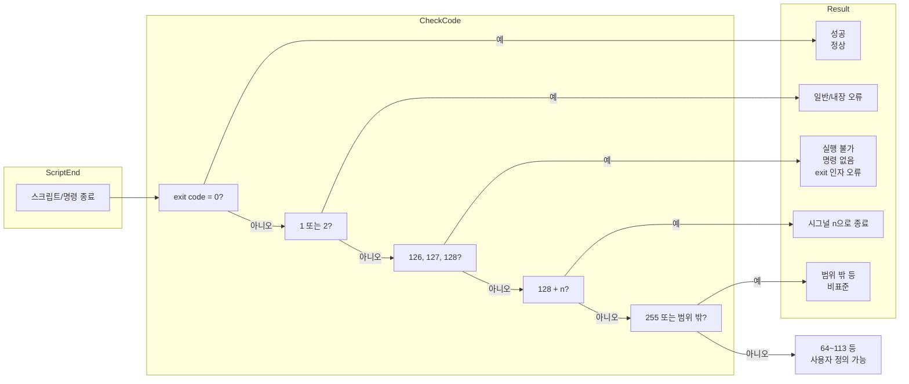

## 개요

**Exit code(exit status)**는 프로세스가 종료될 때 부모 프로세스(또는 셸)에게 전달하는 0~255 범위의 정수 값이다. 리눅스·Bash 환경에서는 **0이 성공**, **0이 아닌 값은 실패 또는 특정 오류 유형**을 나타내는 관례가 널리 쓰인다. 스크립트 작성, CI/CD 파이프라인, 오류 디버깅 시 이 값들의 **미리 예약된 의미**를 알고 있으면 원인 파악과 사용자 정의 코드 설계가 훨씬 수월해진다. 본문에서는 Bash 문서와 관례에 따른 **특수 exit 코드 표**, 사용자 정의 시 권장 범위, 그리고 Mermaid로 정리한 판별 흐름을 다룬다.

## 기본 개념

- **`$?`**: 직전에 실행한 명령(또는 스크립트)의 exit status를 담는 특수 변수이다. Bash·sh 프롬프트에서만 위 표와 일치하며, C-shell(tcsh) 등에서는 일부 값이 다를 수 있다.
- **0**: 성공. 조건문·리스트 연산에서 "참"으로 취급된다.
- **비영(1~255)**: 실패 또는 오류. 값에 따라 "일반 오류", "명령 없음", "시그널로 종료" 등으로 구분된다.
- **255 초과**: exit에 255를 넘는 값을 넘기면 **256으로 나눈 나머지**가 실제 종료 코드로 사용된다. 예: `exit 3809` → 225 (3809 % 256).

## Bash에서 특수 의미를 갖는 Exit 코드 표

| Exit Code | 의미 | 예시 | 비고 |
|-----------|------|------|------|
| **0** | 성공 | 정상 종료 | 조건문·파이프에서 성공으로 처리 |
| **1** | 일반 오류(catchall) | `let "var1 = 1/0"` | 0으로 나누기, 기타 허용되지 않은 연산 등 |
| **2** | 셸 내장 명령 오용 | `empty_function() {}` (일부 문맥) | Bash 문서: 잘못된 키워드·인자·권한, diff의 바이너리 비교 실패 등 |
| **126** | 실행 불가 | `/dev/null`을 실행하려 한 경우 | 권한 문제 또는 실행 파일이 아님 |
| **127** | 명령을 찾을 수 없음 | `illegal_command` | `$PATH` 문제 또는 오타 가능성 |
| **128** | exit에 잘못된 인자 | `exit 3.14159` | exit는 0~255 정수만 허용 |
| **128+n** | 시그널 n으로 종료 | `kill -9`로 스크립트 종료 시 `$?` = 137 (128+9) | 치명적 시그널 번호 N → exit 128+N |
| **130** | Control-C로 종료 | Ctl-C | 시그널 2(SIGINT) → 128+2 = 130 |
| **255*** | 범위 밖 exit | `exit -1` | 0~255 밖의 값은 예측 불가(또는 256 mod) |

\* 255보다 큰 값은 256으로 나눈 나머지가 사용된다. 예: `exit 3809` → 225.

위 표에 따르면 **1, 2, 126~165, 255**는 이미 특수 의미가 있으므로, **사용자 정의 exit 코드**로 쓰면 디버깅 시 혼란이 생길 수 있다. 예를 들어 `exit 127`을 사용자 정의로 쓰면 "명령 없음"과 구분이 어렵다.

## 사용자 정의 Exit 코드 권장 범위

Bash·스크립트 전용으로 쓸 코드는 **시스템·Bash가 쓰지 않는 구간**을 쓰는 것이 좋다. C/C++ 쪽에서는 **sysexits.h**로 64~78 등이 정해져 있으며, 그 문서를 확장한 관례로 **64~113** 구간을 스크립트용으로 쓰자는 제안이 있다(예: Advanced Bash-Scripting Guide). 이렇게 하면:

- 0: 성공
- 1, 2, 126~128+n, 255: 예약
- **64~113**: 사용자 정의용으로 50개 코드 확보

스크립트 내부에서는 "성공=0, 그 외 오류=64~113"처럼 정해 두면, 터블슈팅 시 "127이면 명령 없음, 64면 인자 오류"처럼 구분이 명확해진다. 단, sysexits.h는 주로 C/C++용이므로, 최신 배포판에서 64~78 등이 추가로 예약될 수 있음을 인지하고 쓰면 된다.

## Exit 코드 판별 흐름 (Mermaid)

아래 다이어그램은 스크립트/명령 종료 후 exit 코드를 어떻게 해석할지 단순화한 흐름이다.

노드 ID는 camelCase·PascalCase를 사용했고, 라벨 내 등호·물음표는 Mermaid 파서 오류 방지를 위해 큰따옴표로 감쌌으며, 줄바꿈은 ` `을 사용했다.

## 실전에서의 주의사항

- **`exit 1`**: 많은 스크립트가 "일반 오류" 배일아웃으로 쓴다. 디버깅 시에는 원인이 다양하므로, 가능하면 64~113 구간의 구체적 코드를 쓰는 편이 유리하다.
- **`exit 127`**: 사용자 정의로 쓰지 말 것. "command not found"와 혼동된다.
- **시그널 종료**: 자식이 `kill -9` 등으로 죽으면 부모 셸의 `$?`는 128+시그널번호(예: 137)가 된다.
- **C-shell / tcsh**: Bash·sh와 동일한 값이 아닐 수 있으므로, 표는 Bash/sh 기준으로 해석하는 것이 안전하다.

## Reference

- [GNU Bash Manual – Exit Status](https://www.gnu.org/software/bash/manual/html_node/Exit-Status.html): Bash 공식 문서의 exit status 설명(0–255, 126, 127, 128+N 등).
- [FreeBSD sysexits(3)](https://man.freebsd.org/cgi/man.cgi?query=sysexits&manpath=FreeBSD+15.0-RELEASE+and+Ports): C/C++용 exit 코드 표준(EX_USAGE 64 등), 스크립트에서 사용자 정의 범위 참고용.
- [Advanced Bash-Scripting Guide](https://tldp.org/LDP/abs/html/exitcodes.html): 스크립트용 exit 코드 표와 64–113 사용자 정의 제안(해당 절 참고).

[^1]: 0~255 밖의 exit 값은 예측할 수 없는 동작을 일으킬 수 있다. 255 초과 시 상당수 셸은 값 mod 256을 반환한다.
[^2]: sysexits.h 업데이트로 64~78 등이 추가로 예약될 수 있다. 스크립트와 C/C++ 바이너리 간 사용 구간이 겹치지 않도록 64~113 사용 시 문서를 참고하는 것이 좋다.
