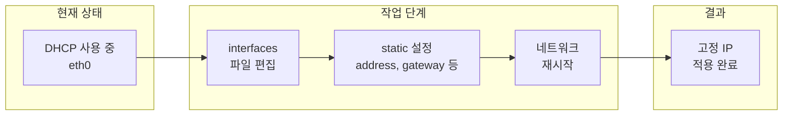

---
categories:
- Linux
- Ubuntu
date: "2019-02-26T00:00:00Z"
description: "Ubuntu 14.04 서버에서 DHCP를 사용 중인 네트워크 인터페이스를 고정 IP(static IP)로 전환하는 방법을 설명합니다. /etc/network/interfaces 편집, address·netmask·gateway·dns-nameservers 설정, 네트워크 재시작 및 연결 확인 절차를 단계별로 안내합니다."
image: "wordcloud.png"
lastmod: "2026-03-16"
redirect_from:
- /2019/02/26/
tags:
- Linux
- 리눅스
- Shell
- 셸
- Bash
- Terminal
- 터미널
- Networking
- 네트워킹
- Configuration
- 설정
- Tutorial
- 튜토리얼
- Guide
- 가이드
- How-To
- Reference
- 참고
- Documentation
- 문서화
- Best-Practices
- Troubleshooting
- 트러블슈팅
- Deployment
- 배포
- Automation
- 자동화
- Workflow
- 워크플로우
- Error-Handling
- 에러처리
- DevOps
- Open-Source
- 오픈소스
- Technology
- 기술
- Education
- 교육
- Productivity
- 생산성
- Beginner
- Implementation
- 구현
- Debugging
- 디버깅
- Security
- 보안
- Internet
- 인터넷
- Web
- 웹
- Blog
- 블로그
- Tips
- Comparison
- 비교
- Career
- 커리어
- Migration
- 마이그레이션
- Hardware
- 하드웨어
- Git
- GitHub
- IDE
- Vim
- Markdown
- 마크다운
- Clean-Code
- 클린코드
- Code-Quality
- 코드품질
- Testing
- 테스트
- Performance
- 성능
- Logging
- 로깅
- Pitfalls
- 함정
- Edge-Cases
- 엣지케이스
title: "[Linux] Ubuntu 14.04 DHCP를 고정 IP(Static IP)로 변경하기"
---

## 개요

Ubuntu Server 설치 시 기본적으로 네트워크 인터페이스는 **DHCP(Dynamic Host Configuration Protocol)** 로 설정되는 경우가 많습니다. 서버를 안정적으로 서비스하려면 고정 IP(Static IP)로 바꾸는 것이 좋습니다. 이 글에서는 GUI 없이 **셸 명령과 설정 파일 편집**만으로 Ubuntu 14.04에서 DHCP를 Static IP로 전환하는 방법을 단계별로 정리합니다.

**대상 독자**: Ubuntu 서버를 직접 설치·운영하는 개발자, 시스템 관리자, 홈랩·셀프호스팅을 구성하는 사용자.

---

## 작업 흐름 요약

아래 다이어그램은 DHCP에서 고정 IP로 바꾸는 전체 흐름을 나타냅니다.



---

## 사전 확인

- **관리자 권한**: `sudo` 사용 가능한 계정
- **인터페이스 이름**: 기본은 `eth0`. 가상화·클라우드 환경에서는 `ens3`, `enp0s3` 등일 수 있으므로 `ip link` 또는 `ifconfig -a`로 확인
- **네트워크 정보**: 사용할 고정 IP, 서브넷 마스크, 게이트웨이, DNS 서버 주소를 네트워크 관리자 또는 공유기 설정에서 미리 확인

---

## 1단계: 인터페이스 설정 파일 열기

Debian/Ubuntu 계열에서는 `/etc/network/interfaces` 파일로 네트워크 인터페이스를 관리합니다.

```bash
sudo vi /etc/network/interfaces
```

또는 `nano` 사용 시:

```bash
sudo nano /etc/network/interfaces
```

---

## 2단계: DHCP에서 static으로 변경

기본 설정은 보통 다음과 비슷합니다.

```bash
auto eth0
iface eth0 inet dhcp
```

`dhcp`를 `static`으로 바꾸고, 아래와 같이 **address**, **netmask**, **gateway**, **dns-nameservers** 를 환경에 맞게 넣습니다. `xxx.xxx.xxx.xxx` 자리에는 실제 값을 입력합니다.

```bash
## The primary network interface
auto eth0
iface eth0 inet static
    address xxx.xxx.xxx.xxx
    netmask xxx.xxx.xxx.xxx
    gateway xxx.xxx.xxx.xxx
    dns-nameservers xxx.xxx.xxx.xxx
```

| 항목 | 설명 |
|------|------|
| `address` | 이 서버에 부여할 고정 IP 주소 |
| `netmask` | 서브넷 마스크 (예: 255.255.255.0) |
| `gateway` | 기본 게이트웨이(라우터) IP |
| `dns-nameservers` | DNS 서버 주소 (공백으로 여러 개 지정 가능, 예: 8.8.8.8 8.8.4.4) |

인터페이스 이름이 `eth0`이 아니라면 해당 이름으로 통일해 수정합니다.

---

## 3단계: 네트워크 서비스 재시작

설정을 적용하려면 네트워킹을 다시 불러와야 합니다. Ubuntu 14.04에서는 아래 명령을 사용합니다.

```bash
sudo /etc/init.d/networking restart
```

또는:

```bash
sudo service networking restart
```

재시작 후 일시적으로 SSH 등 연결이 끊길 수 있으므로, **가능하면 콘솔(직접 접속)에서 실행**하는 것이 안전합니다.

---

## 4단계: 적용 결과 확인

다음 명령으로 IP와 라우팅이 의도대로 적용되었는지 확인합니다.

```bash
# 인터페이스별 IP 확인
ip addr show eth0

# 기본 게이트웨이 확인
ip route show
```

외부 통신이 되는지 핑으로 점검할 수 있습니다.

```bash
ping -c 3 8.8.8.8
ping -c 3 google.com
```

---

## 문제 해결 (Troubleshooting)

- **인터페이스가 올라오지 않음**: `sudo ifup eth0` 로 해당 인터페이스만 올려 보세요. `address`/`netmask`/`gateway` 오타나 같은 대역이 아닌 값은 연결 실패 원인이 됩니다.
- **DNS 해석 실패**: `dns-nameservers`에 올바른 DNS IP가 들어갔는지, 그리고 `ping 8.8.8.8`은 되는데 `ping google.com`만 안 되면 DNS 설정 문제일 가능성이 큽니다.
- **재시작 후에도 이전 IP**: 캐시나 다른 도구(NetworkManager 등)가 우선할 수 있으므로, 서버 환경에서는 `interfaces` 방식만 쓰고 다른 네트워크 관리자는 비활성화하는 구성을 권장합니다.

---

## 참고 문헌

- [Configuring networks - Ubuntu Server documentation](https://documentation.ubuntu.com/server/explanation/networking/configuring-networks/index.html) — 최신 Ubuntu의 네트워크 설정 방식(Netplan 등) 참고.
- [Debian Wiki - NetworkConfiguration](https://wiki.debian.org/NetworkConfiguration) — Debian/Ubuntu 계열 `interfaces` 파일 설명.
- [Linux man pages - interfaces(5)](https://manpages.ubuntu.com/manpages/trusty/man5/interfaces.5.html) — `interfaces` 파일 형식 공식 매뉴얼.

---

이 포스트는 Ubuntu 14.04 기준으로 작성되었습니다. Ubuntu 18.04 이상에서는 **Netplan**을 사용하므로 설정 파일 위치와 문법이 다릅니다. 최신 버전은 위 Ubuntu Server Guide를 참고해 주세요.
