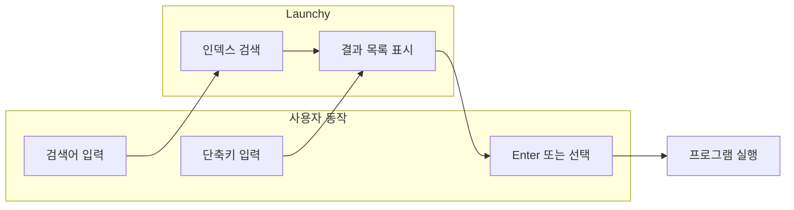

## 개요

이 포스트는 **Launchy**를 사용해 Windows 7에서 프로그램·문서·폴더를 시작 메뉴나 바탕화면 아이콘 없이 몇 번의 타이핑만으로 실행하는 방법을 다룹니다. macOS의 Alfred·Spotlight에 익숙한 사용자에게 추천하며, 기본 검색의 한계·설치·설정·활용 팁까지 한 번에 정리했습니다.

---

## 윈도우 7에서 응용 프로그램을 실행하는 기본 방법

Microsoft Windows에서 가장 흔한 실행 방법은 **시작 버튼 → 모든 프로그램 → 원하는 항목 더블클릭**입니다. 직관적이지만, 설치된 프로그램이 많을수록 스크롤과 탐색에 시간이 많이 듭니다.

시작 메뉴의 **검색 상자**를 쓰는 방법도 있습니다. 이름을 입력하면 프로그램·파일이 필터링되어 바로 실행할 수 있습니다. 다만 다음 한계가 있습니다.

- **정확한 이름**을 알아야 합니다. 한글 이름은 한글로, 영어 이름은 영어로만 검색됩니다.
- **철자가 조금만 틀려도** 결과가 나오지 않거나 원하는 항목이 묻힙니다.
- 시작 메뉴에 등록된 항목 위주라, 임의 폴더의 실행 파일·문서는 잘 잡히지 않습니다.

이런 불편을 줄이기 위해 **키보드 중심의 런처**를 쓰는 것이 좋고, 그 대표 주자가 Launchy입니다.

---

## Launchy란?

[Launchy](https://www.launchy.net/ "Launchy 공식 사이트")는 **오픈 소스 키보드 런처**입니다. macOS의 **Alfred**, **Spotlight**와 같은 역할을 Windows(및 Linux)에서 합니다.

- **시작 메뉴·바탕화면 아이콘·파일 탐색기 없이** 프로그램·문서·폴더·북마크를 실행할 수 있습니다.
- **몇 글자만 입력**해도 퍼지 매칭으로 비슷한 이름을 찾아줍니다. 철자가 조금 틀려도 결과를 보여줍니다.
- **플러그인**으로 계산기, 웹 검색, 북마크 실행 등 기능을 넓힐 수 있습니다.

---

## Launchy 사용 흐름

Launchy로 프로그램을 실행하는 전형적인 흐름은 다음과 같습니다.

1. **단축키**로 Launchy를 띄웁니다.
2. **몇 글자**만 입력하면 인덱스에서 매칭되는 항목이 나옵니다.
3. **Enter**로 첫 번째 항목 실행, 또는 화살표로 선택 후 Enter로 실행합니다.

---

## 설치 및 기본 설정

### 설치

1. [Launchy 공식 사이트](https://www.launchy.net/)에서 최신 설치 파일을 받습니다.
2. 설치 시 **시작 메뉴 폴더 인덱싱** 옵션을 켜 두면, 설치된 프로그램이 자동으로 검색 대상에 포함됩니다.
3. 필요하면 **플러그인**(계산기, 웹 검색 등)을 함께 설치합니다.

### 단축키 설정

- 기본 단축키는 **Alt + Space**인 경우가 많습니다. 다른 런처와 겹치면 **설정 → General → Hotkey**에서 원하는 조합(예: Ctrl + Space, Win + Space)으로 바꿀 수 있습니다.
- 한/영 전환과 겹치지 않는 조합을 쓰는 것이 좋습니다.

### 인덱스(검색 대상) 설정

- **설정 → Catalog**에서 검색할 폴더·시작 메뉴·확장자(.exe, .lnk, .pdf 등)를 지정합니다.
- 불필요한 경로를 넣으면 인덱스가 무거워지므로, 자주 쓰는 프로그램·문서 폴더 위주로 넣는 것을 권장합니다.

---

## 윈도우 기본 검색과의 차이

| 항목 | 윈도우 시작 메뉴 검색 | Launchy |
|------|------------------------|---------|
| 매칭 방식 | 정확한 문자열 위주 | 퍼지 매칭(철자 오타 허용) |
| 검색 대상 | 시작 메뉴·라이브러리 위주 | 사용자 지정 폴더·북마크·플러그인 |
| 호출 방식 | 시작 버튼 클릭 후 입력 | 전역 단축키로 즉시 입력 |
| 확장성 | 제한적 | 플러그인·스킨으로 확장 |

---

## 활용 팁

- **자주 쓰는 프로그램**은 두세 글자만 외워 두면 됩니다. 예: `not` → Notepad, `chr` → Chrome.
- **플러그인**으로 계산기, 구글·위키 검색, 북마크 실행을 단축키 하나로 할 수 있습니다.
- **스킨**을 바꿔 보면 입력창 위치·크기·테마를 취향에 맞게 조정할 수 있습니다.
- 맥에서 **Alfred**·**Spotlight**에 익숙했다면, Launchy를 같은 습관으로 쓰면 Windows에서도 동일한 워크플로를 유지할 수 있습니다.

---

## 정리

- Windows 7 기본 검색은 **정확한 이름·철자**에 의존하고, 호출 경로가 길어서 키보드 중심 사용에는 불리합니다.
- **Launchy**는 퍼지 검색·전역 단축키·플러그인으로 프로그램·문서·폴더를 빠르게 실행할 수 있게 해 줍니다.
- 설치 후 **단축키**와 **Catalog(인덱스)**만 간단히 설정하면, 몇 번의 타이핑으로 대부분의 실행 작업을 처리할 수 있습니다.

원하는 단축키로 Launchy를 띄운 뒤, 프로그램 이름을 조금만 입력해 실행해 보시면 됩니다.
