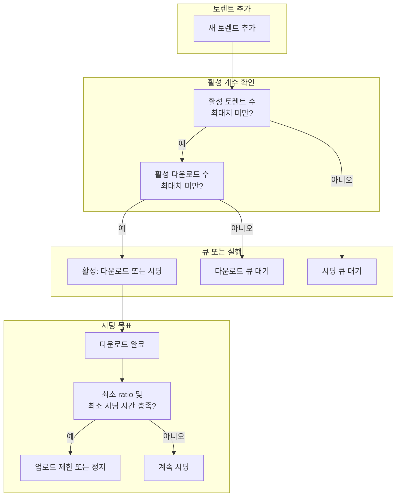

## 개요

µTorrent(뮤토렌트)는 동시에 많은 토렌트를 추가해 두었을 때 **큐(Queue)** 로 활성 개수를 제한하고, **시딩 목표(Seeding Goal)** 로 업로드 양·시간을 제어할 수 있다. 이렇게 하면 대역폭을 나눠 쓰면서도 원하는 토렌트를 우선 처리하거나, 시딩 의무를 충족한 뒤 자동으로 속도를 낮출 수 있다. 이 글은 **Queueing(큐잉) 관련 옵션**을 중심으로, 활성 토렌트 수·활성 다운로드 수, Seeding Goal(최소 ratio·최소 시딩 시간), 시딩 우선순위, 목표 도달 시 업로드 제한까지 정리한다.

**대상 독자**: µTorrent로 다수의 토렌트를 관리하려는 사용자, 시딩 비율·시간을 정해 두고 자동으로 제어하고 싶은 사용자.

---

## 핵심 용어 정리

설정을 이해하려면 다음 용어를 구분하는 것이 좋다.

- **Queue(큐)**: µTorrent가 “동시에 활성으로 둘 작업”의 상한을 정해, 그 수를 넘는 작업은 대기시키는 방식이다. **활성(active)** 은 업로드·다운로드 속도가 특정 임계값 이상인 작업만 셀 수 있도록 옵션으로 조정할 수 있다.
- **Seeding Goal(시딩 목표)**: 다운로드가 끝난 토렌트에 대해 “이만큼 시딩하면 목표 달성”으로 보는 기준이다. **최소 ratio(비율)** 과 **최소 시딩 시간** 을 함께 쓰며, 둘 다 충족한 뒤에만 “목표 도달”로 간주한다. 목표 도달 후에는 업로드 속도 제한 또는 정지로 넘어간다.
- **queue.slow_ul_threshold / queue.slow_dl_threshold**: 업로드·다운로드 속도가 이 값보다 낮으면 “느리게 동작 중”으로 보고, 활성 개수 계산에서 제외할 수 있는 기준값이다(고급 설정).

아래에서는 Options(또는 설정)에서 접근하는 **Queueing** 관련 항목만 다룬다.

---

## Queue 설정

### 활성 토렌트 수와 활성 다운로드 수

µTorrent는 **동시에 활성 상태로 둘 토렌트 개수**와 **그중 다운로드 중인 개수**를 각각 제한한다.

**Maximum number of active torrents(활성 토렌트 최대 개수)**  
이 값은 “강제 시작이 아닌” 토렌트 작업 중에서, µTorrent가 **동시에 활성**으로 둘 수 있는 최대 개수를 정의한다. 여기서 “활성”인지는 **업로드 속도가 `queue.slow_ul_threshold` 이상이거나, 다운로드 속도가 `queue.slow_dl_threshold` 이상인지**로 판단한다. 시딩만 하든, 다운로드만 하든, 둘 다 하든 관계없이, 위 조건을 만족하는 작업만 활성 개수에 포함된다. 이 상한에 도달하면 새 작업은 큐에 들어가 대기한다.

**Maximum number of active downloads(활성 다운로드 최대 개수)**  
이 값은 “강제 시작이 아닌” 토렌트 중 **다운로드 중인** 작업만 따로 제한한다. 다운로드 중이거나 곧 다운로드 모드로 올라갈 작업이 이 개수를 채우면, 추가 다운로드는 큐에서 대기한다. 시딩만 하는 작업은 이 제한에 포함되지 않는다.

정리하면, **전체 활성 토렌트 수**와 **그중 다운로드 개수**를 두 단계로 나눠 제한하는 구조다.

---

## Seeding Goal

시딩 목표는 “다운로드 완료 후 얼마나 올릴 것인가”를 자동으로 제어하기 위한 설정이다.

### 최소 ratio(비율)

**Minimum ratio** 필드에는 **업로드량 ÷ 다운로드량** 비율을 설정한다. 이 비율에 도달하기 전까지는 시딩이 “목표 미달”로 간주된다. 값을 **-1** 로 두면 비율 제한을 쓰지 않는다(무제한). **0**으로 두면 “이 항목은 보지 않고, 아래 최소 시딩 시간만 본다”는 의미가 된다. 비율은 퍼센트 단위로 해석되는 경우가 있으므로, 클라이언트 도움말을 확인하는 것이 좋다. **목표 도달**은 “최소 ratio”와 “최소 시딩 시간” **둘 다** 충족했을 때만 인정된다.

### 최소 시딩 시간

**Minimum seeding time** 필드는 다운로드 완료 후 **몇 분 동안** 정상 속도로 시딩할지를 분 단위로 지정한다. 이 시간이 지나고, 동시에 최소 ratio도 충족했을 때만 시딩 목표 도달로 본다. 둘 중 하나라도 미달이면 아직 목표 미달이다.

### 시딩 우선순위와 시드 수

**Seeding tasks have higher priority than downloading tasks** 옵션을 켜면, “활성 토렌트 최대 개수”에 도달했을 때 **시딩 작업이 다운로드 작업보다 우선** 유지된다. 즉, 시딩 중인 작업이 있으면 다운로드 쪽을 큐로 밀어 넣고, 시딩은 계속 활성으로 둘 수 있다.

**Minimum number of available seeds** 는 “이 토렌트에 시드가 최소 N개 있을 때까지 시딩을 유지한다”는 식의 조건이다. 시드가 부족한 토렌트에 대한 시딩 의무를 강화할 때 쓰면 된다.

---

## 시딩 목표 도달 시 동작

토렌트가 **Seeding Goal을 달성**한 뒤에는, 해당 작업에 대해 업로드를 제한하거나 멈추게 할 수 있다.

**Limit the upload rate to(업로드 속도 제한)**  
이 필드에는 목표 도달 후에 **제한할 업로드 속도**를 KiB/s 단위로 넣는다. **0**으로 두면 “목표 도달 시 해당 토렌트 업로드를 **중지**”한다. 이 값을 바꿔도 **이미 목표에 도달한 작업**에는 적용되지 않고, **아직 목표에 도달하지 않은 작업**에만 적용된다. 따라서 기본값을 바꾼 뒤 추가하는 토렌트부터 새 정책이 적용된다.

---

## 큐 동작 흐름 요약 (Mermaid)

아래 다이어그램은 “새 토렌트 추가 → 활성/다운로드 개수 확인 → 큐 대기 또는 활성화 → 시딩 목표 확인 → 목표 도달 시 제한”까지의 흐름을 단순화한 것이다.

- 노드 **B**, **C**에서 “최대치”는 Options의 **Maximum number of active torrents** 와 **Maximum number of active downloads** 를 의미한다.
- **H**에서 “충족?”은 Minimum ratio와 Minimum seeding time **둘 다** 만족했는지 여부다.

---

## 옵션 적용 범위와 주의사항

다음 사항을 알고 두면 설정이 예상대로 동작하는지 확인하기 쉽다.

- **변경 전에 이미 추가된 토렌트**: Seeding Goal 관련 **기본값**(Minimum ratio, Minimum seeding time, Limit the upload rate to 등)을 바꿔도, **이미 추가된 작업**에는 적용되지 않는다. 각 작업의 속성 창에서 개별적으로 바꾸거나, 새로 추가하는 토렌트부터 새 기본값이 적용된다.
- **강제 시작(Force Start)**: “강제 시작”한 토렌트는 **큐 제한에 포함되지 않는다**. 활성 개수 상한을 넘어서도 강제 시작한 작업은 계속 동작한다.
- **단위**: 업로드 제한 속도는 **KiB/s** 단위이므로, 원하는 KB/s 값과 혼동하지 않도록 한다.

---

## 설정 요약 표

| 항목 | 역할 | 비고 |
|------|------|------|
| Maximum number of active torrents | 동시 활성(업/다운 속도 기준) 토렌트 최대 개수 | queue.slow_* 임계값과 연동 |
| Maximum number of active downloads | 그중 다운로드 중인 작업 최대 개수 | 시딩만 하는 작업은 제외 |
| Minimum ratio | 시딩 목표: 업/다운 비율 | -1 무제한, 0이면 비율 무시 |
| Minimum seeding time | 시딩 목표: 최소 시딩 시간(분) | ratio와 **둘 다** 충족 시 목표 달성 |
| Seeding tasks have higher priority... | 활성 한도 시 시딩 우선 유지 | 다운로드는 큐로 대기 |
| Limit the upload rate to | 목표 도달 후 업로드 제한(KiB/s) | 0이면 정지, 기존 작업에는 미적용 |

---

## 마무리 및 학습 목표

이 글을 읽은 뒤에는 다음을 할 수 있으면 좋다.

- **Queue**와 **Seeding Goal**의 역할을 구분해 설명할 수 있다.
- 활성 토렌트 수·활성 다운로드 수를 각각 어떻게 제한하는지 설명할 수 있다.
- Minimum ratio와 Minimum seeding time이 **둘 다** 충족될 때만 목표 도달로 처리됨을 설명할 수 있다.
- “목표 도달 후 업로드 제한” 값이 **기존 작업이 아니라 이후 추가·설정 변경된 작업**에 적용됨을 알고, 설정 변경 후 기대대로 동작하는지 확인할 수 있다.

µTorrent는 버전과 빌드에 따라 메뉴 위치나 항목 이름이 조금 다를 수 있다. 정확한 위치는 사용 중인 µTorrent의 **Options → Queueing** (또는 설정 내 “큐”/“Queueing”) 및 **앱 내 도움말**을 참고하면 된다.

---

## 참고 문헌

- µTorrent Windows 빌드, Options → Queueing 화면 및 도움말(앱 내).
- µTorrent 공식 포럼 및 사용자 문서(접속 가능한 URL은 사용 중인 클라이언트 버전에 따라 검색하여 확인할 것).
