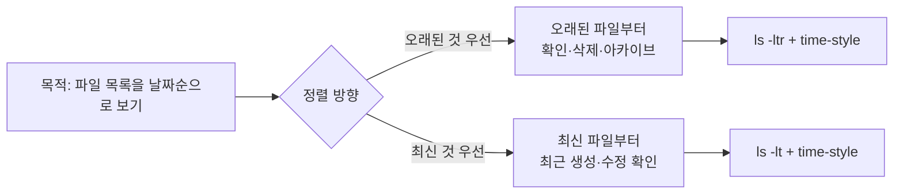

디렉터리 안에 파일이 많을 때, **오래된 파일부터** 정리하고 싶거나 **가장 최근에 만든 파일**만 빠르게 확인하고 싶을 때가 많다. 로그 디렉터리, 캐시 폴더, 다운로드 폴더처럼 시간 순서가 중요한 상황에서는 `ls`만으로는 기본이 이름순이라 한눈에 들어오지 않는다. 이 글에서는 **날짜·시간 기준으로 정렬**해 목록을 보는 방법을, 사용법·옵션 정리·실전 예제·언제 쓸지까지 포함해 정리한다.

<!--more-->

## 왜 날짜순 목록이 필요한가

**ls**는 디렉터리 내용을 나열하는 기본 명령이다. 기본 동작은 **이름(알파벳·로케일)** 순 정렬이라, "가장 오래된 파일"이나 "방금 수정된 파일"을 찾으려면 옵션으로 **정렬 기준**과 **순서**를 바꿔야 한다. 로그 로테이션으로 `audit.log`, `audit.log.1`, … 이 쌓일 때 오래된 것부터 지우려면 "오래된 순" 목록이 필요하고, 배포·빌드 후 "최신 로그가 갱신됐는지" 확인하려면 "최신 순" 목록이 유용하다. 아래에서는 **시간 기준 정렬**에 쓰는 옵션을 정의한 뒤, **오래된 파일부터** / **최신 파일부터** 두 가지 패턴으로 정리한다.

## 사용법과 핵심 옵션

**ls**의 기본 문법은 `ls [옵션] [파일 또는 디렉터리...]` 이다. 정렬과 시간 표시에 쓰는 옵션만 요약하면 다음과 같다.

| 옵션 | 설명 |
|------|------|
| `-l` | 한 줄에 한 파일씩, 권한·소유자·크기·수정 시간 등 **상세 정보** 출력. 시간 정렬 시 보통 함께 씀. |
| `-t` | **수정 시간(mtime)** 기준으로 정렬. 기본은 **최신이 먼저**. |
| `-r` | 정렬 결과를 **역순**으로. `-t`와 함께 쓰면 "오래된 것이 먼저". |
| `-a` | 점(`.`)으로 시작하는 숨김 파일도 포함. |
| `--time-style=FORMAT` | `-l`로 나오는 날짜/시간 형식을 지정. 예: `+%Y-%m-%d %H:%M:%S` 로 ISO 스타일. |

`-t`만 쓰면 "최신 → 오래된 순", `-t`와 `-r`을 같이 쓰면 "오래된 → 최신 순"이 된다. **시간 형식**을 통일해 보기 쉽게 하려면 `--time-style` 로 `date(1)` 형식을 지정하면 된다.

## 정렬 방향 선택 흐름

목적에 따라 "오래된 것부터" vs "최신 것부터" 중 하나를 고르고, 그에 맞는 옵션 조합을 쓰면 된다. 다음 다이어그램은 선택 흐름을 요약한다.



## Method 1: 오래된 파일부터 보기

오래된 로그·캐시를 정리하거나, 아카이브할 파일을 골라야 할 때는 **오래된 항목이 목록 위에** 오는 것이 편하다. `-t`(시간 순)에 `-r`(역순)을 붙이면 "오래된 것 → 최신 것" 순으로 나온다.

출력에 **일반 파일만** 보이게 하려면 `grep ^-` 로 "맨 앞 문자가 `-`인 줄"(일반 파일의 권한 표기)만 걸러낼 수 있다. 디렉터리나 심볼릭 링크는 제외된다. 한 화면씩 보려면 파이프 끝에 `more` 또는 `less`를 붙이면 된다.

```bash
# 기본형: 오래된 파일부터, 상세 정보, 시간 형식 지정
ls --time-style="+%Y-%m-%d %H:%M:%S" -altr | grep ^- | more
```

실행 예는 아래와 같다. `audit.log`가 가장 최신(2013-02-12)이고, 아래로 갈수록 과거 로그다.

```bash
ls --time-style="+%Y-%m-%d %H:%M:%S" -altr | grep ^- | more
# 예시 출력:
# -rw-------  1 root root 1907993 2013-02-12 12:30:01 audit.log
# -r--------  1 root root 6291625 2013-01-24 21:35:24 audit.log.1
# -r--------  1 root root 6291536 2013-01-11 18:03:39 audit.log.2
# -r--------  1 root root 6291516 2013-01-02 14:10:15 audit.log.3
# -r--------  1 root root 6291634 2012-12-05 09:39:43 audit.log.4
```

## Method 2: 최신 파일부터 보기

최근에 생성·수정된 파일이 **목록 맨 위**에 오게 하려면 `-t`만 쓰면 된다. `-r`을 붙이지 않으면 기본이 "최신 → 오래된" 순이다. 배포·빌드 후 로그가 갱신됐는지, 특정 디렉터리에 새 파일이 생겼는지 확인할 때 유용하다.

```bash
# 기본형: 최신 파일부터, 상세 정보, 시간 형식 지정
ls --time-style="+%Y-%m-%d %H:%M:%S" -alt | grep ^- | more
```

실행 예는 아래와 같다. 맨 위에 최신 `audit.log`가 나오고, 아래로 갈수록 오래된 순으로 `audit.log.4`까지 이어진다(출력이 위에서부터 최신 → 오래된 순).

```bash
ls --time-style="+%Y-%m-%d %H:%M:%S" -alt | grep ^- | more
# 예시 출력 (최신 → 오래된 순):
# -rw-------  1 root root 1907993 2013-02-12 12:30:01 audit.log
# -r--------  1 root root 6291625 2013-01-24 21:35:24 audit.log.1
# -r--------  1 root root 6291536 2013-01-11 18:03:39 audit.log.2
# -r--------  1 root root 6291516 2013-01-02 14:10:15 audit.log.3
# -r--------  1 root root 6291634 2012-12-05 09:39:43 audit.log.4
```

## 옵션 조합 한눈에 보기

| 목적 | 옵션 조합 | 비고 |
|------|-----------|------|
| 오래된 파일 먼저 | `-altr` + `--time-style="+%Y-%m-%d %H:%M:%S"` | 파일만 보려면 `grep ^-` |
| 최신 파일 먼저 | `-alt` + `--time-style="+%Y-%m-%d %H:%M:%S"` | `-r` 없음 |
| 디렉터리 포함 | `-ltr` / `-lt` | `grep` 생략 |
| 특정 경로 | `ls ... /var/log` | 마지막에 경로 지정 |

`--time-style`의 `+FORMAT`은 `date(1)`과 동일한 형식 문자열을 쓸 수 있다. 다른 형식이 필요하면 예를 들어 `+%Y-%m-%d`(날짜만), `+%H:%M`(시간만) 등으로 바꾸면 된다.

## 언제 쓰고 언제 피할지

- **쓸 만한 경우**: 현재 디렉터리나 지정한 한두 디렉터리 안의 파일을 **시간순으로 빠르게 보고 싶을 때**. 로그·캐시·다운로드 폴더 정리, 최신 빌드 산출물 확인, 스크립트에서 "가장 최신 파일 하나"만 골라내기(예: `ls -t | head -1`) 등에 적합하다.
- **피하거나 대안을 고려할 경우**: **하위 디렉터리까지 재귀**로 보고 싶으면 `ls -R`은 정렬이 통일되지 않으므로, **find**로 찾은 뒤 **정렬**하거나, **정렬 기준이 중요한 스크립트**에서는 `ls` 파싱 대신 `find -printf` 또는 `stat` 조합을 쓰는 편이 더 안전하다. 파일 개수가 매우 많을 때(수만 개 이상)는 `ls`가 한꺼번에 메모리에 올리므로, **find + sort** 또는 도구별 필터를 쓰는 것이 좋다.

즉, "한 디렉터리 안을 사람이 눈으로 날짜순 확인"할 때는 위 두 가지 방법이 적합하고, 재귀·대량·스크립트 처리에는 다른 도구와 조합하는 것이 좋다.

## 이 글을 읽은 후 할 수 있는 일

- **ls**로 한 디렉터리 안의 파일을 **수정 시간 기준**으로 정렬해 나열할 수 있다.
- **오래된 파일 먼저**가 필요할 때 `-t`와 `-r`을 함께 쓰고, **최신 파일 먼저**가 필요할 때는 `-t`만 쓴다는 것을 구분해 설명할 수 있다.
- `--time-style`로 날짜·시간 출력 형식을 지정하고, 필요 시 `grep ^-`로 일반 파일만 필터링할 수 있다.
- "한 디렉터리 눈으로 확인"에는 위 조합을 쓰고, 재귀·대량·스크립트에서는 **find**·**stat** 등 대안을 고려할 수 있다.

## 참고 문헌

- [GNU Coreutils: ls invocation](https://www.gnu.org/software/coreutils/manual/html_node/ls-invocation.html) — ls 옵션·정렬·시간 형식 공식 설명.
- [Linux man-pages: ls(1)](https://man7.org/linux/man-pages/man1/ls.1.html) — 리눅스 매뉴얼의 ls(1). `--time-style`, `-t`, `-r` 등 상세.
- [GNU Coreutils: Formatting file timestamps](https://www.gnu.org/software/coreutils/manual/html_node/Formatting-file-timestamps.html) — `TIME_STYLE` 및 `date` 형식 설명.

## 핵심 요약

- **오래된 파일부터**: `ls --time-style="+%Y-%m-%d %H:%M:%S" -altr` (+ 필요 시 `grep ^-`, `more`).
- **최신 파일부터**: `ls --time-style="+%Y-%m-%d %H:%M:%S" -alt` (+ 필요 시 `grep ^-`, `more`).
- **-t**: 수정 시간 순, **-r**: 역순. 한 디렉터리 안을 날짜순으로 볼 때 위 조합을 쓰고, 재귀·대량·스크립트에서는 `find`·`stat` 등과 조합하는 것을 권장한다.
