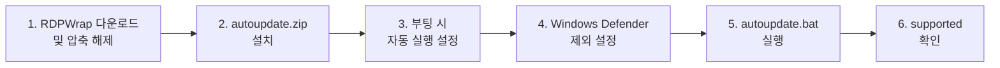

## 개요

**RDP Wrapper**는 Windows의 기본 원격 데스크톱(RDP) 기능을 확장해, **동일 PC에 여러 사용자가 동시에 원격 세션**을 사용할 수 있게 해 주는 오픈소스 도구입니다. 단순 설치만으로는 최신 Windows 10 빌드에서 **\[not supported\]** 상태가 나와 사용할 수 없는 경우가 많습니다. 본 글에서는 **Windows 10 Pro 20H2** 환경에서 해당 오류를 해결하는 **단계별 방법**을 정리합니다.

**추천 대상**: Windows 10 Pro 20H2에서 RDP Wrapper를 쓰려다 "not supported" 메시지로 막힌 사용자, 홈/작업 환경에서 한 PC를 여러 명이 원격으로 나눠 쓰고 싶은 사용자.

---

## 문제 상황

Windows 10 Pro 20H2에 RDP Wrapper를 설치한 뒤 **RDPConf**를 실행하면, 상태가 **\[not supported\]**로 표시되는 경우가 있습니다.


이때는 원격 데스크톱 다중 세션 기능을 사용할 수 없습니다. 아래와 같이 **Listener state**가 붉은색으로 **\[not supported\]**인지 먼저 확인합니다.


Windows 버전이 **20H2**인 경우, 다음 해결 절차를 순서대로 적용하면 됩니다.

---

## 해결 절차 요약

전체 흐름은 아래와 같습니다. 각 단계는 다음 섹션에서 자세히 설명합니다.



---

## 1. RDPWrap 다운로드 및 압축 해제

- [RDP Wrapper Library 릴리스 페이지](https://github.com/stascorp/rdpwrap/releases) 또는 [RDPWrap-v1.6.2.zip 직접 링크](https://sabercathost.com/e2bm/RDPWrap-v1.6.2.zip)에서 **RDPWrap-v1.6.2.zip**을 받습니다.
- 받은 ZIP을 **반드시** `%ProgramFiles%\RDP Wrapper` 경로에 압축 해제합니다. (일반적으로 `C:\Program Files\RDP Wrapper`)

**주의**: RDP Wrapper 파일을 다른 폴더에 풀면 동작하지 않을 수 있으므로, **반드시 위 경로만 사용**합니다.

---

## 2. autoupdate.zip 설치

- [autoupdate.zip](https://github.com/asmtron/rdpwrap/raw/master/autoupdate.zip)을 다운로드한 뒤, **같은 경로** `%ProgramFiles%\RDP Wrapper`에 압축을 풀어 기존 파일과 합칩니다.
- 이 패키지는 Windows 빌드에 맞는 RDP Wrapper INI/패치를 자동으로 맞춰 주는 역할을 합니다.

---

## 3. 부팅 시 자동 실행 설정

재부팅 후에도 RDP Wrapper가 자동으로 맞춰지도록, **관리자 권한**으로 아래 배치 파일을 한 번 실행합니다.

```batch
"%ProgramFiles%\RDP Wrapper\helper\autoupdate__enable_autorun_on_startup.bat"
```

이후 Windows가 부팅될 때마다 `autoupdate.bat`이 자동 실행되도록 등록됩니다.

---

## 4. Windows Defender 제외 설정 (선택)

바이러스 백신 또는 Windows Defender가 RDP Wrapper 관련 파일을 삭제·차단하는 경우가 있습니다. 해당 폴더를 **제외**해 두면 안정적으로 사용할 수 있습니다.

- **설정** → **업데이트 및 보안** → **Windows 보안** → **바이러스 및 위협 방지** → **설정 관리** → **제외**에서 다음 경로를 추가합니다.  
  `%ProgramFiles%\RDP Wrapper`

(제외를 추가하지 않아도 동작하는 경우가 많지만, 예기치 않은 삭제를 막고 싶다면 설정을 권장합니다.)

---

## 5. autoupdate.bat 실행 및 지원 여부 확인

위 단계까지 완료한 뒤, **관리자 권한**으로 다음을 실행합니다.

```batch
"%ProgramFiles%\RDP Wrapper\autoupdate.bat"
```

실행이 끝나면 **RDPConf**를 다시 열어 **\[not supported\]**가 **\[supported\]**로 바뀌었는지 확인합니다. 필요하면 **재부팅** 후 한 번 더 확인하면 더 안정적입니다.

---

## 주의사항

| 항목 | 내용 |
|------|------|
| **경로** | RDPWrap·autoupdate 파일은 반드시 `%ProgramFiles%\RDP Wrapper`에만 두고, 다른 경로에 중복 설치하지 않습니다. |
| **권한** | `autoupdate.bat` 및 부팅 시 자동 실행 등록 스크립트는 **관리자 권한**으로 실행해야 합니다. |
| **Windows 업데이트** | 큰 기능 업데이트(예: 20H2 → 21H1 등) 후에는 **\[not supported\]**가 다시 나올 수 있으므로, 이 경우 위 절차를 다시 수행하거나 autoupdate 커뮤니티 INI를 확인합니다. |

---

## 참고

- [RDP Wrapper Library (stascorp/rdpwrap) — Releases](https://github.com/stascorp/rdpwrap/releases): 공식 릴리스 및 RDPWrap-v1.6.2 다운로드
- [INSTALL of RDP Wrapper and Autoupdater (asmtron/rdpwrap)](https://github.com/asmtron/rdpwrap/blob/master/binary-download.md): RDP Wrapper 및 Autoupdater 설치 안내 원문
- [RDP Wrapper — General discussion (stascorp/rdpwrap)](https://github.com/stascorp/rdpwrap/discussions): 버전별 이슈·토론
