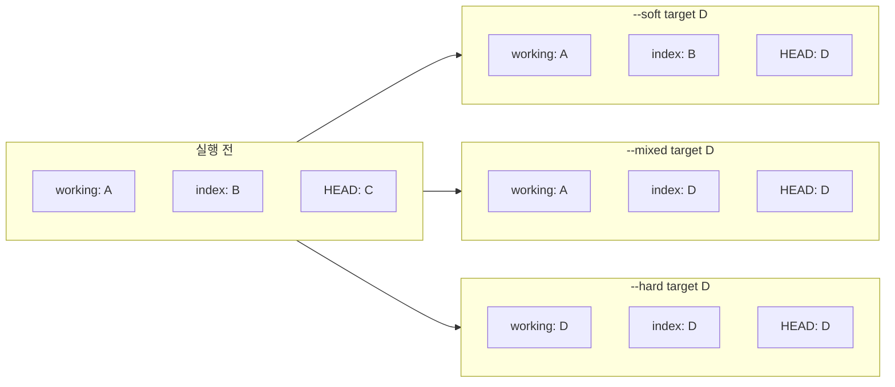

## 개요

작업 중 잘못 수정한 파일을 이전 상태로 되돌리거나, 스테이징을 취소하거나, 최근 커밋을 없었던 것처럼 만들고 싶을 때 **`git reset`**과 **`git restore`**를 사용할 수 있다. 이 글에서는 `git reset`의 세 가지 주요 모드(`--soft`, `--mixed`, `--hard`)가 **작업 디렉터리(working tree)**, **인덱스(staging area)**, **HEAD**에 각각 어떤 영향을 주는지 정리하고, 특정 파일만 되돌리는 방법과 실무에서 자주 쓰는 시나리오를 다룬다.

**대상 독자**: Git을 일상적으로 쓰는 개발자, 커밋·스테이징을 실수했을 때 안전하게 롤백하고 싶은 사람.

---

## git reset이 하는 일

`git reset [--soft | --mixed | --hard] [<commit>]`은 **현재 브랜치의 HEAD**를 지정한 커밋(기본값 `HEAD`)으로 옮기고, 옵션에 따라 **인덱스**와 **작업 디렉터리**까지 함께 맞춘다. 즉, "되돌리기"의 강도가 옵션마다 다르다.

| 옵션 | HEAD | 인덱스(스테이징) | 작업 디렉터리 |
|------|------|------------------|----------------|
| `--soft` | 이동 | 변경 없음 | 변경 없음 |
| `--mixed` (기본) | 이동 | 대상 커밋 기준으로 갱신 | 변경 없음 |
| `--hard` | 이동 | 대상 커밋 기준으로 갱신 | 대상 커밋 기준으로 덮어씀 |

실행 전에 Git은 현재 HEAD를 `ORIG_HEAD`에 저장해 두므로, 필요하면 `git reset --hard ORIG_HEAD`로 되돌릴 수 있다.

---

## reset 모드별 동작 (다이어그램)

아래 다이어그램은 **working / index / HEAD**가 각각 A, B, C 상태일 때, **target** 커밋(D)으로 `git reset --option target`을 실행한 뒤의 결과를 요약한 것이다. (공식 문서의 "DISCUSSION" 표를 기반으로 함.)



- **--soft**: HEAD만 D로 이동. 작업 디렉터리·인덱스는 그대로라, 직전 커밋 메시지 수정 후 다시 커밋하는 용도로 쓰기 좋다.
- **--mixed**: HEAD와 인덱스를 D로 맞추고, 작업 디렉터리 내용은 유지. 스테이징만 취소하고 싶을 때 유용하다.
- **--hard**: HEAD·인덱스·작업 디렉터리 모두 D로 덮어쓴다. **로컬에서만 쓰인 커밋/변경을 완전히 버릴 때만** 사용하고, 이미 push한 히스토리에 대해서는 쓰지 않는 것이 안전하다.

---

## 전체 변경 사항 되돌리기 (작업 디렉터리 + 스테이징)

스테이징되지 않은 수정과 스테이징된 변경을 **전부** 마지막 커밋 상태로 버리고 싶을 때:

```bash
git reset --hard
```

또는 명시적으로:

```bash
git reset --hard HEAD
```

> **주의**: 모든 로컬 수정이 사라지므로, 필요한 변경이 있다면 먼저 `git stash`로 감춰 두거나 브랜치를 만들어 두자.

---

## 특정 파일만 되돌리기

**스테이징만 취소**하고 작업 디렉터리 내용은 유지하려면 (Git 2.23 이상 권장):

```bash
git restore --staged -- <파일경로>
```

예: `src/hello.c`만 스테이징에서 빼기

```bash
git restore --staged -- src/hello.c
```

**작업 디렉터리 파일 내용**까지 마지막 커밋(또는 인덱스) 상태로 복원하려면:

```bash
git restore -- <파일경로>
```

예: `src/hello.c`의 수정 내용을 버리고 복원

```bash
git restore -- src/hello.c
```

같은 동작을 예전에는 `git checkout -- src/hello.c`로 많이 썼다. Git 2.23부터는 **파일 복원**은 `git restore`, **브랜치 전환**은 `git switch`를 쓰는 것이 권장된다. `git reset [<tree-ish>] -- <pathspec>`은 "스테이징만 취소"와 동일하게 인덱스만 갱신하며, 작업 디렉터리 파일을 바꾸려면 `git restore`를 추가로 쓰면 된다.

---

## 시나리오별 사용 예

### 1. 방금 커밋을 취소하고 메시지나 내용만 고쳐서 다시 커밋

```bash
git reset --soft HEAD^
# 원하는 수정 후
git add .
git commit -c ORIG_HEAD
```

`-c ORIG_HEAD`는 이전 커밋 메시지를 그대로 쓰고, `-C`는 수정 없이 재사용한다. 메시지만 고치려면 `git commit --amend`도 사용할 수 있다.

### 2. 스테이징만 취소 (작업 디렉터리는 그대로)

```bash
git reset
# 또는
git reset --mixed HEAD
```

특정 파일만 스테이징 취소:

```bash
git reset -- src/hello.c
# 또는
git restore --staged -- src/hello.c
```

### 3. 로컬에서만 쓴 최근 N개 커밋 완전히 제거

```bash
git reset --hard HEAD~3
```

`HEAD~3`은 "현재 HEAD에서 3개 이전 커밋"을 가리킨다. **이미 push한 커밋**에 대해서는 `git reset --hard` 대신 `git revert`를 사용하는 것이 원격 히스토리와 협업 관점에서 안전하다.

### 4. merge/pull 취소 (작업 디렉터리 변경은 유지)

merge 후 결과가 마음에 들지 않을 때, 로컬 수정은 남기고 merge만 취소:

```bash
git reset --merge ORIG_HEAD
```

로컬 수정까지 모두 버리고 merge 전 상태로 돌아가려면:

```bash
git reset --hard ORIG_HEAD
```

---

## 주의사항

- **`git reset --hard`**는 지정한 커밋 이후의 **작업 디렉터리·인덱스 변경을 복구할 수 없게** 만든다. 반드시 로컬에서만 쓰인 변경에만 사용하자.
- 이미 **push한 커밋**을 되돌리려면 `git reset`보다 **`git revert`**로 역커밋을 만드는 방식이 일반적이다. 팀원과 공유한 브랜치에서는 `reset --hard` 후 force-push는 피하는 것이 좋다.
- 실수 후 복구가 필요하면 `git reflog`로 이전 HEAD 위치를 찾고, 그 커밋으로 `git reset --hard <commit>` 할 수 있다.

---

## 참고 문헌

1. [git-reset - Git 공식 문서](https://git-scm.com/docs/git-reset)  
   `--soft` / `--mixed` / `--hard` / `--merge` / `--keep` 설명과 working/index/HEAD 변화 표가 정리되어 있다.

2. [git-restore - Git 공식 문서](https://git-scm.com/docs/git-restore)  
   작업 디렉터리·인덱스 복원, `--staged` / `--source` 사용법과 예제.

3. [Reset, restore and revert - Git 공식 가이드](https://git-scm.com/docs/git#_reset_restore_and_revert)  
   reset, restore, revert의 역할 차이 요약.
