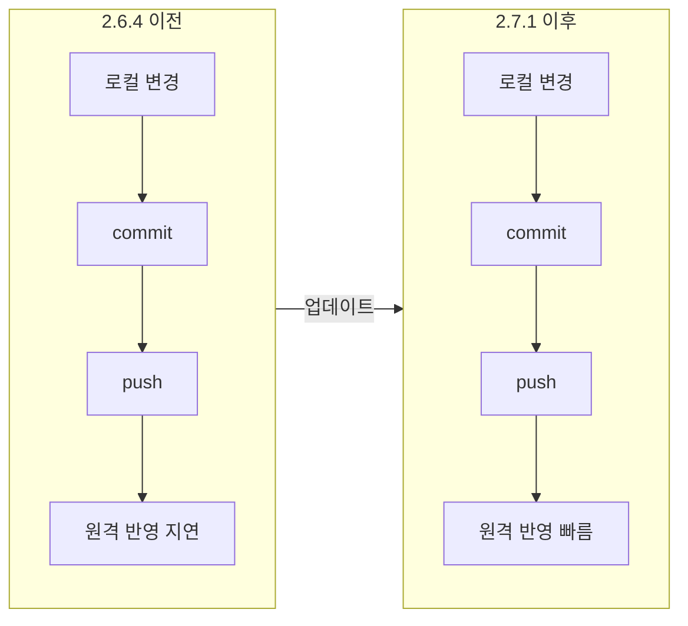

## 개요

이 포스트는 **GitHub Desktop**을 2.7.1로 업데이트한 뒤 체감한 **commit·push 속도 개선**을 정리한 것이다. 2.6.4 이전 버전에서는 원격 Git 작업이 느려 CMD나 Shell 기반 Git 클라이언트에 의존하던 사용자도, 2.7.1부터는 Windows에서 GUI 클라이언트만으로 쾌적하게 작업할 수 있다.

**대상 독자**: Windows에서 GitHub Desktop을 쓰는 개발자, Git GUI 도구를 고민 중인 초보·중급 사용자.

---

## 배경: 2.6.4 이전 버전의 문제

GitHub Desktop 2.6.4 이전 버전에서는 **commit**과 **push** 같은 원격·로컬 Git 작업이 상당히 느렸다. 특히 push 시 응답이 지연되어, 터미널에서 `git push`를 직접 실행하는 것과 비교해 체감 차이가 컸다. 그래서 많은 사용자가 Windows에서도 CMD, PowerShell, Git Bash 등 CLI를 병행하거나, 아예 GUI 대신 CLI만 사용하는 경우가 많았다.

---

## 현재 설치된 버전 확인 방법

설치된 GitHub Desktop 버전은 앱 내에서 다음 순서로 확인할 수 있다.

1. **Help** 메뉴 클릭  
2. **About GitHub Desktop** 선택  
3. 표시된 버전 번호 확인 (예: 2.7.1)

업데이트 시점은 정확히 알기 어렵지만, commit·push가 눈에 띄게 빨라진 뒤 위 경로로 버전을 확인해 보면 2.7.1 이상인 경우가 많다.

---

## 2.7.1 업데이트 내역과 변경 효과

공식 릴리즈 노트에는 **Remote Git operations** 관련 수정·개선이 명시되어 있다. 실제로 commit과 push를 반복해 보면 이전보다 훨씬 빠른 속도로 처리되는 것을 확인할 수 있다.

자세한 변경 사항은 아래 **참고 문헌**의 [GitHub Desktop Release Notes](https://desktop.github.com/release-notes/)에서 확인할 수 있다.

---

## Before / After 체감 흐름 (요약)

2.6.4 이전과 2.7.1 이후의 작업 흐름을 요약하면 아래와 같다. (실제 동작 순서를 단순화한 개념도이다.)

- **Before**: commit 후 push까지 시간이 길고, 원격 반영이 느리게 체감됨.  
- **After**: 동일한 작업이 짧은 시간 안에 끝나, GUI만으로도 일상적인 push가 부담 없음.

---

## 사용 시 참고 사항

- **자동 업데이트**: GitHub Desktop은 기본적으로 자동 업데이트를 사용한다. 최신 버전이 아니면 **Help → About GitHub Desktop**에서 업데이트 유도 메시지를 확인할 수 있다.
- **CLI와 병행**: 2.7.1로 올린 뒤에도 복잡한 브랜치 조작 등은 터미널 `git` 명령과 병행해 쓰면 편하다. 단, 일상적인 commit·push는 GUI만으로도 충분히 쾌적하다.
- **릴리즈 노트**: 추가 버그 수정·기능 변경은 [Release Notes](https://desktop.github.com/release-notes/)를 주기적으로 참고하는 것이 좋다.

---

## 정리

- GitHub Desktop **2.7.1**에서 **Remote Git operations** 개선으로 **commit·push 속도**가 크게 개선되었다.  
- **2.6.4 이전**의 답답함이 줄어들어, **Windows**에서 GUI 기반 Git 클라이언트만으로도 쾌적하게 작업할 수 있다.  
- 버전은 **Help → About GitHub Desktop**으로 확인하고, 상세 내역은 공식 **릴리즈 노트**와 **문서**를 참고하면 된다.

---

## 참고 문헌

1. **GitHub Desktop Release Notes**  
   <https://desktop.github.com/release-notes/>  
   공식 릴리즈 노트. Remote Git operations 등 버전별 변경 사항 확인.

2. **GitHub Desktop 공식 사이트**  
   <https://desktop.github.com/>  
   다운로드 및 소개. "Experience Git without the struggle" 등 제품 개요.

3. **GitHub Docs – GitHub Desktop**  
   <https://docs.github.com/en/desktop>  
   GitHub Desktop 사용법, diff 옵션, commit 관리 등 공식 문서.
